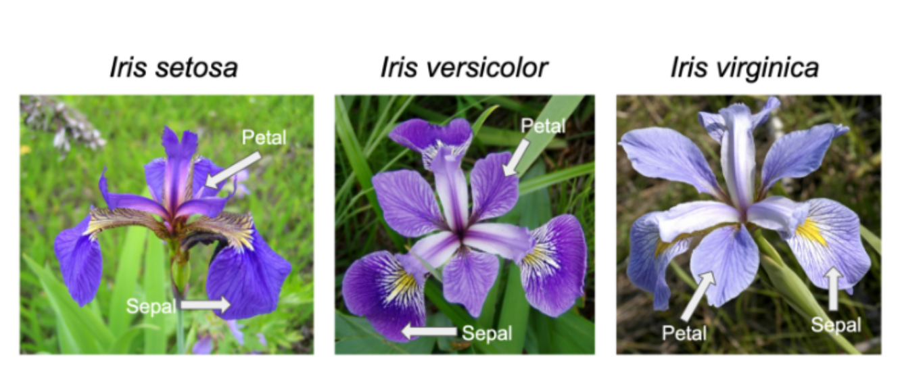

## Developing a mental model for how GPTs work

#### Traditional Software vs Machine Learning
:books: In traditional software, the rules are explicitly programmed by humans whereas in machine learning, the model learns patterns from data

  

#### An ML Model is a Mathematical Function
:books: A Machine Learning Model is a mathematical function that maps inputs to outputs based on patterns learned from training data into model parameters. For instance below is the mathematical function for early GPT models from 2019

  
  

:books: Machine Learning Development includes 2 main phases: Training and Inference, during training the model learns the parameters of the mathematical function ( such as the one above ), during inference the model uses the learned parameters to make predictions on new data
:books: The size of the mathematical function ( i.e number of parameters ) is a key factor in the model's capacity to learn complex patterns from data. Below graph illustrates the number of parameters of these mathematical functions over time. 

## How do we learn the parameters of these mathematical functions?
:books: We first define a loss function which is a mathematical function which sets a target for the model

- Let's work through an example; our aim is to develop a model to distinguish between 3 types of Iris Species - https://en.wikipedia.org/wiki/Iris_(plant)
