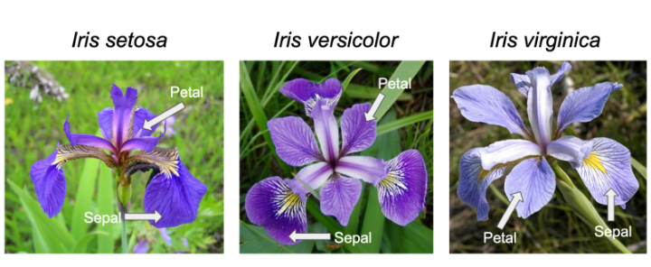
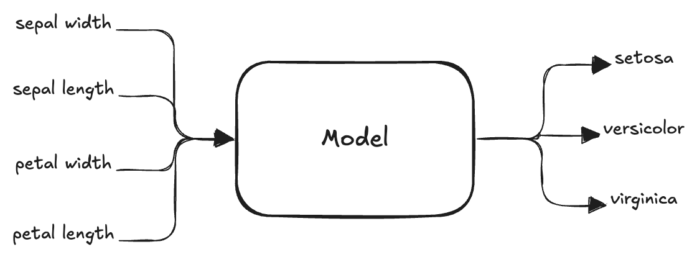
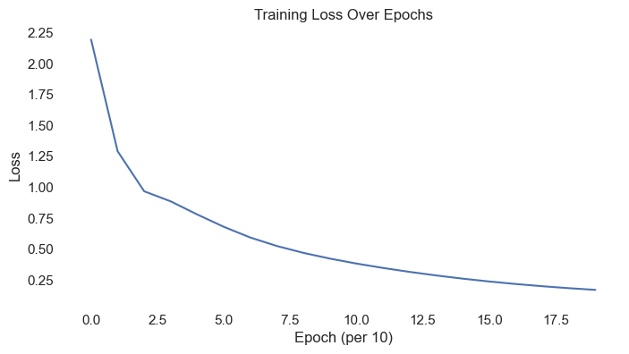
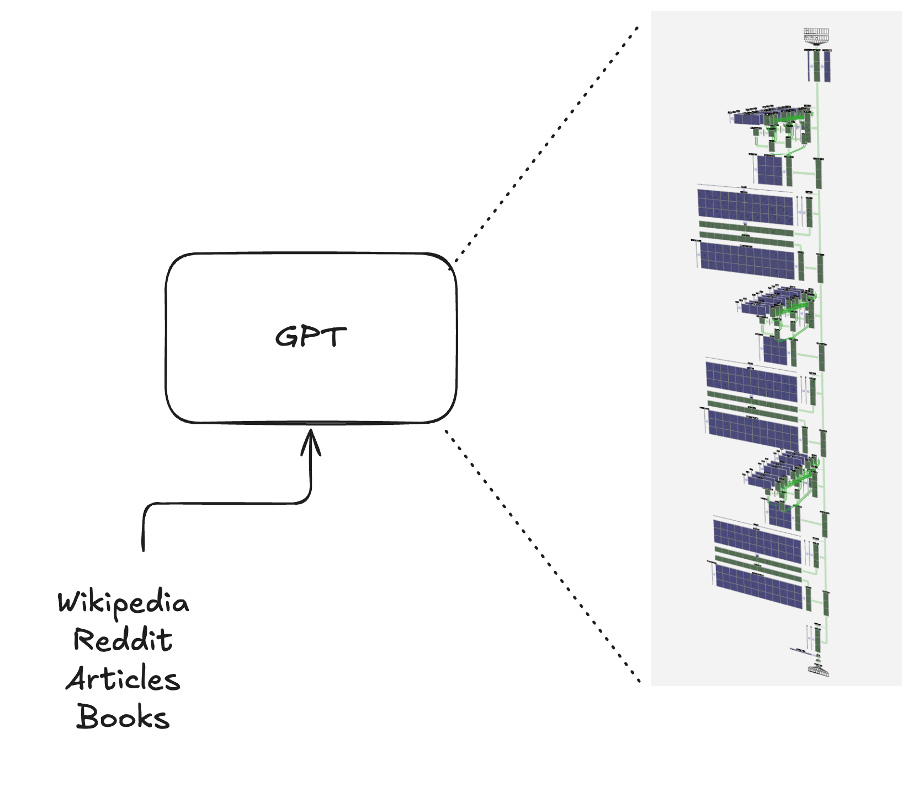
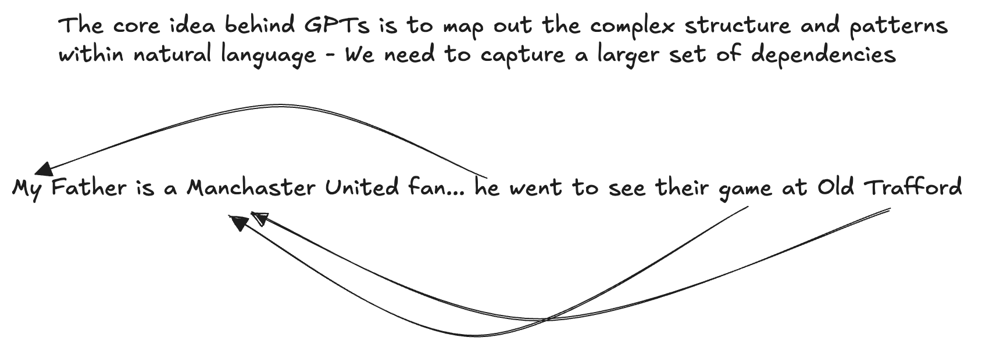

## Developing a mental model for how GPTs work
This guide is designed to help you build an intuitive understanding of how Generative Pretrained Transformers (GPTs) work. We'll introduce just enough core Machine Learning concepts to clarify how these language models function inside. You can approach this either as a conceptual article—skipping the code—or as a hands-on tutorial in which you experiment with code snippets and even train your own model for roughly $5 (GPU rental).

A quick read focusing just on the concepts (skipping code) takes about 30 minutes. If you choose to dig into the code sections for deeper understanding, set aside a couple of hours. Running all the code and training your own model will take about a weekend.

#### Traditional Software vs Machine Learning
:books: In traditional software, rules are explicitly programmed by humans. In machine learning, the model learns patterns from data.
<br/><br/>

<br/><br/>

#### An ML Model is a Mathematical Function
:books: A machine learning model is a mathematical function that maps inputs to outputs based on patterns learned during training. Shown below is the mathematical function for early GPT models (2019).

:books: The size of this function—i.e., the number of parameters—is a key factor in the model’s capacity to learn complex patterns. The graph below shows how the number of parameters in these models has grown over time.


## How do we learn the parameters of these mathematical functions?
:books: ML development has two main phases: **training** and **inference**. During training, the model learns the parameters of the mathematical function (such as the one above). During inference, it uses those learned parameters to make predictions on new data.
:books: We first define a **loss function**—a mathematical function that sets a target for the model.


:books: Let’s work through an example to illustrate the ML training process and the role of the loss function. The goal is to build a model that distinguishes among three Iris species—[Setosa, Versicolor, and Virginica](https://en.wikipedia.org/wiki/Iris_(plant)).

<br/><br/>
- To run the code yourself, open [iris_mlp.ipynb](notebooks/iris_mlp.ipynb). Or expand the section below for a markdown version of the same content. 


**Problem:** Predict Iris species (Setosa, Versicolor, or Virginica) from sepal length/width and petal length/width.


```python
from IPython.display import Image, display

display(Image(filename="../images/iris_io.png"))
display(Image(filename="../images/iris.png"))
```


    

    


    

    


Let's read the dataset.


```python
import pandas as pd
df = pd.read_csv('../dataset/iris.csv')
df.head()
```


<div>
<style scoped>
    .dataframe tbody tr th:only-of-type {
        vertical-align: middle;
    }

    .dataframe tbody tr th {
        vertical-align: top;
    }

    .dataframe thead th {
        text-align: right;
    }
</style>
<table border="1" class="dataframe">
  <thead>
    <tr style="text-align: right;">
      <th></th>
      <th>Unnamed: 0</th>
      <th>Id</th>
      <th>SepalLengthCm</th>
      <th>SepalWidthCm</th>
      <th>PetalLengthCm</th>
      <th>PetalWidthCm</th>
      <th>Species</th>
    </tr>
  </thead>
  <tbody>
    <tr>
      <th>0</th>
      <td>0</td>
      <td>1</td>
      <td>5.1</td>
      <td>3.5</td>
      <td>1.4</td>
      <td>0.2</td>
      <td>Iris-setosa</td>
    </tr>
    <tr>
      <th>1</th>
      <td>1</td>
      <td>2</td>
      <td>4.9</td>
      <td>3.0</td>
      <td>1.4</td>
      <td>0.2</td>
      <td>Iris-setosa</td>
    </tr>
    <tr>
      <th>2</th>
      <td>2</td>
      <td>3</td>
      <td>4.7</td>
      <td>3.2</td>
      <td>1.3</td>
      <td>0.2</td>
      <td>Iris-setosa</td>
    </tr>
    <tr>
      <th>3</th>
      <td>3</td>
      <td>4</td>
      <td>4.6</td>
      <td>3.1</td>
      <td>1.5</td>
      <td>0.2</td>
      <td>Iris-setosa</td>
    </tr>
    <tr>
      <th>4</th>
      <td>4</td>
      <td>5</td>
      <td>5.0</td>
      <td>3.6</td>
      <td>1.4</td>
      <td>0.2</td>
      <td>Iris-setosa</td>
    </tr>
  </tbody>
</table>
</div>


```python
print(f'we have {len(df)} data points')
```

    we have 150 data points


#### Let's define our model


```python
import torch
import torch.nn as nn

class SimpleMLP(nn.Module):
    def __init__(self, *args, **kwargs) -> None:
        super().__init__(*args, **kwargs)
        self.net = nn.Sequential(
            nn.Linear(4, 16),
            nn.ReLU(),
            nn.Linear(16, 3)
        )

    def forward(self, x):
        return self.net(x)
```

Prepare the dataset.


```python
from sklearn.model_selection import train_test_split
from sklearn.preprocessing import LabelEncoder

# Extract features and target
features = df[['SepalLengthCm', 'SepalWidthCm', 'PetalLengthCm', 'PetalWidthCm']].values
labels = df['Species'].values

# Encode labels to integers
le = LabelEncoder()
labels_encoded = le.fit_transform(labels)

# Split dataset into train and test (let's use 80% train, 20% test)
x_train, x_test, y_train, y_test = train_test_split(
    features, labels_encoded, test_size=0.2, random_state=42, stratify=labels_encoded
)

# Convert to torch tensors
x_train = torch.tensor(x_train, dtype=torch.float32)
y_train = torch.tensor(y_train, dtype=torch.long)
x_test = torch.tensor(x_test, dtype=torch.float32)
y_test = torch.tensor(y_test, dtype=torch.long)
```


```python
display(Image(filename="../images/iris_io.png"))

# each row of x_train contains 4 numbers which correspond to Sepal Length/Width and Petal Length/Width
# each row y_train contains a single number where 0=setosa, 1=versicolor and 2=virginica
next(zip(x_train, y_train))
```


    

    


    (tensor([4.4000, 2.9000, 1.4000, 0.2000]), tensor(0))


```python
model = SimpleMLP()
logits = model(x_train[0])
f_loss = nn.CrossEntropyLoss()
f_loss(logits, y_train[0])
```


    tensor(0.9625, grad_fn=<NllLossBackward0>)


## Training loop


```python
model = SimpleMLP()
f_loss = nn.CrossEntropyLoss()
optimizer = torch.optim.Adam(model.parameters(), lr=0.005)

def accuracy(model, x, y):
    model.eval()
    with torch.no_grad():
        logits = model(x)
        preds = logits.argmax(dim=1)
        return (preds == y).float().mean().item()

losses = []
acc = []
import time

for epoch in range(200):
    model.train()
    optimizer.zero_grad()

    # forward ------------>
    logits = model(x_train)        # shape: (N, 3)
    loss = f_loss(logits, y_train) # y shape: (N,)

    # <----------- backward
    loss.backward()
    optimizer.step()


    if epoch % 10 == 0:
        acc.append(accuracy(model, x_test, y_test))
        losses.append(loss.item())
        time.sleep(0.5)

```


```python
import matplotlib.pyplot as plt
import seaborn as sns

sns.set(style="darkgrid", rc={"axes.facecolor": (0, 0, 0, 0)})

# Plot Loss
plt.figure(figsize=(8, 4), facecolor="none")  # transparent figure background
sns.lineplot(x=range(len(losses)), y=losses)
plt.xlabel('Epoch (per 10)')
plt.ylabel('Loss')
plt.title('Training Loss Over Epochs')
plt.gcf().patch.set_alpha(0.0)   # transparent figure background
plt.show()

# Plot Accuracy
plt.figure(figsize=(8, 4), facecolor="none")  # transparent figure background
sns.lineplot(x=range(len(acc)), y=acc)
plt.xlabel('Epoch (per 10)')
plt.ylabel('Accuracy')
plt.title('Test Accuracy Over Epochs')
plt.gcf().patch.set_alpha(0.0)   # transparent figure background
plt.show()
```


    

    


    

    


#### Result: a model with over 98% accuracy at predicting Iris species


So far we have built a simple classification model to demonstrate the loss function, the forward and backward pass, and how optimization reduces loss.

## Autoregressive Models
- It is important to understand how autoregressive models work as a concept before understanding GPTs
You can find a full, runnable version of this n-gram modeling section in the following notebook:
[ngram_name_generator.ipynb](notebooks/ngram_name_generator.ipynb)


Start with building a simple autoregressive model that generates names resembling city names from around the world. We will feed city names from around the world into this model to train and expect it to learn character level dependencies - which is a likely next character if we are trying to generate new city names:

# 

---------------------

1. Lets create a generative model to generate new city names

- Cities dataset consists of existing city names around the world - lets take a peek at the data


```python
import pandas as pd
df = pd.read_csv("../dataset/cities_latin_alphabet.csv")
df.head()

# . indicates end of a city name - this will be useful later when we are generating new city names and want to know when to stop
df["city"] = df["city"] + '.'

df.head()
```


<div>
<style scoped>
    .dataframe tbody tr th:only-of-type {
        vertical-align: middle;
    }

    .dataframe tbody tr th {
        vertical-align: top;
    }

    .dataframe thead th {
        text-align: right;
    }
</style>
<table border="1" class="dataframe">
  <thead>
    <tr style="text-align: right;">
      <th></th>
      <th>city</th>
      <th>country</th>
    </tr>
  </thead>
  <tbody>
    <tr>
      <th>0</th>
      <td>Encamp.</td>
      <td>Andorra</td>
    </tr>
    <tr>
      <th>1</th>
      <td>Canillo.</td>
      <td>Andorra</td>
    </tr>
    <tr>
      <th>2</th>
      <td>Sharjah.</td>
      <td>United Arab Emirates</td>
    </tr>
    <tr>
      <th>3</th>
      <td>Dubai.</td>
      <td>United Arab Emirates</td>
    </tr>
    <tr>
      <th>4</th>
      <td>Asadabad.</td>
      <td>Afghanistan</td>
    </tr>
  </tbody>
</table>
</div>


```python
city_counts_by_country = df.groupby("country")["city"].count().sort_values(ascending=False).head(3)

print(f'We have {len(df)} city names from {len(set(df["country"]))} countries')

print('City Names by Country:')
print(city_counts_by_country)
```

    We have 35320 city names from 185 countries
    City Names by Country:
    country
    Russia           3768
    Philippines      3161
    United States    2929
    Name: city, dtype: int64


```python
import string

# vocab should be all characters from df[city] lowercase
all_cities = df["city"].astype(str).str.lower()
vocab = sorted(set("".join(all_cities)))
vocab_size = len(vocab)

print(f'we have a vocabulary of {vocab_size} characters')
```

    we have a vocabulary of 27 characters


```python
vocab
```


    ['.',
     'a',
     'b',
     'c',
     'd',
     'e',
     'f',
     'g',
     'h',
     'i',
     'j',
     'k',
     'l',
     'm',
     'n',
     'o',
     'p',
     'q',
     'r',
     's',
     't',
     'u',
     'v',
     'w',
     'x',
     'y',
     'z']


Lets define some utility functions to encode/decode city names to/from integer sequences
where encode maps characters to integers and decode maps integers back to characters


```python
stoi = {char: idx for idx, char in enumerate(vocab)}
itos = {idx: char for char, idx in stoi.items()}

def encode(s):
    return [stoi[c] for c in s]
def decode(ids):
    return ''.join([itos[i] for i in ids])

```

example encode/decode


```python
moscow_ids = encode('moscow')
print(f'encoded: {moscow_ids}')
print(f'decoded: {decode(moscow_ids)}')
```

    encoded: [13, 15, 19, 3, 15, 23]
    decoded: moscow


Lets define a simple bigram model using a multi-layer perceptron (MLP)

ℹ️ if the details of the model are unclear, dont worry - we will cover them in more detail on other notebooks


```python
import torch
import torch.nn as nn

class BigramMLP(nn.Module):
    def __init__(self, vocab_size):
        super().__init__()
        self.embed = nn.Embedding(vocab_size, 128)
        self.mlp = nn.Sequential(
            nn.Linear(128, 256),
            nn.ReLU(),
            nn.Linear(256, 256),
            nn.ReLU(),
            nn.Linear(256, vocab_size)
        )

    def forward(self, x):
        x = self.embed(x)   # (B, 128)
        return self.mlp(x) # (B, V)
```


```python
model= BigramMLP(vocab_size)
print(model)
```

    BigramMLP(
      (embed): Embedding(27, 128)
      (mlp): Sequential(
        (0): Linear(in_features=128, out_features=256, bias=True)
        (1): ReLU()
        (2): Linear(in_features=256, out_features=256, bias=True)
        (3): ReLU()
        (4): Linear(in_features=256, out_features=27, bias=True)
      )
    )


lets define a function to generate city names using the the model


```python
import torch.nn.functional as F

def generate(model, start_char, max_len=20):
    idx = torch.tensor([stoi[start_char]])
    out = start_char

    for _ in range(max_len):
        logits = model(idx)
        probs = F.softmax(logits[-1], dim=-1)
        next_idx = torch.multinomial(probs, 1).item()
        next_char = itos[next_idx]
        out += next_char
        if next_char == '.':
            break
        idx = torch.tensor([next_idx])

    return out

```

try and generate a city name  using untrained model


```python
generate(BigramMLP(vocab_size), 's')
```


    'saotdpdoqfvspqtqtxsbw'


Doesnt sound like a city name, lets see if we can train the model to generate better city names

First we need to prepare the training data for bigram model


```python
X, Y = [], []

for name in df["city"]:
    name = name.lower()
    for a, b in zip(name[:-1], name[1:]):

        X.append(stoi[a])
        Y.append(stoi[b])

X = torch.tensor(X)
Y = torch.tensor(Y)
```


```python
model = BigramMLP(vocab_size)
loss_fn = nn.CrossEntropyLoss()
optimizer = torch.optim.Adam(model.parameters(), lr=3e-3)

```


```python
batch_size = 64
steps = 4000

for step in range(steps):
    idx = torch.randint(0, len(X), (batch_size,))
    xb = X[idx]
    yb = Y[idx]

    optimizer.zero_grad()
    logits = model(xb)
    loss = loss_fn(logits, yb)
    loss.backward()
    optimizer.step()

    if step % 500 == 0:
        print(f"step {step} | loss {loss.item():.4f}")

```

    step 0 | loss 3.3241
    step 500 | loss 2.7337
    step 1000 | loss 2.4776
    step 1500 | loss 2.6678
    step 2000 | loss 2.6061
    step 2500 | loss 2.4493
    step 3000 | loss 2.7860
    step 3500 | loss 2.5585


lets generate some city names using the trained model


```python
generate(model, 's')
```


    'stospoy.'


Sounds slightly more like a city name after training - but can we do better?

- So far we have only used the previous character to predict the next character (bigram model) - what if we used the previous two characters (trigram model)?

# Trigram


```python
import torch
import torch.nn as nn
import torch.nn.functional as F

class TrigramMLP(nn.Module):
    def __init__(self, vocab_size):
        super().__init__()
        self.embed = nn.Embedding(vocab_size, 128)

        self.mlp = nn.Sequential(
            nn.Linear(128 * 2, 256),  # two embeddings concatenated
            nn.ReLU(),
            nn.Linear(256, 256),
            nn.ReLU(),
            nn.Linear(256, vocab_size)
        )

    def forward(self, x):
        # x: (B, 2)
        emb = self.embed(x)          # (B, 2, 128)
        emb = emb.view(x.size(0), -1)  # (B, 256)
        return self.mlp(emb)         # (B, V)

```


```python
X, Y = [], []

for name in df["city"]:
    name = name.lower()
    for a, b, c in zip(name[:-2], name[1:-1], name[2:]):
        X.append([stoi[a], stoi[b]])
        Y.append(stoi[c])

X = torch.tensor(X)  # (N, 2)
Y = torch.tensor(Y)  # (N,)

```


```python
model = TrigramMLP(vocab_size)
loss_fn = nn.CrossEntropyLoss()
optimizer = torch.optim.Adam(model.parameters(), lr=3e-3)

batch_size = 256
steps = 4000

for step in range(steps):
    idx = torch.randint(0, len(X), (batch_size,))
    xb = X[idx]   # (B, 2)
    yb = Y[idx]   # (B,)

    optimizer.zero_grad()
    logits = model(xb)
    loss = loss_fn(logits, yb)
    loss.backward()
    optimizer.step()

    if step % 500 == 0:
        print(f"step {step} | loss {loss.item():.4f}")

```

    step 0 | loss 3.3092
    step 500 | loss 2.5658
    step 1000 | loss 2.5153
    step 1500 | loss 2.4037
    step 2000 | loss 2.4796
    step 2500 | loss 2.3055
    step 3000 | loss 2.4676
    step 3500 | loss 2.4329


notice that the loss is lower than the bigram model - this is because the model has more context to make better predictions


```python
def generate(model, start_chars, max_len=20):
    assert len(start_chars) == 2

    idx = [stoi[start_chars[0]], stoi[start_chars[1]]]
    out = start_chars

    for _ in range(max_len):
        x = torch.tensor([idx])  # (1, 2)
        logits = model(x)
        probs = F.softmax(logits[0], dim=-1)

        next_idx = torch.multinomial(probs, 1).item()
        next_char = itos[next_idx]

        out += next_char
        if next_char == '.':
            break

        idx = [idx[1], next_idx]  # slide window

    return out

```


```python
generate(model, 'ca')
```


    'cabonela.'


Not bad! The generated names sound a bit better, althought they are still not perfect

- Lets try increasing the context size even further to 4-grams

# 4-gram


```python
import torch
import torch.nn as nn
import torch.nn.functional as F

class FourGramMLP(nn.Module):
    def __init__(self, vocab_size, embed_dim=128):
        super().__init__()
        self.embed = nn.Embedding(vocab_size, embed_dim)

        self.mlp = nn.Sequential(
            nn.Linear(embed_dim * 4, 256),
            nn.ReLU(),
            nn.Linear(256, 256),
            nn.ReLU(),
            nn.Linear(256, vocab_size)
        )

    def forward(self, x):
        # x: (B, 4)
        emb = self.embed(x)            # (B, 4, 128)
        emb = emb.view(x.size(0), -1)  # (B, 512)
        return self.mlp(emb)           # (B, V)

```


```python
X, Y = [], []

for name in df["city"]:
    name = name.lower()
    if len(name) < 5:
        continue

    for a, b, c, d, e in zip(
        name[:-4], name[1:-3], name[2:-2], name[3:-1], name[4:]
    ):
        X.append([stoi[a], stoi[b], stoi[c], stoi[d]])
        Y.append(stoi[e])

X = torch.tensor(X)  # (N, 4)
Y = torch.tensor(Y)  # (N,)

```


```python
model = FourGramMLP(vocab_size)
loss_fn = nn.CrossEntropyLoss()
optimizer = torch.optim.Adam(model.parameters(), lr=3e-3)

batch_size = 256
steps = 4000

for step in range(steps):
    idx = torch.randint(0, len(X), (batch_size,))
    xb = X[idx]   # (B, 4)
    yb = Y[idx]   # (B,)

    optimizer.zero_grad()
    logits = model(xb)
    loss = loss_fn(logits, yb)
    loss.backward()
    optimizer.step()

    if step % 500 == 0:
        print(f"step {step} | loss {loss.item():.4f}")

```

    step 0 | loss 3.3005
    step 500 | loss 2.1624
    step 1000 | loss 2.0550
    step 1500 | loss 1.9768
    step 2000 | loss 2.0293
    step 2500 | loss 2.1187
    step 3000 | loss 1.8004
    step 3500 | loss 1.9604


looks like the loss has decreased even further - the model is able to make better predictions with more context


```python
def generate(model, start_text, max_len=50):
    assert len(start_text) >= 4

    context = [stoi[c] for c in start_text[-4:]]
    out = start_text

    for _ in range(max_len):
        x = torch.tensor([context])  # (1, 4)
        logits = model(x)
        probs = F.softmax(logits[0], dim=-1)

        next_idx = torch.multinomial(probs, 1).item()
        next_char = itos[next_idx]

        out += next_char
        if next_char == '.':
            break

        context = context[1:] + [next_idx]

    return out

```


```python
generate(model, 'casa')
```


    'casanesti.'


ok it seems like this is the best we can do with this simple MLP

Now lets try an build a bigram model using a more traditional, rule-based software approach 
This last section is optional but it is still cool to see how a simple bigram generator can be build with a few lines of code. 


```python
from collections import Counter

# Count character bigrams from city names
bigram_counts = Counter()

for name in df["city"]:
    name_lower = name.lower()
    # Create bigrams by pairing consecutive characters
    for i in range(len(name_lower) - 1):
        bigram = name_lower[i:i+2]
        bigram_counts[bigram] += 1

# Display most common bigrams
print(f"Total unique bigrams: {len(bigram_counts)}")
print(f"\nTop 20 most common character bigrams:")
for bigram, count in bigram_counts.most_common(20):
    print(f"  '{bigram}': {count}")

# Convert to dictionary for easy access
bigram_dict = dict(bigram_counts)
```

    Total unique bigrams: 654
    
    Top 20 most common character bigrams:
      'a.': 7293
      'an': 6403
      'ar': 4161
      'n.': 4073
      'al': 3514
      'ra': 3446
      'in': 3317
      'e.': 3302
      'i.': 3167
      'la': 3113
      'en': 2994
      'o.': 2985
      'er': 2835
      'ma': 2778
      'ng': 2666
      'on': 2560
      'ta': 2514
      'na': 2496
      'ha': 2351
      'ba': 2326


```python
import random

def generate_from_bigram_dict(start_char, max_len=20):
    """
    Generate text using bigram dictionary counts.
    Selects next character based on bigram frequency.
    """
    if start_char not in vocab:
        return f"Error: '{start_char}' not in vocabulary"
    
    output = start_char
    current_char = start_char.lower()
    
    for _ in range(max_len):
        # Find all bigrams that start with current_char
        possible_bigrams = [(bigram, count) for bigram, count in bigram_dict.items() 
                           if bigram[0] == current_char]
        
        if not possible_bigrams:
            # No bigrams found starting with this character, stop
            break
        
        # Extract next characters and their counts
        next_chars = []
        weights = []
        for bigram, count in possible_bigrams:
            next_char = bigram[1]
            next_chars.append(next_char)
            weights.append(count)
        
        # Weighted random selection based on bigram counts
        next_char = random.choices(next_chars, weights=weights, k=1)[0]
        output += next_char
        
        # Stop if we hit the end marker
        if next_char == '.':
            break
        
        current_char = next_char
    
    return output

# Test generation
print("Generating city names using bigram dictionary:")
for start in ['m', 's', 'k', 'n', 'v']:
    generated = generate_from_bigram_dict(start)
    print(f"  '{start}' -> '{generated}'")

```

    Generating city names using bigram dictionary:
      'm' -> 'mo.'
      's' -> 'shudghanka.'
      'k' -> 'kyuszein.'
      'n' -> 'nyalllencamo.'
      'v' -> 'vloy.'


Now let's shift from modeling at the character level to modeling at the token level (where tokens are, for now, equivalent to words). Instead of generating text letter by letter, we'll focus on generating sequences of words.

Instead of city names, large language models like GPT are trained on vast, diverse datasets collected from sources such as Wikipedia, Reddit, books, articles, and more.  


Previously, our character-level models relied on limited context—just the previous 1, 2, or 3 characters—to predict the next character. However, in real language, the relationships between words and meanings span much longer and more complex dependencies.




GPTs essentially became popular because the "Attention Is All You Need" paper in 2017 ([Vaswani et al., 2017](https://arxiv.org/abs/1706.03762)) demonstrated an effective method for mapping these dependencies in natural language.

This is what we will next!