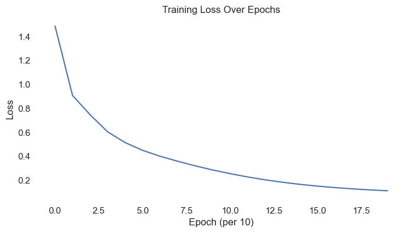
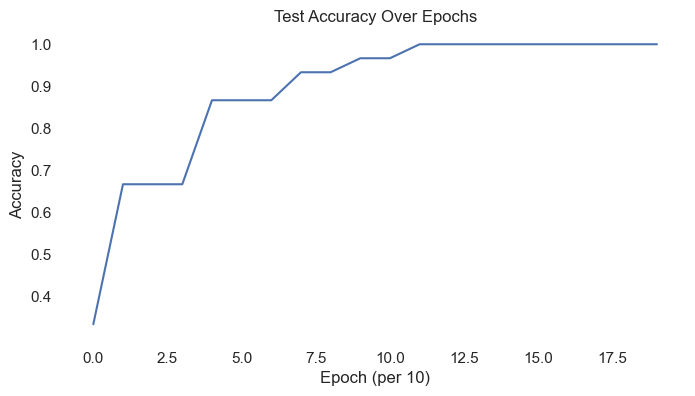

## Problem Statement: Predict Iris Species ( Setosa, versicolor or virginica ) from Sepal length/width and Petal length/width


```python
from IPython.display import Image, display

display(Image(filename="../images/iris_io.png"))
display(Image(filename="../images/iris.png"))
```


    

    


    

    


Lets read the dataset


```python
import pandas as pd
df = pd.read_csv('../dataset/iris.csv')
df.head()
```


<div>
<style scoped>
    .dataframe tbody tr th:only-of-type {
        vertical-align: middle;
    }

    .dataframe tbody tr th {
        vertical-align: top;
    }

    .dataframe thead th {
        text-align: right;
    }
</style>
<table border="1" class="dataframe">
  <thead>
    <tr style="text-align: right;">
      <th></th>
      <th>Unnamed: 0</th>
      <th>Id</th>
      <th>SepalLengthCm</th>
      <th>SepalWidthCm</th>
      <th>PetalLengthCm</th>
      <th>PetalWidthCm</th>
      <th>Species</th>
    </tr>
  </thead>
  <tbody>
    <tr>
      <th>0</th>
      <td>0</td>
      <td>1</td>
      <td>5.1</td>
      <td>3.5</td>
      <td>1.4</td>
      <td>0.2</td>
      <td>Iris-setosa</td>
    </tr>
    <tr>
      <th>1</th>
      <td>1</td>
      <td>2</td>
      <td>4.9</td>
      <td>3.0</td>
      <td>1.4</td>
      <td>0.2</td>
      <td>Iris-setosa</td>
    </tr>
    <tr>
      <th>2</th>
      <td>2</td>
      <td>3</td>
      <td>4.7</td>
      <td>3.2</td>
      <td>1.3</td>
      <td>0.2</td>
      <td>Iris-setosa</td>
    </tr>
    <tr>
      <th>3</th>
      <td>3</td>
      <td>4</td>
      <td>4.6</td>
      <td>3.1</td>
      <td>1.5</td>
      <td>0.2</td>
      <td>Iris-setosa</td>
    </tr>
    <tr>
      <th>4</th>
      <td>4</td>
      <td>5</td>
      <td>5.0</td>
      <td>3.6</td>
      <td>1.4</td>
      <td>0.2</td>
      <td>Iris-setosa</td>
    </tr>
  </tbody>
</table>
</div>


```python
print(f'we have {len(df)} data points')
```

    we have 150 data points


####  Lets Define our model


```python
import torch
import torch.nn as nn

class SimpleMLP(nn.Module):
    def __init__(self, *args, **kwargs) -> None:
        super().__init__(*args, **kwargs)
        self.net = nn.Sequential(
            nn.Linear(4, 16),
            nn.ReLU(),
            nn.Linear(16, 3)
        )

    def forward(self, x):
        return self.net(x)
```

Prepare the dataset


```python
from sklearn.model_selection import train_test_split
from sklearn.preprocessing import LabelEncoder

# Extract features and target
features = df[['SepalLengthCm', 'SepalWidthCm', 'PetalLengthCm', 'PetalWidthCm']].values
labels = df['Species'].values

# Encode labels to integers
le = LabelEncoder()
labels_encoded = le.fit_transform(labels)

# Split dataset into train and test (let's use 80% train, 20% test)
x_train, x_test, y_train, y_test = train_test_split(
    features, labels_encoded, test_size=0.2, random_state=42, stratify=labels_encoded
)

# Convert to torch tensors
x_train = torch.tensor(x_train, dtype=torch.float32)
y_train = torch.tensor(y_train, dtype=torch.long)
x_test = torch.tensor(x_test, dtype=torch.float32)
y_test = torch.tensor(y_test, dtype=torch.long)
```


```python
display(Image(filename="../images/iris_io.png"))

# each row of x_train contains 4 numbers which correspond to Sepal Length/Width and Petal Length/Width
# each row y_train contains a single number where 0=setosa, 1=versicolor and 2=virginica
next(zip(x_train, y_train))
```


    

    


    (tensor([4.4000, 2.9000, 1.4000, 0.2000]), tensor(0))


```python
model = SimpleMLP()
logits = model(x_train[0])
f_loss = nn.CrossEntropyLoss()
f_loss(logits, y_train[0])
```


    tensor(0.5437, grad_fn=<NllLossBackward0>)


## training loop


```python
model = SimpleMLP()
f_loss = nn.CrossEntropyLoss()
optimizer = torch.optim.Adam(model.parameters(), lr=0.005)

def accuracy(model, x, y):
    model.eval()
    with torch.no_grad():
        logits = model(x)
        preds = logits.argmax(dim=1)
        return (preds == y).float().mean().item()

losses = []
acc = []
import time

for epoch in range(200):
    model.train()
    optimizer.zero_grad()

    # forward ------------>
    logits = model(x_train)        # shape: (N, 3)
    loss = f_loss(logits, y_train) # y shape: (N,)

    # <----------- backward
    loss.backward()
    optimizer.step()


    if epoch % 10 == 0:
        acc.append(accuracy(model, x_test, y_test))
        losses.append(loss.item())
        time.sleep(0.5)

        print(loss.item())

```

    tensor([[-1.8849,  0.3340, -0.4996],
            [-2.6536,  0.4540, -0.0321],
            [-3.1613,  0.5104, -0.2928],
            [-2.0384,  0.3720, -0.5478],
            [-2.6501,  0.4191, -0.2272],
            [-3.1024,  0.4639, -0.1304],
            [-2.7418,  0.4666, -0.2240],
            [-3.1099,  0.5423, -0.1607],
            [-3.7713,  0.5959, -0.1493],
            [-4.0128,  0.7863, -0.0676],
            [-3.8074,  0.6578, -0.0447],
            [-2.9552,  0.5074, -0.2268],
            [-2.3104,  0.3205, -0.2311],
            [-2.7241,  0.4700, -0.2940],
            [-2.7236,  0.4348, -0.2829],
            [-2.0411,  0.3933, -0.5245],
            [-2.2636,  0.4895, -0.5698],
            [-3.3178,  0.5371, -0.0550],
            [-3.3063,  0.6092, -0.0920],
            [-2.2745,  0.4522, -0.5624],
            [-3.0198,  0.4760, -0.1836],
            [-2.2570,  0.4861, -0.5764],
            [-3.9736,  0.7644, -0.1744],
            [-2.0732,  0.3748, -0.5359],
            [-2.5343,  0.3923, -0.2934],
            [-3.2648,  0.5895, -0.0451],
            [-3.2102,  0.5205, -0.1128],
            [-2.1904,  0.4458, -0.5320],
            [-2.9881,  0.5084, -0.0612],
            [-2.1555,  0.4359, -0.5582],
            [-2.2623,  0.4843, -0.5552],
            [-2.8483,  0.4555, -0.3255],
            [-2.9964,  0.5356, -0.2415],
            [-2.5463,  0.5963, -0.6245],
            [-3.4514,  0.5727, -0.1702],
            [-3.3706,  0.6212, -0.0745],
            [-2.5863,  0.4019, -0.3614],
            [-2.6143,  0.4411, -0.2047],
            [-3.5535,  0.6132, -0.0741],
            [-3.0826,  0.5671, -0.1598],
            [-2.0515,  0.4159, -0.5236],
            [-3.2650,  0.5603, -0.3588],
            [-2.3502,  0.5099, -0.5912],
            [-3.6028,  0.5930, -0.1185],
            [-2.0250,  0.3618, -0.5370],
            [-2.1916,  0.4437, -0.5610],
            [-3.0354,  0.5133, -0.0573],
            [-2.0649,  0.3817, -0.5598],
            [-1.7957,  0.2588, -0.4743],
            [-1.9823,  0.3506, -0.5408],
            [-2.0197,  0.3674, -0.5200],
            [-2.6832,  0.4482, -0.3176],
            [-3.5176,  0.6510,  0.0523],
            [-2.8335,  0.5081, -0.1950],
            [-2.1730,  0.4354, -0.5714],
            [-3.0999,  0.5647, -0.0894],
            [-2.7678,  0.4714, -0.2580],
            [-3.4448,  0.6327, -0.0446],
            [-1.9929,  0.3804, -0.5255],
            [-3.0354,  0.5133, -0.0573],
            [-2.2570,  0.4417, -0.6018],
            [-2.6143,  0.3879, -0.2147],
            [-2.9746,  0.4690, -0.0412],
            [-2.1413,  0.4384, -0.5280],
            [-3.0376,  0.5270, -0.1017],
            [-2.7177,  0.4769, -0.1780],
            [-3.7968,  0.6398, -0.0356],
            [-2.8771,  0.5300, -0.1789],
            [-3.0737,  0.4922, -0.2723],
            [-3.3662,  0.5773, -0.1053],
            [-2.1651,  0.4268, -0.5633],
            [-2.2253,  0.4485, -0.5202],
            [-2.1689,  0.4461, -0.5690],
            [-2.9109,  0.4438, -0.1076],
            [-2.7255,  0.4414, -0.3036],
            [-3.4959,  0.6175, -0.1673],
            [-2.5670,  0.3960, -0.2693],
            [-3.3868,  0.5319, -0.1470],
            [-3.1056,  0.4913, -0.1671],
            [-3.0612,  0.5801, -0.2483],
            [-2.0384,  0.3720, -0.5478],
            [-3.1467,  0.5047, -0.0105],
            [-2.8783,  0.3949, -0.2095],
            [-2.2477,  0.4761, -0.5154],
            [-3.5505,  0.6048, -0.1137],
            [-2.3102,  0.5162, -0.6099],
            [-3.7937,  0.6882, -0.0950],
            [-2.3645,  0.3585, -0.3231],
            [-3.1915,  0.5446, -0.3031],
            [-2.0451,  0.3826, -0.5269],
            [-2.9381,  0.4965, -0.3016],
            [-3.3084,  0.5733, -0.1765],
            [-2.3306,  0.5180, -0.5440],
            [-1.8259,  0.3212, -0.5191],
            [-3.4922,  0.6361, -0.0979],
            [-3.8397,  0.6098,  0.0258],
            [-3.4254,  0.5678, -0.1362],
            [-2.8709,  0.4103, -0.2629],
            [-3.0834,  0.4996, -0.1746],
            [-2.3985,  0.5300, -0.5758],
            [-3.5621,  0.6258, -0.0609],
            [-2.8017,  0.4961, -0.2498],
            [-3.5994,  0.6570, -0.1246],
            [-3.5638,  0.5995, -0.1116],
            [-2.2730,  0.4732, -0.5893],
            [-2.9863,  0.4930, -0.3281],
            [-2.9469,  0.5252, -0.2236],
            [-2.8029,  0.5169, -0.2657],
            [-2.7795,  0.5043, -0.2572],
            [-3.1269,  0.5228, -0.3562],
            [-2.2091,  0.4432, -0.5742],
            [-3.3119,  0.5534, -0.0487],
            [-2.6669,  0.3796, -0.3038],
            [-2.9011,  0.4976, -0.2632],
            [-2.1050,  0.4233, -0.5396],
            [-2.0384,  0.3720, -0.5478],
            [-2.0048,  0.3782, -0.5360],
            [-2.4089,  0.5417, -0.6275],
            [-3.2716,  0.5592, -0.3007],
            [-1.9850,  0.3719, -0.5175]], grad_fn=<AddmmBackward0>)
    1.4879772663116455
    tensor([[-1.7813e+00,  1.8291e-01, -4.6586e-01],
            [-2.5063e+00,  2.4935e-01,  1.0079e-01],
            [-2.9819e+00,  2.7165e-01, -1.6543e-01],
            [-1.9274e+00,  2.0976e-01, -5.1207e-01],
            [-2.4982e+00,  2.1628e-01, -1.1890e-01],
            [-2.9250e+00,  2.2694e-01,  1.3087e-03],
            [-2.5852e+00,  2.5708e-01, -1.1089e-01],
            [-2.9384e+00,  3.0677e-01, -1.2935e-02],
            [-3.5600e+00,  3.1159e-01,  1.6763e-02],
            [-3.7938e+00,  4.8535e-01,  1.2415e-01],
            [-3.5982e+00,  3.7071e-01,  1.3958e-01],
            [-2.7869e+00,  2.8258e-01, -1.0520e-01],
            [-2.1767e+00,  1.4215e-01, -1.3733e-01],
            [-2.5700e+00,  2.6303e-01, -1.8123e-01],
            [-2.5681e+00,  2.2758e-01, -1.7380e-01],
            [-1.9297e+00,  2.3054e-01, -4.8708e-01],
            [-2.1413e+00,  3.1118e-01, -5.3174e-01],
            [-3.1341e+00,  2.8502e-01,  1.0656e-01],
            [-3.1243e+00,  3.5877e-01,  6.6997e-02],
            [-2.1515e+00,  2.7349e-01, -5.2317e-01],
            [-2.8499e+00,  2.4635e-01, -4.9181e-02],
            [-2.1351e+00,  3.0789e-01, -5.3763e-01],
            [-3.7574e+00,  4.6766e-01,  1.2258e-02],
            [-1.9603e+00,  2.0989e-01, -4.9796e-01],
            [-2.3891e+00,  1.9881e-01, -1.9280e-01],
            [-3.0844e+00,  3.4134e-01,  1.1336e-01],
            [-3.0316e+00,  2.7659e-01,  3.8761e-02],
            [-2.0715e+00,  2.7263e-01, -4.9235e-01],
            [-2.8207e+00,  2.7968e-01,  8.0362e-02],
            [-2.0387e+00,  2.6593e-01, -5.2331e-01],
            [-2.1399e+00,  3.0624e-01, -5.1646e-01],
            [-2.6866e+00,  2.4019e-01, -2.1284e-01],
            [-2.8302e+00,  3.0901e-01, -1.0668e-01],
            [-2.4100e+00,  3.9807e-01, -5.8396e-01],
            [-3.2558e+00,  3.1126e-01, -2.5029e-02],
            [-3.1856e+00,  3.6596e-01,  9.0473e-02],
            [-2.4392e+00,  2.0606e-01, -2.6138e-01],
            [-2.4644e+00,  2.4063e-01, -9.7102e-02],
            [-3.3553e+00,  3.4398e-01,  8.9565e-02],
            [-2.9122e+00,  3.3347e-01, -1.5204e-02],
            [-1.9396e+00,  2.5296e-01, -4.8833e-01],
            [-3.0810e+00,  3.1527e-01, -2.2984e-01],
            [-2.2237e+00,  3.2625e-01, -5.5442e-01],
            [-3.4048e+00,  3.2154e-01,  5.4471e-02],
            [-1.9146e+00,  2.0094e-01, -5.0201e-01],
            [-2.0729e+00,  2.7099e-01, -5.2449e-01],
            [-2.8672e+00,  2.8153e-01,  9.2066e-02],
            [-1.9527e+00,  2.1857e-01, -5.2718e-01],
            [-1.6964e+00,  1.1477e-01, -4.4141e-01],
            [-1.8742e+00,  1.9259e-01, -5.0674e-01],
            [-1.9094e+00,  2.0692e-01, -4.8449e-01],
            [-2.5296e+00,  2.4042e-01, -2.1778e-01],
            [-3.3461e+00,  3.8823e-01,  2.4546e-01],
            [-2.6770e+00,  2.9291e-01, -6.1460e-02],
            [-2.0553e+00,  2.6382e-01, -5.3561e-01],
            [-2.9288e+00,  3.2898e-01,  6.0807e-02],
            [-2.6100e+00,  2.6062e-01, -1.4604e-01],
            [-3.2557e+00,  3.7178e-01,  1.2480e-01],
            [-1.8840e+00,  2.2159e-01, -4.9114e-01],
            [-2.8672e+00,  2.8153e-01,  9.2066e-02],
            [-2.1354e+00,  2.6469e-01, -5.6643e-01],
            [-2.4641e+00,  1.8747e-01, -1.0734e-01],
            [-2.8166e+00,  2.4263e-01,  1.0538e-01],
            [-2.0248e+00,  2.6757e-01, -4.8612e-01],
            [-2.8694e+00,  2.9575e-01,  4.4845e-02],
            [-2.5669e+00,  2.6966e-01, -4.9419e-02],
            [-3.5878e+00,  3.5325e-01,  1.4809e-01],
            [-2.7184e+00,  3.1152e-01, -4.2169e-02],
            [-2.8992e+00,  2.5963e-01, -1.4781e-01],
            [-3.1757e+00,  3.2128e-01,  4.0834e-02],
            [-2.0477e+00,  2.5560e-01, -5.2622e-01],
            [-2.1043e+00,  2.7263e-01, -4.7793e-01],
            [-2.0515e+00,  2.7474e-01, -5.3337e-01],
            [-2.7490e+00,  2.2144e-01,  3.3695e-02],
            [-2.5703e+00,  2.3442e-01, -1.9533e-01],
            [-3.3041e+00,  3.5455e-01, -2.4012e-03],
            [-2.4198e+00,  1.9983e-01, -1.6624e-01],
            [-3.1946e+00,  2.7505e-01, -3.9166e-03],
            [-2.9284e+00,  2.5472e-01, -3.6817e-02],
            [-2.8900e+00,  3.4863e-01, -1.1717e-01],
            [-1.9274e+00,  2.0976e-01, -5.1207e-01],
            [-2.9872e+00,  2.6769e-01,  1.4348e-01],
            [-2.7134e+00,  1.7530e-01, -9.0560e-02],
            [-2.1239e+00,  2.9584e-01, -4.6659e-01],
            [-3.3533e+00,  3.3644e-01,  5.0354e-02],
            [-2.1860e+00,  3.3434e-01, -5.7286e-01],
            [-3.5866e+00,  4.0304e-01,  8.9096e-02],
            [-2.2264e+00,  1.6808e-01, -2.4506e-01],
            [-3.0110e+00,  3.0397e-01, -1.7495e-01],
            [-1.9336e+00,  2.1962e-01, -4.8932e-01],
            [-2.7713e+00,  2.7407e-01, -1.8416e-01],
            [-3.1214e+00,  3.2255e-01, -3.6031e-02],
            [-2.2046e+00,  3.3387e-01, -4.9971e-01],
            [-1.7257e+00,  1.7502e-01, -4.9043e-01],
            [-3.3007e+00,  3.7247e-01,  7.0844e-02],
            [-3.6400e+00,  3.2166e-01,  2.2488e-01],
            [-3.2338e+00,  3.0847e-01,  1.8008e-02],
            [-2.7069e+00,  1.9200e-01, -1.4648e-01],
            [-2.9076e+00,  2.6478e-01, -4.5579e-02],
            [-2.2693e+00,  3.4177e-01, -5.3351e-01],
            [-3.3666e+00,  3.5653e-01,  1.1318e-01],
            [-2.6426e+00,  2.8277e-01, -1.3414e-01],
            [-3.4020e+00,  3.8609e-01,  4.6535e-02],
            [-3.3683e+00,  3.3078e-01,  6.0708e-02],
            [-2.1505e+00,  2.9428e-01, -5.5150e-01],
            [-2.8171e+00,  2.6764e-01, -2.0969e-01],
            [-2.7845e+00,  3.0225e-01, -8.6265e-02],
            [-2.6468e+00,  3.0452e-01, -1.4215e-01],
            [-2.6214e+00,  2.9272e-01, -1.4400e-01],
            [-2.9505e+00,  2.8782e-01, -2.3299e-01],
            [-2.0896e+00,  2.6889e-01, -5.3678e-01],
            [-3.1291e+00,  3.0177e-01,  1.1414e-01],
            [-2.5143e+00,  1.7662e-01, -1.9783e-01],
            [-2.7363e+00,  2.7747e-01, -1.4576e-01],
            [-1.9906e+00,  2.5593e-01, -5.0180e-01],
            [-1.9274e+00,  2.0976e-01, -5.1207e-01],
            [-1.8955e+00,  2.1890e-01, -5.0276e-01],
            [-2.2797e+00,  3.5328e-01, -5.9032e-01],
            [-3.0867e+00,  3.1269e-01, -1.6870e-01],
            [-1.8765e+00,  2.1337e-01, -4.8175e-01]], grad_fn=<AddmmBackward0>)
    tensor([[-1.6776e+00,  3.7805e-02, -4.5991e-01],
            [-2.3732e+00,  5.6338e-02,  2.1593e-01],
            [-2.8067e+00,  4.4796e-02, -6.0377e-02],
            [-1.8162e+00,  5.3930e-02, -5.0610e-01],
            [-2.3462e+00,  2.2705e-02, -4.1017e-02],
            [-2.7501e+00,  1.4446e-03,  1.0826e-01],
            [-2.4331e+00,  5.8183e-02, -1.4720e-02],
            [-2.7656e+00,  8.1454e-02,  9.9723e-02],
            [-3.3527e+00,  4.1085e-02,  1.5725e-01],
            [-3.5731e+00,  1.9742e-01,  2.7269e-01],
            [-3.3873e+00,  9.6218e-02,  2.8352e-01],
            [-2.6238e+00,  6.9179e-02, -9.2755e-04],
            [-2.0428e+00, -2.8038e-02, -7.0869e-02],
            [-2.4192e+00,  6.6258e-02, -8.9215e-02],
            [-2.4126e+00,  2.9775e-02, -9.6347e-02],
            [-1.8181e+00,  7.4283e-02, -4.7920e-01],
            [-2.0188e+00,  1.3983e-01, -5.2641e-01],
            [-2.9489e+00,  4.3972e-02,  2.3242e-01],
            [-2.9408e+00,  1.1921e-01,  1.8933e-01],
            [-2.0284e+00,  1.0174e-01, -5.1659e-01],
            [-2.6822e+00,  2.7599e-02,  6.0314e-02],
            [-2.0130e+00,  1.3671e-01, -5.3144e-01],
            [-3.5396e+00,  1.8377e-01,  1.5536e-01],
            [-1.8471e+00,  5.1616e-02, -4.8985e-01],
            [-2.2438e+00,  1.4161e-02, -1.2215e-01],
            [-2.9025e+00,  1.0398e-01,  2.3614e-01],
            [-2.8533e+00,  4.3673e-02,  1.5893e-01],
            [-1.9511e+00,  1.0390e-01, -4.7849e-01],
            [-2.6645e+00,  6.3225e-02,  2.0246e-01],
            [-1.9217e+00,  1.0249e-01, -5.2007e-01],
            [-2.0171e+00,  1.3454e-01, -5.0904e-01],
            [-2.5250e+00,  3.4537e-02, -1.3353e-01],
            [-2.6646e+00,  9.2681e-02, -1.7847e-03],
            [-2.2736e+00,  2.0736e-01, -5.7992e-01],
            [-3.0661e+00,  6.3143e-02,  1.0155e-01],
            [-2.9993e+00,  1.2153e-01,  2.1756e-01],
            [-2.2920e+00,  1.8946e-02, -1.9267e-01],
            [-2.3153e+00,  4.9409e-02, -1.7045e-02],
            [-3.1685e+00,  8.8921e-02,  2.3183e-01],
            [-2.7417e+00,  1.1003e-01,  9.6755e-02],
            [-1.8276e+00,  9.6361e-02, -4.8313e-01],
            [-2.8996e+00,  8.1996e-02, -1.2962e-01],
            [-2.0971e+00,  1.4950e-01, -5.5185e-01],
            [-3.2053e+00,  6.1867e-02,  1.8855e-01],
            [-1.8040e+00,  4.6353e-02, -4.9668e-01],
            [-1.9541e+00,  1.0491e-01, -5.1990e-01],
            [-2.7024e+00,  6.0594e-02,  2.1132e-01],
            [-1.8404e+00,  6.1615e-02, -5.2524e-01],
            [-1.5962e+00, -2.5285e-02, -4.3124e-01],
            [-1.7658e+00,  4.0822e-02, -5.0189e-01],
            [-1.7989e+00,  5.2742e-02, -4.7852e-01],
            [-2.3773e+00,  4.6246e-02, -1.4443e-01],
            [-3.1727e+00,  1.3587e-01,  4.0058e-01],
            [-2.5193e+00,  8.6960e-02,  3.9052e-02],
            [-1.9375e+00,  9.8950e-02, -5.3158e-01],
            [-2.7563e+00,  1.0338e-01,  1.7607e-01],
            [-2.4545e+00,  5.9956e-02, -5.8417e-02],
            [-3.0749e+00,  1.2368e-01,  2.6392e-01],
            [-1.7750e+00,  6.9020e-02, -4.8603e-01],
            [-2.7024e+00,  6.0594e-02,  2.1132e-01],
            [-2.0136e+00,  9.4390e-02, -5.6414e-01],
            [-2.3137e+00, -3.8399e-03, -2.9931e-02],
            [-2.6687e+00,  2.8119e-02,  2.3500e-01],
            [-1.9079e+00,  1.0377e-01, -4.7449e-01],
            [-2.6999e+00,  7.4556e-02,  1.5739e-01],
            [-2.4150e+00,  7.1386e-02,  4.7448e-02],
            [-3.3770e+00,  7.9366e-02,  2.9199e-01],
            [-2.5587e+00,  1.0234e-01,  6.0846e-02],
            [-2.7257e+00,  3.7847e-02, -5.4555e-02],
            [-2.9901e+00,  7.8023e-02,  1.6696e-01],
            [-1.9302e+00,  9.1105e-02, -5.2054e-01],
            [-1.9801e+00,  9.7698e-02, -4.5324e-01],
            [-1.9338e+00,  1.1007e-01, -5.2949e-01],
            [-2.5857e+00,  8.7758e-03,  1.4267e-01],
            [-2.4150e+00,  3.6827e-02, -1.1902e-01],
            [-3.1108e+00,  1.0305e-01,  1.2399e-01],
            [-2.2725e+00,  1.2583e-02, -9.3280e-02],
            [-3.0023e+00,  2.9764e-02,  1.0251e-01],
            [-2.7550e+00,  2.9822e-02,  7.1782e-02],
            [-2.7218e+00,  1.2821e-01, -1.0575e-02],
            [-1.8162e+00,  5.3930e-02, -5.0610e-01],
            [-2.8311e+00,  4.1617e-02,  2.7601e-01],
            [-2.5484e+00, -3.4239e-02, -3.5335e-03],
            [-1.9987e+00,  1.1932e-01, -4.4288e-01],
            [-3.1576e+00,  8.0395e-02,  1.8333e-01],
            [-2.0615e+00,  1.5955e-01, -5.6943e-01],
            [-3.3780e+00,  1.2997e-01,  2.3149e-01],
            [-2.0913e+00, -5.2275e-03, -1.8501e-01],
            [-2.8340e+00,  7.5098e-02, -7.1954e-02],
            [-1.8218e+00,  6.3163e-02, -4.8128e-01],
            [-2.6066e+00,  6.2277e-02, -9.3894e-02],
            [-2.9394e+00,  8.4274e-02,  8.4324e-02],
            [-2.0766e+00,  1.5394e-01, -4.8065e-01],
            [-1.6253e+00,  3.4428e-02, -4.8947e-01],
            [-3.1077e+00,  1.2015e-01,  2.0087e-01],
            [-3.4496e+00,  4.7838e-02,  3.9347e-01],
            [-3.0448e+00,  6.1370e-02,  1.4524e-01],
            [-2.5428e+00, -1.6261e-02, -6.2413e-02],
            [-2.7353e+00,  4.1449e-02,  6.0527e-02],
            [-2.1399e+00,  1.6088e-01, -5.2524e-01],
            [-3.1695e+00,  9.8823e-02,  2.4829e-01],
            [-2.4877e+00,  8.0158e-02, -3.7158e-02],
            [-3.2031e+00,  1.2700e-01,  1.7829e-01],
            [-3.1712e+00,  7.3594e-02,  1.9405e-01],
            [-2.0276e+00,  1.2232e-01, -5.4666e-01],
            [-2.6478e+00,  5.2468e-02, -1.2574e-01],
            [-2.6209e+00,  8.8982e-02,  1.7009e-02],
            [-2.4918e+00,  1.0184e-01, -4.6162e-02],
            [-2.4680e+00,  9.1785e-02, -4.8413e-02],
            [-2.7741e+00,  6.3445e-02, -1.4586e-01],
            [-1.9699e+00,  1.0137e-01, -5.3140e-01],
            [-2.9552e+00,  6.2851e-02,  2.4919e-01],
            [-2.3615e+00, -1.7030e-02, -1.2270e-01],
            [-2.5717e+00,  6.7304e-02, -6.0917e-02],
            [-1.8758e+00,  9.5236e-02, -4.9445e-01],
            [-1.8162e+00,  5.3930e-02, -5.0610e-01],
            [-1.7860e+00,  6.5746e-02, -4.9916e-01],
            [-2.1504e+00,  1.7207e-01, -5.8821e-01],
            [-2.9074e+00,  7.8747e-02, -5.5661e-02],
            [-1.7677e+00,  6.1175e-02, -4.7499e-01]], grad_fn=<AddmmBackward0>)
    tensor([[-1.5708e+00, -1.0001e-01, -4.8452e-01],
            [-2.2384e+00, -1.2435e-01,  2.7718e-01],
            [-2.6315e+00, -1.6616e-01, -1.3599e-02],
            [-1.7032e+00, -9.0787e-02, -5.4011e-01],
            [-2.1979e+00, -1.5631e-01, -1.6615e-03],
            [-2.5787e+00, -2.0808e-01,  1.6349e-01],
            [-2.2796e+00, -1.2706e-01,  2.6203e-02],
            [-2.5913e+00, -1.2857e-01,  1.5056e-01],
            [-3.1436e+00, -2.1169e-01,  2.2329e-01],
            [-3.3503e+00, -7.1287e-02,  3.4245e-01],
            [-3.1756e+00, -1.5995e-01,  3.5370e-01],
            [-2.4591e+00, -1.2970e-01,  4.4001e-02],
            [-1.9084e+00, -1.8596e-01, -5.0751e-02],
            [-2.2669e+00, -1.1674e-01, -5.1833e-02],
            [-2.2602e+00, -1.5314e-01, -6.0488e-02],
            [-1.7036e+00, -7.3169e-02, -5.0629e-01],
            [-1.8933e+00, -2.1614e-02, -5.6046e-01],
            [-2.7720e+00, -1.7946e-01,  3.0084e-01],
            [-2.7557e+00, -1.0428e-01,  2.4598e-01],
            [-1.9012e+00, -6.2707e-02, -5.4396e-01],
            [-2.5129e+00, -1.7638e-01,  1.0970e-01],
            [-1.8887e+00, -2.2304e-02, -5.6933e-01],
            [-3.3199e+00, -8.0994e-02,  2.2042e-01],
            [-1.7319e+00, -9.6109e-02, -5.2095e-01],
            [-2.1002e+00, -1.5669e-01, -9.4564e-02],
            [-2.7190e+00, -1.1751e-01,  2.9417e-01],
            [-2.6734e+00, -1.7381e-01,  2.1510e-01],
            [-1.8277e+00, -5.6354e-02, -5.0077e-01],
            [-2.5143e+00, -1.3803e-01,  2.7057e-01],
            [-1.8020e+00, -5.1069e-02, -5.5548e-01],
            [-1.8900e+00, -3.0259e-02, -5.3457e-01],
            [-2.3631e+00, -1.5628e-01, -1.0918e-01],
            [-2.4974e+00, -1.0882e-01,  4.3085e-02],
            [-2.1306e+00,  3.1765e-02, -6.1747e-01],
            [-2.8746e+00, -1.6856e-01,  1.5936e-01],
            [-2.8258e+00, -1.0443e-01,  2.8891e-01],
            [-2.1441e+00, -1.5454e-01, -1.7568e-01],
            [-2.1689e+00, -1.2770e-01,  2.1969e-02],
            [-2.9919e+00, -1.4783e-01,  3.1296e-01],
            [-2.5695e+00, -9.8387e-02,  1.4662e-01],
            [-1.7115e+00, -5.4223e-02, -5.0702e-01],
            [-2.7199e+00, -1.3437e-01, -8.4634e-02],
            [-1.9640e+00, -1.4390e-02, -5.8556e-01],
            [-3.0041e+00, -1.8052e-01,  2.5186e-01],
            [-1.6916e+00, -9.7340e-02, -5.3109e-01],
            [-1.8324e+00, -5.1257e-02, -5.5426e-01],
            [-2.5494e+00, -1.4366e-01,  2.8072e-01],
            [-1.7262e+00, -8.4321e-02, -5.6370e-01],
            [-1.4934e+00, -1.5862e-01, -4.5030e-01],
            [-1.6557e+00, -1.0014e-01, -5.3597e-01],
            [-1.6848e+00, -9.4870e-02, -5.0275e-01],
            [-2.2242e+00, -1.3398e-01, -1.2504e-01],
            [-2.9972e+00, -1.0079e-01,  4.8549e-01],
            [-2.3601e+00, -1.0484e-01,  8.2701e-02],
            [-1.8177e+00, -5.4283e-02, -5.6999e-01],
            [-2.5823e+00, -1.0711e-01,  2.2924e-01],
            [-2.3002e+00, -1.2621e-01, -1.8710e-02],
            [-2.9031e+00, -1.0670e-01,  3.4287e-01],
            [-1.6635e+00, -7.4101e-02, -5.1711e-01],
            [-2.5494e+00, -1.4366e-01,  2.8072e-01],
            [-1.8898e+00, -6.3958e-02, -6.0567e-01],
            [-2.1656e+00, -1.8106e-01,  4.9007e-03],
            [-2.5191e+00, -1.7293e-01,  3.0480e-01],
            [-1.7875e+00, -5.2101e-02, -4.9640e-01],
            [-2.5290e+00, -1.3174e-01,  2.0939e-01],
            [-2.2618e+00, -1.1323e-01,  8.9759e-02],
            [-3.1670e+00, -1.7599e-01,  3.6371e-01],
            [-2.3973e+00, -9.2590e-02,  1.0583e-01],
            [-2.5553e+00, -1.6764e-01, -8.7593e-03],
            [-2.8138e+00, -1.4750e-01,  2.3449e-01],
            [-1.8107e+00, -6.1764e-02, -5.5717e-01],
            [-1.8549e+00, -6.5187e-02, -4.7367e-01],
            [-1.8142e+00, -4.2953e-02, -5.6803e-01],
            [-2.4211e+00, -1.8962e-01,  1.9373e-01],
            [-2.2613e+00, -1.4611e-01, -8.9121e-02],
            [-2.9159e+00, -1.3141e-01,  1.8167e-01],
            [-2.1274e+00, -1.6069e-01, -6.2503e-02],
            [-2.8155e+00, -1.9769e-01,  1.5914e-01],
            [-2.5818e+00, -1.7965e-01,  1.2326e-01],
            [-2.5519e+00, -7.7160e-02,  3.4304e-02],
            [-1.7032e+00, -9.0787e-02, -5.4011e-01],
            [-2.6749e+00, -1.7004e-01,  3.5069e-01],
            [-2.3851e+00, -2.2869e-01,  3.4411e-02],
            [-1.8724e+00, -4.5121e-02, -4.6479e-01],
            [-2.9634e+00, -1.5831e-01,  2.4821e-01],
            [-1.9348e+00, -2.7319e-03, -6.1096e-01],
            [-3.1707e+00, -1.2466e-01,  3.0111e-01],
            [-1.9558e+00, -1.6464e-01, -1.7100e-01],
            [-2.6576e+00, -1.3754e-01, -2.5808e-02],
            [-1.7074e+00, -8.3984e-02, -5.0942e-01],
            [-2.4436e+00, -1.3406e-01, -5.2679e-02],
            [-2.7557e+00, -1.3814e-01,  1.3842e-01],
            [-1.9457e+00, -1.6271e-02, -5.0141e-01],
            [-1.5231e+00, -9.6154e-02, -5.2464e-01],
            [-2.9129e+00, -1.1542e-01,  2.6141e-01],
            [-3.2573e+00, -2.0887e-01,  4.8705e-01],
            [-2.8540e+00, -1.6941e-01,  2.0427e-01],
            [-2.3813e+00, -2.0916e-01, -2.3919e-02],
            [-2.5635e+00, -1.6644e-01,  1.1091e-01],
            [-2.0058e+00, -1.2928e-02, -5.5107e-01],
            [-2.9899e+00, -1.3881e-01,  3.2834e-01],
            [-2.3313e+00, -1.0849e-01,  3.3617e-03],
            [-3.0025e+00, -1.1465e-01,  2.3923e-01],
            [-2.9724e+00, -1.6659e-01,  2.5684e-01],
            [-1.9027e+00, -3.7483e-02, -5.8609e-01],
            [-2.4826e+00, -1.4643e-01, -8.5237e-02],
            [-2.4558e+00, -1.0954e-01,  6.1582e-02],
            [-2.3352e+00, -8.6773e-02, -6.6281e-03],
            [-2.3130e+00, -9.5275e-02, -8.9934e-03],
            [-2.6004e+00, -1.4422e-01, -1.0857e-01],
            [-1.8482e+00, -5.4318e-02, -5.6913e-01],
            [-2.7890e+00, -1.5914e-01,  3.2598e-01],
            [-2.2102e+00, -1.9633e-01, -9.3338e-02],
            [-2.4108e+00, -1.2716e-01, -1.9060e-02],
            [-1.7585e+00, -5.5462e-02, -5.2522e-01],
            [-1.7032e+00, -9.0787e-02, -5.4011e-01],
            [-1.6746e+00, -7.6588e-02, -5.3498e-01],
            [-2.0135e+00,  8.5987e-03, -6.2638e-01],
            [-2.7265e+00, -1.3922e-01, -7.6599e-03],
            [-1.6561e+00, -8.2488e-02, -5.0224e-01]], grad_fn=<AddmmBackward0>)
    tensor([[-1.4625, -0.2249, -0.5403],
            [-2.1047, -0.2869,  0.2830],
            [-2.4568, -0.3550, -0.0305],
            [-1.5884, -0.2210, -0.6085],
            [-2.0500, -0.3165, -0.0163],
            [-2.4243, -0.3939,  0.1684],
            [-2.1265, -0.2929,  0.0112],
            [-2.4178, -0.3168,  0.1378],
            [-2.9486, -0.4368,  0.2231],
            [-3.1288, -0.3125,  0.3304],
            [-2.9864, -0.3871,  0.3632],
            [-2.2949, -0.3078,  0.0288],
            [-1.7786, -0.3264, -0.0648],
            [-2.1150, -0.2803, -0.0696],
            [-2.1089, -0.3166, -0.0774],
            [-1.5872, -0.2076, -0.5651],
            [-1.7652, -0.1692, -0.6281],
            [-2.6061, -0.3790,  0.3089],
            [-2.5716, -0.3047,  0.2347],
            [-1.7728, -0.2110, -0.6105],
            [-2.3446, -0.3592,  0.0974],
            [-1.7613, -0.1685, -0.6383],
            [-3.1012, -0.3184,  0.2050],
            [-1.6138, -0.2323, -0.5804],
            [-1.9589, -0.3090, -0.1117],
            [-2.5520, -0.3141,  0.2976],
            [-2.5122, -0.3665,  0.2198],
            [-1.7036, -0.2000, -0.5634],
            [-2.3652, -0.3191,  0.2769],
            [-1.6796, -0.1919, -0.6216],
            [-1.7621, -0.1780, -0.6013],
            [-2.2059, -0.3260, -0.1279],
            [-2.3308, -0.2892,  0.0270],
            [-1.9812, -0.1271, -0.6868],
            [-2.6841, -0.3765,  0.1468],
            [-2.6585, -0.3069,  0.2952],
            [-1.9984, -0.3088, -0.2044],
            [-2.0229, -0.2862,  0.0075],
            [-2.8164, -0.3610,  0.3212],
            [-2.3980, -0.2852,  0.1332],
            [-1.5945, -0.1892, -0.5684],
            [-2.5405, -0.3279, -0.1049],
            [-1.8255, -0.1618, -0.6507],
            [-2.8043, -0.3981,  0.2416],
            [-1.5763, -0.2301, -0.5922],
            [-1.7082, -0.1944, -0.6203],
            [-2.3975, -0.3274,  0.2874],
            [-1.6098, -0.2166, -0.6345],
            [-1.3901, -0.2782, -0.5026],
            [-1.5438, -0.2269, -0.6037],
            [-1.5696, -0.2279, -0.5623],
            [-2.0739, -0.2943, -0.1517],
            [-2.8231, -0.3141,  0.4976],
            [-2.2016, -0.2765,  0.0683],
            [-1.6953, -0.1939, -0.6410],
            [-2.4139, -0.2952,  0.2224],
            [-2.1462, -0.2928, -0.0352],
            [-2.7324, -0.3141,  0.3509],
            [-1.5496, -0.2054, -0.5769],
            [-2.3975, -0.3274,  0.2874],
            [-1.7618, -0.2046, -0.6820],
            [-2.0197, -0.3394, -0.0087],
            [-2.3707, -0.3540,  0.3130],
            [-1.6662, -0.1909, -0.5523],
            [-2.3590, -0.3168,  0.1988],
            [-2.1091, -0.2785,  0.0763],
            [-2.9780, -0.4026,  0.3738],
            [-2.2365, -0.2672,  0.0918],
            [-2.3854, -0.3517, -0.0250],
            [-2.6472, -0.3490,  0.2403],
            [-1.6883, -0.2020, -0.6244],
            [-1.7291, -0.2113, -0.5352],
            [-1.6917, -0.1829, -0.6379],
            [-2.2688, -0.3660,  0.1939],
            [-2.1103, -0.3092, -0.1070],
            [-2.7220, -0.3416,  0.1683],
            [-1.9842, -0.3153, -0.0786],
            [-2.6485, -0.3992,  0.1640],
            [-2.4094, -0.3675,  0.1113],
            [-2.3823, -0.2610,  0.0170],
            [-1.5884, -0.2210, -0.6085],
            [-2.5199, -0.3608,  0.3605],
            [-2.2253, -0.4025,  0.0219],
            [-1.7454, -0.1927, -0.5281],
            [-2.7876, -0.3702,  0.2547],
            [-1.8031, -0.1461, -0.6878],
            [-2.9832, -0.3507,  0.3085],
            [-1.8208, -0.3065, -0.2036],
            [-2.4816, -0.3279, -0.0439],
            [-1.5907, -0.2186, -0.5682],
            [-2.2810, -0.3097, -0.0707],
            [-2.5727, -0.3376,  0.1250],
            [-1.8141, -0.1688, -0.5655],
            [-1.4191, -0.2141, -0.5893],
            [-2.7255, -0.3259,  0.2555],
            [-3.0670, -0.4403,  0.5018],
            [-2.6734, -0.3752,  0.2007],
            [-2.2221, -0.3816, -0.0388],
            [-2.3924, -0.3528,  0.0983],
            [-1.8707, -0.1690, -0.6200],
            [-2.8133, -0.3524,  0.3367],
            [-2.1753, -0.2773, -0.0131],
            [-2.8030, -0.3314,  0.2268],
            [-2.7884, -0.3803,  0.2578],
            [-1.7754, -0.1824, -0.6610],
            [-2.3178, -0.3243, -0.1041],
            [-2.2913, -0.2872,  0.0462],
            [-2.1790, -0.2554, -0.0241],
            [-2.1582, -0.2626, -0.0261],
            [-2.4286, -0.3296, -0.1287],
            [-1.7238, -0.1963, -0.6397],
            [-2.6241, -0.3590,  0.3346],
            [-2.0620, -0.3562, -0.1099],
            [-2.2502, -0.3012, -0.0360],
            [-1.6387, -0.1937, -0.5865],
            [-1.5884, -0.2210, -0.6085],
            [-1.5601, -0.2083, -0.5965],
            [-1.8732, -0.1375, -0.7031],
            [-2.5461, -0.3344, -0.0255],
            [-1.5426, -0.2135, -0.5603]], grad_fn=<AddmmBackward0>)
    tensor([[-1.3558, -0.3353, -0.6211],
            [-1.9767, -0.4293,  0.2467],
            [-2.2871, -0.5199, -0.0963],
            [-1.4736, -0.3392, -0.6958],
            [-1.9065, -0.4564, -0.0723],
            [-2.2763, -0.5565,  0.1251],
            [-1.9778, -0.4376, -0.0467],
            [-2.2498, -0.4812,  0.0759],
            [-2.7700, -0.6327,  0.1718],
            [-2.9207, -0.5225,  0.2601],
            [-2.8055, -0.5859,  0.3131],
            [-2.1354, -0.4633, -0.0325],
            [-1.6525, -0.4488, -0.1149],
            [-1.9673, -0.4230, -0.1294],
            [-1.9618, -0.4592, -0.1362],
            [-1.4723, -0.3264, -0.6512],
            [-1.6377, -0.2991, -0.7243],
            [-2.4475, -0.5536,  0.2649],
            [-2.4046, -0.4785,  0.1803],
            [-1.6460, -0.3422, -0.7065],
            [-2.1815, -0.5189,  0.0375],
            [-1.6349, -0.2986, -0.7348],
            [-2.8891, -0.5259,  0.1275],
            [-1.4975, -0.3526, -0.6673],
            [-1.8215, -0.4418, -0.1678],
            [-2.3956, -0.4856,  0.2526],
            [-2.3588, -0.5350,  0.1753],
            [-1.5811, -0.3271, -0.6549],
            [-2.2223, -0.4778,  0.2362],
            [-1.5535, -0.3122, -0.7092],
            [-1.6357, -0.3087, -0.6975],
            [-2.0530, -0.4741, -0.1900],
            [-2.1690, -0.4467, -0.0358],
            [-1.8325, -0.2669, -0.7876],
            [-2.5115, -0.5566,  0.0902],
            [-2.4981, -0.4842,  0.2489],
            [-1.8590, -0.4429, -0.2635],
            [-1.8811, -0.4246, -0.0479],
            [-2.6483, -0.5478,  0.2741],
            [-2.2316, -0.4484,  0.0713],
            [-1.4789, -0.3086, -0.6567],
            [-2.3659, -0.4968, -0.1751],
            [-1.6876, -0.2914, -0.7448],
            [-2.6301, -0.5859,  0.1900],
            [-1.4622, -0.3476, -0.6790],
            [-1.5854, -0.3209, -0.7146],
            [-2.2521, -0.4884,  0.2463],
            [-1.4886, -0.3319, -0.7195],
            [-1.2883, -0.3838, -0.5787],
            [-1.4319, -0.3420, -0.6894],
            [-1.4560, -0.3454, -0.6484],
            [-1.9296, -0.4338, -0.2117],
            [-2.6567, -0.5011,  0.4541],
            [-2.0477, -0.4265,  0.0094],
            [-1.5729, -0.3189, -0.7346],
            [-2.2651, -0.4580,  0.1779],
            [-1.9966, -0.4381, -0.0946],
            [-2.5688, -0.4958,  0.3050],
            [-1.4371, -0.3214, -0.6629],
            [-2.2521, -0.4884,  0.2463],
            [-1.6296, -0.3271, -0.7763],
            [-1.8780, -0.4777, -0.0632],
            [-2.2287, -0.5126,  0.2742],
            [-1.5477, -0.3073, -0.6300],
            [-2.2085, -0.4766,  0.1515],
            [-1.9611, -0.4228,  0.0198],
            [-2.7975, -0.6010,  0.3244],
            [-2.0805, -0.4196,  0.0324],
            [-2.2205, -0.5123, -0.0888],
            [-2.4874, -0.5254,  0.1938],
            [-1.5669, -0.3270, -0.7171],
            [-1.6051, -0.3405, -0.6265],
            [-1.5677, -0.3062, -0.7295],
            [-2.1285, -0.5195,  0.1530],
            [-1.9633, -0.4515, -0.1668],
            [-2.5343, -0.5252,  0.0999],
            [-1.8451, -0.4502, -0.1344],
            [-2.4883, -0.5756,  0.1167],
            [-2.2514, -0.5306,  0.0579],
            [-2.2174, -0.4215, -0.0478],
            [-1.4736, -0.3392, -0.6958],
            [-2.3716, -0.5281,  0.3210],
            [-2.0703, -0.5542, -0.0356],
            [-1.6201, -0.3233, -0.6210],
            [-2.6191, -0.5558,  0.2061],
            [-1.6677, -0.2709, -0.7853],
            [-2.8036, -0.5487,  0.2570],
            [-1.6896, -0.4298, -0.2710],
            [-2.3106, -0.4940, -0.1111],
            [-1.4758, -0.3375, -0.6542],
            [-2.1229, -0.4630, -0.1339],
            [-2.3954, -0.5119,  0.0598],
            [-1.6844, -0.3037, -0.6610],
            [-1.3120, -0.3184, -0.6679],
            [-2.5590, -0.5082,  0.2065],
            [-2.8854, -0.6432,  0.4560],
            [-2.5104, -0.5539,  0.1527],
            [-2.0675, -0.5321, -0.0981],
            [-2.2293, -0.5154,  0.0396],
            [-1.7373, -0.3071, -0.7204],
            [-2.6441, -0.5396,  0.2893],
            [-2.0236, -0.4246, -0.0731],
            [-2.6099, -0.5208,  0.1575],
            [-2.6187, -0.5664,  0.2090],
            [-1.6480, -0.3129, -0.7586],
            [-2.1575, -0.4795, -0.1687],
            [-2.1317, -0.4423, -0.0154],
            [-2.0270, -0.4026, -0.0850],
            [-2.0077, -0.4086, -0.0863],
            [-2.2614, -0.4914, -0.1965],
            [-1.6001, -0.3237, -0.7344],
            [-2.4663, -0.5341,  0.2911],
            [-1.9179, -0.4956, -0.1675],
            [-2.0940, -0.4531, -0.0977],
            [-1.5204, -0.3158, -0.6757],
            [-1.4736, -0.3392, -0.6958],
            [-1.4469, -0.3248, -0.6840],
            [-1.7320, -0.2683, -0.8031],
            [-2.3707, -0.5047, -0.0939],
            [-1.4306, -0.3292, -0.6448]], grad_fn=<AddmmBackward0>)
    tensor([[-1.2518, -0.4325, -0.7183],
            [-1.8571, -0.5516,  0.1817],
            [-2.1252, -0.6612, -0.1955],
            [-1.3617, -0.4433, -0.8007],
            [-1.7695, -0.5763, -0.1566],
            [-2.1378, -0.6961,  0.0490],
            [-1.8360, -0.5616, -0.1339],
            [-2.0899, -0.6220, -0.0197],
            [-2.6028, -0.8009,  0.0808],
            [-2.7419, -0.7006,  0.1618],
            [-2.6364, -0.7565,  0.2224],
            [-1.9833, -0.5966, -0.1254],
            [-1.5322, -0.5538, -0.1896],
            [-1.8260, -0.5453, -0.2181],
            [-1.8212, -0.5815, -0.2239],
            [-1.3608, -0.4296, -0.7534],
            [-1.5073, -0.4087, -0.8322],
            [-2.2993, -0.7034,  0.1853],
            [-2.2560, -0.6266,  0.0978],
            [-1.5224, -0.4578, -0.8218],
            [-2.0321, -0.6551, -0.0503],
            [-1.5093, -0.4114, -0.8476],
            [-2.6872, -0.7036,  0.0073],
            [-1.3843, -0.4585, -0.7724],
            [-1.6901, -0.5557, -0.2505],
            [-2.2492, -0.6328,  0.1727],
            [-2.2151, -0.6796,  0.0966],
            [-1.4620, -0.4390, -0.7655],
            [-2.0886, -0.6141,  0.1635],
            [-1.4288, -0.4169, -0.8130],
            [-1.5079, -0.4203, -0.8074],
            [-1.9066, -0.6011, -0.2819],
            [-2.0145, -0.5817, -0.1305],
            [-1.6867, -0.3895, -0.9088],
            [-2.3574, -0.7103,  0.0044],
            [-2.3479, -0.6366,  0.1667],
            [-1.7253, -0.5579, -0.3494],
            [-1.7457, -0.5433, -0.1313],
            [-2.4909, -0.7084,  0.1893],
            [-2.0864, -0.5869, -0.0129],
            [-1.3654, -0.4133, -0.7615],
            [-2.1989, -0.6417, -0.2793],
            [-1.5523, -0.4052, -0.8576],
            [-2.4692, -0.7467,  0.1021],
            [-1.3512, -0.4512, -0.7832],
            [-1.4592, -0.4274, -0.8197],
            [-2.1162, -0.6267,  0.1726],
            [-1.3687, -0.4322, -0.8198],
            [-1.1895, -0.4768, -0.6704],
            [-1.3228, -0.4434, -0.7921],
            [-1.3453, -0.4490, -0.7517],
            [-1.7913, -0.5536, -0.2996],
            [-2.5014, -0.6619,  0.3726],
            [-1.9011, -0.5549, -0.0801],
            [-1.4472, -0.4240, -0.8390],
            [-2.1255, -0.5977,  0.1004],
            [-1.8536, -0.5628, -0.1833],
            [-2.4157, -0.6520,  0.2223],
            [-1.3274, -0.4237, -0.7660],
            [-2.1162, -0.6267,  0.1726],
            [-1.4992, -0.4359, -0.8850],
            [-1.7429, -0.5961, -0.1458],
            [-2.0961, -0.6489,  0.2034],
            [-1.4338, -0.4093, -0.7213],
            [-2.0714, -0.6133,  0.0753],
            [-1.8200, -0.5464, -0.0660],
            [-2.6288, -0.7712,  0.2344],
            [-1.9317, -0.5503, -0.0581],
            [-2.0630, -0.6500, -0.1852],
            [-2.3376, -0.6770,  0.1117],
            [-1.4485, -0.4373, -0.8282],
            [-1.4847, -0.4542, -0.7372],
            [-1.4421, -0.4113, -0.8339],
            [-1.9972, -0.6512,  0.0810],
            [-1.8226, -0.5736, -0.2551],
            [-2.3557, -0.6825, -0.0062],
            [-1.7121, -0.5658, -0.2174],
            [-2.3380, -0.7272,  0.0339],
            [-2.1120, -0.6693, -0.0202],
            [-2.0598, -0.5592, -0.1451],
            [-1.3617, -0.4433, -0.8007],
            [-2.2331, -0.6719,  0.2477],
            [-1.9303, -0.6834, -0.1179],
            [-1.4983, -0.4383, -0.7335],
            [-2.4612, -0.7152,  0.1199],
            [-1.5340, -0.3819, -0.8972],
            [-2.6352, -0.7188,  0.1653],
            [-1.5656, -0.5353, -0.3566],
            [-2.1471, -0.6365, -0.2120],
            [-1.3639, -0.4422, -0.7581],
            [-1.9717, -0.5944, -0.2281],
            [-2.2470, -0.6591, -0.0239],
            [-1.5583, -0.4223, -0.7770],
            [-1.2045, -0.4080, -0.7582],
            [-2.4029, -0.6647,  0.1206],
            [-2.7162, -0.8173,  0.3686],
            [-2.3575, -0.7073,  0.0686],
            [-1.9202, -0.6610, -0.1880],
            [-2.0906, -0.6530, -0.0387],
            [-1.6074, -0.4287, -0.8414],
            [-2.4859, -0.7003,  0.2040],
            [-1.8787, -0.5509, -0.1629],
            [-2.4359, -0.6820,  0.0573],
            [-2.4599, -0.7261,  0.1224],
            [-1.5169, -0.4225, -0.8671],
            [-2.0041, -0.6126, -0.2645],
            [-1.9795, -0.5752, -0.1085],
            [-1.8818, -0.5288, -0.1756],
            [-1.8639, -0.5339, -0.1759],
            [-2.1014, -0.6303, -0.2967],
            [-1.4776, -0.4345, -0.8457],
            [-2.3189, -0.6845,  0.2121],
            [-1.7803, -0.6151, -0.2533],
            [-1.9448, -0.5835, -0.1901],
            [-1.4052, -0.4234, -0.7832],
            [-1.3617, -0.4433, -0.8007],
            [-1.3331, -0.4248, -0.7843],
            [-1.5930, -0.3843, -0.9193],
            [-2.2033, -0.6508, -0.1967],
            [-1.3216, -0.4311, -0.7466]], grad_fn=<AddmmBackward0>)
    tensor([[-1.1522e+00, -5.1359e-01, -8.1963e-01],
            [-1.7472e+00, -6.5548e-01,  9.8135e-02],
            [-1.9726e+00, -7.8110e-01, -3.1670e-01],
            [-1.2539e+00, -5.3335e-01, -9.1406e-01],
            [-1.6403e+00, -6.7801e-01, -2.5948e-01],
            [-2.0102e+00, -8.1469e-01, -4.8337e-02],
            [-1.7022e+00, -6.6689e-01, -2.4047e-01],
            [-1.9580e+00, -7.3965e-01, -1.2215e-01],
            [-2.4489e+00, -9.4355e-01, -3.5908e-02],
            [-2.5770e+00, -8.5166e-01,  3.6045e-02],
            [-2.4810e+00, -9.0112e-01,  1.0549e-01],
            [-1.8399e+00, -7.0969e-01, -2.3916e-01],
            [-1.4188e+00, -6.4278e-01, -2.8057e-01],
            [-1.6925e+00, -6.4923e-01, -3.2558e-01],
            [-1.6885e+00, -6.8537e-01, -3.3038e-01],
            [-1.2539e+00, -5.1491e-01, -8.5967e-01],
            [-1.3808e+00, -5.0492e-01, -9.5150e-01],
            [-2.1632e+00, -8.3041e-01,  8.2666e-02],
            [-2.1190e+00, -7.5227e-01, -7.2851e-03],
            [-1.3969e+00, -5.5484e-01, -9.4134e-01],
            [-1.9061e+00, -7.6926e-01, -1.4801e-01],
            [-1.3830e+00, -5.0698e-01, -9.6653e-01],
            [-2.5015e+00, -8.5383e-01, -1.3751e-01],
            [-1.2754e+00, -5.5038e-01, -8.8687e-01],
            [-1.5659e+00, -6.5239e-01, -3.5082e-01],
            [-2.1146e+00, -7.5771e-01,  7.0313e-02],
            [-2.0829e+00, -8.0239e-01, -4.1651e-03],
            [-1.3471e+00, -5.3776e-01, -8.8792e-01],
            [-1.9657e+00, -7.2989e-01,  7.0157e-02],
            [-1.3077e+00, -5.0895e-01, -9.2749e-01],
            [-1.3818e+00, -5.1658e-01, -9.2610e-01],
            [-1.7682e+00, -7.0910e-01, -3.9337e-01],
            [-1.8688e+00, -6.9620e-01, -2.4636e-01],
            [-1.5450e+00, -4.9728e-01, -1.0426e+00],
            [-2.2152e+00, -8.4083e-01, -1.0484e-01],
            [-2.2095e+00, -7.6611e-01,  6.1406e-02],
            [-1.5986e+00, -6.5587e-01, -4.5269e-01],
            [-1.6202e+00, -6.4384e-01, -2.3122e-01],
            [-2.3462e+00, -8.4478e-01,  7.9988e-02],
            [-1.9576e+00, -7.0402e-01, -1.1302e-01],
            [-1.2500e+00, -5.0114e-01, -8.7032e-01],
            [-2.0410e+00, -7.6483e-01, -4.0586e-01],
            [-1.4210e+00, -5.0529e-01, -9.8195e-01],
            [-2.3211e+00, -8.8297e-01, -1.0371e-02],
            [-1.2435e+00, -5.4248e-01, -8.9775e-01],
            [-1.3365e+00, -5.2068e-01, -9.3542e-01],
            [-1.9912e+00, -7.4401e-01,  7.7794e-02],
            [-1.2522e+00, -5.2042e-01, -9.3021e-01],
            [-1.0944e+00, -5.5873e-01, -7.7188e-01],
            [-1.2169e+00, -5.3280e-01, -9.0484e-01],
            [-1.2385e+00, -5.4054e-01, -8.6597e-01],
            [-1.6603e+00, -6.5552e-01, -4.0580e-01],
            [-2.3590e+00, -7.9844e-01,  2.6655e-01],
            [-1.7629e+00, -6.6384e-01, -1.8967e-01],
            [-1.3252e+00, -5.1639e-01, -9.5422e-01],
            [-1.9969e+00, -7.1634e-01,  1.6552e-03],
            [-1.7186e+00, -6.6863e-01, -2.9141e-01],
            [-2.2749e+00, -7.8477e-01,  1.1579e-01],
            [-1.2182e+00, -5.1159e-01, -8.7588e-01],
            [-1.9912e+00, -7.4401e-01,  7.7794e-02],
            [-1.3726e+00, -5.3205e-01, -1.0037e+00],
            [-1.6205e+00, -6.9616e-01, -2.4281e-01],
            [-1.9745e+00, -7.6467e-01,  1.1182e-01],
            [-1.3244e+00, -4.9921e-01, -8.2159e-01],
            [-1.9451e+00, -7.2926e-01, -2.1746e-02],
            [-1.6873e+00, -6.5112e-01, -1.7124e-01],
            [-2.4740e+00, -9.1538e-01,  1.1817e-01],
            [-1.8005e+00, -6.6037e-01, -1.6150e-01],
            [-1.9146e+00, -7.6686e-01, -3.0303e-01],
            [-2.1997e+00, -8.0588e-01,  6.6972e-03],
            [-1.3285e+00, -5.3011e-01, -9.4383e-01],
            [-1.3687e+00, -5.5434e-01, -8.6015e-01],
            [-1.3202e+00, -5.0363e-01, -9.4913e-01],
            [-1.8765e+00, -7.6283e-01, -1.1126e-02],
            [-1.6897e+00, -6.7729e-01, -3.6218e-01],
            [-2.1974e+00, -8.1469e-01, -1.2936e-01],
            [-1.5866e+00, -6.6402e-01, -3.1825e-01],
            [-2.1995e+00, -8.5595e-01, -7.1819e-02],
            [-1.9833e+00, -7.8716e-01, -1.1944e-01],
            [-1.9110e+00, -6.7614e-01, -2.6385e-01],
            [-1.2539e+00, -5.3335e-01, -9.1406e-01],
            [-2.1061e+00, -7.9421e-01,  1.5266e-01],
            [-1.8104e+00, -7.9200e-01, -2.1095e-01],
            [-1.3810e+00, -5.3982e-01, -8.5821e-01],
            [-2.3159e+00, -8.5054e-01,  9.4310e-03],
            [-1.4040e+00, -4.8120e-01, -1.0163e+00],
            [-2.4802e+00, -8.6324e-01,  4.7700e-02],
            [-1.4496e+00, -6.2504e-01, -4.5155e-01],
            [-1.9928e+00, -7.5748e-01, -3.3496e-01],
            [-1.2569e+00, -5.2832e-01, -8.6528e-01],
            [-1.8288e+00, -7.0606e-01, -3.4257e-01],
            [-2.1099e+00, -7.8426e-01, -1.2992e-01],
            [-1.4396e+00, -5.2326e-01, -8.9194e-01],
            [-1.1001e+00, -4.8684e-01, -8.5765e-01],
            [-2.2591e+00, -7.9764e-01,  1.0755e-02],
            [-2.5615e+00, -9.6476e-01,  2.5433e-01],
            [-2.2167e+00, -8.3755e-01, -3.8915e-02],
            [-1.7814e+00, -7.7033e-01, -2.9808e-01],
            [-1.9626e+00, -7.6984e-01, -1.3775e-01],
            [-1.4751e+00, -5.3069e-01, -9.6689e-01],
            [-2.3404e+00, -8.3681e-01,  9.4124e-02],
            [-1.7419e+00, -6.5816e-01, -2.7234e-01],
            [-2.2869e+00, -8.1738e-01, -5.7205e-02],
            [-2.3137e+00, -8.6160e-01,  1.1433e-02],
            [-1.3897e+00, -5.1876e-01, -9.8707e-01],
            [-1.8592e+00, -7.2570e-01, -3.8084e-01],
            [-1.8361e+00, -6.8790e-01, -2.2247e-01],
            [-1.7446e+00, -6.3605e-01, -2.8584e-01],
            [-1.7280e+00, -6.4026e-01, -2.8500e-01],
            [-1.9500e+00, -7.4824e-01, -4.1840e-01],
            [-1.3540e+00, -5.2812e-01, -9.6215e-01],
            [-2.1835e+00, -8.1209e-01,  1.1011e-01],
            [-1.6504e+00, -7.1644e-01, -3.5746e-01],
            [-1.8038e+00, -6.9418e-01, -3.0270e-01],
            [-1.2946e+00, -5.1400e-01, -8.9647e-01],
            [-1.2539e+00, -5.3335e-01, -9.1406e-01],
            [-1.2199e+00, -5.1062e-01, -8.9135e-01],
            [-1.4579e+00, -4.8647e-01, -1.0470e+00],
            [-2.0453e+00, -7.7472e-01, -3.2236e-01],
            [-1.2171e+00, -5.1618e-01, -8.5285e-01]], grad_fn=<AddmmBackward0>)
    tensor([[-1.0559, -0.5832, -0.9243],
            [-1.6478, -0.7429,  0.0041],
            [-1.8302, -0.8819, -0.4510],
            [-1.1464, -0.6057, -1.0203],
            [-1.5298, -0.7629, -0.3650],
            [-1.8947, -0.9144, -0.1576],
            [-1.5816, -0.7551, -0.3549],
            [-1.8396, -0.8385, -0.2351],
            [-2.3095, -1.0635, -0.1671],
            [-2.4274, -0.9787, -0.1052],
            [-2.3406, -1.0226, -0.0264],
            [-1.7191, -0.8039, -0.3543],
            [-1.3138, -0.7176, -0.3805],
            [-1.5677, -0.7368, -0.4443],
            [-1.5644, -0.7728, -0.4481],
            [-1.1515, -0.5904, -0.9709],
            [-1.2590, -0.5896, -1.0771],
            [-2.0404, -0.9371, -0.0331],
            [-1.9946, -0.8580, -0.1252],
            [-1.2756, -0.6395, -1.0662],
            [-1.7915, -0.8654, -0.2573],
            [-1.2634, -0.5902, -1.0822],
            [-2.3515, -0.9784, -0.2800],
            [-1.1717, -0.6264, -1.0011],
            [-1.4497, -0.7339, -0.4615],
            [-1.9926, -0.8627, -0.0449],
            [-1.9631, -0.9056, -0.1174],
            [-1.2325, -0.6213, -1.0110],
            [-1.8544, -0.8274, -0.0348],
            [-1.1913, -0.5900, -1.0478],
            [-1.2607, -0.6012, -1.0510],
            [-1.6386, -0.8001, -0.5163],
            [-1.7329, -0.7925, -0.3746],
            [-1.4088, -0.5922, -1.1832],
            [-2.0860, -0.9507, -0.2272],
            [-2.0840, -0.8751, -0.0568],
            [-1.4798, -0.7387, -0.5663],
            [-1.5190, -0.7274, -0.3287],
            [-2.2152, -0.9595, -0.0429],
            [-1.8403, -0.8027, -0.2249],
            [-1.1391, -0.5784, -0.9848],
            [-1.8933, -0.8686, -0.5457],
            [-1.2948, -0.5934, -1.1125],
            [-2.1871, -0.9975, -0.1369],
            [-1.1342, -0.6183, -1.0105],
            [-1.2186, -0.6028, -1.0572],
            [-1.8782, -0.8427, -0.0288],
            [-1.1401, -0.5983, -1.0458],
            [-1.0036, -0.6312, -0.8788],
            [-1.1097, -0.6032, -1.0072],
            [-1.1309, -0.6171, -0.9793],
            [-1.5375, -0.7416, -0.5227],
            [-2.2306, -0.9132,  0.1467],
            [-1.6450, -0.7546, -0.3020],
            [-1.2078, -0.5977, -1.0754],
            [-1.8801, -0.8162, -0.1091],
            [-1.5925, -0.7577, -0.4108],
            [-2.1475, -0.8965, -0.0040],
            [-1.1106, -0.5824, -0.9821],
            [-1.8782, -0.8427, -0.0288],
            [-1.2504, -0.6188, -1.1242],
            [-1.5198, -0.7794, -0.3396],
            [-1.8647, -0.8620,  0.0086],
            [-1.2191, -0.5789, -0.9302],
            [-1.8305, -0.8268, -0.1306],
            [-1.5795, -0.7380, -0.2745],
            [-2.3342, -1.0364, -0.0131],
            [-1.6897, -0.7523, -0.2678],
            [-1.7761, -0.8651, -0.4335],
            [-2.0747, -0.9144, -0.1112],
            [-1.2119, -0.6109, -1.0640],
            [-1.2580, -0.6428, -0.9899],
            [-1.2028, -0.5850, -1.0704],
            [-1.7673, -0.8567, -0.1147],
            [-1.5653, -0.7647, -0.4804],
            [-2.0650, -0.9248, -0.2553],
            [-1.4693, -0.7467, -0.4296],
            [-2.0739, -0.9644, -0.1904],
            [-1.8664, -0.8864, -0.2305],
            [-1.7720, -0.7746, -0.3951],
            [-1.1464, -0.6057, -1.0203],
            [-1.9915, -0.8970,  0.0455],
            [-1.7014, -0.8834, -0.3150],
            [-1.2631, -0.6248, -0.9823],
            [-2.1842, -0.9644, -0.1146],
            [-1.2806, -0.5707, -1.1300],
            [-2.3397, -0.9848, -0.0844],
            [-1.3407, -0.7010, -0.5559],
            [-1.8487, -0.8593, -0.4710],
            [-1.1541, -0.6036, -0.9784],
            [-1.6953, -0.8001, -0.4690],
            [-1.9851, -0.8897, -0.2485],
            [-1.3262, -0.6091, -1.0085],
            [-0.9993, -0.5571, -0.9607],
            [-2.1286, -0.9095, -0.1125],
            [-2.4224, -1.0885,  0.1248],
            [-2.0890, -0.9471, -0.1595],
            [-1.6551, -0.8619, -0.4175],
            [-1.8462, -0.8683, -0.2486],
            [-1.3475, -0.6197, -1.0979],
            [-2.2088, -0.9516, -0.0296],
            [-1.6142, -0.7484, -0.3933],
            [-2.1515, -0.9313, -0.1856],
            [-2.1813, -0.9756, -0.1134],
            [-1.2673, -0.6035, -1.1133],
            [-1.7236, -0.8210, -0.5093],
            [-1.7023, -0.7826, -0.3488],
            [-1.6163, -0.7264, -0.4076],
            [-1.6009, -0.7299, -0.4055],
            [-1.8083, -0.8477, -0.5527],
            [-1.2350, -0.6105, -1.0847],
            [-2.0612, -0.9194, -0.0048],
            [-1.5291, -0.8018, -0.4726],
            [-1.6722, -0.7874, -0.4271],
            [-1.1851, -0.5881, -1.0027],
            [-1.1464, -0.6057, -1.0203],
            [-1.1110, -0.5862, -1.0039],
            [-1.3272, -0.5791, -1.1758],
            [-1.8979, -0.8790, -0.4614],
            [-1.1154, -0.5885, -0.9616]], grad_fn=<AddmmBackward0>)
    tensor([[-0.9587, -0.6404, -1.0248],
            [-1.5600, -0.8159, -0.0935],
            [-1.7020, -0.9658, -0.5886],
            [-1.0414, -0.6700, -1.1216],
            [-1.4379, -0.8334, -0.4676],
            [-1.7924, -0.9977, -0.2711],
            [-1.4863, -0.8281, -0.4612],
            [-1.7342, -0.9212, -0.3526],
            [-2.1862, -1.1636, -0.3035],
            [-2.2947, -1.0848, -0.2520],
            [-2.2168, -1.1238, -0.1637],
            [-1.6173, -0.8823, -0.4676],
            [-1.2327, -0.7794, -0.4713],
            [-1.4526, -0.8102, -0.5679],
            [-1.4501, -0.8460, -0.5705],
            [-1.0499, -0.6535, -1.0716],
            [-1.1442, -0.6649, -1.1992],
            [-1.9320, -1.0260, -0.1535],
            [-1.8842, -0.9464, -0.2478],
            [-1.1604, -0.7141, -1.1932],
            [-1.6895, -0.9457, -0.3710],
            [-1.1497, -0.6597, -1.1902],
            [-2.2178, -1.0825, -0.4281],
            [-1.0701, -0.6914, -1.1146],
            [-1.3425, -0.8023, -0.5766],
            [-1.8848, -0.9504, -0.1647],
            [-1.8571, -0.9918, -0.2350],
            [-1.1216, -0.6902, -1.1296],
            [-1.7561, -0.9087, -0.1437],
            [-1.0803, -0.6618, -1.1703],
            [-1.1454, -0.6759, -1.1781],
            [-1.5191, -0.8764, -0.6441],
            [-1.6237, -0.8721, -0.4949],
            [-1.2795, -0.6765, -1.3234],
            [-1.9713, -1.0425, -0.3542],
            [-1.9729, -0.9662, -0.1795],
            [-1.3697, -0.8083, -0.6845],
            [-1.4282, -0.7974, -0.4298],
            [-2.0995, -1.0553, -0.1705],
            [-1.7356, -0.8853, -0.3410],
            [-1.0339, -0.6423, -1.0953],
            [-1.7571, -0.9555, -0.6912],
            [-1.1744, -0.6715, -1.2452],
            [-2.0684, -1.0931, -0.2686],
            [-1.0304, -0.6818, -1.1203],
            [-1.1062, -0.6753, -1.1811],
            [-1.7784, -0.9251, -0.1396],
            [-1.0327, -0.6702, -1.1574],
            [-0.9180, -0.6902, -0.9809],
            [-1.0071, -0.6660, -1.1066],
            [-1.0276, -0.6825, -1.0916],
            [-1.4240, -0.8137, -0.6441],
            [-2.1178, -1.0088,  0.0222],
            [-1.5469, -0.8301, -0.4114],
            [-1.0955, -0.6720, -1.1938],
            [-1.7765, -0.8997, -0.2241],
            [-1.4817, -0.8319, -0.5306],
            [-2.0349, -0.9897, -0.1282],
            [-1.0080, -0.6428, -1.0882],
            [-1.7784, -0.9251, -0.1396],
            [-1.1339, -0.6967, -1.2453],
            [-1.4298, -0.8492, -0.4401],
            [-1.7680, -0.9431, -0.0986],
            [-1.1185, -0.6501, -1.0430],
            [-1.7288, -0.9083, -0.2438],
            [-1.4855, -0.8106, -0.3796],
            [-2.2110, -1.1372, -0.1498],
            [-1.5906, -0.8293, -0.3780],
            [-1.6680, -0.9460, -0.5532],
            [-1.9639, -1.0049, -0.2335],
            [-1.1009, -0.6800, -1.1795],
            [-1.1499, -0.7154, -1.1138],
            [-1.0907, -0.6588, -1.1895],
            [-1.6706, -0.9350, -0.2225],
            [-1.4505, -0.8379, -0.6033],
            [-1.9472, -1.0168, -0.3864],
            [-1.3613, -0.8158, -0.5456],
            [-1.9626, -1.0549, -0.3133],
            [-1.7625, -0.9693, -0.3459],
            [-1.6591, -0.8560, -0.5187],
            [-1.0414, -0.6700, -1.1216],
            [-1.8907, -0.9827, -0.0657],
            [-1.6044, -0.9599, -0.4231],
            [-1.1500, -0.6985, -1.1069],
            [-2.0676, -1.0595, -0.2435],
            [-1.1626, -0.6492, -1.2420],
            [-2.2153, -1.0862, -0.2216],
            [-1.2398, -0.7648, -0.6641],
            [-1.7161, -0.9443, -0.6125],
            [-1.0536, -0.6678, -1.0845],
            [-1.5723, -0.8788, -0.6007],
            [-1.8740, -0.9778, -0.3715],
            [-1.2125, -0.6809, -1.1221],
            [-0.9031, -0.6181, -1.0566],
            [-2.0129, -1.0028, -0.2406],
            [-2.3005, -1.1913, -0.0102],
            [-1.9759, -1.0386, -0.2848],
            [-1.5565, -0.9375, -0.5275],
            [-1.7425, -0.9506, -0.3635],
            [-1.2281, -0.6990, -1.2218],
            [-2.0925, -1.0473, -0.1581],
            [-1.5020, -0.8236, -0.5145],
            [-2.0313, -1.0264, -0.3192],
            [-2.0642, -1.0706, -0.2431],
            [-1.1507, -0.6817, -1.2327],
            [-1.5987, -0.9008, -0.6430],
            [-1.5886, -0.8612, -0.4726],
            [-1.4980, -0.8020, -0.5343],
            [-1.4838, -0.8048, -0.5307],
            [-1.6776, -0.9311, -0.6923],
            [-1.1215, -0.6848, -1.2045],
            [-1.9534, -1.0088, -0.1243],
            [-1.4175, -0.8732, -0.5926],
            [-1.5647, -0.8645, -0.5449],
            [-1.0791, -0.6522, -1.1052],
            [-1.0414, -0.6700, -1.1216],
            [-1.0073, -0.6520, -1.1170],
            [-1.2035, -0.6629, -1.3008],
            [-1.7623, -0.9661, -0.6062],
            [-1.0142, -0.6488, -1.0634]], grad_fn=<AddmmBackward0>)
    tensor([[-0.8676, -0.6916, -1.1215],
            [-1.4847, -0.8765, -0.1892],
            [-1.6065, -1.0348, -0.7084],
            [-0.9436, -0.7286, -1.2144],
            [-1.3576, -0.8923, -0.5685],
            [-1.7044, -1.0667, -0.3824],
            [-1.4029, -0.8890, -0.5659],
            [-1.6428, -0.9900, -0.4680],
            [-2.0802, -1.2464, -0.4372],
            [-2.1802, -1.1728, -0.3962],
            [-2.1107, -1.2075, -0.2984],
            [-1.5284, -0.9476, -0.5790],
            [-1.1618, -0.8310, -0.5608],
            [-1.3481, -0.8712, -0.6911],
            [-1.3593, -0.9063, -0.6815],
            [-0.9525, -0.7094, -1.1707],
            [-1.0365, -0.7302, -1.3111],
            [-1.8392, -1.0996, -0.2718],
            [-1.7889, -1.0197, -0.3682],
            [-1.0519, -0.7802, -1.3189],
            [-1.6011, -1.0125, -0.4827],
            [-1.0416, -0.7247, -1.2926],
            [-2.1018, -1.1690, -0.5737],
            [-0.9715, -0.7489, -1.2125],
            [-1.2453, -0.8591, -0.6913],
            [-1.7920, -1.0230, -0.2823],
            [-1.7659, -1.0633, -0.3504],
            [-1.0191, -0.7488, -1.2351],
            [-1.6716, -0.9762, -0.2504],
            [-0.9754, -0.7272, -1.2880],
            [-1.0382, -0.7429, -1.2967],
            [-1.4107, -0.9397, -0.7713],
            [-1.5327, -0.9382, -0.6089],
            [-1.1585, -0.7543, -1.4511],
            [-1.8721, -1.1187, -0.4788],
            [-1.8773, -1.0417, -0.2997],
            [-1.2694, -0.8664, -0.8022],
            [-1.3489, -0.8560, -0.5292],
            [-2.0003, -1.1346, -0.2954],
            [-1.6447, -0.9541, -0.4549],
            [-0.9360, -0.6983, -1.1957],
            [-1.6336, -1.0277, -0.8359],
            [-1.0607, -0.7418, -1.3748],
            [-1.9665, -1.1722, -0.3979],
            [-0.9322, -0.7390, -1.2197],
            [-1.0001, -0.7412, -1.3007],
            [-1.6927, -0.9934, -0.2482],
            [-0.9315, -0.7349, -1.2668],
            [-0.8343, -0.7399, -1.0782],
            [-0.9105, -0.7225, -1.2036],
            [-0.9306, -0.7363, -1.1974],
            [-1.3207, -0.8739, -0.7649],
            [-2.0216, -1.0878, -0.0996],
            [-1.4613, -0.8930, -0.5191],
            [-0.9904, -0.7375, -1.3015],
            [-1.6871, -0.9690, -0.3370],
            [-1.3966, -0.8931, -0.6370],
            [-1.9382, -1.0669, -0.2499],
            [-0.9122, -0.6989, -1.1834],
            [-1.6927, -0.9934, -0.2482],
            [-1.0240, -0.7668, -1.3640],
            [-1.3514, -0.9073, -0.5389],
            [-1.6853, -1.0103, -0.2036],
            [-1.0219, -0.7126, -1.1544],
            [-1.6410, -0.9760, -0.3550],
            [-1.4036, -0.8712, -0.4831],
            [-2.1057, -1.2206, -0.2840],
            [-1.5043, -0.8935, -0.4864],
            [-1.5755, -1.0134, -0.6691],
            [-1.8685, -1.0801, -0.3533],
            [-0.9976, -0.7419, -1.2780],
            [-1.0464, -0.7739, -1.2225],
            [-0.9865, -0.7229, -1.2901],
            [-1.5876, -1.0000, -0.3284],
            [-1.3464, -0.8988, -0.7256],
            [-1.8452, -1.0933, -0.5152],
            [-1.2786, -0.8728, -0.6480],
            [-1.8666, -1.1301, -0.4338],
            [-1.6727, -1.0382, -0.4591],
            [-1.5657, -0.9237, -0.6351],
            [-0.9436, -0.7286, -1.2144],
            [-1.8047, -1.0537, -0.1744],
            [-1.5203, -1.0234, -0.5294],
            [-1.0443, -0.7639, -1.2280],
            [-1.9672, -1.1383, -0.3697],
            [-1.0509, -0.7164, -1.3479],
            [-2.1083, -1.1703, -0.3561],
            [-1.1476, -0.8182, -0.7719],
            [-1.6146, -1.0142, -0.7376],
            [-0.9564, -0.7240, -1.1821],
            [-1.4661, -0.9439, -0.7271],
            [-1.7777, -1.0511, -0.4922],
            [-1.1032, -0.7434, -1.2340],
            [-0.8121, -0.6715, -1.1488],
            [-1.9132, -1.0803, -0.3662],
            [-2.1972, -1.2762, -0.1424],
            [-1.8783, -1.1145, -0.4077],
            [-1.4705, -1.0005, -0.6359],
            [-1.6528, -1.0191, -0.4764],
            [-1.1157, -0.7656, -1.3400],
            [-1.9928, -1.1265, -0.2839],
            [-1.4159, -0.8856, -0.6223],
            [-1.9273, -1.1054, -0.4504],
            [-1.9635, -1.1494, -0.3704],
            [-1.0421, -0.7496, -1.3389],
            [-1.4853, -0.9671, -0.7760],
            [-1.4991, -0.9261, -0.5853],
            [-1.3972, -0.8646, -0.6547],
            [-1.3960, -0.8665, -0.6396],
            [-1.5589, -1.0003, -0.8312],
            [-1.0162, -0.7479, -1.3046],
            [-1.8611, -1.0828, -0.2413],
            [-1.3170, -0.9324, -0.7116],
            [-1.4762, -0.9286, -0.6553],
            [-0.9784, -0.7110, -1.2050],
            [-0.9436, -0.7286, -1.2144],
            [-0.9092, -0.7093, -1.2163],
            [-1.0874, -0.7391, -1.4188],
            [-1.6606, -1.0375, -0.7323],
            [-0.9193, -0.7033, -1.1599]], grad_fn=<AddmmBackward0>)
    0.9082105755805969
    tensor([[-0.7828, -0.7407, -1.2060],
            [-1.4224, -0.9260, -0.2774],
            [-1.5255, -1.0915, -0.8202],
            [-0.8523, -0.7818, -1.3045],
            [-1.2894, -0.9409, -0.6625],
            [-1.6313, -1.1231, -0.4853],
            [-1.3322, -0.9392, -0.6635],
            [-1.5660, -1.0463, -0.5753],
            [-1.9923, -1.3140, -0.5607],
            [-2.0849, -1.2446, -0.5296],
            [-2.0233, -1.2757, -0.4227],
            [-1.4531, -1.0015, -0.6828],
            [-1.1015, -0.8736, -0.6445],
            [-1.2619, -0.9211, -0.8024],
            [-1.2876, -0.9558, -0.7799],
            [-0.8612, -0.7626, -1.2607],
            [-0.9355, -0.7893, -1.4103],
            [-1.7628, -1.1595, -0.3809],
            [-1.7094, -1.0797, -0.4796],
            [-0.9511, -0.8409, -1.4364],
            [-1.5271, -1.0672, -0.5864],
            [-0.9404, -0.7839, -1.3921],
            [-2.0043, -1.2399, -0.7089],
            [-0.8799, -0.8022, -1.3029],
            [-1.1726, -0.9055, -0.7884],
            [-1.7152, -1.0823, -0.3910],
            [-1.6903, -1.1217, -0.4570],
            [-0.9233, -0.8013, -1.3379],
            [-1.6017, -1.0314, -0.3488],
            [-0.8779, -0.7883, -1.3946],
            [-0.9385, -0.7986, -1.4043],
            [-1.3320, -0.9914, -0.8770],
            [-1.4555, -0.9927, -0.7152],
            [-1.0452, -0.8269, -1.5701],
            [-1.7892, -1.1811, -0.5942],
            [-1.7978, -1.1035, -0.4105],
            [-1.1794, -0.9144, -0.9146],
            [-1.2816, -0.9042, -0.6218],
            [-1.9182, -1.1993, -0.4104],
            [-1.5682, -1.0106, -0.5607],
            [-0.8442, -0.7498, -1.2918],
            [-1.5300, -1.0866, -0.9682],
            [-0.9544, -0.8081, -1.4926],
            [-1.8820, -1.2367, -0.5175],
            [-0.8411, -0.7909, -1.3140],
            [-0.9025, -0.8000, -1.3998],
            [-1.6219, -1.0492, -0.3483],
            [-0.8372, -0.7934, -1.3718],
            [-0.7543, -0.7824, -1.1696],
            [-0.8214, -0.7744, -1.2915],
            [-0.8401, -0.7859, -1.2965],
            [-1.2394, -0.9232, -0.8704],
            [-1.9427, -1.1522, -0.2113],
            [-1.3889, -0.9449, -0.6195],
            [-0.8932, -0.7943, -1.3971],
            [-1.6124, -1.0258, -0.4415],
            [-1.3241, -0.9437, -0.7364],
            [-1.8581, -1.1300, -0.3620],
            [-0.8224, -0.7513, -1.2718],
            [-1.6219, -1.0492, -0.3483],
            [-0.9218, -0.8303, -1.4779],
            [-1.2851, -0.9552, -0.6310],
            [-1.6174, -1.0651, -0.3002],
            [-0.9267, -0.7669, -1.2514],
            [-1.5679, -1.0314, -0.4580],
            [-1.3343, -0.9210, -0.5794],
            [-2.0191, -1.2883, -0.4078],
            [-1.4313, -0.9464, -0.5872],
            [-1.4971, -1.0689, -0.7771],
            [-1.7892, -1.1416, -0.4639],
            [-0.9012, -0.7982, -1.3730],
            [-0.9506, -0.8264, -1.3254],
            [-0.8891, -0.7799, -1.3859],
            [-1.5188, -1.0530, -0.4263],
            [-1.2736, -0.9484, -0.8249],
            [-1.7597, -1.1559, -0.6350],
            [-1.2108, -0.9197, -0.7412],
            [-1.7867, -1.1916, -0.5452],
            [-1.5975, -1.0946, -0.5640],
            [-1.4860, -0.9796, -0.7437],
            [-0.8523, -0.7818, -1.3045],
            [-1.7341, -1.1115, -0.2742],
            [-1.4498, -1.0756, -0.6281],
            [-0.9475, -0.8176, -1.3324],
            [-1.8840, -1.2027, -0.4863],
            [-0.9460, -0.7778, -1.4508],
            [-2.0194, -1.2390, -0.4801],
            [-1.0650, -0.8656, -0.8761],
            [-1.5318, -1.0717, -0.8509],
            [-0.8653, -0.7770, -1.2719],
            [-1.3887, -0.9971, -0.8330],
            [-1.6968, -1.1113, -0.6042],
            [-1.0013, -0.7994, -1.3433],
            [-0.7269, -0.7200, -1.2379],
            [-1.8301, -1.1437, -0.4823],
            [-2.1131, -1.3449, -0.2638],
            [-1.7972, -1.1766, -0.5213],
            [-1.3978, -1.0523, -0.7369],
            [-1.5775, -1.0752, -0.5812],
            [-1.0106, -0.8242, -1.4503],
            [-1.9103, -1.1912, -0.4000],
            [-1.3425, -0.9368, -0.7229],
            [-1.8405, -1.1699, -0.5721],
            [-1.8800, -1.2137, -0.4880],
            [-0.9407, -0.8088, -1.4387],
            [-1.4007, -1.0211, -0.8887],
            [-1.4233, -0.9795, -0.6904],
            [-1.3227, -0.9158, -0.7567],
            [-1.3225, -0.9174, -0.7400],
            [-1.4613, -1.0570, -0.9566],
            [-0.9178, -0.8053, -1.4015],
            [-1.7850, -1.1432, -0.3491],
            [-1.2468, -0.9806, -0.8084],
            [-1.4007, -0.9815, -0.7584],
            [-0.8841, -0.7661, -1.2979],
            [-0.8523, -0.7818, -1.3045],
            [-0.8186, -0.7619, -1.3071],
            [-0.9788, -0.8085, -1.5329],
            [-1.5762, -1.0963, -0.8482],
            [-0.8303, -0.7552, -1.2476]], grad_fn=<AddmmBackward0>)
    tensor([[-0.7048, -0.7858, -1.2853],
            [-1.3733, -0.9653, -0.3530],
            [-1.4591, -1.1370, -0.9183],
            [-0.7682, -0.8303, -1.3900],
            [-1.2337, -0.9799, -0.7450],
            [-1.5734, -1.1679, -0.5739],
            [-1.2742, -0.9795, -0.7491],
            [-1.5043, -1.0912, -0.6686],
            [-1.9228, -1.3676, -0.6670],
            [-2.0090, -1.3015, -0.6447],
            [-1.9547, -1.3293, -0.5294],
            [-1.3916, -1.0447, -0.7736],
            [-1.0521, -0.9079, -0.7180],
            [-1.2013, -0.9611, -0.8909],
            [-1.2284, -0.9958, -0.8665],
            [-0.7773, -0.8110, -1.3459],
            [-0.8423, -0.8432, -1.5044],
            [-1.7030, -1.2067, -0.4745],
            [-1.6459, -1.1274, -0.5760],
            [-0.8598, -0.8943, -1.5304],
            [-1.4677, -1.1108, -0.6766],
            [-0.8471, -0.8378, -1.4865],
            [-1.9258, -1.2964, -0.8264],
            [-0.7959, -0.8505, -1.3885],
            [-1.1162, -0.9429, -0.8708],
            [-1.6544, -1.1293, -0.4846],
            [-1.6303, -1.1680, -0.5489],
            [-0.8351, -0.8500, -1.4326],
            [-1.5465, -1.0751, -0.4333],
            [-0.7891, -0.8403, -1.4852],
            [-0.8464, -0.8519, -1.4975],
            [-1.2691, -1.0331, -0.9681],
            [-1.3922, -1.0365, -0.8084],
            [-0.9407, -0.8930, -1.6825],
            [-1.7229, -1.2308, -0.6940],
            [-1.7346, -1.1527, -0.5058],
            [-1.1000, -0.9528, -1.0172],
            [-1.2265, -0.9431, -0.7028],
            [-1.8534, -1.2507, -0.5090],
            [-1.5064, -1.0558, -0.6526],
            [-0.7593, -0.7989, -1.3777],
            [-1.4584, -1.1338, -1.0720],
            [-0.8579, -0.8691, -1.5967],
            [-1.8151, -1.2877, -0.6206],
            [-0.7582, -0.8386, -1.3983],
            [-0.8128, -0.8518, -1.4906],
            [-1.5661, -1.0933, -0.4343],
            [-0.7506, -0.8435, -1.4667],
            [-0.6808, -0.8221, -1.2521],
            [-0.7393, -0.8217, -1.3749],
            [-0.7578, -0.8332, -1.3803],
            [-1.1787, -0.9634, -0.9575],
            [-1.8815, -1.2030, -0.3064],
            [-1.3299, -0.9864, -0.7072],
            [-0.8035, -0.8461, -1.4879],
            [-1.5529, -1.0709, -0.5317],
            [-1.2644, -0.9845, -0.8237],
            [-1.7950, -1.1801, -0.4580],
            [-0.7396, -0.7992, -1.3556],
            [-1.5661, -1.0933, -0.4343],
            [-0.8282, -0.8881, -1.5828],
            [-1.2311, -0.9936, -0.7115],
            [-1.5642, -1.1084, -0.3827],
            [-0.8393, -0.8172, -1.3402],
            [-1.5096, -1.0754, -0.5470],
            [-1.2781, -0.9608, -0.6636],
            [-1.9514, -1.3416, -0.5139],
            [-1.3719, -0.9887, -0.6752],
            [-1.4330, -1.1134, -0.8718],
            [-1.7262, -1.1904, -0.5591],
            [-0.8123, -0.8494, -1.4630],
            [-0.8627, -0.8736, -1.4232],
            [-0.7990, -0.8319, -1.4769],
            [-1.4644, -1.0949, -0.5108],
            [-1.2133, -0.9885, -0.9124],
            [-1.6910, -1.2056, -0.7390],
            [-1.1550, -0.9575, -0.8233],
            [-1.7230, -1.2405, -0.6411],
            [-1.5373, -1.1396, -0.6549],
            [-1.4204, -1.0247, -0.8390],
            [-0.7682, -0.8303, -1.3900],
            [-1.6791, -1.1573, -0.3591],
            [-1.3931, -1.1171, -0.7140],
            [-0.8585, -0.8656, -1.4312],
            [-1.8179, -1.2537, -0.5866],
            [-0.8491, -0.8340, -1.5487],
            [-1.9490, -1.2935, -0.5868],
            [-1.0046, -0.9126, -0.9637],
            [-1.4637, -1.1179, -0.9505],
            [-0.7817, -0.8252, -1.3568],
            [-1.3247, -1.0400, -0.9262],
            [-1.6317, -1.1593, -0.7013],
            [-0.9075, -0.8503, -1.4463],
            [-0.6491, -0.7649, -1.3172],
            [-1.7640, -1.1940, -0.5825],
            [-2.0486, -1.3987, -0.3671],
            [-1.7327, -1.2259, -0.6193],
            [-1.3386, -1.0938, -0.8254],
            [-1.5170, -1.1200, -0.6720],
            [-0.9137, -0.8801, -1.5484],
            [-1.8454, -1.2424, -0.4996],
            [-1.2821, -0.9781, -0.8114],
            [-1.7711, -1.2212, -0.6775],
            [-1.8139, -1.2646, -0.5892],
            [-0.8472, -0.8628, -1.5334],
            [-1.3352, -1.0645, -0.9839],
            [-1.3613, -1.0223, -0.7826],
            [-1.2610, -0.9571, -0.8465],
            [-1.2618, -0.9585, -0.8284],
            [-1.3923, -1.1024, -1.0563],
            [-0.8271, -0.8576, -1.4934],
            [-1.7254, -1.1909, -0.4415],
            [-1.1890, -1.0194, -0.8939],
            [-1.3386, -1.0242, -0.8490],
            [-0.7973, -0.8162, -1.3859],
            [-0.7682, -0.8303, -1.3900],
            [-0.7353, -0.8100, -1.3915],
            [-0.8785, -0.8699, -1.6382],
            [-1.5070, -1.1435, -0.9499],
            [-0.7484, -0.8025, -1.3307]], grad_fn=<AddmmBackward0>)
    tensor([[-0.6340, -0.8268, -1.3587],
            [-1.3375, -0.9950, -0.4122],
            [-1.4075, -1.1719, -0.9981],
            [-0.6919, -0.8744, -1.4692],
            [-1.1903, -1.0100, -0.8120],
            [-1.5306, -1.2017, -0.6439],
            [-1.2292, -1.0105, -0.8185],
            [-1.4574, -1.1253, -0.7432],
            [-1.8716, -1.4078, -0.7507],
            [-1.9525, -1.3444, -0.7356],
            [-1.9049, -1.3693, -0.6127],
            [-1.3440, -1.0779, -0.8471],
            [-1.0134, -0.9343, -0.7780],
            [-1.1533, -0.9920, -0.9638],
            [-1.1817, -1.0267, -0.9376],
            [-0.7014, -0.8550, -1.4246],
            [-0.7577, -0.8924, -1.5917],
            [-1.6596, -1.2419, -0.5477],
            [-1.5985, -1.1634, -0.6523],
            [-0.7772, -0.9421, -1.6161],
            [-1.4227, -1.1438, -0.7486],
            [-0.7624, -0.8871, -1.5739],
            [-1.8661, -1.3391, -0.9204],
            [-0.7199, -0.8943, -1.4676],
            [-1.0715, -0.9718, -0.9386],
            [-1.6097, -1.1645, -0.5581],
            [-1.5861, -1.2028, -0.6212],
            [-0.7553, -0.8963, -1.5154],
            [-1.5060, -1.1082, -0.4994],
            [-0.7083, -0.8873, -1.5685],
            [-0.7628, -0.9005, -1.5838],
            [-1.2192, -1.0655, -1.0430],
            [-1.3430, -1.0701, -0.8841],
            [-0.8460, -0.9532, -1.7864],
            [-1.6731, -1.2685, -0.7732],
            [-1.6879, -1.1899, -0.5807],
            [-1.0480, -0.9949, -1.0969],
            [-1.1836, -0.9731, -0.7686],
            [-1.8060, -1.2894, -0.5860],
            [-1.4592, -1.0904, -0.7261],
            [-0.6822, -0.8438, -1.4573],
            [-1.4018, -1.1702, -1.1574],
            [-0.7702, -0.9249, -1.6929],
            [-1.7658, -1.3259, -0.7019],
            [-0.6831, -0.8821, -1.4763],
            [-0.7313, -0.8991, -1.5749],
            [-1.5253, -1.1266, -0.5016],
            [-0.6726, -0.8883, -1.5490],
            [-0.6146, -0.8591, -1.3255],
            [-0.6648, -0.8649, -1.4522],
            [-0.6834, -0.8763, -1.4576],
            [-1.1298, -1.0080, -1.0350],
            [-1.8378, -1.2409, -0.3796],
            [-1.2843, -1.0182, -0.7782],
            [-0.7220, -0.8934, -1.5722],
            [-1.5084, -1.1051, -0.6031],
            [-1.2175, -1.0160, -0.8951],
            [-1.7487, -1.2179, -0.5330],
            [-0.6645, -0.8428, -1.4333],
            [-1.5253, -1.1266, -0.5016],
            [-0.7439, -0.9392, -1.6728],
            [-1.1895, -1.0231, -0.7766],
            [-1.5259, -1.1409, -0.4469],
            [-0.7605, -0.8628, -1.4221],
            [-1.4661, -1.1086, -0.6176],
            [-1.2347, -0.9913, -0.7316],
            [-1.9025, -1.3811, -0.5967],
            [-1.3262, -1.0212, -0.7461],
            [-1.3832, -1.1476, -0.9486],
            [-1.6795, -1.2275, -0.6339],
            [-0.7317, -0.8961, -1.5465],
            [-0.7833, -0.9162, -1.5137],
            [-0.7172, -0.8796, -1.5614],
            [-1.4243, -1.1264, -0.5774],
            [-1.1655, -1.0196, -0.9844],
            [-1.6391, -1.2431, -0.8222],
            [-1.1109, -0.9867, -0.8905],
            [-1.6757, -1.2776, -0.7169],
            [-1.4920, -1.1737, -0.7273],
            [-1.3691, -1.0595, -0.9166],
            [-0.6919, -0.8744, -1.4692],
            [-1.6397, -1.1917, -0.4248],
            [-1.3501, -1.1487, -0.7828],
            [-0.7780, -0.9090, -1.5226],
            [-1.7692, -1.2923, -0.6655],
            [-0.7606, -0.8856, -1.6396],
            [-1.8970, -1.3346, -0.6705],
            [-0.9593, -0.9529, -1.0346],
            [-1.4104, -1.1535, -1.0318],
            [-0.7062, -0.8689, -1.4354],
            [-1.2742, -1.0731, -1.0027],
            [-1.5823, -1.1959, -0.7787],
            [-0.8227, -0.8994, -1.5342],
            [-0.5781, -0.8063, -1.3904],
            [-1.7149, -1.2320, -0.6616],
            [-2.0033, -1.4383, -0.4463],
            [-1.6847, -1.2631, -0.6967],
            [-1.2928, -1.1255, -0.8972],
            [-1.4712, -1.1541, -0.7445],
            [-0.8260, -0.9310, -1.6391],
            [-1.7979, -1.2809, -0.5773],
            [-1.2347, -1.0100, -0.8835],
            [-1.7190, -1.2598, -0.7613],
            [-1.7652, -1.3028, -0.6688],
            [-0.7622, -0.9121, -1.6212],
            [-1.2834, -1.0982, -1.0621],
            [-1.3132, -1.0550, -0.8574],
            [-1.2123, -0.9892, -0.9201],
            [-1.2138, -0.9907, -0.9009],
            [-1.3375, -1.1376, -1.1383],
            [-0.7449, -0.9053, -1.5785],
            [-1.6822, -1.2266, -0.5134],
            [-1.1435, -1.0492, -0.9640],
            [-1.2899, -1.0572, -0.9228],
            [-0.7187, -0.8619, -1.4673],
            [-0.6919, -0.8744, -1.4692],
            [-0.6596, -0.8540, -1.4698],
            [-0.7885, -0.9226, -1.7322],
            [-1.4529, -1.1797, -1.0327],
            [-0.6743, -0.8455, -1.4077]], grad_fn=<AddmmBackward0>)
    tensor([[-0.5710, -0.8641, -1.4252],
            [-1.3149, -1.0155, -0.4527],
            [-1.3707, -1.1967, -1.0568],
            [-0.6239, -0.9145, -1.5409],
            [-1.1596, -1.0315, -0.8611],
            [-1.5029, -1.2251, -0.6924],
            [-1.1971, -1.0327, -0.8695],
            [-1.4256, -1.1491, -0.7965],
            [-1.8388, -1.4354, -0.8084],
            [-1.9155, -1.3739, -0.7989],
            [-1.8739, -1.3964, -0.6695],
            [-1.3105, -1.1016, -0.9008],
            [-0.9857, -0.9533, -0.8225],
            [-1.1176, -1.0219, -1.0219],
            [-1.1478, -1.0490, -0.9905],
            [-0.6338, -0.8949, -1.4959],
            [-0.6821, -0.9374, -1.6709],
            [-1.6327, -1.2657, -0.5976],
            [-1.5672, -1.1884, -0.7058],
            [-0.7038, -0.9854, -1.6936],
            [-1.3924, -1.1668, -0.8000],
            [-0.6867, -0.9320, -1.6533],
            [-1.8253, -1.3690, -0.9874],
            [-0.6525, -0.9339, -1.5390],
            [-1.0382, -0.9998, -0.9928],
            [-1.5811, -1.1887, -0.6088],
            [-1.5576, -1.2269, -0.6713],
            [-0.6843, -0.9383, -1.5903],
            [-1.4802, -1.1312, -0.5447],
            [-0.6361, -0.9302, -1.6444],
            [-0.6883, -0.9447, -1.6620],
            [-1.1823, -1.0901, -1.0998],
            [-1.3079, -1.0941, -0.9397],
            [-0.7612, -1.0037, -1.8751],
            [-1.6399, -1.2948, -0.8290],
            [-1.6577, -1.2159, -0.6323],
            [-1.0104, -1.0306, -1.1579],
            [-1.1530, -0.9972, -0.8178],
            [-1.7761, -1.3162, -0.6384],
            [-1.4269, -1.1149, -0.7787],
            [-0.6133, -0.8848, -1.5295],
            [-1.3601, -1.1966, -1.2213],
            [-0.6919, -0.9756, -1.7804],
            [-1.7342, -1.3520, -0.7582],
            [-0.6161, -0.9216, -1.5470],
            [-0.6584, -0.9423, -1.6514],
            [-1.4995, -1.1495, -0.5476],
            [-0.6029, -0.9295, -1.6222],
            [-0.5560, -0.8923, -1.3918],
            [-0.5983, -0.9041, -1.5224],
            [-0.6172, -0.9154, -1.5276],
            [-1.0924, -1.0451, -1.0958],
            [-1.8117, -1.2669, -0.4281],
            [-1.2522, -1.0408, -0.8299],
            [-0.6490, -0.9367, -1.6488],
            [-1.4791, -1.1290, -0.6531],
            [-1.1836, -1.0396, -0.9484],
            [-1.7194, -1.2441, -0.5842],
            [-0.5974, -0.8826, -1.5039],
            [-1.4995, -1.1495, -0.5476],
            [-0.6685, -0.9838, -1.7521],
            [-1.1603, -1.0440, -0.8241],
            [-1.5024, -1.1632, -0.4902],
            [-0.6907, -0.9040, -1.4959],
            [-1.4374, -1.1316, -0.6671],
            [-1.2045, -1.0129, -0.7811],
            [-1.8724, -1.4077, -0.6529],
            [-1.2942, -1.0444, -0.7974],
            [-1.3478, -1.1719, -1.0050],
            [-1.6492, -1.2533, -0.6857],
            [-0.6598, -0.9386, -1.6222],
            [-0.7129, -0.9577, -1.5884],
            [-0.6439, -0.9231, -1.6382],
            [-1.3987, -1.1480, -0.6236],
            [-1.1300, -1.0483, -1.0412],
            [-1.6041, -1.2691, -0.8814],
            [-1.0789, -1.0079, -0.9407],
            [-1.6447, -1.3035, -0.7696],
            [-1.4617, -1.1976, -0.7784],
            [-1.3318, -1.0914, -0.9767],
            [-0.6239, -0.9145, -1.5409],
            [-1.6159, -1.2155, -0.4685],
            [-1.3209, -1.1708, -0.8321],
            [-0.7064, -0.9485, -1.6053],
            [-1.7377, -1.3190, -0.7199],
            [-0.6863, -0.9308, -1.7227],
            [-1.8635, -1.3631, -0.7281],
            [-0.9239, -0.9867, -1.0910],
            [-1.3719, -1.1791, -1.0919],
            [-0.6390, -0.9085, -1.5064],
            [-1.2374, -1.0971, -1.0598],
            [-1.5489, -1.2217, -0.8338],
            [-0.7476, -0.9439, -1.6134],
            [-0.5145, -0.8441, -1.4572],
            [-1.6827, -1.2584, -0.7166],
            [-1.9774, -1.4646, -0.4983],
            [-1.6535, -1.2889, -0.7505],
            [-1.2606, -1.1479, -0.9497],
            [-1.4402, -1.1781, -0.7960],
            [-0.7479, -0.9773, -1.7212],
            [-1.7680, -1.3073, -0.6304],
            [-1.2003, -1.0363, -0.9385],
            [-1.6844, -1.2865, -0.8203],
            [-1.7340, -1.3291, -0.7238],
            [-0.6862, -0.9572, -1.7009],
            [-1.2453, -1.1225, -1.1207],
            [-1.2790, -1.0782, -0.9123],
            [-1.1761, -1.0267, -0.9813],
            [-1.1784, -1.0282, -0.9610],
            [-1.2971, -1.1631, -1.2000],
            [-0.6714, -0.9488, -1.6558],
            [-1.6554, -1.2510, -0.5622],
            [-1.1104, -1.0706, -1.0165],
            [-1.2547, -1.0810, -0.9774],
            [-0.6487, -0.9033, -1.5410],
            [-0.6239, -0.9145, -1.5409],
            [-0.5918, -0.8942, -1.5410],
            [-0.7128, -0.9690, -1.8182],
            [-1.4141, -1.2056, -1.0938],
            [-0.6082, -0.8846, -1.4773]], grad_fn=<AddmmBackward0>)
    tensor([[-0.5158, -0.8975, -1.4843],
            [-1.3056, -1.0275, -0.4737],
            [-1.3489, -1.2120, -1.0935],
            [-0.5644, -0.9505, -1.6047],
            [-1.1414, -1.0453, -0.8918],
            [-1.4905, -1.2387, -0.7187],
            [-1.1778, -1.0516, -0.9034],
            [-1.4090, -1.1632, -0.8276],
            [-1.8245, -1.4512, -0.8393],
            [-1.8982, -1.3910, -0.8335],
            [-1.8618, -1.4113, -0.6987],
            [-1.2910, -1.1163, -0.9336],
            [-0.9686, -0.9705, -0.8531],
            [-1.0939, -1.0500, -1.0640],
            [-1.1260, -1.0723, -1.0286],
            [-0.5748, -0.9307, -1.5591],
            [-0.6157, -0.9778, -1.7415],
            [-1.6223, -1.2788, -0.6233],
            [-1.5521, -1.2030, -0.7356],
            [-0.6396, -1.0242, -1.7624],
            [-1.3767, -1.1804, -0.8299],
            [-0.6203, -0.9724, -1.7239],
            [-1.8038, -1.3867, -1.0264],
            [-0.5938, -0.9693, -1.6023],
            [-1.0159, -1.0262, -1.0322],
            [-1.5687, -1.2025, -0.6359],
            [-1.5450, -1.2407, -0.6983],
            [-0.6224, -0.9757, -1.6566],
            [-1.4694, -1.1446, -0.5684],
            [-0.5724, -0.9689, -1.7120],
            [-0.6230, -0.9844, -1.7315],
            [-1.1577, -1.1195, -1.1429],
            [-1.2871, -1.1091, -0.9742],
            [-0.6865, -1.0493, -1.9540],
            [-1.6236, -1.3105, -0.8603],
            [-1.6442, -1.2313, -0.6597],
            [-0.9838, -1.0588, -1.2018],
            [-1.1341, -1.0240, -0.8535],
            [-1.7638, -1.3318, -0.6654],
            [-1.4095, -1.1300, -0.8093],
            [-0.5528, -0.9216, -1.5939],
            [-1.3335, -1.2149, -1.2634],
            [-0.6228, -1.0184, -1.8545],
            [-1.7204, -1.3666, -0.7886],
            [-0.5575, -0.9570, -1.6099],
            [-0.5945, -0.9811, -1.7195],
            [-1.4889, -1.1627, -0.5716],
            [-0.5415, -0.9668, -1.6876],
            [-0.5051, -0.9218, -1.4503],
            [-0.5399, -0.9394, -1.5848],
            [-0.5592, -0.9504, -1.5897],
            [-1.0667, -1.0745, -1.1388],
            [-1.8033, -1.2814, -0.4509],
            [-1.2338, -1.0547, -0.8616],
            [-0.5848, -0.9757, -1.7171],
            [-1.4650, -1.1431, -0.6808],
            [-1.1618, -1.0679, -0.9882],
            [-1.7072, -1.2594, -0.6105],
            [-0.5385, -0.9184, -1.5667],
            [-1.4889, -1.1627, -0.5716],
            [-0.6021, -1.0241, -1.8228],
            [-1.1436, -1.0570, -0.8531],
            [-1.4939, -1.1759, -0.5117],
            [-0.6300, -0.9407, -1.5610],
            [-1.4237, -1.1450, -0.6947],
            [-1.1873, -1.0261, -0.8111],
            [-1.8612, -1.4220, -0.6816],
            [-1.2759, -1.0624, -0.8300],
            [-1.3270, -1.1871, -1.0399],
            [-1.6355, -1.2687, -0.7134],
            [-0.5967, -0.9769, -1.6896],
            [-0.6518, -0.9945, -1.6542],
            [-0.5793, -0.9624, -1.7068],
            [-1.3875, -1.1602, -0.6487],
            [-1.1065, -1.0766, -1.0827],
            [-1.5860, -1.2843, -0.9158],
            [-1.0583, -1.0323, -0.9779],
            [-1.6303, -1.3189, -0.7983],
            [-1.4465, -1.2119, -0.8075],
            [-1.3080, -1.1229, -1.0196],
            [-0.5644, -0.9505, -1.6047],
            [-1.6078, -1.2291, -0.4895],
            [-1.3056, -1.1840, -0.8610],
            [-0.6440, -0.9856, -1.6738],
            [-1.7237, -1.3346, -0.7489],
            [-0.6217, -0.9715, -1.7969],
            [-1.8487, -1.3797, -0.7587],
            [-0.8986, -1.0138, -1.1318],
            [-1.3484, -1.1952, -1.1299],
            [-0.5804, -0.9439, -1.5693],
            [-1.2137, -1.1214, -1.1005],
            [-1.5314, -1.2374, -0.8654],
            [-0.6823, -0.9836, -1.6833],
            [-0.4623, -0.8768, -1.5172],
            [-1.6678, -1.2739, -0.7465],
            [-1.9710, -1.4782, -0.5222],
            [-1.6390, -1.3040, -0.7799],
            [-1.2421, -1.1616, -0.9820],
            [-1.4243, -1.1926, -0.8257],
            [-0.6797, -1.0187, -1.7939],
            [-1.7558, -1.3225, -0.6578],
            [-1.1783, -1.0650, -0.9787],
            [-1.6673, -1.3020, -0.8537],
            [-1.7203, -1.3442, -0.7532],
            [-0.6195, -0.9977, -1.7720],
            [-1.2207, -1.1454, -1.1619],
            [-1.2590, -1.0925, -0.9463],
            [-1.1524, -1.0560, -1.0234],
            [-1.1552, -1.0573, -1.0021],
            [-1.2705, -1.1890, -1.2444],
            [-0.6069, -0.9879, -1.7246],
            [-1.6452, -1.2648, -0.5869],
            [-1.0899, -1.0840, -1.0503],
            [-1.2323, -1.1091, -1.0176],
            [-0.5874, -0.9405, -1.6065],
            [-0.5644, -0.9505, -1.6047],
            [-0.5322, -0.9304, -1.6045],
            [-0.6460, -1.0111, -1.8949],
            [-1.3907, -1.2218, -1.1321],
            [-0.5504, -0.9196, -1.5392]], grad_fn=<AddmmBackward0>)
    tensor([[-0.4683, -0.9265, -1.5357],
            [-1.3096, -1.0311, -0.4758],
            [-1.3419, -1.2183, -1.1085],
            [-0.5131, -0.9818, -1.6603],
            [-1.1348, -1.0621, -0.9091],
            [-1.4932, -1.2428, -0.7233],
            [-1.1707, -1.0691, -0.9217],
            [-1.4073, -1.1681, -0.8370],
            [-1.8284, -1.4556, -0.8439],
            [-1.9003, -1.3961, -0.8402],
            [-1.8684, -1.4144, -0.7011],
            [-1.2851, -1.1278, -0.9486],
            [-0.9618, -0.9856, -0.8700],
            [-1.0823, -1.0688, -1.0871],
            [-1.1163, -1.0905, -1.0496],
            [-0.5242, -0.9616, -1.6139],
            [-0.5584, -1.0132, -1.8030],
            [-1.6283, -1.2816, -0.6256],
            [-1.5531, -1.2077, -0.7422],
            [-0.5846, -1.0577, -1.8221],
            [-1.3757, -1.1850, -0.8386],
            [-0.5630, -1.0078, -1.7855],
            [-1.8012, -1.3928, -1.0379],
            [-0.5435, -0.9998, -1.6571],
            [-1.0050, -1.0439, -1.0540],
            [-1.5723, -1.2063, -0.6400],
            [-1.5481, -1.2448, -0.7027],
            [-0.5694, -1.0081, -1.7140],
            [-1.4733, -1.1488, -0.5709],
            [-0.5173, -1.0028, -1.7711],
            [-0.5668, -1.0190, -1.7920],
            [-1.1458, -1.1391, -1.1663],
            [-1.2793, -1.1279, -0.9939],
            [-0.6262, -1.0876, -2.0232],
            [-1.6238, -1.3159, -0.8677],
            [-1.6472, -1.2364, -0.6635],
            [-0.9685, -1.0786, -1.2280],
            [-1.1271, -1.0415, -0.8708],
            [-1.7689, -1.3365, -0.6675],
            [-1.4069, -1.1364, -0.8188],
            [-0.5007, -0.9537, -1.6500],
            [-1.3207, -1.2363, -1.2892],
            [-0.5637, -1.0551, -1.9186],
            [-1.7240, -1.3703, -0.7937],
            [-0.5070, -0.9878, -1.6647],
            [-0.5393, -1.0150, -1.7789],
            [-1.4933, -1.1664, -0.5741],
            [-0.4883, -0.9994, -1.7449],
            [-0.4621, -0.9476, -1.4975],
            [-0.4896, -0.9702, -1.6394],
            [-0.5095, -0.9807, -1.6437],
            [-1.0527, -1.0949, -1.1633],
            [-1.8125, -1.2849, -0.4488],
            [-1.2279, -1.0709, -0.8784],
            [-0.5294, -1.0098, -1.7768],
            [-1.4661, -1.1478, -0.6867],
            [-1.1525, -1.0864, -1.0087],
            [-1.7119, -1.2641, -0.6126],
            [-0.4877, -0.9496, -1.6215],
            [-1.4933, -1.1664, -0.5741],
            [-0.5445, -1.0594, -1.8848],
            [-1.1394, -1.0622, -0.8640],
            [-1.5002, -1.1792, -0.5122],
            [-0.5783, -0.9723, -1.6172],
            [-1.4249, -1.1492, -0.7009],
            [-1.1826, -1.0384, -0.8255],
            [-1.8687, -1.4247, -0.6834],
            [-1.2704, -1.0803, -0.8466],
            [-1.3207, -1.1933, -1.0537],
            [-1.6382, -1.2738, -0.7176],
            [-0.5424, -1.0101, -1.7482],
            [-0.5998, -1.0260, -1.7108],
            [-0.5234, -0.9969, -1.7668],
            [-1.3906, -1.1633, -0.6532],
            [-1.0950, -1.0956, -1.1053],
            [-1.5847, -1.2891, -0.9258],
            [-1.0491, -1.0496, -0.9980],
            [-1.6322, -1.3241, -0.8035],
            [-1.4464, -1.2168, -0.8150],
            [-1.2981, -1.1437, -1.0410],
            [-0.5131, -0.9818, -1.6603],
            [-1.6153, -1.2328, -0.4882],
            [-1.3041, -1.1886, -0.8700],
            [-0.5908, -1.0180, -1.7315],
            [-1.7271, -1.3394, -0.7532],
            [-0.5656, -1.0074, -1.8619],
            [-1.8523, -1.3849, -0.7628],
            [-0.8835, -1.0331, -1.1565],
            [-1.3393, -1.2080, -1.1488],
            [-0.5302, -0.9745, -1.6239],
            [-1.2030, -1.1409, -1.1231],
            [-1.5299, -1.2432, -0.8742],
            [-0.6265, -1.0177, -1.7437],
            [-0.4169, -0.9057, -1.5700],
            [-1.6698, -1.2788, -0.7521],
            [-1.9836, -1.4797, -0.5187],
            [-1.6411, -1.3087, -0.7854],
            [-1.2372, -1.1669, -0.9945],
            [-1.4231, -1.1979, -0.8339],
            [-0.6212, -1.0546, -1.8570],
            [-1.7611, -1.3267, -0.6602],
            [-1.1689, -1.0838, -0.9993],
            [-1.6676, -1.3068, -0.8619],
            [-1.7241, -1.3484, -0.7576],
            [-0.5618, -1.0332, -1.8340],
            [-1.2091, -1.1653, -1.1857],
            [-1.2526, -1.1024, -0.9619],
            [-1.1412, -1.0756, -1.0459],
            [-1.1445, -1.0768, -1.0237],
            [-1.2574, -1.2101, -1.2699],
            [-0.5513, -1.0220, -1.7845],
            [-1.6513, -1.2683, -0.5882],
            [-1.0817, -1.0907, -1.0663],
            [-1.2230, -1.1285, -1.0381],
            [-0.5347, -0.9729, -1.6634],
            [-0.5131, -0.9818, -1.6603],
            [-0.4806, -0.9621, -1.6600],
            [-0.5879, -1.0482, -1.9622],
            [-1.3827, -1.2286, -1.1481],
            [-0.5007, -0.9500, -1.5930]], grad_fn=<AddmmBackward0>)
    tensor([[-0.4283, -0.9506, -1.5798],
            [-1.3264, -1.0264, -0.4604],
            [-1.3494, -1.2156, -1.1034],
            [-0.4698, -1.0079, -1.7079],
            [-1.1402, -1.0688, -0.9087],
            [-1.5106, -1.2375, -0.7077],
            [-1.1760, -1.0762, -0.9214],
            [-1.4202, -1.1638, -0.8263],
            [-1.8502, -1.4486, -0.8242],
            [-1.9212, -1.3893, -0.8211],
            [-1.8931, -1.4060, -0.6788],
            [-1.2921, -1.1348, -0.9466],
            [-0.9654, -0.9919, -0.8713],
            [-1.0829, -1.0776, -1.0920],
            [-1.1187, -1.0985, -1.0524],
            [-0.4817, -0.9872, -1.6607],
            [-0.5097, -1.0429, -1.8559],
            [-1.6502, -1.2742, -0.6061],
            [-1.5698, -1.2025, -0.7273],
            [-0.5383, -1.0854, -1.8730],
            [-1.3887, -1.1806, -0.8278],
            [-0.5144, -1.0374, -1.8383],
            [-1.8171, -1.3875, -1.0241],
            [-0.5014, -1.0249, -1.7037],
            [-1.0053, -1.0523, -1.0589],
            [-1.5914, -1.2002, -0.6227],
            [-1.5664, -1.2390, -0.6863],
            [-0.5250, -1.0347, -1.7629],
            [-1.4915, -1.1437, -0.5539],
            [-0.4705, -1.0314, -1.8221],
            [-0.5193, -1.0478, -1.8438],
            [-1.1464, -1.1484, -1.1710],
            [-1.2851, -1.1354, -0.9934],
            [-0.5751, -1.1199, -2.0827],
            [-1.6403, -1.3110, -0.8528],
            [-1.6661, -1.2313, -0.6454],
            [-0.9645, -1.0892, -1.2373],
            [-1.1320, -1.0489, -0.8703],
            [-1.7908, -1.3303, -0.6465],
            [-1.4178, -1.1425, -0.8127],
            [-0.4564, -0.9807, -1.6981],
            [-1.3224, -1.2459, -1.2935],
            [-0.5163, -1.0848, -1.9739],
            [-1.7448, -1.3632, -0.7755],
            [-0.4644, -1.0134, -1.7116],
            [-0.4925, -1.0434, -1.8300],
            [-1.5122, -1.1608, -0.5567],
            [-0.4429, -1.0270, -1.7944],
            [-0.4263, -0.9686, -1.5377],
            [-0.4470, -0.9959, -1.6862],
            [-0.4676, -1.0057, -1.6898],
            [-1.0504, -1.1056, -1.1703],
            [-1.8386, -1.2773, -0.4236],
            [-1.2349, -1.0775, -0.8766],
            [-0.4822, -1.0385, -1.8282],
            [-1.4818, -1.1431, -0.6724],
            [-1.1556, -1.0947, -1.0106],
            [-1.7331, -1.2583, -0.5923],
            [-0.4446, -0.9757, -1.6686],
            [-1.5122, -1.1608, -0.5567],
            [-0.4955, -1.0892, -1.9383],
            [-1.1468, -1.0652, -0.8607],
            [-1.5208, -1.1731, -0.4931],
            [-0.5352, -0.9982, -1.6648],
            [-1.4405, -1.1442, -0.6874],
            [-1.1901, -1.0443, -0.8233],
            [-1.8943, -1.4157, -0.6605],
            [-1.2781, -1.0871, -0.8437],
            [-1.3285, -1.1909, -1.0480],
            [-1.6568, -1.2687, -0.7001],
            [-0.4965, -1.0379, -1.7986],
            [-0.5567, -1.0516, -1.7586],
            [-0.4759, -1.0259, -1.8185],
            [-1.4076, -1.1576, -0.6386],
            [-1.0956, -1.1046, -1.1099],
            [-1.5997, -1.2837, -0.9133],
            [-1.0514, -1.0572, -1.0008],
            [-1.6501, -1.3191, -0.7869],
            [-1.4608, -1.2124, -0.8024],
            [-1.3019, -1.1530, -1.0420],
            [-0.4698, -1.0079, -1.7079],
            [-1.6379, -1.2266, -0.4665],
            [-1.3160, -1.1847, -0.8604],
            [-0.5464, -1.0445, -1.7804],
            [-1.7472, -1.3335, -0.7345],
            [-0.5176, -1.0380, -1.9179],
            [-1.8739, -1.3786, -0.7423],
            [-0.8787, -1.0440, -1.1658],
            [-1.3439, -1.2162, -1.1497],
            [-0.4880, -0.9998, -1.6704],
            [-1.2053, -1.1496, -1.1262],
            [-1.5438, -1.2393, -0.8616],
            [-0.5800, -1.0456, -1.7947],
            [-0.3779, -0.9303, -1.6157],
            [-1.6883, -1.2732, -0.7351],
            [-2.0148, -1.4691, -0.4901],
            [-1.6595, -1.3032, -0.7687],
            [-1.2455, -1.1639, -0.9888],
            [-1.4364, -1.1940, -0.8223],
            [-0.5720, -1.0844, -1.9109],
            [-1.7833, -1.3200, -0.6393],
            [-1.1721, -1.0922, -1.0011],
            [-1.6848, -1.3009, -0.8469],
            [-1.7447, -1.3418, -0.7389],
            [-0.5128, -1.0631, -1.8874],
            [-1.2107, -1.1744, -1.1897],
            [-1.2591, -1.1091, -0.9611],
            [-1.1426, -1.0848, -1.0496],
            [-1.1463, -1.0859, -1.0268],
            [-1.2582, -1.2199, -1.2748],
            [-0.5043, -1.0505, -1.8360],
            [-1.6734, -1.2615, -0.5679],
            [-1.0848, -1.0976, -1.0691],
            [-1.2266, -1.1371, -1.0393],
            [-0.4902, -0.9998, -1.7120],
            [-0.4698, -1.0079, -1.7079],
            [-0.4367, -0.9888, -1.7079],
            [-0.5382, -1.0798, -2.0202],
            [-1.3889, -1.2324, -1.1462],
            [-0.4589, -0.9752, -1.6390]], grad_fn=<AddmmBackward0>)
    tensor([[-0.3950, -0.9700, -1.6173],
            [-1.3552, -1.0132, -0.4294],
            [-1.3703, -1.2051, -1.0811],
            [-0.4338, -1.0289, -1.7485],
            [-1.1571, -1.0659, -0.8923],
            [-1.5418, -1.2226, -0.6744],
            [-1.1932, -1.0733, -0.9047],
            [-1.4467, -1.1503, -0.7978],
            [-1.8886, -1.4302, -0.7829],
            [-1.9599, -1.3706, -0.7790],
            [-1.9348, -1.3860, -0.6346],
            [-1.3119, -1.1309, -0.9270],
            [-0.9790, -0.9897, -0.8587],
            [-1.0950, -1.0769, -1.0809],
            [-1.1328, -1.0969, -1.0391],
            [-0.4465, -1.0076, -1.7004],
            [-0.4691, -1.0670, -1.9011],
            [-1.6870, -1.2565, -0.5675],
            [-1.6011, -1.1873, -0.6935],
            [-0.5002, -1.1075, -1.9161],
            [-1.4151, -1.1672, -0.7998],
            [-0.4739, -1.0615, -1.8835],
            [-1.8502, -1.3708, -0.9878],
            [-0.4669, -1.0446, -1.7431],
            [-1.0164, -1.0518, -1.0488],
            [-1.6252, -1.1840, -0.5866],
            [-1.5991, -1.2235, -0.6513],
            [-0.4885, -1.0558, -1.8041],
            [-1.5231, -1.1293, -0.5196],
            [-0.4312, -1.0547, -1.8659],
            [-0.4799, -1.0710, -1.8879],
            [-1.1591, -1.1477, -1.1589],
            [-1.3038, -1.1321, -0.9751],
            [-0.5321, -1.1463, -2.1336],
            [-1.6719, -1.2958, -0.8183],
            [-1.7001, -1.2159, -0.6078],
            [-0.9712, -1.0911, -1.2315],
            [-1.1482, -1.0467, -0.8542],
            [-1.8287, -1.3132, -0.6051],
            [-1.4421, -1.1371, -0.7879],
            [-0.4195, -1.0025, -1.7393],
            [-1.3379, -1.2442, -1.2786],
            [-0.4763, -1.1093, -2.0214],
            [-1.7814, -1.3452, -0.7366],
            [-0.4290, -1.0339, -1.7516],
            [-0.4535, -1.0664, -1.8736],
            [-1.5448, -1.1457, -0.5217],
            [-0.4048, -1.0496, -1.8371],
            [-0.3969, -0.9850, -1.5715],
            [-0.4114, -1.0167, -1.7262],
            [-0.4330, -1.0257, -1.7290],
            [-1.0595, -1.1070, -1.1615],
            [-1.8806, -1.2587, -0.3779],
            [-1.2542, -1.0736, -0.8578],
            [-0.4427, -1.0619, -1.8722],
            [-1.5114, -1.1291, -0.6403],
            [-1.1705, -1.0930, -0.9960],
            [-1.7696, -1.2418, -0.5521],
            [-0.4087, -0.9969, -1.7088],
            [-1.5448, -1.1457, -0.5217],
            [-0.4544, -1.1136, -1.9843],
            [-1.1652, -1.0612, -0.8429],
            [-1.5548, -1.1576, -0.4566],
            [-0.5000, -1.0184, -1.7048],
            [-1.4695, -1.1300, -0.6563],
            [-1.2094, -1.0401, -0.8046],
            [-1.9369, -1.3951, -0.6158],
            [-1.2984, -1.0833, -0.8234],
            [-1.3487, -1.1861, -1.0282],
            [-1.6904, -1.2533, -0.6632],
            [-0.4582, -1.0604, -1.8415],
            [-0.5216, -1.0715, -1.7987],
            [-0.4363, -1.0496, -1.8628],
            [-1.4377, -1.1428, -0.6071],
            [-1.1078, -1.1040, -1.0984],
            [-1.6301, -1.2681, -0.8809],
            [-1.0647, -1.0557, -0.9884],
            [-1.6829, -1.3039, -0.7510],
            [-1.4889, -1.1988, -0.7720],
            [-1.3189, -1.1513, -1.0247],
            [-0.4338, -1.0289, -1.7485],
            [-1.6747, -1.2104, -0.4265],
            [-1.3406, -1.1722, -0.8344],
            [-0.5101, -1.0654, -1.8214],
            [-1.7830, -1.3168, -0.6954],
            [-0.4770, -1.0632, -1.9661],
            [-1.9123, -1.3609, -0.7002],
            [-0.8838, -1.0469, -1.1613],
            [-1.3622, -1.2132, -1.1319],
            [-0.4533, -1.0198, -1.7098],
            [-1.2202, -1.1480, -1.1120],
            [-1.5722, -1.2257, -0.8303],
            [-0.5420, -1.0677, -1.8377],
            [-0.3448, -0.9507, -1.6552],
            [-1.7223, -1.2572, -0.6980],
            [-2.0633, -1.4463, -0.4392],
            [-1.6930, -1.2873, -0.7325],
            [-1.2663, -1.1527, -0.9667],
            [-1.4632, -1.1809, -0.7931],
            [-0.5313, -1.1082, -1.9565],
            [-1.8214, -1.3024, -0.5980],
            [-1.1874, -1.0905, -0.9862],
            [-1.7179, -1.2844, -0.8114],
            [-1.7811, -1.3244, -0.6998],
            [-0.4719, -1.0873, -1.9331],
            [-1.2249, -1.1730, -1.1761],
            [-1.2782, -1.1051, -0.9427],
            [-1.1560, -1.0840, -1.0367],
            [-1.1600, -1.0852, -1.0134],
            [-1.2721, -1.2190, -1.2614],
            [-0.4650, -1.0736, -1.8800],
            [-1.7102, -1.2445, -0.5284],
            [-1.0992, -1.0950, -1.0561],
            [-1.2427, -1.1353, -1.0234],
            [-0.4534, -1.0214, -1.7534],
            [-0.4338, -1.0289, -1.7485],
            [-0.4000, -1.0105, -1.7490],
            [-0.4961, -1.1059, -2.0701],
            [-1.4088, -1.2285, -1.1269],
            [-0.4242, -0.9954, -1.6781]], grad_fn=<AddmmBackward0>)
    tensor([[-0.3678, -0.9846, -1.6493],
            [-1.3949, -0.9917, -0.3852],
            [-1.4031, -1.1894, -1.0456],
            [-0.4043, -1.0448, -1.7833],
            [-1.1845, -1.0534, -0.8625],
            [-1.5855, -1.1984, -0.6260],
            [-1.2212, -1.0606, -0.8740],
            [-1.4858, -1.1277, -0.7542],
            [-1.9421, -1.4006, -0.7235],
            [-2.0146, -1.3402, -0.7177],
            [-1.9919, -1.3545, -0.5719],
            [-1.3434, -1.1164, -0.8924],
            [-1.0018, -0.9793, -0.8343],
            [-1.1178, -1.0667, -1.0559],
            [-1.1575, -1.0857, -1.0120],
            [-0.4179, -1.0229, -1.7341],
            [-0.4356, -1.0857, -1.9399],
            [-1.7372, -1.2286, -0.5126],
            [-1.6457, -1.1623, -0.6436],
            [-0.4691, -1.1240, -1.9529],
            [-1.4536, -1.1450, -0.7572],
            [-0.4405, -1.0801, -1.9222],
            [-1.8991, -1.3427, -0.9325],
            [-0.4389, -1.0592, -1.7765],
            [-1.0374, -1.0425, -1.0259],
            [-1.6721, -1.1580, -0.5346],
            [-1.6447, -1.1982, -0.6008],
            [-0.4590, -1.0715, -1.8391],
            [-1.5670, -1.1056, -0.4706],
            [-0.3986, -1.0728, -1.9036],
            [-0.4475, -1.0888, -1.9256],
            [-1.1828, -1.1373, -1.1326],
            [-1.3344, -1.1182, -0.9415],
            [-0.4961, -1.1670, -2.1773],
            [-1.7173, -1.2704, -0.7673],
            [-1.7478, -1.1902, -0.5539],
            [-0.9879, -1.0844, -1.2129],
            [-1.1749, -1.0351, -0.8248],
            [-1.8809, -1.2852, -0.5464],
            [-1.4788, -1.1205, -0.7473],
            [-0.3891, -1.0193, -1.7746],
            [-1.3660, -1.2315, -1.2475],
            [-0.4428, -1.1284, -2.0622],
            [-1.8326, -1.3164, -0.6804],
            [-0.4001, -1.0494, -1.7858],
            [-0.4214, -1.0841, -1.9111],
            [-1.5897, -1.1212, -0.4719],
            [-0.3731, -1.0671, -1.8739],
            [-0.3733, -0.9968, -1.6002],
            [-0.3822, -1.0325, -1.7606],
            [-0.4048, -1.0407, -1.7624],
            [-1.0790, -1.0994, -1.1394],
            [-1.9370, -1.2289, -0.3151],
            [-1.2849, -1.0595, -0.8244],
            [-0.4101, -1.0800, -1.9102],
            [-1.5535, -1.1058, -0.5931],
            [-1.1964, -1.0816, -0.9675],
            [-1.8202, -1.2148, -0.4951],
            [-0.3791, -1.0131, -1.7434],
            [-1.5897, -1.1212, -0.4719],
            [-0.4202, -1.1325, -2.0240],
            [-1.1941, -1.0477, -0.8117],
            [-1.6010, -1.1327, -0.4056],
            [-0.4717, -1.0333, -1.7385],
            [-1.5109, -1.1067, -0.6104],
            [-1.2396, -1.0260, -0.7719],
            [-1.9948, -1.3629, -0.5526],
            [-1.3301, -1.0690, -0.7884],
            [-1.3810, -1.1709, -0.9930],
            [-1.7375, -1.2278, -0.6101],
            [-0.4268, -1.0775, -1.8783],
            [-0.4936, -1.0859, -1.8323],
            [-0.4050, -1.0674, -1.9011],
            [-1.4796, -1.1192, -0.5615],
            [-1.1306, -1.0941, -1.0732],
            [-1.6744, -1.2424, -0.8317],
            [-1.0881, -1.0452, -0.9630],
            [-1.7292, -1.2785, -0.6988],
            [-1.5294, -1.1759, -0.7267],
            [-1.3479, -1.1389, -0.9921],
            [-0.4043, -1.0448, -1.7833],
            [-1.7244, -1.1843, -0.3712],
            [-1.3766, -1.1513, -0.7946],
            [-0.4810, -1.0807, -1.8561],
            [-1.8332, -1.2893, -0.6392],
            [-0.4429, -1.0832, -2.0077],
            [-1.9660, -1.3317, -0.6397],
            [-0.8979, -1.0418, -1.1452],
            [-1.3929, -1.1991, -1.0979],
            [-0.4251, -1.0347, -1.7432],
            [-1.2465, -1.1362, -1.0830],
            [-1.6138, -1.2023, -0.7831],
            [-0.5115, -1.0839, -1.8738],
            [-0.3168, -0.9668, -1.6895],
            [-1.7704, -1.2306, -0.6440],
            [-2.1276, -1.4116, -0.3695],
            [-1.7402, -1.2611, -0.6797],
            [-1.2984, -1.1334, -0.9310],
            [-1.5024, -1.1588, -0.7490],
            [-0.4983, -1.1261, -1.9953],
            [-1.8740, -1.2739, -0.5394],
            [-1.2137, -1.0789, -0.9571],
            [-1.7653, -1.2575, -0.7585],
            [-1.8319, -1.2963, -0.6434],
            [-0.4381, -1.1061, -1.9723],
            [-1.2507, -1.1614, -1.1476],
            [-1.3091, -1.0906, -0.9093],
            [-1.1804, -1.0736, -1.0096],
            [-1.1847, -1.0747, -0.9859],
            [-1.2981, -1.2074, -1.2324],
            [-0.4328, -1.0913, -1.9177],
            [-1.7606, -1.2171, -0.4727],
            [-1.1240, -1.0831, -1.0296],
            [-1.2702, -1.1233, -0.9928],
            [-0.4233, -1.0377, -1.7887],
            [-0.4043, -1.0448, -1.7833],
            [-0.3695, -1.0274, -1.7844],
            [-0.4607, -1.1267, -2.1133],
            [-1.4414, -1.2132, -1.0911],
            [-0.3959, -1.0107, -1.7114]], grad_fn=<AddmmBackward0>)
    tensor([[-0.3457, -0.9948, -1.6773],
            [-1.4442, -0.9621, -0.3307],
            [-1.4468, -1.1632, -0.9973],
            [-0.3802, -1.0560, -1.8137],
            [-1.2212, -1.0318, -0.8218],
            [-1.6401, -1.1650, -0.5657],
            [-1.2589, -1.0386, -0.8321],
            [-1.5356, -1.0963, -0.6988],
            [-2.0088, -1.3599, -0.6497],
            [-2.0832, -1.2982, -0.6410],
            [-2.0623, -1.3117, -0.4946],
            [-1.3853, -1.0920, -0.8457],
            [-1.0327, -0.9609, -0.8005],
            [-1.1500, -1.0477, -1.0200],
            [-1.1917, -1.0656, -0.9740],
            [-0.3949, -1.0335, -1.7634],
            [-0.4081, -1.0992, -1.9739],
            [-1.7992, -1.1909, -0.4449],
            [-1.7018, -1.1278, -0.5810],
            [-0.4442, -1.1353, -1.9847],
            [-1.5026, -1.1141, -0.7030],
            [-0.4130, -1.0935, -1.9562],
            [-1.9617, -1.3036, -0.8621],
            [-0.4166, -1.0689, -1.8054],
            [-1.0672, -1.0249, -0.9929],
            [-1.7306, -1.1223, -0.4700],
            [-1.7016, -1.1635, -0.5378],
            [-0.4353, -1.0821, -1.8693],
            [-1.6214, -1.0729, -0.4100],
            [-0.3721, -1.0859, -1.9368],
            [-0.4212, -1.1013, -1.9585],
            [-1.2163, -1.1176, -1.0949],
            [-1.3754, -1.0942, -0.8957],
            [-0.4661, -1.1823, -2.2157],
            [-1.7747, -1.2351, -0.7030],
            [-1.8073, -1.1545, -0.4870],
            [-1.0133, -1.0694, -1.1840],
            [-1.2107, -1.0145, -0.7846],
            [-1.9456, -1.2465, -0.4740],
            [-1.5264, -1.0931, -0.6941],
            [-0.3642, -1.0314, -1.8056],
            [-1.4053, -1.2082, -1.2033],
            [-0.4148, -1.1425, -2.0981],
            [-1.8964, -1.2771, -0.6103],
            [-0.3765, -1.0602, -1.8156],
            [-0.3950, -1.0968, -1.9439],
            [-1.6455, -1.0875, -0.4102],
            [-0.3468, -1.0800, -1.9064],
            [-0.3546, -1.0044, -1.6248],
            [-0.3582, -1.0438, -1.7907],
            [-0.3820, -1.0511, -1.7915],
            [-1.1076, -1.0830, -1.1065],
            [-2.0060, -1.1884, -0.2385],
            [-1.3255, -1.0358, -0.7794],
            [-0.3831, -1.0932, -1.9435],
            [-1.6065, -1.0733, -0.5339],
            [-1.2319, -1.0609, -0.9277],
            [-1.8830, -1.1774, -0.4248],
            [-0.3548, -1.0248, -1.7736],
            [-1.6455, -1.0875, -0.4102],
            [-0.3919, -1.1464, -2.0590],
            [-1.2321, -1.0251, -0.7699],
            [-1.6579, -1.0987, -0.3429],
            [-0.4493, -1.0431, -1.7674],
            [-1.5629, -1.0745, -0.5528],
            [-1.2794, -1.0026, -0.7281],
            [-2.0660, -1.3196, -0.4748],
            [-1.3721, -1.0449, -0.7416],
            [-1.4239, -1.1454, -0.9453],
            [-1.7964, -1.1922, -0.5439],
            [-0.4012, -1.0896, -1.9104],
            [-0.4717, -1.0950, -1.8610],
            [-0.3787, -1.0805, -1.9347],
            [-1.5317, -1.0870, -0.5045],
            [-1.1628, -1.0752, -1.0370],
            [-1.7307, -1.2069, -0.7692],
            [-1.1203, -1.0261, -0.9272],
            [-1.7874, -1.2432, -0.6337],
            [-1.5808, -1.1440, -0.6695],
            [-1.3876, -1.1163, -0.9470],
            [-0.3802, -1.0560, -1.8137],
            [-1.7852, -1.1485, -0.3037],
            [-1.4226, -1.1221, -0.7438],
            [-0.4578, -1.0908, -1.8858],
            [-1.8958, -1.2515, -0.5693],
            [-0.4141, -1.0982, -2.0444],
            [-2.0330, -1.2914, -0.5646],
            [-0.9200, -1.0292, -1.1197],
            [-1.4347, -1.1744, -1.0512],
            [-0.4025, -1.0448, -1.7722],
            [-1.2829, -1.1148, -1.0421],
            [-1.6669, -1.1695, -0.7232],
            [-0.4873, -1.0946, -1.9048],
            [-0.2930, -0.9790, -1.7198],
            [-1.8307, -1.1939, -0.5766],
            [-2.2054, -1.3651, -0.2850],
            [-1.7994, -1.2249, -0.6137],
            [-1.3403, -1.1060, -0.8844],
            [-1.5523, -1.1277, -0.6931],
            [-0.4716, -1.1386, -2.0289],
            [-1.9391, -1.2348, -0.4670],
            [-1.2498, -1.0580, -0.9166],
            [-1.8253, -1.2202, -0.6919],
            [-1.8952, -1.2577, -0.5734],
            [-0.4103, -1.1196, -2.0068],
            [-1.2868, -1.1400, -1.1072],
            [-1.3502, -1.0662, -0.8639],
            [-1.2145, -1.0539, -0.9711],
            [-1.2190, -1.0550, -0.9471],
            [-1.3348, -1.1858, -1.1910],
            [-0.4064, -1.1039, -1.9507],
            [-1.8227, -1.1798, -0.4041],
            [-1.1580, -1.0624, -0.9923],
            [-1.3078, -1.1015, -0.9504],
            [-0.3988, -1.0492, -1.8195],
            [-0.3802, -1.0560, -1.8137],
            [-0.3444, -1.0396, -1.8155],
            [-0.4309, -1.1423, -2.1513],
            [-1.4854, -1.1871, -1.0421],
            [-0.3729, -1.0213, -1.7405]], grad_fn=<AddmmBackward0>)
    0.7476606965065002
    tensor([[-0.3277, -1.0009, -1.7025],
            [-1.5013, -0.9246, -0.2686],
            [-1.4997, -1.1270, -0.9396],
            [-0.3606, -1.0628, -1.8411],
            [-1.2656, -1.0017, -0.7732],
            [-1.7038, -1.1227, -0.4967],
            [-1.3046, -1.0078, -0.7820],
            [-1.5945, -1.0563, -0.6347],
            [-2.0865, -1.3086, -0.5655],
            [-2.1635, -1.2451, -0.5531],
            [-2.1438, -1.2581, -0.4066],
            [-1.4359, -1.0579, -0.7901],
            [-1.0704, -0.9350, -0.7598],
            [-1.1902, -1.0202, -0.9760],
            [-1.2338, -1.0368, -0.9278],
            [-0.3762, -1.0396, -1.7897],
            [-0.3854, -1.1079, -2.0047],
            [-1.8709, -1.1436, -0.3680],
            [-1.7677, -1.0839, -0.5092],
            [-0.4240, -1.1417, -2.0133],
            [-1.5603, -1.0748, -0.6404],
            [-0.3904, -1.1021, -1.9869],
            [-2.0357, -1.2537, -0.7809],
            [-0.3987, -1.0741, -1.8313],
            [-1.1043, -0.9993, -0.9523],
            [-1.7987, -1.0774, -0.3962],
            [-1.7679, -1.1195, -0.4659],
            [-0.4164, -1.0880, -1.8963],
            [-1.6847, -1.0316, -0.3410],
            [-0.3502, -1.0944, -1.9669],
            [-0.3997, -1.1091, -1.9881],
            [-1.2580, -1.0891, -1.0488],
            [-1.4252, -1.0606, -0.8410],
            [-0.4407, -1.1927, -2.2505],
            [-1.8421, -1.1902, -0.6292],
            [-1.8767, -1.1092, -0.4106],
            [-1.0461, -1.0466, -1.1476],
            [-1.2543, -0.9854, -0.7366],
            [-2.0208, -1.1977, -0.3917],
            [-1.5832, -1.0555, -0.6314],
            [-0.3436, -1.0391, -1.8336],
            [-1.4539, -1.1748, -1.1496],
            [-0.3910, -1.1521, -2.1307],
            [-1.9706, -1.2277, -0.5302],
            [-0.3573, -1.0667, -1.8426],
            [-0.3733, -1.1049, -1.9736],
            [-1.7102, -1.0451, -0.3399],
            [-0.3248, -1.0886, -1.9361],
            [-0.3398, -1.0080, -1.6469],
            [-0.3385, -1.0508, -1.8180],
            [-0.3635, -1.0570, -1.8176],
            [-1.1439, -1.0584, -1.0658],
            [-2.0854, -1.1376, -0.1520],
            [-1.3744, -1.0028, -0.7258],
            [-0.3608, -1.1017, -1.9738],
            [-1.6685, -1.0321, -0.4660],
            [-1.2755, -1.0314, -0.8796],
            [-1.9559, -1.1301, -0.3448],
            [-0.3348, -1.0322, -1.8010],
            [-1.7102, -1.0451, -0.3399],
            [-0.3684, -1.1555, -2.0908],
            [-1.2779, -0.9940, -0.7201],
            [-1.7236, -1.0560, -0.2719],
            [-0.4306, -1.0463, -1.7903],
            [-1.6238, -1.0338, -0.4867],
            [-1.3273, -0.9703, -0.6759],
            [-2.1483, -1.2654, -0.3865],
            [-1.4225, -1.0113, -0.6860],
            [-1.4759, -1.1101, -0.8885],
            [-1.8653, -1.1471, -0.4684],
            [-0.3802, -1.0972, -1.9395],
            [-0.4546, -1.0993, -1.8865],
            [-0.3565, -1.0893, -1.9653],
            [-1.5924, -1.0464, -0.4394],
            [-1.2029, -1.0478, -0.9928],
            [-1.7972, -1.1617, -0.6970],
            [-1.1601, -0.9988, -0.8837],
            [-1.8555, -1.1983, -0.5592],
            [-1.6411, -1.1035, -0.6037],
            [-1.4363, -1.0839, -0.8927],
            [-0.3606, -1.0628, -1.8411],
            [-1.8553, -1.1035, -0.2273],
            [-1.4769, -1.0849, -0.6851],
            [-0.4396, -1.0961, -1.9123],
            [-1.9689, -1.2035, -0.4895],
            [-0.3897, -1.1087, -2.0778],
            [-2.1110, -1.2404, -0.4790],
            [-0.9489, -1.0094, -1.0873],
            [-1.4858, -1.1398, -0.9949],
            [-0.3843, -1.0505, -1.7981],
            [-1.3279, -1.0841, -0.9926],
            [-1.7296, -1.1275, -0.6541],
            [-0.4681, -1.1004, -1.9324],
            [-0.2727, -0.9875, -1.7476],
            [-1.9011, -1.1474, -0.4995],
            [-2.2946, -1.3074, -0.1896],
            [-1.8687, -1.1791, -0.5382],
            [-1.3905, -1.0709, -0.8299],
            [-1.6112, -1.0881, -0.6287],
            [-0.4500, -1.1459, -2.0590],
            [-2.0147, -1.1854, -0.3846],
            [-1.2941, -1.0281, -0.8677],
            [-1.8956, -1.1730, -0.6153],
            [-1.9689, -1.2090, -0.4934],
            [-0.3873, -1.1284, -2.0380],
            [-1.3315, -1.1094, -1.0579],
            [-1.4000, -1.0324, -0.8096],
            [-1.2568, -1.0253, -0.9243],
            [-1.2614, -1.0265, -0.9000],
            [-1.3805, -1.1545, -1.1404],
            [-0.3846, -1.1119, -1.9806],
            [-1.8946, -1.1329, -0.3262],
            [-1.1998, -1.0333, -0.9472],
            [-1.3538, -1.0706, -0.8994],
            [-0.3789, -1.0562, -1.8472],
            [-0.3606, -1.0628, -1.8411],
            [-0.3235, -1.0476, -1.8438],
            [-0.4055, -1.1531, -2.1861],
            [-1.5388, -1.1507, -0.9834],
            [-0.3542, -1.0276, -1.7667]], grad_fn=<AddmmBackward0>)
    tensor([[-0.3126, -1.0033, -1.7264],
            [-1.5647, -0.8798, -0.2019],
            [-1.5598, -1.0814, -0.8760],
            [-0.3441, -1.0656, -1.8671],
            [-1.3163, -0.9637, -0.7195],
            [-1.7746, -1.0721, -0.4224],
            [-1.3567, -0.9687, -0.7266],
            [-1.6603, -1.0082, -0.5653],
            [-2.1727, -1.2474, -0.4748],
            [-2.2528, -1.1815, -0.4585],
            [-2.2341, -1.1944, -0.3122],
            [-1.4934, -1.0151, -0.7289],
            [-1.1135, -0.9021, -0.7146],
            [-1.2365, -0.9847, -0.9269],
            [-1.2822, -1.0000, -0.8765],
            [-0.3608, -1.0417, -1.8146],
            [-0.3662, -1.1124, -2.0340],
            [-1.9502, -1.0873, -0.2853],
            [-1.8410, -1.0313, -0.4317],
            [-0.4074, -1.1439, -2.0403],
            [-1.6249, -1.0276, -0.5727],
            [-0.3714, -1.1065, -2.0160],
            [-2.1185, -1.1936, -0.6929],
            [-0.3842, -1.0753, -1.8557],
            [-1.1472, -0.9663, -0.9069],
            [-1.8742, -1.0236, -0.3168],
            [-1.8416, -1.0670, -0.3885],
            [-0.4009, -1.0897, -1.9218],
            [-1.7549, -0.9820, -0.2668],
            [-0.3312, -1.0991, -1.9956],
            [-0.3817, -1.1126, -2.0162],
            [-1.3063, -1.0523, -0.9973],
            [-1.4820, -1.0181, -0.7805],
            [-0.4186, -1.1985, -2.2836],
            [-1.9174, -1.1362, -0.5496],
            [-1.9539, -1.0548, -0.3285],
            [-1.0848, -1.0164, -1.1064],
            [-1.3040, -0.9484, -0.6835],
            [-2.1042, -1.1393, -0.3033],
            [-1.6473, -1.0085, -0.5628],
            [-0.3263, -1.0429, -1.8602],
            [-1.5100, -1.1321, -1.0897],
            [-0.3703, -1.1574, -2.1618],
            [-2.0530, -1.1688, -0.4440],
            [-0.3413, -1.0692, -1.8681],
            [-0.3549, -1.1088, -2.0019],
            [-1.7819, -0.9944, -0.2645],
            [-0.3060, -1.0932, -1.9643],
            [-0.3254, -1.0028, -1.6597],
            [-0.3219, -1.0539, -1.8439],
            [-0.3482, -1.0591, -1.8424],
            [-1.1864, -1.0260, -1.0200],
            [-2.1730, -1.0770, -0.0593],
            [-1.4301, -0.9613, -0.6668],
            [-0.3418, -1.1062, -2.0027],
            [-1.7377, -0.9826, -0.3929],
            [-1.3255, -0.9938, -0.8263],
            [-2.0368, -1.0735, -0.2588],
            [-0.3179, -1.0357, -1.8271],
            [-1.7819, -0.9944, -0.2645],
            [-0.3482, -1.1604, -2.1212],
            [-1.3299, -0.9550, -0.6653],
            [-1.7962, -1.0050, -0.1956],
            [-0.4131, -1.0403, -1.8039],
            [-1.6916, -0.9849, -0.4155],
            [-1.3816, -0.9298, -0.6186],
            [-2.2393, -1.2011, -0.2916],
            [-1.4798, -0.9690, -0.6249],
            [-1.5349, -1.0656, -0.8258],
            [-1.9418, -1.0930, -0.3871],
            [-0.3625, -1.1006, -1.9670],
            [-0.4406, -1.0985, -1.9091],
            [-0.3372, -1.0942, -1.9944],
            [-1.6598, -0.9979, -0.3692],
            [-1.2493, -1.0125, -0.9434],
            [-1.8715, -1.1076, -0.6190],
            [-1.2058, -0.9640, -0.8354],
            [-1.9313, -1.1444, -0.4789],
            [-1.7086, -1.0547, -0.5326],
            [-1.4920, -1.0425, -0.8326],
            [-0.3441, -1.0656, -1.8671],
            [-1.9328, -1.0497, -0.1454],
            [-1.5377, -1.0402, -0.6215],
            [-0.4248, -1.0971, -1.9372],
            [-2.0500, -1.1461, -0.4037],
            [-0.3682, -1.1150, -2.1097],
            [-2.1978, -1.1793, -0.3869],
            [-0.9831, -0.9828, -1.0505],
            [-1.5442, -1.0957, -0.9327],
            [-0.3694, -1.0522, -1.8227],
            [-1.3796, -1.0449, -0.9375],
            [-1.7998, -1.0768, -0.5795],
            [-0.4527, -1.1016, -1.9583],
            [-0.2548, -0.9927, -1.7743],
            [-1.9796, -1.0915, -0.4164],
            [-2.3927, -1.2392, -0.0877],
            [-1.9457, -1.1241, -0.4569],
            [-1.4470, -1.0284, -0.7707],
            [-1.6771, -1.0404, -0.5591],
            [-0.4322, -1.1488, -2.0876],
            [-2.0985, -1.1265, -0.2962],
            [-1.3449, -0.9900, -0.8135],
            [-1.9741, -1.1164, -0.5327],
            [-2.0507, -1.1509, -0.4073],
            [-0.3678, -1.1329, -2.0677],
            [-1.3830, -1.0701, -1.0030],
            [-1.4567, -0.9897, -0.7497],
            [-1.3056, -0.9885, -0.8722],
            [-1.3103, -0.9898, -0.8477],
            [-1.4333, -1.1143, -1.0839],
            [-0.3663, -1.1156, -2.0089],
            [-1.9742, -1.0769, -0.2427],
            [-1.2477, -0.9963, -0.8970],
            [-1.4065, -1.0311, -0.8429],
            [-0.3623, -1.0591, -1.8734],
            [-0.3441, -1.0656, -1.8671],
            [-0.3058, -1.0517, -1.8708],
            [-0.3832, -1.1598, -2.2192],
            [-1.5999, -1.1047, -0.9184],
            [-0.3386, -1.0300, -1.7915]], grad_fn=<AddmmBackward0>)
    tensor([[-0.2990, -1.0013, -1.7483],
            [-1.6325, -0.8282, -0.1334],
            [-1.6253, -1.0274, -0.8097],
            [-0.3297, -1.0651, -1.8931],
            [-1.3715, -0.9183, -0.6635],
            [-1.8504, -1.0139, -0.3462],
            [-1.4135, -0.9222, -0.6689],
            [-1.7313, -0.9525, -0.4940],
            [-2.2650, -1.1769, -0.3818],
            [-2.3487, -1.1082, -0.3613],
            [-2.3305, -1.1212, -0.2153],
            [-1.5559, -0.9641, -0.6652],
            [-1.1604, -0.8629, -0.6675],
            [-1.2874, -0.9419, -0.8755],
            [-1.3351, -0.9559, -0.8229],
            [-0.3460, -1.0369, -1.8341],
            [-0.3492, -1.1132, -2.0632],
            [-2.0350, -1.0228, -0.2005],
            [-1.9197, -0.9706, -0.3521],
            [-0.3931, -1.1422, -2.0673],
            [-1.6943, -0.9731, -0.5031],
            [-0.3546, -1.1071, -2.0452],
            [-2.2078, -1.1241, -0.6024],
            [-0.3689, -1.0665, -1.8702],
            [-1.1943, -0.9265, -0.8595],
            [-1.9551, -0.9618, -0.2352],
            [-1.9205, -1.0065, -0.3091],
            [-0.3877, -1.0877, -1.9472],
            [-1.8300, -0.9249, -0.1907],
            [-0.3139, -1.1004, -2.0243],
            [-0.3659, -1.1124, -2.0443],
            [-1.3592, -1.0079, -0.9435],
            [-1.5439, -0.9675, -0.7175],
            [-0.3986, -1.2004, -2.3168],
            [-1.9982, -1.0738, -0.4677],
            [-2.0367, -0.9920, -0.2441],
            [-1.1277, -0.9795, -1.0631],
            [-1.3581, -0.9042, -0.6283],
            [-2.1935, -1.0720, -0.2126],
            [-1.7167, -0.9530, -0.4916],
            [-0.3111, -1.0433, -1.8868],
            [-1.5715, -1.0808, -1.0271],
            [-0.3515, -1.1592, -2.1929],
            [-2.1413, -1.1011, -0.3555],
            [-0.3273, -1.0684, -1.8936],
            [-0.3388, -1.1091, -2.0301],
            [-1.8586, -0.9360, -0.1870],
            [-0.2893, -1.0945, -1.9926],
            [-0.3129, -0.9936, -1.6710],
            [-0.3073, -1.0538, -1.8699],
            [-0.3350, -1.0578, -1.8671],
            [-1.2333, -0.9866, -0.9721],
            [-2.2665, -1.0075,  0.0356],
            [-1.4905, -0.9121, -0.6053],
            [-0.3250, -1.1071, -2.0315],
            [-1.8119, -0.9254, -0.3176],
            [-1.3802, -0.9486, -0.7707],
            [-2.1233, -1.0083, -0.1706],
            [-0.3031, -1.0359, -1.8531],
            [-1.8586, -0.9360, -0.1870],
            [-0.3303, -1.1617, -2.1516],
            [-1.3862, -0.9087, -0.6084],
            [-1.8737, -0.9465, -0.1175],
            [-0.3983, -1.0300, -1.8166],
            [-1.7644, -0.9286, -0.3422],
            [-1.4405, -0.8817, -0.5589],
            [-2.3365, -1.1274, -0.1944],
            [-1.5420, -0.9187, -0.5613],
            [-1.5991, -1.0129, -0.7606],
            [-2.0238, -1.0306, -0.3037],
            [-0.3470, -1.1004, -1.9946],
            [-0.4261, -1.0871, -1.9214],
            [-0.3196, -1.0957, -2.0236],
            [-1.7319, -0.9422, -0.2973],
            [-1.3001, -0.9699, -0.8918],
            [-1.9514, -1.0451, -0.5387],
            [-1.2558, -0.9222, -0.7850],
            [-2.0125, -1.0822, -0.3965],
            [-1.7811, -0.9984, -0.4595],
            [-1.5530, -0.9929, -0.7700],
            [-0.3297, -1.0651, -1.8931],
            [-2.0155, -0.9879, -0.0616],
            [-1.6031, -0.9886, -0.5561],
            [-0.4124, -1.0943, -1.9620],
            [-2.1369, -1.0799, -0.3156],
            [-0.3487, -1.1178, -2.1416],
            [-2.2907, -1.1089, -0.2923],
            [-1.0212, -0.9500, -1.0118],
            [-1.6079, -1.0432, -0.8677],
            [-0.3542, -1.0450, -1.8389],
            [-1.4362, -0.9978, -0.8799],
            [-1.8754, -1.0181, -0.5027],
            [-0.4370, -1.0926, -1.9746],
            [-0.2383, -0.9950, -1.8009],
            [-2.0638, -1.0272, -0.3311],
            [-2.4970, -1.1613,  0.0167],
            [-2.0283, -1.0608, -0.3734],
            [-1.5082, -0.9791, -0.7096],
            [-1.7479, -0.9852, -0.4874],
            [-0.4168, -1.1476, -2.1160],
            [-2.1881, -1.0588, -0.2054],
            [-1.4004, -0.9443, -0.7569],
            [-2.0584, -1.0511, -0.4477],
            [-2.1384, -1.0840, -0.3189],
            [-0.3506, -1.1337, -2.0974],
            [-1.4395, -1.0229, -0.9457],
            [-1.5183, -0.9391, -0.6873],
            [-1.3591, -0.9443, -0.8177],
            [-1.3638, -0.9457, -0.7930],
            [-1.4912, -1.0658, -1.0249],
            [-0.3503, -1.1157, -2.0373],
            [-2.0592, -1.0127, -0.1570],
            [-1.3000, -0.9522, -0.8446],
            [-1.4642, -0.9838, -0.7839],
            [-0.3478, -1.0585, -1.8997],
            [-0.3297, -1.0651, -1.8931],
            [-0.2900, -1.0526, -1.8977],
            [-0.3629, -1.1627, -2.2524],
            [-1.6663, -1.0500, -0.8508],
            [-0.3248, -1.0285, -1.8151]], grad_fn=<AddmmBackward0>)
    tensor([[-0.2843, -0.9913, -1.7633],
            [-1.7030, -0.7707, -0.0660],
            [-1.6941, -0.9660, -0.7440],
            [-0.3148, -1.0578, -1.9144],
            [-1.4295, -0.8667, -0.6082],
            [-1.9293, -0.9489, -0.2711],
            [-1.4732, -0.8691, -0.6118],
            [-1.8053, -0.8903, -0.4238],
            [-2.3611, -1.0983, -0.2902],
            [-2.4486, -1.0265, -0.2655],
            [-2.4308, -1.0399, -0.1199],
            [-1.6216, -0.9062, -0.6021],
            [-1.2099, -0.8182, -0.6209],
            [-1.3412, -0.8930, -0.8247],
            [-1.3909, -0.9055, -0.7699],
            [-0.3311, -1.0255, -1.8492],
            [-0.3334, -1.1109, -2.0938],
            [-2.1231, -0.9510, -0.1170],
            [-2.0018, -0.9029, -0.2738],
            [-0.3799, -1.1375, -2.0957],
            [-1.7668, -0.9122, -0.4347],
            [-0.3389, -1.1048, -2.0757],
            [-2.3010, -1.0464, -0.5133],
            [-0.3550, -1.0539, -1.8846],
            [-1.2441, -0.8809, -0.8126],
            [-2.0393, -0.8929, -0.1550],
            [-2.0026, -0.9391, -0.2309],
            [-0.3731, -1.0762, -1.9642],
            [-1.9083, -0.8613, -0.1157],
            [-0.2977, -1.0988, -2.0543],
            [-0.3513, -1.1092, -2.0737],
            [-1.4151, -0.9571, -0.8903],
            [-1.6089, -0.9098, -0.6551],
            [-0.3794, -1.1991, -2.3515],
            [-2.0825, -1.0041, -0.3871],
            [-2.1229, -0.9219, -0.1609],
            [-1.1732, -0.9368, -1.0204],
            [-1.4151, -0.8538, -0.5736],
            [-2.2863, -0.9970, -0.1232],
            [-1.7895, -0.8900, -0.4209],
            [-0.2968, -1.0409, -1.9146],
            [-1.6364, -1.0221, -0.9652],
            [-0.3335, -1.1580, -2.2254],
            [-2.2332, -1.0257, -0.2683],
            [-0.3136, -1.0632, -1.9179],
            [-0.3237, -1.1065, -2.0596],
            [-1.9385, -0.8710, -0.1107],
            [-0.2735, -1.0931, -2.0222],
            [-0.3017, -0.9814, -1.6829],
            [-0.2934, -1.0502, -1.8958],
            [-0.3212, -1.0498, -1.8871],
            [-1.2829, -0.9411, -0.9248],
            [-2.3636, -0.9302,  0.1292],
            [-1.5540, -0.8560, -0.5445],
            [-0.3092, -1.1052, -2.0616],
            [-1.8893, -0.8616, -0.2436],
            [-1.4378, -0.8971, -0.7157],
            [-2.2134, -0.9355, -0.0837],
            [-0.2892, -1.0335, -1.8804],
            [-1.9385, -0.8710, -0.1107],
            [-0.3135, -1.1600, -2.1833],
            [-1.4454, -0.8562, -0.5519],
            [-1.9543, -0.8813, -0.0405],
            [-0.3851, -1.0163, -1.8301],
            [-1.8403, -0.8657, -0.2701],
            [-1.5023, -0.8272, -0.4998],
            [-2.4375, -1.0455, -0.0986],
            [-1.6073, -0.8616, -0.4983],
            [-1.6666, -0.9529, -0.6960],
            [-2.1093, -0.9608, -0.2215],
            [-0.3326, -1.0973, -2.0234],
            [-0.4133, -1.0723, -1.9343],
            [-0.3027, -1.0945, -2.0541],
            [-1.8070, -0.8802, -0.2264],
            [-1.3539, -0.9210, -0.8408],
            [-2.0348, -0.9752, -0.4597],
            [-1.3085, -0.8744, -0.7351],
            [-2.0972, -1.0127, -0.3153],
            [-1.8566, -0.9354, -0.3876],
            [-1.6172, -0.9361, -0.7080],
            [-0.3148, -1.0578, -1.9144],
            [-2.1014, -0.9191,  0.0211],
            [-1.6714, -0.9308, -0.4919],
            [-0.3998, -1.0815, -1.9764],
            [-2.2274, -1.0061, -0.2288],
            [-0.3299, -1.1176, -2.1750],
            [-2.3875, -1.0303, -0.1992],
            [-1.0617, -0.9119, -0.9737],
            [-1.6750, -0.9833, -0.8035],
            [-0.3399, -1.0331, -1.8536],
            [-1.4959, -0.9440, -0.8231],
            [-1.9542, -0.9525, -0.4272],
            [-0.4222, -1.0784, -1.9892],
            [-0.2225, -0.9949, -1.8287],
            [-2.1514, -0.9553, -0.2470],
            [-2.6053, -1.0748,  0.1196],
            [-2.1144, -0.9901, -0.2912],
            [-1.5721, -0.9240, -0.6497],
            [-1.8218, -0.9234, -0.4170],
            [-0.4026, -1.1433, -2.1459],
            [-2.2814, -0.9832, -0.1160],
            [-1.4589, -0.8920, -0.7010],
            [-2.1463, -0.9782, -0.3640],
            [-2.2296, -1.0094, -0.2319],
            [-0.3344, -1.1315, -2.1285],
            [-1.4991, -0.9689, -0.8890],
            [-1.5831, -0.8816, -0.6255],
            [-1.4155, -0.8935, -0.7639],
            [-1.4203, -0.8951, -0.7390],
            [-1.5524, -1.0103, -0.9666],
            [-0.3353, -1.1129, -2.0669],
            [-2.1475, -0.9412, -0.0725],
            [-1.3552, -0.9019, -0.7928],
            [-1.5249, -0.9297, -0.7256],
            [-0.3326, -1.0502, -1.9198],
            [-0.3148, -1.0578, -1.9144],
            [-0.2753, -1.0508, -1.9259],
            [-0.3434, -1.1626, -2.2871],
            [-1.7363, -0.9877, -0.7838],
            [-0.3097, -1.0179, -1.8305]], grad_fn=<AddmmBackward0>)
    tensor([[-2.7029e-01, -9.7939e-01, -1.7803e+00],
            [-1.7746e+00, -7.0851e-01, -2.3068e-03],
            [-1.7644e+00, -8.9887e-01, -6.8227e-01],
            [-2.9920e-01, -1.0454e+00, -1.9333e+00],
            [-1.4887e+00, -8.1019e-01, -5.5613e-01],
            [-2.0095e+00, -8.7855e-01, -2.0037e-01],
            [-1.5343e+00, -8.1103e-01, -5.5812e-01],
            [-1.8805e+00, -8.2294e-01, -3.5792e-01],
            [-2.4587e+00, -1.0133e+00, -2.0368e-01],
            [-2.5501e+00, -9.3791e-01, -1.7525e-01],
            [-2.5325e+00, -9.5193e-01, -2.9700e-02],
            [-1.6887e+00, -8.4277e-01, -5.4263e-01],
            [-1.2604e+00, -7.6928e-01, -5.7721e-01],
            [-1.3961e+00, -8.3915e-01, -7.7731e-01],
            [-1.4479e+00, -8.5021e-01, -7.2034e-01],
            [-3.1687e-01, -1.0121e+00, -1.8666e+00],
            [-3.1753e-01, -1.1065e+00, -2.1268e+00],
            [-2.2125e+00, -8.7347e-01, -3.8091e-02],
            [-2.0852e+00, -8.2953e-01, -2.0000e-01],
            [-3.6507e-01, -1.1259e+00, -2.1194e+00],
            [-1.8404e+00, -8.4617e-01, -3.7042e-01],
            [-3.2314e-01, -1.1002e+00, -2.1086e+00],
            [-2.3957e+00, -9.6217e-01, -4.2964e-01],
            [-3.4174e-01, -1.0391e+00, -1.9013e+00],
            [-1.2950e+00, -8.3081e-01, -7.6892e-01],
            [-2.1248e+00, -8.1842e-01, -7.9223e-02],
            [-2.0861e+00, -8.6615e-01, -1.5707e-01],
            [-3.5870e-01, -1.0614e+00, -1.9817e+00],
            [-1.9877e+00, -7.9238e-01, -4.4825e-02],
            [-2.8180e-01, -1.0950e+00, -2.0866e+00],
            [-3.3672e-01, -1.1037e+00, -2.1055e+00],
            [-1.4723e+00, -9.0123e-01, -8.4071e-01],
            [-1.6754e+00, -8.4670e-01, -5.9643e-01],
            [-3.6012e-01, -1.1955e+00, -2.3888e+00],
            [-2.1682e+00, -9.2851e-01, -3.1127e-01],
            [-2.2104e+00, -8.4601e-01, -8.2454e-02],
            [-1.2199e+00, -8.8967e-01, -9.8090e-01],
            [-1.4733e+00, -7.9860e-01, -5.2218e-01],
            [-2.3806e+00, -9.1573e-01, -3.8726e-02],
            [-1.8638e+00, -8.2115e-01, -3.5411e-01],
            [-2.8198e-01, -1.0348e+00, -1.9419e+00],
            [-1.7027e+00, -9.5766e-01, -9.0738e-01],
            [-3.1529e-01, -1.1546e+00, -2.2605e+00],
            [-2.3264e+00, -9.4408e-01, -1.8615e-01],
            [-2.9837e-01, -1.0507e+00, -1.9364e+00],
            [-3.0862e-01, -1.1018e+00, -2.0915e+00],
            [-2.0196e+00, -8.0063e-01, -3.8678e-02],
            [-2.5766e-01, -1.0896e+00, -2.0539e+00],
            [-3.0410e-01, -9.6752e-01, -1.6852e+00],
            [-2.7749e-01, -1.0386e+00, -1.9148e+00],
            [-3.0679e-01, -1.0367e+00, -1.9046e+00],
            [-1.3339e+00, -8.9090e-01, -8.8083e-01],
            [-2.4622e+00, -8.4657e-01,  2.1795e-01],
            [-1.6189e+00, -7.9477e-01, -4.8720e-01],
            [-2.9340e-01, -1.1011e+00, -2.0940e+00],
            [-1.9680e+00, -7.9248e-01, -1.7388e-01],
            [-1.4967e+00, -8.4046e-01, -6.6411e-01],
            [-2.3050e+00, -8.5670e-01, -1.5614e-03],
            [-2.7350e-01, -1.0237e+00, -1.9017e+00],
            [-2.0196e+00, -8.0063e-01, -3.8678e-02],
            [-2.9660e-01, -1.1561e+00, -2.2174e+00],
            [-1.5058e+00, -7.9884e-01, -4.9878e-01],
            [-2.0361e+00, -8.1084e-01,  3.2325e-02],
            [-3.7263e-01, -1.0003e+00, -1.8459e+00],
            [-1.9173e+00, -7.9769e-01, -2.0227e-01],
            [-1.5655e+00, -7.6752e-01, -4.4416e-01],
            [-2.5400e+00, -9.5701e-01, -7.9872e-03],
            [-1.6740e+00, -7.9909e-01, -4.3894e-01],
            [-1.7356e+00, -8.8736e-01, -6.3519e-01],
            [-2.1962e+00, -8.8530e-01, -1.4393e-01],
            [-3.1706e-01, -1.0887e+00, -2.0495e+00],
            [-4.2186e-01, -1.0552e+00, -1.9313e+00],
            [-2.8574e-01, -1.0912e+00, -2.0869e+00],
            [-1.8832e+00, -8.1312e-01, -1.5965e-01],
            [-1.4088e+00, -8.6731e-01, -7.9324e-01],
            [-2.1195e+00, -8.9962e-01, -3.8553e-01],
            [-1.3624e+00, -8.2204e-01, -6.8843e-01],
            [-2.1833e+00, -9.3746e-01, -2.3881e-01],
            [-1.9334e+00, -8.6722e-01, -3.2000e-01],
            [-1.6828e+00, -8.7379e-01, -6.4975e-01],
            [-2.9920e-01, -1.0454e+00, -1.9333e+00],
            [-2.1887e+00, -8.4464e-01,  9.9439e-02],
            [-1.7408e+00, -8.6828e-01, -4.3156e-01],
            [-4.0761e-01, -1.0656e+00, -1.9738e+00],
            [-2.3194e+00, -9.2618e-01, -1.4688e-01],
            [-3.1099e-01, -1.1152e+00, -2.2108e+00],
            [-2.4858e+00, -9.4514e-01, -1.1121e-01],
            [-1.1033e+00, -8.6974e-01, -9.3856e-01],
            [-1.7435e+00, -9.1763e-01, -7.4317e-01],
            [-3.2619e-01, -1.0191e+00, -1.8706e+00],
            [-1.5570e+00, -8.8497e-01, -7.6979e-01],
            [-2.0344e+00, -8.8124e-01, -3.5615e-01],
            [-4.0830e-01, -1.0618e+00, -2.0064e+00],
            [-2.0658e-01, -9.9317e-01, -1.8585e+00],
            [-2.2405e+00, -8.7746e-01, -1.6776e-01],
            [-2.7151e+00, -9.8159e-01,  2.1719e-01],
            [-2.2018e+00, -9.1357e-01, -2.1367e-01],
            [-1.6371e+00, -8.6408e-01, -5.9368e-01],
            [-1.8970e+00, -8.5640e-01, -3.5079e-01],
            [-3.8678e-01, -1.1316e+00, -2.1709e+00],
            [-2.3761e+00, -9.0154e-01, -3.1432e-02],
            [-1.5187e+00, -8.3471e-01, -6.4856e-01],
            [-2.2356e+00, -8.9934e-01, -2.8533e-01],
            [-2.3222e+00, -9.2869e-01, -1.4981e-01],
            [-3.1829e-01, -1.1271e+00, -2.1620e+00],
            [-1.5600e+00, -9.0965e-01, -8.3597e-01],
            [-1.6493e+00, -8.1862e-01, -5.6737e-01],
            [-1.4732e+00, -8.3773e-01, -7.1350e-01],
            [-1.4780e+00, -8.3947e-01, -6.8837e-01],
            [-1.6150e+00, -9.4924e-01, -9.1211e-01],
            [-3.2021e-01, -1.1078e+00, -2.0989e+00],
            [-2.2373e+00, -8.6382e-01,  7.3273e-03],
            [-1.4115e+00, -8.4689e-01, -7.4434e-01],
            [-1.5870e+00, -8.7037e-01, -6.7090e-01],
            [-3.1693e-01, -1.0373e+00, -1.9386e+00],
            [-2.9920e-01, -1.0454e+00, -1.9333e+00],
            [-2.6047e-01, -1.0470e+00, -1.9561e+00],
            [-3.2367e-01, -1.1602e+00, -2.3243e+00],
            [-1.8077e+00, -9.1946e-01, -7.2090e-01],
            [-2.9515e-01, -1.0053e+00, -1.8481e+00]], grad_fn=<AddmmBackward0>)
    tensor([[-0.2561, -0.9667, -1.8007],
            [-1.8458, -0.6430,  0.0555],
            [-1.8343, -0.8279, -0.6270],
            [-0.2834, -1.0323, -1.9558],
            [-1.5477, -0.7504, -0.5096],
            [-2.0891, -0.8045, -0.1364],
            [-1.5950, -0.7496, -0.5102],
            [-1.9552, -0.7520, -0.2988],
            [-2.5557, -0.9239, -0.1253],
            [-2.6509, -0.8447, -0.0936],
            [-2.6337, -0.8594,  0.0523],
            [-1.7555, -0.7757, -0.4893],
            [-1.3106, -0.7175, -0.5384],
            [-1.4508, -0.7821, -0.7356],
            [-1.5047, -0.7916, -0.6764],
            [-0.3025, -0.9979, -1.8876],
            [-0.3003, -1.0993, -2.1608],
            [-2.3013, -0.7919,  0.0336],
            [-2.1680, -0.7523, -0.1334],
            [-0.3490, -1.1104, -2.1426],
            [-1.9135, -0.7767, -0.3127],
            [-0.3046, -1.0878, -2.1348],
            [-2.4898, -0.8734, -0.3544],
            [-0.3283, -1.0236, -1.9217],
            [-1.3456, -0.7777, -0.7305],
            [-2.2098, -0.7400, -0.0106],
            [-2.1690, -0.7893, -0.0903],
            [-0.3528, -1.0456, -1.9954],
            [-2.0667, -0.7198,  0.0195],
            [-0.2650, -1.0900, -2.1218],
            [-0.3194, -1.0911, -2.1317],
            [-1.5292, -0.8420, -0.7970],
            [-1.7415, -0.7799, -0.5440],
            [-0.3397, -1.1905, -2.4297],
            [-2.2533, -0.8489, -0.2429],
            [-2.2975, -0.7660, -0.0113],
            [-1.2662, -0.8396, -0.9468],
            [-1.5313, -0.7401, -0.4762],
            [-2.4744, -0.8302,  0.0381],
            [-1.9378, -0.7484, -0.2937],
            [-0.2651, -1.0228, -1.9651],
            [-1.7687, -0.8894, -0.8562],
            [-0.2961, -1.1499, -2.2987],
            [-2.4191, -0.8582, -0.1117],
            [-0.2829, -1.0374, -1.9585],
            [-0.2919, -1.0934, -2.1228],
            [-2.1002, -0.7266,  0.0267],
            [-0.2409, -1.0850, -2.0884],
            [-0.3104, -0.9524, -1.6871],
            [-0.2614, -1.0264, -1.9374],
            [-0.2922, -1.0228, -1.9258],
            [-1.3845, -0.8376, -0.8424],
            [-2.5602, -0.7586,  0.2990],
            [-1.6835, -0.7300, -0.4358],
            [-0.2765, -1.0952, -2.1287],
            [-2.0461, -0.7197, -0.1109],
            [-1.5553, -0.7805, -0.6183],
            [-2.3960, -0.7737,  0.0731],
            [-0.2571, -1.0117, -1.9244],
            [-2.1002, -0.7266,  0.0267],
            [-0.2787, -1.1510, -2.2546],
            [-1.5660, -0.7382, -0.4511],
            [-2.1174, -0.7367,  0.0986],
            [-0.3717, -0.9834, -1.8550],
            [-1.9939, -0.7260, -0.1410],
            [-1.6283, -0.7045, -0.3942],
            [-2.6418, -0.8640,  0.0744],
            [-1.7404, -0.7330, -0.3856],
            [-1.8042, -0.8180, -0.5807],
            [-2.2825, -0.8057, -0.0737],
            [-0.2999, -1.0755, -2.0736],
            [-0.4308, -1.0367, -1.9317],
            [-0.2678, -1.0867, -2.1227],
            [-1.9589, -0.7426, -0.0993],
            [-1.4635, -0.8104, -0.7513],
            [-2.2036, -0.8200, -0.3189],
            [-1.4160, -0.7666, -0.6471],
            [-2.2688, -0.8582, -0.1696],
            [-2.0097, -0.7954, -0.2591],
            [-1.7482, -0.8078, -0.5979],
            [-0.2834, -1.0323, -1.9558],
            [-2.2754, -0.7663,  0.1709],
            [-1.8096, -0.8024, -0.3775],
            [-0.4152, -1.0482, -1.9753],
            [-2.4107, -0.8420, -0.0726],
            [-0.2911, -1.1116, -2.2499],
            [-2.5836, -0.8555, -0.0314],
            [-1.1446, -0.8249, -0.9083],
            [-1.8117, -0.8481, -0.6894],
            [-0.3123, -1.0043, -1.8912],
            [-1.6177, -0.8224, -0.7226],
            [-2.1141, -0.8062, -0.2923],
            [-0.4136, -1.0440, -2.0102],
            [-0.1898, -0.9904, -1.8908],
            [-2.3291, -0.7955, -0.0961],
            [-2.8242, -0.8836,  0.3065],
            [-2.2887, -0.8330, -0.1436],
            [-1.7016, -0.8010, -0.5439],
            [-1.9717, -0.7858, -0.2913],
            [-0.3696, -1.1158, -2.1953],
            [-2.4702, -0.8155,  0.0454],
            [-1.5782, -0.7740, -0.6020],
            [-2.3243, -0.8163, -0.2144],
            [-2.4142, -0.8437, -0.0754],
            [-0.3009, -1.1204, -2.1972],
            [-1.6207, -0.8468, -0.7891],
            [-1.7151, -0.7521, -0.5154],
            [-1.5307, -0.7786, -0.6690],
            [-1.5355, -0.7805, -0.6436],
            [-1.6773, -0.8846, -0.8640],
            [-0.3022, -1.0947, -2.1237],
            [-2.3264, -0.7824,  0.0800],
            [-1.4675, -0.7886, -0.7014],
            [-1.6488, -0.8075, -0.6222],
            [-0.3011, -1.0235, -1.9610],
            [-0.2834, -1.0323, -1.9558],
            [-0.2436, -1.0379, -1.9831],
            [-0.3029, -1.1566, -2.3648],
            [-1.8788, -0.8473, -0.6647],
            [-0.2805, -0.9919, -1.8692]], grad_fn=<AddmmBackward0>)
    tensor([[-0.2529, -0.9545, -1.8150],
            [-1.9152, -0.5760,  0.1057],
            [-1.9013, -0.7584, -0.5822],
            [-0.2668, -1.0198, -1.9830],
            [-1.6050, -0.6893, -0.4705],
            [-2.1666, -0.7288, -0.0810],
            [-1.6540, -0.6867, -0.4698],
            [-2.0278, -0.6794, -0.2484],
            [-2.6501, -0.8324, -0.0574],
            [-2.7491, -0.7494, -0.0230],
            [-2.7322, -0.7648,  0.1237],
            [-1.8204, -0.7072, -0.4442],
            [-1.3594, -0.6645, -0.5061],
            [-1.5037, -0.7239, -0.7015],
            [-1.5596, -0.7318, -0.6401],
            [-0.2963, -0.9841, -1.9053],
            [-0.2804, -1.0875, -2.1918],
            [-2.3878, -0.7085,  0.0960],
            [-2.2486, -0.6733, -0.0760],
            [-0.3324, -1.0957, -2.1706],
            [-1.9845, -0.7057, -0.2635],
            [-0.2849, -1.0757, -2.1656],
            [-2.5812, -0.7828, -0.2902],
            [-0.3211, -1.0085, -1.9405],
            [-1.3946, -0.7235, -0.6992],
            [-2.2925, -0.6598,  0.0489],
            [-2.2496, -0.7108, -0.0325],
            [-0.3572, -1.0300, -2.0041],
            [-2.1436, -0.6456,  0.0753],
            [-0.2462, -1.0833, -2.1583],
            [-0.3009, -1.0781, -2.1613],
            [-1.5843, -0.7815, -0.7611],
            [-1.8058, -0.7116, -0.4998],
            [-0.3175, -1.1851, -2.4744],
            [-2.3360, -0.7676, -0.1841],
            [-2.3823, -0.6843,  0.0504],
            [-1.3109, -0.7886, -0.9199],
            [-1.5876, -0.6803, -0.4376],
            [-2.5657, -0.7427,  0.1049],
            [-2.0100, -0.6740, -0.2418],
            [-0.2473, -1.0115, -1.9930],
            [-1.8326, -0.8197, -0.8140],
            [-0.2752, -1.1449, -2.3405],
            [-2.5093, -0.7705, -0.0473],
            [-0.2667, -1.0248, -1.9853],
            [-0.2728, -1.0815, -2.1527],
            [-2.1786, -0.6509,  0.0835],
            [-0.2225, -1.0799, -2.1258],
            [-0.3156, -0.9374, -1.6934],
            [-0.2445, -1.0148, -1.9647],
            [-0.2884, -1.0093, -1.9412],
            [-1.4333, -0.7832, -0.8115],
            [-2.6558, -0.6686,  0.3702],
            [-1.7462, -0.6637, -0.3923],
            [-0.2567, -1.0841, -2.1593],
            [-2.1222, -0.6452, -0.0567],
            [-1.6121, -0.7193, -0.5802],
            [-2.4846, -0.6889,  0.1381],
            [-0.2399, -1.0004, -1.9517],
            [-2.1786, -0.6509,  0.0835],
            [-0.2591, -1.1456, -2.2953],
            [-1.6244, -0.6761, -0.4106],
            [-2.1967, -0.6609,  0.1565],
            [-0.3779, -0.9666, -1.8620],
            [-2.0683, -0.6528, -0.0884],
            [-1.6895, -0.6400, -0.3518],
            [-2.7410, -0.7688,  0.1463],
            [-1.8050, -0.6654, -0.3402],
            [-1.8708, -0.7472, -0.5347],
            [-2.3665, -0.7244, -0.0128],
            [-0.2818, -1.0629, -2.1026],
            [-0.4383, -1.0181, -1.9375],
            [-0.2473, -1.0779, -2.1559],
            [-2.0326, -0.6704, -0.0471],
            [-1.5164, -0.7523, -0.7169],
            [-2.2853, -0.7386, -0.2619],
            [-1.4679, -0.7099, -0.6130],
            [-2.3520, -0.7771, -0.1098],
            [-2.0839, -0.7220, -0.2069],
            [-1.8116, -0.7403, -0.5545],
            [-0.2668, -1.0198, -1.9830],
            [-2.3600, -0.6862,  0.2335],
            [-1.8765, -0.7351, -0.3315],
            [-0.4216, -1.0309, -1.9822],
            [-2.4997, -0.7560, -0.0083],
            [-0.2694, -1.1077, -2.2924],
            [-2.6787, -0.7638,  0.0378],
            [-1.1843, -0.7792, -0.8848],
            [-1.8780, -0.7772, -0.6444],
            [-0.3077, -0.9899, -1.9075],
            [-1.6765, -0.7585, -0.6835],
            [-2.1915, -0.7295, -0.2377],
            [-0.4199, -1.0264, -2.0177],
            [-0.1715, -0.9867, -1.9250],
            [-2.4153, -0.7117, -0.0341],
            [-2.9306, -0.7833,  0.3851],
            [-2.3732, -0.7506, -0.0830],
            [-1.7641, -0.7366, -0.5021],
            [-2.0442, -0.7137, -0.2404],
            [-0.3514, -1.1009, -2.2251],
            [-2.5619, -0.7276,  0.1122],
            [-1.6359, -0.7120, -0.5631],
            [-2.4106, -0.7314, -0.1534],
            [-2.5039, -0.7569, -0.0109],
            [-0.2806, -1.1086, -2.2287],
            [-1.6794, -0.7827, -0.7505],
            [-1.7791, -0.6840, -0.4715],
            [-1.5863, -0.7182, -0.6323],
            [-1.5912, -0.7203, -0.6065],
            [-1.7375, -0.8185, -0.8245],
            [-0.2834, -1.0824, -2.1537],
            [-2.4133, -0.6992,  0.1433],
            [-1.5217, -0.7291, -0.6658],
            [-1.7087, -0.7433, -0.5815],
            [-0.2845, -1.0105, -1.9884],
            [-0.2668, -1.0198, -1.9830],
            [-0.2252, -1.0275, -2.0116],
            [-0.2804, -1.1526, -2.4090],
            [-1.9478, -0.7736, -0.6174],
            [-0.2709, -0.9791, -1.8897]], grad_fn=<AddmmBackward0>)
    tensor([[-2.5269e-01, -9.4364e-01, -1.8303e+00],
            [-1.9812e+00, -5.0942e-01,  1.4738e-01],
            [-1.9644e+00, -6.8989e-01, -5.4744e-01],
            [-2.4866e-01, -1.0094e+00, -2.0155e+00],
            [-1.6590e+00, -6.2892e-01, -4.3978e-01],
            [-2.2403e+00, -6.5358e-01, -3.5422e-02],
            [-1.7095e+00, -6.2470e-01, -4.3825e-01],
            [-2.0965e+00, -6.0747e-01, -2.0773e-01],
            [-2.7398e+00, -7.4142e-01, -1.1211e-03],
            [-2.8424e+00, -6.5471e-01,  3.5167e-02],
            [-2.8260e+00, -6.7073e-01,  1.8334e-01],
            [-1.8817e+00, -6.3943e-01, -4.0838e-01],
            [-1.4052e+00, -6.1227e-01, -4.8123e-01],
            [-1.5532e+00, -6.6658e-01, -6.7606e-01],
            [-1.6113e+00, -6.7284e-01, -6.1234e-01],
            [-2.9693e-01, -9.7182e-01, -1.9208e+00],
            [-2.5876e-01, -1.0780e+00, -2.2285e+00],
            [-2.4702e+00, -6.2551e-01,  1.4802e-01],
            [-2.3251e+00, -5.9490e-01, -2.9037e-02],
            [-3.3259e-01, -1.0825e+00, -2.1878e+00],
            [-2.0518e+00, -6.3520e-01, -2.2371e-01],
            [-2.6360e-01, -1.0660e+00, -2.2022e+00],
            [-2.6679e+00, -6.9280e-01, -2.3827e-01],
            [-3.2281e-01, -9.9491e-01, -1.9554e+00],
            [-1.4404e+00, -6.7009e-01, -6.7598e-01],
            [-2.3712e+00, -5.8009e-01,  9.8126e-02],
            [-2.3263e+00, -6.3275e-01,  1.5258e-02],
            [-3.5902e-01, -1.0161e+00, -2.0192e+00],
            [-2.2168e+00, -5.7187e-01,  1.2164e-01],
            [-2.2465e-01, -1.0749e+00, -2.1943e+00],
            [-2.9669e-01, -1.0668e+00, -2.1823e+00],
            [-1.6358e+00, -7.2197e-01, -7.3418e-01],
            [-1.8664e+00, -6.4424e-01, -4.6517e-01],
            [-2.9283e-01, -1.1806e+00, -2.5230e+00],
            [-2.4146e+00, -6.8679e-01, -1.3599e-01],
            [-2.4630e+00, -6.0299e-01,  1.0149e-01],
            [-1.3523e+00, -7.3845e-01, -9.0127e-01],
            [-1.6406e+00, -6.2129e-01, -4.0735e-01],
            [-2.6527e+00, -6.5574e-01,  1.6073e-01],
            [-2.0783e+00, -6.0038e-01, -1.9967e-01],
            [-2.4464e-01, -1.0017e+00, -2.0114e+00],
            [-1.8926e+00, -7.5104e-01, -7.8195e-01],
            [-2.5208e-01, -1.1407e+00, -2.3859e+00],
            [-2.5950e+00, -6.8323e-01,  5.9011e-03],
            [-2.5241e-01, -1.0142e+00, -2.0141e+00],
            [-2.5219e-01, -1.0719e+00, -2.1882e+00],
            [-2.2533e+00, -5.7554e-01,  1.3077e-01],
            [-2.0121e-01, -1.0721e+00, -2.1612e+00],
            [-3.1867e-01, -9.2366e-01, -1.7051e+00],
            [-2.2616e-01, -1.0052e+00, -1.9970e+00],
            [-2.8861e-01, -9.9734e-01, -1.9568e+00],
            [-1.4789e+00, -7.2969e-01, -7.8909e-01],
            [-2.7471e+00, -5.7900e-01,  4.3041e-01],
            [-1.8055e+00, -5.9828e-01, -3.5784e-01],
            [-2.3532e-01, -1.0753e+00, -2.1954e+00],
            [-2.1944e+00, -5.7131e-01, -1.2202e-02],
            [-1.6655e+00, -6.5888e-01, -5.5090e-01],
            [-2.5690e+00, -6.0450e-01,  1.9229e-01],
            [-2.2653e-01, -9.9106e-01, -1.9795e+00],
            [-2.2533e+00, -5.7554e-01,  1.3077e-01],
            [-2.3698e-01, -1.1407e+00, -2.3389e+00],
            [-1.6797e+00, -6.1482e-01, -3.7853e-01],
            [-2.2722e+00, -5.8538e-01,  2.0497e-01],
            [-3.8151e-01, -9.5144e-01, -1.8755e+00],
            [-2.1390e+00, -5.8009e-01, -4.5242e-02],
            [-1.7472e+00, -5.7628e-01, -3.1802e-01],
            [-2.8355e+00, -6.7411e-01,  2.0640e-01],
            [-1.8661e+00, -5.9854e-01, -3.0398e-01],
            [-1.9337e+00, -6.7716e-01, -4.9827e-01],
            [-2.4464e+00, -6.4352e-01,  3.7509e-02],
            [-2.6207e-01, -1.0526e+00, -2.1372e+00],
            [-4.4335e-01, -1.0012e+00, -1.9499e+00],
            [-2.2498e-01, -1.0698e+00, -2.1926e+00],
            [-2.1026e+00, -5.9870e-01, -4.0846e-03],
            [-1.5659e+00, -6.9504e-01, -6.9123e-01],
            [-2.3628e+00, -6.5787e-01, -2.1584e-01],
            [-1.5167e+00, -6.5401e-01, -5.8703e-01],
            [-2.4311e+00, -6.9655e-01, -6.0541e-02],
            [-2.1542e+00, -6.4906e-01, -1.6447e-01],
            [-1.8713e+00, -6.7375e-01, -5.2082e-01],
            [-2.4866e-01, -1.0094e+00, -2.0155e+00],
            [-2.4407e+00, -6.0635e-01,  2.8624e-01],
            [-1.9398e+00, -6.6824e-01, -2.9453e-01],
            [-4.2529e-01, -1.0151e+00, -1.9957e+00],
            [-2.5843e+00, -6.7041e-01,  4.4988e-02],
            [-2.4557e-01, -1.1046e+00, -2.3385e+00],
            [-2.7693e+00, -6.7272e-01,  9.5266e-02],
            [-1.2211e+00, -7.3432e-01, -8.6875e-01],
            [-1.9403e+00, -7.0712e-01, -6.0939e-01],
            [-3.0889e-01, -9.7706e-01, -1.9226e+00],
            [-1.7318e+00, -6.9555e-01, -6.5377e-01],
            [-2.2649e+00, -6.5337e-01, -1.9336e-01],
            [-4.2357e-01, -1.0105e+00, -2.0321e+00],
            [-1.5093e-01, -9.8104e-01, -1.9582e+00],
            [-2.4971e+00, -6.2845e-01,  1.6905e-02],
            [-3.0323e+00, -6.8338e-01,  4.5183e-01],
            [-2.4535e+00, -6.6869e-01, -3.3144e-02],
            [-1.8231e+00, -6.7271e-01, -4.6930e-01],
            [-2.1130e+00, -6.4216e-01, -1.9917e-01],
            [-3.5095e-01, -1.0876e+00, -2.2437e+00],
            [-2.6492e+00, -6.4009e-01,  1.6798e-01],
            [-1.6902e+00, -6.5078e-01, -5.3325e-01],
            [-2.4924e+00, -6.4709e-01, -1.0363e-01],
            [-2.5891e+00, -6.7057e-01,  4.2481e-02],
            [-2.5862e-01, -1.0992e+00, -2.2660e+00],
            [-1.7344e+00, -7.1952e-01, -7.2128e-01],
            [-1.8394e+00, -6.1684e-01, -4.3701e-01],
            [-1.6385e+00, -6.5875e-01, -6.0456e-01],
            [-1.6435e+00, -6.6099e-01, -5.7839e-01],
            [-1.7940e+00, -7.5349e-01, -7.9486e-01],
            [-2.6286e-01, -1.0723e+00, -2.1893e+00],
            [-2.4961e+00, -6.1637e-01,  1.9624e-01],
            [-1.5727e+00, -6.7046e-01, -6.3871e-01],
            [-1.7651e+00, -6.7995e-01, -5.5004e-01],
            [-2.7884e-01, -9.9923e-01, -2.0099e+00],
            [-2.4866e-01, -1.0094e+00, -2.0155e+00],
            [-2.0540e-01, -1.0192e+00, -2.0453e+00],
            [-2.5561e-01, -1.1495e+00, -2.4569e+00],
            [-2.0129e+00, -7.0079e-01, -5.8037e-01],
            [-2.7077e-01, -9.6774e-01, -1.9055e+00]], grad_fn=<AddmmBackward0>)
    tensor([[-2.4921e-01, -9.3537e-01, -1.8514e+00],
            [-2.0426e+00, -4.4493e-01,  1.8092e-01],
            [-2.0221e+00, -6.2396e-01, -5.2221e-01],
            [-2.3348e-01, -1.0020e+00, -2.0485e+00],
            [-1.7084e+00, -5.7116e-01, -4.1741e-01],
            [-2.3087e+00, -5.8079e-01,  8.4633e-04],
            [-1.7604e+00, -5.6536e-01, -4.1529e-01],
            [-2.1600e+00, -5.3802e-01, -1.7652e-01],
            [-2.8233e+00, -6.5340e-01,  4.3949e-02],
            [-2.9289e+00, -5.6318e-01,  8.1367e-02],
            [-2.9134e+00, -5.7956e-01,  2.3166e-01],
            [-1.9380e+00, -5.7457e-01, -3.8180e-01],
            [-1.4470e+00, -5.6234e-01, -4.6370e-01],
            [-1.5980e+00, -6.1202e-01, -6.5925e-01],
            [-1.6582e+00, -6.1659e-01, -5.9320e-01],
            [-2.9409e-01, -9.6232e-01, -1.9425e+00],
            [-2.4151e-01, -1.0717e+00, -2.2649e+00],
            [-2.5470e+00, -5.4511e-01,  1.9010e-01],
            [-2.3960e+00, -5.1910e-01,  7.9687e-03],
            [-3.2902e-01, -1.0724e+00, -2.2119e+00],
            [-2.1139e+00, -5.6716e-01, -1.9310e-01],
            [-2.3999e-01, -1.0598e+00, -2.2443e+00],
            [-2.7478e+00, -6.0600e-01, -1.9819e-01],
            [-3.2095e-01, -9.8411e-01, -1.9766e+00],
            [-1.4818e+00, -6.1928e-01, -6.6079e-01],
            [-2.4443e+00, -5.0295e-01,  1.3751e-01],
            [-2.3976e+00, -5.5723e-01,  5.3317e-02],
            [-3.5716e-01, -1.0051e+00, -2.0410e+00],
            [-2.2849e+00, -5.0047e-01,  1.5893e-01],
            [-2.0093e-01, -1.0698e+00, -2.2356e+00],
            [-2.9152e-01, -1.0585e+00, -2.2077e+00],
            [-1.6825e+00, -6.6529e-01, -7.1624e-01],
            [-1.9218e+00, -5.7977e-01, -4.3987e-01],
            [-2.6540e-01, -1.1781e+00, -2.5751e+00],
            [-2.4873e+00, -6.0875e-01, -9.8278e-02],
            [-2.5379e+00, -5.2439e-01,  1.4241e-01],
            [-1.3893e+00, -6.9105e-01, -8.9083e-01],
            [-1.6891e+00, -5.6484e-01, -3.8534e-01],
            [-2.7336e+00, -5.7152e-01,  2.0588e-01],
            [-2.1414e+00, -5.2967e-01, -1.6712e-01],
            [-2.3913e-01, -9.9464e-01, -2.0355e+00],
            [-1.9470e+00, -6.8563e-01, -7.6009e-01],
            [-2.2638e-01, -1.1384e+00, -2.4345e+00],
            [-2.6747e+00, -5.9879e-01,  4.8377e-02],
            [-2.4790e-01, -1.0059e+00, -2.0373e+00],
            [-2.3782e-01, -1.0652e+00, -2.2214e+00],
            [-2.3228e+00, -5.0263e-01,  1.6880e-01],
            [-1.7778e-01, -1.0676e+00, -2.2017e+00],
            [-3.1866e-01, -9.1232e-01, -1.7223e+00],
            [-2.0666e-01, -9.9875e-01, -2.0335e+00],
            [-2.8540e-01, -9.8808e-01, -1.9787e+00],
            [-1.5199e+00, -6.7898e-01, -7.7518e-01],
            [-2.8324e+00, -4.9210e-01,  4.8004e-01],
            [-1.8598e+00, -5.3558e-01, -3.3225e-01],
            [-2.1172e-01, -1.0699e+00, -2.2369e+00],
            [-2.2613e+00, -4.9987e-01,  2.2844e-02],
            [-1.7142e+00, -6.0125e-01, -5.3031e-01],
            [-2.6476e+00, -5.2283e-01,  2.3611e-01],
            [-2.2103e-01, -9.8416e-01, -2.0033e+00],
            [-2.3228e+00, -5.0263e-01,  1.6880e-01],
            [-2.1168e-01, -1.1358e+00, -2.3826e+00],
            [-1.7304e+00, -5.5604e-01, -3.5461e-01],
            [-2.3427e+00, -5.1223e-01,  2.4445e-01],
            [-3.8148e-01, -9.3910e-01, -1.8955e+00],
            [-2.2045e+00, -5.0978e-01, -1.1357e-02],
            [-1.8003e+00, -5.1520e-01, -2.9283e-01],
            [-2.9236e+00, -5.8234e-01,  2.5526e-01],
            [-1.9222e+00, -5.3451e-01, -2.7679e-01],
            [-1.9906e+00, -6.1248e-01, -4.7286e-01],
            [-2.5206e+00, -5.6532e-01,  7.7702e-02],
            [-2.4468e-01, -1.0455e+00, -2.1730e+00],
            [-4.4463e-01, -9.8716e-01, -1.9691e+00],
            [-2.0080e-01, -1.0650e+00, -2.2345e+00],
            [-2.1676e+00, -5.2928e-01,  3.0084e-02],
            [-1.6107e+00, -6.4057e-01, -6.7412e-01],
            [-2.4344e+00, -5.7990e-01, -1.8025e-01],
            [-1.5610e+00, -6.0072e-01, -5.6920e-01],
            [-2.5044e+00, -6.1867e-01, -2.1423e-02],
            [-2.2193e+00, -5.7864e-01, -1.3139e-01],
            [-1.9257e+00, -6.1024e-01, -4.9673e-01],
            [-2.3348e-01, -1.0020e+00, -2.0485e+00],
            [-2.5160e+00, -5.2900e-01,  3.2954e-01],
            [-1.9982e+00, -6.0375e-01, -2.6626e-01],
            [-4.2527e-01, -1.0023e+00, -2.0160e+00],
            [-2.6629e+00, -5.8765e-01,  8.7637e-02],
            [-2.1900e-01, -1.1025e+00, -2.3866e+00],
            [-2.8534e+00, -5.8457e-01,  1.4138e-01],
            [-1.2538e+00, -6.9199e-01, -8.6030e-01],
            [-1.9972e+00, -6.4020e-01, -5.8430e-01],
            [-3.0659e-01, -9.6695e-01, -1.9439e+00],
            [-1.7820e+00, -6.3550e-01, -6.3320e-01],
            [-2.3327e+00, -5.7992e-01, -1.5905e-01],
            [-4.2327e-01, -9.9766e-01, -2.0536e+00],
            [-1.2875e-01, -9.7823e-01, -1.9959e+00],
            [-2.5731e+00, -5.4796e-01,  5.7436e-02],
            [-3.1275e+00, -5.8634e-01,  5.0721e-01],
            [-2.5281e+00, -5.8951e-01,  6.4493e-03],
            [-1.8772e+00, -6.1121e-01, -4.4520e-01],
            [-2.1765e+00, -5.7307e-01, -1.6729e-01],
            [-3.4704e-01, -1.0775e+00, -2.2690e+00],
            [-2.7305e+00, -5.5539e-01,  2.1306e-01],
            [-1.7396e+00, -5.9239e-01, -5.1219e-01],
            [-2.5682e+00, -5.6563e-01, -6.4649e-02],
            [-2.6683e+00, -5.8702e-01,  8.5214e-02],
            [-2.3433e-01, -1.0933e+00, -2.3089e+00],
            [-1.7844e+00, -6.5932e-01, -7.0141e-01],
            [-1.8947e+00, -5.5251e-01, -4.1171e-01],
            [-1.6858e+00, -6.0210e-01, -5.8567e-01],
            [-1.6910e+00, -6.0446e-01, -5.5900e-01],
            [-1.8451e+00, -6.9160e-01, -7.7492e-01],
            [-2.4010e-01, -1.0657e+00, -2.2303e+00],
            [-2.5732e+00, -5.3613e-01,  2.3923e-01],
            [-1.6190e+00, -6.1444e-01, -6.1997e-01],
            [-1.8165e+00, -6.1948e-01, -5.2764e-01],
            [-2.7468e-01, -9.9067e-01, -2.0334e+00],
            [-2.3348e-01, -1.0020e+00, -2.0485e+00],
            [-1.8730e-01, -1.0139e+00, -2.0804e+00],
            [-2.2815e-01, -1.1484e+00, -2.5081e+00],
            [-2.0724e+00, -6.3118e-01, -5.5348e-01],
            [-2.6726e-01, -9.5907e-01, -1.9275e+00]], grad_fn=<AddmmBackward0>)
    tensor([[-0.2415, -0.9308, -1.8783],
            [-2.0983, -0.3844,  0.2072],
            [-2.0733, -0.5627, -0.5056],
            [-0.2240, -0.9982, -2.0787],
            [-1.7520, -0.5180, -0.4028],
            [-2.3706, -0.5126,  0.0287],
            [-1.8053, -0.5108, -0.4003],
            [-2.2169, -0.4731, -0.1538],
            [-2.8989, -0.5709,  0.0790],
            [-3.0072, -0.4775,  0.1169],
            [-2.9929, -0.4939,  0.2699],
            [-1.9878, -0.5148, -0.3638],
            [-1.4837, -0.5165, -0.4530],
            [-1.6369, -0.5622, -0.6505],
            [-1.6992, -0.5651, -0.5820],
            [-0.2867, -0.9568, -1.9706],
            [-0.2296, -1.0694, -2.2989],
            [-2.6168, -0.4696,  0.2233],
            [-2.4600, -0.4482,  0.0360],
            [-0.3205, -1.0666, -2.2427],
            [-2.1697, -0.5036, -0.1707],
            [-0.2259, -1.0575, -2.2803],
            [-2.8196, -0.5250, -0.1688],
            [-0.3145, -0.9773, -2.0041],
            [-1.5176, -0.5729, -0.6531],
            [-2.5106, -0.4306,  0.1681],
            [-2.4621, -0.4864,  0.0827],
            [-0.3505, -0.9982, -2.0694],
            [-2.3466, -0.4335,  0.1881],
            [-0.1878, -1.0684, -2.2697],
            [-0.2814, -1.0545, -2.2398],
            [-1.7230, -0.6135, -0.7066],
            [-1.9708, -0.5204, -0.4233],
            [-0.2350, -1.1790, -2.6300],
            [-2.5529, -0.5358, -0.0699],
            [-2.6057, -0.4508,  0.1742],
            [-1.4206, -0.6482, -0.8881],
            [-1.7319, -0.5129, -0.3710],
            [-2.8072, -0.4925,  0.2415],
            [-2.1978, -0.4642, -0.1434],
            [-0.2291, -0.9916, -2.0659],
            [-1.9944, -0.6258, -0.7477],
            [-0.1990, -1.1391, -2.4848],
            [-2.7468, -0.5196,  0.0812],
            [-0.2389, -1.0017, -2.0667],
            [-0.2265, -1.0625, -2.2542],
            [-2.3859, -0.4342,  0.1986],
            [-0.1518, -1.0674, -2.2468],
            [-0.3147, -0.9045, -1.7450],
            [-0.1966, -0.9957, -2.0636],
            [-0.2778, -0.9827, -2.0066],
            [-1.5550, -0.6330, -0.7692],
            [-2.9103, -0.4104,  0.5203],
            [-1.9081, -0.4778, -0.3149],
            [-0.1859, -1.0689, -2.2827],
            [-2.3216, -0.4330,  0.0494],
            [-1.7568, -0.5484, -0.5178],
            [-2.7190, -0.4462,  0.2707],
            [-0.2111, -0.9811, -2.0332],
            [-2.3859, -0.4342,  0.1986],
            [-0.1836, -1.1355, -2.4313],
            [-1.7754, -0.5018, -0.3383],
            [-2.4068, -0.4435,  0.2759],
            [-0.3767, -0.9309, -1.9221],
            [-2.2636, -0.4440,  0.0142],
            [-1.8474, -0.4588, -0.2756],
            [-3.0038, -0.4961,  0.2940],
            [-1.9721, -0.4754, -0.2579],
            [-2.0410, -0.5525, -0.4560],
            [-2.5878, -0.4921,  0.1088],
            [-0.2342, -1.0421, -2.2050],
            [-0.4411, -0.9773, -1.9949],
            [-0.1744, -1.0645, -2.2810],
            [-2.2264, -0.4642,  0.0563],
            [-1.6497, -0.5908, -0.6650],
            [-2.4987, -0.5070, -0.1541],
            [-1.5997, -0.5519, -0.5589],
            [-2.5708, -0.5458,  0.0086],
            [-2.2778, -0.5128, -0.1067],
            [-1.9736, -0.5520, -0.4815],
            [-0.2240, -0.9982, -2.0787],
            [-2.5848, -0.4563,  0.3644],
            [-2.0506, -0.5435, -0.2458],
            [-0.4204, -0.9937, -2.0431],
            [-2.7342, -0.5101,  0.1208],
            [-0.1897, -1.1036, -2.4375],
            [-2.9297, -0.5020,  0.1774],
            [-1.2813, -0.6539, -0.8589],
            [-2.0472, -0.5787, -0.5684],
            [-0.2998, -0.9608, -1.9715],
            [-1.8258, -0.5805, -0.6212],
            [-2.3936, -0.5113, -0.1337],
            [-0.4179, -0.9892, -2.0821],
            [-0.1047, -0.9792, -2.0377],
            [-2.6418, -0.4726,  0.0886],
            [-3.2148, -0.4949,  0.5525],
            [-2.5954, -0.5154,  0.0368],
            [-1.9253, -0.5539, -0.4290],
            [-2.2335, -0.5085, -0.1438],
            [-0.3379, -1.0720, -2.3015],
            [-2.8043, -0.4759,  0.2486],
            [-1.7829, -0.5389, -0.4993],
            [-2.6365, -0.4894, -0.0354],
            [-2.7401, -0.5087,  0.1184],
            [-0.2072, -1.0922, -2.3568],
            [-1.8279, -0.6043, -0.6902],
            [-1.9436, -0.4932, -0.3950],
            [-1.7270, -0.5503, -0.5750],
            [-1.7324, -0.5528, -0.5478],
            [-1.8896, -0.6351, -0.7641],
            [-0.2246, -1.0630, -2.2672],
            [-2.6434, -0.4608,  0.2733],
            [-1.6596, -0.5630, -0.6090],
            [-1.8617, -0.5640, -0.5137],
            [-0.2659, -0.9862, -2.0633],
            [-0.2240, -0.9982, -2.0787],
            [-0.1759, -1.0120, -2.1118],
            [-0.1978, -1.1504, -2.5621],
            [-2.1249, -0.5672, -0.5360],
            [-0.2594, -0.9542, -1.9555]], grad_fn=<AddmmBackward0>)
    0.6049746870994568
    tensor([[-0.2292, -0.9308, -1.9105],
            [-2.1479, -0.3297,  0.2278],
            [-2.1173, -0.5079, -0.4959],
            [-0.2095, -0.9993, -2.1144],
            [-1.7893, -0.4712, -0.3944],
            [-2.4254, -0.4509,  0.0502],
            [-1.8436, -0.4627, -0.3918],
            [-2.2667, -0.4148, -0.1377],
            [-2.9661, -0.4962,  0.1063],
            [-3.0764, -0.4001,  0.1440],
            [-3.0639, -0.4163,  0.3003],
            [-2.0307, -0.4620, -0.3526],
            [-1.5148, -0.4762, -0.4478],
            [-1.6692, -0.5189, -0.6482],
            [-1.7337, -0.5200, -0.5773],
            [-0.2743, -0.9561, -2.0042],
            [-0.2121, -1.0725, -2.3391],
            [-2.6790, -0.4010,  0.2496],
            [-2.5165, -0.3842,  0.0571],
            [-0.3066, -1.0661, -2.2798],
            [-2.2186, -0.4463, -0.1548],
            [-0.2086, -1.0604, -2.3205],
            [-2.8825, -0.4521, -0.1477],
            [-0.3030, -0.9755, -2.0373],
            [-1.5474, -0.5326, -0.6515],
            [-2.5694, -0.3652,  0.1918],
            [-2.5193, -0.4224,  0.1054],
            [-0.3386, -0.9965, -2.1038],
            [-2.4015, -0.3730,  0.2110],
            [-0.1701, -1.0721, -2.3092],
            [-0.2659, -1.0558, -2.2781],
            [-1.7568, -0.5686, -0.7037],
            [-2.0126, -0.4682, -0.4137],
            [-0.2065, -1.1838, -2.6825],
            [-2.6106, -0.4700, -0.0486],
            [-2.6659, -0.3843,  0.1990],
            [-1.4457, -0.6115, -0.8916],
            [-1.7684, -0.4673, -0.3628],
            [-2.8727, -0.4211,  0.2698],
            [-2.2469, -0.4061, -0.1268],
            [-0.2141, -0.9934, -2.1019],
            [-2.0341, -0.5736, -0.7429],
            [-0.1799, -1.1430, -2.5271],
            [-2.8109, -0.4480,  0.1066],
            [-0.2250, -1.0022, -2.1016],
            [-0.2099, -1.0649, -2.2930],
            [-2.4420, -0.3723,  0.2221],
            [-0.1261, -1.0721, -2.2927],
            [-0.3063, -0.9009, -1.7726],
            [-0.1817, -0.9973, -2.0992],
            [-0.2652, -0.9822, -2.0401],
            [-1.5836, -0.5934, -0.7696],
            [-2.9802, -0.3361,  0.5534],
            [-1.9495, -0.4267, -0.3042],
            [-0.1681, -1.0725, -2.3226],
            [-2.3749, -0.3727,  0.0695],
            [-1.7928, -0.5022, -0.5119],
            [-2.7825, -0.3770,  0.2981],
            [-0.1963, -0.9829, -2.0686],
            [-2.4420, -0.3723,  0.2221],
            [-0.1525, -1.1408, -2.4839],
            [-1.8142, -0.4538, -0.3281],
            [-2.4641, -0.3812,  0.3011],
            [-0.3666, -0.9279, -1.9545],
            [-2.3157, -0.3846,  0.0334],
            [-1.8880, -0.4089, -0.2647],
            [-3.0755, -0.4177,  0.3251],
            [-2.0150, -0.4232, -0.2458],
            [-2.0845, -0.4988, -0.4457],
            [-2.6473, -0.4260,  0.1330],
            [-0.2183, -1.0438, -2.2430],
            [-0.4321, -0.9728, -2.0266],
            [-0.1562, -1.0683, -2.3218],
            [-2.2786, -0.4053,  0.0765],
            [-1.6820, -0.5476, -0.6624],
            [-2.5550, -0.4414, -0.1353],
            [-1.6322, -0.5092, -0.5547],
            [-2.6294, -0.4800,  0.0316],
            [-2.3293, -0.4535, -0.0886],
            [-2.0141, -0.5010, -0.4735],
            [-0.2095, -0.9993, -2.1144],
            [-2.6463, -0.3903,  0.3929],
            [-2.0964, -0.4893, -0.2315],
            [-0.4101, -0.9904, -2.0761],
            [-2.7973, -0.4400,  0.1466],
            [-0.1579, -1.1102, -2.4924],
            [-2.9974, -0.4274,  0.2055],
            [-1.3031, -0.6214, -0.8633],
            [-2.0897, -0.5248, -0.5600],
            [-0.2879, -0.9596, -2.0048],
            [-1.8627, -0.5325, -0.6161],
            [-2.4469, -0.4497, -0.1154],
            [-0.4068, -0.9864, -2.1169],
            [-0.0807, -0.9843, -2.0808],
            [-2.7025, -0.4046,  0.1124],
            [-3.2934, -0.4115,  0.5901],
            [-2.6551, -0.4484,  0.0601],
            [-1.9668, -0.5027, -0.4190],
            [-2.2836, -0.4505, -0.1268],
            [-0.3230, -1.0721, -2.3405],
            [-2.8701, -0.4040,  0.2768],
            [-1.8195, -0.4920, -0.4931],
            [-2.6967, -0.4207, -0.0136],
            [-2.8038, -0.4378,  0.1442],
            [-0.1855, -1.0960, -2.4012],
            [-1.8643, -0.5563, -0.6861],
            [-1.9855, -0.4410, -0.3851],
            [-1.7615, -0.5052, -0.5711],
            [-1.7671, -0.5077, -0.5432],
            [-1.9266, -0.5859, -0.7606],
            [-0.2079, -1.0654, -2.3064],
            [-2.7060, -0.3924,  0.3006],
            [-1.6938, -0.5180, -0.6044],
            [-1.8999, -0.5155, -0.5065],
            [-0.2519, -0.9867, -2.0990],
            [-0.2095, -0.9993, -2.1144],
            [-0.1596, -1.0150, -2.1487],
            [-0.1646, -1.1566, -2.6180],
            [-2.1697, -0.5108, -0.5261],
            [-0.2465, -0.9542, -1.9890]], grad_fn=<AddmmBackward0>)
    tensor([[-2.1188e-01, -9.3603e-01, -1.9471e+00],
            [-2.1910e+00, -2.8226e-01,  2.4471e-01],
            [-2.1539e+00, -4.6142e-01, -4.9082e-01],
            [-1.8960e-01, -1.0060e+00, -2.1551e+00],
            [-1.8200e+00, -4.3221e-01, -3.9047e-01],
            [-2.4729e+00, -3.9768e-01,  6.7309e-02],
            [-1.8751e+00, -4.2280e-01, -3.8795e-01],
            [-2.3092e+00, -3.6475e-01, -1.2610e-01],
            [-3.0245e+00, -4.3167e-01,  1.2852e-01],
            [-3.1363e+00, -3.3339e-01,  1.6574e-01],
            [-3.1260e+00, -3.4880e-01,  3.2563e-01],
            [-2.0662e+00, -4.1794e-01, -3.4639e-01],
            [-1.5401e+00, -4.4275e-01, -4.4668e-01],
            [-1.6947e+00, -4.8355e-01, -6.5078e-01],
            [-1.7614e+00, -4.8299e-01, -5.7734e-01],
            [-2.5661e-01, -9.6120e-01, -2.0427e+00],
            [-1.8881e-01, -1.0817e+00, -2.3846e+00],
            [-2.7335e+00, -3.4148e-01,  2.7149e-01],
            [-2.5652e+00, -3.2909e-01,  7.3573e-02],
            [-2.8676e-01, -1.0719e+00, -2.3220e+00],
            [-2.2604e+00, -3.9716e-01, -1.4312e-01],
            [-1.8539e-01, -1.0696e+00, -2.3660e+00],
            [-2.9362e+00, -3.8974e-01, -1.3217e-01],
            [-2.8612e-01, -9.7943e-01, -2.0753e+00],
            [-1.5708e+00, -4.9979e-01, -6.5441e-01],
            [-2.6205e+00, -3.0855e-01,  2.1108e-01],
            [-2.5690e+00, -3.6711e-01,  1.2367e-01],
            [-3.2093e-01, -1.0009e+00, -2.1432e+00],
            [-2.4493e+00, -3.2059e-01,  2.2979e-01],
            [-1.4674e-01, -1.0816e+00, -2.3538e+00],
            [-2.4449e-01, -1.0634e+00, -2.3217e+00],
            [-1.7835e+00, -5.3188e-01, -7.0585e-01],
            [-2.0470e+00, -4.2482e-01, -4.0911e-01],
            [-1.8022e-01, -1.1932e+00, -2.7315e+00],
            [-2.6603e+00, -4.1351e-01, -3.2247e-02],
            [-2.7181e+00, -3.2696e-01,  2.1919e-01],
            [-1.4644e+00, -5.8241e-01, -8.9988e-01],
            [-1.7984e+00, -4.2950e-01, -3.5903e-01],
            [-2.9299e+00, -3.5923e-01,  2.9338e-01],
            [-2.2884e+00, -3.5712e-01, -1.1514e-01],
            [-1.9368e-01, -1.0010e+00, -2.1427e+00],
            [-2.0658e+00, -5.3093e-01, -7.4381e-01],
            [-1.5535e-01, -1.1515e+00, -2.5728e+00],
            [-2.8666e+00, -3.8594e-01,  1.2712e-01],
            [-2.0578e-01, -1.0084e+00, -2.1414e+00],
            [-1.8758e-01, -1.0734e+00, -2.3370e+00],
            [-2.4910e+00, -3.1867e-01,  2.4133e-01],
            [-1.0259e-01, -1.0819e+00, -2.3368e+00],
            [-2.9317e-01, -9.0249e-01, -1.8043e+00],
            [-1.6152e-01, -1.0045e+00, -2.1396e+00],
            [-2.4737e-01, -9.8725e-01, -2.0783e+00],
            [-1.6056e+00, -5.6164e-01, -7.7487e-01],
            [-3.0419e+00, -2.7157e-01,  5.8184e-01],
            [-1.9839e+00, -3.8401e-01, -2.9821e-01],
            [-1.4466e-01, -1.0820e+00, -2.3676e+00],
            [-2.4208e+00, -3.2082e-01,  8.5168e-02],
            [-1.8219e+00, -4.6411e-01, -5.1068e-01],
            [-2.8379e+00, -3.1707e-01,  3.2085e-01],
            [-1.7627e-01, -9.9022e-01, -2.1088e+00],
            [-2.4910e+00, -3.1867e-01,  2.4133e-01],
            [-1.1822e-01, -1.1523e+00, -2.5396e+00],
            [-1.8465e+00, -4.1351e-01, -3.2226e-01],
            [-2.5143e+00, -3.2701e-01,  3.2239e-01],
            [-3.5094e-01, -9.3082e-01, -1.9919e+00],
            [-2.3607e+00, -3.3336e-01,  4.8326e-02],
            [-1.9219e+00, -3.6708e-01, -2.5833e-01],
            [-3.1385e+00, -3.4961e-01,  3.5111e-01],
            [-2.0509e+00, -3.7953e-01, -2.3844e-01],
            [-2.1207e+00, -4.5330e-01, -4.3996e-01],
            [-2.6989e+00, -3.6898e-01,  1.5246e-01],
            [-1.9692e-01, -1.0516e+00, -2.2861e+00],
            [-4.1745e-01, -9.7435e-01, -2.0634e+00],
            [-1.3366e-01, -1.0778e+00, -2.3670e+00],
            [-2.3239e+00, -3.5425e-01,  9.2545e-02],
            [-1.7077e+00, -5.1236e-01, -6.6456e-01],
            [-2.6033e+00, -3.8506e-01, -1.2150e-01],
            [-1.6583e+00, -4.7414e-01, -5.5506e-01],
            [-2.6801e+00, -4.2333e-01,  4.9970e-02],
            [-2.3735e+00, -4.0256e-01, -7.4921e-02],
            [-2.0470e+00, -4.5906e-01, -4.7067e-01],
            [-1.8960e-01, -1.0060e+00, -2.1551e+00],
            [-2.7005e+00, -3.3300e-01,  4.1715e-01],
            [-2.1354e+00, -4.4280e-01, -2.2132e-01],
            [-3.9402e-01, -9.9334e-01, -2.1142e+00],
            [-2.8522e+00, -3.7954e-01,  1.6750e-01],
            [-1.2328e-01, -1.1217e+00, -2.5486e+00],
            [-3.0563e+00, -3.6293e-01,  2.2851e-01],
            [-1.3189e+00, -5.9594e-01, -8.7207e-01],
            [-2.1244e+00, -4.8015e-01, -5.5694e-01],
            [-2.7070e-01, -9.6405e-01, -2.0428e+00],
            [-1.8923e+00, -4.9310e-01, -6.1611e-01],
            [-2.4926e+00, -3.9689e-01, -1.0171e-01],
            [-3.8975e-01, -9.8995e-01, -2.1570e+00],
            [-5.9573e-02, -9.9384e-01, -2.1217e+00],
            [-2.7551e+00, -3.4594e-01,  1.3141e-01],
            [-3.3631e+00, -3.3860e-01,  6.2279e-01],
            [-2.7067e+00, -3.9068e-01,  7.8621e-02],
            [-2.0017e+00, -4.5897e-01, -4.1317e-01],
            [-2.3263e+00, -4.0072e-01, -1.1426e-01],
            [-3.0198e-01, -1.0788e+00, -2.3850e+00],
            [-2.9275e+00, -3.4165e-01,  3.0020e-01],
            [-1.8492e+00, -4.5343e-01, -4.9167e-01],
            [-2.7485e+00, -3.6158e-01,  3.1478e-03],
            [-2.8592e+00, -3.7657e-01,  1.6519e-01],
            [-1.6131e-01, -1.1057e+00, -2.4478e+00],
            [-1.8934e+00, -5.1697e-01, -6.8713e-01],
            [-2.0201e+00, -3.9733e-01, -3.8025e-01],
            [-1.7890e+00, -4.6840e-01, -5.7200e-01],
            [-1.7949e+00, -4.7087e-01, -5.4338e-01],
            [-1.9559e+00, -5.4584e-01, -7.6253e-01],
            [-1.8549e-01, -1.0738e+00, -2.3508e+00],
            [-2.7609e+00, -3.3315e-01,  3.2342e-01],
            [-1.7214e+00, -4.8071e-01, -6.0441e-01],
            [-1.9309e+00, -4.7542e-01, -5.0433e-01],
            [-2.3243e-01, -9.9315e-01, -2.1397e+00],
            [-1.8960e-01, -1.0060e+00, -2.1551e+00],
            [-1.3810e-01, -1.0235e+00, -2.1904e+00],
            [-1.2853e-01, -1.1676e+00, -2.6750e+00],
            [-2.2065e+00, -4.6398e-01, -5.2173e-01],
            [-2.2853e-01, -9.5974e-01, -2.0272e+00]], grad_fn=<AddmmBackward0>)
    tensor([[-0.1899, -0.9470, -1.9870],
            [-2.2283, -0.2434,  0.2602],
            [-2.1837, -0.4244, -0.4879],
            [-0.1647, -1.0188, -2.1993],
            [-1.8446, -0.4022, -0.3889],
            [-2.5138, -0.3541,  0.0827],
            [-1.9003, -0.3921, -0.3865],
            [-2.3449, -0.3242, -0.1164],
            [-3.0749, -0.3788,  0.1487],
            [-3.1877, -0.2790,  0.1852],
            [-3.1800, -0.2932,  0.3490],
            [-2.0950, -0.3838, -0.3427],
            [-1.5600, -0.4172, -0.4477],
            [-1.7140, -0.4572, -0.6560],
            [-1.7828, -0.4550, -0.5799],
            [-0.2338, -0.9724, -2.0847],
            [-0.1600, -1.0976, -2.4341],
            [-2.7809, -0.2923,  0.2916],
            [-2.6067, -0.2842,  0.0881],
            [-0.2615, -1.0843, -2.3682],
            [-2.2956, -0.3573, -0.1333],
            [-0.1567, -1.0854, -2.4155],
            [-2.9814, -0.3393, -0.1191],
            [-0.2641, -0.9896, -2.1169],
            [-1.5883, -0.4754, -0.6598],
            [-2.6646, -0.2621,  0.2285],
            [-2.6117, -0.3218,  0.1402],
            [-0.2980, -1.0118, -2.1863],
            [-2.4905, -0.2777,  0.2470],
            [-0.1187, -1.0972, -2.4022],
            [-0.2176, -1.0775, -2.3692],
            [-1.8036, -0.5046, -0.7107],
            [-2.0746, -0.3914, -0.4072],
            [-0.1485, -1.2083, -2.7832],
            [-2.7025, -0.3676, -0.0178],
            [-2.7630, -0.2802,  0.2375],
            [-1.4770, -0.5618, -0.9108],
            [-1.8224, -0.4005, -0.3576],
            [-2.9794, -0.3086,  0.3151],
            [-2.3229, -0.3186, -0.1060],
            [-0.1683, -1.0146, -2.1872],
            [-2.0901, -0.4989, -0.7477],
            [-0.1258, -1.1655, -2.6210],
            [-2.9145, -0.3351,  0.1456],
            [-0.1816, -1.0207, -2.1847],
            [-0.1600, -1.0883, -2.3848],
            [-2.5333, -0.2747,  0.2590],
            [-0.0745, -1.0976, -2.3846],
            [-0.2756, -0.9095, -1.8392],
            [-0.1365, -1.0177, -2.1836],
            [-0.2246, -0.9984, -2.1201],
            [-1.6213, -0.5388, -0.7827],
            [-3.0959, -0.2182,  0.6086],
            [-2.0118, -0.3509, -0.2947],
            [-0.1159, -1.0979, -2.4166],
            [-2.4600, -0.2786,  0.0991],
            [-1.8446, -0.4353, -0.5120],
            [-2.8858, -0.2680,  0.3418],
            [-0.1513, -1.0035, -2.1525],
            [-2.5333, -0.2747,  0.2590],
            [-0.0808, -1.1687, -2.5950],
            [-1.8727, -0.3821, -0.3187],
            [-2.5581, -0.2824,  0.3421],
            [-0.3300, -0.9403, -2.0330],
            [-2.3990, -0.2916,  0.0615],
            [-1.9494, -0.3344, -0.2544],
            [-3.1933, -0.2933,  0.3752],
            [-2.0801, -0.3456, -0.2335],
            [-2.1503, -0.4170, -0.4363],
            [-2.7432, -0.3225,  0.1701],
            [-0.1702, -1.0657, -2.3330],
            [-0.3974, -0.9826, -2.1039],
            [-0.1064, -1.0934, -2.4161],
            [-2.3629, -0.3124,  0.1070],
            [-1.7270, -0.4861, -0.6693],
            [-2.6441, -0.3393, -0.1098],
            [-1.6784, -0.4476, -0.5578],
            [-2.7236, -0.3772,  0.0665],
            [-2.4110, -0.3612, -0.0630],
            [-2.0730, -0.4273, -0.4706],
            [-0.1647, -1.0188, -2.1993],
            [-2.7478, -0.2858,  0.4399],
            [-2.1683, -0.4051, -0.2129],
            [-0.3725, -1.0029, -2.1560],
            [-2.8994, -0.3301,  0.1865],
            [-0.0861, -1.1375, -2.6038],
            [-3.1070, -0.3103,  0.2495],
            [-1.3292, -0.5783, -0.8833],
            [-2.1519, -0.4460, -0.5568],
            [-0.2484, -0.9747, -2.0844],
            [-1.9152, -0.4634, -0.6188],
            [-2.5310, -0.3543, -0.0900],
            [-0.3670, -1.0005, -2.2011],
            [-0.0344, -1.0086, -2.1659],
            [-2.8002, -0.2981,  0.1485],
            [-3.4246, -0.2778,  0.6537],
            [-2.7509, -0.3436,  0.0953],
            [-2.0303, -0.4240, -0.4093],
            [-2.3624, -0.3605, -0.1035],
            [-0.2751, -1.0926, -2.4336],
            [-2.9773, -0.2905,  0.3218],
            [-1.8723, -0.4242, -0.4928],
            [-2.7925, -0.3134,  0.0178],
            [-2.9069, -0.3264,  0.1842],
            [-0.1316, -1.1221, -2.4985],
            [-1.9156, -0.4875, -0.6910],
            [-2.0479, -0.3635, -0.3780],
            [-1.8100, -0.4409, -0.5756],
            [-1.8163, -0.4433, -0.5462],
            [-1.9782, -0.5160, -0.7674],
            [-0.1577, -1.0887, -2.3991],
            [-2.8086, -0.2843,  0.3445],
            [-1.7429, -0.4523, -0.6069],
            [-1.9553, -0.4451, -0.5048],
            [-0.2078, -1.0058, -2.1840],
            [-0.1647, -1.0188, -2.1993],
            [-0.1116, -1.0380, -2.2357],
            [-0.0899, -1.1841, -2.7322],
            [-2.2359, -0.4279, -0.5202],
            [-0.2056, -0.9712, -2.0689]], grad_fn=<AddmmBackward0>)
    tensor([[-1.6370e-01, -9.6365e-01, -2.0294e+00],
            [-2.2604e+00, -2.1359e-01,  2.7605e-01],
            [-2.2075e+00, -3.9737e-01, -4.8500e-01],
            [-1.3531e-01, -1.0378e+00, -2.2462e+00],
            [-1.8638e+00, -3.8150e-01, -3.8796e-01],
            [-2.5487e+00, -3.2096e-01,  9.8550e-02],
            [-1.9198e+00, -3.7103e-01, -3.8572e-01],
            [-2.3748e+00, -2.9386e-01, -1.0650e-01],
            [-3.1182e+00, -3.3838e-01,  1.6948e-01],
            [-3.2315e+00, -2.3765e-01,  2.0521e-01],
            [-3.2268e+00, -2.5023e-01,  3.7308e-01],
            [-2.1177e+00, -3.6002e-01, -3.3963e-01],
            [-1.5751e+00, -3.9980e-01, -4.4929e-01],
            [-1.7276e+00, -4.4032e-01, -6.6196e-01],
            [-1.7987e+00, -4.3652e-01, -5.8318e-01],
            [-2.0653e-01, -9.8976e-01, -2.1292e+00],
            [-1.2627e-01, -1.1201e+00, -2.4865e+00],
            [-2.8219e+00, -2.5433e-01,  3.1231e-01],
            [-2.6419e+00, -2.5026e-01,  1.0305e-01],
            [-2.3124e-01, -1.1035e+00, -2.4172e+00],
            [-2.3251e+00, -3.2730e-01, -1.2335e-01],
            [-1.2303e-01, -1.1078e+00, -2.4679e+00],
            [-3.0191e+00, -3.0166e-01, -1.0564e-01],
            [-2.3754e-01, -1.0060e+00, -2.1611e+00],
            [-1.6006e+00, -4.5977e-01, -6.6593e-01],
            [-2.7025e+00, -2.2661e-01,  2.4647e-01],
            [-2.6482e+00, -2.8729e-01,  1.5710e-01],
            [-2.7024e-01, -1.0293e+00, -2.2321e+00],
            [-2.5260e+00, -2.4500e-01,  2.6460e-01],
            [-8.7799e-02, -1.1183e+00, -2.4530e+00],
            [-1.8583e-01, -1.0984e+00, -2.4194e+00],
            [-1.8180e+00, -4.8715e-01, -7.1629e-01],
            [-2.0961e+00, -3.6848e-01, -4.0595e-01],
            [-1.1203e-01, -1.2295e+00, -2.8365e+00],
            [-2.7382e+00, -3.3309e-01, -3.0570e-03],
            [-2.8015e+00, -2.4479e-01,  2.5634e-01],
            [-1.4843e+00, -5.4994e-01, -9.2266e-01],
            [-1.8409e+00, -3.8083e-01, -3.5671e-01],
            [-3.0222e+00, -2.6990e-01,  3.3740e-01],
            [-2.3511e+00, -2.9102e-01, -9.7266e-02],
            [-1.3830e-01, -1.0343e+00, -2.2342e+00],
            [-2.1078e+00, -4.7798e-01, -7.5254e-01],
            [-9.1818e-02, -1.1849e+00, -2.6708e+00],
            [-2.9557e+00, -2.9607e-01,  1.6467e-01],
            [-1.5295e-01, -1.0389e+00, -2.2306e+00],
            [-1.2755e-01, -1.1096e+00, -2.4354e+00],
            [-2.5698e+00, -2.4094e-01,  2.7712e-01],
            [-4.3731e-02, -1.1176e+00, -2.4335e+00],
            [-2.5410e-01, -9.2209e-01, -1.8763e+00],
            [-1.0706e-01, -1.0367e+00, -2.2301e+00],
            [-1.9738e-01, -1.0155e+00, -2.1643e+00],
            [-1.6316e+00, -5.2514e-01, -7.9145e-01],
            [-3.1433e+00, -1.7690e-01,  6.3622e-01],
            [-2.0339e+00, -3.2772e-01, -2.9176e-01],
            [-8.2390e-02, -1.1202e+00, -2.4683e+00],
            [-2.4932e+00, -2.4666e-01,  1.1329e-01],
            [-1.8617e+00, -4.1612e-01, -5.1408e-01],
            [-2.9272e+00, -2.3063e-01,  3.6334e-01],
            [-1.2195e-01, -1.0227e+00, -2.1987e+00],
            [-2.5698e+00, -2.4094e-01,  2.7712e-01],
            [-4.4964e-02, -1.1881e+00, -2.6455e+00],
            [-1.8936e+00, -3.5999e-01, -3.1571e-01],
            [-2.5961e+00, -2.4795e-01,  3.6240e-01],
            [-3.0423e-01, -9.5622e-01, -2.0766e+00],
            [-2.4316e+00, -2.5995e-01,  7.4895e-02],
            [-1.9714e+00, -3.1142e-01, -2.5089e-01],
            [-3.2410e+00, -2.4959e-01,  3.9999e-01],
            [-2.1034e+00, -3.2184e-01, -2.2913e-01],
            [-2.1741e+00, -3.9052e-01, -4.3264e-01],
            [-2.7812e+00, -2.8731e-01,  1.8827e-01],
            [-1.3872e-01, -1.0862e+00, -2.3827e+00],
            [-3.7247e-01, -9.9760e-01, -2.1470e+00],
            [-7.4834e-02, -1.1150e+00, -2.4678e+00],
            [-2.3963e+00, -2.8024e-01,  1.2179e-01],
            [-1.7407e+00, -4.6938e-01, -6.7489e-01],
            [-2.6782e+00, -3.0488e-01, -9.7792e-02],
            [-1.6933e+00, -4.3010e-01, -5.6123e-01],
            [-2.7606e+00, -3.4234e-01,  8.3373e-02],
            [-2.4425e+00, -3.3011e-01, -5.0890e-02],
            [-2.0927e+00, -4.0621e-01, -4.7115e-01],
            [-1.3531e-01, -1.0378e+00, -2.2462e+00],
            [-2.7891e+00, -2.4933e-01,  4.6333e-01],
            [-2.1956e+00, -3.7690e-01, -2.0435e-01],
            [-3.4617e-01, -1.0193e+00, -2.2005e+00],
            [-2.9400e+00, -2.9250e-01,  2.0608e-01],
            [-4.6745e-02, -1.1587e+00, -2.6585e+00],
            [-3.1506e+00, -2.7031e-01,  2.7107e-01],
            [-1.3345e+00, -5.6872e-01, -8.9537e-01],
            [-2.1729e+00, -4.2295e-01, -5.5733e-01],
            [-2.2167e-01, -9.9148e-01, -2.1285e+00],
            [-1.9321e+00, -4.4383e-01, -6.2234e-01],
            [-2.5632e+00, -3.2248e-01, -7.8103e-02],
            [-3.3914e-01, -1.0180e+00, -2.2478e+00],
            [-5.5647e-03, -1.0273e+00, -2.2108e+00],
            [-2.8386e+00, -2.6191e-01,  1.6600e-01],
            [-3.4789e+00, -2.3010e-01,  6.8562e-01],
            [-2.7886e+00, -3.0785e-01,  1.1232e-01],
            [-2.0534e+00, -3.9815e-01, -4.0543e-01],
            [-2.3926e+00, -3.3035e-01, -9.2598e-02],
            [-2.4307e-01, -1.1134e+00, -2.4851e+00],
            [-3.0203e+00, -2.5134e-01,  3.4390e-01],
            [-1.8898e+00, -4.0477e-01, -4.9463e-01],
            [-2.8298e+00, -2.7703e-01,  3.2804e-02],
            [-2.9480e+00, -2.8803e-01,  2.0379e-01],
            [-9.6970e-02, -1.1452e+00, -2.5520e+00],
            [-1.9317e+00, -4.6830e-01, -6.9565e-01],
            [-2.0698e+00, -3.4002e-01, -3.7635e-01],
            [-1.8252e+00, -4.2310e-01, -5.7988e-01],
            [-1.8319e+00, -4.2539e-01, -5.4968e-01],
            [-1.9941e+00, -4.9683e-01, -7.7318e-01],
            [-1.2505e-01, -1.1101e+00, -2.4503e+00],
            [-2.8500e+00, -2.4670e-01,  3.6624e-01],
            [-1.7589e+00, -4.3313e-01, -6.1021e-01],
            [-1.9738e+00, -4.2484e-01, -5.0584e-01],
            [-1.7845e-01, -1.0248e+00, -2.2310e+00],
            [-1.3531e-01, -1.0378e+00, -2.2462e+00],
            [-8.0753e-02, -1.0584e+00, -2.2836e+00],
            [-4.9028e-02, -1.2062e+00, -2.7890e+00],
            [-2.2587e+00, -4.0322e-01, -5.1948e-01],
            [-1.7828e-01, -9.8868e-01, -2.1131e+00]], grad_fn=<AddmmBackward0>)
    tensor([[-0.1337, -0.9857, -2.0733],
            [-2.2881, -0.1929,  0.2936],
            [-2.2261, -0.3802, -0.4807],
            [-0.1019, -1.0624, -2.2949],
            [-1.8781, -0.3700, -0.3863],
            [-2.5784, -0.2980,  0.1162],
            [-1.9345, -0.3595, -0.3842],
            [-2.3995, -0.2735, -0.0950],
            [-3.1554, -0.3103,  0.1925],
            [-3.2688, -0.2093,  0.2275],
            [-3.2675, -0.2198,  0.3995],
            [-2.1352, -0.3465, -0.3357],
            [-1.5860, -0.3905, -0.4504],
            [-1.7363, -0.4326, -0.6675],
            [-1.8097, -0.4273, -0.5859],
            [-0.1752, -1.0129, -2.1755],
            [-0.0881, -1.1488, -2.5408],
            [-2.8575, -0.2274,  0.3351],
            [-2.6717, -0.2271,  0.1199],
            [-0.1966, -1.1290, -2.4680],
            [-2.3496, -0.3071, -0.1118],
            [-0.0849, -1.1364, -2.5223],
            [-3.0504, -0.2766, -0.0901],
            [-0.2069, -1.0284, -2.2070],
            [-1.6084, -0.4528, -0.6716],
            [-2.7349, -0.2019,  0.2664],
            [-2.6795, -0.2634,  0.1760],
            [-0.2382, -1.0530, -2.2796],
            [-2.5565, -0.2223,  0.2841],
            [-0.0531, -1.1417, -2.5008],
            [-0.1496, -1.1255, -2.4716],
            [-1.8272, -0.4793, -0.7214],
            [-2.1122, -0.3558, -0.4039],
            [-0.0713, -1.2565, -2.8908],
            [-2.7683, -0.3098,  0.0137],
            [-2.8344, -0.2206,  0.2772],
            [-1.4869, -0.5467, -0.9343],
            [-1.8547, -0.3702, -0.3551],
            [-3.0591, -0.2431,  0.3620],
            [-2.3739, -0.2743, -0.0875],
            [-0.1043, -1.0598, -2.2830],
            [-2.1198, -0.4680, -0.7567],
            [-0.0539, -1.2098, -2.7214],
            [-2.9910, -0.2688,  0.1858],
            [-0.1203, -1.0629, -2.2782],
            [-0.0909, -1.1370, -2.4879],
            [-2.6012, -0.2174,  0.2971],
            [-0.0094, -1.1397, -2.4796],
            [-0.2290, -0.9399, -1.9148],
            [-0.0737, -1.0613, -2.2783],
            [-0.1662, -1.0384, -2.2102],
            [-1.6370, -0.5205, -0.7998],
            [-3.1849, -0.1475,  0.6662],
            [-2.0509, -0.3144, -0.2880],
            [-0.0446, -1.1484, -2.5220],
            [-2.5213, -0.2250,  0.1293],
            [-1.8738, -0.4064, -0.5155],
            [-2.9629, -0.2048,  0.3871],
            [-0.0886, -1.0475, -2.2467],
            [-2.6012, -0.2174,  0.2971],
            [-0.0077, -1.2122, -2.6955],
            [-1.9099, -0.3470, -0.3119],
            [-2.6292, -0.2236,  0.3846],
            [-0.2742, -0.9784, -2.1220],
            [-2.4591, -0.2383,  0.0901],
            [-1.9886, -0.2979, -0.2466],
            [-3.2825, -0.2184,  0.4272],
            [-2.1216, -0.3081, -0.2238],
            [-2.1926, -0.3742, -0.4279],
            [-2.8136, -0.2633,  0.2084],
            [-0.1030, -1.1127, -2.4342],
            [-0.3432, -1.0190, -2.1917],
            [-0.0395, -1.1416, -2.5202],
            [-2.4248, -0.2578,  0.1383],
            [-1.7495, -0.4618, -0.6799],
            [-2.7067, -0.2816, -0.0840],
            [-1.7036, -0.4213, -0.5641],
            [-2.7921, -0.3186,  0.1023],
            [-2.4689, -0.3091, -0.0370],
            [-2.1069, -0.3956, -0.4710],
            [-0.1019, -1.0624, -2.2949],
            [-2.8252, -0.2236,  0.4889],
            [-2.2182, -0.3580, -0.1943],
            [-0.3154, -1.0420, -2.2466],
            [-2.9747, -0.2666,  0.2278],
            [-0.0055, -1.1850, -2.7123],
            [-3.1879, -0.2428,  0.2950],
            [-1.3356, -0.5671, -0.9072],
            [-2.1882, -0.4107, -0.5571],
            [-0.1908, -1.0141, -2.1743],
            [-1.9437, -0.4342, -0.6252],
            [-2.5899, -0.3014, -0.0644],
            [-0.3067, -1.0422, -2.2964],
            [ 0.0265, -1.0482, -2.2535],
            [-2.8713, -0.2371,  0.1856],
            [-3.5270, -0.1953,  0.7202],
            [-2.8208, -0.2834,  0.1314],
            [-2.0718, -0.3814, -0.4002],
            [-2.4177, -0.3102, -0.0800],
            [-0.2064, -1.1408, -2.5386],
            [-3.0574, -0.2240,  0.3683],
            [-1.9022, -0.3949, -0.4958],
            [-2.8612, -0.2522,  0.0498],
            [-2.9831, -0.2614,  0.2255],
            [-0.0579, -1.1745, -2.6076],
            [-1.9426, -0.4591, -0.6997],
            [-2.0864, -0.3266, -0.3739],
            [-1.8354, -0.4148, -0.5836],
            [-1.8426, -0.4170, -0.5526],
            [-2.0044, -0.4881, -0.7784],
            [-0.0881, -1.1377, -2.5033],
            [-2.8859, -0.2202,  0.3901],
            [-1.7701, -0.4230, -0.6130],
            [-1.9871, -0.4145, -0.5062],
            [-0.1450, -1.0497, -2.2797],
            [-0.1019, -1.0624, -2.2949],
            [-0.0459, -1.0843, -2.3332],
            [-0.0062, -1.2336, -2.8449],
            [-2.2757, -0.3896, -0.5179],
            [-0.1470, -1.0118, -2.1589]], grad_fn=<AddmmBackward0>)
    tensor([[-1.0054e-01, -1.0124e+00, -2.1183e+00],
            [-2.3120e+00, -1.8042e-01,  3.1340e-01],
            [-2.2404e+00, -3.7202e-01, -4.7425e-01],
            [-6.4913e-02, -1.0920e+00, -2.3447e+00],
            [-1.8885e+00, -3.6675e-01, -3.8319e-01],
            [-2.6039e+00, -2.8454e-01,  1.3644e-01],
            [-1.9450e+00, -3.5637e-01, -3.8114e-01],
            [-2.4198e+00, -2.6231e-01, -8.1087e-02],
            [-3.1874e+00, -2.9357e-01,  2.1872e-01],
            [-3.3006e+00, -1.9286e-01,  2.5316e-01],
            [-3.3029e+00, -2.0091e-01,  4.2928e-01],
            [-2.1483e+00, -3.4205e-01, -3.3008e-01],
            [-1.5933e+00, -3.8829e-01, -4.5026e-01],
            [-1.7409e+00, -4.3311e-01, -6.7170e-01],
            [-1.8166e+00, -4.2637e-01, -5.8726e-01],
            [-1.4033e-01, -1.0411e+00, -2.2228e+00],
            [-4.8823e-02, -1.1805e+00, -2.5943e+00],
            [-2.8885e+00, -2.1051e-01,  3.6074e-01],
            [-2.6969e+00, -2.1381e-01,  1.3932e-01],
            [-1.5815e-01, -1.1600e+00, -2.5201e+00],
            [-2.3698e+00, -2.9579e-01, -9.7855e-02],
            [-4.3032e-02, -1.1705e+00, -2.5779e+00],
            [-3.0763e+00, -2.6300e-01, -7.1583e-02],
            [-1.7264e-01, -1.0558e+00, -2.2540e+00],
            [-1.6122e+00, -4.5342e-01, -6.7619e-01],
            [-2.7628e+00, -1.8704e-01,  2.8901e-01],
            [-2.7063e+00, -2.4916e-01,  1.9748e-01],
            [-2.0250e-01, -1.0821e+00, -2.3282e+00],
            [-2.5828e+00, -2.0891e-01,  3.0616e-01],
            [-1.5264e-02, -1.1687e+00, -2.5479e+00],
            [-1.0964e-01, -1.1580e+00, -2.5250e+00],
            [-1.8322e+00, -4.7999e-01, -7.2517e-01],
            [-2.1239e+00, -3.5238e-01, -4.0019e-01],
            [-2.7061e-02, -1.2886e+00, -2.9456e+00],
            [-2.7936e+00, -2.9672e-01,  3.3133e-02],
            [-2.8626e+00, -2.0663e-01,  3.0094e-01],
            [-1.4856e+00, -5.5113e-01, -9.4485e-01],
            [-1.8646e+00, -3.6783e-01, -3.5207e-01],
            [-3.0911e+00, -2.2713e-01,  3.8962e-01],
            [-2.3921e+00, -2.6724e-01, -7.5706e-02],
            [-6.6823e-02, -1.0902e+00, -2.3329e+00],
            [-2.1268e+00, -4.6768e-01, -7.5933e-01],
            [-1.2741e-02, -1.2394e+00, -2.7725e+00],
            [-3.0213e+00, -2.5239e-01,  2.1000e-01],
            [-8.4201e-02, -1.0918e+00, -2.3271e+00],
            [-5.0481e-02, -1.1696e+00, -2.5417e+00],
            [-2.6284e+00, -2.0323e-01,  3.1977e-01],
            [ 2.7880e-02, -1.1660e+00, -2.5261e+00],
            [-2.0079e-01, -9.6222e-01, -1.9543e+00],
            [-3.6906e-02, -1.0906e+00, -2.3278e+00],
            [-1.3155e-01, -1.0662e+00, -2.2573e+00],
            [-1.6383e+00, -5.2400e-01, -8.0689e-01],
            [-3.2215e+00, -1.2918e-01,  6.9943e-01],
            [-2.0637e+00, -3.0987e-01, -2.8262e-01],
            [-5.6789e-03, -1.1778e+00, -2.5725e+00],
            [-2.5451e+00, -2.1259e-01,  1.4783e-01],
            [-1.8817e+00, -4.0523e-01, -5.1547e-01],
            [-2.9937e+00, -1.8946e-01,  4.1376e-01],
            [-5.1894e-02, -1.0771e+00, -2.2958e+00],
            [-2.6284e+00, -2.0323e-01,  3.1977e-01],
            [ 3.2790e-02, -1.2408e+00, -2.7460e+00],
            [-1.9221e+00, -3.4217e-01, -3.0670e-01],
            [-2.6581e+00, -2.0861e-01,  4.0950e-01],
            [-2.4061e-01, -1.0059e+00, -2.1683e+00],
            [-2.4823e+00, -2.2569e-01,  1.0768e-01],
            [-2.0016e+00, -2.9282e-01, -2.4080e-01],
            [-3.3187e+00, -1.9874e-01,  4.5768e-01],
            [-2.1355e+00, -3.0343e-01, -2.1684e-01],
            [-2.2057e+00, -3.6957e-01, -4.2298e-01],
            [-2.8413e+00, -2.4944e-01,  2.3143e-01],
            [-6.3588e-02, -1.1445e+00, -2.4870e+00],
            [-3.1022e-01, -1.0459e+00, -2.2375e+00],
            [-8.9998e-04, -1.1692e+00, -2.5681e+00],
            [-2.4493e+00, -2.4416e-01,  1.5725e-01],
            [-1.7543e+00, -4.6250e-01, -6.8372e-01],
            [-2.7303e+00, -2.6852e-01, -6.7441e-02],
            [-1.7099e+00, -4.2043e-01, -5.6577e-01],
            [-2.8189e+00, -3.0508e-01,  1.2399e-01],
            [-2.4910e+00, -2.9740e-01, -2.0711e-02],
            [-2.1166e+00, -3.9436e-01, -4.6911e-01],
            [-6.4913e-02, -1.0920e+00, -2.3447e+00],
            [-2.8569e+00, -2.0779e-01,  5.1725e-01],
            [-2.2367e+00, -3.4752e-01, -1.8205e-01],
            [-2.8095e-01, -1.0703e+00, -2.2938e+00],
            [-3.0045e+00, -2.5145e-01,  2.5246e-01],
            [ 3.7111e-02, -1.2158e+00, -2.7650e+00],
            [-3.2201e+00, -2.2674e-01,  3.2204e-01],
            [-1.3330e+00, -5.7253e-01, -9.1821e-01],
            [-2.1988e+00, -4.0806e-01, -5.5526e-01],
            [-1.5650e-01, -1.0418e+00, -2.2211e+00],
            [-1.9509e+00, -4.3349e-01, -6.2665e-01],
            [-2.6121e+00, -2.9013e-01, -4.8086e-02],
            [-2.7038e-01, -1.0721e+00, -2.3461e+00],
            [ 6.1282e-02, -1.0729e+00, -2.2967e+00],
            [-2.8991e+00, -2.2284e-01,  2.0800e-01],
            [-3.5697e+00, -1.7248e-01,  7.5832e-01],
            [-2.8481e+00, -2.6916e-01,  1.5329e-01],
            [-2.0862e+00, -3.7294e-01, -3.9301e-01],
            [-2.4385e+00, -2.9931e-01, -6.4986e-02],
            [-1.6563e-01, -1.1741e+00, -2.5934e+00],
            [-3.0897e+00, -2.0754e-01,  3.9577e-01],
            [-1.9104e+00, -3.9368e-01, -4.9550e-01],
            [-2.8877e+00, -2.3798e-01,  6.9667e-02],
            [-3.0134e+00, -2.4551e-01,  2.5020e-01],
            [-1.5228e-02, -1.2067e+00, -2.6613e+00],
            [-1.9490e+00, -4.5894e-01, -7.0240e-01],
            [-2.0986e+00, -3.2225e-01, -3.6990e-01],
            [-1.8414e+00, -4.1512e-01, -5.8595e-01],
            [-1.8491e+00, -4.1708e-01, -5.5409e-01],
            [-2.0101e+00, -4.8872e-01, -7.8210e-01],
            [-4.7361e-02, -1.1705e+00, -2.5577e+00],
            [-2.9172e+00, -2.0389e-01,  4.1681e-01],
            [-1.7774e+00, -4.2096e-01, -6.1442e-01],
            [-1.9960e+00, -4.1314e-01, -5.0509e-01],
            [-1.0791e-01, -1.0798e+00, -2.3297e+00],
            [-6.4913e-02, -1.0920e+00, -2.3447e+00],
            [-8.2022e-03, -1.1148e+00, -2.3840e+00],
            [ 3.8073e-02, -1.2655e+00, -2.8997e+00],
            [-2.2878e+00, -3.8583e-01, -5.1458e-01],
            [-1.1232e-01, -1.0398e+00, -2.2059e+00]], grad_fn=<AddmmBackward0>)
    tensor([[-6.4780e-02, -1.0428e+00, -2.1640e+00],
            [-2.3329e+00, -1.7478e-01,  3.3559e-01],
            [-2.2508e+00, -3.7221e-01, -4.6622e-01],
            [-2.5211e-02, -1.1254e+00, -2.3954e+00],
            [-1.8958e+00, -3.7013e-01, -3.7843e-01],
            [-2.6260e+00, -2.7874e-01,  1.5932e-01],
            [-1.9523e+00, -3.6014e-01, -3.7639e-01],
            [-2.4368e+00, -2.5858e-01, -6.4719e-02],
            [-3.2153e+00, -2.8611e-01,  2.4817e-01],
            [-3.3282e+00, -1.8614e-01,  2.8216e-01],
            [-3.3342e+00, -1.9146e-01,  4.6239e-01],
            [-2.1580e+00, -3.4504e-01, -3.2258e-01],
            [-1.5980e+00, -3.9193e-01, -4.4878e-01],
            [-1.7423e+00, -4.4021e-01, -6.7445e-01],
            [-1.8203e+00, -4.3212e-01, -5.8706e-01],
            [-1.0273e-01, -1.0733e+00, -2.2709e+00],
            [-7.3904e-03, -1.2121e+00, -2.6429e+00],
            [-2.9159e+00, -2.0197e-01,  3.8932e-01],
            [-2.7185e+00, -2.0860e-01,  1.6154e-01],
            [-1.1669e-01, -1.1953e+00, -2.5729e+00],
            [-2.3869e+00, -2.9179e-01, -8.1534e-02],
            [-1.3139e-04, -1.2075e+00, -2.6338e+00],
            [-3.0980e+00, -2.5881e-01, -4.9879e-02],
            [-1.3563e-01, -1.0872e+00, -2.3018e+00],
            [-1.6131e+00, -4.6025e-01, -6.7937e-01],
            [-2.7872e+00, -1.8031e-01,  3.1447e-01],
            [-2.7297e+00, -2.4294e-01,  2.2177e-01],
            [-1.6386e-01, -1.1153e+00, -2.3775e+00],
            [-2.6059e+00, -2.0306e-01,  3.3085e-01],
            [ 2.5048e-02, -1.1992e+00, -2.5953e+00],
            [-6.6654e-02, -1.1948e+00, -2.5792e+00],
            [-1.8338e+00, -4.8759e-01, -7.2737e-01],
            [-2.1320e+00, -3.5637e-01, -3.9463e-01],
            [ 2.0131e-02, -1.3248e+00, -3.0008e+00],
            [-2.8152e+00, -2.9207e-01,  5.5463e-02],
            [-2.8872e+00, -2.0111e-01,  3.2759e-01],
            [-1.4813e+00, -5.6169e-01, -9.5420e-01],
            [-1.8714e+00, -3.7201e-01, -3.4738e-01],
            [-3.1193e+00, -2.2012e-01,  4.2042e-01],
            [-2.4067e+00, -2.6808e-01, -6.1806e-02],
            [-2.6589e-02, -1.1245e+00, -2.3837e+00],
            [-2.1302e+00, -4.7523e-01, -7.6012e-01],
            [ 3.1158e-02, -1.2729e+00, -2.8241e+00],
            [-3.0478e+00, -2.4478e-01,  2.3724e-01],
            [-4.5372e-02, -1.1244e+00, -2.3767e+00],
            [-7.3642e-03, -1.2015e+00, -2.5899e+00],
            [-2.6522e+00, -1.9673e-01,  3.4508e-01],
            [ 6.7569e-02, -1.1957e+00, -2.5731e+00],
            [-1.7015e-01, -9.8808e-01, -1.9943e+00],
            [ 2.5573e-03, -1.1237e+00, -2.3781e+00],
            [-9.4211e-02, -1.0979e+00, -2.3050e+00],
            [-1.6365e+00, -5.3392e-01, -8.1261e-01],
            [-3.2544e+00, -1.1987e-01,  7.3595e-01],
            [-2.0732e+00, -3.1247e-01, -2.7543e-01],
            [ 3.5131e-02, -1.2086e+00, -2.6206e+00],
            [-2.5655e+00, -2.0788e-01,  1.6896e-01],
            [-1.8864e+00, -4.1086e-01, -5.1380e-01],
            [-3.0209e+00, -1.8285e-01,  4.4353e-01],
            [-1.2471e-02, -1.1105e+00, -2.3458e+00],
            [-2.6522e+00, -1.9673e-01,  3.4508e-01],
            [ 7.5879e-02, -1.2731e+00, -2.7969e+00],
            [-1.9313e+00, -3.4395e-01, -2.9977e-01],
            [-2.6838e+00, -2.0123e-01,  4.3707e-01],
            [-2.0407e-01, -1.0376e+00, -2.2154e+00],
            [-2.5023e+00, -2.2059e-01,  1.2782e-01],
            [-2.0114e+00, -2.9463e-01, -2.3321e-01],
            [-3.3510e+00, -1.8850e-01,  4.9156e-01],
            [-2.1460e+00, -3.0601e-01, -2.0794e-01],
            [-2.2152e+00, -3.7251e-01, -4.1611e-01],
            [-2.8654e+00, -2.4399e-01,  2.5733e-01],
            [-2.1285e-02, -1.1802e+00, -2.5407e+00],
            [-2.7428e-01, -1.0771e+00, -2.2839e+00],
            [ 4.0189e-02, -1.2003e+00, -2.6164e+00],
            [-2.4706e+00, -2.3779e-01,  1.7868e-01],
            [-1.7558e+00, -4.6981e-01, -6.8598e-01],
            [-2.7502e+00, -2.6377e-01, -4.8132e-02],
            [-1.7132e+00, -4.2585e-01, -5.6595e-01],
            [-2.8421e+00, -2.9991e-01,  1.4857e-01],
            [-2.5098e+00, -2.9325e-01, -1.8571e-03],
            [-2.1227e+00, -4.0069e-01, -4.6539e-01],
            [-2.5211e-02, -1.1254e+00, -2.3954e+00],
            [-2.8852e+00, -2.0007e-01,  5.4855e-01],
            [-2.2522e+00, -3.4400e-01, -1.6754e-01],
            [-2.4350e-01, -1.1029e+00, -2.3417e+00],
            [-3.0304e+00, -2.4510e-01,  2.8021e-01],
            [ 8.0852e-02, -1.2502e+00, -2.8167e+00],
            [-3.2482e+00, -2.2008e-01,  3.5243e-01],
            [-1.3277e+00, -5.8361e-01, -9.2806e-01],
            [-2.2057e+00, -4.1324e-01, -5.5149e-01],
            [-1.1941e-01, -1.0734e+00, -2.2688e+00],
            [-1.9548e+00, -4.3991e-01, -6.2640e-01],
            [-2.6307e+00, -2.8685e-01, -2.9116e-02],
            [-2.3094e-01, -1.1065e+00, -2.3965e+00],
            [ 9.8208e-02, -1.1006e+00, -2.3403e+00],
            [-2.9232e+00, -2.1714e-01,  2.3341e-01],
            [-3.6084e+00, -1.5945e-01,  8.0009e-01],
            [-2.8718e+00, -2.6339e-01,  1.7810e-01],
            [-2.0975e+00, -3.7120e-01, -3.8368e-01],
            [-2.4560e+00, -2.9585e-01, -4.7493e-02],
            [-1.2173e-01, -1.2118e+00, -2.6490e+00],
            [-3.1181e+00, -2.0001e-01,  4.2640e-01],
            [-1.9153e+00, -3.9935e-01, -4.9354e-01],
            [-2.9103e+00, -2.3243e-01,  9.2480e-02],
            [-3.0398e+00, -2.3842e-01,  2.7798e-01],
            [ 2.7088e-02, -1.2386e+00, -2.7111e+00],
            [-1.9519e+00, -4.6597e-01, -7.0339e-01],
            [-2.1073e+00, -3.2519e-01, -3.6403e-01],
            [-1.8441e+00, -4.2225e-01, -5.8669e-01],
            [-1.8523e+00, -4.2401e-01, -5.5397e-01],
            [-2.0122e+00, -4.9684e-01, -7.8410e-01],
            [-3.6967e-03, -1.2073e+00, -2.6130e+00],
            [-2.9449e+00, -1.9597e-01,  4.4652e-01],
            [-1.7815e+00, -4.2543e-01, -6.1438e-01],
            [-2.0016e+00, -4.1890e-01, -5.0220e-01],
            [-6.8006e-02, -1.1138e+00, -2.3804e+00],
            [-2.5211e-02, -1.1254e+00, -2.3954e+00],
            [ 2.9644e-02, -1.1451e+00, -2.4312e+00],
            [ 8.3507e-02, -1.3012e+00, -2.9534e+00],
            [-2.2962e+00, -3.9011e-01, -5.0928e-01],
            [-7.4960e-02, -1.0716e+00, -2.2536e+00]], grad_fn=<AddmmBackward0>)
    tensor([[-0.0270, -1.0754, -2.2102],
            [-2.3516, -0.1741,  0.3596],
            [-2.2573, -0.3806, -0.4584],
            [ 0.0166, -1.1613, -2.4467],
            [-1.9007, -0.3781, -0.3723],
            [-2.6455, -0.2785,  0.1843],
            [-1.9571, -0.3687, -0.3702],
            [-2.4512, -0.2602, -0.0464],
            [-3.2402, -0.2854,  0.2802],
            [-3.3525, -0.1865,  0.3138],
            [-3.3624, -0.1889,  0.4981],
            [-2.1650, -0.3532, -0.3135],
            [-1.6005, -0.3996, -0.4462],
            [-1.7412, -0.4519, -0.6759],
            [-1.8215, -0.4425, -0.5856],
            [-0.0630, -1.1079, -2.3195],
            [ 0.0361, -1.2463, -2.6920],
            [-2.9406, -0.1995,  0.4202],
            [-2.7374, -0.2093,  0.1859],
            [-0.0729, -1.2333, -2.6264],
            [-2.4013, -0.2930, -0.0633],
            [ 0.0435, -1.2417, -2.6831],
            [-3.1164, -0.2614, -0.0257],
            [-0.0964, -1.1212, -2.3501],
            [-1.6117, -0.4713, -0.6814],
            [-2.8089, -0.1795,  0.3421],
            [-2.7503, -0.2425,  0.2482],
            [-0.1230, -1.1512, -2.4274],
            [-2.6264, -0.2027,  0.3576],
            [ 0.0674, -1.2322, -2.6433],
            [-0.0216, -1.2299, -2.6281],
            [-1.8329, -0.4999, -0.7283],
            [-2.1375, -0.3655, -0.3875],
            [ 0.0697, -1.3639, -3.0566],
            [-2.8340, -0.2935,  0.0800],
            [-2.9090, -0.2017,  0.3565],
            [-1.4745, -0.5765, -0.9625],
            [-1.8759, -0.3808, -0.3413],
            [-3.1446, -0.2196,  0.4537],
            [-2.4185, -0.2744, -0.0461],
            [ 0.0157, -1.1599, -2.4331],
            [-2.1306, -0.4882, -0.7594],
            [ 0.0772, -1.3090, -2.8761],
            [-3.0713, -0.2436,  0.2669],
            [-0.0044, -1.1596, -2.4269],
            [ 0.0378, -1.2357, -2.6381],
            [-2.6735, -0.1958,  0.3725],
            [ 0.1092, -1.2277, -2.6205],
            [-0.1376, -1.0162, -2.0348],
            [ 0.0441, -1.1592, -2.4290],
            [-0.0548, -1.1320, -2.3534],
            [-1.6323, -0.5483, -0.8172],
            [-3.2844, -0.1172,  0.7751],
            [-2.0801, -0.3200, -0.2667],
            [ 0.0780, -1.2418, -2.6692],
            [-2.5833, -0.2087,  0.1921],
            [-1.8886, -0.4212, -0.5108],
            [-3.0452, -0.1826,  0.4757],
            [ 0.0291, -1.1462, -2.3963],
            [-2.6735, -0.1958,  0.3725],
            [ 0.1211, -1.3078, -2.8484],
            [-1.9382, -0.3503, -0.2915],
            [-2.7069, -0.1994,  0.4668],
            [-0.1653, -1.0719, -2.2630],
            [-2.5197, -0.2209,  0.1499],
            [-2.0188, -0.3012, -0.2241],
            [-3.3801, -0.1851,  0.5281],
            [-2.1540, -0.3137, -0.1974],
            [-2.2220, -0.3807, -0.4076],
            [-2.8866, -0.2446,  0.2855],
            [ 0.0233, -1.2185, -2.5950],
            [-0.2360, -1.1111, -2.3308],
            [ 0.0833, -1.2339, -2.6653],
            [-2.4894, -0.2367,  0.2020],
            [-1.7549, -0.4817, -0.6870],
            [-2.7672, -0.2650, -0.0267],
            [-1.7143, -0.4356, -0.5649],
            [-2.8624, -0.3008,  0.1754],
            [-2.5259, -0.2946,  0.0190],
            [-2.1261, -0.4123, -0.4601],
            [ 0.0166, -1.1613, -2.4467],
            [-2.9109, -0.1983,  0.5821],
            [-2.2652, -0.3455, -0.1513],
            [-0.2037, -1.1383, -2.3901],
            [-3.0535, -0.2451,  0.3104],
            [ 0.1253, -1.2869, -2.8677],
            [-3.2731, -0.2202,  0.3854],
            [-1.3201, -0.5986, -0.9370],
            [-2.2098, -0.4238, -0.5461],
            [-0.0802, -1.1076, -2.3169],
            [-1.9559, -0.4513, -0.6247],
            [-2.6465, -0.2893, -0.0081],
            [-0.1891, -1.1438, -2.4474],
            [ 0.1369, -1.1303, -2.3843],
            [-2.9444, -0.2177,  0.2611],
            [-3.6439, -0.1536,  0.8447],
            [-2.8927, -0.2637,  0.2052],
            [-2.1064, -0.3743, -0.3727],
            [-2.4709, -0.2978, -0.0281],
            [-0.0754, -1.2524, -2.7052],
            [-3.1435, -0.1990,  0.4595],
            [-1.9177, -0.4098, -0.4902],
            [-2.9299, -0.2331,  0.1176],
            [-3.0633, -0.2377,  0.3082],
            [ 0.0715, -1.2732, -2.7615],
            [-1.9521, -0.4780, -0.7030],
            [-2.1135, -0.3332, -0.3566],
            [-1.8443, -0.4341, -0.5861],
            [-1.8530, -0.4357, -0.5525],
            [-2.0114, -0.5101, -0.7847],
            [ 0.0420, -1.2424, -2.6628],
            [-2.9699, -0.1941,  0.4786],
            [-1.7831, -0.4344, -0.6131],
            [-2.0045, -0.4296, -0.4979],
            [-0.0259, -1.1504, -2.4317],
            [ 0.0166, -1.1613, -2.4467],
            [ 0.0693, -1.1758, -2.4763],
            [ 0.1297, -1.3393, -3.0063],
            [-2.3017, -0.3999, -0.5023],
            [-0.0355, -1.1058, -2.3018]], grad_fn=<AddmmBackward0>)
    tensor([[ 1.2228e-02, -1.1091e+00, -2.2570e+00],
            [-2.3685e+00, -1.7624e-01,  3.8456e-01],
            [-2.2617e+00, -3.9179e-01, -4.4985e-01],
            [ 6.0103e-02, -1.1982e+00, -2.4986e+00],
            [-1.9039e+00, -3.8856e-01, -3.6548e-01],
            [-2.6631e+00, -2.8149e-01,  2.1027e-01],
            [-1.9601e+00, -3.7970e-01, -3.6334e-01],
            [-2.4636e+00, -2.6492e-01, -2.7209e-02],
            [-3.2627e+00, -2.8849e-01,  3.1347e-01],
            [-3.3743e+00, -1.9078e-01,  3.4680e-01],
            [-3.3882e+00, -1.9022e-01,  5.3526e-01],
            [-2.1701e+00, -3.6402e-01, -3.0360e-01],
            [-1.6014e+00, -4.0934e-01, -4.4302e-01],
            [-1.7383e+00, -4.6588e-01, -6.7687e-01],
            [-1.8209e+00, -4.5526e-01, -5.8343e-01],
            [-2.1623e-02, -1.1436e+00, -2.3688e+00],
            [ 8.1269e-02, -1.2817e+00, -2.7419e+00],
            [-2.9631e+00, -2.0044e-01,  4.5228e-01],
            [-2.7542e+00, -2.1322e-01,  2.1138e-01],
            [-2.7347e-02, -1.2724e+00, -2.6805e+00],
            [-2.4139e+00, -2.9725e-01, -4.4227e-02],
            [ 8.8721e-02, -1.2771e+00, -2.7331e+00],
            [-3.1324e+00, -2.6777e-01, -3.2800e-04],
            [-5.5632e-02, -1.1563e+00, -2.3990e+00],
            [-1.6085e+00, -4.8462e-01, -6.8292e-01],
            [-2.8285e+00, -1.8196e-01,  3.7092e-01],
            [-2.7690e+00, -2.4536e-01,  2.7575e-01],
            [-8.0375e-02, -1.1883e+00, -2.4780e+00],
            [-2.6450e+00, -2.0551e-01,  3.8542e-01],
            [ 1.1121e-01, -1.2664e+00, -2.6920e+00],
            [ 2.4995e-02, -1.2657e+00, -2.6768e+00],
            [-1.8302e+00, -5.1477e-01, -7.2854e-01],
            [-2.1411e+00, -3.7738e-01, -3.7960e-01],
            [ 1.2097e-01, -1.4044e+00, -3.1132e+00],
            [-2.8505e+00, -2.9836e-01,  1.0569e-01],
            [-2.9286e+00, -2.0580e-01,  3.8666e-01],
            [-1.4661e+00, -5.9335e-01, -9.7040e-01],
            [-1.8786e+00, -3.9196e-01, -3.3456e-01],
            [-3.1676e+00, -2.2283e-01,  4.8828e-01],
            [-2.4285e+00, -2.8369e-01, -2.9461e-02],
            [ 5.6404e-02, -1.1919e+00, -2.4782e+00],
            [-2.1289e+00, -5.0396e-01, -7.5791e-01],
            [ 1.2494e-01, -1.3464e+00, -2.9290e+00],
            [-3.0925e+00, -2.4601e-01,  2.9777e-01],
            [ 3.8124e-02, -1.1958e+00, -2.4777e+00],
            [ 8.4127e-02, -1.2710e+00, -2.6871e+00],
            [-2.6929e+00, -1.9808e-01,  4.0096e-01],
            [ 1.5229e-01, -1.2609e+00, -2.6687e+00],
            [-1.0367e-01, -1.0454e+00, -2.0758e+00],
            [ 8.7241e-02, -1.1957e+00, -2.4806e+00],
            [-1.3729e-02, -1.1672e+00, -2.4023e+00],
            [-1.6263e+00, -5.6497e-01, -8.2119e-01],
            [-3.3121e+00, -1.1830e-01,  8.1553e-01],
            [-2.0852e+00, -3.3016e-01, -2.5721e-01],
            [ 1.2235e-01, -1.2762e+00, -2.7187e+00],
            [-2.5991e+00, -2.1267e-01,  2.1629e-01],
            [-1.8889e+00, -4.3407e-01, -5.0708e-01],
            [-3.0674e+00, -1.8587e-01,  5.0912e-01],
            [ 7.2019e-02, -1.1816e+00, -2.4455e+00],
            [-2.6929e+00, -1.9808e-01,  4.0096e-01],
            [ 1.6561e-01, -1.3436e+00, -2.8987e+00],
            [-1.9433e+00, -3.5915e-01, -2.8243e-01],
            [-2.7281e+00, -2.0079e-01,  4.9755e-01],
            [-1.2483e-01, -1.1075e+00, -2.3111e+00],
            [-2.5351e+00, -2.2425e-01,  1.7304e-01],
            [-2.0244e+00, -3.1031e-01, -2.1432e-01],
            [-3.4068e+00, -1.8569e-01,  5.6600e-01],
            [-2.1601e+00, -3.2400e-01, -1.8614e-01],
            [-2.2268e+00, -3.9175e-01, -3.9835e-01],
            [-2.9058e+00, -2.4872e-01,  3.1483e-01],
            [ 6.9177e-02, -1.2536e+00, -2.6439e+00],
            [-1.9611e-01, -1.1464e+00, -2.3783e+00],
            [ 1.2796e-01, -1.2687e+00, -2.7149e+00],
            [-2.5063e+00, -2.3855e-01,  2.2639e-01],
            [-1.7521e+00, -4.9594e-01, -6.8743e-01],
            [-2.7820e+00, -2.6965e-01, -4.1041e-03],
            [-1.7136e+00, -4.4770e-01, -5.6327e-01],
            [-2.8806e+00, -3.0515e-01,  2.0337e-01],
            [-2.5401e+00, -2.9898e-01,  4.0786e-02],
            [-2.1274e+00, -4.2661e-01, -4.5404e-01],
            [ 6.0103e-02, -1.1982e+00, -2.4986e+00],
            [-2.9346e+00, -1.9989e-01,  6.1693e-01],
            [-2.2764e+00, -3.4978e-01, -1.3414e-01],
            [-1.6229e-01, -1.1750e+00, -2.4390e+00],
            [-3.0743e+00, -2.4882e-01,  3.4175e-01],
            [ 1.7012e-01, -1.3247e+00, -2.9183e+00],
            [-3.2957e+00, -2.2429e-01,  4.1971e-01],
            [-1.3110e+00, -6.1549e-01, -9.4553e-01],
            [-2.2118e+00, -4.3726e-01, -5.3995e-01],
            [-3.9312e-02, -1.1428e+00, -2.3657e+00],
            [-1.9552e+00, -4.6523e-01, -6.2241e-01],
            [-2.6602e+00, -2.9510e-01,  1.4017e-02],
            [-1.4547e-01, -1.1824e+00, -2.4989e+00],
            [ 1.7688e-01, -1.1611e+00, -2.4291e+00],
            [-2.9634e+00, -2.2174e-01,  2.9004e-01],
            [-3.6769e+00, -1.5190e-01,  8.9086e-01],
            [-2.9114e+00, -2.6756e-01,  2.3340e-01],
            [-2.1135e+00, -3.8003e-01, -3.6097e-01],
            [-2.4839e+00, -3.0278e-01, -7.6818e-03],
            [-2.7212e-02, -1.2938e+00, -2.7616e+00],
            [-3.1667e+00, -2.0163e-01,  4.9389e-01],
            [-1.9183e+00, -4.2280e-01, -4.8614e-01],
            [-2.9473e+00, -2.3741e-01,  1.4386e-01],
            [-3.0846e+00, -2.4066e-01,  3.3957e-01],
            [ 1.1755e-01, -1.3090e+00, -2.8126e+00],
            [-1.9504e+00, -4.9260e-01, -7.0191e-01],
            [-2.1177e+00, -3.4389e-01, -3.4846e-01],
            [-1.8426e+00, -4.4845e-01, -5.8485e-01],
            [-1.8519e+00, -4.4980e-01, -5.5038e-01],
            [-2.0087e+00, -5.2613e-01, -7.8454e-01],
            [ 8.9208e-02, -1.2781e+00, -2.7125e+00],
            [-2.9927e+00, -1.9582e-01,  5.1181e-01],
            [-1.7831e+00, -4.4569e-01, -6.1121e-01],
            [-2.0056e+00, -4.4298e-01, -4.9278e-01],
            [ 1.7858e-02, -1.1881e+00, -2.4837e+00],
            [ 6.0103e-02, -1.1982e+00, -2.4986e+00],
            [ 1.1047e-01, -1.2077e+00, -2.5221e+00],
            [ 1.7624e-01, -1.3786e+00, -3.0590e+00],
            [-2.3051e+00, -4.1267e-01, -4.9451e-01],
            [ 5.5145e-03, -1.1411e+00, -2.3507e+00]], grad_fn=<AddmmBackward0>)
    tensor([[ 5.2397e-02, -1.1424e+00, -2.3044e+00],
            [-2.3843e+00, -1.7896e-01,  4.0950e-01],
            [-2.2648e+00, -4.0312e-01, -4.4125e-01],
            [ 1.0456e-01, -1.2347e+00, -2.5512e+00],
            [-1.9059e+00, -3.9910e-01, -3.5866e-01],
            [-2.6793e+00, -2.8509e-01,  2.3624e-01],
            [-1.9620e+00, -3.9084e-01, -3.5647e-01],
            [-2.4747e+00, -2.7013e-01, -8.0751e-03],
            [-3.2836e+00, -2.9238e-01,  3.4680e-01],
            [-3.3943e+00, -1.9589e-01,  3.7980e-01],
            [-3.4124e+00, -1.9240e-01,  5.7243e-01],
            [-2.1740e+00, -3.7501e-01, -2.9368e-01],
            [-1.6014e+00, -4.1916e-01, -4.3991e-01],
            [-1.7343e+00, -4.7991e-01, -6.7789e-01],
            [-1.8192e+00, -4.6809e-01, -5.8137e-01],
            [ 2.0721e-02, -1.1789e+00, -2.4185e+00],
            [ 1.2754e-01, -1.3172e+00, -2.7930e+00],
            [-2.9842e+00, -2.0212e-01,  4.8437e-01],
            [-2.7695e+00, -2.1781e-01,  2.3680e-01],
            [ 1.8856e-02, -1.3068e+00, -2.7293e+00],
            [-2.4251e+00, -3.0198e-01, -2.5200e-02],
            [ 1.3509e-01, -1.3126e+00, -2.7844e+00],
            [-3.1466e+00, -2.7482e-01,  2.4982e-02],
            [-1.3818e-02, -1.1910e+00, -2.4484e+00],
            [-1.6043e+00, -4.9793e-01, -6.8453e-01],
            [-2.8467e+00, -1.8514e-01,  3.9970e-01],
            [-2.7862e+00, -2.4887e-01,  3.0328e-01],
            [-3.6747e-02, -1.2250e+00, -2.5290e+00],
            [-2.6624e+00, -2.0895e-01,  4.1324e-01],
            [ 1.5614e-01, -1.3006e+00, -2.7418e+00],
            [ 7.2511e-02, -1.3014e+00, -2.7266e+00],
            [-1.8262e+00, -5.2963e-01, -7.2890e-01],
            [-2.1434e+00, -3.8936e-01, -3.7168e-01],
            [ 1.7356e-01, -1.4449e+00, -3.1712e+00],
            [-2.8656e+00, -3.0386e-01,  1.3133e-01],
            [-2.9468e+00, -2.1059e-01,  4.1680e-01],
            [-1.4565e+00, -6.1021e-01, -9.7845e-01],
            [-1.8802e+00, -4.0324e-01, -3.2781e-01],
            [-3.1891e+00, -2.2682e-01,  5.2290e-01],
            [-2.4371e+00, -2.9318e-01, -1.2705e-02],
            [ 9.8163e-02, -1.2239e+00, -2.5243e+00],
            [-2.1258e+00, -5.1977e-01, -7.5651e-01],
            [ 1.7383e-01, -1.3838e+00, -2.9831e+00],
            [-3.1122e+00, -2.4917e-01,  3.2864e-01],
            [ 8.1621e-02, -1.2312e+00, -2.5288e+00],
            [ 1.2886e-01, -1.3050e+00, -2.7367e+00],
            [-2.7109e+00, -2.0100e-01,  4.2945e-01],
            [ 1.9643e-01, -1.2941e+00, -2.7181e+00],
            [-6.9405e-02, -1.0754e+00, -2.1165e+00],
            [ 1.3104e-01, -1.2287e+00, -2.5285e+00],
            [ 2.8271e-02, -1.2020e+00, -2.4518e+00],
            [-1.6191e+00, -5.8165e-01, -8.2533e-01],
            [-3.3383e+00, -1.2029e-01,  8.5611e-01],
            [-2.0891e+00, -3.4044e-01, -2.4770e-01],
            [ 1.6783e-01, -1.3107e+00, -2.7692e+00],
            [-2.6136e+00, -2.1723e-01,  2.4043e-01],
            [-1.8881e+00, -4.4698e-01, -5.0342e-01],
            [-3.0880e+00, -1.8995e-01,  5.4257e-01],
            [ 1.1565e-01, -1.2139e+00, -2.4915e+00],
            [-2.7109e+00, -2.0100e-01,  4.2945e-01],
            [ 2.0869e-01, -1.3789e+00, -2.9479e+00],
            [-1.9474e+00, -3.6809e-01, -2.7339e-01],
            [-2.7481e+00, -2.0286e-01,  5.2837e-01],
            [-8.3330e-02, -1.1427e+00, -2.3598e+00],
            [-2.5492e+00, -2.2819e-01,  1.9610e-01],
            [-2.0289e+00, -3.1954e-01, -2.0448e-01],
            [-3.4319e+00, -1.8709e-01,  6.0396e-01],
            [-2.1650e+00, -3.3449e-01, -1.7478e-01],
            [-2.2304e+00, -4.0290e-01, -3.8905e-01],
            [-2.9235e+00, -2.5352e-01,  3.4416e-01],
            [ 1.1596e-01, -1.2882e+00, -2.6933e+00],
            [-1.5512e-01, -1.1813e+00, -2.4263e+00],
            [ 1.7373e-01, -1.3034e+00, -2.7657e+00],
            [-2.5220e+00, -2.4101e-01,  2.5070e-01],
            [-1.7482e+00, -5.1023e-01, -6.8794e-01],
            [-2.7953e+00, -2.7487e-01,  1.8365e-02],
            [-1.7118e+00, -4.5982e-01, -5.6170e-01],
            [-2.8974e+00, -3.1017e-01,  2.3134e-01],
            [-2.5529e+00, -3.0395e-01,  6.2540e-02],
            [-2.1276e+00, -4.4104e-01, -4.4797e-01],
            [ 1.0456e-01, -1.2347e+00, -2.5512e+00],
            [-2.9570e+00, -2.0228e-01,  6.5178e-01],
            [-2.2864e+00, -3.5455e-01, -1.1710e-01],
            [-1.1978e-01, -1.2112e+00, -2.4885e+00],
            [-3.0936e+00, -2.5323e-01,  3.7315e-01],
            [ 2.1500e-01, -1.3623e+00, -2.9691e+00],
            [-3.3167e+00, -2.2913e-01,  4.5404e-01],
            [-1.3008e+00, -6.3237e-01, -9.5424e-01],
            [-2.2126e+00, -4.5078e-01, -5.3380e-01],
            [ 2.5298e-03, -1.1776e+00, -2.4150e+00],
            [-1.9533e+00, -4.7924e-01, -6.2013e-01],
            [-2.6726e+00, -3.0143e-01,  3.6036e-02],
            [-1.0073e-01, -1.2206e+00, -2.5510e+00],
            [ 2.1783e-01, -1.1919e+00, -2.4749e+00],
            [-2.9809e+00, -2.2650e-01,  3.1894e-01],
            [-3.7084e+00, -1.5117e-01,  9.3713e-01],
            [-2.9286e+00, -2.7206e-01,  2.6162e-01],
            [-2.1193e+00, -3.8618e-01, -3.4937e-01],
            [-2.4955e+00, -3.0832e-01,  1.2632e-02],
            [ 2.1663e-02, -1.3307e+00, -2.8128e+00],
            [-3.1884e+00, -2.0508e-01,  5.2831e-01],
            [-1.9176e+00, -4.3585e-01, -4.8213e-01],
            [-2.9631e+00, -2.4232e-01,  1.7008e-01],
            [-3.1043e+00, -2.4434e-01,  3.7099e-01],
            [ 1.6474e-01, -1.3448e+00, -2.8650e+00],
            [-1.9474e+00, -5.0725e-01, -7.0090e-01],
            [-2.1206e+00, -3.5467e-01, -3.4029e-01],
            [-1.8397e+00, -4.6283e-01, -5.8367e-01],
            [-1.8496e+00, -4.6398e-01, -5.4831e-01],
            [-2.0046e+00, -5.4216e-01, -7.8450e-01],
            [ 1.3733e-01, -1.3137e+00, -2.7634e+00],
            [-3.0141e+00, -1.9824e-01,  5.4510e-01],
            [-1.7819e+00, -4.5705e-01, -6.0939e-01],
            [-2.0055e+00, -4.5641e-01, -4.8773e-01],
            [ 6.2632e-02, -1.2254e+00, -2.5362e+00],
            [ 1.0456e-01, -1.2347e+00, -2.5512e+00],
            [ 1.5262e-01, -1.2396e+00, -2.5690e+00],
            [ 2.2286e-01, -1.4176e+00, -3.1118e+00],
            [-2.3072e+00, -4.2552e-01, -4.8671e-01],
            [ 4.7497e-02, -1.1759e+00, -2.4001e+00]], grad_fn=<AddmmBackward0>)
    0.5149248838424683
    tensor([[ 9.3059e-02, -1.1741e+00, -2.3524e+00],
            [-2.3992e+00, -1.8034e-01,  4.3328e-01],
            [-2.2672e+00, -4.1221e-01, -4.3373e-01],
            [ 1.4936e-01, -1.2679e+00, -2.6021e+00],
            [-1.9074e+00, -4.0772e-01, -3.5278e-01],
            [-2.6946e+00, -2.8711e-01,  2.6088e-01],
            [-1.9633e+00, -4.0000e-01, -3.5055e-01],
            [-2.4848e+00, -2.7372e-01,  9.6804e-03],
            [-3.3034e+00, -2.9440e-01,  3.7853e-01],
            [-3.4132e+00, -1.9900e-01,  4.1109e-01],
            [-3.4355e+00, -1.9272e-01,  6.0800e-01],
            [-2.1772e+00, -3.8389e-01, -2.8478e-01],
            [-1.6008e+00, -4.2728e-01, -4.3765e-01],
            [-1.7296e+00, -4.9195e-01, -6.7990e-01],
            [-1.8168e+00, -4.7894e-01, -5.8028e-01],
            [ 6.3595e-02, -1.2125e+00, -2.4691e+00],
            [ 1.7454e-01, -1.3515e+00, -2.8455e+00],
            [-3.0043e+00, -2.0218e-01,  5.1504e-01],
            [-2.7839e+00, -2.2072e-01,  2.6078e-01],
            [ 6.5537e-02, -1.3400e+00, -2.7795e+00],
            [-2.4355e+00, -3.0514e-01, -7.5116e-03],
            [ 1.8219e-01, -1.3468e+00, -2.8371e+00],
            [-3.1597e+00, -2.7985e-01,  4.8589e-02],
            [ 2.8536e-02, -1.2240e+00, -2.4986e+00],
            [-1.5995e+00, -5.0936e-01, -6.8709e-01],
            [-2.8639e+00, -1.8669e-01,  4.2707e-01],
            [-2.8025e+00, -2.5077e-01,  3.2942e-01],
            [ 7.4329e-03, -1.2599e+00, -2.5809e+00],
            [-2.6788e+00, -2.1089e-01,  4.3976e-01],
            [ 2.0177e-01, -1.3336e+00, -2.7931e+00],
            [ 1.2050e-01, -1.3358e+00, -2.7779e+00],
            [-1.8215e+00, -5.4242e-01, -7.3029e-01],
            [-2.1450e+00, -3.9920e-01, -3.6481e-01],
            [ 2.2695e-01, -1.4840e+00, -3.2308e+00],
            [-2.8797e+00, -3.0762e-01,  1.5549e-01],
            [-2.9640e+00, -2.1370e-01,  4.4550e-01],
            [-1.4463e+00, -6.2514e-01, -9.8748e-01],
            [-1.8813e+00, -4.1264e-01, -3.2197e-01],
            [-3.2096e+00, -2.2907e-01,  5.5602e-01],
            [-2.4451e+00, -3.0051e-01,  3.0356e-03],
            [ 1.4059e-01, -1.2548e+00, -2.5717e+00],
            [-2.1220e+00, -5.3325e-01, -7.5626e-01],
            [ 2.2348e-01, -1.4200e+00, -3.0388e+00],
            [-3.1308e+00, -2.5054e-01,  3.5797e-01],
            [ 1.2526e-01, -1.2619e+00, -2.5760e+00],
            [ 1.7430e-01, -1.3379e+00, -2.7877e+00],
            [-2.7281e+00, -2.0241e-01,  4.5662e-01],
            [ 2.4125e-01, -1.3261e+00, -2.7688e+00],
            [-3.4907e-02, -1.1043e+00, -2.1574e+00],
            [ 1.7519e-01, -1.2596e+00, -2.5763e+00],
            [ 7.0789e-02, -1.2351e+00, -2.5020e+00],
            [-1.6113e+00, -5.9634e-01, -8.3046e-01],
            [-3.3635e+00, -1.2059e-01,  8.9522e-01],
            [-2.0923e+00, -3.4870e-01, -2.3916e-01],
            [ 2.1402e-01, -1.3440e+00, -2.8212e+00],
            [-2.6272e+00, -2.2021e-01,  2.6321e-01],
            [-1.8867e+00, -4.5789e-01, -5.0075e-01],
            [-3.1077e+00, -1.9233e-01,  5.7456e-01],
            [ 1.5877e-01, -1.2447e+00, -2.5387e+00],
            [-2.7281e+00, -2.0241e-01,  4.5662e-01],
            [ 2.5155e-01, -1.4129e+00, -2.9976e+00],
            [-1.9508e+00, -3.7516e-01, -2.6525e-01],
            [-2.7672e+00, -2.0346e-01,  5.5792e-01],
            [-4.1276e-02, -1.1761e+00, -2.4092e+00],
            [-2.5625e+00, -2.3058e-01,  2.1782e-01],
            [-2.0328e+00, -3.2683e-01, -1.9558e-01],
            [-3.4559e+00, -1.8665e-01,  6.4033e-01],
            [-2.1692e+00, -3.4293e-01, -1.6440e-01],
            [-2.2332e+00, -4.1186e-01, -3.8079e-01],
            [-2.9403e+00, -2.5663e-01,  3.7207e-01],
            [ 1.6320e-01, -1.3216e+00, -2.7442e+00],
            [-1.1359e-01, -1.2144e+00, -2.4750e+00],
            [ 2.2020e-01, -1.3371e+00, -2.8179e+00],
            [-2.5368e+00, -2.4200e-01,  2.7373e-01],
            [-1.7437e+00, -5.2252e-01, -6.8944e-01],
            [-2.8076e+00, -2.7830e-01,  3.9310e-02],
            [-1.7093e+00, -4.7006e-01, -5.6106e-01],
            [-2.9133e+00, -3.1348e-01,  2.5786e-01],
            [-2.5648e+00, -3.0733e-01,  8.2937e-02],
            [-2.1270e+00, -4.5329e-01, -4.4298e-01],
            [ 1.4936e-01, -1.2679e+00, -2.6021e+00],
            [-2.9784e+00, -2.0313e-01,  6.8532e-01],
            [-2.2954e+00, -3.5781e-01, -1.0135e-01],
            [-7.6719e-02, -1.2456e+00, -2.5387e+00],
            [-3.1119e+00, -2.5588e-01,  4.0304e-01],
            [ 2.5965e-01, -1.3985e+00, -3.0206e+00],
            [-3.3366e+00, -2.3210e-01,  4.8678e-01],
            [-1.2901e+00, -6.4747e-01, -9.6386e-01],
            [-2.2125e+00, -4.6203e-01, -5.2876e-01],
            [ 4.4904e-02, -1.2108e+00, -2.4651e+00],
            [-1.9506e+00, -4.9113e-01, -6.1889e-01],
            [-2.6839e+00, -3.0606e-01,  5.6616e-02],
            [-5.5406e-02, -1.2568e+00, -2.6039e+00],
            [ 2.5938e-01, -1.2217e+00, -2.5219e+00],
            [-2.9974e+00, -2.2950e-01,  3.4633e-01],
            [-3.7387e+00, -1.4863e-01,  9.8182e-01],
            [-2.9448e+00, -2.7484e-01,  2.8837e-01],
            [-2.1243e+00, -3.9080e-01, -3.3908e-01],
            [-2.5062e+00, -3.1225e-01,  3.1592e-02],
            [ 7.1040e-02, -1.3662e+00, -2.8655e+00],
            [-3.2091e+00, -2.0677e-01,  5.6123e-01],
            [-1.9163e+00, -4.4687e-01, -4.7912e-01],
            [-2.9778e+00, -2.4542e-01,  1.9475e-01],
            [-3.1230e+00, -2.4625e-01,  4.0089e-01],
            [ 2.1267e-01, -1.3794e+00, -2.9189e+00],
            [-1.9437e+00, -5.1974e-01, -7.0097e-01],
            [-2.1229e+00, -3.6336e-01, -3.3313e-01],
            [-1.8361e+00, -4.7516e-01, -5.8351e-01],
            [-1.8466e+00, -4.7614e-01, -5.4724e-01],
            [-1.9998e+00, -5.5593e-01, -7.8558e-01],
            [ 1.8593e-01, -1.3480e+00, -2.8157e+00],
            [-3.0346e+00, -1.9904e-01,  5.7698e-01],
            [-1.7800e+00, -4.6646e-01, -6.0854e-01],
            [-2.0047e+00, -4.6775e-01, -4.8370e-01],
            [ 1.0795e-01, -1.2609e+00, -2.5895e+00],
            [ 1.4936e-01, -1.2679e+00, -2.6021e+00],
            [ 1.9542e-01, -1.2704e+00, -2.6172e+00],
            [ 2.6924e-01, -1.4553e+00, -3.1653e+00],
            [-2.3085e+00, -4.3606e-01, -4.8003e-01],
            [ 8.9997e-02, -1.2091e+00, -2.4502e+00]], grad_fn=<AddmmBackward0>)
    tensor([[ 1.3375e-01, -1.2031e+00, -2.4011e+00],
            [-2.4138e+00, -1.7868e-01,  4.5508e-01],
            [-2.2695e+00, -4.1697e-01, -4.2796e-01],
            [ 1.9398e-01, -1.2969e+00, -2.6519e+00],
            [-1.9087e+00, -4.1265e-01, -3.4840e-01],
            [-2.7094e+00, -2.8564e-01,  2.8326e-01],
            [-1.9644e+00, -4.0534e-01, -3.4619e-01],
            [-2.4944e+00, -2.7381e-01,  2.5180e-02],
            [-3.3228e+00, -2.9223e-01,  4.0757e-01],
            [-3.4316e+00, -1.9770e-01,  4.3954e-01],
            [-3.4581e+00, -1.8885e-01,  6.4083e-01],
            [-2.1803e+00, -3.8869e-01, -2.7753e-01],
            [-1.6000e+00, -4.3214e-01, -4.3672e-01],
            [-1.7247e+00, -5.0018e-01, -6.8347e-01],
            [-1.8143e+00, -4.8600e-01, -5.8073e-01],
            [ 1.0650e-01, -1.2433e+00, -2.5203e+00],
            [ 2.2188e-01, -1.3835e+00, -2.8998e+00],
            [-3.0240e+00, -1.9853e-01,  5.4330e-01],
            [-2.7978e+00, -2.1994e-01,  2.8237e-01],
            [ 1.1221e-01, -1.3708e+00, -2.8315e+00],
            [-2.4453e+00, -3.0489e-01,  7.9822e-03],
            [ 2.2965e-01, -1.3789e+00, -2.8916e+00],
            [-3.1723e+00, -2.8049e-01,  6.9380e-02],
            [ 7.0926e-02, -1.2541e+00, -2.5495e+00],
            [-1.5945e+00, -5.1724e-01, -6.9109e-01],
            [-2.8806e+00, -1.8459e-01,  4.5207e-01],
            [-2.8183e+00, -2.4907e-01,  3.5323e-01],
            [ 5.1639e-02, -1.2917e+00, -2.6334e+00],
            [-2.6948e+00, -2.0945e-01,  4.6410e-01],
            [ 2.4774e-01, -1.3645e+00, -2.8460e+00],
            [ 1.6848e-01, -1.3677e+00, -2.8309e+00],
            [-1.8167e+00, -5.5126e-01, -7.3328e-01],
            [-2.1464e+00, -4.0489e-01, -3.5961e-01],
            [ 2.8074e-01, -1.5207e+00, -3.2924e+00],
            [-2.8934e+00, -3.0751e-01,  1.7717e-01],
            [-2.9807e+00, -2.1302e-01,  4.7176e-01],
            [-1.4359e+00, -6.3644e-01, -9.9799e-01],
            [-1.8822e+00, -4.1837e-01, -3.1763e-01],
            [-3.2296e+00, -2.2735e-01,  5.8659e-01],
            [-2.4529e+00, -3.0357e-01,  1.7054e-02],
            [ 1.8333e-01, -1.2837e+00, -2.6207e+00],
            [-2.1180e+00, -5.4225e-01, -7.5782e-01],
            [ 2.7348e-01, -1.4538e+00, -3.0962e+00],
            [-3.1490e+00, -2.4791e-01,  3.8472e-01],
            [ 1.6890e-01, -1.2903e+00, -2.6247e+00],
            [ 2.2007e-01, -1.3686e+00, -2.8404e+00],
            [-2.7448e+00, -2.0039e-01,  4.8157e-01],
            [ 2.8640e-01, -1.3561e+00, -2.8210e+00],
            [-5.0051e-04, -1.1308e+00, -2.1987e+00],
            [ 2.1934e-01, -1.2883e+00, -2.6256e+00],
            [ 1.1313e-01, -1.2640e+00, -2.5507e+00],
            [-1.6034e+00, -6.0728e-01, -8.3712e-01],
            [-3.3883e+00, -1.1697e-01,  9.3178e-01],
            [-2.0954e+00, -3.5302e-01, -2.3223e-01],
            [ 2.6055e-01, -1.3751e+00, -2.8749e+00],
            [-2.6403e+00, -2.1970e-01,  2.8373e-01],
            [-1.8851e+00, -4.6494e-01, -4.9964e-01],
            [-3.1269e+00, -1.9084e-01,  6.0407e-01],
            [ 2.0079e-01, -1.2728e+00, -2.5871e+00],
            [-2.7448e+00, -2.0039e-01,  4.8157e-01],
            [ 2.9391e-01, -1.4445e+00, -3.0483e+00],
            [-1.9542e+00, -3.7858e-01, -2.5860e-01],
            [-2.7858e+00, -2.0069e-01,  5.8528e-01],
            [ 8.1345e-04, -1.2065e+00, -2.4594e+00],
            [-2.5752e+00, -2.2955e-01,  2.3732e-01],
            [-2.0365e+00, -3.3033e-01, -1.8823e-01],
            [-3.4794e+00, -1.8203e-01,  6.7396e-01],
            [-2.1733e+00, -3.4738e-01, -1.5565e-01],
            [-2.2359e+00, -4.1660e-01, -3.7424e-01],
            [-2.9566e+00, -2.5595e-01,  3.9754e-01],
            [ 2.1044e-01, -1.3526e+00, -2.7967e+00],
            [-7.2026e-02, -1.2444e+00, -2.5245e+00],
            [ 2.6701e-01, -1.3686e+00, -2.8718e+00],
            [-2.5512e+00, -2.3969e-01,  2.9462e-01],
            [-1.7390e+00, -5.3101e-01, -6.9249e-01],
            [-2.8193e+00, -2.7785e-01,  5.7746e-02],
            [-1.7068e+00, -4.7670e-01, -5.6190e-01],
            [-2.9286e+00, -3.1300e-01,  2.8196e-01],
            [-2.5763e+00, -3.0720e-01,  1.0109e-01],
            [-2.1263e+00, -4.6129e-01, -4.3969e-01],
            [ 1.9398e-01, -1.2969e+00, -2.6519e+00],
            [-2.9994e+00, -2.0044e-01,  7.1657e-01],
            [-2.3041e+00, -3.5782e-01, -8.7684e-02],
            [-3.3645e-02, -1.2769e+00, -2.5897e+00],
            [-3.1297e+00, -2.5456e-01,  4.3039e-01],
            [ 3.0378e-01, -1.4323e+00, -3.0730e+00],
            [-3.3559e+00, -2.3084e-01,  5.1680e-01],
            [-1.2792e+00, -6.5922e-01, -9.7485e-01],
            [-2.2123e+00, -4.6890e-01, -5.2549e-01],
            [ 8.7312e-02, -1.2411e+00, -2.5158e+00],
            [-1.9478e+00, -4.9894e-01, -6.1931e-01],
            [-2.6948e+00, -3.0697e-01,  7.4820e-02],
            [-1.0055e-02, -1.2899e+00, -2.6576e+00],
            [ 3.0026e-01, -1.2495e+00, -2.5695e+00],
            [-3.0134e+00, -2.2861e-01,  3.7122e-01],
            [-3.7686e+00, -1.4186e-01,  1.0237e+00],
            [-2.9606e+00, -2.7379e-01,  3.1266e-01],
            [-2.1288e+00, -3.9217e-01, -3.3086e-01],
            [-2.5165e+00, -3.1270e-01,  4.8321e-02],
            [ 1.2041e-01, -1.3992e+00, -2.9200e+00],
            [-3.2292e+00, -2.0449e-01,  5.9158e-01],
            [-1.9149e+00, -4.5399e-01, -4.7769e-01],
            [-2.9921e+00, -2.4451e-01,  2.1684e-01],
            [-3.1412e+00, -2.4418e-01,  4.2823e-01],
            [ 2.6095e-01, -1.4118e+00, -2.9745e+00],
            [-1.9399e+00, -5.2812e-01, -7.0270e-01],
            [-2.1250e+00, -3.6797e-01, -3.2764e-01],
            [-1.8324e+00, -4.8359e-01, -5.8494e-01],
            [-1.8435e+00, -4.8442e-01, -5.4775e-01],
            [-1.9949e+00, -5.6540e-01, -7.8839e-01],
            [ 2.3288e-01, -1.3792e+00, -2.8692e+00],
            [-3.0546e+00, -1.9612e-01,  6.0645e-01],
            [-1.7780e+00, -4.7217e-01, -6.0920e-01],
            [-2.0037e+00, -4.7507e-01, -4.8130e-01],
            [ 1.5302e-01, -1.2914e+00, -2.6404e+00],
            [ 1.9398e-01, -1.2969e+00, -2.6519e+00],
            [ 2.3854e-01, -1.2992e+00, -2.6670e+00],
            [ 3.1509e-01, -1.4903e+00, -3.2198e+00],
            [-2.3096e+00, -4.4211e-01, -4.7517e-01],
            [ 1.3253e-01, -1.2396e+00, -2.5010e+00]], grad_fn=<AddmmBackward0>)
    tensor([[ 0.1740, -1.2288, -2.4501],
            [-2.4285, -0.1728,  0.4745],
            [-2.2722, -0.4158, -0.4242],
            [ 0.2381, -1.3231, -2.7032],
            [-1.9104, -0.4126, -0.3457],
            [-2.7244, -0.2793,  0.3029],
            [-1.9659, -0.4055, -0.3436],
            [-2.5042, -0.2691,  0.0380],
            [-3.3422, -0.2842,  0.4334],
            [-3.4500, -0.1902,  0.4645],
            [-3.4807, -0.1791,  0.6703],
            [-2.1838, -0.3879, -0.2722],
            [-1.5997, -0.4326, -0.4373],
            [-1.7202, -0.5033, -0.6888],
            [-1.8123, -0.4879, -0.5829],
            [ 0.1489, -1.2704, -2.5719],
            [ 0.2692, -1.4126, -2.9558],
            [-3.0437, -0.1897,  0.5686],
            [-2.8118, -0.2140,  0.3011],
            [ 0.1584, -1.3983, -2.8850],
            [-2.4553, -0.2999,  0.0209],
            [ 0.2770, -1.4079, -2.9477],
            [-3.1849, -0.2751,  0.0868],
            [ 0.1128, -1.2805, -2.6008],
            [-1.5899, -0.5203, -0.6967],
            [-2.8974, -0.1774,  0.4742],
            [-2.8343, -0.2423,  0.3742],
            [ 0.0953, -1.3197, -2.6865],
            [-2.7110, -0.2033,  0.4858],
            [ 0.2936, -1.3926, -2.9005],
            [ 0.2157, -1.3964, -2.8855],
            [-1.8124, -0.5548, -0.7381],
            [-2.1484, -0.4050, -0.3563],
            [ 0.3321, -1.5537, -3.3536],
            [-2.9071, -0.3020,  0.1959],
            [-2.9976, -0.2071,  0.4951],
            [-1.4260, -0.6429, -1.0101],
            [-1.8835, -0.4191, -0.3150],
            [-3.2497, -0.2201,  0.6141],
            [-2.4613, -0.3008,  0.0291],
            [ 0.2260, -1.3098, -2.6713],
            [-2.1145, -0.5452, -0.7614],
            [ 0.3234, -1.4846, -3.1554],
            [-3.1672, -0.2397,  0.4083],
            [ 0.2121, -1.3159, -2.6749],
            [ 0.2658, -1.3964, -2.8947],
            [-2.7616, -0.1936,  0.5038],
            [ 0.3275, -1.3828, -2.8713],
            [ 0.0333, -1.1542, -2.2403],
            [ 0.2630, -1.3142, -2.6764],
            [ 0.1549, -1.2887, -2.5993],
            [-1.5959, -0.6132, -0.8455],
            [-3.4131, -0.1078,  0.9652],
            [-2.0989, -0.3520, -0.2271],
            [ 0.3070, -1.4033, -2.9302],
            [-2.6535, -0.2143,  0.3015],
            [-1.8839, -0.4668, -0.5003],
            [-3.1462, -0.1840,  0.6306],
            [ 0.2427, -1.2982, -2.6370],
            [-2.7616, -0.1936,  0.5038],
            [ 0.3355, -1.4729, -3.1000],
            [-1.9579, -0.3770, -0.2536],
            [-2.8046, -0.1932,  0.6100],
            [ 0.0424, -1.2331, -2.5101],
            [-2.5881, -0.2238,  0.2542],
            [-2.0406, -0.3287, -0.1827],
            [-3.5030, -0.1716,  0.7043],
            [-2.1779, -0.3464, -0.1488],
            [-2.2391, -0.4156, -0.3697],
            [-2.9730, -0.2500,  0.4201],
            [ 0.2572, -1.3806, -2.8507],
            [-0.0310, -1.2704, -2.5745],
            [ 0.3137, -1.3971, -2.9273],
            [-2.5657, -0.2328,  0.3129],
            [-1.7347, -0.5344, -0.6973],
            [-2.8311, -0.2720,  0.0732],
            [-1.7046, -0.4785, -0.5644],
            [-2.9441, -0.3072,  0.3031],
            [-2.5879, -0.3022,  0.1165],
            [-2.1260, -0.4635, -0.4384],
            [ 0.2381, -1.3231, -2.7032],
            [-3.0206, -0.1928,  0.7450],
            [-2.3129, -0.3533, -0.0765],
            [ 0.0089, -1.3043, -2.6412],
            [-3.1476, -0.2477,  0.4546],
            [ 0.3471, -1.4628, -3.1265],
            [-3.3754, -0.2237,  0.5435],
            [-1.2687, -0.6665, -0.9873],
            [-2.2126, -0.4698, -0.5242],
            [ 0.1292, -1.2677, -2.5670],
            [-1.9454, -0.5013, -0.6216],
            [-2.7058, -0.3027,  0.0902],
            [ 0.0347, -1.3188, -2.7118],
            [ 0.3358, -1.2740, -2.6137],
            [-3.0295, -0.2223,  0.3931],
            [-3.7985, -0.1291,  1.0623],
            [-2.9765, -0.2674,  0.3340],
            [-2.1334, -0.3891, -0.3251],
            [-2.5269, -0.3083,  0.0624],
            [ 0.1692, -1.4287, -2.9763],
            [-3.2495, -0.1967,  0.6188],
            [-1.9139, -0.4558, -0.4781],
            [-3.0064, -0.2381,  0.2358],
            [-3.1595, -0.2366,  0.4525],
            [ 0.3092, -1.4412, -3.0318],
            [-1.9365, -0.5309, -0.7063],
            [-2.1276, -0.3671, -0.3240],
            [-1.8292, -0.4867, -0.5882],
            [-1.8409, -0.4875, -0.5501],
            [-1.9904, -0.5691, -0.7932],
            [ 0.2792, -1.4072, -2.9243],
            [-3.0747, -0.1880,  0.6330],
            [-1.7764, -0.4729, -0.6116],
            [-2.0033, -0.4769, -0.4808],
            [ 0.1975, -1.3181, -2.6918],
            [ 0.2381, -1.3231, -2.7032],
            [ 0.2816, -1.3253, -2.7183],
            [ 0.3601, -1.5220, -3.2754],
            [-2.3112, -0.4421, -0.4724],
            [ 0.1746, -1.2665, -2.5522]], grad_fn=<AddmmBackward0>)
    tensor([[ 0.2133, -1.2505, -2.4994],
            [-2.4437, -0.1621,  0.4915],
            [-2.2761, -0.4080, -0.4223],
            [ 0.2813, -1.3458, -2.7556],
            [-1.9131, -0.4067, -0.3447],
            [-2.7400, -0.2675,  0.3199],
            [-1.9685, -0.3998, -0.3427],
            [-2.5145, -0.2588,  0.0481],
            [-3.3624, -0.2696,  0.4558],
            [-3.4693, -0.1758,  0.4861],
            [-3.5041, -0.1627,  0.6965],
            [-2.1885, -0.3809, -0.2686],
            [-1.6002, -0.4280, -0.4393],
            [-1.7168, -0.5006, -0.6957],
            [-1.8112, -0.4840, -0.5867],
            [ 0.1903, -1.2934, -2.6238],
            [ 0.3159, -1.4380, -3.0132],
            [-3.0641, -0.1750,  0.5910],
            [-2.8264, -0.2023,  0.3169],
            [ 0.2035, -1.4220, -2.9399],
            [-2.4659, -0.2896,  0.0311],
            [ 0.3239, -1.4333, -3.0053],
            [-3.1983, -0.2628,  0.1008],
            [ 0.1537, -1.3027, -2.6524],
            [-1.5862, -0.5180, -0.7039],
            [-2.9149, -0.1644,  0.4934],
            [-2.8509, -0.2299,  0.3924],
            [ 0.1379, -1.3432, -2.7397],
            [-2.7277, -0.1917,  0.5048],
            [ 0.3390, -1.4172, -2.9564],
            [ 0.2609, -1.4208, -2.9411],
            [-1.8091, -0.5522, -0.7445],
            [-2.1514, -0.3987, -0.3549],
            [ 0.3767, -1.5818, -3.4109],
            [-2.9216, -0.2905,  0.2116],
            [-3.0152, -0.1951,  0.5154],
            [-1.4170, -0.6438, -1.0238],
            [-1.8858, -0.4142, -0.3139],
            [-3.2706, -0.2065,  0.6384],
            [-2.4708, -0.2915,  0.0392],
            [ 0.2682, -1.3326, -2.7232],
            [-2.1122, -0.5413, -0.7669],
            [ 0.3728, -1.5117, -3.2160],
            [-3.1861, -0.2252,  0.4288],
            [ 0.2543, -1.3380, -2.7263],
            [ 0.3109, -1.4208, -2.9504],
            [-2.7791, -0.1813,  0.5234],
            [ 0.3651, -1.4057, -2.9200],
            [ 0.0661, -1.1741, -2.2819],
            [ 0.3058, -1.3367, -2.7282],
            [ 0.1957, -1.3101, -2.6490],
            [-1.5894, -0.6133, -0.8554],
            [-3.4387, -0.0924,  0.9955],
            [-2.1036, -0.3449, -0.2238],
            [ 0.3527, -1.4281, -2.9866],
            [-2.6673, -0.2034,  0.3166],
            [-1.8839, -0.4627, -0.5026],
            [-3.1663, -0.1710,  0.6540],
            [ 0.2842, -1.3204, -2.6882],
            [-2.7791, -0.1813,  0.5234],
            [ 0.3761, -1.4978, -3.1527],
            [-1.9626, -0.3699, -0.2503],
            [-2.8240, -0.1804,  0.6320],
            [ 0.0829, -1.2553, -2.5610],
            [-2.6015, -0.2126,  0.2683],
            [-2.0458, -0.3212, -0.1787],
            [-3.5273, -0.1545,  0.7312],
            [-2.1836, -0.3392, -0.1436],
            [-2.2434, -0.4081, -0.3669],
            [-2.9901, -0.2381,  0.4397],
            [ 0.3029, -1.4049, -2.9061],
            [ 0.0089, -1.2919, -2.6248],
            [ 0.3573, -1.4219, -2.9818],
            [-2.5807, -0.2208,  0.3286],
            [-1.7315, -0.5319, -0.7037],
            [-2.8436, -0.2601,  0.0856],
            [-1.7035, -0.4747, -0.5684],
            [-2.9603, -0.2955,  0.3213],
            [-2.6001, -0.2917,  0.1293],
            [-2.1270, -0.4593, -0.4389],
            [ 0.2813, -1.3458, -2.7556],
            [-3.0424, -0.1795,  0.7707],
            [-2.3222, -0.3437, -0.0679],
            [ 0.0503, -1.3270, -2.6930],
            [-3.1662, -0.2346,  0.4758],
            [ 0.3894, -1.4896, -3.1810],
            [-3.3957, -0.2099,  0.5670],
            [-1.2591, -0.6686, -1.0012],
            [-2.2141, -0.4640, -0.5249],
            [ 0.1701, -1.2902, -2.6184],
            [-1.9442, -0.4973, -0.6256],
            [-2.7175, -0.2927,  0.1027],
            [ 0.0784, -1.3430, -2.7663],
            [ 0.3706, -1.2955, -2.6587],
            [-3.0463, -0.2098,  0.4119],
            [-3.8292, -0.1097,  1.0973],
            [-2.9931, -0.2550,  0.3523],
            [-2.1386, -0.3809, -0.3218],
            [-2.5379, -0.2985,  0.0738],
            [ 0.2169, -1.4543, -3.0339],
            [-3.2705, -0.1825,  0.6429],
            [-1.9140, -0.4517, -0.4801],
            [-3.0214, -0.2254,  0.2517],
            [-3.1785, -0.2227,  0.4736],
            [ 0.3522, -1.4663, -3.0863],
            [-1.9343, -0.5274, -0.7117],
            [-2.1313, -0.3599, -0.3222],
            [-1.8270, -0.4839, -0.5931],
            [-1.8393, -0.4845, -0.5540],
            [-1.9871, -0.5661, -0.7997],
            [ 0.3249, -1.4317, -2.9808],
            [-3.0955, -0.1740,  0.6566],
            [-1.7758, -0.4679, -0.6155],
            [-2.0039, -0.4726, -0.4819],
            [ 0.2410, -1.3412, -2.7444],
            [ 0.2813, -1.3458, -2.7556],
            [ 0.3242, -1.3482, -2.7708],
            [ 0.4041, -1.5499, -3.3320],
            [-2.3141, -0.4352, -0.4715],
            [ 0.2156, -1.2887, -2.6029]], grad_fn=<AddmmBackward0>)
    tensor([[ 0.2511, -1.2678, -2.5478],
            [-2.4600, -0.1464,  0.5067],
            [-2.2819, -0.3932, -0.4214],
            [ 0.3231, -1.3649, -2.8088],
            [-1.9175, -0.3950, -0.3445],
            [-2.7569, -0.2500,  0.3348],
            [-1.9728, -0.3879, -0.3426],
            [-2.5261, -0.2430,  0.0562],
            [-3.3842, -0.2482,  0.4759],
            [-3.4901, -0.1542,  0.5051],
            [-3.5291, -0.1395,  0.7202],
            [-2.1950, -0.3672, -0.2660],
            [-1.6022, -0.4181, -0.4420],
            [-1.7150, -0.4918, -0.7035],
            [-1.8118, -0.4740, -0.5914],
            [ 0.2302, -1.3119, -2.6753],
            [ 0.3616, -1.4598, -3.0715],
            [-3.0858, -0.1544,  0.6112],
            [-2.8424, -0.1845,  0.3306],
            [ 0.2470, -1.4418, -2.9955],
            [-2.4776, -0.2739,  0.0394],
            [ 0.3697, -1.4551, -3.0637],
            [-3.2133, -0.2434,  0.1124],
            [ 0.1930, -1.3204, -2.7036],
            [-1.5842, -0.5099, -0.7118],
            [-2.9337, -0.1455,  0.5106],
            [-2.8687, -0.2116,  0.4085],
            [ 0.1789, -1.3621, -2.7926],
            [-2.7457, -0.1747,  0.5219],
            [ 0.3834, -1.4383, -3.0131],
            [ 0.3051, -1.4415, -2.9976],
            [-1.8076, -0.5433, -0.7518],
            [-2.1563, -0.3857, -0.3543],
            [ 0.4200, -1.6057, -3.4689],
            [-2.9374, -0.2727,  0.2251],
            [-3.0341, -0.1770,  0.5336],
            [-1.4095, -0.6389, -1.0382],
            [-1.8898, -0.4034, -0.3137],
            [-3.2930, -0.1864,  0.6604],
            [-2.4822, -0.2753,  0.0483],
            [ 0.3094, -1.3520, -2.7759],
            [-2.1119, -0.5302, -0.7734],
            [ 0.4134, -1.5338, -3.2705],
            [-3.2065, -0.2042,  0.4469],
            [ 0.2951, -1.3565, -2.7784],
            [ 0.3551, -1.4415, -3.0069],
            [-2.7977, -0.1635,  0.5409],
            [ 0.4002, -1.4275, -2.9673],
            [ 0.0974, -1.1903, -2.3229],
            [ 0.3472, -1.3557, -2.7808],
            [ 0.2351, -1.3278, -2.6994],
            [-1.5846, -0.6074, -0.8661],
            [-3.4658, -0.0706,  1.0235],
            [-2.1099, -0.3314, -0.2213],
            [ 0.3902, -1.4482, -3.0373],
            [-2.6823, -0.1869,  0.3297],
            [-1.8854, -0.4524, -0.5058],
            [-3.1877, -0.1517,  0.6752],
            [ 0.3247, -1.3393, -2.7402],
            [-2.7977, -0.1635,  0.5409],
            [ 0.4154, -1.5188, -3.2060],
            [-1.9690, -0.3568, -0.2478],
            [-2.8445, -0.1621,  0.6521],
            [ 0.1219, -1.2728, -2.6115],
            [-2.6162, -0.1959,  0.2805],
            [-2.0526, -0.3076, -0.1757],
            [-3.5531, -0.1305,  0.7557],
            [-2.1910, -0.3256, -0.1395],
            [-2.2496, -0.3937, -0.3651],
            [-3.0086, -0.2200,  0.4571],
            [ 0.3472, -1.4254, -2.9621],
            [ 0.0472, -1.3086, -2.6747],
            [ 0.3951, -1.4423, -3.0327],
            [-2.5969, -0.2034,  0.3425],
            [-1.7299, -0.5233, -0.7109],
            [-2.8575, -0.2419,  0.0958],
            [-1.7038, -0.4652, -0.5732],
            [-2.9779, -0.2776,  0.3374],
            [-2.6135, -0.2756,  0.1401],
            [-2.1298, -0.4482, -0.4403],
            [ 0.3231, -1.3649, -2.8088],
            [-3.0655, -0.1604,  0.7942],
            [-2.3327, -0.3289, -0.0610],
            [ 0.0901, -1.3450, -2.7443],
            [-3.1863, -0.2151,  0.4947],
            [ 0.4304, -1.5125, -3.2361],
            [-3.4175, -0.1892,  0.5880],
            [-1.2510, -0.6654, -1.0158],
            [-2.2176, -0.4511, -0.5265],
            [ 0.2095, -1.3082, -2.6695],
            [-1.9447, -0.4869, -0.6305],
            [-2.7305, -0.2766,  0.1131],
            [ 0.1203, -1.3621, -2.8203],
            [ 0.4036, -1.3150, -2.7032],
            [-3.0645, -0.1910,  0.4284],
            [-3.8615, -0.0833,  1.1299],
            [-3.0110, -0.2363,  0.3684],
            [-2.1449, -0.3676, -0.3203],
            [-2.5501, -0.2831,  0.0832],
            [ 0.2630, -1.4756, -3.0923],
            [-3.2930, -0.1619,  0.6647],
            [-1.9158, -0.4412, -0.4831],
            [-3.0379, -0.2062,  0.2653],
            [-3.1989, -0.2024,  0.4924],
            [ 0.3911, -1.4872, -3.1388],
            [-1.9338, -0.5172, -0.7180],
            [-2.1368, -0.3461, -0.3213],
            [-1.8265, -0.4748, -0.5988],
            [-1.8394, -0.4754, -0.5588],
            [-1.9857, -0.5562, -0.8073],
            [ 0.3696, -1.4526, -3.0381],
            [-3.1176, -0.1540,  0.6780],
            [-1.7768, -0.4569, -0.6203],
            [-2.0063, -0.4618, -0.4840],
            [ 0.2831, -1.3606, -2.7977],
            [ 0.3231, -1.3649, -2.8088],
            [ 0.3658, -1.3678, -2.8241],
            [ 0.4467, -1.5737, -3.3893],
            [-2.3189, -0.4210, -0.4716],
            [ 0.2551, -1.3067, -2.6532]], grad_fn=<AddmmBackward0>)
    tensor([[ 0.2873, -1.2816, -2.5961],
            [-2.4778, -0.1262,  0.5212],
            [-2.2902, -0.3717, -0.4202],
            [ 0.3631, -1.3804, -2.8620],
            [-1.9239, -0.3774, -0.3441],
            [-2.7754, -0.2272,  0.3489],
            [-1.9792, -0.3700, -0.3424],
            [-2.5394, -0.2219,  0.0635],
            [-3.4080, -0.2205,  0.4950],
            [-3.5131, -0.1259,  0.5230],
            [-3.5561, -0.1098,  0.7429],
            [-2.2038, -0.3471, -0.2631],
            [-1.6059, -0.4032, -0.4446],
            [-1.7154, -0.4770, -0.7110],
            [-1.8146, -0.4581, -0.5958],
            [ 0.2683, -1.3260, -2.7257],
            [ 0.4059, -1.4778, -3.1300],
            [-3.1093, -0.1280,  0.6305],
            [-2.8601, -0.1612,  0.3435],
            [ 0.2887, -1.4576, -3.0513],
            [-2.4911, -0.2529,  0.0469],
            [ 0.4138, -1.4731, -3.1221],
            [-3.2305, -0.2174,  0.1230],
            [ 0.2305, -1.3336, -2.7537],
            [-1.5841, -0.4963, -0.7195],
            [-2.9543, -0.1211,  0.5268],
            [-2.8884, -0.1879,  0.4237],
            [ 0.2179, -1.3762, -2.8444],
            [-2.7653, -0.1525,  0.5381],
            [ 0.4264, -1.4558, -3.0701],
            [ 0.3479, -1.4585, -3.0544],
            [-1.8082, -0.5282, -0.7589],
            [-2.1635, -0.3662, -0.3536],
            [ 0.4616, -1.6254, -3.5272],
            [-2.9551, -0.2491,  0.2378],
            [-3.0549, -0.1532,  0.5509],
            [-1.4041, -0.6283, -1.0523],
            [-1.8958, -0.3869, -0.3133],
            [-3.3173, -0.1604,  0.6815],
            [-2.4961, -0.2524,  0.0576],
            [ 0.3493, -1.3680, -2.8288],
            [-2.1141, -0.5121, -0.7796],
            [ 0.4523, -1.5519, -3.3250],
            [-3.2288, -0.1772,  0.4641],
            [ 0.3342, -1.3715, -2.8306],
            [ 0.3979, -1.4586, -3.0637],
            [-2.8181, -0.1405,  0.5577],
            [ 0.4336, -1.4464, -3.0143],
            [ 0.1268, -1.2026, -2.3629],
            [ 0.3869, -1.3712, -2.8335],
            [ 0.2727, -1.3420, -2.7499],
            [-1.5818, -0.5957, -0.8766],
            [-3.4947, -0.0428,  1.0505],
            [-2.1185, -0.3119, -0.2187],
            [ 0.4264, -1.4647, -3.0882],
            [-2.6991, -0.1651,  0.3420],
            [-1.8892, -0.4360, -0.5088],
            [-3.2111, -0.1265,  0.6955],
            [ 0.3640, -1.3549, -2.7924],
            [-2.8181, -0.1405,  0.5577],
            [ 0.4526, -1.5373, -3.2584],
            [-1.9774, -0.3380, -0.2451],
            [-2.8668, -0.1386,  0.6713],
            [ 0.1588, -1.2857, -2.6610],
            [-2.6325, -0.1740,  0.2919],
            [-2.0615, -0.2881, -0.1725],
            [-3.5810, -0.1003,  0.7792],
            [-2.2007, -0.3057, -0.1351],
            [-2.2582, -0.3728, -0.3631],
            [-3.0289, -0.1963,  0.4737],
            [ 0.3896, -1.4421, -3.0182],
            [ 0.0835, -1.3206, -2.7235],
            [ 0.4314, -1.4591, -3.0838],
            [-2.6147, -0.1810,  0.3555],
            [-1.7305, -0.5089, -0.7179],
            [-2.8733, -0.2179,  0.1051],
            [-1.7063, -0.4501, -0.5778],
            [-2.9974, -0.2539,  0.3526],
            [-2.6287, -0.2542,  0.1500],
            [-2.1350, -0.4305, -0.4416],
            [ 0.3631, -1.3804, -2.8620],
            [-3.0904, -0.1359,  0.8169],
            [-2.3448, -0.3092, -0.0549],
            [ 0.1278, -1.3581, -2.7946],
            [-3.2083, -0.1895,  0.5126],
            [ 0.4700, -1.5314, -3.2914],
            [-3.4415, -0.1622,  0.6080],
            [-1.2447, -0.6570, -1.0301],
            [-2.2235, -0.4314, -0.5278],
            [ 0.2471, -1.3218, -2.7195],
            [-1.9475, -0.4701, -0.6352],
            [-2.7454, -0.2549,  0.1227],
            [ 0.1602, -1.3764, -2.8732],
            [ 0.4345, -1.3329, -2.7466],
            [-3.0847, -0.1663,  0.4441],
            [-3.8958, -0.0504,  1.1613],
            [-3.0309, -0.2119,  0.3837],
            [-2.1528, -0.3493, -0.3195],
            [-2.5640, -0.2624,  0.0918],
            [ 0.3071, -1.4928, -3.1509],
            [-3.3174, -0.1353,  0.6855],
            [-1.9198, -0.4247, -0.4858],
            [-3.0563, -0.1810,  0.2779],
            [-3.2213, -0.1761,  0.5103],
            [ 0.4285, -1.5042, -3.1915],
            [-1.9357, -0.5006, -0.7240],
            [-2.1445, -0.3260, -0.3202],
            [-1.8282, -0.4595, -0.6044],
            [-1.8417, -0.4602, -0.5634],
            [-1.9867, -0.5397, -0.8145],
            [ 0.4113, -1.4696, -3.0942],
            [-3.1416, -0.1283,  0.6985],
            [-1.7799, -0.4401, -0.6248],
            [-2.0110, -0.4447, -0.4859],
            [ 0.3234, -1.3764, -2.8512],
            [ 0.3631, -1.3804, -2.8620],
            [ 0.4062, -1.3840, -2.8777],
            [ 0.4878, -1.5934, -3.4468],
            [-2.3263, -0.3999, -0.4715],
            [ 0.2929, -1.3212, -2.7036]], grad_fn=<AddmmBackward0>)
    tensor([[ 0.3214, -1.2914, -2.6427],
            [-2.4975, -0.1020,  0.5363],
            [-2.3015, -0.3441, -0.4173],
            [ 0.4012, -1.3926, -2.9147],
            [-1.9329, -0.3547, -0.3422],
            [-2.7963, -0.1999,  0.3636],
            [-1.9882, -0.3469, -0.3406],
            [-2.5549, -0.1963,  0.0715],
            [-3.4345, -0.1874,  0.5149],
            [-3.5390, -0.0920,  0.5418],
            [-3.5858, -0.0748,  0.7663],
            [-2.2154, -0.3214, -0.2587],
            [-1.6120, -0.3837, -0.4458],
            [-1.7183, -0.4570, -0.7170],
            [-1.8199, -0.4369, -0.5987],
            [ 0.3041, -1.3359, -2.7745],
            [ 0.4485, -1.4924, -3.1881],
            [-3.1352, -0.0970,  0.6504],
            [-2.8803, -0.1331,  0.3570],
            [ 0.3281, -1.4697, -3.1065],
            [-2.5067, -0.2277,  0.0551],
            [ 0.4491, -1.4864, -3.1736],
            [-3.2504, -0.1858,  0.1344],
            [ 0.2657, -1.3426, -2.8021],
            [-1.5864, -0.4777, -0.7257],
            [-2.9772, -0.0920,  0.5437],
            [-2.9104, -0.1596,  0.4396],
            [ 0.2545, -1.3859, -2.8943],
            [-2.7871, -0.1260,  0.5550],
            [ 0.4616, -1.4690, -3.1209],
            [ 0.3890, -1.4721, -3.1107],
            [-1.8117, -0.5076, -0.7644],
            [-2.1736, -0.3410, -0.3512],
            [ 0.5015, -1.6412, -3.5850],
            [-2.9754, -0.2205,  0.2512],
            [-3.0782, -0.1245,  0.5689],
            [-1.4013, -0.6127, -1.0650],
            [-1.9044, -0.3653, -0.3115],
            [-3.3442, -0.1292,  0.7034],
            [-2.5129, -0.2237,  0.0687],
            [ 0.3877, -1.3808, -2.8813],
            [-2.1195, -0.4878, -0.7839],
            [ 0.4895, -1.5664, -3.3791],
            [-3.2537, -0.1451,  0.4820],
            [ 0.3705, -1.3844, -2.8811],
            [ 0.4391, -1.4724, -3.1201],
            [-2.8406, -0.1131,  0.5750],
            [ 0.4653, -1.4622, -3.0608],
            [ 0.1542, -1.2114, -2.4011],
            [ 0.4220, -1.3830, -2.8833],
            [ 0.3083, -1.3531, -2.7998],
            [-1.5817, -0.5787, -0.8856],
            [-3.5262, -0.0100,  1.0782],
            [-2.1297, -0.2868, -0.2144],
            [ 0.4610, -1.4777, -3.1388],
            [-2.7181, -0.1388,  0.3549],
            [-1.8957, -0.4144, -0.5102],
            [-3.2369, -0.0964,  0.7165],
            [ 0.4018, -1.3674, -2.8442],
            [-2.8406, -0.1131,  0.5750],
            [ 0.4869, -1.5544, -3.3086],
            [-1.9883, -0.3142, -0.2409],
            [-2.8912, -0.1109,  0.6911],
            [ 0.1935, -1.2943, -2.7086],
            [-2.6511, -0.1477,  0.3039],
            [-2.0731, -0.2634, -0.1678],
            [-3.6116, -0.0646,  0.8034],
            [-2.2132, -0.2803, -0.1291],
            [-2.2698, -0.3460, -0.3593],
            [-3.0517, -0.1677,  0.4909],
            [ 0.4298, -1.4553, -3.0738],
            [ 0.1173, -1.3281, -2.7704],
            [ 0.4662, -1.4725, -3.1345],
            [-2.6346, -0.1544,  0.3691],
            [-1.7337, -0.4891, -0.7233],
            [-2.8915, -0.1889,  0.1152],
            [-1.7112, -0.4300, -0.5810],
            [-3.0193, -0.2254,  0.3685],
            [-2.6461, -0.2283,  0.1606],
            [-2.1432, -0.4069, -0.4411],
            [ 0.4012, -1.3926, -2.9147],
            [-3.1175, -0.1069,  0.8403],
            [-2.3589, -0.2852, -0.0482],
            [ 0.1631, -1.3668, -2.8430],
            [-3.2329, -0.1589,  0.5313],
            [ 0.5079, -1.5468, -3.3464],
            [-3.4681, -0.1297,  0.6288],
            [-1.2408, -0.6439, -1.0431],
            [-2.2325, -0.4056, -0.5274],
            [ 0.2823, -1.3312, -2.7677],
            [-1.9532, -0.4476, -0.6382],
            [-2.7626, -0.2285,  0.1330],
            [ 0.1975, -1.3859, -2.9242],
            [ 0.4640, -1.3480, -2.7894],
            [-3.1073, -0.1366,  0.4605],
            [-3.9329, -0.0121,  1.1935],
            [-3.0532, -0.1825,  0.3996],
            [-2.1627, -0.3269, -0.3181],
            [-2.5802, -0.2372,  0.1011],
            [ 0.3488, -1.5062, -3.2088],
            [-3.3444, -0.1036,  0.7071],
            [-1.9265, -0.4028, -0.4869],
            [-3.0773, -0.1506,  0.2914],
            [-3.2463, -0.1447,  0.5289],
            [ 0.4644, -1.5178, -3.2439],
            [-1.9404, -0.4783, -0.7283],
            [-2.1551, -0.3003, -0.3175],
            [-1.8326, -0.4389, -0.6083],
            [-1.8467, -0.4396, -0.5665],
            [-1.9907, -0.5171, -0.8200],
            [ 0.4459, -1.4823, -3.1447],
            [-3.1679, -0.0979,  0.7197],
            [-1.7855, -0.4182, -0.6278],
            [-2.0185, -0.4220, -0.4861],
            [ 0.3615, -1.3886, -2.9041],
            [ 0.4012, -1.3926, -2.9147],
            [ 0.4443, -1.3970, -2.9302],
            [ 0.5272, -1.6094, -3.5039],
            [-2.3368, -0.3725, -0.4696],
            [ 0.3286, -1.3321, -2.7531]], grad_fn=<AddmmBackward0>)
    tensor([[ 0.3531, -1.2977, -2.6869],
            [-2.5195, -0.0751,  0.5532],
            [-2.3163, -0.3116, -0.4112],
            [ 0.4345, -1.4013, -2.9640],
            [-1.9450, -0.3279, -0.3376],
            [-2.8198, -0.1693,  0.3805],
            [-2.0004, -0.3194, -0.3360],
            [-2.5731, -0.1673,  0.0816],
            [-3.4642, -0.1504,  0.5374],
            [-3.5683, -0.0539,  0.5633],
            [-3.6187, -0.0359,  0.7923],
            [-2.2303, -0.2911, -0.2512],
            [-1.6207, -0.3604, -0.4447],
            [-1.7244, -0.4326, -0.7202],
            [-1.8284, -0.4114, -0.5989],
            [ 0.3373, -1.3422, -2.8209],
            [ 0.4860, -1.5035, -3.2421],
            [-3.1640, -0.0625,  0.6727],
            [-2.9033, -0.1016,  0.3728],
            [ 0.3649, -1.4785, -3.1603],
            [-2.5249, -0.1991,  0.0653],
            [ 0.4827, -1.4968, -3.2241],
            [-3.2738, -0.1500,  0.1485],
            [ 0.2983, -1.3479, -2.8482],
            [-1.5917, -0.4550, -0.7294],
            [-3.0029, -0.0595,  0.5629],
            [-2.9351, -0.1278,  0.4577],
            [ 0.2884, -1.3918, -2.9419],
            [-2.8115, -0.0964,  0.5739],
            [ 0.4938, -1.4799, -3.1694],
            [ 0.4280, -1.4826, -3.1657],
            [-1.8183, -0.4825, -0.7670],
            [-2.1871, -0.3111, -0.3457],
            [ 0.5395, -1.6536, -3.6418],
            [-2.9986, -0.1883,  0.2669],
            [-3.1044, -0.0922,  0.5893],
            [-1.4013, -0.5928, -1.0751],
            [-1.9159, -0.3396, -0.3070],
            [-3.3741, -0.0943,  0.7277],
            [-2.5332, -0.1902,  0.0828],
            [ 0.4242, -1.3909, -2.9327],
            [-2.1285, -0.4583, -0.7850],
            [ 0.5249, -1.5777, -3.4323],
            [-3.2817, -0.1091,  0.5024],
            [ 0.4035, -1.3962, -2.9288],
            [ 0.4782, -1.4832, -3.1752],
            [-2.8658, -0.0825,  0.5944],
            [ 0.4954, -1.4752, -3.1062],
            [ 0.1793, -1.2170, -2.4372],
            [ 0.4499, -1.3937, -2.9264],
            [ 0.3399, -1.3640, -2.8459],
            [-1.5847, -0.5574, -0.8919],
            [-3.5608,  0.0264,  1.1084],
            [-2.1442, -0.2574, -0.2073],
            [ 0.4939, -1.4879, -3.1884],
            [-2.7399, -0.1092,  0.3700],
            [-1.9052, -0.3883, -0.5089],
            [-3.2658, -0.0627,  0.7399],
            [ 0.4377, -1.3771, -2.8948],
            [-2.8658, -0.0825,  0.5944],
            [ 0.5194, -1.5685, -3.3577],
            [-2.0022, -0.2863, -0.2341],
            [-2.9182, -0.0800,  0.7130],
            [ 0.2255, -1.2990, -2.7539],
            [-2.6722, -0.1182,  0.3180],
            [-2.0878, -0.2344, -0.1603],
            [-3.6453, -0.0251,  0.8302],
            [-2.2289, -0.2505, -0.1202],
            [-2.2848, -0.3144, -0.3525],
            [-3.0774, -0.1355,  0.5105],
            [ 0.4640, -1.4648, -3.1247],
            [ 0.1485, -1.3317, -2.8149],
            [ 0.4993, -1.4829, -3.1842],
            [-2.6570, -0.1248,  0.3846],
            [-1.7400, -0.4649, -0.7260],
            [-2.9128, -0.1561,  0.1276],
            [-1.7190, -0.4057, -0.5816],
            [-3.0441, -0.1933,  0.3867],
            [-2.6662, -0.1991,  0.1734],
            [-2.1548, -0.3786, -0.4375],
            [ 0.4345, -1.4013, -2.9640],
            [-3.1475, -0.0747,  0.8658],
            [-2.3756, -0.2582, -0.0396],
            [ 0.1956, -1.3715, -2.8889],
            [-3.2606, -0.1245,  0.5524],
            [ 0.5440, -1.5591, -3.4004],
            [-3.4980, -0.0933,  0.6523],
            [-1.2396, -0.6269, -1.0537],
            [-2.2450, -0.3748, -0.5237],
            [ 0.3151, -1.3370, -2.8137],
            [-1.9621, -0.4205, -0.6383],
            [-2.7827, -0.1985,  0.1455],
            [ 0.2319, -1.3913, -2.9726],
            [ 0.4920, -1.3606, -2.8314],
            [-3.1330, -0.1033,  0.4793],
            [-3.9732,  0.0300,  1.2284],
            [-3.0784, -0.1496,  0.4179],
            [-2.1751, -0.3014, -0.3148],
            [-2.5991, -0.2088,  0.1125],
            [ 0.3878, -1.5161, -3.2653],
            [-3.3745, -0.0682,  0.7311],
            [-1.9364, -0.3764, -0.4852],
            [-3.1013, -0.1165,  0.3072],
            [-3.2743, -0.1096,  0.5500],
            [ 0.4985, -1.5282, -3.2953],
            [-1.9486, -0.4512, -0.7297],
            [-2.1690, -0.2700, -0.3118],
            [-1.8402, -0.4138, -0.6095],
            [-1.8548, -0.4146, -0.5667],
            [-1.9982, -0.4896, -0.8224],
            [ 0.4787, -1.4920, -3.1943],
            [-3.1971, -0.0640,  0.7432],
            [-1.7942, -0.3920, -0.6282],
            [-2.0293, -0.3948, -0.4834],
            [ 0.3973, -1.3978, -2.9557],
            [ 0.4345, -1.4013, -2.9640],
            [ 0.4738, -1.4084, -2.9747],
            [ 0.5647, -1.6222, -3.5600],
            [-2.3509, -0.3401, -0.4643],
            [ 0.3618, -1.3387, -2.7992]], grad_fn=<AddmmBackward0>)
    tensor([[ 0.3812, -1.3026, -2.7269],
            [-2.5443, -0.0463,  0.5734],
            [-2.3351, -0.2753, -0.4003],
            [ 0.4619, -1.4071, -3.0082],
            [-1.9604, -0.2978, -0.3289],
            [-2.8465, -0.1366,  0.4012],
            [-2.0161, -0.2886, -0.3272],
            [-2.5945, -0.1361,  0.0955],
            [-3.4978, -0.1108,  0.5644],
            [-3.6016, -0.0130,  0.5897],
            [-3.6555,  0.0056,  0.8230],
            [-2.2491, -0.2572, -0.2391],
            [-1.6323, -0.3343, -0.4401],
            [-1.7340, -0.4048, -0.7193],
            [-1.8404, -0.3824, -0.5949],
            [ 0.3678, -1.3453, -2.8643],
            [ 0.5179, -1.5113, -3.2912],
            [-3.1961, -0.0258,  0.6990],
            [-2.9296, -0.0677,  0.3926],
            [ 0.3972, -1.4874, -3.2093],
            [-2.5462, -0.1684,  0.0792],
            [ 0.5145, -1.5046, -3.2732],
            [-3.3011, -0.1114,  0.1674],
            [ 0.3281, -1.3499, -2.8911],
            [-1.6002, -0.4291, -0.7293],
            [-3.0319, -0.0248,  0.5860],
            [-2.9631, -0.0939,  0.4797],
            [ 0.3194, -1.3942, -2.9862],
            [-2.8391, -0.0647,  0.5966],
            [ 0.5229, -1.4909, -3.2142],
            [ 0.4643, -1.4905, -3.2185],
            [-1.8287, -0.4538, -0.7653],
            [-2.2044, -0.2776, -0.3356],
            [ 0.5755, -1.6631, -3.6969],
            [-3.0253, -0.1536,  0.2868],
            [-3.1340, -0.0577,  0.6138],
            [-1.4048, -0.5696, -1.0813],
            [-1.9308, -0.3107, -0.2984],
            [-3.4077, -0.0571,  0.7564],
            [-2.5574, -0.1532,  0.1018],
            [ 0.4584, -1.3986, -2.9821],
            [-2.1416, -0.4248, -0.7812],
            [ 0.5571, -1.5888, -3.4818],
            [-3.3133, -0.0707,  0.5272],
            [ 0.4338, -1.4054, -2.9744],
            [ 0.5095, -1.4913, -3.2230],
            [-2.8941, -0.0499,  0.6177],
            [ 0.5238, -1.4859, -3.1501],
            [ 0.2017, -1.2198, -2.4706],
            [ 0.4753, -1.4026, -2.9675],
            [ 0.3687, -1.3720, -2.8892],
            [-1.5911, -0.5327, -0.8940],
            [-3.5990,  0.0650,  1.1430],
            [-2.1624, -0.2245, -0.1958],
            [ 0.5250, -1.4958, -3.2364],
            [-2.7647, -0.0775,  0.3888],
            [-1.9184, -0.3588, -0.5032],
            [-3.2982, -0.0267,  0.7676],
            [ 0.4715, -1.3846, -2.9436],
            [-2.8941, -0.0499,  0.6177],
            [ 0.5501, -1.5800, -3.4052],
            [-2.0195, -0.2552, -0.2232],
            [-2.9483, -0.0472,  0.7386],
            [ 0.2545, -1.3005, -2.7960],
            [-2.6965, -0.0866,  0.3358],
            [-2.1059, -0.2021, -0.1486],
            [-3.6830,  0.0169,  0.8617],
            [-2.2483, -0.2172, -0.1068],
            [-2.3037, -0.2791, -0.3409],
            [-3.1066, -0.1010,  0.5342],
            [ 0.4932, -1.4711, -3.1715],
            [ 0.1766, -1.3319, -2.8561],
            [ 0.5308, -1.4909, -3.2326],
            [-2.6824, -0.0931,  0.4038],
            [-1.7499, -0.4373, -0.7246],
            [-2.9376, -0.1209,  0.1442],
            [-1.7301, -0.3783, -0.5782],
            [-3.0725, -0.1588,  0.4091],
            [-2.6895, -0.1676,  0.1899],
            [-2.1703, -0.3465, -0.4292],
            [ 0.4619, -1.4071, -3.0082],
            [-3.1806, -0.0404,  0.8953],
            [-2.3952, -0.2291, -0.0275],
            [ 0.2251, -1.3728, -2.9315],
            [-3.2919, -0.0877,  0.5779],
            [ 0.5784, -1.5687, -3.4529],
            [-3.5318, -0.0543,  0.6804],
            [-1.2415, -0.6068, -1.0607],
            [-2.2617, -0.3401, -0.5152],
            [ 0.3450, -1.3395, -2.8566],
            [-1.9749, -0.3897, -0.6338],
            [-2.8062, -0.1661,  0.1621],
            [ 0.2632, -1.3932, -3.0175],
            [ 0.5184, -1.3711, -2.8721],
            [-3.1622, -0.0675,  0.5023],
            [-4.0174,  0.0746,  1.2680],
            [-3.1072, -0.1142,  0.4404],
            [-2.1905, -0.2737, -0.3080],
            [-2.6211, -0.1781,  0.1276],
            [ 0.4238, -1.5232, -3.3194],
            [-3.4081, -0.0304,  0.7596],
            [-1.9499, -0.3466, -0.4792],
            [-3.1290, -0.0799,  0.3274],
            [-3.3060, -0.0720,  0.5754],
            [ 0.5308, -1.5361, -3.3452],
            [-1.9605, -0.4204, -0.7264],
            [-2.1866, -0.2360, -0.3015],
            [-1.8514, -0.3852, -0.6063],
            [-1.8665, -0.3861, -0.5626],
            [-2.0098, -0.4582, -0.8200],
            [ 0.5098, -1.4993, -3.2425],
            [-3.2297, -0.0279,  0.7708],
            [-1.8063, -0.3625, -0.6245],
            [-2.0438, -0.3640, -0.4762],
            [ 0.4304, -1.4045, -3.0052],
            [ 0.4619, -1.4071, -3.0082],
            [ 0.5011, -1.4186, -3.0168],
            [ 0.6004, -1.6322, -3.6146],
            [-2.3693, -0.3037, -0.4541],
            [ 0.3921, -1.3421, -2.8424]], grad_fn=<AddmmBackward0>)
    tensor([[ 0.4060, -1.3064, -2.7627],
            [-2.5719, -0.0167,  0.5978],
            [-2.3538, -0.2446, -0.3896],
            [ 0.4856, -1.4140, -3.0480],
            [-1.9792, -0.2656, -0.3154],
            [-2.8763, -0.1029,  0.4266],
            [-2.0353, -0.2557, -0.3134],
            [-2.6190, -0.1038,  0.1140],
            [-3.5352, -0.0700,  0.5973],
            [-3.6391,  0.0291,  0.6223],
            [-3.6962,  0.0481,  0.8596],
            [-2.2716, -0.2211, -0.2217],
            [-1.6470, -0.3064, -0.4312],
            [-1.7470, -0.3747, -0.7135],
            [-1.8558, -0.3513, -0.5860],
            [ 0.3954, -1.3458, -2.9045],
            [ 0.5481, -1.5173, -3.3384],
            [-3.2316,  0.0119,  0.7305],
            [-2.9594, -0.0327,  0.4175],
            [ 0.4264, -1.4947, -3.2552],
            [-2.5706, -0.1366,  0.0976],
            [ 0.5447, -1.5105, -3.3204],
            [-3.3326, -0.0714,  0.1923],
            [ 0.3536, -1.3517, -2.9288],
            [-1.6120, -0.4011, -0.7246],
            [-3.0643,  0.0110,  0.6143],
            [-2.9945, -0.0589,  0.5067],
            [ 0.3474, -1.3940, -3.0270],
            [-2.8697, -0.0321,  0.6240],
            [ 0.5503, -1.5000, -3.2572],
            [ 0.4968, -1.4958, -3.2685],
            [-1.8426, -0.4227, -0.7585],
            [-2.2255, -0.2418, -0.3202],
            [ 0.6096, -1.6706, -3.7501],
            [-3.0556, -0.1178,  0.3121],
            [-3.1672, -0.0221,  0.6435],
            [-1.4115, -0.5441, -1.0829],
            [-1.9491, -0.2797, -0.2850],
            [-3.4450, -0.0188,  0.7906],
            [-2.5835, -0.1179,  0.1235],
            [ 0.4905, -1.4045, -3.0293],
            [-2.1589, -0.3886, -0.7715],
            [ 0.5869, -1.5990, -3.5284],
            [-3.3486, -0.0312,  0.5575],
            [ 0.4615, -1.4127, -3.0176],
            [ 0.5368, -1.5000, -3.2660],
            [-2.9255, -0.0163,  0.6456],
            [ 0.5505, -1.4947, -3.1924],
            [ 0.2217, -1.2204, -2.5010],
            [ 0.4989, -1.4097, -3.0068],
            [ 0.3944, -1.3755, -2.9264],
            [-1.6010, -0.5057, -0.8914],
            [-3.6407,  0.1046,  1.1831],
            [-2.1841, -0.1895, -0.1792],
            [ 0.5526, -1.5049, -3.2799],
            [-2.7928, -0.0447,  0.4125],
            [-1.9351, -0.3271, -0.4926],
            [-3.3341,  0.0102,  0.8007],
            [ 0.5020, -1.3920, -2.9886],
            [-2.9255, -0.0163,  0.6456],
            [ 0.5790, -1.5896, -3.4509],
            [-2.0401, -0.2221, -0.2076],
            [-2.9814, -0.0135,  0.7689],
            [ 0.2807, -1.2994, -2.8346],
            [-2.7239, -0.0540,  0.3583],
            [-2.1275, -0.1678, -0.1319],
            [-3.7244,  0.0601,  0.8990],
            [-2.2714, -0.1817, -0.0882],
            [-2.3260, -0.2423, -0.3244],
            [-3.1393, -0.0655,  0.5632],
            [ 0.5200, -1.4762, -3.2157],
            [ 0.2017, -1.3295, -2.8938],
            [ 0.5606, -1.4971, -3.2793],
            [-2.7108, -0.0604,  0.4275],
            [-1.7632, -0.4075, -0.7183],
            [-2.9660, -0.0844,  0.1661],
            [-1.7445, -0.3487, -0.5702],
            [-3.1043, -0.1233,  0.4367],
            [-2.7160, -0.1351,  0.2112],
            [-2.1898, -0.3120, -0.4154],
            [ 0.4856, -1.4140, -3.0480],
            [-3.2170, -0.0053,  0.9297],
            [-2.4177, -0.1989, -0.0110],
            [ 0.2516, -1.3715, -2.9706],
            [-3.3269, -0.0498,  0.6089],
            [ 0.6110, -1.5764, -3.5036],
            [-3.5695, -0.0142,  0.7143],
            [-1.2464, -0.5846, -1.0635],
            [-2.2823, -0.3029, -0.5010],
            [ 0.3722, -1.3396, -2.8963],
            [-1.9914, -0.3566, -0.6242],
            [-2.8332, -0.1326,  0.1837],
            [ 0.2914, -1.3924, -3.0588],
            [ 0.5434, -1.3800, -2.9112],
            [-3.1950, -0.0306,  0.5308],
            [-4.0655,  0.1201,  1.3136],
            [-3.1395, -0.0778,  0.4682],
            [-2.2089, -0.2448, -0.2970],
            [-2.6463, -0.1463,  0.1475],
            [ 0.4569, -1.5280, -3.3707],
            [-3.4455,  0.0084,  0.7936],
            [-1.9669, -0.3145, -0.4682],
            [-3.1604, -0.0420,  0.3531],
            [-3.3413, -0.0333,  0.6063],
            [ 0.5615, -1.5421, -3.3933],
            [-1.9762, -0.3872, -0.7179],
            [-2.2080, -0.1999, -0.2859],
            [-1.8662, -0.3543, -0.5981],
            [-1.8818, -0.3554, -0.5536],
            [-2.0253, -0.4242, -0.8121],
            [ 0.5391, -1.5049, -3.2887],
            [-3.2657,  0.0091,  0.8036],
            [-1.8218, -0.3308, -0.6160],
            [-2.0620, -0.3309, -0.4639],
            [ 0.4603, -1.4068, -3.0489],
            [ 0.4856, -1.4140, -3.0480],
            [ 0.5267, -1.4270, -3.0573],
            [ 0.6343, -1.6402, -3.6672],
            [-2.3917, -0.2647, -0.4380],
            [ 0.4198, -1.3431, -2.8824]], grad_fn=<AddmmBackward0>)
    0.4495326578617096
    tensor([[ 4.2841e-01, -1.3084e+00, -2.7956e+00],
            [-2.6021e+00,  1.2742e-02,  6.2686e-01],
            [-2.3755e+00, -2.1347e-01, -3.7383e-01],
            [ 5.0704e-01, -1.4172e+00, -3.0824e+00],
            [-2.0011e+00, -2.3252e-01, -2.9703e-01],
            [-2.9093e+00, -6.9208e-02,  4.5739e-01],
            [-2.0577e+00, -2.2173e-01, -2.9458e-01],
            [-2.6467e+00, -7.1340e-02,  1.3782e-01],
            [-3.5763e+00, -2.9303e-02,  6.3653e-01],
            [-3.6803e+00,  7.1272e-02,  6.6155e-01],
            [-3.7405e+00,  9.0563e-02,  9.0271e-01],
            [-2.2974e+00, -1.8402e-01, -1.9887e-01],
            [-1.6643e+00, -2.7747e-01, -4.1803e-01],
            [-1.7632e+00, -3.4344e-01, -7.0278e-01],
            [-1.8744e+00, -3.1908e-01, -5.7209e-01],
            [ 4.2064e-01, -1.3446e+00, -2.9416e+00],
            [ 5.7677e-01, -1.5220e+00, -3.3837e+00],
            [-3.2703e+00,  4.9538e-02,  7.6760e-01],
            [-2.9924e+00,  2.2885e-03,  4.4801e-01],
            [ 4.5306e-01, -1.5004e+00, -3.2985e+00],
            [-2.5980e+00, -1.0468e-01,  1.2114e-01],
            [ 5.7338e-01, -1.5152e+00, -3.3658e+00],
            [-3.3678e+00, -3.1146e-02,  2.2374e-01],
            [ 3.7620e-01, -1.3525e+00, -2.9625e+00],
            [-1.6267e+00, -3.7201e-01, -7.1523e-01],
            [-3.0999e+00,  4.6688e-02,  6.4807e-01],
            [-3.0290e+00, -2.3953e-02,  5.3919e-01],
            [ 3.7272e-01, -1.3920e+00, -3.0645e+00],
            [-2.9032e+00,  4.2279e-04,  6.5647e-01],
            [ 5.7619e-01, -1.5079e+00, -3.2985e+00],
            [ 5.2688e-01, -1.4996e+00, -3.3159e+00],
            [-1.8598e+00, -3.9050e-01, -7.4649e-01],
            [-2.2501e+00, -2.0492e-01, -2.9917e-01],
            [ 6.4210e-01, -1.6766e+00, -3.8012e+00],
            [-3.0893e+00, -8.1958e-02,  3.4308e-01],
            [-3.2036e+00,  1.3350e-02,  6.7907e-01],
            [-1.4213e+00, -5.1734e-01, -1.0798e+00],
            [-1.9704e+00, -2.4785e-01, -2.6681e-01],
            [-3.4857e+00,  1.9325e-02,  8.3095e-01],
            [-2.6103e+00, -8.6814e-02,  1.4717e-01],
            [ 5.1994e-01, -1.4101e+00, -3.0733e+00],
            [-2.1799e+00, -3.5111e-01, -7.5601e-01],
            [ 6.1509e-01, -1.6079e+00, -3.5731e+00],
            [-3.3874e+00,  8.2783e-03,  5.9385e-01],
            [ 4.8677e-01, -1.4179e+00, -3.0574e+00],
            [ 5.6252e-01, -1.5074e+00, -3.3071e+00],
            [-2.9599e+00,  1.7168e-02,  6.7884e-01],
            [ 5.7589e-01, -1.5024e+00, -3.2329e+00],
            [ 2.3951e-01, -1.2194e+00, -2.5286e+00],
            [ 5.2084e-01, -1.4154e+00, -3.0443e+00],
            [ 4.1750e-01, -1.3771e+00, -2.9605e+00],
            [-1.6140e+00, -4.7752e-01, -8.8399e-01],
            [-3.6859e+00,  1.4386e-01,  1.2294e+00],
            [-2.2090e+00, -1.5350e-01, -1.5725e-01],
            [ 5.7879e-01, -1.5128e+00, -3.3216e+00],
            [-2.8240e+00, -1.1912e-02,  4.4139e-01],
            [-1.9550e+00, -2.9440e-01, -4.7689e-01],
            [-3.3734e+00,  4.7116e-02,  8.3968e-01],
            [ 5.2983e-01, -1.3995e+00, -3.0303e+00],
            [-2.9599e+00,  1.7168e-02,  6.7884e-01],
            [ 6.0639e-01, -1.5979e+00, -3.4947e+00],
            [-2.0623e+00, -1.9067e-01, -1.8900e-01],
            [-3.0175e+00,  2.0003e-02,  8.0441e-01],
            [ 3.0430e-01, -1.2964e+00, -2.8699e+00],
            [-2.7542e+00, -2.1272e-02,  3.8597e-01],
            [-2.1522e+00, -1.3252e-01, -1.1018e-01],
            [-3.7695e+00,  1.0305e-01,  9.4279e-01],
            [-2.2978e+00, -1.4536e-01, -6.4152e-02],
            [-2.3478e+00, -2.1206e-01, -3.0802e-01],
            [-3.1752e+00, -3.0052e-02,  5.9791e-01],
            [ 5.4343e-01, -1.4824e+00, -3.2557e+00],
            [ 2.2420e-01, -1.3252e+00, -2.9280e+00],
            [ 5.8701e-01, -1.5052e+00, -3.3212e+00],
            [-2.7420e+00, -2.7797e-02,  4.5613e-01],
            [-1.7796e+00, -3.7653e-01, -7.0697e-01],
            [-2.9977e+00, -4.7765e-02,  1.9382e-01],
            [-1.7619e+00, -3.1810e-01, -5.5750e-01],
            [-3.1394e+00, -8.7778e-02,  4.6998e-01],
            [-2.7456e+00, -1.0255e-01,  2.3765e-01],
            [-2.2127e+00, -2.7645e-01, -3.9593e-01],
            [ 5.0704e-01, -1.4172e+00, -3.0824e+00],
            [-3.2564e+00,  2.9655e-02,  9.6966e-01],
            [-2.4431e+00, -1.6851e-01,  1.0290e-02],
            [ 2.7543e-01, -1.3682e+00, -3.0062e+00],
            [-3.3653e+00, -1.2021e-02,  6.4595e-01],
            [ 6.4212e-01, -1.5827e+00, -3.5524e+00],
            [-3.6108e+00,  2.5865e-02,  7.5475e-01],
            [-1.2541e+00, -5.6125e-01, -1.0621e+00],
            [-2.3066e+00, -2.6455e-01, -4.8096e-01],
            [ 3.9682e-01, -1.3379e+00, -2.9328e+00],
            [-2.0112e+00, -3.2227e-01, -6.0916e-01],
            [-2.8633e+00, -9.8994e-02,  2.1088e-01],
            [ 3.1672e-01, -1.3895e+00, -3.0964e+00],
            [ 5.6709e-01, -1.3877e+00, -2.9488e+00],
            [-3.2313e+00,  6.2712e-03,  5.6516e-01],
            [-4.1172e+00,  1.6533e-01,  1.3659e+00],
            [-3.1751e+00, -4.1389e-02,  5.0172e-01],
            [-2.2300e+00, -2.1561e-01, -2.8124e-01],
            [-2.6746e+00, -1.1447e-01,  1.7254e-01],
            [ 4.8741e-01, -1.5313e+00, -3.4193e+00],
            [-3.4863e+00,  4.7131e-02,  8.3364e-01],
            [-1.9872e+00, -2.8140e-01, -4.5196e-01],
            [-3.1953e+00, -4.0714e-03,  3.8481e-01],
            [-3.3800e+00,  5.2912e-03,  6.4328e-01],
            [ 5.8992e-01, -1.5481e+00, -3.4384e+00],
            [-1.9954e+00, -3.5271e-01, -7.0400e-01],
            [-2.2328e+00, -1.6261e-01, -2.6494e-01],
            [-1.8842e+00, -3.2230e-01, -5.8474e-01],
            [-1.9003e+00, -3.2362e-01, -5.3942e-01],
            [-2.0444e+00, -3.8890e-01, -7.9850e-01],
            [ 5.6512e-01, -1.5123e+00, -3.3302e+00],
            [-3.3049e+00,  4.5984e-02,  8.4206e-01],
            [-1.8403e+00, -2.9799e-01, -6.0266e-01],
            [-2.0835e+00, -2.9669e-01, -4.4615e-01],
            [ 4.8738e-01, -1.4064e+00, -3.0883e+00],
            [ 5.0704e-01, -1.4172e+00, -3.0824e+00],
            [ 5.5108e-01, -1.4342e+00, -3.0961e+00],
            [ 6.6668e-01, -1.6469e+00, -3.7180e+00],
            [-2.4178e+00, -2.2454e-01, -4.1598e-01],
            [ 4.4401e-01, -1.3440e+00, -2.9178e+00]], grad_fn=<AddmmBackward0>)
    tensor([[ 4.4882e-01, -1.3093e+00, -2.8260e+00],
            [-2.6345e+00,  4.1391e-02,  6.6013e-01],
            [-2.3999e+00, -1.8286e-01, -3.5332e-01],
            [ 5.2658e-01, -1.4181e+00, -3.1133e+00],
            [-2.0256e+00, -1.9938e-01, -2.7424e-01],
            [-2.9448e+00, -3.6385e-02,  4.9299e-01],
            [-2.0827e+00, -1.8778e-01, -2.7118e-01],
            [-2.6769e+00, -3.9564e-02,  1.6636e-01],
            [-3.6205e+00,  1.0340e-02,  6.8165e-01],
            [-3.7250e+00,  1.1233e-01,  7.0704e-01],
            [-3.7879e+00,  1.3183e-01,  9.5177e-01],
            [-2.3262e+00, -1.4692e-01, -1.7110e-01],
            [-1.6840e+00, -2.4851e-01, -4.0106e-01],
            [-1.7822e+00, -3.1197e-01, -6.8761e-01],
            [-1.8957e+00, -2.8671e-01, -5.5375e-01],
            [ 4.4369e-01, -1.3422e+00, -2.9759e+00],
            [ 6.0420e-01, -1.5259e+00, -3.4273e+00],
            [-3.3118e+00,  8.6114e-02,  8.0999e-01],
            [-3.0281e+00,  3.6431e-02,  4.8364e-01],
            [ 4.7687e-01, -1.5028e+00, -3.3360e+00],
            [-2.6279e+00, -7.3423e-02,  1.4928e-01],
            [ 6.0080e-01, -1.5190e+00, -3.4094e+00],
            [-3.4065e+00,  8.1827e-03,  2.6122e-01],
            [ 3.9656e-01, -1.3519e+00, -2.9935e+00],
            [-1.6440e+00, -3.4269e-01, -7.0178e-01],
            [-3.1382e+00,  8.1451e-02,  6.8698e-01],
            [-3.0661e+00,  1.0074e-02,  5.7670e-01],
            [ 3.9522e-01, -1.3896e+00, -3.0983e+00],
            [-2.9393e+00,  3.2011e-02,  6.9373e-01],
            [ 6.0086e-01, -1.5148e+00, -3.3380e+00],
            [ 5.5371e-01, -1.5041e+00, -3.3593e+00],
            [-1.8799e+00, -3.5806e-01, -7.2991e-01],
            [-2.2776e+00, -1.6799e-01, -2.7322e-01],
            [ 6.7318e-01, -1.6817e+00, -3.8503e+00],
            [-3.1258e+00, -4.6959e-02,  3.7943e-01],
            [-3.2429e+00,  4.7850e-02,  7.1992e-01],
            [-1.4337e+00, -4.9024e-01, -1.0727e+00],
            [-1.9943e+00, -2.1598e-01, -2.4423e-01],
            [-3.5294e+00,  5.6357e-02,  8.7693e-01],
            [-2.6398e+00, -5.6471e-02,  1.7555e-01],
            [ 5.4637e-01, -1.4169e+00, -3.1133e+00],
            [-2.2041e+00, -3.1340e-01, -7.3523e-01],
            [ 6.4192e-01, -1.6158e+00, -3.6159e+00],
            [-3.4292e+00,  4.6780e-02,  6.3585e-01],
            [ 5.0901e-01, -1.4191e+00, -3.0905e+00],
            [ 5.8702e-01, -1.5140e+00, -3.3465e+00],
            [-2.9969e+00,  4.9710e-02,  7.1686e-01],
            [ 6.0004e-01, -1.5091e+00, -3.2718e+00],
            [ 2.5539e-01, -1.2173e+00, -2.5538e+00],
            [ 5.4139e-01, -1.4202e+00, -3.0802e+00],
            [ 4.3849e-01, -1.3775e+00, -2.9920e+00],
            [-1.6297e+00, -4.4909e-01, -8.7219e-01],
            [-3.7339e+00,  1.8188e-01,  1.2813e+00],
            [-2.2368e+00, -1.1753e-01, -1.3062e-01],
            [ 6.0368e-01, -1.5197e+00, -3.3615e+00],
            [-2.8577e+00,  2.0059e-02,  4.7514e-01],
            [-1.9776e+00, -2.6155e-01, -4.5663e-01],
            [-3.4156e+00,  8.2902e-02,  8.8415e-01],
            [ 5.5440e-01, -1.4058e+00, -3.0684e+00],
            [-2.9969e+00,  4.9710e-02,  7.1686e-01],
            [ 6.3249e-01, -1.6052e+00, -3.5367e+00],
            [-2.0843e+00, -1.6458e-01, -1.7001e-01],
            [-3.0560e+00,  5.2533e-02,  8.4466e-01],
            [ 3.2564e-01, -1.2923e+00, -2.9024e+00],
            [-2.7872e+00,  1.0626e-02,  4.1834e-01],
            [-2.1795e+00, -9.7312e-02, -8.3912e-02],
            [-3.8177e+00,  1.4485e-01,  9.9257e-01],
            [-2.3270e+00, -1.0906e-01, -3.5319e-02],
            [-2.3722e+00, -1.8237e-01, -2.8702e-01],
            [-3.2140e+00,  4.4417e-03,  6.3790e-01],
            [ 5.6539e-01, -1.4877e+00, -3.2939e+00],
            [ 2.4439e-01, -1.3198e+00, -2.9594e+00],
            [ 6.1212e-01, -1.5125e+00, -3.3613e+00],
            [-2.7757e+00,  4.0150e-03,  4.8934e-01],
            [-1.7988e+00, -3.4536e-01, -6.9126e-01],
            [-3.0324e+00, -1.1918e-02,  2.2686e-01],
            [-1.7819e+00, -2.8737e-01, -5.4060e-01],
            [-3.1774e+00, -5.3195e-02,  5.0859e-01],
            [-2.7777e+00, -7.0718e-02,  2.6894e-01],
            [-2.2387e+00, -2.4081e-01, -3.7142e-01],
            [ 5.2658e-01, -1.4181e+00, -3.1133e+00],
            [-3.2985e+00,  6.3461e-02,  1.0146e+00],
            [-2.4710e+00, -1.3879e-01,  3.5962e-02],
            [ 2.9692e-01, -1.3638e+00, -3.0389e+00],
            [-3.4067e+00,  2.4775e-02,  6.8854e-01],
            [ 6.7194e-01, -1.5881e+00, -3.5994e+00],
            [-3.6554e+00,  6.4809e-02,  8.0113e-01],
            [-1.2643e+00, -5.3755e-01, -1.0568e+00],
            [-2.3340e+00, -2.2607e-01, -4.5571e-01],
            [ 4.1749e-01, -1.3379e+00, -2.9640e+00],
            [-2.0340e+00, -2.8781e-01, -5.8935e-01],
            [-2.8963e+00, -6.6153e-02,  2.4313e-01],
            [ 3.3968e-01, -1.3854e+00, -3.1311e+00],
            [ 5.8971e-01, -1.3947e+00, -2.9849e+00],
            [-3.2704e+00,  4.2189e-02,  6.0498e-01],
            [-4.1721e+00,  2.0914e-01,  1.4244e+00],
            [-3.2137e+00, -5.8996e-03,  5.4063e-01],
            [-2.2537e+00, -1.8694e-01, -2.6121e-01],
            [-2.7054e+00, -8.3318e-02,  2.0231e-01],
            [ 5.1512e-01, -1.5319e+00, -3.4629e+00],
            [-3.5301e+00,  8.4743e-02,  8.7935e-01],
            [-2.0103e+00, -2.4818e-01, -4.3113e-01],
            [-3.2332e+00,  3.2986e-02,  4.2206e-01],
            [-3.4218e+00,  4.2892e-02,  6.8584e-01],
            [ 6.1571e-01, -1.5553e+00, -3.4798e+00],
            [-2.0175e+00, -3.1806e-01, -6.8524e-01],
            [-2.2604e+00, -1.2533e-01, -2.3908e-01],
            [-1.9050e+00, -2.9014e-01, -5.6681e-01],
            [-1.9216e+00, -2.9171e-01, -5.2068e-01],
            [-2.0665e+00, -3.5340e-01, -7.7990e-01],
            [ 5.8836e-01, -1.5182e+00, -3.3696e+00],
            [-3.3469e+00,  8.1808e-02,  8.8581e-01],
            [-1.8615e+00, -2.6502e-01, -5.8500e-01],
            [-2.1079e+00, -2.6245e-01, -4.2366e-01],
            [ 5.1229e-01, -1.4048e+00, -3.1249e+00],
            [ 5.2658e-01, -1.4181e+00, -3.1133e+00],
            [ 5.7423e-01, -1.4405e+00, -3.1333e+00],
            [ 6.9571e-01, -1.6557e+00, -3.7639e+00],
            [-2.4472e+00, -1.8431e-01, -3.8860e-01],
            [ 4.6534e-01, -1.3450e+00, -2.9495e+00]], grad_fn=<AddmmBackward0>)
    tensor([[ 4.6749e-01, -1.3094e+00, -2.8543e+00],
            [-2.6688e+00,  6.8821e-02,  6.9701e-01],
            [-2.4265e+00, -1.5319e-01, -3.2888e-01],
            [ 5.4483e-01, -1.4183e+00, -3.1424e+00],
            [-2.0522e+00, -1.6667e-01, -2.4775e-01],
            [-2.9824e+00, -4.8724e-03,  5.3270e-01],
            [-2.1100e+00, -1.5426e-01, -2.4395e-01],
            [-2.7093e+00, -8.9230e-03,  1.9890e-01],
            [-3.6673e+00,  4.8378e-02,  7.3176e-01],
            [-3.7723e+00,  1.5176e-01,  7.5779e-01],
            [-3.8379e+00,  1.7140e-01,  1.0059e+00],
            [-2.3573e+00, -1.1038e-01, -1.3923e-01],
            [-1.7055e+00, -2.1986e-01, -3.8087e-01],
            [-1.8033e+00, -2.8076e-01, -6.6873e-01],
            [-1.9192e+00, -2.5466e-01, -5.3169e-01],
            [ 4.6340e-01, -1.3414e+00, -3.0059e+00],
            [ 6.2878e-01, -1.5319e+00, -3.4667e+00],
            [-3.3555e+00,  1.2120e-01,  8.5682e-01],
            [-3.0662e+00,  6.9242e-02,  5.2361e-01],
            [ 4.9811e-01, -1.5024e+00, -3.3683e+00],
            [-2.6599e+00, -4.3286e-02,  1.8133e-01],
            [ 6.2712e-01, -1.5221e+00, -3.4514e+00],
            [-3.4478e+00,  4.6077e-02,  3.0379e-01],
            [ 4.1505e-01, -1.3506e+00, -3.0222e+00],
            [-1.6633e+00, -3.1360e-01, -6.8489e-01],
            [-3.1787e+00,  1.1481e-01,  7.3024e-01],
            [-3.1055e+00,  4.2734e-02,  6.1847e-01],
            [ 4.1444e-01, -1.3885e+00, -3.1278e+00],
            [-2.9774e+00,  6.2251e-02,  7.3502e-01],
            [ 6.2446e-01, -1.5211e+00, -3.3759e+00],
            [ 5.7768e-01, -1.5092e+00, -3.3990e+00],
            [-1.9023e+00, -3.2589e-01, -7.0947e-01],
            [-2.3074e+00, -1.3155e-01, -2.4311e-01],
            [ 7.0201e-01, -1.6877e+00, -3.8961e+00],
            [-3.1648e+00, -1.3323e-02,  4.2030e-01],
            [-3.2845e+00,  8.0873e-02,  7.6528e-01],
            [-1.4482e+00, -4.6322e-01, -1.0621e+00],
            [-2.0203e+00, -1.8455e-01, -2.1797e-01],
            [-3.5755e+00,  9.1772e-02,  9.2769e-01],
            [-2.6714e+00, -2.7266e-02,  2.0793e-01],
            [ 5.7117e-01, -1.4230e+00, -3.1512e+00],
            [-2.2310e+00, -2.7602e-01, -7.1003e-01],
            [ 6.6759e-01, -1.6229e+00, -3.6570e+00],
            [-3.4734e+00,  8.3774e-02,  6.8259e-01],
            [ 5.2678e-01, -1.4189e+00, -3.1190e+00],
            [ 6.1043e-01, -1.5198e+00, -3.3843e+00],
            [-3.0360e+00,  8.0884e-02,  7.5896e-01],
            [ 6.2316e-01, -1.5152e+00, -3.3092e+00],
            [ 2.6965e-01, -1.2145e+00, -2.5770e+00],
            [ 5.5979e-01, -1.4208e+00, -3.1096e+00],
            [ 4.5764e-01, -1.3771e+00, -3.0212e+00],
            [-1.6476e+00, -4.2086e-01, -8.5676e-01],
            [-3.7844e+00,  2.1814e-01,  1.3381e+00],
            [-2.2668e+00, -8.2061e-02, -1.0001e-01],
            [ 6.2748e-01, -1.5260e+00, -3.3999e+00],
            [-2.8936e+00,  5.0759e-02,  5.1299e-01],
            [-2.0024e+00, -2.2907e-01, -4.3254e-01],
            [-3.4601e+00,  1.1712e-01,  9.3327e-01],
            [ 5.7368e-01, -1.4094e+00, -3.1014e+00],
            [-3.0360e+00,  8.0884e-02,  7.5896e-01],
            [ 6.5746e-01, -1.6118e+00, -3.5771e+00],
            [-2.1080e+00, -1.3935e-01, -1.4771e-01],
            [-3.0966e+00,  8.3643e-02,  8.8897e-01],
            [ 3.4507e-01, -1.2875e+00, -2.9325e+00],
            [-2.8222e+00,  4.1299e-02,  4.5470e-01],
            [-2.2091e+00, -6.2604e-02, -5.3814e-02],
            [-3.8685e+00,  1.8494e-01,  1.0474e+00],
            [-2.3585e+00, -7.3317e-02, -2.4176e-03],
            [-2.3988e+00, -1.5363e-01, -2.6217e-01],
            [-3.2551e+00,  3.7484e-02,  6.8237e-01],
            [ 5.8613e-01, -1.4921e+00, -3.3305e+00],
            [ 2.6086e-01, -1.3164e+00, -2.9857e+00],
            [ 6.3615e-01, -1.5191e+00, -3.3999e+00],
            [-2.8113e+00,  3.4597e-02,  5.2640e-01],
            [-1.8202e+00, -3.1446e-01, -6.7183e-01],
            [-3.0695e+00,  2.2653e-02,  2.6439e-01],
            [-1.8039e+00, -2.5694e-01, -5.2017e-01],
            [-3.2177e+00, -2.0028e-02,  5.5167e-01],
            [-2.8120e+00, -4.0093e-02,  3.0428e-01],
            [-2.2672e+00, -2.0564e-01, -3.4267e-01],
            [ 5.4483e-01, -1.4183e+00, -3.1424e+00],
            [-3.3427e+00,  9.5711e-02,  1.0639e+00],
            [-2.5008e+00, -1.1011e-01,  6.5334e-02],
            [ 3.1496e-01, -1.3610e+00, -3.0670e+00],
            [-3.4504e+00,  6.0041e-02,  7.3586e-01],
            [ 7.0063e-01, -1.5929e+00, -3.6447e+00],
            [-3.7025e+00,  1.0211e-01,  8.5255e-01],
            [-1.2764e+00, -5.1394e-01, -1.0484e+00],
            [-2.3640e+00, -1.8803e-01, -4.2609e-01],
            [ 4.3630e-01, -1.3372e+00, -2.9928e+00],
            [-2.0591e+00, -2.5369e-01, -5.6553e-01],
            [-2.9316e+00, -3.4564e-02,  2.7968e-01],
            [ 3.6058e-01, -1.3806e+00, -3.1631e+00],
            [ 6.1139e-01, -1.4010e+00, -3.0196e+00],
            [-3.3119e+00,  7.6651e-02,  6.4941e-01],
            [-4.2296e+00,  2.5101e-01,  1.4881e+00],
            [-3.2545e+00,  2.8167e-02,  5.8406e-01],
            [-2.2793e+00, -1.5916e-01, -2.3756e-01],
            [-2.7384e+00, -5.3337e-02,  2.3609e-01],
            [ 5.3996e-01, -1.5289e+00, -3.5000e+00],
            [-3.5763e+00,  1.2075e-01,  9.2985e-01],
            [-2.0356e+00, -2.1536e-01, -4.0642e-01],
            [-3.2735e+00,  6.8650e-02,  4.6398e-01],
            [-3.4659e+00,  7.8969e-02,  7.3312e-01],
            [ 6.4036e-01, -1.5618e+00, -3.5195e+00],
            [-2.0420e+00, -2.8372e-01, -6.6242e-01],
            [-2.2904e+00, -8.8524e-02, -2.0913e-01],
            [-1.9281e+00, -2.5830e-01, -5.4501e-01],
            [-1.9451e+00, -2.6014e-01, -4.9811e-01],
            [-2.0912e+00, -3.1819e-01, -7.5707e-01],
            [ 6.0978e-01, -1.5230e+00, -3.4072e+00],
            [-3.3912e+00,  1.1610e-01,  9.3404e-01],
            [-1.8848e+00, -2.3234e-01, -5.6371e-01],
            [-2.1347e+00, -2.2862e-01, -3.9716e-01],
            [ 5.3517e-01, -1.4027e+00, -3.1591e+00],
            [ 5.4483e-01, -1.4183e+00, -3.1424e+00],
            [ 5.9637e-01, -1.4463e+00, -3.1691e+00],
            [ 7.2324e-01, -1.6642e+00, -3.8077e+00],
            [-2.4749e+00, -1.5247e-01, -3.6262e-01],
            [ 4.8485e-01, -1.3451e+00, -2.9790e+00]], grad_fn=<AddmmBackward0>)
    tensor([[ 4.8491e-01, -1.3092e+00, -2.8813e+00],
            [-2.7043e+00,  9.4941e-02,  7.3630e-01],
            [-2.4546e+00, -1.2459e-01, -3.0187e-01],
            [ 5.6220e-01, -1.4182e+00, -3.1706e+00],
            [-2.0802e+00, -1.3483e-01, -2.1897e-01],
            [-3.0215e+00,  2.5221e-02,  5.7516e-01],
            [-2.1387e+00, -1.2164e-01, -2.1436e-01],
            [-2.7431e+00,  2.0464e-02,  2.3410e-01],
            [-3.7157e+00,  8.4682e-02,  7.8521e-01],
            [-3.8215e+00,  1.8940e-01,  8.1206e-01],
            [-3.8896e+00,  2.0914e-01,  1.0635e+00],
            [-2.3851e+00, -8.3785e-02, -1.1149e-01],
            [-1.7282e+00, -1.9192e-01, -3.5872e-01],
            [-1.8259e+00, -2.5027e-01, -6.4759e-01],
            [-1.9441e+00, -2.2340e-01, -5.0733e-01],
            [ 4.8141e-01, -1.3408e+00, -3.0339e+00],
            [ 6.5226e-01, -1.5379e+00, -3.5045e+00],
            [-3.4006e+00,  1.5467e-01,  9.0663e-01],
            [-3.1057e+00,  1.0060e-01,  5.6646e-01],
            [ 5.1787e-01, -1.5016e+00, -3.3990e+00],
            [-2.6933e+00, -1.4378e-02,  2.1595e-01],
            [ 6.5212e-01, -1.5259e+00, -3.4915e+00],
            [-3.4909e+00,  8.2385e-02,  3.4973e-01],
            [ 4.3218e-01, -1.3490e+00, -3.0495e+00],
            [-1.6840e+00, -2.8517e-01, -6.6589e-01],
            [-3.2207e+00,  1.4664e-01,  7.7640e-01],
            [-3.1463e+00,  7.3913e-02,  6.6309e-01],
            [ 4.3223e-01, -1.3871e+00, -3.1557e+00],
            [-3.0168e+00,  9.1041e-02,  7.7901e-01],
            [ 6.4728e-01, -1.5270e+00, -3.4128e+00],
            [ 6.0023e-01, -1.5138e+00, -3.4370e+00],
            [-1.9261e+00, -2.9449e-01, -6.8665e-01],
            [-2.3389e+00, -9.6080e-02, -2.1042e-01],
            [ 7.2870e-01, -1.6952e+00, -3.9387e+00],
            [-3.2053e+00,  1.8825e-02,  4.6416e-01],
            [-3.3276e+00,  1.1231e-01,  8.1367e-01],
            [-1.4641e+00, -4.3675e-01, -1.0494e+00],
            [-2.0477e+00, -1.5400e-01, -1.8944e-01],
            [-3.6233e+00,  1.2545e-01,  9.8166e-01],
            [-2.7044e+00,  6.8402e-04,  2.4295e-01],
            [ 5.9477e-01, -1.4287e+00, -3.1876e+00],
            [-2.2595e+00, -2.3953e-01, -6.8213e-01],
            [ 6.9242e-01, -1.6297e+00, -3.6969e+00],
            [-3.5192e+00,  1.1913e-01,  7.3250e-01],
            [ 5.4367e-01, -1.4185e+00, -3.1465e+00],
            [ 6.3306e-01, -1.5253e+00, -3.4210e+00],
            [-3.0764e+00,  1.1059e-01,  8.0381e-01],
            [ 6.4553e-01, -1.5209e+00, -3.3455e+00],
            [ 2.8274e-01, -1.2115e+00, -2.5989e+00],
            [ 5.7727e-01, -1.4211e+00, -3.1378e+00],
            [ 4.7547e-01, -1.3764e+00, -3.0491e+00],
            [-1.6669e+00, -3.9329e-01, -8.3911e-01],
            [-3.8364e+00,  2.5253e-01,  1.3982e+00],
            [-2.2983e+00, -4.7566e-02, -6.6944e-02],
            [ 6.5051e-01, -1.5319e+00, -3.4372e+00],
            [-2.9309e+00,  8.0079e-02,  5.5356e-01],
            [-2.0288e+00, -1.9743e-01, -4.0610e-01],
            [-3.5062e+00,  1.4964e-01,  9.8552e-01],
            [ 5.9132e-01, -1.4100e+00, -3.1295e+00],
            [-3.0764e+00,  1.1059e-01,  8.0381e-01],
            [ 6.8163e-01, -1.6180e+00, -3.6164e+00],
            [-2.1331e+00, -1.1508e-01, -1.2324e-01],
            [-3.1385e+00,  1.1324e-01,  9.3600e-01],
            [ 3.6316e-01, -1.2824e+00, -2.9612e+00],
            [-2.8585e+00,  7.0636e-02,  4.9371e-01],
            [-2.2357e+00, -3.6850e-02, -2.7341e-02],
            [-3.9209e+00,  2.2319e-01,  1.1057e+00],
            [-2.3915e+00, -3.8608e-02,  3.3017e-02],
            [-2.4268e+00, -1.2596e-01, -2.3480e-01],
            [-3.2977e+00,  6.8959e-02,  7.2984e-01],
            [ 6.0538e-01, -1.4943e+00, -3.3630e+00],
            [ 2.7580e-01, -1.3129e+00, -3.0103e+00],
            [ 6.5940e-01, -1.5254e+00, -3.4373e+00],
            [-2.8483e+00,  6.3846e-02,  5.6604e-01],
            [-1.8430e+00, -2.8429e-01, -6.5013e-01],
            [-3.1081e+00,  5.5813e-02,  3.0489e-01],
            [-1.8273e+00, -2.2725e-01, -4.9758e-01],
            [-3.2595e+00,  1.1605e-02,  5.9774e-01],
            [-2.8478e+00, -1.0789e-02,  3.4231e-01],
            [-2.2972e+00, -1.7144e-01, -3.1127e-01],
            [ 5.6220e-01, -1.4182e+00, -3.1706e+00],
            [-3.3883e+00,  1.2631e-01,  1.1161e+00],
            [-2.5319e+00, -8.2579e-02,  9.7145e-02],
            [ 3.3117e-01, -1.3584e+00, -3.0929e+00],
            [-3.4959e+00,  9.3656e-02,  7.8634e-01],
            [ 7.2736e-01, -1.5991e+00, -3.6872e+00],
            [-3.7513e+00,  1.3763e-01,  9.0737e-01],
            [-1.2898e+00, -4.9082e-01, -1.0381e+00],
            [-2.3956e+00, -1.5096e-01, -3.9378e-01],
            [ 4.5377e-01, -1.3361e+00, -3.0203e+00],
            [-2.0857e+00, -2.2041e-01, -5.3924e-01],
            [-2.9683e+00, -4.3495e-03,  3.1908e-01],
            [ 3.8002e-01, -1.3755e+00, -3.1936e+00],
            [ 6.3240e-01, -1.4070e+00, -3.0534e+00],
            [-3.3550e+00,  1.0954e-01,  6.9693e-01],
            [-4.2887e+00,  2.9084e-01,  1.5554e+00],
            [-3.2969e+00,  6.0688e-02,  6.3051e-01],
            [-2.3062e+00, -1.3240e-01, -2.1157e-01],
            [-2.7728e+00, -2.4639e-02,  2.7252e-01],
            [ 5.6328e-01, -1.5255e+00, -3.5354e+00],
            [-3.6241e+00,  1.5503e-01,  9.8356e-01],
            [-2.0624e+00, -1.8339e-01, -3.7932e-01],
            [-3.3154e+00,  1.0279e-01,  5.0900e-01],
            [-3.5117e+00,  1.1340e-01,  7.8356e-01],
            [ 6.6421e-01, -1.5679e+00, -3.5581e+00],
            [-2.0681e+00, -2.5020e-01, -6.3712e-01],
            [-2.3189e+00, -5.8190e-02, -1.8078e-01],
            [-1.9527e+00, -2.2727e-01, -5.2085e-01],
            [-1.9701e+00, -2.2938e-01, -4.7318e-01],
            [-2.1175e+00, -2.8382e-01, -7.3166e-01],
            [ 6.3031e-01, -1.5274e+00, -3.4436e+00],
            [-3.4369e+00,  1.4874e-01,  9.8527e-01],
            [-1.9095e+00, -2.0041e-01, -5.4021e-01],
            [-2.1629e+00, -1.9570e-01, -3.6817e-01],
            [ 5.5489e-01, -1.4030e+00, -3.1892e+00],
            [ 5.6220e-01, -1.4182e+00, -3.1706e+00],
            [ 6.1779e-01, -1.4517e+00, -3.2038e+00],
            [ 7.4991e-01, -1.6723e+00, -3.8503e+00],
            [-2.5032e+00, -1.2346e-01, -3.3529e-01],
            [ 5.0304e-01, -1.3449e+00, -3.0071e+00]], grad_fn=<AddmmBackward0>)
    tensor([[ 5.0155e-01, -1.3090e+00, -2.9078e+00],
            [-2.7403e+00,  1.1993e-01,  7.7658e-01],
            [-2.4834e+00, -9.6914e-02, -2.7392e-01],
            [ 5.7907e-01, -1.4181e+00, -3.1985e+00],
            [-2.1087e+00, -1.0403e-01, -1.8953e-01],
            [-3.0612e+00,  5.4086e-02,  6.1872e-01],
            [-2.1679e+00, -9.0096e-02, -1.8406e-01],
            [-2.7776e+00,  4.8769e-02,  2.7031e-01],
            [-3.7649e+00,  1.1948e-01,  8.4003e-01],
            [-3.8714e+00,  2.2551e-01,  8.6775e-01],
            [-3.9421e+00,  2.4529e-01,  1.1224e+00],
            [-2.4136e+00, -5.8106e-02, -8.2831e-02],
            [-1.7514e+00, -1.6485e-01, -3.3601e-01],
            [-1.8490e+00, -2.2070e-01, -6.2581e-01],
            [-1.9696e+00, -1.9311e-01, -4.8232e-01],
            [ 4.9859e-01, -1.3402e+00, -3.0613e+00],
            [ 6.7526e-01, -1.5438e+00, -3.5418e+00],
            [-3.4465e+00,  1.8676e-01,  9.5766e-01],
            [-3.1459e+00,  1.3071e-01,  6.1046e-01],
            [ 5.3671e-01, -1.5007e+00, -3.4291e+00],
            [-2.7273e+00,  1.3467e-02,  2.5157e-01],
            [ 6.7513e-01, -1.5317e+00, -3.5288e+00],
            [-3.5348e+00,  1.1732e-01,  3.9700e-01],
            [ 4.4848e-01, -1.3473e+00, -3.0762e+00],
            [-1.7052e+00, -2.5759e-01, -6.4631e-01],
            [-3.2633e+00,  1.7716e-01,  8.2373e-01],
            [-3.1877e+00,  1.0381e-01,  7.0887e-01],
            [ 4.4914e-01, -1.3858e+00, -3.1830e+00],
            [-3.0569e+00,  1.1858e-01,  8.2411e-01],
            [ 6.6964e-01, -1.5327e+00, -3.4491e+00],
            [ 6.2127e-01, -1.5164e+00, -3.4714e+00],
            [-1.9506e+00, -2.6405e-01, -6.6317e-01],
            [-2.3709e+00, -6.1771e-02, -1.7697e-01],
            [ 7.5484e-01, -1.7025e+00, -3.9808e+00],
            [-3.2465e+00,  4.9686e-02,  5.0923e-01],
            [-3.3714e+00,  1.4236e-01,  8.6330e-01],
            [-1.4806e+00, -4.1103e-01, -1.0361e+00],
            [-2.0756e+00, -1.2449e-01, -1.6021e-01],
            [-3.6717e+00,  1.5763e-01,  1.0370e+00],
            [-2.7381e+00,  2.7552e-02,  2.7901e-01],
            [ 6.1655e-01, -1.4310e+00, -3.2186e+00],
            [-2.2887e+00, -2.0415e-01, -6.5347e-01],
            [ 7.1675e-01, -1.6362e+00, -3.7362e+00],
            [-3.5657e+00,  1.5308e-01,  7.8369e-01],
            [ 5.6006e-01, -1.4180e+00, -3.1738e+00],
            [ 6.5409e-01, -1.5301e+00, -3.4568e+00],
            [-3.1174e+00,  1.3902e-01,  8.4978e-01],
            [ 6.6746e-01, -1.5265e+00, -3.3813e+00],
            [ 2.9512e-01, -1.2086e+00, -2.6204e+00],
            [ 5.9426e-01, -1.4214e+00, -3.1658e+00],
            [ 4.9247e-01, -1.3756e+00, -3.0764e+00],
            [-1.6869e+00, -3.6659e-01, -8.2082e-01],
            [-3.8891e+00,  2.8529e-01,  1.4596e+00],
            [-2.3269e+00, -2.0487e-02, -3.7848e-02],
            [ 6.7308e-01, -1.5375e+00, -3.4740e+00],
            [-2.9689e+00,  1.0821e-01,  5.9522e-01],
            [-2.0556e+00, -1.6681e-01, -3.7896e-01],
            [-3.5530e+00,  1.8071e-01,  1.0391e+00],
            [ 6.0845e-01, -1.4106e+00, -3.1573e+00],
            [-3.1174e+00,  1.3902e-01,  8.4978e-01],
            [ 7.0532e-01, -1.6240e+00, -3.6552e+00],
            [-2.1587e+00, -9.1631e-02, -9.7964e-02],
            [-3.1810e+00,  1.4152e-01,  9.8417e-01],
            [ 3.8046e-01, -1.2774e+00, -2.9893e+00],
            [-2.8955e+00,  9.8820e-02,  5.3377e-01],
            [-2.2627e+00, -1.2387e-02, -3.4142e-04],
            [-3.9740e+00,  2.5983e-01,  1.1653e+00],
            [-2.4241e+00, -6.8402e-03,  6.7924e-02],
            [-2.4555e+00, -9.9211e-02, -2.0650e-01],
            [-3.3410e+00,  9.9078e-02,  7.7855e-01],
            [ 6.2356e-01, -1.4946e+00, -3.3927e+00],
            [ 2.8987e-01, -1.3095e+00, -3.0342e+00],
            [ 6.8219e-01, -1.5314e+00, -3.4743e+00],
            [-2.8859e+00,  9.1941e-02,  6.0670e-01],
            [-1.8664e+00, -2.5506e-01, -6.2778e-01],
            [-3.1475e+00,  8.7755e-02,  3.4654e-01],
            [-1.8512e+00, -1.9847e-01, -4.7438e-01],
            [-3.3020e+00,  4.1913e-02,  6.4504e-01],
            [-2.8842e+00,  1.7376e-02,  3.8140e-01],
            [-2.3280e+00, -1.3840e-01, -2.7907e-01],
            [ 5.7907e-01, -1.4181e+00, -3.1985e+00],
            [-3.4345e+00,  1.5547e-01,  1.1696e+00],
            [-2.5637e+00, -5.6039e-02,  1.2989e-01],
            [ 3.4648e-01, -1.3560e+00, -3.1182e+00],
            [-3.5420e+00,  1.2584e-01,  8.3812e-01],
            [ 7.5256e-01, -1.6067e+00, -3.7276e+00],
            [-3.8009e+00,  1.7161e-01,  9.6359e-01],
            [-1.3037e+00, -4.6838e-01, -1.0273e+00],
            [-2.4275e+00, -1.1572e-01, -3.6116e-01],
            [ 4.7040e-01, -1.3350e+00, -3.0472e+00],
            [-2.1130e+00, -1.8816e-01, -5.1224e-01],
            [-3.0058e+00,  2.4678e-02,  3.5960e-01],
            [ 3.9860e-01, -1.3704e+00, -3.2235e+00],
            [ 6.5299e-01, -1.4128e+00, -3.0868e+00],
            [-3.3989e+00,  1.4106e-01,  7.4569e-01],
            [-4.3485e+00,  3.2887e-01,  1.6242e+00],
            [-3.3400e+00,  9.1873e-02,  6.7818e-01],
            [-2.3338e+00, -1.0651e-01, -1.8470e-01],
            [-2.8079e+00,  2.9530e-03,  3.0999e-01],
            [ 5.8386e-01, -1.5248e+00, -3.5677e+00],
            [-3.6726e+00,  1.8781e-01,  1.0386e+00],
            [-2.0898e+00, -1.5246e-01, -3.5151e-01],
            [-3.3581e+00,  1.3561e-01,  5.5525e-01],
            [-3.5582e+00,  1.4640e-01,  8.3529e-01],
            [ 6.8757e-01, -1.5737e+00, -3.5961e+00],
            [-2.0948e+00, -2.1771e-01, -6.1112e-01],
            [-2.3462e+00, -3.2072e-02, -1.5404e-01],
            [-1.9779e+00, -1.9723e-01, -4.9599e-01],
            [-1.9957e+00, -1.9963e-01, -4.4754e-01],
            [-2.1445e+00, -2.5049e-01, -7.0552e-01],
            [ 6.5032e-01, -1.5317e+00, -3.4795e+00],
            [-3.4832e+00,  1.7997e-01,  1.0378e+00],
            [-1.9348e+00, -1.6941e-01, -5.1611e-01],
            [-2.1918e+00, -1.6386e-01, -3.3845e-01],
            [ 5.7373e-01, -1.4032e+00, -3.2188e+00],
            [ 5.7907e-01, -1.4181e+00, -3.1985e+00],
            [ 6.3878e-01, -1.4569e+00, -3.2380e+00],
            [ 7.7606e-01, -1.6801e+00, -3.8923e+00],
            [-2.5323e+00, -9.5394e-02, -3.0699e-01],
            [ 5.2042e-01, -1.3447e+00, -3.0347e+00]], grad_fn=<AddmmBackward0>)
    tensor([[ 5.1796e-01, -1.3092e+00, -2.9346e+00],
            [-2.7761e+00,  1.4401e-01,  8.1620e-01],
            [-2.5121e+00, -6.9958e-02, -2.4690e-01],
            [ 5.9590e-01, -1.4185e+00, -3.2271e+00],
            [-2.1352e+00, -7.7513e-02, -1.6357e-01],
            [-3.1007e+00,  8.1971e-02,  6.6152e-01],
            [-2.1968e+00, -5.9862e-02, -1.5503e-01],
            [-2.8119e+00,  7.6212e-02,  3.0568e-01],
            [-3.8139e+00,  1.5308e-01,  8.9395e-01],
            [-3.9212e+00,  2.6037e-01,  9.2246e-01],
            [-3.9942e+00,  2.8017e-01,  1.1805e+00],
            [-2.4419e+00, -3.3157e-02, -5.5019e-02],
            [-1.7743e+00, -1.3886e-01, -3.1441e-01],
            [-1.8718e+00, -1.9231e-01, -6.0534e-01],
            [-1.9947e+00, -1.6405e-01, -4.5859e-01],
            [ 5.1553e-01, -1.3401e+00, -3.0891e+00],
            [ 6.9814e-01, -1.5497e+00, -3.5791e+00],
            [-3.4920e+00,  2.1773e-01,  1.0079e+00],
            [-3.1859e+00,  1.5981e-01,  6.5363e-01],
            [ 5.5530e-01, -1.5004e+00, -3.4596e+00],
            [-2.7612e+00,  4.0468e-02,  2.8637e-01],
            [ 6.9777e-01, -1.5369e+00, -3.5651e+00],
            [-3.5786e+00,  1.5117e-01,  4.4323e-01],
            [ 4.6455e-01, -1.3462e+00, -3.1034e+00],
            [-1.7261e+00, -2.3112e-01, -6.2795e-01],
            [-3.3057e+00,  2.0662e-01,  8.7027e-01],
            [-3.2290e+00,  1.3268e-01,  7.5386e-01],
            [ 4.6581e-01, -1.3849e+00, -3.2108e+00],
            [-3.0968e+00,  1.4510e-01,  8.6850e-01],
            [ 6.9188e-01, -1.5385e+00, -3.4856e+00],
            [ 6.4144e-01, -1.5175e+00, -3.5035e+00],
            [-1.9747e+00, -2.3485e-01, -6.4104e-01],
            [-2.4013e+00, -3.1146e-02, -1.4659e-01],
            [ 7.8085e-01, -1.7098e+00, -4.0230e+00],
            [-3.2876e+00,  7.9519e-02,  5.5344e-01],
            [-3.4151e+00,  1.7131e-01,  9.1214e-01],
            [-1.4968e+00, -3.8634e-01, -1.0241e+00],
            [-2.1032e+00, -9.6247e-02, -1.3218e-01],
            [-3.7199e+00,  1.8860e-01,  1.0915e+00],
            [-2.7716e+00,  5.3559e-02,  3.1424e-01],
            [ 6.3702e-01, -1.4331e+00, -3.2495e+00],
            [-2.3175e+00, -1.7020e-01, -6.2633e-01],
            [ 7.4094e-01, -1.6428e+00, -3.7757e+00],
            [-3.6120e+00,  1.8588e-01,  8.3399e-01],
            [ 5.7642e-01, -1.4181e+00, -3.2017e+00],
            [ 6.7386e-01, -1.5344e+00, -3.4924e+00],
            [-3.1582e+00,  1.6642e-01,  8.9502e-01],
            [ 6.8927e-01, -1.5321e+00, -3.4173e+00],
            [ 3.0733e-01, -1.2061e+00, -2.6422e+00],
            [ 6.1121e-01, -1.4221e+00, -3.1944e+00],
            [ 5.0925e-01, -1.3753e+00, -3.1041e+00],
            [-1.7065e+00, -3.4101e-01, -8.0380e-01],
            [-3.9415e+00,  3.1674e-01,  1.5203e+00],
            [-2.3543e+00,  3.8709e-03, -1.1086e-02],
            [ 6.9552e-01, -1.5433e+00, -3.5109e+00],
            [-3.0066e+00,  1.3538e-01,  6.3609e-01],
            [-2.0821e+00, -1.3747e-01, -3.5311e-01],
            [-3.5996e+00,  2.1060e-01,  1.0918e+00],
            [ 6.2554e-01, -1.4117e+00, -3.1858e+00],
            [-3.1582e+00,  1.6642e-01,  8.9502e-01],
            [ 7.2889e-01, -1.6301e+00, -3.6940e+00],
            [-2.1841e+00, -6.8836e-02, -7.3454e-02],
            [-3.2233e+00,  1.6875e-01,  1.0316e+00],
            [ 3.9763e-01, -1.2728e+00, -3.0181e+00],
            [-2.9324e+00,  1.2608e-01,  5.7304e-01],
            [-2.2896e+00,  1.1388e-02,  2.5865e-02],
            [-4.0269e+00,  2.9520e-01,  1.2241e+00],
            [-2.4530e+00,  1.7505e-02,  9.7022e-02],
            [-2.4840e+00, -7.3188e-02, -1.7909e-01],
            [-3.3842e+00,  1.2811e-01,  8.2646e-01],
            [ 6.4169e-01, -1.4955e+00, -3.4231e+00],
            [ 3.0372e-01, -1.3066e+00, -3.0587e+00],
            [ 7.0485e-01, -1.5375e+00, -3.5113e+00],
            [-2.9232e+00,  1.1911e-01,  6.4662e-01],
            [-1.8894e+00, -2.2702e-01, -6.0673e-01],
            [-3.1867e+00,  1.1873e-01,  3.8727e-01],
            [-1.8748e+00, -1.7086e-01, -4.5240e-01],
            [-3.3444e+00,  7.1159e-02,  6.9151e-01],
            [-2.9204e+00,  4.4633e-02,  4.1968e-01],
            [-2.3582e+00, -1.0679e-01, -2.4825e-01],
            [ 5.9590e-01, -1.4185e+00, -3.2271e+00],
            [-3.4805e+00,  1.8349e-01,  1.2223e+00],
            [-2.5953e+00, -3.0286e-02,  1.6185e-01],
            [ 3.6156e-01, -1.3541e+00, -3.1440e+00],
            [-3.5879e+00,  1.5688e-01,  8.8906e-01],
            [ 7.7763e-01, -1.6144e+00, -3.7681e+00],
            [-3.8503e+00,  2.0436e-01,  1.0189e+00],
            [-1.3174e+00, -4.4688e-01, -1.0176e+00],
            [-2.4550e+00, -8.9324e-02, -3.3558e-01],
            [ 4.8681e-01, -1.3344e+00, -3.0745e+00],
            [-2.1399e+00, -1.5724e-01, -4.8662e-01],
            [-3.0432e+00,  5.2760e-02,  3.9927e-01],
            [ 4.1704e-01, -1.3658e+00, -3.2541e+00],
            [ 6.7348e-01, -1.4187e+00, -3.1202e+00],
            [-3.4425e+00,  1.7148e-01,  7.9360e-01],
            [-4.4080e+00,  3.6547e-01,  1.6921e+00],
            [-3.3829e+00,  1.2199e-01,  7.2502e-01],
            [-2.3612e+00, -8.1315e-02, -1.5868e-01],
            [-2.8428e+00,  2.9664e-02,  3.4665e-01],
            [ 6.0384e-01, -1.5252e+00, -3.5999e+00],
            [-3.7209e+00,  2.1939e-01,  1.0928e+00],
            [-2.1168e+00, -1.2283e-01, -3.2500e-01],
            [-3.4006e+00,  1.6737e-01,  6.0059e-01],
            [-3.6044e+00,  1.7826e-01,  8.8617e-01],
            [ 7.1081e-01, -1.5797e+00, -3.6343e+00],
            [-2.1211e+00, -1.8653e-01, -5.8652e-01],
            [-2.3735e+00, -6.6495e-03, -1.2817e-01],
            [-2.0027e+00, -1.6844e-01, -4.7244e-01],
            [-2.0209e+00, -1.7115e-01, -4.2319e-01],
            [-2.1711e+00, -2.1852e-01, -6.8084e-01],
            [ 6.6938e-01, -1.5335e+00, -3.5118e+00],
            [-3.5293e+00,  2.1005e-01,  1.0895e+00],
            [-1.9561e+00, -1.4609e-01, -4.9820e-01],
            [-2.2203e+00, -1.3337e-01, -3.1005e-01],
            [ 5.9233e-01, -1.4040e+00, -3.2488e+00],
            [ 5.9590e-01, -1.4185e+00, -3.2271e+00],
            [ 6.5965e-01, -1.4621e+00, -3.2723e+00],
            [ 8.0207e-01, -1.6880e+00, -3.9344e+00],
            [-2.5613e+00, -6.8064e-02, -2.7964e-01],
            [ 5.3756e-01, -1.3450e+00, -3.0627e+00]], grad_fn=<AddmmBackward0>)
    tensor([[ 0.5347, -1.3103, -2.9629],
            [-2.8111,  0.1674,  0.8537],
            [-2.5399, -0.0435, -0.2225],
            [ 0.6131, -1.4198, -3.2572],
            [-2.1588, -0.0553, -0.1428],
            [-3.1392,  0.1092,  0.7018],
            [-2.2243, -0.0311, -0.1291],
            [-2.8453,  0.1030,  0.3385],
            [-3.8617,  0.1858,  0.9449],
            [-3.9697,  0.2943,  0.9740],
            [-4.0452,  0.3141,  1.2356],
            [-2.4694, -0.0087, -0.0297],
            [-1.7960, -0.1141, -0.2955],
            [-1.8933, -0.1653, -0.5880],
            [-2.0185, -0.1364, -0.4380],
            [ 0.5328, -1.3409, -3.1185],
            [ 0.7212, -1.5560, -3.6172],
            [-3.5366,  0.2479,  1.0555],
            [-3.2249,  0.1882,  0.6941],
            [ 0.5742, -1.5011, -3.4918],
            [-2.7942,  0.0669,  0.3187],
            [ 0.7200, -1.5407, -3.5996],
            [-3.6212,  0.1842,  0.4862],
            [ 0.4810, -1.3459, -3.1320],
            [-1.7457, -0.2060, -0.6125],
            [-3.3471,  0.2353,  0.9142],
            [-3.2692,  0.1608,  0.7962],
            [ 0.4828, -1.3850, -3.2401],
            [-3.1357,  0.1709,  0.9105],
            [ 0.7143, -1.5446, -3.5227],
            [ 0.6620, -1.5196, -3.5372],
            [-1.9975, -0.2071, -0.6221],
            [-2.4278, -0.0064, -0.1228],
            [ 0.8071, -1.7175, -4.0660],
            [-3.3276,  0.1086,  0.5949],
            [-3.4577,  0.1995,  0.9583],
            [-1.5118, -0.3629, -1.0151],
            [-2.1295, -0.0695, -0.1071],
            [-3.7671,  0.2187,  1.1432],
            [-2.8043,  0.0790,  0.3469],
            [ 0.6566, -1.4356, -3.2814],
            [-2.3448, -0.1379, -0.6029],
            [ 0.7654, -1.6497, -3.8159],
            [-3.6572,  0.2179,  0.8814],
            [ 0.5932, -1.4190, -3.2311],
            [ 0.6939, -1.5391, -3.5287],
            [-3.1980,  0.1931,  0.9378],
            [ 0.7113, -1.5379, -3.4540],
            [ 0.3199, -1.2045, -2.6654],
            [ 0.6286, -1.4237, -3.2245],
            [ 0.5263, -1.3759, -3.1333],
            [-1.7249, -0.3168, -0.7898],
            [-3.9929,  0.3472,  1.5783],
            [-2.3809,  0.0277,  0.0133],
            [ 0.7182, -1.5493, -3.5485],
            [-3.0434,  0.1619,  0.6744],
            [-2.1073, -0.1096, -0.3304],
            [-3.6451,  0.2397,  1.1419],
            [ 0.6430, -1.4136, -3.2157],
            [-3.1980,  0.1931,  0.9378],
            [ 0.7527, -1.6364, -3.7337],
            [-2.2088, -0.0465, -0.0512],
            [-3.2646,  0.1952,  1.0767],
            [ 0.4153, -1.2691, -3.0486],
            [-2.9683,  0.1527,  0.6098],
            [-2.3156,  0.0347,  0.0498],
            [-4.0786,  0.3296,  1.2799],
            [-2.4810,  0.0413,  0.1237],
            [-2.5117, -0.0477, -0.1543],
            [-3.4263,  0.1564,  0.8717],
            [ 0.6602, -1.4973, -3.4550],
            [ 0.3180, -1.3048, -3.0847],
            [ 0.7277, -1.5439, -3.5491],
            [-2.9596,  0.1456,  0.6841],
            [-1.9112, -0.2004, -0.5888],
            [-3.2249,  0.1490,  0.4251],
            [-1.8971, -0.1446, -0.4334],
            [-3.3857,  0.0996,  0.7353],
            [-2.9557,  0.0712,  0.4554],
            [-2.3871, -0.0768, -0.2208],
            [ 0.6131, -1.4198, -3.2572],
            [-3.5255,  0.2107,  1.2726],
            [-2.6260, -0.0051,  0.1914],
            [ 0.3770, -1.3532, -3.1713],
            [-3.6328,  0.1871,  0.9372],
            [ 0.8029, -1.6223, -3.8094],
            [-3.8986,  0.2362,  1.0713],
            [-1.3300, -0.4265, -1.0106],
            [-2.4815, -0.0634, -0.3127],
            [ 0.5036, -1.3347, -3.1033],
            [-2.1654, -0.1279, -0.4643],
            [-3.0795,  0.0802,  0.4363],
            [ 0.4360, -1.3621, -3.2865],
            [ 0.6941, -1.4248, -3.1542],
            [-3.4851,  0.2011,  0.8387],
            [-4.4662,  0.4010,  1.7571],
            [-3.4248,  0.1513,  0.7691],
            [-2.3878, -0.0566, -0.1351],
            [-2.8768,  0.0558,  0.3808],
            [ 0.6242, -1.5266, -3.6338],
            [-3.7680,  0.2501,  1.1442],
            [-2.1424, -0.0947, -0.3017],
            [-3.4420,  0.1984,  0.6430],
            [-3.6496,  0.2093,  0.9342],
            [ 0.7343, -1.5860, -3.6732],
            [-2.1460, -0.1569, -0.5653],
            [-2.3999,  0.0183, -0.1048],
            [-2.0262, -0.1411, -0.4521],
            [-2.0448, -0.1441, -0.4020],
            [-2.1962, -0.1882, -0.6597],
            [ 0.6887, -1.5356, -3.5448],
            [-3.5744,  0.2393,  1.1386],
            [-1.9766, -0.1233, -0.4827],
            [-2.2474, -0.1044, -0.2849],
            [ 0.6113, -1.4056, -3.2802],
            [ 0.6131, -1.4198, -3.2572],
            [ 0.6807, -1.4676, -3.3074],
            [ 0.8283, -1.6962, -3.9772],
            [-2.5893, -0.0412, -0.2550],
            [ 0.5550, -1.3461, -3.0921]], grad_fn=<AddmmBackward0>)
    tensor([[ 0.5519, -1.3120, -2.9928],
            [-2.8447,  0.1905,  0.8879],
            [-2.5662, -0.0172, -0.2020],
            [ 0.6309, -1.4219, -3.2891],
            [-2.1812, -0.0333, -0.1253],
            [-3.1762,  0.1360,  0.7384],
            [-2.2489, -0.0057, -0.1088],
            [-2.8772,  0.1296,  0.3675],
            [-3.9078,  0.2181,  0.9914],
            [-4.0163,  0.3278,  1.0208],
            [-4.0943,  0.3476,  1.2861],
            [-2.4955,  0.0155, -0.0079],
            [-1.8162, -0.0904, -0.2801],
            [-1.9130, -0.1395, -0.5747],
            [-2.0405, -0.1100, -0.4214],
            [ 0.5507, -1.3425, -3.1496],
            [ 0.7446, -1.5624, -3.6564],
            [-3.5795,  0.2776,  1.0991],
            [-3.2623,  0.2162,  0.7306],
            [ 0.5938, -1.5026, -3.5260],
            [-2.8257,  0.0930,  0.3473],
            [ 0.7427, -1.5452, -3.6361],
            [-3.6619,  0.2169,  0.5246],
            [ 0.4980, -1.3465, -3.1626],
            [-1.7638, -0.1818, -0.6009],
            [-3.3869,  0.2636,  0.9542],
            [-3.3079,  0.1886,  0.8348],
            [ 0.5005, -1.3860, -3.2714],
            [-3.1732,  0.1963,  0.9489],
            [ 0.7371, -1.5508, -3.5609],
            [ 0.6831, -1.5226, -3.5729],
            [-2.0185, -0.1806, -0.6074],
            [-2.4530,  0.0181, -0.1027],
            [ 0.8337, -1.7254, -4.1102],
            [-3.3660,  0.1373,  0.6322],
            [-3.4986,  0.2272,  1.0005],
            [-1.5252, -0.3405, -1.0099],
            [-2.1541, -0.0438, -0.0859],
            [-3.8125,  0.2483,  1.1908],
            [-2.8354,  0.1041,  0.3759],
            [ 0.6768, -1.4388, -3.3152],
            [-2.3700, -0.1070, -0.5842],
            [ 0.7901, -1.6568, -3.8572],
            [-3.7006,  0.2494,  0.9246],
            [ 0.6105, -1.4207, -3.2623],
            [ 0.7141, -1.5434, -3.5651],
            [-3.2364,  0.2194,  0.9770],
            [ 0.7336, -1.5439, -3.4916],
            [ 0.3330, -1.2036, -2.6903],
            [ 0.6464, -1.4261, -3.2564],
            [ 0.5440, -1.3773, -3.1643],
            [-1.7416, -0.2936, -0.7798],
            [-4.0424,  0.3772,  1.6322],
            [-2.4061,  0.0514,  0.0342],
            [ 0.7411, -1.5555, -3.5871],
            [-3.0787,  0.1880,  0.7091],
            [-2.1307, -0.0829, -0.3118],
            [-3.6890,  0.2682,  1.1879],
            [ 0.6610, -1.4163, -3.2474],
            [-3.2364,  0.2194,  0.9770],
            [ 0.7768, -1.6430, -3.7744],
            [-2.2323, -0.0243, -0.0321],
            [-3.3045,  0.2213,  1.1183],
            [ 0.4332, -1.2670, -3.0804],
            [-3.0027,  0.1789,  0.6430],
            [-2.3403,  0.0578,  0.0703],
            [-4.1284,  0.3635,  1.3312],
            [-2.5077,  0.0649,  0.1469],
            [-2.5380, -0.0224, -0.1331],
            [-3.4668,  0.1842,  0.9129],
            [ 0.6794, -1.4999, -3.4889],
            [ 0.3329, -1.3038, -3.1127],
            [ 0.7509, -1.5504, -3.5879],
            [-2.9946,  0.1718,  0.7182],
            [-1.9312, -0.1749, -0.5749],
            [-3.2613,  0.1789,  0.4588],
            [-1.9178, -0.1194, -0.4182],
            [-3.4255,  0.1277,  0.7751],
            [-2.9895,  0.0975,  0.4875],
            [-2.4139, -0.0482, -0.1979],
            [ 0.6309, -1.4219, -3.2891],
            [-3.5690,  0.2374,  1.3193],
            [-2.6554,  0.0199,  0.2175],
            [ 0.3931, -1.3532, -3.2006],
            [-3.6759,  0.2169,  0.9811],
            [ 0.8285, -1.6304, -3.8517],
            [-3.9450,  0.2676,  1.1192],
            [-1.3412, -0.4071, -1.0072],
            [-2.5065, -0.0377, -0.2936],
            [ 0.5209, -1.3358, -3.1340],
            [-2.1889, -0.0997, -0.4464],
            [-3.1143,  0.1072,  0.4693],
            [ 0.4558, -1.3593, -3.3212],
            [ 0.7150, -1.4310, -3.1891],
            [-3.5260,  0.2303,  0.8797],
            [-4.5225,  0.4359,  1.8177],
            [-3.4650,  0.1803,  0.8091],
            [-2.4131, -0.0321, -0.1150],
            [-2.9093,  0.0815,  0.4112],
            [ 0.6452, -1.5290, -3.6699],
            [-3.8135,  0.2803,  1.1914],
            [-2.1663, -0.0678, -0.2825],
            [-3.4817,  0.2290,  0.6811],
            [-3.6930,  0.2399,  0.9780],
            [ 0.7581, -1.5924, -3.7132],
            [-2.1690, -0.1285, -0.5485],
            [-2.4249,  0.0430, -0.0850],
            [-2.0478, -0.1150, -0.4358],
            [-2.0669, -0.1183, -0.3849],
            [-2.2194, -0.1591, -0.6431],
            [ 0.7085, -1.5386, -3.5797],
            [-3.6179,  0.2681,  1.1837],
            [-1.9958, -0.1007, -0.4706],
            [-2.2726, -0.0768, -0.2640],
            [ 0.6300, -1.4079, -3.3129],
            [ 0.6309, -1.4219, -3.2891],
            [ 0.7020, -1.4732, -3.3431],
            [ 0.8548, -1.7046, -4.0212],
            [-2.6158, -0.0146, -0.2344],
            [ 0.5730, -1.3480, -3.1232]], grad_fn=<AddmmBackward0>)
    tensor([[ 5.6992e-01, -1.3147e+00, -3.0248e+00],
            [-2.8767e+00,  2.1324e-01,  9.1831e-01],
            [-2.5907e+00,  8.8210e-03, -1.8606e-01],
            [ 6.4948e-01, -1.4250e+00, -3.3232e+00],
            [-2.2021e+00, -1.1409e-02, -1.1161e-01],
            [-3.2114e+00,  1.6242e-01,  7.7053e-01],
            [-2.2703e+00,  1.6813e-02, -9.4695e-02],
            [-2.9073e+00,  1.5584e-01,  3.9204e-01],
            [-3.9516e+00,  2.4990e-01,  1.0325e+00],
            [-4.0605e+00,  3.6089e-01,  1.0619e+00],
            [-4.1412e+00,  3.8051e-01,  1.3313e+00],
            [-2.5199e+00,  3.9531e-02,  9.5261e-03],
            [-1.8346e+00, -6.7735e-02, -2.6881e-01],
            [-1.9306e+00, -1.1484e-01, -5.6627e-01],
            [-2.0605e+00, -8.4708e-02, -4.0967e-01],
            [ 5.6929e-01, -1.3450e+00, -3.1830e+00],
            [ 7.6850e-01, -1.5690e+00, -3.6968e+00],
            [-3.6203e+00,  3.0690e-01,  1.1380e+00],
            [-3.2978e+00,  2.4385e-01,  7.6243e-01],
            [ 6.1423e-01, -1.5052e+00, -3.5627e+00],
            [-2.8554e+00,  1.1883e-01,  3.7158e-01],
            [ 7.6612e-01, -1.5508e+00, -3.6749e+00],
            [-3.7004e+00,  2.4923e-01,  5.5724e-01],
            [ 5.1586e-01, -1.3481e+00, -3.1955e+00],
            [-1.7798e+00, -1.5882e-01, -5.9377e-01],
            [-3.4247e+00,  2.9150e-01,  9.8949e-01],
            [-3.3447e+00,  2.1594e-01,  8.6877e-01],
            [ 5.1897e-01, -1.3880e+00, -3.3051e+00],
            [-3.2089e+00,  2.2136e-01,  9.8303e-01],
            [ 7.6025e-01, -1.5572e+00, -3.6003e+00],
            [ 7.0501e-01, -1.5266e+00, -3.6110e+00],
            [-2.0372e+00, -1.5526e-01, -5.9775e-01],
            [-2.4764e+00,  4.2407e-02, -8.6894e-02],
            [ 8.6076e-01, -1.7335e+00, -4.1557e+00],
            [-3.4023e+00,  1.6572e-01,  6.6460e-01],
            [-3.5376e+00,  2.5451e-01,  1.0378e+00],
            [-1.5366e+00, -3.1913e-01, -1.0094e+00],
            [-2.1766e+00, -1.9359e-02, -6.9270e-02],
            [-3.8558e+00,  2.7748e-01,  1.2333e+00],
            [-2.8648e+00,  1.2888e-01,  4.0048e-01],
            [ 6.9765e-01, -1.4430e+00, -3.3512e+00],
            [-2.3927e+00, -7.7538e-02, -5.7128e-01],
            [ 8.1529e-01, -1.6641e+00, -3.8998e+00],
            [-3.7420e+00,  2.8058e-01,  9.6254e-01],
            [ 6.2855e-01, -1.4234e+00, -3.2957e+00],
            [ 7.3473e-01, -1.5475e+00, -3.6021e+00],
            [-3.2729e+00,  2.4525e-01,  1.0118e+00],
            [ 7.5629e-01, -1.5501e+00, -3.5304e+00],
            [ 3.4679e-01, -1.2035e+00, -2.7173e+00],
            [ 6.6505e-01, -1.4294e+00, -3.2904e+00],
            [ 5.6246e-01, -1.3797e+00, -3.1975e+00],
            [-1.7563e+00, -2.7163e-01, -7.7442e-01],
            [-4.0899e+00,  4.0661e-01,  1.6811e+00],
            [-2.4297e+00,  7.4845e-02,  5.0943e-02],
            [ 7.6454e-01, -1.5620e+00, -3.6270e+00],
            [-3.1122e+00,  2.1379e-01,  7.3925e-01],
            [-2.1520e+00, -5.7500e-02, -2.9805e-01],
            [-3.7308e+00,  2.9635e-01,  1.2290e+00],
            [ 6.7974e-01, -1.4199e+00, -3.2812e+00],
            [-3.2729e+00,  2.4525e-01,  1.0118e+00],
            [ 8.0134e-01, -1.6497e+00, -3.8164e+00],
            [-2.2542e+00, -2.3664e-03, -1.6819e-02],
            [-3.3425e+00,  2.4689e-01,  1.1556e+00],
            [ 4.5022e-01, -1.2684e+00, -3.1121e+00],
            [-3.0353e+00,  2.0489e-01,  6.7168e-01],
            [-2.3635e+00,  8.0652e-02,  8.6891e-02],
            [-4.1759e+00,  3.9695e-01,  1.3771e+00],
            [-2.5327e+00,  8.8271e-02,  1.6591e-01],
            [-2.5625e+00,  2.7644e-03, -1.1647e-01],
            [-3.5053e+00,  2.1164e-01,  9.4941e-01],
            [ 6.9928e-01, -1.5035e+00, -3.5251e+00],
            [ 3.4865e-01, -1.3040e+00, -3.1433e+00],
            [ 7.7448e-01, -1.5572e+00, -3.6278e+00],
            [-3.0279e+00,  1.9763e-01,  7.4792e-01],
            [-1.9491e+00, -1.5058e-01, -5.6579e-01],
            [-3.2958e+00,  2.0857e-01,  4.8744e-01],
            [-1.9364e+00, -9.5423e-02, -4.0756e-01],
            [-3.4632e+00,  1.5544e-01,  8.1005e-01],
            [-3.0214e+00,  1.2352e-01,  5.1500e-01],
            [-2.4385e+00, -2.0934e-02, -1.8028e-01],
            [ 6.4948e-01, -1.4250e+00, -3.3232e+00],
            [-3.6106e+00,  2.6361e-01,  1.3614e+00],
            [-2.6831e+00,  4.4549e-02,  2.3941e-01],
            [ 4.1006e-01, -1.3542e+00, -3.2324e+00],
            [-3.7169e+00,  2.4622e-01,  1.0200e+00],
            [ 8.5451e-01, -1.6387e+00, -3.8953e+00],
            [-3.9892e+00,  2.9850e-01,  1.1617e+00],
            [-1.3505e+00, -3.8861e-01, -1.0078e+00],
            [-2.5298e+00, -1.2141e-02, -2.7922e-01],
            [ 5.3903e-01, -1.3379e+00, -3.1669e+00],
            [-2.2103e+00, -7.2877e-02, -4.3361e-01],
            [-3.1472e+00,  1.3401e-01,  4.9760e-01],
            [ 4.7458e-01, -1.3603e+00, -3.3557e+00],
            [ 7.3627e-01, -1.4374e+00, -3.2250e+00],
            [-3.5648e+00,  2.5917e-01,  9.1568e-01],
            [-4.5765e+00,  4.7030e-01,  1.8727e+00],
            [-3.5032e+00,  2.0884e-01,  8.4427e-01],
            [-2.4367e+00, -7.7308e-03, -9.9070e-02],
            [-2.9400e+00,  1.0702e-01,  4.3723e-01],
            [ 6.6704e-01, -1.5324e+00, -3.7084e+00],
            [-3.8568e+00,  3.1011e-01,  1.2336e+00],
            [-2.1879e+00, -4.2103e-02, -2.6820e-01],
            [-3.5192e+00,  2.5926e-01,  7.1411e-01],
            [-3.7343e+00,  2.7006e-01,  1.0167e+00],
            [ 7.8230e-01, -1.5991e+00, -3.7545e+00],
            [-2.1897e+00, -1.0144e-01, -5.3697e-01],
            [-2.4482e+00,  6.7586e-02, -6.9588e-02],
            [-2.0673e+00, -9.0106e-02, -4.2456e-01],
            [-2.0869e+00, -9.3693e-02, -3.7264e-01],
            [-2.2402e+00, -1.3136e-01, -6.3206e-01],
            [ 7.2920e-01, -1.5426e+00, -3.6170e+00],
            [-3.6593e+00,  2.9644e-01,  1.2242e+00],
            [-2.0135e+00, -7.8152e-02, -4.6236e-01],
            [-2.2956e+00, -5.0373e-02, -2.4825e-01],
            [ 6.4860e-01, -1.4110e+00, -3.3469e+00],
            [ 6.4948e-01, -1.4250e+00, -3.3232e+00],
            [ 7.2343e-01, -1.4782e+00, -3.3788e+00],
            [ 8.8184e-01, -1.7132e+00, -4.0664e+00],
            [-2.6405e+00,  1.1808e-02, -2.1846e-01],
            [ 5.9182e-01, -1.3508e+00, -3.1566e+00]], grad_fn=<AddmmBackward0>)
    tensor([[ 5.8869e-01, -1.3183e+00, -3.0589e+00],
            [-2.9070e+00,  2.3557e-01,  9.4480e-01],
            [-2.6132e+00,  3.4617e-02, -1.7476e-01],
            [ 6.6881e-01, -1.4290e+00, -3.3595e+00],
            [-2.2213e+00,  1.0222e-02, -1.0190e-01],
            [-3.2446e+00,  1.8846e-01,  7.9815e-01],
            [-2.2900e+00,  3.9057e-02, -8.4634e-02],
            [-2.9353e+00,  1.8175e-01,  4.1201e-01],
            [-3.9930e+00,  2.8118e-01,  1.0683e+00],
            [-4.1022e+00,  3.9339e-01,  1.0973e+00],
            [-4.1855e+00,  4.1288e-01,  1.3710e+00],
            [-2.5425e+00,  6.3268e-02,  2.2635e-02],
            [-1.8510e+00, -4.6093e-02, -2.6167e-01],
            [-1.9460e+00, -9.1348e-02, -5.6262e-01],
            [-2.0782e+00, -6.0636e-02, -4.0271e-01],
            [ 5.8879e-01, -1.3486e+00, -3.2186e+00],
            [ 7.9279e-01, -1.5759e+00, -3.7384e+00],
            [-3.6591e+00,  3.3570e-01,  1.1720e+00],
            [-3.3311e+00,  2.7107e-01,  7.8942e-01],
            [ 6.3559e-01, -1.5088e+00, -3.6018e+00],
            [-2.8832e+00,  1.4432e-01,  3.9140e-01],
            [ 7.8882e-01, -1.5567e+00, -3.7155e+00],
            [-3.7364e+00,  2.8109e-01,  5.8420e-01],
            [ 5.3459e-01, -1.3507e+00, -3.2306e+00],
            [-1.7938e+00, -1.3689e-01, -5.9113e-01],
            [-3.4605e+00,  3.1893e-01,  1.0201e+00],
            [-3.3795e+00,  2.4286e-01,  8.9806e-01],
            [ 5.3837e-01, -1.3910e+00, -3.3411e+00],
            [-3.2427e+00,  2.4594e-01,  1.0128e+00],
            [ 7.8384e-01, -1.5639e+00, -3.6408e+00],
            [ 7.2785e-01, -1.5317e+00, -3.6514e+00],
            [-2.0537e+00, -1.3116e-01, -5.9303e-01],
            [-2.4980e+00,  6.6463e-02, -7.5540e-02],
            [ 8.8833e-01, -1.7419e+00, -4.2026e+00],
            [-3.4365e+00,  1.9365e-01,  6.9203e-01],
            [-3.5744e+00,  2.8134e-01,  1.0704e+00],
            [-1.5460e+00, -2.9882e-01, -1.0133e+00],
            [-2.1970e+00,  3.9026e-03, -5.7246e-02],
            [-3.8968e+00,  3.0610e-01,  1.2707e+00],
            [-2.8923e+00,  1.5335e-01,  4.2053e-01],
            [ 7.1781e-01, -1.4478e+00, -3.3878e+00],
            [-2.4127e+00, -4.9440e-02, -5.6401e-01],
            [ 8.4093e-01, -1.6716e+00, -3.9436e+00],
            [-3.7809e+00,  3.1122e-01,  9.9532e-01],
            [ 6.4738e-01, -1.4270e+00, -3.3313e+00],
            [ 7.5612e-01, -1.5525e+00, -3.6413e+00],
            [-3.3075e+00,  2.7068e-01,  1.0422e+00],
            [ 7.7941e-01, -1.5566e+00, -3.5703e+00],
            [ 3.6141e-01, -1.2044e+00, -2.7462e+00],
            [ 6.8442e-01, -1.4336e+00, -3.3265e+00],
            [ 5.8175e-01, -1.3829e+00, -3.2329e+00],
            [-1.7688e+00, -2.5073e-01, -7.7375e-01],
            [-4.1350e+00,  4.3542e-01,  1.7249e+00],
            [-2.4515e+00,  9.8025e-02,  6.3500e-02],
            [ 7.8836e-01, -1.5686e+00, -3.6680e+00],
            [-3.1437e+00,  2.3918e-01,  7.6490e-01],
            [-2.1710e+00, -3.3283e-02, -2.8916e-01],
            [-3.7703e+00,  3.2395e-01,  1.2651e+00],
            [ 6.9921e-01, -1.4244e+00, -3.3171e+00],
            [-3.3075e+00,  2.7068e-01,  1.0422e+00],
            [ 8.2634e-01, -1.6567e+00, -3.8596e+00],
            [-2.2745e+00,  1.9356e-02, -5.4523e-03],
            [-3.3786e+00,  2.7205e-01,  1.1886e+00],
            [ 4.6822e-01, -1.2707e+00, -3.1462e+00],
            [-3.0659e+00,  2.3043e-01,  6.9596e-01],
            [-2.3849e+00,  1.0327e-01,  9.9412e-02],
            [-4.2210e+00,  4.2978e-01,  1.4175e+00],
            [-2.5559e+00,  1.1134e-01,  1.8067e-01],
            [-2.5851e+00,  2.7607e-02, -1.0432e-01],
            [-3.5416e+00,  2.3859e-01,  9.8104e-01],
            [ 7.2001e-01, -1.5082e+00, -3.5635e+00],
            [ 3.6539e-01, -1.3052e+00, -3.1762e+00],
            [ 7.9850e-01, -1.5641e+00, -3.6689e+00],
            [-3.0592e+00,  2.2306e-01,  7.7341e-01],
            [-1.9649e+00, -1.2743e-01, -5.6147e-01],
            [-3.3280e+00,  2.3778e-01,  5.1100e-01],
            [-1.9530e+00, -7.2522e-02, -4.0147e-01],
            [-3.4988e+00,  1.8269e-01,  8.4015e-01],
            [-3.0514e+00,  1.4911e-01,  5.3803e-01],
            [-2.4605e+00,  4.9738e-03, -1.6797e-01],
            [ 6.6881e-01, -1.4290e+00, -3.3595e+00],
            [-3.6501e+00,  2.8933e-01,  1.3991e+00],
            [-2.7090e+00,  6.8923e-02,  2.5708e-01],
            [ 4.2797e-01, -1.3563e+00, -3.2666e+00],
            [-3.7557e+00,  2.7506e-01,  1.0538e+00],
            [ 8.8098e-01, -1.6472e+00, -3.9400e+00],
            [-4.0309e+00,  3.2886e-01,  1.1988e+00],
            [-1.3580e+00, -3.7108e-01, -1.0127e+00],
            [-2.5511e+00,  1.3151e-02, -2.6948e-01],
            [ 5.5804e-01, -1.3410e+00, -3.2021e+00],
            [-2.2292e+00, -4.7304e-02, -4.2596e-01],
            [-3.1780e+00,  1.6038e-01,  5.2112e-01],
            [ 4.9391e-01, -1.3631e+00, -3.3920e+00],
            [ 7.5788e-01, -1.4440e+00, -3.2618e+00],
            [-3.6014e+00,  2.8752e-01,  9.4663e-01],
            [-4.6279e+00,  5.0397e-01,  1.9223e+00],
            [-3.5392e+00,  2.3694e-01,  8.7446e-01],
            [-2.4586e+00,  1.6346e-02, -8.7404e-02],
            [-2.9688e+00,  1.3214e-01,  4.5873e-01],
            [ 6.8989e-01, -1.5369e+00, -3.7495e+00],
            [-3.8978e+00,  3.3935e-01,  1.2706e+00],
            [-2.2073e+00, -1.7669e-02, -2.5884e-01],
            [-3.5545e+00,  2.8906e-01,  7.4188e-01],
            [-3.7733e+00,  2.9972e-01,  1.0503e+00],
            [ 8.0699e-01, -1.6060e+00, -3.7969e+00],
            [-2.2080e+00, -7.5641e-02, -5.3063e-01],
            [-2.4696e+00,  9.1876e-02, -5.8502e-02],
            [-2.0846e+00, -6.6424e-02, -4.1818e-01],
            [-2.1046e+00, -7.0298e-02, -3.6527e-01],
            [-2.2584e+00, -1.0496e-01, -6.2641e-01],
            [ 7.5069e-01, -1.5476e+00, -3.6566e+00],
            [-3.6986e+00,  3.2427e-01,  1.2598e+00],
            [-2.0295e+00, -5.5799e-02, -4.5813e-01],
            [-2.3162e+00, -2.5271e-02, -2.3750e-01],
            [ 6.6800e-01, -1.4151e+00, -3.3831e+00],
            [ 6.6881e-01, -1.4290e+00, -3.3595e+00],
            [ 7.4547e-01, -1.4840e+00, -3.4166e+00],
            [ 9.0930e-01, -1.7221e+00, -4.1129e+00],
            [-2.6632e+00,  3.7963e-02, -2.0733e-01],
            [ 6.1142e-01, -1.3546e+00, -3.1921e+00]], grad_fn=<AddmmBackward0>)
    0.40040162205696106
    tensor([[ 6.0822e-01, -1.3228e+00, -3.0947e+00],
            [-2.9356e+00,  2.5722e-01,  9.6789e-01],
            [-2.6339e+00,  5.9858e-02, -1.6754e-01],
            [ 6.8893e-01, -1.4339e+00, -3.3977e+00],
            [-2.2388e+00,  3.1374e-02, -9.5645e-02],
            [-3.2759e+00,  2.1375e-01,  8.2185e-01],
            [-2.3081e+00,  6.0808e-02, -7.8141e-02],
            [-2.9615e+00,  2.0699e-01,  4.2799e-01],
            [-4.0321e+00,  3.1155e-01,  1.0993e+00],
            [-4.1415e+00,  4.2494e-01,  1.1277e+00],
            [-4.2275e+00,  4.4428e-01,  1.4059e+00],
            [-2.5633e+00,  8.6451e-02,  3.1935e-02],
            [-1.8656e+00, -2.5622e-02, -2.5818e-01],
            [-1.9593e+00, -6.9170e-02, -5.6323e-01],
            [-2.0938e+00, -3.7906e-02, -3.9999e-01],
            [ 6.0911e-01, -1.3531e+00, -3.2562e+00],
            [ 8.1750e-01, -1.5831e+00, -3.7810e+00],
            [-3.6957e+00,  3.6364e-01,  1.2018e+00],
            [-3.3624e+00,  2.9753e-01,  8.1221e-01],
            [ 6.5785e-01, -1.5135e+00, -3.6430e+00],
            [-2.9091e+00,  1.6917e-01,  4.0735e-01],
            [ 8.1192e-01, -1.5634e+00, -3.7581e+00],
            [-3.7699e+00,  3.1211e-01,  6.0616e-01],
            [ 5.5418e-01, -1.3543e+00, -3.2678e+00],
            [-1.8059e+00, -1.1618e-01, -5.9246e-01],
            [-3.4941e+00,  3.4556e-01,  1.0465e+00],
            [-3.4122e+00,  2.6900e-01,  9.2329e-01],
            [ 5.5865e-01, -1.3951e+00, -3.3792e+00],
            [-3.2745e+00,  2.6977e-01,  1.0388e+00],
            [ 8.0782e-01, -1.5708e+00, -3.6822e+00],
            [ 7.5034e-01, -1.5375e+00, -3.6929e+00],
            [-2.0681e+00, -1.0843e-01, -5.9272e-01],
            [-2.5178e+00,  8.9980e-02, -6.8060e-02],
            [ 9.1634e-01, -1.7505e+00, -4.2505e+00],
            [-3.4686e+00,  2.2079e-01,  7.1512e-01],
            [-3.6091e+00,  3.0733e-01,  1.0987e+00],
            [-1.5534e+00, -2.7969e-01, -1.0213e+00],
            [-2.2153e+00,  2.5818e-02, -4.9267e-02],
            [-3.9356e+00,  3.3379e-01,  1.3038e+00],
            [-2.9178e+00,  1.7716e-01,  4.3665e-01],
            [ 7.3850e-01, -1.4536e+00, -3.4262e+00],
            [-2.4303e+00, -2.2916e-02, -5.6176e-01],
            [ 8.6699e-01, -1.6794e+00, -3.9885e+00],
            [-3.8177e+00,  3.4100e-01,  1.0236e+00],
            [ 6.6699e-01, -1.4316e+00, -3.3687e+00],
            [ 7.7834e-01, -1.5586e+00, -3.6825e+00],
            [-3.3401e+00,  2.9534e-01,  1.0687e+00],
            [ 8.0290e-01, -1.5632e+00, -3.6111e+00],
            [ 3.7680e-01, -1.2061e+00, -2.7769e+00],
            [ 7.0455e-01, -1.4388e+00, -3.3645e+00],
            [ 6.0185e-01, -1.3872e+00, -3.2702e+00],
            [-1.7793e+00, -2.3110e-01, -7.7721e-01],
            [-4.1779e+00,  4.6324e-01,  1.7644e+00],
            [-2.4716e+00,  1.2067e-01,  7.2379e-02],
            [ 8.1259e-01, -1.5755e+00, -3.7099e+00],
            [-3.1732e+00,  2.6383e-01,  7.8661e-01],
            [-2.1878e+00, -1.0445e-02, -2.8456e-01],
            [-3.8078e+00,  3.5066e-01,  1.2970e+00],
            [ 7.1943e-01, -1.4299e+00, -3.3548e+00],
            [-3.3401e+00,  2.9534e-01,  1.0687e+00],
            [ 8.5175e-01, -1.6639e+00, -3.9038e+00],
            [-2.2933e+00,  4.0586e-02,  2.5108e-03],
            [-3.4128e+00,  2.9641e-01,  1.2178e+00],
            [ 4.8710e-01, -1.2742e+00, -3.1824e+00],
            [-3.0946e+00,  2.5528e-01,  7.1635e-01],
            [-2.4047e+00,  1.2536e-01,  1.0839e-01],
            [-4.2637e+00,  4.6162e-01,  1.4532e+00],
            [-2.5774e+00,  1.3383e-01,  1.9172e-01],
            [-2.6058e+00,  5.1894e-02, -9.6126e-02],
            [-3.5759e+00,  2.6473e-01,  1.0085e+00],
            [ 7.4155e-01, -1.5138e+00, -3.6039e+00],
            [ 3.8305e-01, -1.3074e+00, -3.2112e+00],
            [ 8.2292e-01, -1.5713e+00, -3.7110e+00],
            [-3.0887e+00,  2.4780e-01,  7.9517e-01],
            [-1.9785e+00, -1.0560e-01, -5.6139e-01],
            [-3.3581e+00,  2.6625e-01,  5.3010e-01],
            [-1.9675e+00, -5.0889e-02, -3.9940e-01],
            [-3.5323e+00,  2.0913e-01,  8.6603e-01],
            [-3.0795e+00,  1.7402e-01,  5.5711e-01],
            [-2.4802e+00,  2.9344e-02, -1.6033e-01],
            [ 6.8893e-01, -1.4339e+00, -3.3977e+00],
            [-3.6876e+00,  3.1418e-01,  1.4328e+00],
            [-2.7331e+00,  9.2699e-02,  2.7105e-01],
            [ 4.4679e-01, -1.3595e+00, -3.3029e+00],
            [-3.7923e+00,  3.0303e-01,  1.0831e+00],
            [ 9.0786e-01, -1.6561e+00, -3.9857e+00],
            [-4.0703e+00,  3.5828e-01,  1.2312e+00],
            [-1.3637e+00, -3.5463e-01, -1.0212e+00],
            [-2.5706e+00,  3.7904e-02, -2.6385e-01],
            [ 5.7787e-01, -1.3450e+00, -3.2392e+00],
            [-2.2459e+00, -2.3172e-02, -4.2286e-01],
            [-3.2067e+00,  1.8602e-01,  5.4045e-01],
            [ 5.1420e-01, -1.3670e+00, -3.4305e+00],
            [ 7.7981e-01, -1.4507e+00, -3.2995e+00],
            [-3.6358e+00,  3.1504e-01,  9.7320e-01],
            [-4.6769e+00,  5.3655e-01,  1.9671e+00],
            [-3.5731e+00,  2.6422e-01,  9.0035e-01],
            [-2.4786e+00,  3.9898e-02, -7.9459e-02],
            [-2.9957e+00,  1.5659e-01,  4.7631e-01],
            [ 7.1368e-01, -1.5426e+00, -3.7929e+00],
            [-3.9366e+00,  3.6767e-01,  1.3032e+00],
            [-2.2245e+00,  5.3650e-03, -2.5382e-01],
            [-3.5876e+00,  3.1806e-01,  7.6510e-01],
            [-3.8101e+00,  3.2851e-01,  1.0795e+00],
            [ 8.3210e-01, -1.6132e+00, -3.8404e+00],
            [-2.2241e+00, -5.1288e-02, -5.2891e-01],
            [-2.4893e+00,  1.1564e-01, -5.1246e-02],
            [-2.0996e+00, -4.4115e-02, -4.1613e-01],
            [-2.1201e+00, -4.8274e-02, -3.6219e-01],
            [-2.2743e+00, -8.0058e-02, -6.2557e-01],
            [ 7.7301e-01, -1.5537e+00, -3.6982e+00],
            [-3.7358e+00,  3.5124e-01,  1.2913e+00],
            [-2.0440e+00, -3.3858e-02, -4.5741e-01],
            [-2.3346e+00, -1.6211e-03, -2.3121e-01],
            [ 6.8820e-01, -1.4202e+00, -3.4213e+00],
            [ 6.8893e-01, -1.4339e+00, -3.3977e+00],
            [ 7.6813e-01, -1.4907e+00, -3.4562e+00],
            [ 9.3718e-01, -1.7312e+00, -4.1604e+00],
            [-2.6839e+00,  6.3554e-02, -2.0041e-01],
            [ 6.3183e-01, -1.3594e+00, -3.2295e+00]], grad_fn=<AddmmBackward0>)
    tensor([[ 6.2840e-01, -1.3283e+00, -3.1320e+00],
            [-2.9627e+00,  2.7777e-01,  9.8849e-01],
            [-2.6530e+00,  8.4137e-02, -1.6338e-01],
            [ 7.0977e-01, -1.4399e+00, -3.4375e+00],
            [-2.2550e+00,  5.1698e-02, -9.1987e-02],
            [-3.3055e+00,  2.3784e-01,  8.4264e-01],
            [-2.3247e+00,  8.1703e-02, -7.4334e-02],
            [-2.9860e+00,  2.3115e-01,  4.4100e-01],
            [-4.0691e+00,  3.4045e-01,  1.1269e+00],
            [-4.1786e+00,  4.5498e-01,  1.1544e+00],
            [-4.2674e+00,  4.7414e-01,  1.4374e+00],
            [-2.5825e+00,  1.0869e-01,  3.8377e-02],
            [-1.8787e+00, -6.5426e-03, -2.5755e-01],
            [-1.9708e+00, -4.8545e-02, -5.6718e-01],
            [-2.1076e+00, -1.6770e-02, -4.0059e-01],
            [ 6.3013e-01, -1.3586e+00, -3.2953e+00],
            [ 8.4253e-01, -1.5906e+00, -3.8243e+00],
            [-3.7304e+00,  3.9024e-01,  1.2286e+00],
            [-3.3919e+00,  3.2275e-01,  8.3191e-01],
            [ 6.8088e-01, -1.5193e+00, -3.6860e+00],
            [-2.9335e+00,  1.9296e-01,  4.2041e-01],
            [ 8.3580e-01, -1.5712e+00, -3.8023e+00],
            [-3.8014e+00,  3.4175e-01,  6.2440e-01],
            [ 5.7449e-01, -1.3589e+00, -3.3065e+00],
            [-1.8162e+00, -9.6913e-02, -5.9691e-01],
            [-3.5260e+00,  3.7091e-01,  1.0699e+00],
            [-3.4431e+00,  2.9389e-01,  9.4552e-01],
            [ 5.7968e-01, -1.4002e+00, -3.4189e+00],
            [-3.3048e+00,  2.9239e-01,  1.0621e+00],
            [ 8.3214e-01, -1.5780e+00, -3.7243e+00],
            [ 7.7301e-01, -1.5443e+00, -3.7354e+00],
            [-2.0805e+00, -8.7325e-02, -5.9586e-01],
            [-2.5360e+00,  1.1257e-01, -6.3496e-02],
            [ 9.4474e-01, -1.7596e+00, -4.2992e+00],
            [-3.4988e+00,  2.4667e-01,  7.3499e-01],
            [-3.6421e+00,  3.3198e-01,  1.1239e+00],
            [-1.5591e+00, -2.6194e-01, -1.0325e+00],
            [-2.2319e+00,  4.6129e-02, -4.4426e-02],
            [-3.9725e+00,  3.6004e-01,  1.3336e+00],
            [-2.9417e+00,  1.9989e-01,  4.4984e-01],
            [ 7.5990e-01, -1.4603e+00, -3.4661e+00],
            [-2.4457e+00,  1.7453e-03, -5.6344e-01],
            [ 8.9341e-01, -1.6875e+00, -4.0340e+00],
            [-3.8525e+00,  3.6939e-01,  1.0484e+00],
            [ 6.8732e-01, -1.4371e+00, -3.4077e+00],
            [ 8.0130e-01, -1.5657e+00, -3.7254e+00],
            [-3.3711e+00,  3.1877e-01,  1.0924e+00],
            [ 8.2672e-01, -1.5702e+00, -3.6526e+00],
            [ 3.9285e-01, -1.2088e+00, -2.8091e+00],
            [ 7.2538e-01, -1.4449e+00, -3.4039e+00],
            [ 6.2264e-01, -1.3924e+00, -3.3091e+00],
            [-1.7881e+00, -2.1295e-01, -7.8391e-01],
            [-4.2189e+00,  4.8952e-01,  1.8008e+00],
            [-2.4902e+00,  1.4240e-01,  7.8495e-02],
            [ 8.3715e-01, -1.5828e+00, -3.7526e+00],
            [-3.2011e+00,  2.8732e-01,  8.0542e-01],
            [-2.2028e+00,  1.0752e-02, -2.8330e-01],
            [-3.8433e+00,  3.7597e-01,  1.3257e+00],
            [ 7.4035e-01, -1.4363e+00, -3.3941e+00],
            [-3.3711e+00,  3.1877e-01,  1.0924e+00],
            [ 8.7752e-01, -1.6715e+00, -3.9487e+00],
            [-2.3106e+00,  6.0970e-02,  7.9167e-03],
            [-3.4454e+00,  3.1952e-01,  1.2442e+00],
            [ 5.0674e-01, -1.2787e+00, -3.2202e+00],
            [-3.1217e+00,  2.7899e-01,  7.3388e-01],
            [-2.4230e+00,  1.4657e-01,  1.1470e-01],
            [-4.3043e+00,  4.9193e-01,  1.4854e+00],
            [-2.5973e+00,  1.5537e-01,  1.9999e-01],
            [-2.6250e+00,  7.5226e-02, -9.0902e-02],
            [-3.6084e+00,  2.8954e-01,  1.0328e+00],
            [ 7.6385e-01, -1.5205e+00, -3.6460e+00],
            [ 4.0151e-01, -1.3108e+00, -3.2480e+00],
            [ 8.4767e-01, -1.5789e+00, -3.7538e+00],
            [-3.1166e+00,  2.7141e-01,  8.1416e-01],
            [-1.9903e+00, -8.5333e-02, -5.6462e-01],
            [-3.3863e+00,  2.9350e-01,  5.4590e-01],
            [-1.9803e+00, -3.0761e-02, -4.0047e-01],
            [-3.5641e+00,  2.3427e-01,  8.8878e-01],
            [-3.1060e+00,  1.9780e-01,  5.7326e-01],
            [-2.4979e+00,  5.1885e-02, -1.5633e-01],
            [ 7.0977e-01, -1.4399e+00, -3.4375e+00],
            [-3.7235e+00,  3.3766e-01,  1.4637e+00],
            [-2.7556e+00,  1.1548e-01,  2.8226e-01],
            [ 4.6638e-01, -1.3638e+00, -3.3408e+00],
            [-3.8269e+00,  3.2961e-01,  1.1092e+00],
            [ 9.3508e-01, -1.6652e+00, -4.0322e+00],
            [-4.1077e+00,  3.8620e-01,  1.2601e+00],
            [-1.3679e+00, -3.3943e-01, -1.0326e+00],
            [-2.5884e+00,  6.1711e-02, -2.6132e-01],
            [ 5.9842e-01, -1.3501e+00, -3.2779e+00],
            [-2.2606e+00, -7.4697e-04, -4.2331e-01],
            [-3.2338e+00,  2.1048e-01,  5.5668e-01],
            [ 5.3528e-01, -1.3720e+00, -3.4708e+00],
            [ 8.0202e-01, -1.4578e+00, -3.3377e+00],
            [-3.6684e+00,  3.4122e-01,  9.9654e-01],
            [-4.7238e+00,  5.6743e-01,  2.0085e+00],
            [-3.6052e+00,  2.9019e-01,  9.2306e-01],
            [-2.4972e+00,  6.2546e-02, -7.4316e-02],
            [-3.0209e+00,  1.7994e-01,  4.9098e-01],
            [ 7.3825e-01, -1.5494e+00, -3.8380e+00],
            [-3.9735e+00,  3.9454e-01,  1.3326e+00],
            [-2.2398e+00,  2.6734e-02, -2.5217e-01],
            [-3.6187e+00,  3.4574e-01,  7.8495e-01],
            [-3.8450e+00,  3.5591e-01,  1.1053e+00],
            [ 8.5624e-01, -1.6201e+00, -3.8842e+00],
            [-2.2381e+00, -2.8649e-02, -5.3080e-01],
            [-2.5075e+00,  1.3848e-01, -4.6875e-02],
            [-2.1128e+00, -2.3436e-02, -4.1748e-01],
            [-2.1338e+00, -2.7879e-02, -3.6245e-01],
            [-2.2881e+00, -5.6930e-02, -6.2849e-01],
            [ 7.9609e-01, -1.5608e+00, -3.7415e+00],
            [-3.7712e+00,  3.7683e-01,  1.3197e+00],
            [-2.0571e+00, -1.2663e-02, -4.5935e-01],
            [-2.3511e+00,  2.0300e-02, -2.2839e-01],
            [ 7.0914e-01, -1.4263e+00, -3.4611e+00],
            [ 7.0977e-01, -1.4399e+00, -3.4375e+00],
            [ 7.9046e-01, -1.4979e+00, -3.4970e+00],
            [ 9.6543e-01, -1.7406e+00, -4.2087e+00],
            [-2.7030e+00,  8.8159e-02, -1.9665e-01],
            [ 6.5291e-01, -1.3651e+00, -3.2685e+00]], grad_fn=<AddmmBackward0>)
    tensor([[ 6.4916e-01, -1.3346e+00, -3.1703e+00],
            [-2.9886e+00,  2.9678e-01,  1.0077e+00],
            [-2.6706e+00,  1.0699e-01, -1.6107e-01],
            [ 7.3130e-01, -1.4469e+00, -3.4783e+00],
            [-2.2701e+00,  7.0796e-02, -8.9887e-02],
            [-3.3337e+00,  2.6021e-01,  8.6179e-01],
            [-2.3402e+00,  1.0133e-01, -7.2138e-02],
            [-3.0091e+00,  2.5374e-01,  4.5226e-01],
            [-4.1045e+00,  3.6726e-01,  1.1525e+00],
            [-4.2138e+00,  4.8285e-01,  1.1789e+00],
            [-4.3056e+00,  5.0182e-01,  1.4669e+00],
            [-2.6004e+00,  1.2953e-01,  4.3120e-02],
            [-1.8903e+00,  1.0888e-02, -2.5880e-01],
            [-1.9806e+00, -2.9757e-02, -5.7333e-01],
            [-2.1197e+00,  2.4817e-03, -4.0336e-01],
            [ 6.5178e-01, -1.3652e+00, -3.3354e+00],
            [ 8.6657e-01, -1.5980e+00, -3.8675e+00],
            [-3.7637e+00,  4.1493e-01,  1.2537e+00],
            [-3.4199e+00,  3.4620e-01,  8.4983e-01],
            [ 7.0458e-01, -1.5262e+00, -3.7301e+00],
            [-2.9564e+00,  2.1520e-01,  4.3177e-01],
            [ 8.6041e-01, -1.5801e+00, -3.8477e+00],
            [-3.8311e+00,  3.6939e-01,  6.4049e-01],
            [ 5.9546e-01, -1.3646e+00, -3.3464e+00],
            [-1.8250e+00, -7.9355e-02, -6.0343e-01],
            [-3.5564e+00,  3.9443e-01,  1.0916e+00],
            [-3.4726e+00,  3.1700e-01,  9.6605e-01],
            [ 6.0138e-01, -1.4064e+00, -3.4598e+00],
            [-3.3336e+00,  3.1328e-01,  1.0837e+00],
            [ 8.5670e-01, -1.5857e+00, -3.7668e+00],
            [ 7.9641e-01, -1.5522e+00, -3.7792e+00],
            [-2.0912e+00, -6.8139e-02, -6.0127e-01],
            [-2.5529e+00,  1.3378e-01, -6.0676e-02],
            [ 9.7342e-01, -1.7691e+00, -4.3484e+00],
            [-3.5275e+00,  2.7071e-01,  7.5302e-01],
            [-3.6734e+00,  3.5473e-01,  1.1473e+00],
            [-1.5633e+00, -2.4583e-01, -1.0458e+00],
            [-2.2469e+00,  6.4535e-02, -4.1624e-02],
            [-4.0078e+00,  3.8424e-01,  1.3615e+00],
            [-2.9643e+00,  2.2105e-01,  4.6134e-01],
            [ 7.8196e-01, -1.4680e+00, -3.5070e+00],
            [-2.4593e+00,  2.4206e-02, -5.6771e-01],
            [ 9.2009e-01, -1.6962e+00, -4.0800e+00],
            [-3.8856e+00,  3.9580e-01,  1.0714e+00],
            [ 7.0833e-01, -1.4437e+00, -3.4478e+00],
            [ 8.2476e-01, -1.5734e+00, -3.7687e+00],
            [-3.4006e+00,  3.4045e-01,  1.1145e+00],
            [ 8.5077e-01, -1.5777e+00, -3.6944e+00],
            [ 4.0950e-01, -1.2124e+00, -2.8422e+00],
            [ 7.4687e-01, -1.4520e+00, -3.4445e+00],
            [ 6.4405e-01, -1.3987e+00, -3.3489e+00],
            [-1.7953e+00, -1.9657e-01, -7.9275e-01],
            [-4.2582e+00,  5.1364e-01,  1.8354e+00],
            [-2.5075e+00,  1.6279e-01,  8.2964e-02],
            [ 8.6196e-01, -1.5905e+00, -3.7956e+00],
            [-3.2276e+00,  3.0913e-01,  8.2256e-01],
            [-2.2161e+00,  3.0005e-02, -2.8423e-01],
            [-3.8773e+00,  3.9927e-01,  1.3527e+00],
            [ 7.6192e-01, -1.4437e+00, -3.4343e+00],
            [-3.4006e+00,  3.4045e-01,  1.1145e+00],
            [ 9.0354e-01, -1.6796e+00, -3.9939e+00],
            [-2.3268e+00,  8.0110e-02,  1.1797e-02],
            [-3.4765e+00,  3.4085e-01,  1.2692e+00],
            [ 5.2706e-01, -1.2843e+00, -3.2590e+00],
            [-3.1474e+00,  3.0106e-01,  7.4974e-01],
            [-2.4401e+00,  1.6647e-01,  1.1943e-01],
            [-4.3431e+00,  5.2005e-01,  1.5156e+00],
            [-2.6159e+00,  1.7551e-01,  2.0662e-01],
            [-2.6429e+00,  9.7144e-02, -8.7457e-02],
            [-3.6393e+00,  3.1247e-01,  1.0554e+00],
            [ 7.8686e-01, -1.5282e+00, -3.6892e+00],
            [ 4.2067e-01, -1.3154e+00, -3.2858e+00],
            [ 8.7266e-01, -1.5870e+00, -3.7968e+00],
            [-3.1432e+00,  2.9341e-01,  8.3157e-01],
            [-2.0005e+00, -6.6908e-02, -5.7003e-01],
            [-3.4130e+00,  3.1897e-01,  5.5976e-01],
            [-1.9916e+00, -1.2414e-02, -4.0362e-01],
            [-3.5942e+00,  2.5755e-01,  9.0977e-01],
            [-3.1310e+00,  2.1995e-01,  5.8772e-01],
            [-2.5137e+00,  7.2255e-02, -1.5468e-01],
            [ 7.3130e-01, -1.4469e+00, -3.4783e+00],
            [-3.7578e+00,  3.5923e-01,  1.4931e+00],
            [-2.7769e+00,  1.3681e-01,  2.9184e-01],
            [ 4.8666e-01, -1.3692e+00, -3.3799e+00],
            [-3.8600e+00,  3.5420e-01,  1.1335e+00],
            [ 9.6256e-01, -1.6749e+00, -4.0789e+00],
            [-4.1434e+00,  4.1199e-01,  1.2871e+00],
            [-1.3707e+00, -3.2573e-01, -1.0459e+00],
            [-2.6048e+00,  8.4110e-02, -2.6064e-01],
            [ 6.1960e-01, -1.3562e+00, -3.3176e+00],
            [-2.2736e+00,  1.9658e-02, -4.2610e-01],
            [-3.2593e+00,  2.3324e-01,  5.7111e-01],
            [ 5.5709e-01, -1.3783e+00, -3.5122e+00],
            [ 8.2443e-01, -1.4653e+00, -3.3762e+00],
            [-3.6994e+00,  3.6548e-01,  1.0180e+00],
            [-4.7688e+00,  5.9594e-01,  2.0479e+00],
            [-3.6357e+00,  3.1428e-01,  9.4396e-01],
            [-2.5145e+00,  8.3860e-02, -7.0849e-02],
            [-3.0448e+00,  2.0170e-01,  5.0395e-01],
            [ 7.6353e-01, -1.5573e+00, -3.8843e+00],
            [-4.0087e+00,  4.1937e-01,  1.3601e+00],
            [-2.2535e+00,  4.6131e-02, -2.5273e-01],
            [-3.6482e+00,  3.7155e-01,  8.0285e-01],
            [-3.8783e+00,  3.8133e-01,  1.1292e+00],
            [ 8.8072e-01, -1.6276e+00, -3.9283e+00],
            [-2.2503e+00, -8.0350e-03, -5.3508e-01],
            [-2.5243e+00,  1.5997e-01, -4.4237e-02],
            [-2.1243e+00, -4.6832e-03, -4.2105e-01],
            [-2.1459e+00, -9.4125e-03, -3.6491e-01],
            [-2.3002e+00, -3.5897e-02, -6.3390e-01],
            [ 8.1989e-01, -1.5689e+00, -3.7860e+00],
            [-3.8051e+00,  4.0049e-01,  1.3465e+00],
            [-2.0690e+00,  7.4067e-03, -4.6292e-01],
            [-2.3658e+00,  4.0171e-02, -2.2783e-01],
            [ 7.3078e-01, -1.4334e+00, -3.5020e+00],
            [ 7.3130e-01, -1.4469e+00, -3.4783e+00],
            [ 8.1242e-01, -1.5045e+00, -3.5366e+00],
            [ 9.9393e-01, -1.7506e+00, -4.2573e+00],
            [-2.7206e+00,  1.1130e-01, -1.9480e-01],
            [ 6.7460e-01, -1.3717e+00, -3.3084e+00]], grad_fn=<AddmmBackward0>)
    tensor([[ 6.7033e-01, -1.3418e+00, -3.2090e+00],
            [-3.0135e+00,  3.1388e-01,  1.0266e+00],
            [-2.6873e+00,  1.2806e-01, -1.5935e-01],
            [ 7.5336e-01, -1.4548e+00, -3.5198e+00],
            [-2.2842e+00,  8.8357e-02, -8.8283e-02],
            [-3.3608e+00,  2.8045e-01,  8.8057e-01],
            [-2.3547e+00,  1.1938e-01, -7.0453e-02],
            [-3.0312e+00,  2.7437e-01,  4.6305e-01],
            [-4.1385e+00,  3.9148e-01,  1.1777e+00],
            [-4.2478e+00,  5.0804e-01,  1.2031e+00],
            [-4.3424e+00,  5.2682e-01,  1.4960e+00],
            [-2.6174e+00,  1.4863e-01,  4.7348e-02],
            [-1.9009e+00,  2.6492e-02, -2.6094e-01],
            [-1.9893e+00, -1.2992e-02, -5.8054e-01],
            [-2.1307e+00,  1.9650e-02, -4.0716e-01],
            [ 6.7388e-01, -1.3726e+00, -3.3761e+00],
            [ 8.9099e-01, -1.6060e+00, -3.9108e+00],
            [-3.7957e+00,  4.3726e-01,  1.2783e+00],
            [-3.4468e+00,  3.6745e-01,  8.6732e-01],
            [ 7.2877e-01, -1.5341e+00, -3.7747e+00],
            [-2.9783e+00,  2.3553e-01,  4.4268e-01],
            [ 8.8558e-01, -1.5899e+00, -3.8938e+00],
            [-3.8595e+00,  3.9456e-01,  6.5601e-01],
            [ 6.1689e-01, -1.3712e+00, -3.3867e+00],
            [-1.8328e+00, -6.3679e-02, -6.1095e-01],
            [-3.5857e+00,  4.1569e-01,  1.1129e+00],
            [-3.5010e+00,  3.3790e-01,  9.8621e-01],
            [ 6.2356e-01, -1.4137e+00, -3.5011e+00],
            [-3.3614e+00,  3.3205e-01,  1.1051e+00],
            [ 8.8140e-01, -1.5940e+00, -3.8093e+00],
            [ 8.2038e-01, -1.5611e+00, -3.8235e+00],
            [-2.1008e+00, -5.1072e-02, -6.0777e-01],
            [-2.5689e+00,  1.5327e-01, -5.8405e-02],
            [ 1.0023e+00, -1.7793e+00, -4.3974e+00],
            [-3.5551e+00,  2.9248e-01,  7.7061e-01],
            [-3.7036e+00,  3.7512e-01,  1.1705e+00],
            [-1.5664e+00, -2.3150e-01, -1.0601e+00],
            [-2.2607e+00,  8.0823e-02, -3.9737e-02],
            [-4.0418e+00,  4.0589e-01,  1.3892e+00],
            [-2.9858e+00,  2.4025e-01,  4.7239e-01],
            [ 8.0454e-01, -1.4766e+00, -3.5485e+00],
            [-2.4714e+00,  4.4239e-02, -5.7321e-01],
            [ 9.4692e-01, -1.7054e+00, -4.1259e+00],
            [-3.9175e+00,  4.1976e-01,  1.0940e+00],
            [ 7.2986e-01, -1.4512e+00, -3.4885e+00],
            [ 8.4824e-01, -1.5808e+00, -3.8107e+00],
            [-3.4291e+00,  3.5996e-01,  1.1364e+00],
            [ 8.7497e-01, -1.5856e+00, -3.7362e+00],
            [ 4.2657e-01, -1.2169e+00, -2.8757e+00],
            [ 7.6887e-01, -1.4600e+00, -3.4856e+00],
            [ 6.6590e-01, -1.4058e+00, -3.3893e+00],
            [-1.8013e+00, -1.8213e-01, -8.0261e-01],
            [-4.2963e+00,  5.3509e-01,  1.8698e+00],
            [-2.5239e+00,  1.8149e-01,  8.6929e-02],
            [ 8.8679e-01, -1.5987e+00, -3.8386e+00],
            [-3.2530e+00,  3.2885e-01,  8.3930e-01],
            [-2.2282e+00,  4.7106e-02, -2.8617e-01],
            [-3.9101e+00,  4.2011e-01,  1.3793e+00],
            [ 7.8400e-01, -1.4520e+00, -3.4752e+00],
            [-3.4291e+00,  3.5996e-01,  1.1364e+00],
            [ 9.2973e-01, -1.6882e+00, -4.0392e+00],
            [-2.3421e+00,  9.7691e-02,  1.5207e-02],
            [-3.5066e+00,  3.5999e-01,  1.2938e+00],
            [ 5.4787e-01, -1.2910e+00, -3.2984e+00],
            [-3.1721e+00,  3.2112e-01,  7.6520e-01],
            [-2.4563e+00,  1.8475e-01,  1.2368e-01],
            [-4.3805e+00,  5.4546e-01,  1.5455e+00],
            [-2.6336e+00,  1.9390e-01,  2.1277e-01],
            [-2.6597e+00,  1.1729e-01, -8.4565e-02],
            [-3.6691e+00,  3.3307e-01,  1.0776e+00],
            [ 8.1043e-01, -1.5369e+00, -3.7330e+00],
            [ 4.4034e-01, -1.3210e+00, -3.3242e+00],
            [ 8.9781e-01, -1.5955e+00, -3.8399e+00],
            [-3.1687e+00,  3.1340e-01,  8.4860e-01],
            [-2.0095e+00, -5.0519e-02, -5.7649e-01],
            [-3.4385e+00,  3.4225e-01,  5.7310e-01],
            [-2.0018e+00,  3.9637e-03, -4.0774e-01],
            [-3.6233e+00,  2.7853e-01,  9.3037e-01],
            [-3.1550e+00,  2.4007e-01,  6.0175e-01],
            [-2.5282e+00,  9.0218e-02, -1.5410e-01],
            [ 7.5336e-01, -1.4548e+00, -3.5198e+00],
            [-3.7910e+00,  3.7843e-01,  1.5222e+00],
            [-2.7972e+00,  1.5633e-01,  3.0098e-01],
            [ 5.0744e-01, -1.3757e+00, -3.4195e+00],
            [-3.8918e+00,  3.7633e-01,  1.1573e+00],
            [ 9.9018e-01, -1.6851e+00, -4.1257e+00],
            [-4.1778e+00,  4.3515e-01,  1.3137e+00],
            [-1.3726e+00, -3.1365e-01, -1.0602e+00],
            [-2.6202e+00,  1.0474e-01, -2.6058e-01],
            [ 6.4124e-01, -1.3632e+00, -3.3578e+00],
            [-2.2853e+00,  3.7830e-02, -4.2998e-01],
            [-3.2838e+00,  2.5386e-01,  5.8510e-01],
            [ 5.7941e-01, -1.3856e+00, -3.5541e+00],
            [ 8.4696e-01, -1.4732e+00, -3.4147e+00],
            [-3.7292e+00,  3.8738e-01,  1.0391e+00],
            [-4.8124e+00,  6.2152e-01,  2.0871e+00],
            [-3.6650e+00,  3.3606e-01,  9.6446e-01],
            [-2.5309e+00,  1.0350e-01, -6.7910e-02],
            [-3.0676e+00,  2.2147e-01,  5.1649e-01],
            [ 7.8931e-01, -1.5664e+00, -3.9311e+00],
            [-4.0427e+00,  4.4166e-01,  1.3872e+00],
            [-2.2659e+00,  6.3344e-02, -2.5431e-01],
            [-3.6765e+00,  3.9501e-01,  8.2026e-01],
            [-3.9103e+00,  4.0429e-01,  1.1528e+00],
            [ 9.0559e-01, -1.6357e+00, -3.9725e+00],
            [-2.2613e+00,  1.0343e-02, -5.4048e-01],
            [-2.5401e+00,  1.7977e-01, -4.2152e-02],
            [-2.1346e+00,  1.1939e-02, -4.2566e-01],
            [-2.1568e+00,  6.9195e-03, -3.6838e-01],
            [-2.3108e+00, -1.7175e-02, -6.4049e-01],
            [ 8.4426e-01, -1.5780e+00, -3.8311e+00],
            [-3.8378e+00,  4.2175e-01,  1.3729e+00],
            [-2.0801e+00,  2.6058e-02, -4.6708e-01],
            [-2.3793e+00,  5.7772e-02, -2.2831e-01],
            [ 7.5297e-01, -1.4415e+00, -3.5435e+00],
            [ 7.5336e-01, -1.4548e+00, -3.5198e+00],
            [ 8.3471e-01, -1.5117e+00, -3.5762e+00],
            [ 1.0226e+00, -1.7611e+00, -4.3059e+00],
            [-2.7372e+00,  1.3262e-01, -1.9355e-01],
            [ 6.9672e-01, -1.3793e+00, -3.3488e+00]], grad_fn=<AddmmBackward0>)
    tensor([[ 6.9178e-01, -1.3499e+00, -3.2479e+00],
            [-3.0377e+00,  3.2876e-01,  1.0460e+00],
            [-2.7032e+00,  1.4705e-01, -1.5730e-01],
            [ 7.7584e-01, -1.4636e+00, -3.5615e+00],
            [-2.2978e+00,  1.0413e-01, -8.6389e-02],
            [-3.3871e+00,  2.9825e-01,  8.9992e-01],
            [-2.3686e+00,  1.3559e-01, -6.8469e-02],
            [-3.0525e+00,  2.9273e-01,  4.7430e-01],
            [-4.1716e+00,  4.1271e-01,  1.2036e+00],
            [-4.2807e+00,  5.3014e-01,  1.2279e+00],
            [-4.3782e+00,  5.4871e-01,  1.5259e+00],
            [-2.6337e+00,  1.6570e-01,  5.1935e-02],
            [-1.9107e+00,  4.0148e-02, -2.6320e-01],
            [-1.9971e+00,  1.6200e-03, -5.8793e-01],
            [-2.1408e+00,  3.4597e-02, -4.1111e-01],
            [ 6.9629e-01, -1.3810e+00, -3.4168e+00],
            [ 9.1569e-01, -1.6148e+00, -3.9539e+00],
            [-3.8269e+00,  4.5688e-01,  1.3037e+00],
            [-3.4729e+00,  3.8616e-01,  8.8538e-01],
            [ 7.5330e-01, -1.5430e+00, -3.8195e+00],
            [-2.9996e+00,  2.5364e-01,  4.5403e-01],
            [ 9.1117e-01, -1.6007e+00, -3.9400e+00],
            [-3.8870e+00,  4.1686e-01,  6.7214e-01],
            [ 6.3865e-01, -1.3788e+00, -3.4272e+00],
            [-1.8397e+00, -5.0007e-02, -6.1865e-01],
            [-3.6141e+00,  4.3434e-01,  1.1348e+00],
            [-3.5286e+00,  3.5625e-01,  1.0070e+00],
            [ 6.4607e-01, -1.4219e+00, -3.5426e+00],
            [-3.3884e+00,  3.4836e-01,  1.1271e+00],
            [ 9.0616e-01, -1.6027e+00, -3.8515e+00],
            [ 8.4479e-01, -1.5710e+00, -3.8681e+00],
            [-2.1094e+00, -3.6259e-02, -6.1444e-01],
            [-2.5841e+00,  1.7076e-01, -5.5802e-02],
            [ 1.0312e+00, -1.7901e+00, -4.4462e+00],
            [-3.5818e+00,  3.1163e-01,  7.8880e-01],
            [-3.7330e+00,  3.9281e-01,  1.1943e+00],
            [-1.5688e+00, -2.1908e-01, -1.0747e+00],
            [-2.2736e+00,  9.4848e-02, -3.7912e-02],
            [-4.0750e+00,  4.2461e-01,  1.4176e+00],
            [-3.0066e+00,  2.5720e-01,  4.8391e-01],
            [ 8.2752e-01, -1.4861e+00, -3.5903e+00],
            [-2.4824e+00,  6.1688e-02, -5.7890e-01],
            [ 9.7381e-01, -1.7151e+00, -4.1715e+00],
            [-3.9485e+00,  4.4089e-01,  1.1172e+00],
            [ 7.5182e-01, -1.4595e+00, -3.5294e+00],
            [ 8.7198e-01, -1.5889e+00, -3.8525e+00],
            [-3.4569e+00,  3.7699e-01,  1.1588e+00],
            [ 8.9922e-01, -1.5940e+00, -3.7778e+00],
            [ 4.4395e-01, -1.2223e+00, -2.9093e+00],
            [ 7.9129e-01, -1.4689e+00, -3.5270e+00],
            [ 6.8805e-01, -1.4139e+00, -3.4298e+00],
            [-1.8066e+00, -1.6976e-01, -8.1265e-01],
            [-4.3334e+00,  5.5348e-01,  1.9050e+00],
            [-2.5396e+00,  1.9826e-01,  9.1231e-02],
            [ 9.1108e-01, -1.6071e+00, -3.8810e+00],
            [-3.2776e+00,  3.4617e-01,  8.5659e-01],
            [-2.2394e+00,  6.1913e-02, -2.8822e-01],
            [-3.9420e+00,  4.3811e-01,  1.4067e+00],
            [ 8.0649e-01, -1.4612e+00, -3.5163e+00],
            [-3.4569e+00,  3.7699e-01,  1.1588e+00],
            [ 9.5596e-01, -1.6974e+00, -4.0842e+00],
            [-2.3568e+00,  1.1347e-01,  1.8926e-02],
            [-3.5359e+00,  3.7660e-01,  1.3192e+00],
            [ 5.6902e-01, -1.2986e+00, -3.3379e+00],
            [-3.1960e+00,  3.3883e-01,  7.8117e-01],
            [-2.4719e+00,  2.0114e-01,  1.2825e-01],
            [-4.4171e+00,  5.6777e-01,  1.5761e+00],
            [-2.6507e+00,  2.1026e-01,  2.1931e-01],
            [-2.6759e+00,  1.3539e-01, -8.1325e-02],
            [-3.6981e+00,  3.5098e-01,  1.1004e+00],
            [ 8.3443e-01, -1.5465e+00, -3.7771e+00],
            [ 4.6038e-01, -1.3277e+00, -3.3627e+00],
            [ 9.2299e-01, -1.6046e+00, -3.8827e+00],
            [-3.1935e+00,  3.3110e-01,  8.6615e-01],
            [-2.0177e+00, -3.6296e-02, -5.8311e-01],
            [-3.4631e+00,  3.6299e-01,  5.8696e-01],
            [-2.0111e+00,  1.8244e-02, -4.1201e-01],
            [-3.6515e+00,  2.9685e-01,  9.5162e-01],
            [-3.1782e+00,  2.5785e-01,  6.1629e-01],
            [-2.5417e+00,  1.0561e-01, -1.5360e-01],
            [ 7.7584e-01, -1.4636e+00, -3.5615e+00],
            [-3.8235e+00,  3.9490e-01,  1.5521e+00],
            [-2.8168e+00,  1.7376e-01,  3.1052e-01],
            [ 5.2857e-01, -1.3833e+00, -3.4591e+00],
            [-3.9228e+00,  3.9564e-01,  1.1819e+00],
            [ 1.0179e+00, -1.6958e+00, -4.1722e+00],
            [-4.2112e+00,  4.5527e-01,  1.3411e+00],
            [-1.3737e+00, -3.0331e-01, -1.0747e+00],
            [-2.6349e+00,  1.2333e-01, -2.6019e-01],
            [ 6.6319e-01, -1.3712e+00, -3.3982e+00],
            [-2.2961e+00,  5.3624e-02, -4.3401e-01],
            [-3.3075e+00,  2.7203e-01,  5.9962e-01],
            [ 6.0209e-01, -1.3940e+00, -3.5962e+00],
            [ 8.6953e-01, -1.4815e+00, -3.4530e+00],
            [-3.7581e+00,  4.0655e-01,  1.0609e+00],
            [-4.8550e+00,  6.4374e-01,  2.1272e+00],
            [-3.6936e+00,  3.5515e-01,  9.8559e-01],
            [-2.5466e+00,  1.2121e-01, -6.4650e-02],
            [-3.0897e+00,  2.3895e-01,  5.2952e-01],
            [ 8.1544e-01, -1.5764e+00, -3.9781e+00],
            [-4.0758e+00,  4.6103e-01,  1.4151e+00],
            [-2.2774e+00,  7.8229e-02, -2.5600e-01],
            [-3.7040e+00,  4.1578e-01,  8.3827e-01],
            [-3.9415e+00,  4.2442e-01,  1.1771e+00],
            [ 9.3074e-01, -1.6445e+00, -4.0165e+00],
            [-2.2713e+00,  2.6340e-02, -5.4606e-01],
            [-2.5553e+00,  1.9761e-01, -3.9750e-02],
            [-2.1440e+00,  2.6294e-02, -4.3041e-01],
            [-2.1667e+00,  2.0977e-02, -3.7197e-01],
            [-2.3205e+00, -9.1162e-04, -6.4728e-01],
            [ 8.6907e-01, -1.5881e+00, -3.8764e+00],
            [-3.8696e+00,  4.4025e-01,  1.4001e+00],
            [-2.0906e+00,  4.3056e-02, -4.7103e-01],
            [-2.3918e+00,  7.2949e-02, -2.2889e-01],
            [ 7.7559e-01, -1.4505e+00, -3.5853e+00],
            [ 7.7584e-01, -1.4636e+00, -3.5615e+00],
            [ 8.5726e-01, -1.5194e+00, -3.6157e+00],
            [ 1.0513e+00, -1.7722e+00, -4.3542e+00],
            [-2.7531e+00,  1.5181e-01, -1.9196e-01],
            [ 7.1913e-01, -1.3878e+00, -3.3893e+00]], grad_fn=<AddmmBackward0>)
    tensor([[ 0.7134, -1.3586, -3.2865],
            [-3.0615,  0.3414,  1.0666],
            [-2.7187,  0.1640, -0.1543],
            [ 0.7986, -1.4731, -3.6032],
            [-2.3110,  0.1181, -0.0837],
            [-3.4130,  0.3136,  0.9205],
            [-2.3821,  0.1500, -0.0656],
            [-3.0733,  0.3088,  0.4866],
            [-4.2042,  0.4309,  1.2311],
            [-4.3131,  0.5491,  1.2543],
            [-4.4135,  0.5675,  1.5573],
            [-2.6496,  0.1808,  0.0575],
            [-1.9199,  0.0520, -0.2650],
            [-2.0042,  0.0142, -0.5949],
            [-2.1502,  0.0474, -0.4146],
            [ 0.7188, -1.3901, -3.4574],
            [ 0.9405, -1.6241, -3.9965],
            [-3.8576,  0.4737,  1.3304],
            [-3.4984,  0.4023,  0.9047],
            [ 0.7780, -1.5527, -3.8640],
            [-3.0203,  0.2695,  0.4665],
            [ 0.9360, -1.6100, -3.9827],
            [-3.9140,  0.4363,  0.6897],
            [ 0.6606, -1.3871, -3.4675],
            [-1.8460, -0.0382, -0.6259],
            [-3.6420,  0.4504,  1.1581],
            [-3.5557,  0.3720,  1.0290],
            [ 0.6687, -1.4309, -3.5838],
            [-3.4150,  0.3622,  1.1503],
            [ 0.9309, -1.6119, -3.8932],
            [ 0.8695, -1.5816, -3.9126],
            [-2.1174, -0.0236, -0.6206],
            [-2.5990,  0.1863, -0.0523],
            [ 1.0600, -1.8014, -4.4945],
            [-3.6080,  0.3281,  0.8083],
            [-3.7619,  0.4078,  1.2194],
            [-1.5705, -0.2084, -1.0889],
            [-2.2860,  0.1067, -0.0355],
            [-4.1076,  0.4404,  1.4476],
            [-3.0270,  0.2719,  0.4965],
            [ 0.8508, -1.4963, -3.6319],
            [-2.4928,  0.0767, -0.5840],
            [ 1.0006, -1.7254, -4.2166],
            [-3.9790,  0.4592,  1.1418],
            [ 0.7740, -1.4686, -3.5703],
            [ 0.8959, -1.5975, -3.8940],
            [-3.4841,  0.3915,  1.1824],
            [ 0.9234, -1.6029, -3.8189],
            [ 0.4615, -1.2284, -2.9428],
            [ 0.8140, -1.4785, -3.5684],
            [ 0.7103, -1.4226, -3.4701],
            [-1.8112, -0.1593, -0.8222],
            [-4.3700,  0.5688,  1.9419],
            [-2.5549,  0.2131,  0.0965],
            [ 0.9355, -1.6162, -3.9231],
            [-3.3018,  0.3611,  0.8751],
            [-2.2500,  0.0745, -0.2898],
            [-3.9734,  0.4532,  1.4355],
            [ 0.8292, -1.4710, -3.5573],
            [-3.4841,  0.3915,  1.1824],
            [ 0.9818, -1.7061, -4.1269],
            [-2.3711,  0.1274,  0.0235],
            [-3.5648,  0.3907,  1.3458],
            [ 0.5903, -1.3071, -3.3772],
            [-3.2194,  0.3542,  0.7983],
            [-2.4870,  0.2156,  0.1337],
            [-4.4530,  0.5869,  1.6083],
            [-2.6673,  0.2246,  0.2268],
            [-2.6916,  0.1514, -0.0771],
            [-3.7265,  0.3662,  1.1247],
            [ 0.8587, -1.5569, -3.8212],
            [ 0.4806, -1.3353, -3.4009],
            [ 0.9481, -1.6142, -3.9251],
            [-3.2178,  0.3465,  0.8848],
            [-2.0252, -0.0241, -0.5893],
            [-3.4872,  0.3812,  0.6021],
            [-2.0198,  0.0305, -0.4158],
            [-3.6793,  0.3125,  0.9742],
            [-3.2010,  0.2733,  0.6320],
            [-2.5546,  0.1186, -0.1525],
            [ 0.7986, -1.4731, -3.6032],
            [-3.8554,  0.4086,  1.5833],
            [-2.8360,  0.1891,  0.3211],
            [ 0.5499, -1.3917, -3.4986],
            [-3.9532,  0.4121,  1.2079],
            [ 1.0455, -1.7070, -4.2181],
            [-4.2441,  0.4723,  1.3700],
            [-1.3744, -0.2946, -1.0889],
            [-2.6492,  0.1399, -0.2588],
            [ 0.6853, -1.3799, -3.4383],
            [-2.3062,  0.0672, -0.4375],
            [-3.3307,  0.2877,  0.6154],
            [ 0.6249, -1.4033, -3.6380],
            [ 0.8920, -1.4902, -3.4908],
            [-3.7865,  0.4230,  1.0840],
            [-4.8970,  0.6626,  2.1691],
            [-3.7215,  0.3715,  1.0081],
            [-2.5620,  0.1370, -0.0605],
            [-3.1113,  0.2541,  0.5437],
            [ 0.8417, -1.5872, -4.0249],
            [-4.1083,  0.4775,  1.4445],
            [-2.2883,  0.0909, -0.2571],
            [-3.7308,  0.4338,  0.8576],
            [-3.9721,  0.4417,  1.2027],
            [ 0.9560, -1.6539, -4.0600],
            [-2.2807,  0.0401, -0.5511],
            [-2.5701,  0.2135, -0.0364],
            [-2.1528,  0.0385, -0.4346],
            [-2.1761,  0.0329, -0.3750],
            [-2.3295,  0.0130, -0.6535],
            [ 0.8941, -1.5989, -3.9216],
            [-3.9009,  0.4560,  1.4286],
            [-2.1007,  0.0584, -0.4742],
            [-2.4037,  0.0858, -0.2289],
            [ 0.7985, -1.4603, -3.6269],
            [ 0.7986, -1.4731, -3.6032],
            [ 0.8799, -1.5277, -3.6549],
            [ 1.0799, -1.7838, -4.4019],
            [-2.7685,  0.1689, -0.1894],
            [ 0.7417, -1.3969, -3.4296]], grad_fn=<AddmmBackward0>)
    tensor([[ 0.7349, -1.3678, -3.3248],
            [-3.0850,  0.3521,  1.0884],
            [-2.7339,  0.1790, -0.1501],
            [ 0.8215, -1.4832, -3.6446],
            [-2.3239,  0.1305, -0.0799],
            [-3.4385,  0.3266,  0.9425],
            [-2.3954,  0.1627, -0.0617],
            [-3.0939,  0.3229,  0.5003],
            [-4.2363,  0.4464,  1.2603],
            [-4.3450,  0.5653,  1.2825],
            [-4.4483,  0.5834,  1.5906],
            [-2.6652,  0.1940,  0.0642],
            [-1.9288,  0.0622, -0.2663],
            [-2.0110,  0.0251, -0.6011],
            [-2.1593,  0.0585, -0.4173],
            [ 0.7414, -1.3997, -3.4975],
            [ 0.9654, -1.6338, -4.0387],
            [-3.8879,  0.4881,  1.3586],
            [-3.5236,  0.4162,  0.9255],
            [ 0.8026, -1.5629, -3.9082],
            [-3.0408,  0.2834,  0.4801],
            [ 0.9610, -1.6198, -4.0250],
            [-3.9405,  0.4531,  0.7089],
            [ 0.6825, -1.3960, -3.5073],
            [-1.8520, -0.0280, -0.6326],
            [-3.6696,  0.4640,  1.1828],
            [-3.5824,  0.3855,  1.0525],
            [ 0.6914, -1.4405, -3.6246],
            [-3.4413,  0.3738,  1.1749],
            [ 0.9554, -1.6215, -3.9344],
            [ 0.8943, -1.5928, -3.9568],
            [-2.1250, -0.0127, -0.6261],
            [-2.6135,  0.2000, -0.0476],
            [ 1.0887, -1.8131, -4.5421],
            [-3.6339,  0.3423,  0.8293],
            [-3.7904,  0.4202,  1.2462],
            [-1.5720, -0.1992, -1.1026],
            [-2.2979,  0.1167, -0.0324],
            [-4.1398,  0.4535,  1.4792],
            [-3.0470,  0.2845,  0.5105],
            [ 0.8741, -1.5070, -3.6733],
            [-2.5027,  0.0896, -0.5883],
            [ 1.0273, -1.7360, -4.2612],
            [-4.0091,  0.4749,  1.1681],
            [ 0.7964, -1.4782, -3.6109],
            [ 0.9198, -1.6066, -3.9349],
            [-3.5110,  0.4037,  1.2075],
            [ 0.9475, -1.6121, -3.8596],
            [ 0.4791, -1.2351, -2.9759],
            [ 0.8368, -1.4886, -3.6095],
            [ 0.7326, -1.4319, -3.5100],
            [-1.8156, -0.1505, -0.8312],
            [-4.4062,  0.5812,  1.9805],
            [-2.5700,  0.2262,  0.1028],
            [ 0.9600, -1.6256, -3.9648],
            [-3.3256,  0.3738,  0.8950],
            [-2.2602,  0.0853, -0.2905],
            [-4.0044,  0.4658,  1.4660],
            [ 0.8521, -1.4814, -3.5981],
            [-3.5110,  0.4037,  1.2075],
            [ 1.0074, -1.7150, -4.1689],
            [-2.3851,  0.1398,  0.0291],
            [-3.5933,  0.4024,  1.3738],
            [ 0.6117, -1.3161, -3.4160],
            [-3.2426,  0.3674,  0.8168],
            [-2.5019,  0.2285,  0.1402],
            [-4.4884,  0.6032,  1.6423],
            [-2.6836,  0.2371,  0.2355],
            [-2.7071,  0.1657, -0.0717],
            [-3.7547,  0.3789,  1.1505],
            [ 0.8831, -1.5678, -3.8649],
            [ 0.5008, -1.3435, -3.4387],
            [ 0.9731, -1.6240, -3.9669],
            [-3.2418,  0.3597,  0.9048],
            [-2.0324, -0.0137, -0.5947],
            [-3.5110,  0.3971,  0.6186],
            [-2.0281,  0.0411, -0.4190],
            [-3.7066,  0.3257,  0.9983],
            [-3.2235,  0.2866,  0.6490],
            [-2.5670,  0.1294, -0.1504],
            [ 0.8215, -1.4832, -3.6446],
            [-3.8870,  0.4198,  1.6162],
            [-2.8550,  0.2025,  0.3328],
            [ 0.5712, -1.4007, -3.5375],
            [-3.9833,  0.4260,  1.2355],
            [ 1.0729, -1.7186, -4.2636],
            [-4.2766,  0.4866,  1.4007],
            [-1.3747, -0.2872, -1.1025],
            [-2.6632,  0.1546, -0.2563],
            [ 0.7074, -1.3891, -3.4781],
            [-2.3159,  0.0788, -0.4402],
            [-3.3535,  0.3012,  0.6325],
            [ 0.6478, -1.4132, -3.6793],
            [ 0.9144, -1.4992, -3.5282],
            [-3.8145,  0.4369,  1.1087],
            [-4.9385,  0.6783,  2.2129],
            [-3.7492,  0.3855,  1.0321],
            [-2.5770,  0.1510, -0.0552],
            [-3.1327,  0.2672,  0.5591],
            [ 0.8671, -1.5985, -4.0703],
            [-4.1405,  0.4912,  1.4756],
            [-2.2988,  0.1017, -0.2575],
            [-3.7574,  0.4494,  0.8785],
            [-4.0023,  0.4564,  1.2300],
            [ 0.9814, -1.6637, -4.1032],
            [-2.2896,  0.0519, -0.5554],
            [-2.5846,  0.2276, -0.0320],
            [-2.1612,  0.0489, -0.4381],
            [-2.1850,  0.0429, -0.3773],
            [-2.3380,  0.0250, -0.6590],
            [ 0.9183, -1.6080, -3.9631],
            [-3.9318,  0.4692,  1.4587],
            [-2.1106,  0.0723, -0.4766],
            [-2.4152,  0.0967, -0.2280],
            [ 0.8215, -1.4706, -3.6683],
            [ 0.8215, -1.4832, -3.6446],
            [ 0.9026, -1.5364, -3.6936],
            [ 1.1084, -1.7958, -4.4491],
            [-2.7836,  0.1841, -0.1856],
            [ 0.7642, -1.4065, -3.4696]], grad_fn=<AddmmBackward0>)
    tensor([[ 7.5641e-01, -1.3772e+00, -3.3627e+00],
            [-3.1083e+00,  3.6108e-01,  1.1112e+00],
            [-2.7489e+00,  1.9270e-01, -1.4499e-01],
            [ 8.4443e-01, -1.4935e+00, -3.6857e+00],
            [-2.3367e+00,  1.4173e-01, -7.5474e-02],
            [-3.4637e+00,  3.3792e-01,  9.6556e-01],
            [-2.4085e+00,  1.7418e-01, -5.7105e-02],
            [-3.1142e+00,  3.3529e-01,  5.1489e-01],
            [-4.2682e+00,  4.5969e-01,  1.2908e+00],
            [-4.3766e+00,  5.7919e-01,  1.3122e+00],
            [-4.4828e+00,  5.9702e-01,  1.6252e+00],
            [-2.6807e+00,  2.0587e-01,  7.1734e-02],
            [-1.9375e+00,  7.1222e-02, -2.6699e-01],
            [-2.0175e+00,  3.4661e-02, -6.0686e-01],
            [-2.1680e+00,  6.8213e-02, -4.1948e-01],
            [ 7.6381e-01, -1.4096e+00, -3.5373e+00],
            [ 9.9026e-01, -1.6437e+00, -4.0804e+00],
            [-3.9179e+00,  5.0048e-01,  1.3881e+00],
            [-3.5486e+00,  4.2818e-01,  9.4742e-01],
            [ 8.2718e-01, -1.5734e+00, -3.9519e+00],
            [-3.0610e+00,  2.9569e-01,  4.9479e-01],
            [ 9.8580e-01, -1.6297e+00, -4.0667e+00],
            [-3.9667e+00,  4.6792e-01,  7.2941e-01],
            [ 7.0432e-01, -1.4051e+00, -3.5468e+00],
            [-1.8577e+00, -1.9018e-02, -6.3877e-01],
            [-3.6968e+00,  4.7575e-01,  1.2087e+00],
            [-3.6089e+00,  3.9705e-01,  1.0771e+00],
            [ 7.1395e-01, -1.4504e+00, -3.6650e+00],
            [-3.4673e+00,  3.8355e-01,  1.2007e+00],
            [ 9.7982e-01, -1.6311e+00, -3.9752e+00],
            [ 9.1900e-01, -1.6039e+00, -4.0001e+00],
            [-2.1323e+00, -3.1557e-03, -6.3095e-01],
            [-2.6279e+00,  2.1234e-01, -4.2060e-02],
            [ 1.1172e+00, -1.8250e+00, -4.5891e+00],
            [-3.6594e+00,  3.5449e-01,  8.5151e-01],
            [-3.8187e+00,  4.3068e-01,  1.2742e+00],
            [-1.5732e+00, -1.9112e-01, -1.1158e+00],
            [-2.3096e+00,  1.2533e-01, -2.8570e-02],
            [-4.1717e+00,  4.6439e-01,  1.5122e+00],
            [-3.0668e+00,  2.9556e-01,  5.2540e-01],
            [ 8.9745e-01, -1.5178e+00, -3.7143e+00],
            [-2.5122e+00,  1.0101e-01, -5.9192e-01],
            [ 1.0538e+00, -1.7468e+00, -4.3052e+00],
            [-4.0388e+00,  4.8850e-01,  1.1956e+00],
            [ 8.1881e-01, -1.4881e+00, -3.6513e+00],
            [ 9.4371e-01, -1.6158e+00, -3.9754e+00],
            [-3.5376e+00,  4.1411e-01,  1.2338e+00],
            [ 9.7137e-01, -1.6214e+00, -3.8998e+00],
            [ 4.9654e-01, -1.2420e+00, -3.0087e+00],
            [ 8.5963e-01, -1.4989e+00, -3.6504e+00],
            [ 7.5481e-01, -1.4414e+00, -3.5496e+00],
            [-1.8196e+00, -1.4292e-01, -8.3956e-01],
            [-4.4420e+00,  5.9136e-01,  2.0205e+00],
            [-2.5848e+00,  2.3788e-01,  1.0991e-01],
            [ 9.8440e-01, -1.6352e+00, -4.0060e+00],
            [-3.3492e+00,  3.8474e-01,  9.1589e-01],
            [-2.2701e+00,  9.4678e-02, -2.9065e-01],
            [-4.0351e+00,  4.7619e-01,  1.4978e+00],
            [ 8.7499e-01, -1.4919e+00, -3.6386e+00],
            [-3.5376e+00,  4.1411e-01,  1.2338e+00],
            [ 1.0328e+00, -1.7242e+00, -4.2104e+00],
            [-2.3990e+00,  1.5089e-01,  3.5398e-02],
            [-3.6215e+00,  4.1223e-01,  1.4030e+00],
            [ 6.3290e-01, -1.3255e+00, -3.4543e+00],
            [-3.2654e+00,  3.7897e-01,  8.3624e-01],
            [-2.5166e+00,  2.3995e-01,  1.4753e-01],
            [-4.5235e+00,  6.1723e-01,  1.6777e+00],
            [-2.6998e+00,  2.4823e-01,  2.4499e-01],
            [-2.7223e+00,  1.7845e-01, -6.5492e-02],
            [-3.7825e+00,  3.8970e-01,  1.1775e+00],
            [ 9.0760e-01, -1.5790e+00, -3.9084e+00],
            [ 5.2097e-01, -1.3521e+00, -3.4760e+00],
            [ 9.9795e-01, -1.6340e+00, -4.0083e+00],
            [-3.2655e+00,  3.7131e-01,  9.2582e-01],
            [-2.0393e+00, -4.5153e-03, -5.9963e-01],
            [-3.5345e+00,  4.1111e-01,  6.3630e-01],
            [-2.0362e+00,  5.0488e-02, -4.2159e-01],
            [-3.7338e+00,  3.3698e-01,  1.0237e+00],
            [-3.2457e+00,  2.9819e-01,  6.6709e-01],
            [-2.5790e+00,  1.3869e-01, -1.4764e-01],
            [ 8.4443e-01, -1.4935e+00, -3.6857e+00],
            [-3.9182e+00,  4.2898e-01,  1.6503e+00],
            [-2.8736e+00,  2.1447e-01,  3.4544e-01],
            [ 5.9236e-01, -1.4101e+00, -3.5760e+00],
            [-4.0130e+00,  4.3772e-01,  1.2645e+00],
            [ 1.1002e+00, -1.7303e+00, -4.3085e+00],
            [-4.3088e+00,  4.9866e-01,  1.4328e+00],
            [-1.3748e+00, -2.8078e-01, -1.1157e+00],
            [-2.6770e+00,  1.6790e-01, -2.5294e-01],
            [ 7.2940e-01, -1.3986e+00, -3.5175e+00],
            [-2.3252e+00,  8.8982e-02, -4.4234e-01],
            [-3.3762e+00,  3.1294e-01,  6.5076e-01],
            [ 6.7052e-01, -1.4234e+00, -3.7201e+00],
            [ 9.3665e-01, -1.5082e+00, -3.5652e+00],
            [-3.8423e+00,  4.4883e-01,  1.1346e+00],
            [-4.9796e+00,  6.9141e-01,  2.2582e+00],
            [-3.7765e+00,  3.9749e-01,  1.0573e+00],
            [-2.5919e+00,  1.6370e-01, -4.9163e-02],
            [-3.1538e+00,  2.7867e-01,  5.7562e-01],
            [ 8.9240e-01, -1.6100e+00, -4.1153e+00],
            [-4.1723e+00,  5.0280e-01,  1.5081e+00],
            [-2.3089e+00,  1.1104e-01, -2.5723e-01],
            [-3.7836e+00,  4.6308e-01,  9.0063e-01],
            [-4.0322e+00,  4.6898e-01,  1.2586e+00],
            [ 1.0067e+00, -1.6737e+00, -4.1458e+00],
            [-2.2982e+00,  6.2339e-02, -5.5909e-01],
            [-2.5989e+00,  2.4040e-01, -2.6765e-02],
            [-2.1693e+00,  5.7903e-02, -4.4099e-01],
            [-2.1937e+00,  5.1637e-02, -3.7900e-01],
            [-2.3463e+00,  3.5517e-02, -6.6377e-01],
            [ 9.4240e-01, -1.6173e+00, -4.0041e+00],
            [-3.9625e+00,  4.8027e-01,  1.4901e+00],
            [-2.1203e+00,  8.5118e-02, -4.7821e-01],
            [-2.4263e+00,  1.0614e-01, -2.2656e-01],
            [ 8.4460e-01, -1.4812e+00, -3.7094e+00],
            [ 8.4443e-01, -1.4935e+00, -3.6857e+00],
            [ 9.2530e-01, -1.5452e+00, -3.7319e+00],
            [ 1.1367e+00, -1.8078e+00, -4.4958e+00],
            [-2.7986e+00,  1.9778e-01, -1.8087e-01],
            [ 7.8665e-01, -1.4164e+00, -3.5091e+00]], grad_fn=<AddmmBackward0>)
    tensor([[ 7.7769e-01, -1.3865e+00, -3.4003e+00],
            [-3.1313e+00,  3.6904e-01,  1.1345e+00],
            [-2.7637e+00,  2.0557e-01, -1.3955e-01],
            [ 8.6729e-01, -1.5037e+00, -3.7266e+00],
            [-2.3493e+00,  1.5224e-01, -7.0697e-02],
            [-3.4887e+00,  3.4807e-01,  9.8920e-01],
            [-2.4214e+00,  1.8496e-01, -5.2139e-02],
            [-3.1342e+00,  3.4676e-01,  5.2997e-01],
            [-4.2996e+00,  4.7157e-01,  1.3220e+00],
            [-4.4078e+00,  5.9168e-01,  1.3425e+00],
            [-4.5168e+00,  6.0914e-01,  1.6606e+00],
            [-2.6958e+00,  2.1693e-01,  7.9668e-02],
            [-1.9459e+00,  7.9659e-02, -2.6754e-01],
            [-2.0238e+00,  4.3657e-02, -6.1240e-01],
            [-2.1765e+00,  7.7267e-02, -4.2144e-01],
            [ 7.8604e-01, -1.4194e+00, -3.5767e+00],
            [ 1.0149e+00, -1.6536e+00, -4.1218e+00],
            [-3.9475e+00,  5.1154e-01,  1.4183e+00],
            [-3.5732e+00,  4.3905e-01,  9.6990e-01],
            [ 8.5149e-01, -1.5838e+00, -3.9951e+00],
            [-3.0809e+00,  3.0703e-01,  5.0988e-01],
            [ 1.0105e+00, -1.6396e+00, -4.1082e+00],
            [-3.9926e+00,  4.8148e-01,  7.5052e-01],
            [ 7.2596e-01, -1.4142e+00, -3.5859e+00],
            [-1.8632e+00, -1.0553e-02, -6.4478e-01],
            [-3.7237e+00,  4.8627e-01,  1.2352e+00],
            [-3.6350e+00,  4.0744e-01,  1.1024e+00],
            [ 7.3629e-01, -1.4602e+00, -3.7049e+00],
            [-3.4929e+00,  3.9215e-01,  1.2270e+00],
            [ 1.0039e+00, -1.6406e+00, -4.0156e+00],
            [ 9.4268e-01, -1.6130e+00, -4.0402e+00],
            [-2.1394e+00,  5.7483e-03, -6.3562e-01],
            [-2.6420e+00,  2.2393e-01, -3.6184e-02],
            [ 1.1453e+00, -1.8366e+00, -4.6357e+00],
            [-3.6847e+00,  3.6555e-01,  8.7430e-01],
            [-3.8466e+00,  4.3988e-01,  1.3029e+00],
            [-1.5742e+00, -1.8342e-01, -1.1289e+00],
            [-2.3210e+00,  1.3319e-01, -2.4507e-02],
            [-4.2033e+00,  4.7389e-01,  1.5459e+00],
            [-3.0864e+00,  3.0563e-01,  5.4080e-01],
            [ 9.1970e-01, -1.5265e+00, -3.7517e+00],
            [-2.5215e+00,  1.1165e-01, -5.9529e-01],
            [ 1.0800e+00, -1.7573e+00, -4.3489e+00],
            [-4.0682e+00,  5.0081e-01,  1.2238e+00],
            [ 8.4113e-01, -1.4979e+00, -3.6914e+00],
            [ 9.6746e-01, -1.6249e+00, -4.0156e+00],
            [-3.5639e+00,  4.2332e-01,  1.2606e+00],
            [ 9.9501e-01, -1.6305e+00, -3.9397e+00],
            [ 5.1388e-01, -1.2489e+00, -3.0411e+00],
            [ 8.8238e-01, -1.5091e+00, -3.6910e+00],
            [ 7.7679e-01, -1.4508e+00, -3.5887e+00],
            [-1.8235e+00, -1.3585e-01, -8.4777e-01],
            [-4.4775e+00,  5.9995e-01,  2.0613e+00],
            [-2.5994e+00,  2.4885e-01,  1.1740e-01],
            [ 1.0087e+00, -1.6447e+00, -4.0469e+00],
            [-3.3725e+00,  3.9462e-01,  9.3737e-01],
            [-2.2797e+00,  1.0334e-01, -2.9056e-01],
            [-4.0655e+00,  4.8524e-01,  1.5304e+00],
            [ 8.9779e-01, -1.5024e+00, -3.6789e+00],
            [-3.5639e+00,  4.2332e-01,  1.2606e+00],
            [ 1.0580e+00, -1.7332e+00, -4.2516e+00],
            [-2.4127e+00,  1.6128e-01,  4.2054e-02],
            [-3.6494e+00,  4.2084e-01,  1.4328e+00],
            [ 6.5394e-01, -1.3349e+00, -3.4923e+00],
            [-3.2880e+00,  3.8947e-01,  8.5624e-01],
            [-2.5310e+00,  2.5071e-01,  1.5518e-01],
            [-4.5582e+00,  6.2971e-01,  1.7139e+00],
            [-2.7157e+00,  2.5853e-01,  2.5491e-01],
            [-2.7373e+00,  1.9046e-01, -5.8874e-02],
            [-3.8100e+00,  3.9922e-01,  1.2052e+00],
            [ 9.3196e-01, -1.5900e+00, -3.9517e+00],
            [ 5.4092e-01, -1.3607e+00, -3.5129e+00],
            [ 1.0225e+00, -1.6439e+00, -4.0493e+00],
            [-3.2890e+00,  3.8184e-01,  9.4733e-01],
            [-2.0459e+00,  4.0324e-03, -6.0434e-01],
            [-3.5577e+00,  4.2409e-01,  6.5450e-01],
            [-2.0440e+00,  5.9210e-02, -4.2401e-01],
            [-3.7606e+00,  3.4703e-01,  1.0496e+00],
            [-3.2676e+00,  3.0878e-01,  6.8566e-01],
            [-2.5908e+00,  1.4713e-01, -1.4456e-01],
            [ 8.6729e-01, -1.5037e+00, -3.7266e+00],
            [-3.9492e+00,  4.3678e-01,  1.6851e+00],
            [-2.8921e+00,  2.2554e-01,  3.5848e-01],
            [ 6.1334e-01, -1.4195e+00, -3.6140e+00],
            [-4.0424e+00,  4.4816e-01,  1.2941e+00],
            [ 1.1271e+00, -1.7417e+00, -4.3530e+00],
            [-4.3406e+00,  5.0927e-01,  1.4657e+00],
            [-1.3748e+00, -2.7474e-01, -1.1288e+00],
            [-2.6906e+00,  1.8048e-01, -2.4920e-01],
            [ 7.5120e-01, -1.4080e+00, -3.5564e+00],
            [-2.3343e+00,  9.8465e-02, -4.4421e-01],
            [-3.3985e+00,  3.2360e-01,  6.6955e-01],
            [ 6.9304e-01, -1.4336e+00, -3.7604e+00],
            [ 9.5863e-01, -1.5172e+00, -3.6019e+00],
            [-3.8697e+00,  4.5950e-01,  1.1612e+00],
            [-5.0203e+00,  7.0285e-01,  2.3044e+00],
            [-3.8035e+00,  4.0825e-01,  1.0832e+00],
            [-2.6065e+00,  1.7564e-01, -4.2758e-02],
            [-3.1746e+00,  2.8914e-01,  5.9259e-01],
            [ 9.1758e-01, -1.6214e+00, -4.1600e+00],
            [-4.2038e+00,  5.1299e-01,  1.5412e+00],
            [-2.3188e+00,  1.1968e-01, -2.5672e-01],
            [-3.8095e+00,  4.7553e-01,  9.2332e-01],
            [-4.0618e+00,  4.8025e-01,  1.2879e+00],
            [ 1.0318e+00, -1.6836e+00, -4.1881e+00],
            [-2.3066e+00,  7.2064e-02, -5.6255e-01],
            [-2.6129e+00,  2.5243e-01, -2.1182e-02],
            [-2.1771e+00,  6.6256e-02, -4.4364e-01],
            [-2.2021e+00,  5.9644e-02, -3.8044e-01],
            [-2.3543e+00,  4.5334e-02, -6.6836e-01],
            [ 9.6638e-01, -1.6264e+00, -4.0448e+00],
            [-3.9928e+00,  4.9006e-01,  1.5222e+00],
            [-2.1298e+00,  9.7366e-02, -4.7963e-01],
            [-2.4372e+00,  1.1478e-01, -2.2479e-01],
            [ 8.6759e-01, -1.4917e+00, -3.7503e+00],
            [ 8.6729e-01, -1.5037e+00, -3.7266e+00],
            [ 9.4782e-01, -1.5539e+00, -3.7699e+00],
            [ 1.1647e+00, -1.8197e+00, -4.5420e+00],
            [-2.8133e+00,  2.1072e-01, -1.7580e-01],
            [ 8.0887e-01, -1.4262e+00, -3.5483e+00]], grad_fn=<AddmmBackward0>)
    tensor([[ 7.9876e-01, -1.3955e+00, -3.4377e+00],
            [-3.1538e+00,  3.7653e-01,  1.1575e+00],
            [-2.7780e+00,  2.1826e-01, -1.3460e-01],
            [ 8.8999e-01, -1.5136e+00, -3.7674e+00],
            [-2.3615e+00,  1.6258e-01, -6.6332e-02],
            [-3.5132e+00,  3.5773e-01,  1.0125e+00],
            [-2.4339e+00,  1.9557e-01, -4.7598e-02],
            [-3.1538e+00,  3.5788e-01,  5.4465e-01],
            [-4.3306e+00,  4.8283e-01,  1.3529e+00],
            [-4.4385e+00,  6.0355e-01,  1.3725e+00],
            [-4.5503e+00,  6.2057e-01,  1.6957e+00],
            [-2.7106e+00,  2.2778e-01,  8.7174e-02],
            [-1.9539e+00,  8.8016e-02, -2.6848e-01],
            [-2.0297e+00,  5.2646e-02, -6.1842e-01],
            [-2.1847e+00,  8.6257e-02, -4.2385e-01],
            [ 8.0806e-01, -1.4288e+00, -3.6158e+00],
            [ 1.0394e+00, -1.6630e+00, -4.1629e+00],
            [-3.9766e+00,  5.2199e-01,  1.4481e+00],
            [-3.5973e+00,  4.4944e-01,  9.9203e-01],
            [ 8.7556e-01, -1.5938e+00, -4.0382e+00],
            [-3.1004e+00,  3.1803e-01,  5.2459e-01],
            [ 1.0350e+00, -1.6490e+00, -4.1494e+00],
            [-4.0179e+00,  4.9459e-01,  7.7116e-01],
            [ 7.4738e-01, -1.4229e+00, -3.6248e+00],
            [-1.8684e+00, -2.0853e-03, -6.5124e-01],
            [-3.7502e+00,  4.9624e-01,  1.2613e+00],
            [-3.6607e+00,  4.1732e-01,  1.1273e+00],
            [ 7.5840e-01, -1.4697e+00, -3.7446e+00],
            [-3.5182e+00,  4.0023e-01,  1.2530e+00],
            [ 1.0278e+00, -1.6497e+00, -4.0557e+00],
            [ 9.6615e-01, -1.6218e+00, -4.0801e+00],
            [-2.1461e+00,  1.4631e-02, -6.4077e-01],
            [-2.6558e+00,  2.3534e-01, -3.0762e-02],
            [ 1.1731e+00, -1.8478e+00, -4.6821e+00],
            [-3.7095e+00,  3.7612e-01,  8.9672e-01],
            [-3.8740e+00,  4.4850e-01,  1.3312e+00],
            [-1.5749e+00, -1.7561e-01, -1.1425e+00],
            [-2.3321e+00,  1.4088e-01, -2.0820e-02],
            [-4.2343e+00,  4.8274e-01,  1.5793e+00],
            [-3.1055e+00,  3.1536e-01,  5.5583e-01],
            [ 9.4175e-01, -1.5348e+00, -3.7890e+00],
            [-2.5304e+00,  1.2224e-01, -5.9920e-01],
            [ 1.1059e+00, -1.7675e+00, -4.3923e+00],
            [-4.0970e+00,  5.1255e-01,  1.2516e+00],
            [ 8.6331e-01, -1.5074e+00, -3.7314e+00],
            [ 9.9099e-01, -1.6337e+00, -4.0557e+00],
            [-3.5898e+00,  4.3198e-01,  1.2871e+00],
            [ 1.0184e+00, -1.6393e+00, -3.9794e+00],
            [ 5.3105e-01, -1.2556e+00, -3.0734e+00],
            [ 9.0500e-01, -1.5190e+00, -3.7315e+00],
            [ 7.9855e-01, -1.4599e+00, -3.6277e+00],
            [-1.8270e+00, -1.2874e-01, -8.5644e-01],
            [-4.5124e+00,  6.0777e-01,  2.1020e+00],
            [-2.6136e+00,  2.5960e-01,  1.2447e-01],
            [ 1.0327e+00, -1.6538e+00, -4.0876e+00],
            [-3.3953e+00,  4.0405e-01,  9.5852e-01],
            [-2.2890e+00,  1.1190e-01, -2.9089e-01],
            [-4.0954e+00,  4.9366e-01,  1.5626e+00],
            [ 9.2044e-01, -1.5126e+00, -3.7190e+00],
            [-3.5898e+00,  4.3198e-01,  1.2871e+00],
            [ 1.0829e+00, -1.7417e+00, -4.2926e+00],
            [-2.4260e+00,  1.7148e-01,  4.8316e-02],
            [-3.6769e+00,  4.2886e-01,  1.4624e+00],
            [ 6.7477e-01, -1.3439e+00, -3.5300e+00],
            [-3.3101e+00,  3.9953e-01,  8.7589e-01],
            [-2.5451e+00,  2.6125e-01,  1.6242e-01],
            [-4.5923e+00,  6.4148e-01,  1.7497e+00],
            [-2.7311e+00,  2.6857e-01,  2.6443e-01],
            [-2.7519e+00,  2.0227e-01, -5.2716e-02],
            [-3.8370e+00,  4.0818e-01,  1.2326e+00],
            [ 9.5508e-01, -1.5986e+00, -3.9913e+00],
            [ 5.6066e-01, -1.3690e+00, -3.5495e+00],
            [ 1.0467e+00, -1.6533e+00, -4.0901e+00],
            [-3.3119e+00,  3.9190e-01,  9.6851e-01],
            [-2.0522e+00,  1.2561e-02, -6.0951e-01],
            [-3.5804e+00,  4.3665e-01,  6.7227e-01],
            [-2.0515e+00,  6.7878e-02, -4.2686e-01],
            [-3.7869e+00,  3.5655e-01,  1.0753e+00],
            [-3.2891e+00,  3.1896e-01,  7.0388e-01],
            [-2.6022e+00,  1.5543e-01, -1.4192e-01],
            [ 8.8999e-01, -1.5136e+00, -3.7674e+00],
            [-3.9796e+00,  4.4391e-01,  1.7197e+00],
            [-2.9101e+00,  2.3630e-01,  3.7115e-01],
            [ 6.3410e-01, -1.4285e+00, -3.6518e+00],
            [-4.0713e+00,  4.5802e-01,  1.3234e+00],
            [ 1.1538e+00, -1.7528e+00, -4.3972e+00],
            [-4.3718e+00,  5.1924e-01,  1.4982e+00],
            [-1.3745e+00, -2.6857e-01, -1.1424e+00],
            [-2.7038e+00,  1.9291e-01, -2.4597e-01],
            [ 7.7280e-01, -1.4171e+00, -3.5952e+00],
            [-2.3431e+00,  1.0788e-01, -4.4655e-01],
            [-3.4204e+00,  3.3385e-01,  6.8796e-01],
            [ 7.1533e-01, -1.4435e+00, -3.8005e+00],
            [ 9.8035e-01, -1.5257e+00, -3.6384e+00],
            [-3.8966e+00,  4.6964e-01,  1.1874e+00],
            [-5.0603e+00,  7.1340e-01,  2.3504e+00],
            [-3.8301e+00,  4.1848e-01,  1.1087e+00],
            [-2.6207e+00,  1.8739e-01, -3.6793e-02],
            [-3.1950e+00,  2.9922e-01,  6.0919e-01],
            [ 9.4258e-01, -1.6325e+00, -4.2045e+00],
            [-4.2347e+00,  5.2252e-01,  1.5741e+00],
            [-2.3283e+00,  1.2821e-01, -2.5663e-01],
            [-3.8348e+00,  4.8750e-01,  9.4561e-01],
            [-4.0908e+00,  4.9094e-01,  1.3168e+00],
            [ 1.0567e+00, -1.6931e+00, -4.2303e+00],
            [-2.3146e+00,  8.1747e-02, -5.6651e-01],
            [-2.6265e+00,  2.6428e-01, -1.6061e-02],
            [-2.1846e+00,  7.4556e-02, -4.4674e-01],
            [-2.2101e+00,  6.7580e-02, -3.8232e-01],
            [-2.3619e+00,  5.5123e-02, -6.7346e-01],
            [ 9.9014e-01, -1.6353e+00, -4.0853e+00],
            [-4.0225e+00,  4.9921e-01,  1.5540e+00],
            [-2.1390e+00,  1.0955e-01, -4.8153e-01],
            [-2.4477e+00,  1.2330e-01, -2.2345e-01],
            [ 8.9043e-01, -1.5019e+00, -3.7910e+00],
            [ 8.8999e-01, -1.5136e+00, -3.7674e+00],
            [ 9.7014e-01, -1.5623e+00, -3.8077e+00],
            [ 1.1923e+00, -1.8311e+00, -4.5880e+00],
            [-2.8275e+00,  2.2348e-01, -1.7123e-01],
            [ 8.3089e-01, -1.4356e+00, -3.5873e+00]], grad_fn=<AddmmBackward0>)
    0.35878971219062805
    tensor([[ 0.8196, -1.4039, -3.4750],
            [-3.1759,  0.3841,  1.1797],
            [-2.7918,  0.2314, -0.1309],
            [ 0.9125, -1.5229, -3.8082],
            [-2.3732,  0.1733, -0.0630],
            [-3.5371,  0.3675,  1.0348],
            [-2.4459,  0.2065, -0.0441],
            [-3.1728,  0.3693,  0.5582],
            [-4.3608,  0.4942,  1.3826],
            [-4.4683,  0.6156,  1.4011],
            [-4.5831,  0.6321,  1.7295],
            [-2.7249,  0.2390,  0.0936],
            [-1.9617,  0.0968, -0.2703],
            [-2.0352,  0.0622, -0.6254],
            [-2.1925,  0.0958, -0.4272],
            [ 0.8298, -1.4377, -3.6549],
            [ 1.0636, -1.6718, -4.2041],
            [-4.0051,  0.5325,  1.4768],
            [-3.6209,  0.4600,  1.0130],
            [ 0.8994, -1.6032, -4.0812],
            [-3.1194,  0.3293,  0.5382],
            [ 1.0592, -1.6578, -4.1906],
            [-4.0426,  0.5080,  0.7904],
            [ 0.7686, -1.4311, -3.6637],
            [-1.8732,  0.0069, -0.6586],
            [-3.7760,  0.5063,  1.2864],
            [-3.6858,  0.4273,  1.1511],
            [ 0.7803, -1.4786, -3.7842],
            [-3.5428,  0.4084,  1.2781],
            [ 1.0513, -1.6582, -4.0958],
            [ 0.9893, -1.6300, -4.1199],
            [-2.1524,  0.0241, -0.6469],
            [-2.6690,  0.2471, -0.0265],
            [ 1.2006, -1.8582, -4.7284],
            [-3.7337,  0.3869,  0.9180],
            [-3.9008,  0.4572,  1.3585],
            [-1.5753, -0.1671, -1.1571],
            [-2.3428,  0.1490, -0.0180],
            [-4.2647,  0.4917,  1.6117],
            [-3.1241,  0.3254,  0.5698],
            [ 0.9635, -1.5426, -3.8262],
            [-2.5388,  0.1335, -0.6043],
            [ 1.1314, -1.7769, -4.4356],
            [-4.1252,  0.5244,  1.2782],
            [ 0.8853, -1.5162, -3.7714],
            [ 1.0143, -1.6419, -4.0956],
            [-3.6150,  0.4407,  1.3127],
            [ 1.0414, -1.6474, -4.0190],
            [ 0.5480, -1.2617, -3.1057],
            [ 0.9274, -1.5283, -3.7720],
            [ 0.8201, -1.4684, -3.6666],
            [-1.8302, -0.1210, -0.8661],
            [-4.5466,  0.6155,  2.1415],
            [-2.6274,  0.2707,  0.1305],
            [ 1.0565, -1.6623, -4.1283],
            [-3.4176,  0.4137,  0.9786],
            [-2.2978,  0.1210, -0.2922],
            [-4.1246,  0.5021,  1.5937],
            [ 0.9418, -1.5201, -3.7559],
            [-3.6150,  0.4407,  1.3127],
            [ 1.1073, -1.7497, -4.3335],
            [-2.4389,  0.1820,  0.0536],
            [-3.7038,  0.4369,  1.4910],
            [ 0.6954, -1.3524, -3.5677],
            [-3.3316,  0.4098,  0.8945],
            [-2.5587,  0.2721,  0.1686],
            [-4.6257,  0.6533,  1.7843],
            [-2.7461,  0.2789,  0.2729],
            [-2.7660,  0.2145, -0.0477],
            [-3.8635,  0.4173,  1.2589],
            [ 0.9779, -1.6064, -4.0307],
            [ 0.5802, -1.3767, -3.5861],
            [ 1.0707, -1.6621, -4.1308],
            [-3.3344,  0.4021,  0.9887],
            [-2.0582,  0.0217, -0.6157],
            [-3.6024,  0.4495,  0.6888],
            [-2.0586,  0.0771, -0.4307],
            [-3.8126,  0.3662,  1.0998],
            [-3.3101,  0.3294,  0.7210],
            [-2.6132,  0.1643, -0.1403],
            [ 0.9125, -1.5229, -3.8082],
            [-4.0095,  0.4510,  1.7533],
            [-2.9276,  0.2473,  0.3828],
            [ 0.6546, -1.4370, -3.6895],
            [-4.0996,  0.4680,  1.3515],
            [ 1.1800, -1.7631, -4.4414],
            [-4.4024,  0.5293,  1.5295],
            [-1.3757, -0.2642, -1.1540],
            [-2.7164,  0.2058, -0.2439],
            [ 0.7941, -1.4256, -3.6339],
            [-2.3514,  0.1179, -0.4499],
            [-3.4417,  0.3443,  0.7052],
            [ 0.7373, -1.4527, -3.8406],
            [ 1.0018, -1.5337, -3.6749],
            [-3.9229,  0.4799,  1.2125],
            [-5.0996,  0.7239,  2.3951],
            [-3.8560,  0.4289,  1.1331],
            [-2.6344,  0.1995, -0.0319],
            [-3.2148,  0.3096,  0.6247],
            [ 0.9673, -1.6429, -4.2490],
            [-4.2650,  0.5321,  1.6058],
            [-2.3375,  0.1373, -0.2575],
            [-3.8595,  0.4997,  0.9667],
            [-4.1192,  0.5018,  1.3446],
            [ 1.0813, -1.7019, -4.2724],
            [-2.3221,  0.0920, -0.5715],
            [-2.6397,  0.2765, -0.0121],
            [-2.1917,  0.0834, -0.4509],
            [-2.2178,  0.0761, -0.3852],
            [-2.3690,  0.0656, -0.6797],
            [ 1.0136, -1.6435, -4.1258],
            [-4.0517,  0.5084,  1.5847],
            [-2.1477,  0.1222, -0.4845],
            [-2.4578,  0.1323, -0.2231],
            [ 0.9130, -1.5114, -3.8317],
            [ 0.9125, -1.5229, -3.8082],
            [ 0.9922, -1.5701, -3.8455],
            [ 1.2195, -1.8417, -4.6340],
            [-2.8412,  0.2367, -0.1679],
            [ 0.8527, -1.4445, -3.6262]], grad_fn=<AddmmBackward0>)
    tensor([[ 0.8402, -1.4116, -3.5123],
            [-3.1974,  0.3921,  1.2006],
            [-2.8051,  0.2453, -0.1287],
            [ 0.9347, -1.5314, -3.8490],
            [-2.3845,  0.1846, -0.0610],
            [-3.5605,  0.3779,  1.0556],
            [-2.4574,  0.2182, -0.0420],
            [-3.1912,  0.3813,  0.5703],
            [-4.3903,  0.5062,  1.4106],
            [-4.4975,  0.6284,  1.4279],
            [-4.6152,  0.6442,  1.7616],
            [-2.7386,  0.2509,  0.0985],
            [-1.9691,  0.1064, -0.2732],
            [-2.0404,  0.0728, -0.6337],
            [-2.1999,  0.1063, -0.4319],
            [ 0.8513, -1.4457, -3.6941],
            [ 1.0874, -1.6798, -4.2452],
            [-4.0329,  0.5436,  1.5040],
            [-3.6438,  0.4712,  1.0325],
            [ 0.9228, -1.6117, -4.1242],
            [-3.1378,  0.3412,  0.5504],
            [ 1.0831, -1.6658, -4.2319],
            [-4.0665,  0.5222,  0.8078],
            [ 0.7895, -1.4384, -3.7026],
            [-1.8777,  0.0169, -0.6672],
            [-3.8012,  0.5170,  1.3100],
            [-3.7102,  0.4379,  1.1734],
            [ 0.8018, -1.4867, -3.8239],
            [-3.5670,  0.4171,  1.3018],
            [ 1.0744, -1.6658, -4.1360],
            [ 1.0122, -1.6373, -4.1598],
            [-2.1584,  0.0346, -0.6544],
            [-2.6817,  0.2597, -0.0237],
            [ 1.2275, -1.8677, -4.7747],
            [-3.7572,  0.3984,  0.9376],
            [-3.9270,  0.4665,  1.3843],
            [-1.5754, -0.1576, -1.1729],
            [-2.3531,  0.1580, -0.0164],
            [-4.2944,  0.5011,  1.6424],
            [-3.1421,  0.3360,  0.5823],
            [ 0.9850, -1.5496, -3.8635],
            [-2.5468,  0.1459, -0.6108],
            [ 1.1565, -1.7854, -4.4790],
            [-4.1527,  0.5370,  1.3031],
            [ 0.9069, -1.5243, -3.8114],
            [ 1.0372, -1.6492, -4.1357],
            [-3.6397,  0.4500,  1.3368],
            [ 1.0637, -1.6539, -4.0569],
            [ 0.5648, -1.2672, -3.1380],
            [ 0.9487, -1.5352, -3.8099],
            [ 0.8413, -1.4762, -3.7055],
            [-1.8331, -0.1123, -0.8769],
            [-4.5802,  0.6238,  2.1795],
            [-2.6406,  0.2825,  0.1351],
            [ 1.0800, -1.6700, -4.1690],
            [-3.4393,  0.4238,  0.9973],
            [-2.3063,  0.1310, -0.2948],
            [-4.1532,  0.5112,  1.6234],
            [ 0.9629, -1.5268, -3.7927],
            [-3.6397,  0.4500,  1.3368],
            [ 1.1314, -1.7567, -4.3744],
            [-2.4513,  0.1931,  0.0575],
            [-3.7301,  0.4454,  1.5183],
            [ 0.7157, -1.3600, -3.6054],
            [-3.3526,  0.4206,  0.9116],
            [-2.5718,  0.2836,  0.1735],
            [-4.6584,  0.6657,  1.8172],
            [-2.7606,  0.2899,  0.2800],
            [-2.7796,  0.2274, -0.0442],
            [-3.8892,  0.4269,  1.2836],
            [ 1.0004, -1.6135, -4.0703],
            [ 0.5994, -1.3836, -3.6227],
            [ 1.0942, -1.6700, -4.1715],
            [-3.3563,  0.4128,  1.0075],
            [-2.0638,  0.0318, -0.6231],
            [-3.6238,  0.4631,  0.7036],
            [-2.0654,  0.0871, -0.4356],
            [-3.8377,  0.3765,  1.1228],
            [-3.3305,  0.3404,  0.7367],
            [-2.6237,  0.1741, -0.1401],
            [ 0.9347, -1.5314, -3.8490],
            [-4.0388,  0.4586,  1.7856],
            [-2.9446,  0.2590,  0.3930],
            [ 0.6748, -1.4446, -3.7272],
            [-4.1272,  0.4786,  1.3781],
            [ 1.2059, -1.7726, -4.4856],
            [-4.4322,  0.5400,  1.5591],
            [-1.3770, -0.2593, -1.1662],
            [-2.7285,  0.2195, -0.2435],
            [ 0.8152, -1.4333, -3.6727],
            [-2.3593,  0.1289, -0.4547],
            [-3.4624,  0.3555,  0.7210],
            [ 0.7590, -1.4611, -3.8807],
            [ 1.0229, -1.5409, -3.7114],
            [-3.9485,  0.4909,  1.2359],
            [-5.1382,  0.7348,  2.4382],
            [-3.8812,  0.4399,  1.1559],
            [-2.6476,  0.2123, -0.0285],
            [-3.2341,  0.3205,  0.6388],
            [ 0.9917, -1.6524, -4.2935],
            [-4.2946,  0.5423,  1.6359],
            [-2.3462,  0.1473, -0.2597],
            [-3.8836,  0.5126,  0.9860],
            [-4.1469,  0.5132,  1.3707],
            [ 1.1056, -1.7099, -4.3145],
            [-2.3293,  0.1034, -0.5779],
            [-2.6523,  0.2895, -0.0096],
            [-2.1984,  0.0933, -0.4562],
            [-2.2251,  0.0855, -0.3893],
            [-2.3758,  0.0771, -0.6873],
            [ 1.0368, -1.6508, -4.1664],
            [-4.0802,  0.5181,  1.6139],
            [-2.1560,  0.1356, -0.4889],
            [-2.4675,  0.1423, -0.2241],
            [ 0.9354, -1.5201, -3.8724],
            [ 0.9347, -1.5314, -3.8490],
            [ 1.0140, -1.5771, -3.8833],
            [ 1.2464, -1.8515, -4.6799],
            [-2.8544,  0.2507, -0.1662],
            [ 0.8741, -1.4525, -3.6652]], grad_fn=<AddmmBackward0>)
    tensor([[ 0.8604, -1.4184, -3.5497],
            [-3.2185,  0.4008,  1.2202],
            [-2.8179,  0.2603, -0.1282],
            [ 0.9565, -1.5389, -3.8897],
            [-2.3953,  0.1969, -0.0604],
            [-3.5833,  0.3891,  1.0749],
            [-2.4679,  0.2297, -0.0422],
            [-3.2091,  0.3943,  0.5806],
            [-4.4192,  0.5193,  1.4366],
            [-4.5259,  0.6422,  1.4526],
            [-4.6465,  0.6572,  1.7918],
            [-2.7519,  0.2638,  0.1019],
            [-1.9763,  0.1171, -0.2772],
            [-2.0453,  0.0847, -0.6434],
            [-2.2070,  0.1180, -0.4379],
            [ 0.8724, -1.4528, -3.7332],
            [ 1.1108, -1.6868, -4.2864],
            [-4.0601,  0.5555,  1.5295],
            [-3.6661,  0.4834,  1.0502],
            [ 0.9457, -1.6191, -4.1669],
            [-3.1556,  0.3540,  0.5609],
            [ 1.1065, -1.6729, -4.2732],
            [-4.0897,  0.5376,  0.8232],
            [ 0.8100, -1.4448, -3.7414],
            [-1.8819,  0.0281, -0.6771],
            [-3.8258,  0.5285,  1.3319],
            [-3.7341,  0.4493,  1.1941],
            [ 0.8230, -1.4937, -3.8635],
            [-3.5905,  0.4265,  1.3240],
            [ 1.0971, -1.6725, -4.1761],
            [ 1.0346, -1.6437, -4.1998],
            [-2.1641,  0.0464, -0.6633],
            [-2.6939,  0.2732, -0.0225],
            [ 1.2540, -1.8761, -4.8211],
            [-3.7802,  0.4108,  0.9555],
            [-3.9525,  0.4767,  1.4083],
            [-1.5753, -0.1468, -1.1900],
            [-2.3631,  0.1681, -0.0160],
            [-4.3235,  0.5115,  1.6714],
            [-3.1596,  0.3476,  0.5931],
            [ 1.0061, -1.5558, -3.9008],
            [-2.5544,  0.1597, -0.6189],
            [ 1.1811, -1.7929, -4.5224],
            [-4.1795,  0.5504,  1.3262],
            [ 0.9282, -1.5314, -3.8513],
            [ 1.0597, -1.6556, -4.1757],
            [-3.6639,  0.4600,  1.3594],
            [ 1.0855, -1.6595, -4.0948],
            [ 0.5812, -1.2719, -3.1702],
            [ 0.9694, -1.5408, -3.8471],
            [ 0.8622, -1.4829, -3.7444],
            [-1.8358, -0.1022, -0.8891],
            [-4.6131,  0.6328,  2.2159],
            [-2.6533,  0.2952,  0.1381],
            [ 1.1030, -1.6767, -4.2097],
            [-3.4604,  0.4349,  1.0143],
            [-2.3145,  0.1423, -0.2987],
            [-4.1811,  0.5210,  1.6513],
            [ 0.9836, -1.5327, -3.8295],
            [-3.6639,  0.4600,  1.3594],
            [ 1.1551, -1.7628, -4.4154],
            [-2.4632,  0.2052,  0.0601],
            [-3.7558,  0.4546,  1.5440],
            [ 0.7356, -1.3667, -3.6431],
            [-3.3730,  0.4323,  0.9272],
            [-2.5844,  0.2960,  0.1768],
            [-4.6903,  0.6791,  1.8482],
            [-2.7746,  0.3019,  0.2855],
            [-2.7926,  0.2414, -0.0424],
            [-3.9144,  0.4375,  1.3067],
            [ 1.0225, -1.6196, -4.1098],
            [ 0.6182, -1.3895, -3.6593],
            [ 1.1173, -1.6770, -4.2123],
            [-3.3776,  0.4244,  1.0247],
            [-2.0691,  0.0431, -0.6318],
            [-3.6446,  0.4777,  0.7166],
            [-2.0719,  0.0984, -0.4419],
            [-3.8622,  0.3877,  1.1441],
            [-3.3503,  0.3523,  0.7507],
            [-2.6339,  0.1852, -0.1413],
            [ 0.9565, -1.5389, -3.8897],
            [-4.0674,  0.4668,  1.8163],
            [-2.9611,  0.2715,  0.4017],
            [ 0.6946, -1.4512, -3.7649],
            [-4.1541,  0.4901,  1.4028],
            [ 1.2313, -1.7810, -4.5299],
            [-4.4614,  0.5517,  1.5868],
            [-1.3781, -0.2532, -1.1793],
            [-2.7401,  0.2343, -0.2448],
            [ 0.8359, -1.4400, -3.7114],
            [-2.3669,  0.1412, -0.4608],
            [-3.4825,  0.3677,  0.7350],
            [ 0.7804, -1.4684, -3.9207],
            [ 1.0436, -1.5474, -3.7478],
            [-3.9735,  0.5027,  1.2576],
            [-5.1760,  0.7466,  2.4794],
            [-3.9059,  0.4518,  1.1769],
            [-2.6604,  0.2261, -0.0266],
            [-3.2529,  0.3324,  0.6512],
            [ 1.0157, -1.6607, -4.3379],
            [-4.3235,  0.5534,  1.6642],
            [-2.3547,  0.1585, -0.2632],
            [-3.9070,  0.5265,  1.0035],
            [-4.1739,  0.5255,  1.3950],
            [ 1.1295, -1.7170, -4.3567],
            [-2.3362,  0.1161, -0.5858],
            [-2.6644,  0.3035, -0.0087],
            [-2.2048,  0.1044, -0.4630],
            [-2.2321,  0.0962, -0.3947],
            [-2.3823,  0.0901, -0.6965],
            [ 1.0596, -1.6573, -4.2070],
            [-4.1081,  0.5287,  1.6415],
            [-2.1638,  0.1499, -0.4948],
            [-2.4769,  0.1536, -0.2264],
            [ 0.9573, -1.5279, -3.9130],
            [ 0.9565, -1.5389, -3.8897],
            [ 1.0353, -1.5833, -3.9212],
            [ 1.2727, -1.8602, -4.7259],
            [-2.8670,  0.2659, -0.1662],
            [ 0.8948, -1.4596, -3.7036]], grad_fn=<AddmmBackward0>)
    tensor([[ 0.8801, -1.4242, -3.5867],
            [-3.2392,  0.4102,  1.2386],
            [-2.8303,  0.2764, -0.1293],
            [ 0.9778, -1.5453, -3.9303],
            [-2.4059,  0.2101, -0.0611],
            [-3.6057,  0.4012,  1.0928],
            [-2.4782,  0.2426, -0.0435],
            [-3.2266,  0.4083,  0.5896],
            [-4.4476,  0.5333,  1.4610],
            [-4.5539,  0.6571,  1.4757],
            [-4.6773,  0.6712,  1.8204],
            [-2.7648,  0.2777,  0.1039],
            [-1.9835,  0.1290, -0.2820],
            [-2.0502,  0.0980, -0.6540],
            [-2.2142,  0.1312, -0.4448],
            [ 0.8930, -1.4588, -3.7720],
            [ 1.1337, -1.6927, -4.3275],
            [-4.0869,  0.5683,  1.5535],
            [-3.6880,  0.4965,  1.0665],
            [ 0.9678, -1.6252, -4.2092],
            [-3.1732,  0.3677,  0.5701],
            [ 1.1295, -1.6788, -4.3144],
            [-4.1125,  0.5543,  0.8367],
            [ 0.8300, -1.4501, -3.7800],
            [-1.8862,  0.0407, -0.6879],
            [-3.8500,  0.5409,  1.3523],
            [-3.7576,  0.4617,  1.2134],
            [ 0.8436, -1.4996, -3.9029],
            [-3.6137,  0.4367,  1.3449],
            [ 1.1192, -1.6781, -4.2162],
            [ 1.0566, -1.6489, -4.2396],
            [-2.1698,  0.0599, -0.6731],
            [-2.7058,  0.2879, -0.0227],
            [ 1.2799, -1.8832, -4.8673],
            [-3.8027,  0.4242,  0.9719],
            [-3.9777,  0.4878,  1.4310],
            [-1.5752, -0.1344, -1.2080],
            [-2.3731,  0.1796, -0.0166],
            [-4.3522,  0.5227,  1.6989],
            [-3.1768,  0.3601,  0.6026],
            [ 1.0268, -1.5609, -3.9380],
            [-2.5621,  0.1754, -0.6282],
            [ 1.2052, -1.7993, -4.5657],
            [-4.2059,  0.5649,  1.3477],
            [ 0.9491, -1.5374, -3.8911],
            [ 1.0817, -1.6610, -4.2157],
            [-3.6876,  0.4709,  1.3807],
            [ 1.1069, -1.6640, -4.1325],
            [ 0.5972, -1.2756, -3.2023],
            [ 0.9896, -1.5454, -3.8843],
            [ 0.8825, -1.4886, -3.7830],
            [-1.8384, -0.0907, -0.9022],
            [-4.6455,  0.6426,  2.2507],
            [-2.6657,  0.3089,  0.1398],
            [ 1.1255, -1.6824, -4.2504],
            [-3.4811,  0.4468,  1.0299],
            [-2.3227,  0.1550, -0.3035],
            [-4.2086,  0.5318,  1.6777],
            [ 1.0039, -1.5376, -3.8662],
            [-3.6876,  0.4709,  1.3807],
            [ 1.1782, -1.7678, -4.4562],
            [-2.4749,  0.2181,  0.0614],
            [-3.7811,  0.4646,  1.5685],
            [ 0.7550, -1.3722, -3.6805],
            [-3.3931,  0.4449,  0.9414],
            [-2.5967,  0.3094,  0.1789],
            [-4.7218,  0.6934,  1.8775],
            [-2.7883,  0.3148,  0.2896],
            [-2.8053,  0.2565, -0.0420],
            [-3.9392,  0.4490,  1.3283],
            [ 1.0441, -1.6247, -4.1493],
            [ 0.6365, -1.3943, -3.6957],
            [ 1.1399, -1.6829, -4.2529],
            [-3.3986,  0.4368,  1.0407],
            [-2.0744,  0.0560, -0.6415],
            [-3.6650,  0.4934,  0.7280],
            [-2.0784,  0.1111, -0.4490],
            [-3.8863,  0.3998,  1.1639],
            [-3.3697,  0.3652,  0.7634],
            [-2.6442,  0.1980, -0.1435],
            [ 0.9778, -1.5453, -3.9303],
            [-4.0957,  0.4758,  1.8458],
            [-2.9773,  0.2850,  0.4090],
            [ 0.7139, -1.4567, -3.8023],
            [-4.1806,  0.5026,  1.4261],
            [ 1.2561, -1.7883, -4.5740],
            [-4.4901,  0.5644,  1.6129],
            [-1.3793, -0.2458, -1.1932],
            [-2.7513,  0.2503, -0.2476],
            [ 0.8561, -1.4457, -3.7498],
            [-2.3745,  0.1552, -0.4680],
            [-3.5023,  0.3808,  0.7475],
            [ 0.8011, -1.4745, -3.9604],
            [ 1.0638, -1.5529, -3.7842],
            [-3.9981,  0.5155,  1.2778],
            [-5.2132,  0.7592,  2.5190],
            [-3.9301,  0.4647,  1.1965],
            [-2.6728,  0.2409, -0.0261],
            [-3.2713,  0.3452,  0.6623],
            [ 1.0392, -1.6678, -4.3821],
            [-4.3520,  0.5653,  1.6911],
            [-2.3631,  0.1712, -0.2677],
            [-3.9300,  0.5415,  1.0194],
            [-4.2005,  0.5389,  1.4178],
            [ 1.1528, -1.7229, -4.3988],
            [-2.3431,  0.1304, -0.5946],
            [-2.6762,  0.3185, -0.0092],
            [-2.2112,  0.1171, -0.4707],
            [-2.2391,  0.1084, -0.4011],
            [-2.3887,  0.1048, -0.7067],
            [ 1.0818, -1.6626, -4.2474],
            [-4.1355,  0.5400,  1.6676],
            [-2.1714,  0.1653, -0.5019],
            [-2.4863,  0.1664, -0.2297],
            [ 0.9787, -1.5345, -3.9534],
            [ 0.9778, -1.5453, -3.9303],
            [ 1.0563, -1.5885, -3.9590],
            [ 1.2985, -1.8677, -4.7718],
            [-2.8793,  0.2822, -0.1678],
            [ 0.9148, -1.4655, -3.7417]], grad_fn=<AddmmBackward0>)
    tensor([[ 0.8993, -1.4290, -3.6234],
            [-3.2597,  0.4202,  1.2562],
            [-2.8425,  0.2934, -0.1313],
            [ 0.9987, -1.5507, -3.9704],
            [-2.4163,  0.2242, -0.0627],
            [-3.6279,  0.4139,  1.1097],
            [-2.4887,  0.2567, -0.0452],
            [-3.2439,  0.4231,  0.5976],
            [-4.4757,  0.5481,  1.4844],
            [-4.5815,  0.6730,  1.4975],
            [-4.7079,  0.6860,  1.8479],
            [-2.7776,  0.2924,  0.1049],
            [-1.9908,  0.1421, -0.2874],
            [-2.0552,  0.1129, -0.6652],
            [-2.2214,  0.1458, -0.4522],
            [ 0.9130, -1.4638, -3.8104],
            [ 1.1560, -1.6975, -4.3684],
            [-4.1134,  0.5817,  1.5766],
            [-3.7097,  0.5103,  1.0818],
            [ 0.9892, -1.6302, -4.2510],
            [-3.1905,  0.3823,  0.5783],
            [ 1.1518, -1.6836, -4.3553],
            [-4.1350,  0.5718,  0.8491],
            [ 0.8494, -1.4543, -3.8182],
            [-1.8906,  0.0547, -0.6992],
            [-3.8739,  0.5541,  1.3718],
            [-3.7809,  0.4747,  1.2318],
            [ 0.8635, -1.5043, -3.9417],
            [-3.6367,  0.4476,  1.3650],
            [ 1.1408, -1.6827, -4.2559],
            [ 1.0779, -1.6531, -4.2792],
            [-2.1756,  0.0747, -0.6835],
            [-2.7175,  0.3034, -0.0240],
            [ 1.3051, -1.8892, -4.9132],
            [-3.8250,  0.4384,  0.9873],
            [-4.0026,  0.4996,  1.4527],
            [-1.5772, -0.1232, -1.2235],
            [-2.3832,  0.1923, -0.0176],
            [-4.3805,  0.5347,  1.7254],
            [-3.1937,  0.3735,  0.6112],
            [ 1.0469, -1.5650, -3.9750],
            [-2.5699,  0.1927, -0.6381],
            [ 1.2287, -1.8045, -4.6086],
            [-4.2321,  0.5801,  1.3682],
            [ 0.9693, -1.5424, -3.9305],
            [ 1.1032, -1.6653, -4.2554],
            [-3.7111,  0.4823,  1.4011],
            [ 1.1277, -1.6676, -4.1700],
            [ 0.6126, -1.2783, -3.2340],
            [ 1.0094, -1.5490, -3.9212],
            [ 0.9022, -1.4932, -3.8212],
            [-1.8413, -0.0776, -0.9158],
            [-4.6776,  0.6530,  2.2847],
            [-2.6780,  0.3234,  0.1406],
            [ 1.1475, -1.6870, -4.2908],
            [-3.5016,  0.4595,  1.0447],
            [-2.3311,  0.1691, -0.3089],
            [-4.2359,  0.5433,  1.7033],
            [ 1.0236, -1.5415, -3.9027],
            [-3.7111,  0.4823,  1.4011],
            [ 1.2007, -1.7717, -4.4967],
            [-2.4864,  0.2318,  0.0618],
            [-3.8063,  0.4752,  1.5922],
            [ 0.7738, -1.3766, -3.7175],
            [-3.4129,  0.4582,  0.9547],
            [-2.6088,  0.3235,  0.1801],
            [-4.7529,  0.7084,  1.9057],
            [-2.8017,  0.3285,  0.2929],
            [-2.8179,  0.2725, -0.0426],
            [-3.9638,  0.4611,  1.3490],
            [ 1.0652, -1.6287, -4.1885],
            [ 0.6541, -1.3979, -3.7315],
            [ 1.1619, -1.6878, -4.2933],
            [-3.4193,  0.4498,  1.0557],
            [-2.0799,  0.0703, -0.6518],
            [-3.6851,  0.5099,  0.7384],
            [-2.0851,  0.1251, -0.4567],
            [-3.9102,  0.4127,  1.1828],
            [-3.3890,  0.3788,  0.7751],
            [-2.6545,  0.2122, -0.1462],
            [ 0.9987, -1.5507, -3.9704],
            [-4.1238,  0.4854,  1.8744],
            [-2.9933,  0.2992,  0.4155],
            [ 0.7325, -1.4610, -3.8392],
            [-4.2069,  0.5158,  1.4483],
            [ 1.2804, -1.7944, -4.6178],
            [-4.5185,  0.5779,  1.6380],
            [-1.3807, -0.2371, -1.2075],
            [-2.7624,  0.2672, -0.2514],
            [ 0.8757, -1.4502, -3.7879],
            [-2.3823,  0.1706, -0.4757],
            [-3.5218,  0.3948,  0.7591],
            [ 0.8211, -1.4794, -3.9996],
            [ 1.0836, -1.5574, -3.8204],
            [-4.0224,  0.5291,  1.2970],
            [-5.2502,  0.7724,  2.5576],
            [-3.9542,  0.4784,  1.2151],
            [-2.6851,  0.2565, -0.0266],
            [-3.2895,  0.3588,  0.6724],
            [ 1.0620, -1.6737, -4.4258],
            [-4.3803,  0.5780,  1.7169],
            [-2.3717,  0.1854, -0.2727],
            [-3.9527,  0.5573,  1.0342],
            [-4.2269,  0.5529,  1.4395],
            [ 1.1756, -1.7277, -4.4406],
            [-2.3501,  0.1463, -0.6041],
            [-2.6878,  0.3344, -0.0107],
            [-2.2178,  0.1312, -0.4790],
            [-2.2462,  0.1220, -0.4081],
            [-2.3954,  0.1211, -0.7175],
            [ 1.1035, -1.6669, -4.2877],
            [-4.1627,  0.5520,  1.6928],
            [-2.1788,  0.1816, -0.5101],
            [-2.4958,  0.1807, -0.2336],
            [ 0.9996, -1.5400, -3.9934],
            [ 0.9987, -1.5507, -3.9704],
            [ 1.0766, -1.5927, -3.9965],
            [ 1.3236, -1.8740, -4.8173],
            [-2.8914,  0.2995, -0.1705],
            [ 0.9344, -1.4704, -3.7795]], grad_fn=<AddmmBackward0>)
    tensor([[ 0.9178, -1.4328, -3.6594],
            [-3.2802,  0.4304,  1.2738],
            [-2.8548,  0.3110, -0.1336],
            [ 1.0184, -1.5542, -4.0087],
            [-2.4268,  0.2386, -0.0644],
            [-3.6502,  0.4269,  1.1266],
            [-2.4996,  0.2719, -0.0468],
            [-3.2613,  0.4382,  0.6055],
            [-4.5039,  0.5632,  1.5077],
            [-4.6092,  0.6891,  1.5193],
            [-4.7384,  0.7010,  1.8753],
            [-2.7904,  0.3076,  0.1058],
            [-1.9984,  0.1560, -0.2926],
            [-2.0607,  0.1288, -0.6762],
            [-2.2291,  0.1614, -0.4596],
            [ 0.9323, -1.4677, -3.8481],
            [ 1.1777, -1.7014, -4.4088],
            [-4.1400,  0.5953,  1.5996],
            [-3.7315,  0.5245,  1.0970],
            [ 1.0101, -1.6341, -4.2923],
            [-3.2079,  0.3972,  0.5864],
            [ 1.1735, -1.6875, -4.3958],
            [-4.1576,  0.5899,  0.8614],
            [ 0.8681, -1.4575, -3.8557],
            [-1.8954,  0.0697, -0.7104],
            [-3.8979,  0.5674,  1.3913],
            [-3.8042,  0.4880,  1.2501],
            [ 0.8828, -1.5080, -3.9799],
            [-3.6597,  0.4586,  1.3850],
            [ 1.1618, -1.6863, -4.2953],
            [ 1.0987, -1.6564, -4.3183],
            [-2.1819,  0.0907, -0.6938],
            [-2.7293,  0.3193, -0.0254],
            [ 1.3297, -1.8940, -4.9586],
            [-3.8474,  0.4530,  1.0025],
            [-4.0276,  0.5116,  1.4743],
            [-1.5801, -0.1114, -1.2380],
            [-2.3938,  0.2059, -0.0184],
            [-4.4090,  0.5468,  1.7519],
            [-3.2107,  0.3872,  0.6196],
            [ 1.0664, -1.5683, -4.0115],
            [-2.5782,  0.2112, -0.6478],
            [ 1.2515, -1.8088, -4.6512],
            [-4.2582,  0.5957,  1.3885],
            [ 0.9884, -1.5452, -3.9673],
            [ 1.1241, -1.6686, -4.2947],
            [-3.7347,  0.4940,  1.4214],
            [ 1.1479, -1.6703, -4.2071],
            [ 0.6275, -1.2803, -3.2651],
            [ 1.0285, -1.5518, -3.9577],
            [ 0.9213, -1.4968, -3.8587],
            [-1.8446, -0.0635, -0.9293],
            [-4.7098,  0.6635,  2.3187],
            [-2.6903,  0.3383,  0.1412],
            [ 1.1689, -1.6907, -4.3307],
            [-3.5222,  0.4725,  1.0594],
            [-2.3398,  0.1843, -0.3142],
            [-4.2632,  0.5549,  1.7288],
            [ 1.0428, -1.5445, -3.9388],
            [-3.7347,  0.4940,  1.4214],
            [ 1.2225, -1.7746, -4.5368],
            [-2.4979,  0.2459,  0.0621],
            [-3.8314,  0.4859,  1.6158],
            [ 0.7918, -1.3800, -3.7538],
            [-3.4328,  0.4718,  0.9678],
            [-2.6210,  0.3380,  0.1811],
            [-4.7841,  0.7236,  1.9339],
            [-2.8153,  0.3426,  0.2960],
            [-2.8305,  0.2889, -0.0434],
            [-3.9884,  0.4736,  1.3696],
            [ 1.0857, -1.6318, -4.2273],
            [ 0.6710, -1.4006, -3.7667],
            [ 1.1833, -1.6917, -4.3332],
            [-3.4401,  0.4631,  1.0707],
            [-2.0858,  0.0857, -0.6619],
            [-3.7053,  0.5269,  0.7486],
            [-2.0921,  0.1401, -0.4643],
            [-3.9341,  0.4259,  1.2016],
            [-3.4083,  0.3927,  0.7867],
            [-2.6653,  0.2275, -0.1488],
            [ 1.0184, -1.5542, -4.0087],
            [-4.1518,  0.4951,  1.9030],
            [-3.0093,  0.3138,  0.4218],
            [ 0.7503, -1.4643, -3.8754],
            [-4.2332,  0.5292,  1.4705],
            [ 1.3040, -1.7995, -4.6612],
            [-4.5470,  0.5916,  1.6630],
            [-1.3825, -0.2274, -1.2217],
            [-2.7736,  0.2847, -0.2555],
            [ 0.8945, -1.4538, -3.8252],
            [-2.3905,  0.1871, -0.4833],
            [-3.5414,  0.4091,  0.7705],
            [ 0.8404, -1.4832, -4.0381],
            [ 1.1028, -1.5612, -3.8561],
            [-4.0468,  0.5430,  1.3161],
            [-5.2871,  0.7857,  2.5962],
            [-3.9782,  0.4923,  1.2336],
            [-2.6974,  0.2726, -0.0272],
            [-3.3077,  0.3727,  0.6824],
            [ 1.0832, -1.6767, -4.4662],
            [-4.4086,  0.5909,  1.7427],
            [-2.3807,  0.2005, -0.2776],
            [-3.9754,  0.5735,  1.0489],
            [-4.2533,  0.5673,  1.4612],
            [ 1.1977, -1.7316, -4.4820],
            [-2.3576,  0.1633, -0.6134],
            [-2.6995,  0.3507, -0.0124],
            [-2.2248,  0.1463, -0.4871],
            [-2.2538,  0.1367, -0.4149],
            [-2.4025,  0.1386, -0.7282],
            [ 1.1246, -1.6702, -4.3274],
            [-4.1900,  0.5642,  1.7180],
            [-2.1863,  0.1984, -0.5184],
            [-2.5058,  0.1959, -0.2373],
            [ 1.0199, -1.5445, -4.0329],
            [ 1.0184, -1.5542, -4.0087],
            [ 1.0965, -1.5960, -4.0336],
            [ 1.3481, -1.8792, -4.8624],
            [-2.9036,  0.3173, -0.1734],
            [ 0.9533, -1.4744, -3.8167]], grad_fn=<AddmmBackward0>)
    tensor([[ 0.9355, -1.4355, -3.6943],
            [-3.3011,  0.4406,  1.2923],
            [-2.8676,  0.3290, -0.1350],
            [ 1.0372, -1.5561, -4.0451],
            [-2.4376,  0.2535, -0.0654],
            [-3.6728,  0.4401,  1.1446],
            [-2.5112,  0.2879, -0.0472],
            [-3.2791,  0.4537,  0.6143],
            [-4.5325,  0.5785,  1.5323],
            [-4.6374,  0.7055,  1.5425],
            [-4.7695,  0.7160,  1.9041],
            [-2.8037,  0.3232,  0.1075],
            [-2.0066,  0.1708, -0.2968],
            [-2.0669,  0.1457, -0.6862],
            [-2.2375,  0.1780, -0.4657],
            [ 0.9507, -1.4705, -3.8846],
            [ 1.1988, -1.7044, -4.4485],
            [-4.1669,  0.6091,  1.6238],
            [-3.7536,  0.5389,  1.1132],
            [ 1.0294, -1.6356, -4.3304],
            [-3.2256,  0.4123,  0.5954],
            [ 1.1947, -1.6905, -4.4356],
            [-4.1807,  0.6083,  0.8749],
            [ 0.8860, -1.4596, -3.8920],
            [-1.9008,  0.0857, -0.7205],
            [-3.9223,  0.5809,  1.4118],
            [-3.8279,  0.5014,  1.2694],
            [ 0.9011, -1.5106, -4.0168],
            [-3.6830,  0.4698,  1.4061],
            [ 1.1822, -1.6891, -4.3341],
            [ 1.1188, -1.6588, -4.3568],
            [-2.1890,  0.1078, -0.7029],
            [-2.7415,  0.3358, -0.0259],
            [ 1.3535, -1.8979, -5.0033],
            [-3.8702,  0.4678,  1.0189],
            [-4.0530,  0.5238,  1.4972],
            [-1.5836, -0.0985, -1.2516],
            [-2.4049,  0.2204, -0.0180],
            [-4.4379,  0.5591,  1.7797],
            [-3.2282,  0.4012,  0.6290],
            [ 1.0853, -1.5707, -4.0475],
            [-2.5874,  0.2310, -0.6562],
            [ 1.2736, -1.8121, -4.6930],
            [-4.2849,  0.6114,  1.4101],
            [ 1.0067, -1.5468, -4.0030],
            [ 1.1443, -1.6712, -4.3333],
            [-3.7586,  0.5058,  1.4429],
            [ 1.1676, -1.6722, -4.2437],
            [ 0.6416, -1.2812, -3.2951],
            [ 1.0471, -1.5538, -3.9936],
            [ 0.9395, -1.4994, -3.8951],
            [-1.8486, -0.0483, -0.9417],
            [-4.7423,  0.6739,  2.3540],
            [-2.7030,  0.3537,  0.1427],
            [ 1.1897, -1.6936, -4.3701],
            [-3.5432,  0.4856,  1.0751],
            [-2.3493,  0.2004, -0.3182],
            [-4.2909,  0.5666,  1.7555],
            [ 1.0614, -1.5468, -3.9744],
            [-3.7586,  0.5058,  1.4429],
            [ 1.2438, -1.7767, -4.5763],
            [-2.5099,  0.2603,  0.0631],
            [-3.8569,  0.4966,  1.6406],
            [ 0.8090, -1.3823, -3.7888],
            [-3.4531,  0.4856,  0.9820],
            [-2.6336,  0.3529,  0.1829],
            [-4.8157,  0.7389,  1.9634],
            [-2.8293,  0.3571,  0.3000],
            [-2.8436,  0.3058, -0.0433],
            [-4.0135,  0.4862,  1.3915],
            [ 1.1055, -1.6341, -4.2655],
            [ 0.6871, -1.4021, -3.8005],
            [ 1.2041, -1.6948, -4.3726],
            [-3.4613,  0.4765,  1.0866],
            [-2.0924,  0.1021, -0.6709],
            [-3.7260,  0.5442,  0.7599],
            [-2.0998,  0.1561, -0.4707],
            [-3.9585,  0.4392,  1.2216],
            [-3.4280,  0.4069,  0.7994],
            [-2.6769,  0.2439, -0.1500],
            [ 1.0372, -1.5561, -4.0451],
            [-4.1803,  0.5048,  1.9328],
            [-3.0258,  0.3286,  0.4290],
            [ 0.7673, -1.4664, -3.9103],
            [-4.2600,  0.5429,  1.4939],
            [ 1.3269, -1.8038, -4.7039],
            [-4.5760,  0.6054,  1.6894],
            [-1.3849, -0.2165, -1.2350],
            [-2.7853,  0.3027, -0.2587],
            [ 0.9126, -1.4563, -3.8614],
            [-2.3995,  0.2047, -0.4897],
            [-3.5615,  0.4237,  0.7831],
            [ 0.8587, -1.4858, -4.0752],
            [ 1.1215, -1.5642, -3.8914],
            [-4.0716,  0.5571,  1.3364],
            [-5.3245,  0.7990,  2.6362],
            [-4.0027,  0.5064,  1.2533],
            [-2.7102,  0.2890, -0.0270],
            [-3.3264,  0.3870,  0.6935],
            [ 1.1037, -1.6789, -4.5059],
            [-4.4373,  0.6039,  1.7698],
            [-2.3904,  0.2167, -0.2812],
            [-3.9987,  0.5900,  1.0647],
            [-4.2801,  0.5818,  1.4841],
            [ 1.2192, -1.7345, -4.5227],
            [-2.3659,  0.1815, -0.6215],
            [-2.7116,  0.3675, -0.0132],
            [-2.2325,  0.1626, -0.4940],
            [-2.2621,  0.1524, -0.4205],
            [-2.4105,  0.1574, -0.7376],
            [ 1.1450, -1.6727, -4.3666],
            [-4.2176,  0.5765,  1.7444],
            [-2.1942,  0.2157, -0.5261],
            [-2.5165,  0.2122, -0.2397],
            [ 1.0394, -1.5479, -4.0713],
            [ 1.0372, -1.5561, -4.0451],
            [ 1.1157, -1.5986, -4.0702],
            [ 1.3717, -1.8832, -4.9059],
            [-2.9163,  0.3357, -0.1753],
            [ 0.9716, -1.4773, -3.8529]], grad_fn=<AddmmBackward0>)
    tensor([[ 0.9524, -1.4374, -3.7280],
            [-3.3224,  0.4507,  1.3123],
            [-2.8810,  0.3473, -0.1349],
            [ 1.0553, -1.5574, -4.0808],
            [-2.4490,  0.2685, -0.0651],
            [-3.6960,  0.4532,  1.1642],
            [-2.5234,  0.3044, -0.0461],
            [-3.2974,  0.4692,  0.6247],
            [-4.5619,  0.5935,  1.5589],
            [-4.6664,  0.7217,  1.5677],
            [-4.8012,  0.7309,  1.9349],
            [-2.8175,  0.3390,  0.1107],
            [-2.0156,  0.1863, -0.2996],
            [-2.0739,  0.1636, -0.6945],
            [-2.2467,  0.1955, -0.4703],
            [ 0.9682, -1.4722, -3.9197],
            [ 1.2192, -1.7067, -4.4875],
            [-4.1945,  0.6226,  1.6498],
            [-3.7764,  0.5532,  1.1313],
            [ 1.0482, -1.6364, -4.3677],
            [-3.2440,  0.4276,  0.6059],
            [ 1.2151, -1.6928, -4.4747],
            [-4.2045,  0.6268,  0.8904],
            [ 0.9029, -1.4606, -3.9268],
            [-1.9071,  0.1025, -0.7292],
            [-3.9472,  0.5943,  1.4341],
            [-3.8522,  0.5148,  1.2905],
            [ 0.9185, -1.5120, -4.0522],
            [-3.7070,  0.4808,  1.4288],
            [ 1.2020, -1.6913, -4.3721],
            [ 1.1383, -1.6605, -4.3945],
            [-2.1969,  0.1258, -0.7103],
            [-2.7543,  0.3524, -0.0250],
            [ 1.3766, -1.9010, -5.0472],
            [-3.8937,  0.4826,  1.0372],
            [-4.0790,  0.5358,  1.5219],
            [-1.5879, -0.0845, -1.2637],
            [-2.4169,  0.2355, -0.0161],
            [-4.4674,  0.5711,  1.8095],
            [-3.2462,  0.4153,  0.6400],
            [ 1.1037, -1.5726, -4.0828],
            [-2.5976,  0.2517, -0.6626],
            [ 1.2952, -1.8147, -4.7341],
            [-4.3121,  0.6270,  1.4335],
            [ 1.0244, -1.5478, -4.0380],
            [ 1.1640, -1.6730, -4.3712],
            [-3.7831,  0.5174,  1.4660],
            [ 1.1866, -1.6734, -4.2796],
            [ 0.6550, -1.2813, -3.3239],
            [ 1.0652, -1.5552, -4.0289],
            [ 0.9569, -1.5009, -3.9300],
            [-1.8535, -0.0322, -0.9525],
            [-4.7755,  0.6840,  2.3914],
            [-2.7162,  0.3692,  0.1455],
            [ 1.2098, -1.6957, -4.4087],
            [-3.5648,  0.4987,  1.0924],
            [-2.3596,  0.2173, -0.3206],
            [-4.3193,  0.5781,  1.7842],
            [ 1.0794, -1.5485, -4.0093],
            [-3.7831,  0.5174,  1.4660],
            [ 1.2643, -1.7781, -4.6151],
            [-2.5223,  0.2749,  0.0654],
            [-3.8830,  0.5071,  1.6670],
            [ 0.8253, -1.3835, -3.8223],
            [-3.4739,  0.4994,  0.9977],
            [-2.6467,  0.3679,  0.1860],
            [-4.8479,  0.7540,  1.9950],
            [-2.8438,  0.3717,  0.3054],
            [-2.8573,  0.3229, -0.0418],
            [-4.0391,  0.4986,  1.4151],
            [ 1.1248, -1.6357, -4.3030],
            [ 0.7021, -1.4025, -3.8328],
            [ 1.2243, -1.6971, -4.4112],
            [-3.4829,  0.4899,  1.1041],
            [-2.0999,  0.1194, -0.6783],
            [-3.7473,  0.5615,  0.7729],
            [-2.1083,  0.1728, -0.4757],
            [-3.9835,  0.4524,  1.2434],
            [-3.4484,  0.4211,  0.8136],
            [-2.6895,  0.2610, -0.1493],
            [ 1.0553, -1.5574, -4.0808],
            [-4.2093,  0.5141,  1.9644],
            [-3.0428,  0.3436,  0.4376],
            [ 0.7833, -1.4675, -3.9437],
            [-4.2874,  0.5563,  1.5193],
            [ 1.3492, -1.8073, -4.7459],
            [-4.6057,  0.6191,  1.7178],
            [-1.3880, -0.2047, -1.2469],
            [-2.7975,  0.3209, -0.2603],
            [ 0.9297, -1.4577, -3.8961],
            [-2.4094,  0.2231, -0.4943],
            [-3.5822,  0.4383,  0.7973],
            [ 0.8760, -1.4873, -4.1106],
            [ 1.1397, -1.5666, -3.9260],
            [-4.0971,  0.5711,  1.3585],
            [-5.3625,  0.8118,  2.6784],
            [-4.0279,  0.5205,  1.2747],
            [-2.7235,  0.3057, -0.0254],
            [-3.3457,  0.4012,  0.7061],
            [ 1.1236, -1.6804, -4.5448],
            [-4.4666,  0.6167,  1.7988],
            [-2.4010,  0.2336, -0.2832],
            [-4.0226,  0.6064,  1.0824],
            [-4.3076,  0.5961,  1.5089],
            [ 1.2401, -1.7368, -4.5627],
            [-2.3751,  0.2005, -0.6278],
            [-2.7242,  0.3845, -0.0127],
            [-2.2411,  0.1796, -0.4993],
            [-2.2713,  0.1688, -0.4244],
            [-2.4194,  0.1770, -0.7451],
            [ 1.1649, -1.6745, -4.4051],
            [-4.2459,  0.5885,  1.7726],
            [-2.2026,  0.2332, -0.5325],
            [-2.5282,  0.2292, -0.2403],
            [ 1.0581, -1.5502, -4.1083],
            [ 1.0553, -1.5574, -4.0808],
            [ 1.1344, -1.6005, -4.1061],
            [ 1.3944, -1.8858, -4.9475],
            [-2.9296,  0.3543, -0.1757],
            [ 0.9891, -1.4792, -3.8878]], grad_fn=<AddmmBackward0>)
    tensor([[ 0.9686, -1.4384, -3.7604],
            [-3.3442,  0.4605,  1.3339],
            [-2.8950,  0.3655, -0.1331],
            [ 1.0730, -1.5582, -4.1158],
            [-2.4609,  0.2835, -0.0634],
            [-3.7198,  0.4660,  1.1857],
            [-2.5356,  0.3198, -0.0443],
            [-3.3164,  0.4846,  0.6369],
            [-4.5919,  0.6082,  1.5878],
            [-4.6961,  0.7376,  1.5954],
            [-4.8336,  0.7452,  1.9681],
            [-2.8320,  0.3547,  0.1155],
            [-2.0252,  0.2021, -0.3010],
            [-2.0817,  0.1819, -0.7012],
            [-2.2568,  0.2133, -0.4732],
            [ 0.9850, -1.4732, -3.9535],
            [ 1.2391, -1.7084, -4.5258],
            [-4.2226,  0.6357,  1.6778],
            [-3.7998,  0.5672,  1.1512],
            [ 1.0664, -1.6367, -4.4043],
            [-3.2629,  0.4426,  0.6182],
            [ 1.2350, -1.6946, -4.5131],
            [-4.2292,  0.6450,  0.9081],
            [ 0.9191, -1.4609, -3.9603],
            [-1.9141,  0.1197, -0.7363],
            [-3.9728,  0.6073,  1.4584],
            [-3.8771,  0.5277,  1.3135],
            [ 0.9350, -1.5127, -4.0861],
            [-3.7314,  0.4914,  1.4534],
            [ 1.2213, -1.6929, -4.4095],
            [ 1.1572, -1.6617, -4.4315],
            [-2.2057,  0.1443, -0.7160],
            [-2.7677,  0.3690, -0.0225],
            [ 1.3991, -1.9035, -5.0902],
            [-3.9179,  0.4970,  1.0574],
            [-4.1056,  0.5474,  1.5486],
            [-1.5928, -0.0700, -1.2744],
            [-2.4297,  0.2510, -0.0124],
            [-4.4975,  0.5826,  1.8414],
            [-3.2648,  0.4291,  0.6527],
            [ 1.1216, -1.5739, -4.1174],
            [-2.6087,  0.2730, -0.6670],
            [ 1.3161, -1.8168, -4.7745],
            [-4.3401,  0.6422,  1.4591],
            [ 1.0416, -1.5484, -4.0724],
            [ 1.1831, -1.6743, -4.4085],
            [-3.8081,  0.5286,  1.4909],
            [ 1.2052, -1.6742, -4.3148],
            [ 0.6677, -1.2808, -3.3515],
            [ 1.0826, -1.5558, -4.0630],
            [ 0.9734, -1.5016, -3.9637],
            [-1.8591, -0.0156, -0.9617],
            [-4.8093,  0.6935,  2.4309],
            [-2.7301,  0.3846,  0.1499],
            [ 1.2294, -1.6974, -4.4467],
            [-3.5869,  0.5115,  1.1115],
            [-2.3707,  0.2346, -0.3212],
            [-4.3483,  0.5892,  1.8150],
            [ 1.0970, -1.5497, -4.0435],
            [-3.8081,  0.5286,  1.4909],
            [ 1.2844, -1.7790, -4.6532],
            [-2.5353,  0.2895,  0.0692],
            [-3.9096,  0.5172,  1.6952],
            [ 0.8407, -1.3840, -3.8544],
            [-3.4953,  0.5129,  1.0153],
            [-2.6604,  0.3829,  0.1906],
            [-4.8809,  0.7685,  2.0289],
            [-2.8589,  0.3862,  0.3125],
            [-2.8716,  0.3400, -0.0385],
            [-4.0654,  0.5107,  1.4408],
            [ 1.1435, -1.6368, -4.3398],
            [ 0.7164, -1.4022, -3.8636],
            [ 1.2439, -1.6990, -4.4492],
            [-3.5051,  0.5029,  1.1233],
            [-2.1082,  0.1371, -0.6840],
            [-3.7693,  0.5786,  0.7879],
            [-2.1176,  0.1899, -0.4790],
            [-4.0092,  0.4653,  1.2672],
            [-3.4693,  0.4350,  0.8297],
            [-2.7029,  0.2785, -0.1467],
            [ 1.0730, -1.5582, -4.1158],
            [-4.2388,  0.5230,  1.9980],
            [-3.0603,  0.3583,  0.4479],
            [ 0.7984, -1.4677, -3.9755],
            [-4.3155,  0.5694,  1.5467],
            [ 1.3709, -1.8102, -4.7871],
            [-4.6360,  0.6323,  1.7485],
            [-1.3917, -0.1923, -1.2575],
            [-2.8105,  0.3392, -0.2603],
            [ 0.9461, -1.4584, -3.9295],
            [-2.4201,  0.2421, -0.4971],
            [-3.6035,  0.4527,  0.8134],
            [ 0.8924, -1.4879, -4.1446],
            [ 1.1574, -1.5686, -3.9601],
            [-4.1232,  0.5847,  1.3827],
            [-5.4012,  0.8239,  2.7230],
            [-4.0536,  0.5341,  1.2983],
            [-2.7373,  0.3223, -0.0223],
            [-3.3655,  0.4152,  0.7204],
            [ 1.1429, -1.6813, -4.5829],
            [-4.4966,  0.6289,  1.8301],
            [-2.4124,  0.2509, -0.2834],
            [-4.0472,  0.6225,  1.1022],
            [-4.3358,  0.6101,  1.5358],
            [ 1.2604, -1.7385, -4.6020],
            [-2.3852,  0.2200, -0.6323],
            [-2.7375,  0.4015, -0.0105],
            [-2.2505,  0.1971, -0.5028],
            [-2.2812,  0.1857, -0.4266],
            [-2.4293,  0.1972, -0.7507],
            [ 1.1842, -1.6758, -4.4428],
            [-4.2747,  0.6001,  1.8028],
            [-2.2116,  0.2509, -0.5376],
            [-2.5406,  0.2467, -0.2392],
            [ 1.0762, -1.5517, -4.1441],
            [ 1.0730, -1.5582, -4.1158],
            [ 1.1526, -1.6019, -4.1414],
            [ 1.4165, -1.8880, -4.9884],
            [-2.9435,  0.3729, -0.1744],
            [ 1.0059, -1.4803, -3.9216]], grad_fn=<AddmmBackward0>)
    tensor([[ 9.8406e-01, -1.4388e+00, -3.7916e+00],
            [-3.3665e+00,  4.6990e-01,  1.3570e+00],
            [-2.9096e+00,  3.8376e-01, -1.2979e-01],
            [ 1.0902e+00, -1.5586e+00, -4.1502e+00],
            [-2.4733e+00,  2.9849e-01, -6.0383e-02],
            [-3.7441e+00,  4.7833e-01,  1.2088e+00],
            [-2.5483e+00,  3.3524e-01, -4.1128e-02],
            [-3.3359e+00,  4.9968e-01,  6.5064e-01],
            [-4.6226e+00,  6.2234e-01,  1.6188e+00],
            [-4.7264e+00,  7.5295e-01,  1.6252e+00],
            [-4.8665e+00,  7.5895e-01,  2.0033e+00],
            [-2.8469e+00,  3.7029e-01,  1.2177e-01],
            [-2.0365e+00,  2.1654e-01, -2.9910e-01],
            [-2.0903e+00,  2.0062e-01, -7.0641e-01],
            [-2.2675e+00,  2.3153e-01, -4.7450e-01],
            [ 1.0010e+00, -1.4735e+00, -3.9860e+00],
            [ 1.2585e+00, -1.7097e+00, -4.5634e+00],
            [-4.2512e+00,  6.4829e-01,  1.7076e+00],
            [-3.8237e+00,  5.8092e-01,  1.1730e+00],
            [ 1.0840e+00, -1.6366e+00, -4.4402e+00],
            [-3.2823e+00,  4.5742e-01,  6.3207e-01],
            [ 1.2545e+00, -1.6959e+00, -4.5508e+00],
            [-4.2545e+00,  6.6288e-01,  9.2799e-01],
            [ 9.3448e-01, -1.4604e+00, -3.9926e+00],
            [-1.9230e+00,  1.3572e-01, -7.3993e-01],
            [-3.9989e+00,  6.1989e-01,  1.4844e+00],
            [-3.9025e+00,  5.4031e-01,  1.3383e+00],
            [ 9.5078e-01, -1.5126e+00, -4.1188e+00],
            [-3.7564e+00,  5.0160e-01,  1.4796e+00],
            [ 1.2401e+00, -1.6941e+00, -4.4462e+00],
            [ 1.1757e+00, -1.6625e+00, -4.4678e+00],
            [-2.2152e+00,  1.6314e-01, -7.2006e-01],
            [-2.7816e+00,  3.8561e-01, -1.8539e-02],
            [ 1.4211e+00, -1.9055e+00, -5.1325e+00],
            [-3.9426e+00,  5.1116e-01,  1.0795e+00],
            [-4.1328e+00,  5.5858e-01,  1.5772e+00],
            [-1.5984e+00, -5.4764e-02, -1.2838e+00],
            [-2.4430e+00,  2.6669e-01, -7.2795e-03],
            [-4.5283e+00,  5.9358e-01,  1.8754e+00],
            [-3.2840e+00,  4.4280e-01,  6.6709e-01],
            [ 1.1390e+00, -1.5749e+00, -4.1514e+00],
            [-2.6207e+00,  2.9468e-01, -6.6969e-01],
            [ 1.3365e+00, -1.8183e+00, -4.8141e+00],
            [-4.3686e+00,  6.5691e-01,  1.4867e+00],
            [ 1.0584e+00, -1.5485e+00, -4.1061e+00],
            [ 1.2017e+00, -1.6752e+00, -4.4451e+00],
            [-3.8336e+00,  5.3938e-01,  1.5176e+00],
            [ 1.2233e+00, -1.6746e+00, -4.3494e+00],
            [ 6.7970e-01, -1.2796e+00, -3.3780e+00],
            [ 1.0994e+00, -1.5557e+00, -4.0955e+00],
            [ 9.8924e-01, -1.5016e+00, -3.9961e+00],
            [-1.8671e+00, -7.7198e-04, -9.6671e-01],
            [-4.8437e+00,  7.0232e-01,  2.4726e+00],
            [-2.7444e+00,  3.9995e-01,  1.5567e-01],
            [ 1.2486e+00, -1.6986e+00, -4.4840e+00],
            [-3.6095e+00,  5.2399e-01,  1.1324e+00],
            [-2.3825e+00,  2.5221e-01, -3.2030e-01],
            [-4.3778e+00,  5.9971e-01,  1.8477e+00],
            [ 1.1141e+00, -1.5505e+00, -4.0771e+00],
            [-3.8336e+00,  5.3938e-01,  1.5176e+00],
            [ 1.3039e+00, -1.7795e+00, -4.6906e+00],
            [-2.5488e+00,  3.0397e-01,  7.4217e-02],
            [-3.9366e+00,  5.2679e-01,  1.7252e+00],
            [ 8.5540e-01, -1.3838e+00, -3.8852e+00],
            [-3.5172e+00,  5.2611e-01,  1.0344e+00],
            [-2.6745e+00,  3.9779e-01,  1.9663e-01],
            [-4.9145e+00,  7.8249e-01,  2.0649e+00],
            [-2.8744e+00,  4.0057e-01,  3.2094e-01],
            [-2.8864e+00,  3.5698e-01, -3.3779e-02],
            [-4.0923e+00,  5.2230e-01,  1.4683e+00],
            [ 1.1618e+00, -1.6375e+00, -4.3759e+00],
            [ 7.2987e-01, -1.4011e+00, -3.8931e+00],
            [ 1.2631e+00, -1.7005e+00, -4.4865e+00],
            [-3.5278e+00,  5.1564e-01,  1.1441e+00],
            [-2.1171e+00,  1.5527e-01, -6.8816e-01],
            [-3.7918e+00,  5.9548e-01,  8.0477e-01],
            [-2.1275e+00,  2.0734e-01, -4.8092e-01],
            [-4.0354e+00,  4.7777e-01,  1.2929e+00],
            [-3.4907e+00,  4.4870e-01,  8.4736e-01],
            [-2.7171e+00,  2.9637e-01, -1.4235e-01],
            [ 1.0902e+00, -1.5586e+00, -4.1502e+00],
            [-4.2689e+00,  5.3124e-01,  2.0334e+00],
            [-3.0783e+00,  3.7294e-01,  4.5964e-01],
            [ 8.1277e-01, -1.4673e+00, -4.0060e+00],
            [-4.3442e+00,  5.8197e-01,  1.5762e+00],
            [ 1.3921e+00, -1.8127e+00, -4.8277e+00],
            [-4.6670e+00,  6.4504e-01,  1.7814e+00],
            [-1.3960e+00, -1.7936e-01, -1.2669e+00],
            [-2.8240e+00,  3.5749e-01, -2.5868e-01],
            [ 9.6168e-01, -1.4583e+00, -3.9617e+00],
            [-2.4316e+00,  2.6135e-01, -4.9820e-01],
            [-3.6254e+00,  4.6681e-01,  8.3136e-01],
            [ 9.0806e-01, -1.4878e+00, -4.1772e+00],
            [ 1.1747e+00, -1.5702e+00, -3.9936e+00],
            [-4.1499e+00,  5.9791e-01,  1.4089e+00],
            [-5.4404e+00,  8.3519e-01,  2.7699e+00],
            [-4.0800e+00,  5.4739e-01,  1.3237e+00],
            [-2.7517e+00,  3.3887e-01, -1.7778e-02],
            [-3.3859e+00,  4.2898e-01,  7.3644e-01],
            [ 1.1617e+00, -1.6818e+00, -4.6203e+00],
            [-4.5272e+00,  6.4070e-01,  1.8633e+00],
            [-2.4244e+00,  2.6854e-01, -2.8198e-01],
            [-4.0723e+00,  6.3832e-01,  1.1239e+00],
            [-4.3645e+00,  6.2357e-01,  1.5648e+00],
            [ 1.2802e+00, -1.7398e+00, -4.6405e+00],
            [-2.3960e+00,  2.3996e-01, -6.3509e-01],
            [-2.7513e+00,  4.1848e-01, -6.9629e-03],
            [-2.2607e+00,  2.1496e-01, -5.0476e-01],
            [-2.2919e+00,  2.0298e-01, -4.2720e-01],
            [-2.4399e+00,  2.1786e-01, -7.5466e-01],
            [ 1.2030e+00, -1.6767e+00, -4.4799e+00],
            [-4.3041e+00,  6.1113e-01,  1.8350e+00],
            [-2.2217e+00,  2.6775e-01, -5.4034e-01],
            [-2.5538e+00,  2.6442e-01, -2.3631e-01],
            [ 1.0936e+00, -1.5524e+00, -4.1787e+00],
            [ 1.0902e+00, -1.5586e+00, -4.1502e+00],
            [ 1.1704e+00, -1.6029e+00, -4.1760e+00],
            [ 1.4380e+00, -1.8897e+00, -5.0287e+00],
            [-2.9581e+00,  3.9145e-01, -1.7144e-01],
            [ 1.0222e+00, -1.4807e+00, -3.9542e+00]], grad_fn=<AddmmBackward0>)
    0.32057392597198486
    tensor([[ 9.9897e-01, -1.4386e+00, -3.8219e+00],
            [-3.3893e+00,  4.7852e-01,  1.3818e+00],
            [-2.9249e+00,  4.0146e-01, -1.2469e-01],
            [ 1.1070e+00, -1.5586e+00, -4.1840e+00],
            [-2.4863e+00,  3.1302e-01, -5.5870e-02],
            [-3.7691e+00,  4.8988e-01,  1.2339e+00],
            [-2.5616e+00,  3.5018e-01, -3.6427e-02],
            [-3.3561e+00,  5.1412e-01,  6.6624e-01],
            [-4.6540e+00,  6.3547e-01,  1.6521e+00],
            [-4.7576e+00,  7.6729e-01,  1.6575e+00],
            [-4.9004e+00,  7.7160e-01,  2.0410e+00],
            [-2.8625e+00,  3.8536e-01,  1.2974e-01],
            [-2.0487e+00,  2.3074e-01, -2.9550e-01],
            [-2.0997e+00,  2.1935e-01, -7.0992e-01],
            [-2.2791e+00,  2.4968e-01, -4.7414e-01],
            [ 1.0164e+00, -1.4731e+00, -4.0175e+00],
            [ 1.2774e+00, -1.7106e+00, -4.6004e+00],
            [-4.2806e+00,  6.5993e-01,  1.7395e+00],
            [-3.8484e+00,  5.9378e-01,  1.1967e+00],
            [ 1.1013e+00, -1.6360e+00, -4.4755e+00],
            [-3.3025e+00,  4.7156e-01,  6.4769e-01],
            [ 1.2734e+00, -1.6968e+00, -4.5879e+00],
            [-4.2806e+00,  6.7992e-01,  9.5016e-01],
            [ 9.4928e-01, -1.4593e+00, -4.0238e+00],
            [-1.9330e+00,  1.5128e-01, -7.4149e-01],
            [-4.0257e+00,  6.3158e-01,  1.5125e+00],
            [-3.9286e+00,  5.5202e-01,  1.3651e+00],
            [ 9.6590e-01, -1.5118e+00, -4.1503e+00],
            [-3.7820e+00,  5.1094e-01,  1.5078e+00],
            [ 1.2585e+00, -1.6949e+00, -4.4823e+00],
            [ 1.1937e+00, -1.6628e+00, -4.5036e+00],
            [-2.2257e+00,  1.8199e-01, -7.2239e-01],
            [-2.7963e+00,  4.0167e-01, -1.2869e-02],
            [ 1.4425e+00, -1.9070e+00, -5.1742e+00],
            [-3.9681e+00,  5.2443e-01,  1.1037e+00],
            [-4.1608e+00,  5.6880e-01,  1.6080e+00],
            [-1.6059e+00, -4.0389e-02, -1.2885e+00],
            [-2.4572e+00,  2.8223e-01, -4.1884e-04],
            [-4.5598e+00,  6.0353e-01,  1.9116e+00],
            [-3.3038e+00,  4.5578e-01,  6.8330e-01],
            [ 1.1560e+00, -1.5754e+00, -4.1849e+00],
            [-2.6336e+00,  3.1635e-01, -6.7030e-01],
            [ 1.3565e+00, -1.8194e+00, -4.8531e+00],
            [-4.3979e+00,  6.7070e-01,  1.5165e+00],
            [ 1.0747e+00, -1.5482e+00, -4.1393e+00],
            [ 1.2199e+00, -1.6757e+00, -4.4810e+00],
            [-3.8598e+00,  5.4930e-01,  1.5461e+00],
            [ 1.2409e+00, -1.6746e+00, -4.3835e+00],
            [ 6.9121e-01, -1.2780e+00, -3.4036e+00],
            [ 1.1158e+00, -1.5552e+00, -4.1275e+00],
            [ 1.0045e+00, -1.5010e+00, -4.0275e+00],
            [-1.8759e+00,  1.4133e-02, -9.7006e-01],
            [-4.8788e+00,  7.0998e-01,  2.5165e+00],
            [-2.7594e+00,  4.1479e-01,  1.6307e-01],
            [ 1.2672e+00, -1.6992e+00, -4.5204e+00],
            [-3.6329e+00,  5.3568e-01,  1.1551e+00],
            [-2.3952e+00,  2.6974e-01, -3.1761e-01],
            [-4.4081e+00,  6.0923e-01,  1.8826e+00],
            [ 1.1308e+00, -1.5508e+00, -4.1102e+00],
            [-3.8598e+00,  5.4930e-01,  1.5461e+00],
            [ 1.3230e+00, -1.7795e+00, -4.7275e+00],
            [-2.5628e+00,  3.1796e-01,  8.0753e-02],
            [-3.9643e+00,  5.3546e-01,  1.7570e+00],
            [ 8.6946e-01, -1.3829e+00, -3.9149e+00],
            [-3.5398e+00,  5.3855e-01,  1.0554e+00],
            [-2.6892e+00,  4.1216e-01,  2.0417e-01],
            [-4.9488e+00,  7.9532e-01,  2.1033e+00],
            [-2.8907e+00,  4.1439e-01,  3.3110e-01],
            [-2.9020e+00,  3.7345e-01, -2.7304e-02],
            [-4.1199e+00,  5.3301e-01,  1.4980e+00],
            [ 1.1796e+00, -1.6378e+00, -4.4114e+00],
            [ 7.4270e-01, -1.3995e+00, -3.9214e+00],
            [ 1.2818e+00, -1.7015e+00, -4.5232e+00],
            [-3.5512e+00,  5.2758e-01,  1.1666e+00],
            [-2.1270e+00,  1.7340e-01, -6.9067e-01],
            [-3.8152e+00,  6.1155e-01,  8.2367e-01],
            [-2.1382e+00,  2.2475e-01, -4.8123e-01],
            [-4.0623e+00,  4.8934e-01,  1.3206e+00],
            [-3.5128e+00,  4.6162e-01,  8.6692e-01],
            [-2.7322e+00,  3.1407e-01, -1.3601e-01],
            [ 1.1070e+00, -1.5586e+00, -4.1840e+00],
            [-4.2996e+00,  5.3850e-01,  2.0709e+00],
            [-3.0970e+00,  3.8691e-01,  4.7308e-01],
            [ 8.2647e-01, -1.4662e+00, -4.0354e+00],
            [-4.3736e+00,  5.9358e-01,  1.6079e+00],
            [ 1.4128e+00, -1.8147e+00, -4.8676e+00],
            [-4.6988e+00,  6.5669e-01,  1.8166e+00],
            [-1.4008e+00, -1.6584e-01, -1.2754e+00],
            [-2.8382e+00,  3.7528e-01, -2.5533e-01],
            [ 9.7669e-01, -1.4576e+00, -3.9928e+00],
            [-2.4440e+00,  2.8058e-01, -4.9750e-01],
            [-3.6480e+00,  4.8016e-01,  8.5124e-01],
            [ 9.2299e-01, -1.4870e+00, -4.2085e+00],
            [ 1.1916e+00, -1.5714e+00, -4.0266e+00],
            [-4.1773e+00,  6.1019e-01,  1.4372e+00],
            [-5.4805e+00,  8.4523e-01,  2.8193e+00],
            [-4.1071e+00,  5.5976e-01,  1.3512e+00],
            [-2.7668e+00,  3.5491e-01, -1.1627e-02],
            [-3.4070e+00,  4.4204e-01,  7.5429e-01],
            [ 1.1801e+00, -1.6818e+00, -4.6570e+00],
            [-4.5586e+00,  6.5142e-01,  1.8988e+00],
            [-2.4374e+00,  2.8607e-01, -2.7880e-01],
            [-4.0983e+00,  6.5324e-01,  1.1478e+00],
            [-4.3940e+00,  6.3608e-01,  1.5959e+00],
            [ 1.2995e+00, -1.7406e+00, -4.6785e+00],
            [-2.4078e+00,  2.5986e-01, -6.3606e-01],
            [-2.7657e+00,  4.3493e-01, -1.7355e-03],
            [-2.2717e+00,  2.3278e-01, -5.0495e-01],
            [-2.3035e+00,  2.2016e-01, -4.2606e-01],
            [-2.4515e+00,  2.3848e-01, -7.5664e-01],
            [ 1.2214e+00, -1.6771e+00, -4.5164e+00],
            [-4.3342e+00,  6.2118e-01,  1.8692e+00],
            [-2.2333e+00,  2.8302e-01, -5.4013e-01],
            [-2.5678e+00,  2.8205e-01, -2.3162e-01],
            [ 1.1104e+00, -1.5526e+00, -4.2123e+00],
            [ 1.1070e+00, -1.5586e+00, -4.1840e+00],
            [ 1.1877e+00, -1.6035e+00, -4.2102e+00],
            [ 1.4591e+00, -1.8909e+00, -5.0682e+00],
            [-2.9734e+00,  4.0950e-01, -1.6669e-01],
            [ 1.0379e+00, -1.4806e+00, -3.9859e+00]], grad_fn=<AddmmBackward0>)
    tensor([[ 1.0134e+00, -1.4379e+00, -3.8515e+00],
            [-3.4126e+00,  4.8653e-01,  1.4079e+00],
            [-2.9409e+00,  4.1876e-01, -1.1829e-01],
            [ 1.1234e+00, -1.5580e+00, -4.2170e+00],
            [-2.4998e+00,  3.2720e-01, -5.0251e-02],
            [-3.7946e+00,  5.0077e-01,  1.2604e+00],
            [-2.5755e+00,  3.6476e-01, -3.0581e-02],
            [-3.3769e+00,  5.2802e-01,  6.8322e-01],
            [-4.6861e+00,  6.4776e-01,  1.6872e+00],
            [-4.7895e+00,  7.8078e-01,  1.6916e+00],
            [-4.9348e+00,  7.8335e-01,  2.0805e+00],
            [-2.8787e+00,  4.0002e-01,  1.3895e-01],
            [-2.0612e+00,  2.4534e-01, -2.9125e-01],
            [-2.1098e+00,  2.3815e-01, -7.1213e-01],
            [-2.2913e+00,  2.6784e-01, -4.7246e-01],
            [ 1.0313e+00, -1.4722e+00, -4.0483e+00],
            [ 1.2959e+00, -1.7110e+00, -4.6370e+00],
            [-4.3105e+00,  6.7080e-01,  1.7730e+00],
            [-3.8736e+00,  6.0598e-01,  1.2220e+00],
            [ 1.1180e+00, -1.6350e+00, -4.5102e+00],
            [-3.3231e+00,  4.8517e-01,  6.6465e-01],
            [ 1.2920e+00, -1.6972e+00, -4.6246e+00],
            [-4.3075e+00,  6.9624e-01,  9.7410e-01],
            [ 9.6361e-01, -1.4576e+00, -4.0543e+00],
            [-1.9433e+00,  1.6735e-01, -7.4235e-01],
            [-4.0530e+00,  6.4255e-01,  1.5421e+00],
            [-3.9553e+00,  5.6304e-01,  1.3933e+00],
            [ 9.8053e-01, -1.5105e+00, -4.1810e+00],
            [-3.8081e+00,  5.1959e-01,  1.5373e+00],
            [ 1.2764e+00, -1.6952e+00, -4.5180e+00],
            [ 1.2113e+00, -1.6626e+00, -4.5389e+00],
            [-2.2368e+00,  2.0091e-01, -7.2336e-01],
            [-2.8115e+00,  4.1734e-01, -5.9445e-03],
            [ 1.4635e+00, -1.9079e+00, -5.2153e+00],
            [-3.9941e+00,  5.3702e-01,  1.1295e+00],
            [-4.1893e+00,  5.7827e-01,  1.6403e+00],
            [-1.6176e+00, -2.9539e-02, -1.2819e+00],
            [-2.4721e+00,  2.9770e-01,  7.7519e-03],
            [-4.5919e+00,  6.1262e-01,  1.9496e+00],
            [-3.3242e+00,  4.6823e-01,  7.0087e-01],
            [ 1.1727e+00, -1.5755e+00, -4.2180e+00],
            [-2.6475e+00,  3.3805e-01, -6.6936e-01],
            [ 1.3760e+00, -1.8200e+00, -4.8917e+00],
            [-4.4278e+00,  6.8370e-01,  1.5480e+00],
            [ 1.0906e+00, -1.5473e+00, -4.1714e+00],
            [ 1.2377e+00, -1.6757e+00, -4.5166e+00],
            [-3.8865e+00,  5.5851e-01,  1.5761e+00],
            [ 1.2582e+00, -1.6742e+00, -4.4173e+00],
            [ 7.0231e-01, -1.2758e+00, -3.4286e+00],
            [ 1.1318e+00, -1.5542e+00, -4.1592e+00],
            [ 1.0192e+00, -1.4998e+00, -4.0583e+00],
            [-1.8850e+00,  2.9588e-02, -9.7267e-01],
            [-4.9144e+00,  7.1668e-01,  2.5622e+00],
            [-2.7748e+00,  4.2922e-01,  1.7168e-01],
            [ 1.2852e+00, -1.6989e+00, -4.5552e+00],
            [-3.6567e+00,  5.4674e-01,  1.1793e+00],
            [-2.4086e+00,  2.8725e-01, -3.1357e-01],
            [-4.4390e+00,  6.1793e-01,  1.9192e+00],
            [ 1.1472e+00, -1.5508e+00, -4.1430e+00],
            [-3.8865e+00,  5.5851e-01,  1.5761e+00],
            [ 1.3417e+00, -1.7791e+00, -4.7639e+00],
            [-2.5773e+00,  3.3158e-01,  8.8392e-02],
            [-3.9925e+00,  5.4339e-01,  1.7903e+00],
            [ 8.8304e-01, -1.3814e+00, -3.9438e+00],
            [-3.5629e+00,  5.5038e-01,  1.0778e+00],
            [-2.7045e+00,  4.2613e-01,  2.1286e-01],
            [-4.9838e+00,  8.0723e-01,  2.1435e+00],
            [-2.9075e+00,  4.2776e-01,  3.4250e-01],
            [-2.9181e+00,  3.8951e-01, -1.9543e-02],
            [-4.1480e+00,  5.4298e-01,  1.5292e+00],
            [ 1.1970e+00, -1.6375e+00, -4.4466e+00],
            [ 7.5504e-01, -1.3972e+00, -3.9490e+00],
            [ 1.3001e+00, -1.7020e+00, -4.5595e+00],
            [-3.5750e+00,  5.3890e-01,  1.1905e+00],
            [-2.1375e+00,  1.9159e-01, -6.9188e-01],
            [-3.8391e+00,  6.2699e-01,  8.4410e-01],
            [-2.1496e+00,  2.4219e-01, -4.8031e-01],
            [-4.0899e+00,  5.0020e-01,  1.3500e+00],
            [-3.5355e+00,  4.7396e-01,  8.8788e-01],
            [-2.7481e+00,  3.3171e-01, -1.2815e-01],
            [ 1.1234e+00, -1.5580e+00, -4.2170e+00],
            [-4.3309e+00,  5.4493e-01,  2.1099e+00],
            [-3.1162e+00,  4.0038e-01,  4.8777e-01],
            [ 8.3967e-01, -1.4645e+00, -4.0640e+00],
            [-4.4036e+00,  6.0440e-01,  1.6412e+00],
            [ 1.4331e+00, -1.8161e+00, -4.9071e+00],
            [-4.7313e+00,  6.6748e-01,  1.8536e+00],
            [-1.4059e+00, -1.5177e-01, -1.2833e+00],
            [-2.8531e+00,  3.9268e-01, -2.5068e-01],
            [ 9.9124e-01, -1.4563e+00, -4.0232e+00],
            [-2.4572e+00,  2.9982e-01, -4.9539e-01],
            [-3.6712e+00,  4.9291e-01,  8.7261e-01],
            [ 9.3740e-01, -1.4856e+00, -4.2391e+00],
            [ 1.2080e+00, -1.5718e+00, -4.0584e+00],
            [-4.2054e+00,  6.2174e-01,  1.4671e+00],
            [-5.5212e+00,  8.5420e-01,  2.8706e+00],
            [-4.1348e+00,  5.7140e-01,  1.3803e+00],
            [-2.7823e+00,  3.7056e-01, -4.2794e-03],
            [-3.4286e+00,  4.5454e-01,  7.7351e-01],
            [ 1.1980e+00, -1.6813e+00, -4.6934e+00],
            [-4.5905e+00,  6.6131e-01,  1.9360e+00],
            [-2.4511e+00,  3.0359e-01, -2.7424e-01],
            [-4.1249e+00,  6.6748e-01,  1.1732e+00],
            [-4.4241e+00,  6.4779e-01,  1.6287e+00],
            [ 1.3182e+00, -1.7405e+00, -4.7151e+00],
            [-2.4203e+00,  2.7980e-01, -6.3560e-01],
            [-2.7807e+00,  4.5098e-01,  4.7176e-03],
            [-2.2834e+00,  2.5062e-01, -5.0379e-01],
            [-2.3157e+00,  2.3735e-01, -4.2356e-01],
            [-2.4639e+00,  2.5916e-01, -7.5712e-01],
            [ 1.2394e+00, -1.6771e+00, -4.5525e+00],
            [-4.3648e+00,  6.3042e-01,  1.9051e+00],
            [-2.2451e+00,  2.9847e-01, -5.3941e-01],
            [-2.5826e+00,  2.9964e-01, -2.2549e-01],
            [ 1.1268e+00, -1.5520e+00, -4.2452e+00],
            [ 1.1234e+00, -1.5580e+00, -4.2170e+00],
            [ 1.2047e+00, -1.6037e+00, -4.2439e+00],
            [ 1.4797e+00, -1.8916e+00, -5.1074e+00],
            [-2.9894e+00,  4.2714e-01, -1.6058e-01],
            [ 1.0532e+00, -1.4798e+00, -4.0169e+00]], grad_fn=<AddmmBackward0>)
    tensor([[ 1.0277e+00, -1.4365e+00, -3.8809e+00],
            [-3.4359e+00,  4.9435e-01,  1.4341e+00],
            [-2.9568e+00,  4.3610e-01, -1.1179e-01],
            [ 1.1393e+00, -1.5564e+00, -4.2489e+00],
            [-2.5134e+00,  3.4142e-01, -4.4558e-02],
            [-3.8202e+00,  5.1148e-01,  1.2871e+00],
            [-2.5894e+00,  3.7938e-01, -2.4656e-02],
            [-3.3977e+00,  5.4185e-01,  7.0033e-01],
            [-4.7183e+00,  6.5980e-01,  1.7225e+00],
            [-4.8215e+00,  7.9405e-01,  1.7260e+00],
            [-4.9692e+00,  7.9480e-01,  2.1202e+00],
            [-2.8950e+00,  4.1469e-01,  1.4828e-01],
            [-2.0736e+00,  2.6056e-01, -2.8718e-01],
            [-2.1201e+00,  2.5736e-01, -7.1412e-01],
            [-2.3038e+00,  2.8638e-01, -4.7053e-01],
            [ 1.0460e+00, -1.4706e+00, -4.0789e+00],
            [ 1.3142e+00, -1.7108e+00, -4.6734e+00],
            [-4.3404e+00,  6.8141e-01,  1.8068e+00],
            [-3.8989e+00,  6.1802e-01,  1.2474e+00],
            [ 1.1342e+00, -1.6333e+00, -4.5445e+00],
            [-3.3438e+00,  4.9870e-01,  6.8175e-01],
            [ 1.3103e+00, -1.6970e+00, -4.6611e+00],
            [-4.3344e+00,  7.1245e-01,  9.9825e-01],
            [ 9.7770e-01, -1.4553e+00, -4.0845e+00],
            [-1.9535e+00,  1.8415e-01, -7.4343e-01],
            [-4.0804e+00,  6.5331e-01,  1.5719e+00],
            [-3.9819e+00,  5.7386e-01,  1.4218e+00],
            [ 9.9489e-01, -1.5085e+00, -4.2115e+00],
            [-3.8342e+00,  5.2803e-01,  1.5671e+00],
            [ 1.2941e+00, -1.6949e+00, -4.5535e+00],
            [ 1.2286e+00, -1.6619e+00, -4.5740e+00],
            [-2.2482e+00,  2.2024e-01, -7.2408e-01],
            [-2.8267e+00,  4.3304e-01,  1.0739e-03],
            [ 1.4841e+00, -1.9082e+00, -5.2562e+00],
            [-4.0202e+00,  5.4945e-01,  1.1555e+00],
            [-4.2178e+00,  5.8751e-01,  1.6729e+00],
            [-1.6295e+00, -1.8262e-02, -1.2751e+00],
            [-2.4871e+00,  3.1346e-01,  1.6199e-02],
            [-4.6240e+00,  6.2143e-01,  1.9878e+00],
            [-3.3447e+00,  4.8060e-01,  7.1861e-01],
            [ 1.1890e+00, -1.5751e+00, -4.2508e+00],
            [-2.6616e+00,  3.6021e-01, -6.6811e-01],
            [ 1.3951e+00, -1.8198e+00, -4.9297e+00],
            [-4.4577e+00,  6.9649e-01,  1.5797e+00],
            [ 1.1060e+00, -1.5455e+00, -4.2027e+00],
            [ 1.2552e+00, -1.6751e+00, -4.5520e+00],
            [-3.9132e+00,  5.6751e-01,  1.6063e+00],
            [ 1.2752e+00, -1.6732e+00, -4.4508e+00],
            [ 7.1321e-01, -1.2731e+00, -3.4534e+00],
            [ 1.1476e+00, -1.5528e+00, -4.1907e+00],
            [ 1.0337e+00, -1.4980e+00, -4.0887e+00],
            [-1.8942e+00,  4.5844e-02, -9.7548e-01],
            [-4.9500e+00,  7.2301e-01,  2.6083e+00],
            [-2.7904e+00,  4.4365e-01,  1.8038e-01],
            [ 1.3028e+00, -1.6980e+00, -4.5898e+00],
            [-3.6806e+00,  5.5765e-01,  1.2037e+00],
            [-2.4222e+00,  3.0512e-01, -3.0926e-01],
            [-4.4699e+00,  6.2636e-01,  1.9561e+00],
            [ 1.1633e+00, -1.5503e+00, -4.1755e+00],
            [-3.9132e+00,  5.6751e-01,  1.6063e+00],
            [ 1.3600e+00, -1.7781e+00, -4.8002e+00],
            [-2.5919e+00,  3.4521e-01,  9.6113e-02],
            [-4.0207e+00,  5.5106e-01,  1.8239e+00],
            [ 8.9637e-01, -1.3793e+00, -3.9725e+00],
            [-3.5860e+00,  5.6208e-01,  1.1004e+00],
            [-2.7198e+00,  4.4010e-01,  2.2164e-01],
            [-5.0188e+00,  8.1884e-01,  2.1840e+00],
            [-2.9243e+00,  4.4112e-01,  3.5401e-01],
            [-2.9343e+00,  4.0559e-01, -1.1683e-02],
            [-4.1762e+00,  5.5273e-01,  1.5607e+00],
            [ 1.2142e+00, -1.6368e+00, -4.4815e+00],
            [ 7.6712e-01, -1.3944e+00, -3.9763e+00],
            [ 1.3182e+00, -1.7019e+00, -4.5956e+00],
            [-3.5988e+00,  5.5006e-01,  1.2146e+00],
            [-2.1484e+00,  2.1018e-01, -6.9284e-01],
            [-3.8631e+00,  6.4233e-01,  8.6471e-01],
            [-2.1612e+00,  2.5998e-01, -4.7915e-01],
            [-4.1174e+00,  5.1086e-01,  1.3795e+00],
            [-3.5582e+00,  4.8618e-01,  9.0901e-01],
            [-2.7642e+00,  3.4970e-01, -1.1996e-01],
            [ 1.1393e+00, -1.5564e+00, -4.2489e+00],
            [-4.3621e+00,  5.5106e-01,  2.1492e+00],
            [-3.1355e+00,  4.1380e-01,  5.0259e-01],
            [ 8.5260e-01, -1.4621e+00, -4.0922e+00],
            [-4.4337e+00,  6.1499e-01,  1.6748e+00],
            [ 1.4531e+00, -1.8170e+00, -4.9464e+00],
            [-4.7637e+00,  6.7801e-01,  1.8909e+00],
            [-1.4110e+00, -1.3694e-01, -1.2914e+00],
            [-2.8680e+00,  4.1016e-01, -2.4593e-01],
            [ 1.0055e+00, -1.4545e+00, -4.0534e+00],
            [-2.4706e+00,  3.1947e-01, -4.9299e-01],
            [-3.6945e+00,  5.0554e-01,  8.9417e-01],
            [ 9.5154e-01, -1.4835e+00, -4.2693e+00],
            [ 1.2240e+00, -1.5715e+00, -4.0895e+00],
            [-4.2335e+00,  6.3308e-01,  1.4972e+00],
            [-5.5618e+00,  8.6273e-01,  2.9222e+00],
            [-4.1625e+00,  5.8285e-01,  1.4096e+00],
            [-2.7980e+00,  3.8623e-01,  3.1520e-03],
            [-3.4503e+00,  4.6694e-01,  7.9289e-01],
            [ 1.2156e+00, -1.6802e+00, -4.7295e+00],
            [-4.6225e+00,  6.7091e-01,  1.9734e+00],
            [-2.4650e+00,  3.2146e-01, -2.6941e-01],
            [-4.1515e+00,  6.8155e-01,  1.1989e+00],
            [-4.4543e+00,  6.5928e-01,  1.6617e+00],
            [ 1.3365e+00, -1.7396e+00, -4.7509e+00],
            [-2.4331e+00,  3.0016e-01, -6.3486e-01],
            [-2.7958e+00,  4.6707e-01,  1.1253e-02],
            [-2.2954e+00,  2.6885e-01, -5.0236e-01],
            [-2.3282e+00,  2.5492e-01, -4.2078e-01],
            [-2.4767e+00,  2.8029e-01, -7.5733e-01],
            [ 1.2569e+00, -1.6761e+00, -4.5875e+00],
            [-4.3954e+00,  6.3939e-01,  1.9412e+00],
            [-2.2567e+00,  3.1440e-01, -5.3909e-01],
            [-2.5977e+00,  3.1759e-01, -2.1907e-01],
            [ 1.1428e+00, -1.5509e+00, -4.2778e+00],
            [ 1.1393e+00, -1.5564e+00, -4.2489e+00],
            [ 1.2214e+00, -1.6034e+00, -4.2775e+00],
            [ 1.5000e+00, -1.8917e+00, -5.1464e+00],
            [-3.0054e+00,  4.4483e-01, -1.5437e-01],
            [ 1.0681e+00, -1.4784e+00, -4.0476e+00]], grad_fn=<AddmmBackward0>)
    tensor([[ 1.0418e+00, -1.4346e+00, -3.9104e+00],
            [-3.4588e+00,  5.0239e-01,  1.4595e+00],
            [-2.9725e+00,  4.5390e-01, -1.0637e-01],
            [ 1.1549e+00, -1.5543e+00, -4.2808e+00],
            [-2.5266e+00,  3.5603e-01, -3.9777e-02],
            [-3.8453e+00,  5.2246e-01,  1.3128e+00],
            [-2.6029e+00,  3.9440e-01, -1.9673e-02],
            [-3.4181e+00,  5.5604e-01,  7.1642e-01],
            [-4.7499e+00,  6.7215e-01,  1.7567e+00],
            [-4.8529e+00,  8.0766e-01,  1.7591e+00],
            [-5.0032e+00,  8.0651e-01,  2.1588e+00],
            [-2.9108e+00,  4.2976e-01,  1.5661e-01],
            [-2.0857e+00,  2.7663e-01, -2.8409e-01],
            [-2.1304e+00,  2.7731e-01, -7.1689e-01],
            [-2.3162e+00,  3.0563e-01, -4.6937e-01],
            [ 1.0606e+00, -1.4684e+00, -4.1095e+00],
            [ 1.3322e+00, -1.7099e+00, -4.7098e+00],
            [-4.3699e+00,  6.9226e-01,  1.8395e+00],
            [-3.9237e+00,  6.3037e-01,  1.2718e+00],
            [ 1.1504e+00, -1.6311e+00, -4.5791e+00],
            [-3.3641e+00,  5.1258e-01,  6.9784e-01],
            [ 1.3283e+00, -1.6962e+00, -4.6977e+00],
            [-4.3609e+00,  7.2909e-01,  1.0211e+00],
            [ 9.9171e-01, -1.4524e+00, -4.1148e+00],
            [-1.9635e+00,  2.0193e-01, -7.4556e-01],
            [-4.1073e+00,  6.6434e-01,  1.6007e+00],
            [-4.0082e+00,  5.8495e-01,  1.4493e+00],
            [ 1.0092e+00, -1.5058e+00, -4.2420e+00],
            [-3.8600e+00,  5.3671e-01,  1.5959e+00],
            [ 1.3114e+00, -1.6940e+00, -4.5890e+00],
            [ 1.2457e+00, -1.6606e+00, -4.6091e+00],
            [-2.2600e+00,  2.3962e-01, -7.2471e-01],
            [-2.8416e+00,  4.4918e-01,  7.0746e-03],
            [ 1.5044e+00, -1.9077e+00, -5.2972e+00],
            [-4.0459e+00,  5.6223e-01,  1.1804e+00],
            [-4.2459e+00,  5.9703e-01,  1.7044e+00],
            [-1.6412e+00, -6.4550e-03, -1.2687e+00],
            [-2.5020e+00,  3.2985e-01,  2.3930e-02],
            [-4.6557e+00,  6.3050e-01,  2.0250e+00],
            [-3.3648e+00,  4.9333e-01,  7.3535e-01],
            [ 1.2052e+00, -1.5741e+00, -4.2838e+00],
            [-2.6755e+00,  3.8321e-01, -6.6777e-01],
            [ 1.4136e+00, -1.8185e+00, -4.9665e+00],
            [-4.4872e+00,  7.0958e-01,  1.6102e+00],
            [ 1.1213e+00, -1.5431e+00, -4.2340e+00],
            [ 1.2725e+00, -1.6739e+00, -4.5875e+00],
            [-3.9395e+00,  5.7675e-01,  1.6356e+00],
            [ 1.2919e+00, -1.6717e+00, -4.4845e+00],
            [ 7.2406e-01, -1.2699e+00, -3.4782e+00],
            [ 1.1632e+00, -1.5508e+00, -4.2223e+00],
            [ 1.0482e+00, -1.4956e+00, -4.1192e+00],
            [-1.9030e+00,  6.3134e-02, -9.7939e-01],
            [-4.9852e+00,  7.2953e-01,  2.6532e+00],
            [-2.8056e+00,  4.5849e-01,  1.8811e-01],
            [ 1.3203e+00, -1.6965e+00, -4.6244e+00],
            [-3.7041e+00,  5.6886e-01,  1.2270e+00],
            [-2.4357e+00,  3.2369e-01, -3.0572e-01],
            [-4.5003e+00,  6.3503e-01,  1.9919e+00],
            [ 1.1792e+00, -1.5491e+00, -4.2081e+00],
            [-3.9395e+00,  5.7675e-01,  1.6356e+00],
            [ 1.3781e+00, -1.7764e+00, -4.8365e+00],
            [-2.6062e+00,  3.5921e-01,  1.0294e-01],
            [-4.0485e+00,  5.5893e-01,  1.8565e+00],
            [ 9.0963e-01, -1.3766e+00, -4.0013e+00],
            [-3.6087e+00,  5.7408e-01,  1.1219e+00],
            [-2.7347e+00,  4.5445e-01,  2.2949e-01],
            [-5.0532e+00,  8.3070e-01,  2.2233e+00],
            [-2.9408e+00,  4.5485e-01,  3.6457e-01],
            [-2.9501e+00,  4.2212e-01, -4.8586e-03],
            [-4.2039e+00,  5.6276e-01,  1.5912e+00],
            [ 1.2311e+00, -1.6354e+00, -4.5166e+00],
            [ 7.7914e-01, -1.3909e+00, -4.0037e+00],
            [ 1.3359e+00, -1.7012e+00, -4.6317e+00],
            [-3.6223e+00,  5.6149e-01,  1.2377e+00],
            [-2.1590e+00,  2.2951e-01, -6.9458e-01],
            [-3.8867e+00,  6.5806e-01,  8.8418e-01],
            [-2.1726e+00,  2.7846e-01, -4.7873e-01],
            [-4.1446e+00,  5.2181e-01,  1.4081e+00],
            [-3.5805e+00,  4.9872e-01,  9.2914e-01],
            [-2.7802e+00,  3.6843e-01, -1.1259e-01],
            [ 1.1549e+00, -1.5543e+00, -4.2808e+00],
            [-4.3929e+00,  5.5736e-01,  2.1876e+00],
            [-3.1544e+00,  4.2757e-01,  5.1645e-01],
            [ 8.6546e-01, -1.4592e+00, -4.1206e+00],
            [-4.4633e+00,  6.2587e-01,  1.7073e+00],
            [ 1.4727e+00, -1.8171e+00, -4.9854e+00],
            [-4.7957e+00,  6.8883e-01,  1.9270e+00],
            [-1.4185e+00, -1.2408e-01, -1.2931e+00],
            [-2.8826e+00,  4.2812e-01, -2.4226e-01],
            [ 1.0198e+00, -1.4520e+00, -4.0836e+00],
            [-2.4838e+00,  3.3986e-01, -4.9142e-01],
            [-3.7174e+00,  5.1853e-01,  9.1468e-01],
            [ 9.6559e-01, -1.4807e+00, -4.2996e+00],
            [ 1.2397e+00, -1.5707e+00, -4.1206e+00],
            [-4.2611e+00,  6.4473e-01,  1.5263e+00],
            [-5.6019e+00,  8.7144e-01,  2.9727e+00],
            [-4.1897e+00,  5.9461e-01,  1.4379e+00],
            [-2.8133e+00,  4.0231e-01,  9.5980e-03],
            [-3.4715e+00,  4.7968e-01,  8.1129e-01],
            [ 1.2330e+00, -1.6785e+00, -4.7656e+00],
            [-4.6540e+00,  6.8077e-01,  2.0098e+00],
            [-2.4788e+00,  3.4003e-01, -2.6535e-01],
            [-4.1777e+00,  6.9599e-01,  1.2235e+00],
            [-4.4839e+00,  6.7106e-01,  1.6937e+00],
            [ 1.3546e+00, -1.7380e+00, -4.7867e+00],
            [-2.4458e+00,  3.2130e-01, -6.3497e-01],
            [-2.8105e+00,  4.8359e-01,  1.6773e-02],
            [-2.3073e+00,  2.8781e-01, -5.0171e-01],
            [-2.3406e+00,  2.7319e-01, -4.1878e-01],
            [-2.4892e+00,  3.0224e-01, -7.5840e-01],
            [ 1.2741e+00, -1.6742e+00, -4.6220e+00],
            [-4.4256e+00,  6.4859e-01,  1.9762e+00],
            [-2.2677e+00,  3.3106e-01, -5.4009e-01],
            [-2.6126e+00,  3.3624e-01, -2.1343e-01],
            [ 1.1586e+00, -1.5491e+00, -4.3103e+00],
            [ 1.1549e+00, -1.5543e+00, -4.2808e+00],
            [ 1.2379e+00, -1.6025e+00, -4.3111e+00],
            [ 1.5200e+00, -1.8911e+00, -5.1854e+00],
            [-3.0210e+00,  4.6301e-01, -1.4928e-01],
            [ 1.0828e+00, -1.4764e+00, -4.0782e+00]], grad_fn=<AddmmBackward0>)
    tensor([[ 1.0561e+00, -1.4323e+00, -3.9403e+00],
            [-3.4813e+00,  5.1063e-01,  1.4838e+00],
            [-2.9876e+00,  4.7209e-01, -1.0223e-01],
            [ 1.1705e+00, -1.5516e+00, -4.3129e+00],
            [-2.5395e+00,  3.7098e-01, -3.6085e-02],
            [-3.8699e+00,  5.3370e-01,  1.3374e+00],
            [-2.6161e+00,  4.0978e-01, -1.5813e-02],
            [-3.4380e+00,  5.7054e-01,  7.3126e-01],
            [-4.7810e+00,  6.8476e-01,  1.7894e+00],
            [-4.8837e+00,  8.2158e-01,  1.7907e+00],
            [-5.0365e+00,  8.1847e-01,  2.1959e+00],
            [-2.9263e+00,  4.4519e-01,  1.6375e-01],
            [-2.0974e+00,  2.9355e-01, -2.8223e-01],
            [-2.1404e+00,  2.9790e-01, -7.2063e-01],
            [-2.3284e+00,  3.2549e-01, -4.6918e-01],
            [ 1.0753e+00, -1.4657e+00, -4.1405e+00],
            [ 1.3500e+00, -1.7085e+00, -4.7464e+00],
            [-4.3989e+00,  7.0334e-01,  1.8708e+00],
            [-3.9481e+00,  6.4302e-01,  1.2949e+00],
            [ 1.1667e+00, -1.6283e+00, -4.6141e+00],
            [-3.3840e+00,  5.2677e-01,  7.1273e-01],
            [ 1.3463e+00, -1.6948e+00, -4.7344e+00],
            [-4.3868e+00,  7.4610e-01,  1.0425e+00],
            [ 1.0058e+00, -1.4490e+00, -4.1456e+00],
            [-1.9730e+00,  2.2065e-01, -7.4902e-01],
            [-4.1337e+00,  6.7563e-01,  1.6282e+00],
            [-4.0340e+00,  5.9630e-01,  1.4755e+00],
            [ 1.0235e+00, -1.5027e+00, -4.2731e+00],
            [-3.8852e+00,  5.4560e-01,  1.6236e+00],
            [ 1.3286e+00, -1.6924e+00, -4.6248e+00],
            [ 1.2627e+00, -1.6586e+00, -4.6445e+00],
            [-2.2715e+00,  2.5976e-01, -7.2645e-01],
            [-2.8561e+00,  4.6569e-01,  1.1862e-02],
            [ 1.5245e+00, -1.9065e+00, -5.3383e+00],
            [-4.0711e+00,  5.7530e-01,  1.2039e+00],
            [-4.2734e+00,  6.0679e-01,  1.7347e+00],
            [-1.6528e+00,  5.9143e-03, -1.2630e+00],
            [-2.5167e+00,  3.4678e-01,  3.0753e-02],
            [-4.6867e+00,  6.3979e-01,  2.0608e+00],
            [-3.3844e+00,  5.0637e-01,  7.5088e-01],
            [ 1.2212e+00, -1.5725e+00, -4.3169e+00],
            [-2.6892e+00,  4.0694e-01, -6.6856e-01],
            [ 1.4320e+00, -1.8165e+00, -5.0035e+00],
            [-4.5161e+00,  7.2294e-01,  1.6394e+00],
            [ 1.1364e+00, -1.5402e+00, -4.2656e+00],
            [ 1.2896e+00, -1.6721e+00, -4.6231e+00],
            [-3.9653e+00,  5.8620e-01,  1.6637e+00],
            [ 1.3085e+00, -1.6695e+00, -4.5182e+00],
            [ 7.3499e-01, -1.2663e+00, -3.5035e+00],
            [ 1.1787e+00, -1.5483e+00, -4.2541e+00],
            [ 1.0627e+00, -1.4927e+00, -4.1502e+00],
            [-1.9114e+00,  8.1429e-02, -9.8466e-01],
            [-5.0198e+00,  7.3621e-01,  2.6969e+00],
            [-2.8204e+00,  4.7366e-01,  1.9469e-01],
            [ 1.3376e+00, -1.6944e+00, -4.6592e+00],
            [-3.7272e+00,  5.8034e-01,  1.2492e+00],
            [-2.4490e+00,  3.4287e-01, -3.0314e-01],
            [-4.5302e+00,  6.4393e-01,  2.0265e+00],
            [ 1.1949e+00, -1.5475e+00, -4.2409e+00],
            [-3.9653e+00,  5.8620e-01,  1.6637e+00],
            [ 1.3960e+00, -1.7741e+00, -4.8730e+00],
            [-2.6201e+00,  3.7354e-01,  1.0869e-01],
            [-4.0758e+00,  5.6699e-01,  1.8880e+00],
            [ 9.2299e-01, -1.3734e+00, -4.0305e+00],
            [-3.6310e+00,  5.8635e-01,  1.1423e+00],
            [-2.7493e+00,  4.6913e-01,  2.3622e-01],
            [-5.0871e+00,  8.4279e-01,  2.2612e+00],
            [-2.9568e+00,  4.6892e-01,  3.7397e-01],
            [-2.9655e+00,  4.3902e-01,  7.2715e-04],
            [-4.2312e+00,  5.7304e-01,  1.6204e+00],
            [ 1.2479e+00, -1.6334e+00, -4.5518e+00],
            [ 7.9125e-01, -1.3869e+00, -4.0316e+00],
            [ 1.3535e+00, -1.6999e+00, -4.6680e+00],
            [-3.6453e+00,  5.7316e-01,  1.2597e+00],
            [-2.1696e+00,  2.4937e-01, -6.9716e-01],
            [-3.9098e+00,  6.7413e-01,  9.0226e-01],
            [-2.1841e+00,  2.9728e-01, -4.7893e-01],
            [-4.1712e+00,  5.3304e-01,  1.4353e+00],
            [-3.6024e+00,  5.1156e-01,  9.4805e-01],
            [-2.7960e+00,  3.8780e-01, -1.0625e-01],
            [ 1.1705e+00, -1.5516e+00, -4.3129e+00],
            [-4.4232e+00,  5.6384e-01,  2.2248e+00],
            [-3.1728e+00,  4.4164e-01,  5.2915e-01],
            [ 8.7841e-01, -1.4557e+00, -4.1495e+00],
            [-4.4924e+00,  6.3700e-01,  1.7385e+00],
            [ 1.4918e+00, -1.8159e+00, -5.0232e+00],
            [-4.8271e+00,  6.9992e-01,  1.9618e+00],
            [-1.4283e+00, -1.1331e-01, -1.2889e+00],
            [-2.8968e+00,  4.4649e-01, -2.3988e-01],
            [ 1.0341e+00, -1.4490e+00, -4.1143e+00],
            [-2.4969e+00,  3.6092e-01, -4.9087e-01],
            [-3.7397e+00,  5.3184e-01,  9.3391e-01],
            [ 9.7975e-01, -1.4774e+00, -4.3305e+00],
            [ 1.2553e+00, -1.5693e+00, -4.1518e+00],
            [-4.2882e+00,  6.5666e-01,  1.5540e+00],
            [-5.6414e+00,  8.8031e-01,  3.0218e+00],
            [-4.2165e+00,  6.0664e-01,  1.4648e+00],
            [-2.8282e+00,  4.1874e-01,  1.4866e-02],
            [-3.4924e+00,  4.9273e-01,  8.2847e-01],
            [ 1.2503e+00, -1.6761e+00, -4.8020e+00],
            [-4.6849e+00,  6.9086e-01,  2.0448e+00],
            [-2.4923e+00,  3.5922e-01, -2.6227e-01],
            [-4.2033e+00,  7.1075e-01,  1.2466e+00],
            [-4.5131e+00,  6.8310e-01,  1.7243e+00],
            [ 1.3725e+00, -1.7359e+00, -4.8227e+00],
            [-2.4582e+00,  3.4312e-01, -6.3611e-01],
            [-2.8248e+00,  5.0048e-01,  2.1084e-02],
            [-2.3189e+00,  3.0741e-01, -5.0204e-01],
            [-2.3528e+00,  2.9209e-01, -4.1775e-01],
            [-2.5016e+00,  3.2491e-01, -7.6054e-01],
            [ 1.2911e+00, -1.6717e+00, -4.6566e+00],
            [-4.4552e+00,  6.5800e-01,  2.0100e+00],
            [-2.2782e+00,  3.4848e-01, -5.4264e-01],
            [-2.6273e+00,  3.5552e-01, -2.0880e-01],
            [ 1.1743e+00, -1.5467e+00, -4.3430e+00],
            [ 1.1705e+00, -1.5516e+00, -4.3129e+00],
            [ 1.2543e+00, -1.6010e+00, -4.3449e+00],
            [ 1.5397e+00, -1.8898e+00, -5.2246e+00],
            [-3.0362e+00,  4.8159e-01, -1.4549e-01],
            [ 1.0974e+00, -1.4739e+00, -4.1091e+00]], grad_fn=<AddmmBackward0>)
    tensor([[ 1.0705e+00, -1.4294e+00, -3.9707e+00],
            [-3.5034e+00,  5.1895e-01,  1.5070e+00],
            [-3.0024e+00,  4.9052e-01, -9.9563e-02],
            [ 1.1860e+00, -1.5483e+00, -4.3454e+00],
            [-2.5520e+00,  3.8613e-01, -3.3642e-02],
            [-3.8941e+00,  5.4505e-01,  1.3605e+00],
            [-2.6289e+00,  4.2536e-01, -1.3240e-02],
            [-3.4575e+00,  5.8521e-01,  7.4467e-01],
            [-4.8114e+00,  6.9749e-01,  1.8205e+00],
            [-4.9139e+00,  8.3562e-01,  1.8206e+00],
            [-5.0692e+00,  8.3050e-01,  2.2313e+00],
            [-2.9414e+00,  4.6082e-01,  1.6952e-01],
            [-2.1077e+00,  3.0999e-01, -2.8300e-01],
            [-2.1551e+00,  3.1330e-01, -7.1189e-01],
            [-2.3403e+00,  3.4579e-01, -4.7013e-01],
            [ 1.0902e+00, -1.4626e+00, -4.1722e+00],
            [ 1.3678e+00, -1.7064e+00, -4.7834e+00],
            [-4.4272e+00,  7.1450e-01,  1.9007e+00],
            [-3.9719e+00,  6.5579e-01,  1.3166e+00],
            [ 1.1831e+00, -1.6247e+00, -4.6494e+00],
            [-3.4034e+00,  5.4111e-01,  7.2621e-01],
            [ 1.3641e+00, -1.6927e+00, -4.7715e+00],
            [-4.4120e+00,  7.6329e-01,  1.0621e+00],
            [ 1.0201e+00, -1.4451e+00, -4.1770e+00],
            [-1.9843e+00,  2.3765e-01, -7.4771e-01],
            [-4.1596e+00,  6.8701e-01,  1.6542e+00],
            [-4.0592e+00,  6.0776e-01,  1.5002e+00],
            [ 1.0381e+00, -1.4990e+00, -4.3048e+00],
            [-3.9100e+00,  5.5458e-01,  1.6500e+00],
            [ 1.3457e+00, -1.6903e+00, -4.6607e+00],
            [ 1.2796e+00, -1.6560e+00, -4.6802e+00],
            [-2.2823e+00,  2.8099e-01, -7.3013e-01],
            [-2.8702e+00,  4.8241e-01,  1.5257e-02],
            [ 1.5445e+00, -1.9047e+00, -5.3798e+00],
            [-4.0957e+00,  5.8852e-01,  1.2260e+00],
            [-4.3004e+00,  6.1665e-01,  1.7635e+00],
            [-1.6639e+00,  1.8814e-02, -1.2584e+00],
            [-2.5311e+00,  3.6411e-01,  3.6491e-02],
            [-4.7172e+00,  6.4916e-01,  2.0951e+00],
            [-3.4035e+00,  5.1957e-01,  7.6501e-01],
            [ 1.2372e+00, -1.5704e+00, -4.3503e+00],
            [-2.7026e+00,  4.3119e-01, -6.7069e-01],
            [ 1.4502e+00, -1.8139e+00, -5.0409e+00],
            [-4.5444e+00,  7.3642e-01,  1.6669e+00],
            [ 1.1514e+00, -1.5368e+00, -4.2974e+00],
            [ 1.3067e+00, -1.6697e+00, -4.6591e+00],
            [-3.9906e+00,  5.9574e-01,  1.6904e+00],
            [ 1.3249e+00, -1.6668e+00, -4.5523e+00],
            [ 7.4611e-01, -1.2622e+00, -3.5293e+00],
            [ 1.1941e+00, -1.5453e+00, -4.2862e+00],
            [ 1.0774e+00, -1.4893e+00, -4.1818e+00],
            [-1.9192e+00,  1.0077e-01, -9.9174e-01],
            [-5.0537e+00,  7.4291e-01,  2.7391e+00],
            [-2.8348e+00,  4.8903e-01,  1.9995e-01],
            [ 1.3547e+00, -1.6916e+00, -4.6944e+00],
            [-3.7497e+00,  5.9193e-01,  1.2699e+00],
            [-2.4619e+00,  3.6247e-01, -3.0172e-01],
            [-4.5595e+00,  6.5290e-01,  2.0595e+00],
            [ 1.2106e+00, -1.5452e+00, -4.2739e+00],
            [-3.9906e+00,  5.9574e-01,  1.6904e+00],
            [ 1.4138e+00, -1.7712e+00, -4.9098e+00],
            [-2.6335e+00,  3.8805e-01,  1.1320e-01],
            [-4.1025e+00,  5.7511e-01,  1.9181e+00],
            [ 9.3657e-01, -1.3697e+00, -4.0605e+00],
            [-3.6528e+00,  5.9875e-01,  1.1613e+00],
            [-2.7634e+00,  4.8400e-01,  2.4167e-01],
            [-5.1203e+00,  8.5496e-01,  2.2973e+00],
            [-2.9725e+00,  4.8317e-01,  3.8204e-01],
            [-2.9805e+00,  4.5614e-01,  4.8883e-03],
            [-4.2578e+00,  5.8343e-01,  1.6480e+00],
            [ 1.2644e+00, -1.6303e+00, -4.5861e+00],
            [ 8.0360e-01, -1.3824e+00, -4.0602e+00],
            [ 1.3709e+00, -1.6980e+00, -4.7045e+00],
            [-3.6678e+00,  5.8494e-01,  1.2803e+00],
            [-2.1798e+00,  2.6978e-01, -7.0098e-01],
            [-3.9323e+00,  6.9037e-01,  9.1874e-01],
            [-2.1951e+00,  3.1679e-01, -4.8055e-01],
            [-4.1973e+00,  5.4438e-01,  1.4611e+00],
            [-3.6237e+00,  5.2454e-01,  9.6554e-01],
            [-2.8114e+00,  4.0762e-01, -1.0116e-01],
            [ 1.1860e+00, -1.5483e+00, -4.3454e+00],
            [-4.4530e+00,  5.7035e-01,  2.2606e+00],
            [-3.1908e+00,  4.5587e-01,  5.4050e-01],
            [ 8.9158e-01, -1.4517e+00, -4.1790e+00],
            [-4.5208e+00,  6.4824e-01,  1.7681e+00],
            [ 1.5108e+00, -1.8141e+00, -5.0613e+00],
            [-4.8579e+00,  7.1110e-01,  1.9948e+00],
            [-1.4376e+00, -1.0206e-01, -1.2857e+00],
            [-2.9104e+00,  4.6510e-01, -2.3898e-01],
            [ 1.0486e+00, -1.4455e+00, -4.1456e+00],
            [-2.5096e+00,  3.8244e-01, -4.9155e-01],
            [-3.7616e+00,  5.4530e-01,  9.5165e-01],
            [ 9.9414e-01, -1.4735e+00, -4.3621e+00],
            [ 1.2708e+00, -1.5674e+00, -4.1833e+00],
            [-4.3147e+00,  6.6870e-01,  1.5802e+00],
            [-5.6802e+00,  8.8918e-01,  3.0691e+00],
            [-4.2427e+00,  6.1878e-01,  1.4902e+00],
            [-2.8426e+00,  4.3538e-01,  1.8781e-02],
            [-3.5127e+00,  5.0592e-01,  8.4424e-01],
            [ 1.2675e+00, -1.6731e+00, -4.8388e+00],
            [-4.7152e+00,  7.0103e-01,  2.0783e+00],
            [-2.5056e+00,  3.7883e-01, -2.6035e-01],
            [-4.2284e+00,  7.2565e-01,  1.2681e+00],
            [-4.5416e+00,  6.9524e-01,  1.7532e+00],
            [ 1.3903e+00, -1.7331e+00, -4.8591e+00],
            [-2.4704e+00,  3.6542e-01, -6.3849e-01],
            [-2.8387e+00,  5.1758e-01,  2.4010e-02],
            [-2.3303e+00,  3.2746e-01, -5.0354e-01],
            [-2.3647e+00,  3.1142e-01, -4.1786e-01],
            [-2.5136e+00,  3.4808e-01, -7.6398e-01],
            [ 1.3080e+00, -1.6687e+00, -4.6916e+00],
            [-4.4843e+00,  6.6748e-01,  2.0424e+00],
            [-2.2878e+00,  3.6671e-01, -5.4720e-01],
            [-2.6417e+00,  3.7523e-01, -2.0535e-01],
            [ 1.1899e+00, -1.5438e+00, -4.3761e+00],
            [ 1.1860e+00, -1.5483e+00, -4.3454e+00],
            [ 1.2706e+00, -1.5989e+00, -4.3789e+00],
            [ 1.5594e+00, -1.8879e+00, -5.2641e+00],
            [-3.0509e+00,  5.0042e-01, -1.4322e-01],
            [ 1.1120e+00, -1.4709e+00, -4.1404e+00]], grad_fn=<AddmmBackward0>)
    tensor([[ 1.0853, -1.4264, -4.0020],
            [-3.5252,  0.5269,  1.5297],
            [-3.0169,  0.5086, -0.0974],
            [ 1.2015, -1.5447, -4.3783],
            [-2.5643,  0.4010, -0.0316],
            [-3.9180,  0.5559,  1.3832],
            [-2.6415,  0.4406, -0.0111],
            [-3.4767,  0.5995,  0.7576],
            [-4.8416,  0.7096,  1.8511],
            [-4.9438,  0.8491,  1.8499],
            [-5.1016,  0.8419,  2.2663],
            [-2.9562,  0.4761,  0.1749],
            [-2.1167,  0.3252, -0.2858],
            [-2.1704,  0.3275, -0.7018],
            [-2.3520,  0.3658, -0.4715],
            [ 1.1055, -1.4592, -4.2048],
            [ 1.3856, -1.7039, -4.8208],
            [-4.4554,  0.7251,  1.9301],
            [-3.9955,  0.6681,  1.3377],
            [ 1.1994, -1.6205, -4.6849],
            [-3.4226,  0.5551,  0.7393],
            [ 1.3820, -1.6902, -4.8090],
            [-4.4371,  0.7799,  1.0811],
            [ 1.0348, -1.4410, -4.2094],
            [-1.9980,  0.2515, -0.7395],
            [-4.1853,  0.6979,  1.6798],
            [-4.0842,  0.6187,  1.5246],
            [ 1.0531, -1.4951, -4.3375],
            [-3.9345,  0.5631,  1.6759],
            [ 1.3625, -1.6873, -4.6960],
            [ 1.2965, -1.6530, -4.7164],
            [-2.2926,  0.3025, -0.7349],
            [-2.8841,  0.4988,  0.0182],
            [ 1.5645, -1.9023, -5.4217],
            [-4.1201,  0.6012,  1.2475],
            [-4.3272,  0.6260,  1.7919],
            [-1.6744,  0.0320, -1.2552],
            [-2.5454,  0.3811,  0.0418],
            [-4.7475,  0.6580,  2.1289],
            [-3.4225,  0.5324,  0.7787],
            [ 1.2532, -1.5679, -4.3841],
            [-2.7159,  0.4551, -0.6733],
            [ 1.4684, -1.8108, -5.0786],
            [-4.5724,  0.7494,  1.6939],
            [ 1.1665, -1.5330, -4.3297],
            [ 1.3238, -1.6669, -4.6955],
            [-4.0157,  0.6048,  1.7167],
            [ 1.3414, -1.6637, -4.5868],
            [ 0.7576, -1.2579, -3.5560],
            [ 1.2095, -1.5419, -4.3187],
            [ 1.0925, -1.4857, -4.2143],
            [-1.9265,  0.1204, -0.9999],
            [-5.0875,  0.7490,  2.7808],
            [-2.8490,  0.5041,  0.2048],
            [ 1.3717, -1.6884, -4.7298],
            [-3.7720,  0.6031,  1.2903],
            [-2.4748,  0.3818, -0.3007],
            [-4.5886,  0.6613,  2.0921],
            [ 1.2264, -1.5426, -4.3074],
            [-4.0157,  0.6048,  1.7167],
            [ 1.4315, -1.7679, -4.9471],
            [-2.6469,  0.4023,  0.1173],
            [-4.1291,  0.5828,  1.9478],
            [ 0.9506, -1.3657, -4.0914],
            [-3.6743,  0.6107,  1.1798],
            [-2.7774,  0.4985,  0.2467],
            [-5.1533,  0.8665,  2.3330],
            [-2.9879,  0.4971,  0.3897],
            [-2.9953,  0.4729,  0.0086],
            [-4.2843,  0.5933,  1.6753],
            [ 1.2809, -1.6268, -4.6206],
            [ 0.8164, -1.3776, -4.0898],
            [ 1.3881, -1.6952, -4.7404],
            [-3.6901,  0.5963,  1.3005],
            [-2.1898,  0.2900, -0.7054],
            [-3.9546,  0.7061,  0.9347],
            [-2.2058,  0.3362, -0.4828],
            [-4.2231,  0.5552,  1.4864],
            [-3.6449,  0.5371,  0.9826],
            [-2.8267,  0.4271, -0.0965],
            [ 1.2015, -1.5447, -4.3783],
            [-4.4825,  0.5764,  2.2960],
            [-3.2087,  0.4697,  0.5514],
            [ 0.9052, -1.4474, -4.2096],
            [-4.5491,  0.6589,  1.7972],
            [ 1.5297, -1.8118, -5.0998],
            [-4.8884,  0.7217,  2.0274],
            [-1.4465, -0.0906, -1.2838],
            [-2.9240,  0.4834, -0.2385],
            [ 1.0635, -1.4418, -4.1779],
            [-2.5222,  0.4036, -0.4927],
            [-3.7832,  0.5583,  0.9689],
            [ 1.0090, -1.4694, -4.3947],
            [ 1.2862, -1.5651, -4.2151],
            [-4.3410,  0.6802,  1.6059],
            [-5.7187,  0.8974,  3.1159],
            [-4.2686,  0.6304,  1.5152],
            [-2.8569,  0.4517,  0.0223],
            [-3.5328,  0.5187,  0.8596],
            [ 1.2847, -1.6696, -4.8761],
            [-4.7453,  0.7106,  2.1113],
            [-2.5187,  0.3981, -0.2589],
            [-4.2532,  0.7400,  1.2891],
            [-4.5699,  0.7069,  1.7817],
            [ 1.4082, -1.7299, -4.8960],
            [-2.4824,  0.3874, -0.6413],
            [-2.8524,  0.5344,  0.0265],
            [-2.3415,  0.3472, -0.5055],
            [-2.3764,  0.3305, -0.4184],
            [-2.5256,  0.3709, -0.7679],
            [ 1.3250, -1.6652, -4.7271],
            [-4.5131,  0.6764,  2.0742],
            [-2.3005,  0.3811, -0.5431],
            [-2.6559,  0.3946, -0.2023],
            [ 1.2057, -1.5407, -4.4100],
            [ 1.2015, -1.5447, -4.3783],
            [ 1.2869, -1.5965, -4.4134],
            [ 1.5790, -1.8855, -5.3041],
            [-3.0655,  0.5189, -0.1414],
            [ 1.1267, -1.4677, -4.1723]], grad_fn=<AddmmBackward0>)
    tensor([[ 1.1004, -1.4233, -4.0342],
            [-3.5468,  0.5345,  1.5522],
            [-3.0313,  0.5264, -0.0956],
            [ 1.2171, -1.5408, -4.4116],
            [-2.5765,  0.4156, -0.0299],
            [-3.9417,  0.5665,  1.4054],
            [-2.6540,  0.4557, -0.0093],
            [-3.4957,  0.6134,  0.7702],
            [-4.8715,  0.7213,  1.8812],
            [-4.9733,  0.8620,  1.8788],
            [-5.1337,  0.8529,  2.3007],
            [-2.9709,  0.4911,  0.1799],
            [-2.1254,  0.3405, -0.2891],
            [-2.1850,  0.3417, -0.6931],
            [-2.3636,  0.3856, -0.4733],
            [ 1.1212, -1.4557, -4.2384],
            [ 1.4036, -1.7010, -4.8587],
            [-4.4832,  0.7354,  1.9591],
            [-4.0188,  0.6800,  1.3585],
            [ 1.2155, -1.6159, -4.7203],
            [-3.4415,  0.5687,  0.7519],
            [ 1.3999, -1.6874, -4.8470],
            [-4.4618,  0.7962,  1.0997],
            [ 1.0499, -1.4367, -4.2427],
            [-2.0110,  0.2655, -0.7329],
            [-4.2106,  0.7084,  1.7050],
            [-4.1089,  0.6294,  1.5485],
            [ 1.0685, -1.4910, -4.3712],
            [-3.9588,  0.5713,  1.7015],
            [ 1.3793, -1.6838, -4.7315],
            [ 1.3136, -1.6496, -4.7530],
            [-2.3026,  0.3240, -0.7404],
            [-2.8978,  0.5149,  0.0208],
            [ 1.5844, -1.8995, -5.4642],
            [-4.1442,  0.6136,  1.2686],
            [-4.3537,  0.6349,  1.8199],
            [-1.6842,  0.0453, -1.2536],
            [-2.5595,  0.3979,  0.0468],
            [-4.7774,  0.6663,  2.1623],
            [-3.4412,  0.5449,  0.7921],
            [ 1.2693, -1.5651, -4.4184],
            [-2.7289,  0.4787, -0.6764],
            [ 1.4866, -1.8073, -5.1169],
            [-4.6002,  0.7619,  1.7205],
            [ 1.1817, -1.5289, -4.3625],
            [ 1.3410, -1.6638, -4.7324],
            [-4.0405,  0.6135,  1.7426],
            [ 1.3578, -1.6602, -4.6216],
            [ 0.7694, -1.2535, -3.5836],
            [ 1.2250, -1.5382, -4.3517],
            [ 1.1080, -1.4820, -4.2477],
            [-1.9335,  0.1400, -1.0086],
            [-5.1208,  0.7546,  2.8221],
            [-2.8630,  0.5189,  0.2093],
            [ 1.3886, -1.6848, -4.7657],
            [-3.7940,  0.6139,  1.3102],
            [-2.4874,  0.4008, -0.3001],
            [-4.6173,  0.6693,  2.1243],
            [ 1.2422, -1.5397, -4.3413],
            [-4.0405,  0.6135,  1.7426],
            [ 1.4493, -1.7642, -4.9848],
            [-2.6600,  0.4162,  0.1211],
            [-4.1553,  0.5900,  1.9772],
            [ 0.9650, -1.3616, -4.1234],
            [-3.6956,  0.6224,  1.1980],
            [-2.7912,  0.5128,  0.2514],
            [-5.1859,  0.8776,  2.3681],
            [-3.0032,  0.5107,  0.3970],
            [-3.0098,  0.4894,  0.0119],
            [-4.3105,  0.6028,  1.7021],
            [ 1.2974, -1.6229, -4.6557],
            [ 0.8296, -1.3727, -4.1205],
            [ 1.4052, -1.6919, -4.7763],
            [-3.7121,  0.6073,  1.3203],
            [-2.1997,  0.3100, -0.7100],
            [-3.9766,  0.7215,  0.9503],
            [-2.2165,  0.3552, -0.4852],
            [-4.2487,  0.5657,  1.5112],
            [-3.6658,  0.5493,  0.9993],
            [-2.8418,  0.4463, -0.0923],
            [ 1.2171, -1.5408, -4.4116],
            [-4.5117,  0.5819,  2.3311],
            [-3.2263,  0.4833,  0.5620],
            [ 0.9192, -1.4430, -4.2412],
            [-4.5770,  0.6692,  1.8259],
            [ 1.5487, -1.8091, -5.1388],
            [-4.9186,  0.7318,  2.0596],
            [-1.4547, -0.0789, -1.2832],
            [-2.9373,  0.5014, -0.2385],
            [ 1.0788, -1.4380, -4.2111],
            [-2.5347,  0.4246, -0.4942],
            [-3.8046,  0.5710,  0.9858],
            [ 1.0242, -1.4651, -4.4284],
            [ 1.3017, -1.5626, -4.2472],
            [-4.3670,  0.6914,  1.6312],
            [-5.7567,  0.9051,  3.1623],
            [-4.2943,  0.6417,  1.5397],
            [-2.8710,  0.4678,  0.0254],
            [-3.5527,  0.5312,  0.8745],
            [ 1.3021, -1.6658, -4.9139],
            [-4.7750,  0.7198,  2.1438],
            [-2.5317,  0.4172, -0.2578],
            [-4.2778,  0.7540,  1.3097],
            [-4.5978,  0.7180,  1.8098],
            [ 1.4262, -1.7264, -4.9333],
            [-2.4942,  0.4092, -0.6446],
            [-2.8659,  0.5509,  0.0286],
            [-2.3526,  0.3667, -0.5078],
            [-2.3880,  0.3493, -0.4193],
            [-2.5373,  0.3935, -0.7722],
            [ 1.3421, -1.6615, -4.7630],
            [-4.5417,  0.6850,  2.1057],
            [-2.3143,  0.3937, -0.5358],
            [-2.6699,  0.4138, -0.1997],
            [ 1.2216, -1.5374, -4.4445],
            [ 1.2171, -1.5408, -4.4116],
            [ 1.3031, -1.5934, -4.4472],
            [ 1.5986, -1.8827, -5.3445],
            [-3.0798,  0.5371, -0.1400],
            [ 1.1416, -1.4643, -4.2049]], grad_fn=<AddmmBackward0>)
    tensor([[ 1.1160, -1.4200, -4.0674],
            [-3.5680,  0.5418,  1.5739],
            [-3.0452,  0.5440, -0.0945],
            [ 1.2328, -1.5366, -4.4454],
            [-2.5883,  0.4301, -0.0289],
            [-3.9648,  0.5767,  1.4270],
            [-2.6660,  0.4706, -0.0081],
            [-3.5143,  0.6271,  0.7820],
            [-4.9008,  0.7327,  1.9104],
            [-5.0023,  0.8746,  1.9067],
            [-5.1651,  0.8634,  2.3343],
            [-2.9851,  0.5060,  0.1841],
            [-2.1337,  0.3557, -0.2932],
            [-2.1989,  0.3558, -0.6859],
            [-2.3748,  0.4052, -0.4757],
            [ 1.1374, -1.4521, -4.2730],
            [ 1.4216, -1.6979, -4.8971],
            [-4.5105,  0.7453,  1.9873],
            [-4.0416,  0.6916,  1.3785],
            [ 1.2316, -1.6109, -4.7559],
            [-3.4600,  0.5821,  0.7638],
            [ 1.4180, -1.6843, -4.8856],
            [-4.4860,  0.8121,  1.1174],
            [ 1.0656, -1.4324, -4.2771],
            [-2.0233,  0.2797, -0.7278],
            [-4.2355,  0.7186,  1.7294],
            [-4.1331,  0.6397,  1.5716],
            [ 1.0844, -1.4868, -4.4060],
            [-3.9826,  0.5792,  1.7263],
            [ 1.3962, -1.6800, -4.7673],
            [ 1.3307, -1.6460, -4.7902],
            [-2.3127,  0.3445, -0.7457],
            [-2.9110,  0.5309,  0.0227],
            [ 1.6044, -1.8962, -5.5070],
            [-4.1678,  0.6256,  1.2890],
            [-4.3797,  0.6436,  1.8470],
            [-1.6932,  0.0588, -1.2536],
            [-2.5731,  0.4144,  0.0510],
            [-4.8068,  0.6743,  2.1949],
            [-3.4594,  0.5571,  0.8047],
            [ 1.2855, -1.5619, -4.4532],
            [-2.7416,  0.5022, -0.6802],
            [ 1.5049, -1.8035, -5.1556],
            [-4.6274,  0.7740,  1.7462],
            [ 1.1970, -1.5245, -4.3957],
            [ 1.3581, -1.6598, -4.7685],
            [-4.0648,  0.6219,  1.7678],
            [ 1.3743, -1.6565, -4.6569],
            [ 0.7817, -1.2490, -3.6122],
            [ 1.2407, -1.5342, -4.3851],
            [ 1.1239, -1.4781, -4.2822],
            [-1.9430,  0.1561, -1.0101],
            [-5.1535,  0.7599,  2.8626],
            [-2.8766,  0.5334,  0.2130],
            [ 1.4056, -1.6810, -4.8021],
            [-3.8156,  0.6244,  1.3294],
            [-2.4997,  0.4197, -0.3002],
            [-4.6455,  0.6770,  2.1557],
            [ 1.2581, -1.5365, -4.3757],
            [-4.0648,  0.6219,  1.7678],
            [ 1.4671, -1.7601, -5.0230],
            [-2.6728,  0.4301,  0.1242],
            [-4.1811,  0.5970,  2.0058],
            [ 0.9799, -1.3574, -4.1565],
            [-3.7165,  0.6337,  1.2154],
            [-2.8046,  0.5269,  0.2554],
            [-5.2179,  0.8882,  2.4024],
            [-3.0180,  0.5241,  0.4036],
            [-3.0240,  0.5057,  0.0145],
            [-4.3361,  0.6120,  1.7282],
            [ 1.3141, -1.6188, -4.6912],
            [ 0.8433, -1.3676, -4.1523],
            [ 1.4224, -1.6883, -4.8127],
            [-3.7337,  0.6181,  1.3393],
            [-2.2105,  0.3283, -0.7120],
            [-3.9981,  0.7366,  0.9650],
            [-2.2269,  0.3741, -0.4882],
            [-4.2737,  0.5759,  1.5353],
            [-3.6862,  0.5613,  1.0152],
            [-2.8564,  0.4652, -0.0888],
            [ 1.2328, -1.5366, -4.4454],
            [-4.5403,  0.5872,  2.3654],
            [-3.2434,  0.4967,  0.5718],
            [ 0.9338, -1.4384, -4.2740],
            [-4.6043,  0.6791,  1.8538],
            [ 1.5677, -1.8061, -5.1783],
            [-4.9482,  0.7416,  2.0909],
            [-1.4622, -0.0671, -1.2842],
            [-2.9502,  0.5192, -0.2392],
            [ 1.0946, -1.4341, -4.2454],
            [-2.5467,  0.4454, -0.4965],
            [-3.8255,  0.5834,  1.0019],
            [ 1.0401, -1.4607, -4.4633],
            [ 1.3172, -1.5597, -4.2798],
            [-4.3925,  0.7022,  1.6556],
            [-5.7942,  0.9123,  3.2077],
            [-4.3194,  0.6526,  1.5634],
            [-2.8847,  0.4836,  0.0277],
            [-3.5722,  0.5434,  0.8888],
            [ 1.3196, -1.6616, -4.9522],
            [-4.8042,  0.7286,  2.1756],
            [-2.5442,  0.4361, -0.2574],
            [-4.3018,  0.7677,  1.3294],
            [-4.6252,  0.7289,  1.8370],
            [ 1.4443, -1.7225, -4.9712],
            [-2.5057,  0.4307, -0.6486],
            [-2.8790,  0.5672,  0.0300],
            [-2.3632,  0.3861, -0.5108],
            [-2.3992,  0.3679, -0.4209],
            [-2.5486,  0.4160, -0.7773],
            [ 1.3592, -1.6574, -4.7994],
            [-4.5696,  0.6932,  2.1364],
            [-2.3273,  0.4065, -0.5302],
            [-2.6836,  0.4327, -0.1978],
            [ 1.2378, -1.5340, -4.4799],
            [ 1.2328, -1.5366, -4.4454],
            [ 1.3193, -1.5898, -4.4813],
            [ 1.6183, -1.8796, -5.3855],
            [-3.0937,  0.5550, -0.1394],
            [ 1.1567, -1.4607, -4.2383]], grad_fn=<AddmmBackward0>)
    tensor([[ 1.1322, -1.4168, -4.1016],
            [-3.5889,  0.5486,  1.5959],
            [-3.0589,  0.5609, -0.0933],
            [ 1.2488, -1.5323, -4.4798],
            [-2.5999,  0.4440, -0.0277],
            [-3.9878,  0.5863,  1.4487],
            [-2.6779,  0.4849, -0.0068],
            [-3.5327,  0.6401,  0.7941],
            [-4.9298,  0.7431,  1.9399],
            [-5.0310,  0.8862,  1.9350],
            [-5.1963,  0.8730,  2.3681],
            [-2.9992,  0.5201,  0.1886],
            [-2.1419,  0.3705, -0.2972],
            [-2.2118,  0.3699, -0.6806],
            [-2.3857,  0.4241, -0.4782],
            [ 1.1541, -1.4485, -4.3088],
            [ 1.4399, -1.6945, -4.9362],
            [-4.5375,  0.7543,  2.0158],
            [-4.0642,  0.7025,  1.3987],
            [ 1.2482, -1.6059, -4.7924],
            [-3.4783,  0.5948,  0.7759],
            [ 1.4364, -1.6810, -4.9247],
            [-4.5099,  0.8270,  1.1354],
            [ 1.0818, -1.4281, -4.3128],
            [-2.0346,  0.2938, -0.7246],
            [-4.2601,  0.7280,  1.7541],
            [-4.1572,  0.6492,  1.5950],
            [ 1.1010, -1.4827, -4.4421],
            [-4.0061,  0.5863,  1.7514],
            [ 1.4131, -1.6761, -4.8038],
            [ 1.3481, -1.6421, -4.8280],
            [-2.3242,  0.3622, -0.7463],
            [-2.9242,  0.5462,  0.0247],
            [ 1.6243, -1.8922, -5.5491],
            [-4.1912,  0.6369,  1.3096],
            [-4.4054,  0.6514,  1.8745],
            [-1.7014,  0.0722, -1.2554],
            [-2.5848,  0.4273,  0.0532],
            [-4.8359,  0.6815,  2.2277],
            [-3.4775,  0.5687,  0.8175],
            [ 1.3020, -1.5587, -4.4885],
            [-2.7577,  0.5200, -0.6735],
            [ 1.5234, -1.7995, -5.1949],
            [-4.6543,  0.7853,  1.7722],
            [ 1.2125, -1.5200, -4.4295],
            [ 1.3753, -1.6557, -4.8051],
            [-4.0889,  0.6296,  1.7932],
            [ 1.3910, -1.6526, -4.6928],
            [ 0.7946, -1.2446, -3.6418],
            [ 1.2565, -1.5301, -4.4191],
            [ 1.1405, -1.4744, -4.3178],
            [-1.9534,  0.1699, -1.0084],
            [-5.1860,  0.7642,  2.9034],
            [-2.8901,  0.5474,  0.2170],
            [ 1.4228, -1.6769, -4.8390],
            [-3.8370,  0.6343,  1.3489],
            [-2.5117,  0.4378, -0.3003],
            [-4.6735,  0.6838,  2.1873],
            [ 1.2743, -1.5332, -4.4107],
            [-4.0889,  0.6296,  1.7932],
            [ 1.4851, -1.7559, -5.0617],
            [-2.6854,  0.4433,  0.1275],
            [-4.2067,  0.6032,  2.0346],
            [ 0.9955, -1.3532, -4.1908],
            [-3.7371,  0.6444,  1.2330],
            [-2.8179,  0.5405,  0.2596],
            [-5.2496,  0.8980,  2.4370],
            [-3.0327,  0.5369,  0.4104],
            [-3.0380,  0.5214,  0.0173],
            [-4.3615,  0.6204,  1.7545],
            [ 1.3310, -1.6145, -4.7274],
            [ 0.8577, -1.3627, -4.1855],
            [ 1.4398, -1.6845, -4.8497],
            [-3.7551,  0.6282,  1.3586],
            [-2.2237,  0.3424, -0.7064],
            [-4.0194,  0.7509,  0.9800],
            [-2.2370,  0.3922, -0.4913],
            [-4.2985,  0.5852,  1.5597],
            [-3.7064,  0.5725,  1.0313],
            [-2.8708,  0.4833, -0.0852],
            [ 1.2488, -1.5323, -4.4798],
            [-4.5688,  0.5917,  2.3999],
            [-3.2604,  0.5094,  0.5818],
            [ 0.9490, -1.4339, -4.3081],
            [-4.6315,  0.6882,  1.8819],
            [ 1.5869, -1.8030, -5.2184],
            [-4.9776,  0.7504,  2.1224],
            [-1.4689, -0.0553, -1.2867],
            [-2.9629,  0.5363, -0.2397],
            [ 1.1110, -1.4302, -4.2809],
            [-2.5584,  0.4653, -0.4987],
            [-3.8462,  0.5950,  1.0183],
            [ 1.0566, -1.4564, -4.4996],
            [ 1.3329, -1.5568, -4.3128],
            [-4.4177,  0.7121,  1.6804],
            [-5.8313,  0.9185,  3.2535],
            [-4.3443,  0.6627,  1.5874],
            [-2.8982,  0.4989,  0.0303],
            [-3.5914,  0.5549,  0.9032],
            [ 1.3373, -1.6573, -4.9913],
            [-4.8331,  0.7365,  2.2076],
            [-2.5565,  0.4541, -0.2570],
            [-4.3255,  0.7805,  1.3494],
            [-4.6524,  0.7388,  1.8645],
            [ 1.4626, -1.7186, -5.0097],
            [-2.5190,  0.4487, -0.6464],
            [-2.8919,  0.5829,  0.0316],
            [-2.3737,  0.4046, -0.5138],
            [-2.4101,  0.3857, -0.4225],
            [-2.5628,  0.4335, -0.7734],
            [ 1.3767, -1.6531, -4.8365],
            [-4.5974,  0.7005,  2.1673],
            [-2.3394,  0.4195, -0.5264],
            [-2.6969,  0.4508, -0.1959],
            [ 1.2544, -1.5306, -4.5162],
            [ 1.2488, -1.5323, -4.4798],
            [ 1.3357, -1.5861, -4.5159],
            [ 1.6382, -1.8763, -5.4270],
            [-3.1074,  0.5723, -0.1385],
            [ 1.1722, -1.4573, -4.2726]], grad_fn=<AddmmBackward0>)
    0.2859705686569214
    tensor([[ 1.1489e+00, -1.4137e+00, -4.1371e+00],
            [-3.6105e+00,  5.5351e-01,  1.6203e+00],
            [-3.0735e+00,  5.7579e-01, -8.8914e-02],
            [ 1.2650e+00, -1.5279e+00, -4.5148e+00],
            [-2.6122e+00,  4.5625e-01, -2.3870e-02],
            [-4.0115e+00,  5.9376e-01,  1.4734e+00],
            [-2.6906e+00,  4.9738e-01, -2.8104e-03],
            [-3.5519e+00,  6.5103e-01,  8.0912e-01],
            [-4.9597e+00,  7.5102e-01,  1.9730e+00],
            [-5.0607e+00,  8.9521e-01,  1.9672e+00],
            [-5.2284e+00,  8.8010e-01,  2.4056e+00],
            [-3.0141e+00,  5.3241e-01,  1.9593e-01],
            [-2.1507e+00,  3.8378e-01, -2.9893e-01],
            [-2.2237e+00,  3.8405e-01, -6.7757e-01],
            [-2.3973e+00,  4.4094e-01, -4.7812e-01],
            [ 1.1716e+00, -1.4450e+00, -4.3459e+00],
            [ 1.4584e+00, -1.6911e+00, -4.9759e+00],
            [-4.5654e+00,  7.6120e-01,  2.0474e+00],
            [-4.0876e+00,  7.1117e-01,  1.4221e+00],
            [ 1.2651e+00, -1.6010e+00, -4.8300e+00],
            [-3.4974e+00,  6.0554e-01,  7.9097e-01],
            [ 1.4550e+00, -1.6775e+00, -4.9646e+00],
            [-4.5349e+00,  8.3940e-01,  1.1573e+00],
            [ 1.0985e+00, -1.4235e+00, -4.3489e+00],
            [-2.0450e+00,  3.0784e-01, -7.2342e-01],
            [-4.2855e+00,  7.3522e-01,  1.7819e+00],
            [-4.1819e+00,  6.5661e-01,  1.6214e+00],
            [ 1.1183e+00, -1.4787e+00, -4.4795e+00],
            [-4.0304e+00,  5.9151e-01,  1.7793e+00],
            [ 1.4303e+00, -1.6720e+00, -4.8408e+00],
            [ 1.3658e+00, -1.6382e+00, -4.8665e+00],
            [-2.3370e+00,  3.7708e-01, -7.4255e-01],
            [-2.9381e+00,  5.5951e-01,  2.9752e-02],
            [ 1.6444e+00, -1.8880e+00, -5.5918e+00],
            [-4.2154e+00,  6.4587e-01,  1.3335e+00],
            [-4.4319e+00,  6.5698e-01,  1.9052e+00],
            [-1.7086e+00,  8.5573e-02, -1.2592e+00],
            [-2.5971e+00,  4.3857e-01,  5.7934e-02],
            [-4.8658e+00,  6.8628e-01,  2.2640e+00],
            [-3.4964e+00,  5.7820e-01,  8.3333e-01],
            [ 1.3186e+00, -1.5553e+00, -4.5245e+00],
            [-2.7732e+00,  5.3695e-01, -6.6742e-01],
            [ 1.5420e+00, -1.7954e+00, -5.2349e+00],
            [-4.6822e+00,  7.9423e-01,  1.8016e+00],
            [ 1.2283e+00, -1.5154e+00, -4.4639e+00],
            [ 1.3928e+00, -1.6514e+00, -4.8424e+00],
            [-4.1137e+00,  6.3529e-01,  1.8216e+00],
            [ 1.4078e+00, -1.6485e+00, -4.7292e+00],
            [ 8.0802e-01, -1.2403e+00, -3.6726e+00],
            [ 1.2726e+00, -1.5258e+00, -4.4537e+00],
            [ 1.1577e+00, -1.4707e+00, -4.3547e+00],
            [-1.9627e+00,  1.8378e-01, -1.0088e+00],
            [-5.2193e+00,  7.6622e-01,  2.9475e+00],
            [-2.9043e+00,  5.5955e-01,  2.2376e-01],
            [ 1.4402e+00, -1.6727e+00, -4.8765e+00],
            [-3.8591e+00,  6.4202e-01,  1.3713e+00],
            [-2.5244e+00,  4.5390e-01, -2.9778e-01],
            [-4.7023e+00,  6.8836e-01,  2.2223e+00],
            [ 1.2907e+00, -1.5297e+00, -4.4462e+00],
            [-4.1137e+00,  6.3529e-01,  1.8216e+00],
            [ 1.5033e+00, -1.7516e+00, -5.1011e+00],
            [-2.6987e+00,  4.5489e-01,  1.3328e-01],
            [-4.2329e+00,  6.0751e-01,  2.0663e+00],
            [ 1.0118e+00, -1.3492e+00, -4.2266e+00],
            [-3.7585e+00,  6.5304e-01,  1.2536e+00],
            [-2.8318e+00,  5.5221e-01,  2.6643e-01],
            [-5.2822e+00,  9.0515e-01,  2.4751e+00],
            [-3.0481e+00,  5.4785e-01,  4.2004e-01],
            [-3.0528e+00,  5.3502e-01,  2.3096e-02],
            [-4.3877e+00,  6.2651e-01,  1.7841e+00],
            [ 1.3482e+00, -1.6100e+00, -4.7642e+00],
            [ 8.7287e-01, -1.3578e+00, -4.2200e+00],
            [ 1.4573e+00, -1.6806e+00, -4.8873e+00],
            [-3.7772e+00,  6.3628e-01,  1.3806e+00],
            [-2.2358e+00,  3.5657e-01, -7.0294e-01],
            [-4.0416e+00,  7.6291e-01,  9.9840e-01],
            [-2.2493e+00,  4.0649e-01, -4.8753e-01],
            [-4.3242e+00,  5.9236e-01,  1.5873e+00],
            [-3.7274e+00,  5.8177e-01,  1.0505e+00],
            [-2.8859e+00,  4.9918e-01, -7.8844e-02],
            [ 1.2650e+00, -1.5279e+00, -4.5148e+00],
            [-4.5979e+00,  5.9409e-01,  2.4374e+00],
            [-3.2782e+00,  5.2027e-01,  5.9461e-01],
            [ 9.6490e-01, -1.4295e+00, -4.3435e+00],
            [-4.6594e+00,  6.9498e-01,  1.9135e+00],
            [ 1.6063e+00, -1.7997e+00, -5.2591e+00],
            [-5.0078e+00,  7.5679e-01,  2.1577e+00],
            [-1.4747e+00, -4.3597e-02, -1.2911e+00],
            [-2.9765e+00,  5.5141e-01, -2.3702e-01],
            [ 1.1281e+00, -1.4264e+00, -4.3177e+00],
            [-2.5709e+00,  4.8312e-01, -4.9823e-01],
            [-3.8677e+00,  6.0450e-01,  1.0379e+00],
            [ 1.0739e+00, -1.4522e+00, -4.5373e+00],
            [ 1.3487e+00, -1.5537e+00, -4.3464e+00],
            [-4.4438e+00,  7.1979e-01,  1.7085e+00],
            [-5.8694e+00,  9.2211e-01,  3.3028e+00],
            [-4.3701e+00,  6.7060e-01,  1.6146e+00],
            [-2.9125e+00,  5.1229e-01,  3.5670e-02],
            [-3.6114e+00,  5.6441e-01,  9.2062e-01],
            [ 1.3553e+00, -1.6528e+00, -5.0310e+00],
            [-4.8629e+00,  7.4212e-01,  2.2430e+00],
            [-2.5694e+00,  4.7017e-01, -2.5394e-01],
            [-4.3502e+00,  7.9098e-01,  1.3729e+00],
            [-4.6805e+00,  7.4645e-01,  1.8954e+00],
            [ 1.4812e+00, -1.7145e+00, -5.0488e+00],
            [-2.5332e+00,  4.6437e-01, -6.4123e-01],
            [-2.9057e+00,  5.9663e-01,  3.6080e-02],
            [-2.3847e+00,  4.2115e-01, -5.1412e-01],
            [-2.4217e+00,  4.0157e-01, -4.2147e-01],
            [-2.5770e+00,  4.4966e-01, -7.6874e-01],
            [ 1.3944e+00, -1.6488e+00, -4.8742e+00],
            [-4.6259e+00,  7.0572e-01,  2.2014e+00],
            [-2.3506e+00,  4.3261e-01, -5.2453e-01],
            [-2.7109e+00,  4.6679e-01, -1.9133e-01],
            [ 1.2713e+00, -1.5272e+00, -4.5536e+00],
            [ 1.2650e+00, -1.5279e+00, -4.5148e+00],
            [ 1.3524e+00, -1.5824e+00, -4.5510e+00],
            [ 1.6583e+00, -1.8728e+00, -5.4693e+00],
            [-3.1220e+00,  5.8749e-01, -1.3449e-01],
            [ 1.1880e+00, -1.4539e+00, -4.3078e+00]], grad_fn=<AddmmBackward0>)
    tensor([[ 1.1656e+00, -1.4105e+00, -4.1732e+00],
            [-3.6325e+00,  5.5700e-01,  1.6467e+00],
            [-3.0887e+00,  5.8890e-01, -8.2204e-02],
            [ 1.2815e+00, -1.5232e+00, -4.5507e+00],
            [-2.6251e+00,  4.6699e-01, -1.8100e-02],
            [-4.0357e+00,  5.9953e-01,  1.5003e+00],
            [-2.7037e+00,  5.0837e-01,  3.2527e-03],
            [-3.5716e+00,  6.6024e-01,  8.2647e-01],
            [-4.9902e+00,  7.5687e-01,  2.0088e+00],
            [-5.0911e+00,  9.0194e-01,  2.0022e+00],
            [-5.2611e+00,  8.8505e-01,  2.4458e+00],
            [-3.0295e+00,  5.4304e-01,  2.0549e-01],
            [-2.1600e+00,  3.9569e-01, -2.9881e-01],
            [-2.2342e+00,  3.9851e-01, -6.7726e-01],
            [-2.4093e+00,  4.5612e-01, -4.7614e-01],
            [ 1.1895e+00, -1.4415e+00, -4.3843e+00],
            [ 1.4773e+00, -1.6873e+00, -5.0165e+00],
            [-4.5937e+00,  7.6622e-01,  2.0813e+00],
            [-4.1116e+00,  7.1800e-01,  1.4479e+00],
            [ 1.2821e+00, -1.5953e+00, -4.8678e+00],
            [-3.5170e+00,  6.1459e-01,  8.0820e-01],
            [ 1.4739e+00, -1.6738e+00, -5.0053e+00],
            [-4.5605e+00,  8.4955e-01,  1.1820e+00],
            [ 1.1159e+00, -1.4188e+00, -4.3862e+00],
            [-2.0543e+00,  3.2216e-01, -7.2466e-01],
            [-4.3114e+00,  7.4064e-01,  1.8120e+00],
            [-4.2072e+00,  6.6225e-01,  1.6501e+00],
            [ 1.1364e+00, -1.4746e+00, -4.5187e+00],
            [-4.0551e+00,  5.9506e-01,  1.8094e+00],
            [ 1.4477e+00, -1.6676e+00, -4.8787e+00],
            [ 1.3838e+00, -1.6339e+00, -4.9059e+00],
            [-2.3484e+00,  3.9229e-01, -7.4166e-01],
            [-2.9526e+00,  5.7119e-01,  3.7023e-02],
            [ 1.6647e+00, -1.8835e+00, -5.6355e+00],
            [-4.2402e+00,  6.5295e-01,  1.3599e+00],
            [-4.4590e+00,  6.6071e-01,  1.9383e+00],
            [-1.7146e+00,  9.9175e-02, -1.2654e+00],
            [-2.6099e+00,  4.4839e-01,  6.4634e-02],
            [-4.8963e+00,  6.8913e-01,  2.3027e+00],
            [-3.5158e+00,  5.8603e-01,  8.5144e-01],
            [ 1.3356e+00, -1.5516e+00, -4.5612e+00],
            [-2.7872e+00,  5.5434e-01, -6.6459e-01],
            [ 1.5609e+00, -1.7909e+00, -5.2757e+00],
            [-4.7106e+00,  8.0113e-01,  1.8337e+00],
            [ 1.2443e+00, -1.5105e+00, -4.4991e+00],
            [ 1.4106e+00, -1.6469e+00, -4.8805e+00],
            [-4.1390e+00,  6.3927e-01,  1.8520e+00],
            [ 1.4248e+00, -1.6442e+00, -4.7664e+00],
            [ 8.2211e-01, -1.2358e+00, -3.7046e+00],
            [ 1.2889e+00, -1.5214e+00, -4.4890e+00],
            [ 1.1756e+00, -1.4669e+00, -4.3932e+00],
            [-1.9710e+00,  1.9786e-01, -1.0117e+00],
            [-5.2531e+00,  7.6628e-01,  2.9940e+00],
            [-2.9190e+00,  5.7010e-01,  2.3264e-01],
            [ 1.4578e+00, -1.6682e+00, -4.9148e+00],
            [-3.8818e+00,  6.4806e-01,  1.3960e+00],
            [-2.5374e+00,  4.6826e-01, -2.9335e-01],
            [-4.7316e+00,  6.9101e-01,  2.2597e+00],
            [ 1.3074e+00, -1.5260e+00, -4.4826e+00],
            [-4.1390e+00,  6.3927e-01,  1.8520e+00],
            [ 1.5217e+00, -1.7469e+00, -5.1413e+00],
            [-2.7125e+00,  4.6501e-01,  1.4102e-01],
            [-4.2596e+00,  6.1014e-01,  2.1001e+00],
            [ 1.0290e+00, -1.3450e+00, -4.2640e+00],
            [-3.7804e+00,  6.6000e-01,  1.2763e+00],
            [-2.8463e+00,  5.6244e-01,  2.7531e-01],
            [-5.3154e+00,  9.1022e-01,  2.5160e+00],
            [-3.0640e+00,  5.5717e-01,  4.3181e-01],
            [-3.0682e+00,  5.4698e-01,  3.1176e-02],
            [-4.4144e+00,  6.3082e-01,  1.8160e+00],
            [ 1.3657e+00, -1.6053e+00, -4.8019e+00],
            [ 8.8885e-01, -1.3528e+00, -4.2564e+00],
            [ 1.4750e+00, -1.6763e+00, -4.9257e+00],
            [-3.7997e+00,  6.4280e-01,  1.4048e+00],
            [-2.2467e+00,  3.7108e-01, -7.0223e-01],
            [-4.0644e+00,  7.7296e-01,  1.0193e+00],
            [-2.2607e+00,  4.2062e-01, -4.8528e-01],
            [-4.3503e+00,  5.9765e-01,  1.6172e+00],
            [-3.7490e+00,  5.8928e-01,  1.0718e+00],
            [-2.9014e+00,  5.1315e-01, -7.0300e-02],
            [ 1.2815e+00, -1.5232e+00, -4.5507e+00],
            [-4.6275e+00,  5.9478e-01,  2.4770e+00],
            [-3.2964e+00,  5.2954e-01,  6.0947e-01],
            [ 9.8168e-01, -1.4251e+00, -4.3808e+00],
            [-4.6880e+00,  6.9976e-01,  1.9475e+00],
            [ 1.6259e+00, -1.7960e+00, -5.3006e+00],
            [-5.0387e+00,  7.6104e-01,  2.1956e+00],
            [-1.4795e+00, -3.1660e-02, -1.2977e+00],
            [-2.9907e+00,  5.6472e-01, -2.3197e-01],
            [ 1.1459e+00, -1.4226e+00, -4.3561e+00],
            [-2.5837e+00,  4.9910e-01, -4.9568e-01],
            [-3.8898e+00,  6.1215e-01,  1.0599e+00],
            [ 1.0920e+00, -1.4479e+00, -4.5769e+00],
            [ 1.3646e+00, -1.5503e+00, -4.3806e+00],
            [-4.4705e+00,  7.2552e-01,  1.7391e+00],
            [-5.9079e+00,  9.2362e-01,  3.3548e+00],
            [-4.3964e+00,  6.7658e-01,  1.6444e+00],
            [-2.9273e+00,  5.2410e-01,  4.3143e-02],
            [-3.6320e+00,  5.7221e-01,  9.4026e-01],
            [ 1.3737e+00, -1.6480e+00, -5.0718e+00],
            [-4.8932e+00,  7.4573e-01,  2.2809e+00],
            [-2.5827e+00,  4.8445e-01, -2.4894e-01],
            [-4.3755e+00,  7.9942e-01,  1.3990e+00],
            [-4.7091e+00,  7.5209e-01,  1.9288e+00],
            [ 1.5001e+00, -1.7101e+00, -5.0888e+00],
            [-2.5459e+00,  4.8040e-01, -6.3903e-01],
            [-2.9199e+00,  6.0874e-01,  4.2785e-02],
            [-2.3962e+00,  4.3591e-01, -5.1247e-01],
            [-2.4337e+00,  4.1567e-01, -4.1848e-01],
            [-2.5897e+00,  4.6623e-01, -7.6722e-01],
            [ 1.4123e+00, -1.6442e+00, -4.9128e+00],
            [-4.6550e+00,  7.0907e-01,  2.2378e+00],
            [-2.3607e+00,  4.4619e-01, -5.2513e-01],
            [-2.7253e+00,  4.8099e-01, -1.8470e-01],
            [ 1.2887e+00, -1.5239e+00, -4.5922e+00],
            [ 1.2815e+00, -1.5232e+00, -4.5507e+00],
            [ 1.3693e+00, -1.5783e+00, -4.5870e+00],
            [ 1.6786e+00, -1.8689e+00, -5.5123e+00],
            [-3.1373e+00,  6.0084e-01, -1.2797e-01],
            [ 1.2043e+00, -1.4504e+00, -4.3443e+00]], grad_fn=<AddmmBackward0>)
    tensor([[ 1.1817, -1.4070, -4.2098],
            [-3.6544,  0.5599,  1.6731],
            [-3.1038,  0.6012, -0.0753],
            [ 1.2983, -1.5181, -4.5876],
            [-2.6378,  0.4771, -0.0122],
            [-4.0597,  0.6046,  1.5272],
            [-2.7168,  0.5187,  0.0095],
            [-3.5911,  0.6687,  0.8439],
            [-5.0205,  0.7619,  2.0446],
            [-5.1212,  0.9077,  2.0374],
            [-5.2936,  0.8891,  2.4859],
            [-3.0447,  0.5529,  0.2152],
            [-2.1694,  0.4068, -0.2984],
            [-2.2433,  0.4138, -0.6806],
            [-2.4211,  0.4704, -0.4741],
            [ 1.2063, -1.4376, -4.4228],
            [ 1.4965, -1.6831, -5.0583],
            [-4.6219,  0.7705,  2.1152],
            [-4.1354,  0.7240,  1.4738],
            [ 1.2994, -1.5892, -4.9067],
            [-3.5365,  0.6229,  0.8255],
            [ 1.4932, -1.6696, -5.0473],
            [-4.5860,  0.8587,  1.2070],
            [ 1.1342, -1.4139, -4.4256],
            [-2.0622,  0.3371, -0.7291],
            [-4.3372,  0.7453,  1.8421],
            [-4.2323,  0.6672,  1.6789],
            [ 1.1554, -1.4704, -4.5600],
            [-4.0797,  0.5979,  1.8394],
            [ 1.4653, -1.6627, -4.9176],
            [ 1.4021, -1.6292, -4.9465],
            [-2.3583,  0.4084, -0.7446],
            [-2.9669,  0.5821,  0.0445],
            [ 1.6854, -1.8784, -5.6804],
            [-4.2649,  0.6592,  1.3863],
            [-4.4859,  0.6637,  1.9714],
            [-1.7194,  0.1133, -1.2748],
            [-2.6227,  0.4576,  0.0715],
            [-4.9266,  0.6912,  2.3415],
            [-3.5350,  0.5931,  0.8696],
            [ 1.3529, -1.5475, -4.5991],
            [-2.7992,  0.5724, -0.6663],
            [ 1.5801, -1.7859, -5.3177],
            [-4.7388,  0.8072,  1.8657],
            [ 1.2607, -1.5052, -4.5354],
            [ 1.4288, -1.6419, -4.9198],
            [-4.1640,  0.6426,  1.8825],
            [ 1.4421, -1.6394, -4.8046],
            [ 0.8368, -1.2308, -3.7376],
            [ 1.3056, -1.5165, -4.5255],
            [ 1.1945, -1.4631, -4.4336],
            [-1.9779,  0.2125, -1.0179],
            [-5.2867,  0.7656,  3.0405],
            [-2.9336,  0.5799,  0.2416],
            [ 1.4756, -1.6632, -4.9542],
            [-3.9042,  0.6534,  1.4207],
            [-2.5502,  0.4817, -0.2889],
            [-4.7607,  0.6929,  2.2971],
            [ 1.3244, -1.5219, -4.5200],
            [-4.1640,  0.6426,  1.8825],
            [ 1.5404, -1.7417, -5.1827],
            [-2.7262,  0.4745,  0.1489],
            [-4.2860,  0.6121,  2.1337],
            [ 1.0470, -1.3408, -4.3036],
            [-3.8022,  0.6662,  1.2991],
            [-2.8606,  0.5720,  0.2843],
            [-5.3483,  0.9144,  2.5568],
            [-3.0798,  0.5658,  0.4437],
            [-3.0834,  0.5582,  0.0394],
            [-4.4410,  0.6344,  1.8480],
            [ 1.3835, -1.6002, -4.8407],
            [ 0.9058, -1.3477, -4.2949],
            [ 1.4930, -1.6716, -4.9652],
            [-3.8221,  0.6486,  1.4289],
            [-2.2561,  0.3864, -0.7052],
            [-4.0870,  0.7821,  1.0404],
            [-2.2708,  0.4356, -0.4865],
            [-4.3763,  0.6022,  1.6473],
            [-3.7703,  0.5961,  1.0932],
            [-2.9167,  0.5262, -0.0617],
            [ 1.2983, -1.5181, -4.5876],
            [-4.6569,  0.5948,  2.5166],
            [-3.3144,  0.5381,  0.6244],
            [ 0.9994, -1.4204, -4.4202],
            [-4.7163,  0.7037,  1.9816],
            [ 1.6458, -1.7918, -5.3433],
            [-5.0693,  0.7644,  2.2336],
            [-1.4831, -0.0192, -1.3072],
            [-3.0048,  0.5772, -0.2267],
            [ 1.1647, -1.4186, -4.3965],
            [-2.5964,  0.5141, -0.4930],
            [-3.9117,  0.6190,  1.0819],
            [ 1.1112, -1.4434, -4.6187],
            [ 1.3808, -1.5465, -4.4157],
            [-4.4969,  0.7304,  1.7698],
            [-5.9462,  0.9243,  3.4066],
            [-4.4225,  0.6818,  1.6741],
            [-2.9420,  0.5352,  0.0507],
            [-3.6523,  0.5793,  0.9600],
            [ 1.3925, -1.6427, -5.1138],
            [-4.9233,  0.7485,  2.3189],
            [-2.5959,  0.4979, -0.2439],
            [-4.4006,  0.8070,  1.4252],
            [-4.7374,  0.7569,  1.9623],
            [ 1.5193, -1.7052, -5.1300],
            [-2.5570,  0.4974, -0.6408],
            [-2.9341,  0.6201,  0.0497],
            [-2.4076,  0.4498, -0.5107],
            [-2.4455,  0.4289, -0.4154],
            [-2.6008,  0.4838, -0.7699],
            [ 1.4307, -1.6391, -4.9525],
            [-4.6838,  0.7117,  2.2742],
            [-2.3696,  0.4606, -0.5290],
            [-2.7396,  0.4943, -0.1780],
            [ 1.3067, -1.5203, -4.6326],
            [ 1.2983, -1.5181, -4.5876],
            [ 1.3865, -1.5739, -4.6240],
            [ 1.6992, -1.8646, -5.5566],
            [-3.1524,  0.6133, -0.1212],
            [ 1.2211, -1.4468, -4.3824]], grad_fn=<AddmmBackward0>)
    tensor([[ 1.1985, -1.4035, -4.2484],
            [-3.6754,  0.5631,  1.6974],
            [-3.1180,  0.6136, -0.0704],
            [ 1.3156, -1.5126, -4.6260],
            [-2.6498,  0.4873, -0.0080],
            [-4.0828,  0.6100,  1.5519],
            [-2.7291,  0.5291,  0.0139],
            [-3.6098,  0.6773,  0.8592],
            [-5.0498,  0.7672,  2.0777],
            [-5.1503,  0.9138,  2.0697],
            [-5.3249,  0.8935,  2.5233],
            [-3.0592,  0.5630,  0.2230],
            [-2.1783,  0.4178, -0.2991],
            [-2.2504,  0.4301, -0.6889],
            [-2.4319,  0.4843, -0.4741],
            [ 1.2240, -1.4337, -4.4635],
            [ 1.5159, -1.6783, -5.1016],
            [-4.6490,  0.7751,  2.1467],
            [-4.1582,  0.7303,  1.4974],
            [ 1.3174, -1.5827, -4.9473],
            [-3.5551,  0.6314,  0.8407],
            [ 1.5130, -1.6650, -5.0909],
            [-4.6104,  0.8681,  1.2293],
            [ 1.1537, -1.4090, -4.4676],
            [-2.0686,  0.3526, -0.7377],
            [-4.3620,  0.7502,  1.8699],
            [-4.2565,  0.6723,  1.7053],
            [ 1.1757, -1.4661, -4.6041],
            [-4.1034,  0.6011,  1.8673],
            [ 1.4834, -1.6574, -4.9580],
            [ 1.4210, -1.6241, -4.9889],
            [-2.3662,  0.4255, -0.7526],
            [-2.9805,  0.5931,  0.0500],
            [ 1.7065, -1.8728, -5.7271],
            [-4.2885,  0.6657,  1.4104],
            [-4.5118,  0.6670,  2.0022],
            [-1.7226,  0.1280, -1.2884],
            [-2.6347,  0.4669,  0.0766],
            [-4.9558,  0.6936,  2.3777],
            [-3.5534,  0.6004,  0.8858],
            [ 1.3707, -1.5431, -4.6385],
            [-2.8080,  0.5902, -0.6750],
            [ 1.5997, -1.7804, -5.3613],
            [-4.7659,  0.8135,  1.8952],
            [ 1.2776, -1.4996, -4.5732],
            [ 1.4474, -1.6365, -4.9606],
            [-4.1882,  0.6462,  1.9107],
            [ 1.4598, -1.6342, -4.8443],
            [ 0.8526, -1.2258, -3.7730],
            [ 1.3228, -1.5113, -4.5633],
            [ 1.2145, -1.4592, -4.4767],
            [-1.9830,  0.2278, -1.0284],
            [-5.3192,  0.7653,  3.0844],
            [-2.9474,  0.5899,  0.2488],
            [ 1.4939, -1.6578, -4.9952],
            [-3.9258,  0.6590,  1.4432],
            [-2.5621,  0.4948, -0.2865],
            [-4.7887,  0.6951,  2.3320],
            [ 1.3419, -1.5175, -4.5590],
            [-4.1882,  0.6462,  1.9107],
            [ 1.5596, -1.7361, -5.2256],
            [-2.7391,  0.4841,  0.1550],
            [-4.3116,  0.6144,  2.1652],
            [ 1.0663, -1.3364, -4.3460],
            [-3.8230,  0.6727,  1.3198],
            [-2.8742,  0.5817,  0.2915],
            [-5.3802,  0.9190,  2.5948],
            [-3.0949,  0.5746,  0.4537],
            [-3.0979,  0.5695,  0.0457],
            [-4.4666,  0.6382,  1.8776],
            [ 1.4018, -1.5947, -4.8811],
            [ 0.9240, -1.3424, -4.3365],
            [ 1.5115, -1.6665, -5.0061],
            [-3.8436,  0.6548,  1.4509],
            [-2.2634,  0.4027, -0.7131],
            [-4.1086,  0.7915,  1.0591],
            [-2.2797,  0.4505, -0.4904],
            [-4.4013,  0.6070,  1.6749],
            [-3.7908,  0.6031,  1.1125],
            [-2.9308,  0.5387, -0.0554],
            [ 1.3156, -1.5126, -4.6260],
            [-4.6853,  0.5952,  2.5539],
            [-3.3317,  0.5469,  0.6373],
            [ 1.0184, -1.4157, -4.4626],
            [-4.7436,  0.7080,  2.0132],
            [ 1.6662, -1.7872, -5.3875],
            [-5.0989,  0.7681,  2.2689],
            [-1.4853, -0.0063, -1.3204],
            [-3.0181,  0.5898, -0.2234],
            [ 1.1846, -1.4147, -4.4396],
            [-2.6080,  0.5287, -0.4926],
            [-3.9327,  0.6261,  1.1018],
            [ 1.1317, -1.4389, -4.6637],
            [ 1.3974, -1.5424, -4.4521],
            [-4.5224,  0.7356,  1.7980],
            [-5.9832,  0.9254,  3.4556],
            [-4.4476,  0.6872,  1.7015],
            [-2.9559,  0.5464,  0.0564],
            [-3.6719,  0.5866,  0.9776],
            [ 1.4118, -1.6371, -5.1577],
            [-4.9524,  0.7517,  2.3543],
            [-2.6080,  0.5109, -0.2410],
            [-4.4247,  0.8148,  1.4489],
            [-4.7648,  0.7620,  1.9932],
            [ 1.5385, -1.6997, -5.1726],
            [-2.5659,  0.5153, -0.6480],
            [-2.9475,  0.6316,  0.0546],
            [-2.4178,  0.4632, -0.5111],
            [-2.4563,  0.4417, -0.4144],
            [-2.6095,  0.5024, -0.7781],
            [ 1.4496, -1.6336, -4.9939],
            [-4.7116,  0.7146,  2.3082],
            [-2.3770,  0.4760, -0.5370],
            [-2.7516,  0.5053, -0.1749],
            [ 1.3252, -1.5164, -4.6745],
            [ 1.3156, -1.5126, -4.6260],
            [ 1.4035, -1.5688, -4.6621],
            [ 1.7202, -1.8597, -5.6025],
            [-3.1667,  0.6260, -0.1166],
            [ 1.2387, -1.4431, -4.4227]], grad_fn=<AddmmBackward0>)
    tensor([[ 1.2161, -1.3998, -4.2893],
            [-3.6950,  0.5676,  1.7179],
            [-3.1307,  0.6273, -0.0699],
            [ 1.3334, -1.5066, -4.6661],
            [-2.6604,  0.4986, -0.0075],
            [-4.1043,  0.6168,  1.5721],
            [-2.7400,  0.5407,  0.0145],
            [-3.6269,  0.6873,  0.8701],
            [-5.0770,  0.7742,  2.1054],
            [-5.1772,  0.9216,  2.0964],
            [-5.3542,  0.8997,  2.5552],
            [-3.0722,  0.5743,  0.2267],
            [-2.1863,  0.4295, -0.3026],
            [-2.2553,  0.4476, -0.7026],
            [-2.4410,  0.4989, -0.4782],
            [ 1.2424, -1.4296, -4.5065],
            [ 1.5354, -1.6729, -5.1466],
            [-4.6744,  0.7812,  2.1733],
            [-4.1793,  0.7381,  1.5163],
            [ 1.3358, -1.5757, -4.9898],
            [-3.5721,  0.6413,  0.8517],
            [ 1.5334, -1.6599, -5.1364],
            [-4.6327,  0.8792,  1.2461],
            [ 1.1720, -1.4037, -4.5100],
            [-2.0731,  0.3689, -0.7509],
            [-4.3850,  0.7567,  1.8930],
            [-4.2790,  0.6790,  1.7271],
            [ 1.1973, -1.4617, -4.6514],
            [-4.1254,  0.6057,  1.8908],
            [ 1.5020, -1.6516, -5.0000],
            [ 1.4405, -1.6185, -5.0330],
            [-2.3727,  0.4428, -0.7638],
            [-2.9926,  0.6054,  0.0514],
            [ 1.7282, -1.8666, -5.7757],
            [-4.3104,  0.6738,  1.4296],
            [-4.5359,  0.6718,  2.0281],
            [-1.7240,  0.1435, -1.3064],
            [-2.6454,  0.4773,  0.0781],
            [-4.9831,  0.6977,  2.4088],
            [-3.5702,  0.6091,  0.8976],
            [ 1.3890, -1.5382, -4.6796],
            [-2.8147,  0.6100, -0.6896],
            [ 1.6198, -1.7744, -5.4067],
            [-4.7912,  0.8215,  1.9194],
            [ 1.2950, -1.4934, -4.6126],
            [ 1.4666, -1.6306, -5.0031],
            [-4.2108,  0.6513,  1.9345],
            [ 1.4779, -1.6285, -4.8855],
            [ 0.8694, -1.2206, -3.8109],
            [ 1.3404, -1.5055, -4.6028],
            [ 1.2349, -1.4552, -4.5218],
            [-1.9864,  0.2440, -1.0437],
            [-5.3498,  0.7667,  3.1231],
            [-2.9598,  0.6011,  0.2520],
            [ 1.5127, -1.6519, -5.0378],
            [-3.9458,  0.6660,  1.4613],
            [-2.5722,  0.5086, -0.2882],
            [-4.8150,  0.6989,  2.3620],
            [ 1.3599, -1.5125, -4.5996],
            [-4.2108,  0.6513,  1.9345],
            [ 1.5792, -1.7299, -5.2703],
            [-2.7507,  0.4949,  0.1574],
            [-4.3356,  0.6182,  2.1922],
            [ 1.0870, -1.3319, -4.3916],
            [-3.8423,  0.6806,  1.3361],
            [-2.8864,  0.5925,  0.2949],
            [-5.4100,  0.9253,  2.6273],
            [-3.1084,  0.5846,  0.4597],
            [-3.1108,  0.5821,  0.0477],
            [-4.4904,  0.6436,  1.9023],
            [ 1.4206, -1.5886, -4.9231],
            [ 0.9436, -1.3370, -4.3812],
            [ 1.5304, -1.6608, -5.0488],
            [-3.8636,  0.6622,  1.4686],
            [-2.2688,  0.4204, -0.7263],
            [-4.1285,  0.8024,  1.0728],
            [-2.2881,  0.4646, -0.4950],
            [-4.4245,  0.6134,  1.6977],
            [-3.8097,  0.6115,  1.1274],
            [-2.9432,  0.5521, -0.0536],
            [ 1.3334, -1.5066, -4.6661],
            [-4.7120,  0.5972,  2.5864],
            [-3.3475,  0.5569,  0.6462],
            [ 1.0388, -1.4108, -4.5081],
            [-4.7691,  0.7139,  2.0397],
            [ 1.6870, -1.7820, -5.4336],
            [-5.1264,  0.7736,  2.2988],
            [-1.4858,  0.0074, -1.3378],
            [-3.0298,  0.6037, -0.2245],
            [ 1.2037, -1.4104, -4.4835],
            [-2.6179,  0.5440, -0.4965],
            [-3.9520,  0.6347,  1.1169],
            [ 1.1536, -1.4341, -4.7119],
            [ 1.4144, -1.5378, -4.4899],
            [-4.5461,  0.7424,  1.8212],
            [-6.0183,  0.9284,  3.4988],
            [-4.4709,  0.6943,  1.7239],
            [-2.9684,  0.5589,  0.0582],
            [-3.6898,  0.5952,  0.9908],
            [ 1.4318, -1.6308, -5.2035],
            [-4.9796,  0.7565,  2.3845],
            [-2.6184,  0.5245, -0.2422],
            [-4.4470,  0.8242,  1.4675],
            [-4.7903,  0.7688,  2.0190],
            [ 1.5580, -1.6935, -5.2168],
            [-2.5734,  0.5337, -0.6587],
            [-2.9594,  0.6443,  0.0555],
            [-2.4265,  0.4773, -0.5156],
            [-2.4654,  0.4552, -0.4176],
            [-2.6160,  0.5225, -0.7924],
            [ 1.4689, -1.6276, -5.0369],
            [-4.7376,  0.7192,  2.3372],
            [-2.3829,  0.4929, -0.5494],
            [-2.7622,  0.5176, -0.1757],
            [ 1.3435, -1.5110, -4.7163],
            [ 1.3334, -1.5066, -4.6661],
            [ 1.4210, -1.5632, -4.7017],
            [ 1.7418, -1.8543, -5.6502],
            [-3.1793,  0.6399, -0.1164],
            [ 1.2570, -1.4393, -4.4653]], grad_fn=<AddmmBackward0>)
    tensor([[ 1.2343, -1.3960, -4.3322],
            [-3.7127,  0.5742,  1.7329],
            [-3.1412,  0.6433, -0.0755],
            [ 1.3517, -1.5001, -4.7076],
            [-2.6693,  0.5119, -0.0123],
            [-4.1236,  0.6259,  1.5861],
            [-2.7491,  0.5542,  0.0098],
            [-3.6418,  0.6996,  0.8749],
            [-5.1016,  0.7841,  2.1256],
            [-5.2014,  0.9325,  2.1152],
            [-5.3809,  0.9088,  2.5794],
            [-3.0832,  0.5877,  0.2246],
            [-2.1928,  0.4424, -0.3103],
            [-2.2584,  0.4665, -0.7213],
            [-2.4481,  0.5150, -0.4879],
            [ 1.2615, -1.4254, -4.5519],
            [ 1.5554, -1.6669, -5.1933],
            [-4.6974,  0.7899,  2.1931],
            [-4.1982,  0.7484,  1.5285],
            [ 1.3547, -1.5681, -5.0339],
            [-3.5871,  0.6534,  0.8566],
            [ 1.5543, -1.6543, -5.1836],
            [-4.6524,  0.8931,  1.2551],
            [ 1.1904, -1.3982, -4.5540],
            [-2.0762,  0.3861, -0.7683],
            [-4.4058,  0.7657,  1.9095],
            [-4.2992,  0.6882,  1.7424],
            [ 1.2200, -1.4571, -4.7014],
            [-4.1454,  0.6127,  1.9082],
            [ 1.5210, -1.6453, -5.0436],
            [ 1.4604, -1.6124, -5.0790],
            [-2.3786,  0.4595, -0.7763],
            [-3.0026,  0.6198,  0.0469],
            [ 1.7504, -1.8598, -5.8261],
            [-4.3299,  0.6844,  1.4419],
            [-4.5577,  0.6792,  2.0472],
            [-1.7238,  0.1598, -1.3287],
            [-2.6543,  0.4896,  0.0744],
            [-5.0080,  0.7045,  2.4327],
            [-3.5849,  0.6200,  0.9033],
            [ 1.4077, -1.5328, -4.7223],
            [-2.8217,  0.6286, -0.7031],
            [ 1.6404, -1.7678, -5.4537],
            [-4.8140,  0.8322,  1.9365],
            [ 1.3128, -1.4867, -4.6535],
            [ 1.4862, -1.6242, -5.0473],
            [-4.2312,  0.6587,  1.9521],
            [ 1.4965, -1.6223, -4.9283],
            [ 0.8872, -1.2152, -3.8512],
            [ 1.3585, -1.4993, -4.6437],
            [ 1.2534, -1.4502, -4.5654],
            [-1.9882,  0.2610, -1.0633],
            [-5.3779,  0.7709,  3.1545],
            [-2.9703,  0.6143,  0.2496],
            [ 1.5319, -1.6454, -5.0820],
            [-3.9636,  0.6753,  1.4732],
            [-2.5803,  0.5239, -0.2957],
            [-4.8388,  0.7054,  2.3850],
            [ 1.3783, -1.5071, -4.6417],
            [-4.2312,  0.6587,  1.9521],
            [ 1.5993, -1.7232, -5.3165],
            [-2.7605,  0.5075,  0.1546],
            [-4.3574,  0.6243,  2.2132],
            [ 1.1087, -1.3272, -4.4399],
            [-3.8595,  0.6908,  1.3463],
            [-2.8967,  0.6054,  0.2928],
            [-5.4372,  0.9345,  2.6521],
            [-3.1200,  0.5967,  0.4600],
            [-3.1216,  0.5968,  0.0437],
            [-4.5119,  0.6516,  1.9203],
            [ 1.4400, -1.5820, -4.9668],
            [ 0.9644, -1.3313, -4.4288],
            [ 1.5498, -1.6546, -5.0930],
            [-3.8815,  0.6719,  1.4804],
            [-2.2722,  0.4394, -0.7445],
            [-4.1460,  0.8159,  1.0796],
            [-2.2945,  0.4801, -0.5049],
            [-4.4455,  0.6223,  1.7138],
            [-3.8264,  0.6222,  1.1360],
            [-2.9532,  0.5671, -0.0581],
            [ 1.3517, -1.5001, -4.7076],
            [-4.7365,  0.6016,  2.6126],
            [-3.3613,  0.5691,  0.6493],
            [ 1.0603, -1.4056, -4.5566],
            [-4.7920,  0.7226,  2.0591],
            [ 1.7083, -1.7763, -5.4812],
            [-5.1514,  0.7819,  2.3210],
            [-1.4850,  0.0218, -1.3590],
            [-3.0393,  0.6198, -0.2317],
            [ 1.2225, -1.4058, -4.5286],
            [-2.6255,  0.5609, -0.5064],
            [-3.9691,  0.6457,  1.1256],
            [ 1.1767, -1.4292, -4.7631],
            [ 1.4317, -1.5328, -4.5290],
            [-4.5673,  0.7518,  1.8375],
            [-6.0505,  0.9344,  3.5341],
            [-4.4919,  0.7039,  1.7395],
            [-2.9789,  0.5734,  0.0542],
            [-3.7056,  0.6062,  0.9980],
            [ 1.4523, -1.6240, -5.2512],
            [-5.0043,  0.7640,  2.4075],
            [-2.6266,  0.5398, -0.2493],
            [-4.4667,  0.8363,  1.4790],
            [-4.8133,  0.7782,  2.0376],
            [ 1.5779, -1.6868, -5.2626],
            [-2.5804,  0.5513, -0.6704],
            [-2.9693,  0.6591,  0.0506],
            [-2.4330,  0.4930, -0.5258],
            [-2.4724,  0.4702, -0.4264],
            [-2.6224,  0.5410, -0.8061],
            [ 1.4888, -1.6210, -5.0816],
            [-4.7614,  0.7263,  2.3596],
            [-2.3874,  0.5111, -0.5661],
            [-2.7708,  0.5319, -0.1822],
            [ 1.3623, -1.5051, -4.7597],
            [ 1.3517, -1.5001, -4.7076],
            [ 1.4388, -1.5571, -4.7429],
            [ 1.7639, -1.8483, -5.6997],
            [-3.1897,  0.6561, -0.1225],
            [ 1.2760, -1.4353, -4.5101]], grad_fn=<AddmmBackward0>)
    tensor([[ 1.2531e+00, -1.3921e+00, -4.3768e+00],
            [-3.7284e+00,  5.8291e-01,  1.7423e+00],
            [-3.1494e+00,  6.6163e-01, -8.7547e-02],
            [ 1.3703e+00, -1.4933e+00, -4.7504e+00],
            [-2.6762e+00,  5.2718e-01, -2.2440e-02],
            [-4.1406e+00,  6.3753e-01,  1.5936e+00],
            [-2.7561e+00,  5.6991e-01, -6.0779e-04],
            [-3.6545e+00,  7.1435e-01,  8.7320e-01],
            [-5.1235e+00,  7.9687e-01,  2.1380e+00],
            [-5.2227e+00,  9.4638e-01,  2.1257e+00],
            [-5.4048e+00,  9.2091e-01,  2.5957e+00],
            [-3.0920e+00,  6.0336e-01,  2.1643e-01],
            [-2.1979e+00,  4.5690e-01, -3.2231e-01],
            [-2.2600e+00,  4.8635e-01, -7.4404e-01],
            [-2.4530e+00,  5.3278e-01, -5.0333e-01],
            [ 1.2812e+00, -1.4211e+00, -4.5990e+00],
            [ 1.5757e+00, -1.6606e+00, -5.2413e+00],
            [-4.7180e+00,  8.0126e-01,  2.2060e+00],
            [-4.2146e+00,  7.6126e-01,  1.5339e+00],
            [ 1.3741e+00, -1.5601e+00, -5.0794e+00],
            [-3.5998e+00,  6.6785e-01,  8.5523e-01],
            [ 1.5755e+00, -1.6483e+00, -5.2320e+00],
            [-4.6692e+00,  9.1004e-01,  1.2561e+00],
            [ 1.2094e+00, -1.3925e+00, -4.5998e+00],
            [-2.0780e+00,  4.0385e-01, -7.8897e-01],
            [-4.4242e+00,  7.7720e-01,  1.9192e+00],
            [-4.3171e+00,  6.9983e-01,  1.7511e+00],
            [ 1.2437e+00, -1.4525e+00, -4.7535e+00],
            [-4.1632e+00,  6.2200e-01,  1.9194e+00],
            [ 1.5403e+00, -1.6386e+00, -5.0884e+00],
            [ 1.4808e+00, -1.6059e+00, -5.1263e+00],
            [-2.3822e+00,  4.7811e-01, -7.9479e-01],
            [-3.0105e+00,  6.3655e-01,  3.6379e-02],
            [ 1.7730e+00, -1.8526e+00, -5.8778e+00],
            [-4.3469e+00,  6.9778e-01,  1.4472e+00],
            [-4.5770e+00,  6.8934e-01,  2.0594e+00],
            [-1.7224e+00,  1.7653e-01, -1.3542e+00],
            [-2.6613e+00,  5.0398e-01,  6.5422e-02],
            [-5.0303e+00,  7.1411e-01,  2.4492e+00],
            [-3.5974e+00,  6.3332e-01,  9.0270e-01],
            [ 1.4269e+00, -1.5271e+00, -4.7663e+00],
            [-2.8267e+00,  6.4931e-01, -7.2231e-01],
            [ 1.6614e+00, -1.7609e+00, -5.5021e+00],
            [-4.8341e+00,  8.4574e-01,  1.9461e+00],
            [ 1.3309e+00, -1.4798e+00, -4.6956e+00],
            [ 1.5063e+00, -1.6174e+00, -5.0927e+00],
            [-4.2494e+00,  6.6852e-01,  1.9634e+00],
            [ 1.5154e+00, -1.6157e+00, -4.9721e+00],
            [ 9.0571e-01, -1.2097e+00, -3.8932e+00],
            [ 1.3769e+00, -1.4928e+00, -4.6858e+00],
            [ 1.2721e+00, -1.4445e+00, -4.6094e+00],
            [-1.9887e+00,  2.7862e-01, -1.0863e+00],
            [-5.4034e+00,  7.7799e-01,  3.1787e+00],
            [-2.9787e+00,  6.2975e-01,  2.4138e-01],
            [ 1.5514e+00, -1.6386e+00, -5.1273e+00],
            [-3.9791e+00,  6.8707e-01,  1.4787e+00],
            [-2.5861e+00,  5.4104e-01, -3.0897e-01],
            [-4.8602e+00,  7.1469e-01,  2.4008e+00],
            [ 1.3971e+00, -1.5015e+00, -4.6851e+00],
            [-4.2494e+00,  6.6852e-01,  1.9634e+00],
            [ 1.6197e+00, -1.7162e+00, -5.3640e+00],
            [-2.7684e+00,  5.2225e-01,  1.4650e-01],
            [-4.3771e+00,  6.3288e-01,  2.2279e+00],
            [ 1.1314e+00, -1.3225e+00, -4.4904e+00],
            [-3.8744e+00,  7.0333e-01,  1.3502e+00],
            [-2.9051e+00,  6.2034e-01,  2.8517e-01],
            [-5.4615e+00,  9.4671e-01,  2.6691e+00],
            [-3.1295e+00,  6.1103e-01,  4.5439e-01],
            [-3.1302e+00,  6.1395e-01,  3.3563e-02],
            [-4.5309e+00,  6.6226e-01,  1.9314e+00],
            [ 1.4596e+00, -1.5751e+00, -5.0117e+00],
            [ 9.8603e-01, -1.3256e+00, -4.4787e+00],
            [ 1.5695e+00, -1.6481e+00, -5.1384e+00],
            [-3.8973e+00,  6.8393e-01,  1.4861e+00],
            [-2.2747e+00,  4.5844e-01, -7.6505e-01],
            [-4.1609e+00,  8.3199e-01,  1.0793e+00],
            [-2.2989e+00,  4.9727e-01, -5.2031e-01],
            [-4.4639e+00,  6.3387e-01,  1.7229e+00],
            [-3.8408e+00,  6.3536e-01,  1.1383e+00],
            [-2.9607e+00,  5.8416e-01, -6.9065e-02],
            [ 1.3703e+00, -1.4933e+00, -4.7504e+00],
            [-4.7587e+00,  6.0864e-01,  2.6322e+00],
            [-3.3730e+00,  5.8353e-01,  6.4650e-01],
            [ 1.0827e+00, -1.4004e+00, -4.6073e+00],
            [-4.8124e+00,  7.3398e-01,  2.0712e+00],
            [ 1.7300e+00, -1.7702e+00, -5.5301e+00],
            [-5.1735e+00,  7.9321e-01,  2.3356e+00],
            [-1.4830e+00,  3.6655e-02, -1.3831e+00],
            [-3.0466e+00,  6.3829e-01, -2.4536e-01],
            [ 1.2420e+00, -1.4012e+00, -4.5756e+00],
            [-2.6308e+00,  5.7965e-01, -5.2251e-01],
            [-3.9837e+00,  6.5924e-01,  1.1275e+00],
            [ 1.2007e+00, -1.4242e+00, -4.8166e+00],
            [ 1.4493e+00, -1.5275e+00, -4.5691e+00],
            [-4.5860e+00,  7.6398e-01,  1.8466e+00],
            [-6.0800e+00,  9.4350e-01,  3.5614e+00],
            [-4.5104e+00,  7.1618e-01,  1.7480e+00],
            [-2.9873e+00,  5.9007e-01,  4.4402e-02],
            [-3.7191e+00,  6.1957e-01,  9.9876e-01],
            [ 1.4732e+00, -1.6169e+00, -5.3004e+00],
            [-5.0263e+00,  7.7440e-01,  2.4231e+00],
            [-2.6327e+00,  5.5688e-01, -2.6224e-01],
            [-4.4839e+00,  8.5109e-01,  1.4831e+00],
            [-4.8337e+00,  7.9051e-01,  2.0489e+00],
            [ 1.5982e+00, -1.6798e+00, -5.3097e+00],
            [-2.5850e+00,  5.7073e-01, -6.8831e-01],
            [-2.9770e+00,  6.7613e-01,  3.9664e-02],
            [-2.4372e+00,  5.1040e-01, -5.4197e-01],
            [-2.4772e+00,  4.8700e-01, -4.4106e-01],
            [-2.6267e+00,  5.6115e-01, -8.2555e-01],
            [ 1.5090e+00, -1.6141e+00, -5.1276e+00],
            [-4.7826e+00,  7.3603e-01,  2.3750e+00],
            [-2.3908e+00,  5.3020e-01, -5.8603e-01],
            [-2.7773e+00,  5.4845e-01, -1.9449e-01],
            [ 1.3815e+00, -1.4988e+00, -4.8044e+00],
            [ 1.3703e+00, -1.4933e+00, -4.7504e+00],
            [ 1.4570e+00, -1.5507e+00, -4.7851e+00],
            [ 1.7863e+00, -1.8419e+00, -5.7504e+00],
            [-3.1978e+00,  6.7480e-01, -1.3520e-01],
            [ 1.2956e+00, -1.4313e+00, -4.5566e+00]], grad_fn=<AddmmBackward0>)
    tensor([[ 1.2711, -1.3868, -4.4191],
            [-3.7429,  0.5928,  1.7485],
            [-3.1562,  0.6814, -0.1033],
            [ 1.3891, -1.4866, -4.7937],
            [-2.6819,  0.5437, -0.0358],
            [-4.1562,  0.6505,  1.5974],
            [-2.7619,  0.5868, -0.0143],
            [-3.6657,  0.7304,  0.8678],
            [-5.1436,  0.8113,  2.1460],
            [-5.2420,  0.9620,  2.1315],
            [-5.4268,  0.9346,  2.6075],
            [-3.0995,  0.6204,  0.2048],
            [-2.2019,  0.4723, -0.3370],
            [-2.2607,  0.5063, -0.7686],
            [-2.4564,  0.5515, -0.5223],
            [ 1.3013, -1.4169, -4.6469],
            [ 1.5964, -1.6543, -5.2899],
            [-4.7370,  0.8140,  2.2149],
            [-4.2294,  0.7755,  1.5354],
            [ 1.3937, -1.5522, -5.1254],
            [-3.6111,  0.6836,  0.8503],
            [ 1.5967, -1.6417, -5.2794],
            [-4.6841,  0.9287,  1.2524],
            [ 1.2288, -1.3870, -4.6464],
            [-2.0791,  0.4216, -0.8112],
            [-4.4410,  0.7901,  1.9249],
            [-4.3334,  0.7129,  1.7559],
            [ 1.2678, -1.4479, -4.8067],
            [-4.1795,  0.6326,  1.9270],
            [ 1.5598, -1.6319, -5.1338],
            [ 1.5015, -1.5994, -5.1742],
            [-2.3844,  0.4976, -0.8169],
            [-3.0169,  0.6546,  0.0222],
            [ 1.7958, -1.8454, -5.9303],
            [-4.3622,  0.7126,  1.4484],
            [-4.5947,  0.7009,  2.0676],
            [-1.7203,  0.1932, -1.3812],
            [-2.6671,  0.5195,  0.0533],
            [-5.0509,  0.7252,  2.4616],
            [-3.6084,  0.6480,  0.8984],
            [ 1.4462, -1.5215, -4.8108],
            [-2.8303,  0.6714, -0.7454],
            [ 1.6826, -1.7539, -5.5510],
            [-4.8525,  0.8608,  1.9514],
            [ 1.3493, -1.4728, -4.7382],
            [ 1.5266, -1.6107, -5.1386],
            [-4.2661,  0.6797,  1.9710],
            [ 1.5345, -1.6092, -5.0166],
            [ 0.9246, -1.2044, -3.9361],
            [ 1.3956, -1.4864, -4.7284],
            [ 1.2899, -1.4374, -4.6512],
            [-1.9885,  0.2962, -1.1109],
            [-5.4272,  0.7865,  3.1987],
            [-2.9857,  0.6464,  0.2297],
            [ 1.5712, -1.6319, -5.1733],
            [-3.9932,  0.7002,  1.4804],
            [-2.5905,  0.5591, -0.3258],
            [-4.8799,  0.7254,  2.4126],
            [ 1.4162, -1.4958, -4.7290],
            [-4.2661,  0.6797,  1.9710],
            [ 1.6404, -1.7092, -5.4121],
            [-2.7751,  0.5381,  0.1352],
            [-4.3953,  0.6427,  2.2390],
            [ 1.1545, -1.3178, -4.5418],
            [-3.8878,  0.7172,  1.3504],
            [-2.9121,  0.6365,  0.2742],
            [-5.4841,  0.9605,  2.6815],
            [-3.1377,  0.6267,  0.4453],
            [-3.1374,  0.6324,  0.0197],
            [-4.5483,  0.6743,  1.9386],
            [ 1.4796, -1.5683, -5.0573],
            [ 1.0082, -1.3199, -4.5295],
            [ 1.5894, -1.6416, -5.1843],
            [-3.9117,  0.6972,  1.4883],
            [-2.2766,  0.4772, -0.7866],
            [-4.1742,  0.8496,  1.0748],
            [-2.3019,  0.5153, -0.5390],
            [-4.4807,  0.6469,  1.7280],
            [-3.8538,  0.6499,  1.1369],
            [-2.9667,  0.6022, -0.0839],
            [ 1.3891, -1.4866, -4.7937],
            [-4.7794,  0.6170,  2.6481],
            [-3.3833,  0.5992,  0.6402],
            [ 1.1057, -1.3952, -4.6589],
            [-4.8311,  0.7469,  2.0790],
            [ 1.7519, -1.7641, -5.5797],
            [-5.1939,  0.8061,  2.3456],
            [-1.4804,  0.0515, -1.4086],
            [-3.0524,  0.6582, -0.2628],
            [ 1.2618, -1.3967, -4.6233],
            [-2.6345,  0.5994, -0.5424],
            [-3.9968,  0.6742,  1.1254],
            [ 1.2253, -1.4193, -4.8711],
            [ 1.4671, -1.5222, -4.6097],
            [-4.6030,  0.7776,  1.8515],
            [-6.1075,  0.9542,  3.5841],
            [-4.5272,  0.7299,  1.7525],
            [-2.9944,  0.6080,  0.0311],
            [-3.7312,  0.6343,  0.9959],
            [ 1.4944, -1.6097, -5.3502],
            [-5.0467,  0.7863,  2.4346],
            [-2.6372,  0.5749, -0.2788],
            [-4.4993,  0.8675,  1.4829],
            [-4.8524,  0.8043,  2.0560],
            [ 1.6187, -1.6727, -5.3574],
            [-2.5881,  0.5912, -0.7101],
            [-2.9834,  0.6945,  0.0252],
            [-2.4400,  0.5288, -0.5617],
            [-2.4805,  0.5047, -0.4593],
            [-2.6293,  0.5823, -0.8490],
            [ 1.5296, -1.6073, -5.1741],
            [-4.8023,  0.7472,  2.3865],
            [-2.3936,  0.5496, -0.6074],
            [-2.7825,  0.5663, -0.2103],
            [ 1.4010, -1.4927, -4.8497],
            [ 1.3891, -1.4866, -4.7937],
            [ 1.4754, -1.5443, -4.8278],
            [ 1.8090, -1.8356, -5.8017],
            [-3.2044,  0.6949, -0.1518],
            [ 1.3146, -1.4261, -4.6012]], grad_fn=<AddmmBackward0>)
    tensor([[ 1.2887, -1.3813, -4.4600],
            [-3.7573,  0.6022,  1.7553],
            [-3.1630,  0.7007, -0.1185],
            [ 1.4081, -1.4803, -4.8368],
            [-2.6876,  0.5598, -0.0486],
            [-4.1717,  0.6628,  1.6020],
            [-2.7677,  0.6034, -0.0274],
            [-3.6769,  0.7460,  0.8631],
            [-5.1636,  0.8249,  2.1548],
            [-5.2614,  0.9769,  2.1382],
            [-5.4488,  0.9475,  2.6202],
            [-3.1070,  0.6370,  0.1937],
            [-2.2059,  0.4875, -0.3514],
            [-2.2614,  0.5254, -0.7923],
            [-2.4597,  0.5696, -0.5409],
            [ 1.3214, -1.4131, -4.6943],
            [ 1.6169, -1.6481, -5.3372],
            [-4.7559,  0.8261,  2.2247],
            [-4.2442,  0.7892,  1.5377],
            [ 1.4135, -1.5448, -5.1713],
            [-3.6224,  0.6989,  0.8460],
            [ 1.6180, -1.6357, -5.3266],
            [-4.6990,  0.9467,  1.2495],
            [ 1.2482, -1.3819, -4.6925],
            [-2.0802,  0.4386, -0.8327],
            [-4.4577,  0.8024,  1.9315],
            [-4.3497,  0.7253,  1.7615],
            [ 1.2918, -1.4437, -4.8592],
            [-4.1958,  0.6427,  1.9354],
            [ 1.5795, -1.6257, -5.1790],
            [ 1.5222, -1.5935, -5.2218],
            [-2.3864,  0.5165, -0.8387],
            [-3.0234,  0.6723,  0.0087],
            [ 1.8188, -1.8387, -5.9825],
            [-4.3775,  0.7268,  1.4504],
            [-4.6123,  0.7118,  2.0766],
            [-1.7182,  0.2093, -1.4076],
            [-2.6728,  0.5347,  0.0416],
            [-5.0714,  0.7356,  2.4749],
            [-3.6194,  0.6622,  0.8948],
            [ 1.4657, -1.5162, -4.8550],
            [-2.8338,  0.6932, -0.7678],
            [ 1.7039, -1.7475, -5.5998],
            [-4.8708,  0.8751,  1.9575],
            [ 1.3679, -1.4664, -4.7807],
            [ 1.5470, -1.6044, -5.1844],
            [-4.2828,  0.6902,  1.9794],
            [ 1.5538, -1.6032, -5.0608],
            [ 0.9435, -1.1993, -3.9785],
            [ 1.4144, -1.4803, -4.7708],
            [ 1.3079, -1.4307, -4.6928],
            [-1.9882,  0.3131, -1.1347],
            [-5.4509,  0.7942,  3.2196],
            [-2.9928,  0.6628,  0.2187],
            [ 1.5911, -1.6256, -5.2191],
            [-4.0072,  0.7128,  1.4829],
            [-2.5946,  0.5765, -0.3424],
            [-4.8995,  0.7354,  2.4253],
            [ 1.4352, -1.4903, -4.7719],
            [-4.2828,  0.6902,  1.9794],
            [ 1.6612, -1.7026, -5.4601],
            [-2.7818,  0.5536,  0.1245],
            [-4.4134,  0.6518,  2.2509],
            [ 1.1776, -1.3135, -4.5927],
            [-3.9012,  0.7305,  1.3513],
            [-2.9192,  0.6523,  0.2638],
            [-5.5065,  0.9735,  2.6948],
            [-3.1458,  0.6419,  0.4369],
            [-3.1445,  0.6505,  0.0065],
            [-4.5657,  0.6858,  1.9465],
            [ 1.4997, -1.5619, -5.1026],
            [ 1.0303, -1.3146, -4.5798],
            [ 1.6094, -1.6356, -5.2301],
            [-3.9259,  0.7099,  1.4912],
            [-2.2783,  0.4955, -0.8079],
            [-4.1874,  0.8667,  1.0710],
            [-2.3047,  0.5328, -0.5574],
            [-4.4975,  0.6593,  1.7339],
            [-3.8668,  0.6638,  1.1361],
            [-2.9724,  0.6195, -0.0984],
            [ 1.4081, -1.4803, -4.8368],
            [-4.8000,  0.6246,  2.6649],
            [-3.3936,  0.6144,  0.6346],
            [ 1.1285, -1.3904, -4.7100],
            [-4.8498,  0.7591,  2.0878],
            [ 1.7740, -1.7585, -5.6290],
            [-5.2142,  0.8183,  2.3566],
            [-1.4777,  0.0657, -1.4335],
            [-3.0582,  0.6778, -0.2796],
            [ 1.2816, -1.3925, -4.6706],
            [-2.6380,  0.6184, -0.5619],
            [-4.0099,  0.6887,  1.1241],
            [ 1.2498, -1.4147, -4.9251],
            [ 1.4851, -1.5173, -4.6501],
            [-4.6199,  0.7906,  1.8572],
            [-6.1350,  0.9639,  3.6078],
            [-4.5440,  0.7431,  1.7577],
            [-3.0014,  0.6256,  0.0185],
            [-3.7433,  0.6485,  0.9937],
            [ 1.5158, -1.6031, -5.3998],
            [-5.0670,  0.7974,  2.4469],
            [-2.6415,  0.5922, -0.2951],
            [-4.5147,  0.8832,  1.4835],
            [-4.8710,  0.8174,  2.0639],
            [ 1.6394, -1.6662, -5.4049],
            [-2.5909,  0.6110, -0.7315],
            [-2.9897,  0.7125,  0.0113],
            [-2.4425,  0.5465, -0.5812],
            [-2.4837,  0.5219, -0.4773],
            [-2.6318,  0.6028, -0.8722],
            [ 1.5502, -1.6009, -5.2205],
            [-4.8219,  0.7576,  2.3988],
            [-2.3965,  0.5686, -0.6278],
            [-2.7877,  0.5838, -0.2255],
            [ 1.4205, -1.4869, -4.8948],
            [ 1.4081, -1.4803, -4.8368],
            [ 1.4939, -1.5384, -4.8704],
            [ 1.8318, -1.8297, -5.8529],
            [-3.2110,  0.7147, -0.1678],
            [ 1.3330, -1.4204, -4.6439]], grad_fn=<AddmmBackward0>)
    tensor([[ 1.3063e+00, -1.3766e+00, -4.5001e+00],
            [-3.7726e+00,  6.0944e-01,  1.7660e+00],
            [-3.1709e+00,  7.1798e-01, -1.2937e-01],
            [ 1.4271e+00, -1.4748e+00, -4.8792e+00],
            [-2.6942e+00,  5.7421e-01, -5.7793e-02],
            [-4.1883e+00,  6.7282e-01,  1.6110e+00],
            [-2.7745e+00,  6.1812e-01, -3.6771e-02],
            [-3.6891e+00,  7.5937e-01,  8.6270e-01],
            [-5.1850e+00,  8.3573e-01,  2.1691e+00],
            [-5.2821e+00,  9.8882e-01,  2.1507e+00],
            [-5.4721e+00,  9.5740e-01,  2.6384e+00],
            [-3.1155e+00,  6.5159e-01,  1.8670e-01],
            [-2.2106e+00,  5.0144e-01, -3.6288e-01],
            [-2.2628e+00,  5.4289e-01, -8.1307e-01],
            [-2.4637e+00,  5.8571e-01, -5.5612e-01],
            [ 1.3413e+00, -1.4097e+00, -4.7403e+00],
            [ 1.6372e+00, -1.6426e+00, -5.3831e+00],
            [-4.7760e+00,  8.3552e-01,  2.2392e+00],
            [-4.2602e+00,  8.0049e-01,  1.5446e+00],
            [ 1.4332e+00, -1.5383e+00, -5.2163e+00],
            [-3.6347e+00,  7.1202e-01,  8.4593e-01],
            [ 1.6386e+00, -1.6303e+00, -5.3727e+00],
            [-4.7154e+00,  9.6197e-01,  1.2522e+00],
            [ 1.2674e+00, -1.3773e+00, -4.7373e+00],
            [-2.0817e+00,  4.5434e-01, -8.5187e-01],
            [-4.4756e+00,  8.1224e-01,  1.9428e+00],
            [-4.3671e+00,  7.3528e-01,  1.7717e+00],
            [ 1.3153e+00, -1.4399e+00, -4.9099e+00],
            [-4.2131e+00,  6.5034e-01,  1.9481e+00],
            [ 1.5992e+00, -1.6204e+00, -5.2233e+00],
            [ 1.5430e+00, -1.5883e+00, -5.2685e+00],
            [-2.3893e+00,  5.3322e-01, -8.5675e-01],
            [-3.0310e+00,  6.8796e-01, -7.7152e-04],
            [ 1.8418e+00, -1.8331e+00, -6.0337e+00],
            [-4.3941e+00,  7.3845e-01,  1.4573e+00],
            [-4.6312e+00,  7.2009e-01,  2.0904e+00],
            [-1.7166e+00,  2.2415e-01, -1.4315e+00],
            [-2.6796e+00,  5.4817e-01,  3.3618e-02],
            [-5.0931e+00,  7.4327e-01,  2.4933e+00],
            [-3.6315e+00,  6.7423e-01,  8.9549e-01],
            [ 1.4852e+00, -1.5118e+00, -4.8984e+00],
            [-2.8385e+00,  7.1303e-01, -7.8597e-01],
            [ 1.7253e+00, -1.7420e+00, -5.6476e+00],
            [-4.8904e+00,  8.8675e-01,  1.9689e+00],
            [ 1.3864e+00, -1.4607e+00, -4.8224e+00],
            [ 1.5674e+00, -1.5990e+00, -5.2294e+00],
            [-4.3005e+00,  6.9839e-01,  1.9921e+00],
            [ 1.5730e+00, -1.5980e+00, -5.1042e+00],
            [ 9.6205e-01, -1.1947e+00, -4.0195e+00],
            [ 1.4331e+00, -1.4751e+00, -4.8125e+00],
            [ 1.3258e+00, -1.4249e+00, -4.7336e+00],
            [-1.9885e+00,  3.2860e-01, -1.1561e+00],
            [-5.4759e+00,  7.9907e-01,  3.2457e+00],
            [-3.0008e+00,  6.7715e-01,  2.1154e-01],
            [ 1.6110e+00, -1.6202e+00, -5.2640e+00],
            [-4.0223e+00,  7.2304e-01,  1.4898e+00],
            [-2.5996e+00,  5.9180e-01, -3.5541e-01],
            [-4.9203e+00,  7.4272e-01,  2.4429e+00],
            [ 1.4540e+00, -1.4853e+00, -4.8133e+00],
            [-4.3005e+00,  6.9839e-01,  1.9921e+00],
            [ 1.6820e+00, -1.6970e+00, -5.5071e+00],
            [-2.7894e+00,  5.6738e-01,  1.1733e-01],
            [-4.4326e+00,  6.5860e-01,  2.2672e+00],
            [ 1.2001e+00, -1.3096e+00, -4.6418e+00],
            [-3.9157e+00,  7.4163e-01,  1.3565e+00],
            [-2.9272e+00,  6.6627e-01,  2.5723e-01],
            [-5.5303e+00,  9.8351e-01,  2.7136e+00],
            [-3.1549e+00,  6.5515e-01,  4.3238e-01],
            [-3.1528e+00,  6.6655e-01, -2.5661e-03],
            [-4.5842e+00,  6.9463e-01,  1.9592e+00],
            [ 1.5198e+00, -1.5563e+00, -5.1471e+00],
            [ 1.0519e+00, -1.3098e+00, -4.6282e+00],
            [ 1.6295e+00, -1.6304e+00, -5.2750e+00],
            [-3.9413e+00,  7.2042e-01,  1.4983e+00],
            [-2.2808e+00,  5.1176e-01, -8.2580e-01],
            [-4.2019e+00,  8.8131e-01,  1.0722e+00],
            [-2.3083e+00,  5.4835e-01, -5.7259e-01],
            [-4.5155e+00,  6.6913e-01,  1.7447e+00],
            [-3.8808e+00,  6.7555e-01,  1.1398e+00],
            [-2.9791e+00,  6.3456e-01, -1.0897e-01],
            [ 1.4271e+00, -1.4748e+00, -4.8792e+00],
            [-4.8217e+00,  6.2963e-01,  2.6862e+00],
            [-3.4049e+00,  6.2759e-01,  6.3301e-01],
            [ 1.1509e+00, -1.3862e+00, -4.7592e+00],
            [-4.8697e+00,  7.6865e-01,  2.1016e+00],
            [ 1.7960e+00, -1.7539e+00, -5.6774e+00],
            [-5.2359e+00,  8.2755e-01,  2.3730e+00],
            [-1.4755e+00,  7.8800e-02, -1.4561e+00],
            [-3.0651e+00,  6.9528e-01, -2.9214e-01],
            [ 1.3013e+00, -1.3888e+00, -4.7165e+00],
            [-2.6424e+00,  6.3539e-01, -5.7772e-01],
            [-4.0241e+00,  7.0080e-01,  1.1275e+00],
            [ 1.2737e+00, -1.4107e+00, -4.9771e+00],
            [ 1.5030e+00, -1.5132e+00, -4.6898e+00],
            [-4.6381e+00,  8.0101e-01,  1.8680e+00],
            [-6.1638e+00,  9.7047e-01,  3.6372e+00],
            [-4.5620e+00,  7.5362e-01,  1.7679e+00],
            [-3.0095e+00,  6.4130e-01,  9.7522e-03],
            [-3.7565e+00,  6.6045e-01,  9.9581e-01],
            [ 1.5371e+00, -1.5974e+00, -5.4484e+00],
            [-5.0886e+00,  8.0579e-01,  2.4643e+00],
            [-2.6467e+00,  6.0751e-01, -3.0775e-01],
            [-4.5314e+00,  8.9638e-01,  1.4892e+00],
            [-4.8909e+00,  8.2772e-01,  2.0769e+00],
            [ 1.6600e+00, -1.6606e+00, -5.4515e+00],
            [-2.5947e+00,  6.2861e-01, -7.4918e-01],
            [-2.9972e+00,  7.2855e-01,  1.4244e-03],
            [-2.4459e+00,  5.6229e-01, -5.9710e-01],
            [-2.4876e+00,  5.3695e-01, -4.9170e-01],
            [-2.6351e+00,  6.2115e-01, -8.9138e-01],
            [ 1.5708e+00, -1.5955e+00, -5.2660e+00],
            [-4.8427e+00,  7.6548e-01,  2.4160e+00],
            [-2.4001e+00,  5.8643e-01, -6.4542e-01],
            [-2.7940e+00,  5.9939e-01, -2.3673e-01],
            [ 1.4401e+00, -1.4820e+00, -4.9390e+00],
            [ 1.4271e+00, -1.4748e+00, -4.8792e+00],
            [ 1.5124e+00, -1.5332e+00, -4.9122e+00],
            [ 1.8546e+00, -1.8249e+00, -5.9031e+00],
            [-3.2188e+00,  7.3231e-01, -1.7931e-01],
            [ 1.3513e+00, -1.4154e+00, -4.6857e+00]], grad_fn=<AddmmBackward0>)
    0.2551232576370239
    tensor([[ 1.3237e+00, -1.3727e+00, -4.5390e+00],
            [-3.7895e+00,  6.1359e-01,  1.7826e+00],
            [-3.1808e+00,  7.3205e-01, -1.3367e-01],
            [ 1.4460e+00, -1.4703e+00, -4.9204e+00],
            [-2.7025e+00,  5.8588e-01, -6.1429e-02],
            [-4.2067e+00,  6.7928e-01,  1.6267e+00],
            [-2.7829e+00,  6.3005e-01, -4.0402e-02],
            [-3.7033e+00,  7.6938e-01,  8.6896e-01],
            [-5.2086e+00,  8.4223e-01,  2.1916e+00],
            [-5.3052e+00,  9.9627e-01,  2.1717e+00],
            [-5.4976e+00,  9.6289e-01,  2.6649e+00],
            [-3.1258e+00,  6.6315e-01,  1.8589e-01],
            [-2.2164e+00,  5.1351e-01, -3.7017e-01],
            [-2.2653e+00,  5.5808e-01, -8.2951e-01],
            [-2.4693e+00,  5.9891e-01, -5.6587e-01],
            [ 1.3608e+00, -1.4069e+00, -4.7844e+00],
            [ 1.6574e+00, -1.6382e+00, -5.4276e+00],
            [-4.7981e+00,  8.4110e-01,  2.2611e+00],
            [-4.2781e+00,  8.0806e-01,  1.5586e+00],
            [ 1.4528e+00, -1.5329e+00, -5.2600e+00],
            [-3.6489e+00,  7.2184e-01,  8.5233e-01],
            [ 1.6589e+00, -1.6258e+00, -5.4174e+00],
            [-4.7341e+00,  9.7296e-01,  1.2633e+00],
            [ 1.2863e+00, -1.3734e+00, -4.7803e+00],
            [-2.0840e+00,  4.6847e-01, -8.6763e-01],
            [-4.4955e+00,  8.1831e-01,  1.9611e+00],
            [-4.3864e+00,  7.4159e-01,  1.7889e+00],
            [ 1.3380e+00, -1.4368e+00, -4.9582e+00],
            [-4.2322e+00,  6.5456e-01,  1.9673e+00],
            [ 1.6188e+00, -1.6161e+00, -5.2665e+00],
            [ 1.5635e+00, -1.5842e+00, -5.3138e+00],
            [-2.3938e+00,  5.4698e-01, -8.6918e-01],
            [-3.0404e+00,  7.0060e-01, -3.9763e-03],
            [ 1.8646e+00, -1.8286e+00, -6.0836e+00],
            [-4.4127e+00,  7.4630e-01,  1.4716e+00],
            [-4.6520e+00,  7.2454e-01,  2.1116e+00],
            [-1.7157e+00,  2.3744e-01, -1.4520e+00],
            [-2.6879e+00,  5.5893e-01,  3.1069e-02],
            [-5.1170e+00,  7.4676e-01,  2.5195e+00],
            [-3.6454e+00,  6.8293e-01,  9.0276e-01],
            [ 1.5045e+00, -1.5082e+00, -4.9405e+00],
            [-2.8453e+00,  7.2969e-01, -7.9744e-01],
            [ 1.7465e+00, -1.7377e+00, -5.6942e+00],
            [-4.9122e+00,  8.9427e-01,  1.9880e+00],
            [ 1.4048e+00, -1.4560e+00, -4.8630e+00],
            [ 1.5876e+00, -1.5947e+00, -5.2731e+00],
            [-4.3201e+00,  7.0302e-01,  2.0116e+00],
            [ 1.5921e+00, -1.5938e+00, -5.1465e+00],
            [ 9.7995e-01, -1.1908e+00, -4.0585e+00],
            [ 1.4518e+00, -1.4708e+00, -4.8531e+00],
            [ 1.3436e+00, -1.4200e+00, -4.7732e+00],
            [-1.9896e+00,  3.4247e-01, -1.1738e+00],
            [-5.5029e+00,  7.9965e-01,  3.2796e+00],
            [-3.0106e+00,  6.8860e-01,  2.1036e-01],
            [ 1.6308e+00, -1.6158e+00, -5.3077e+00],
            [-4.0393e+00,  7.2984e-01,  1.5034e+00],
            [-2.6062e+00,  6.0415e-01, -3.6286e-01],
            [-4.9432e+00,  7.4603e-01,  2.4681e+00],
            [ 1.4726e+00, -1.4813e+00, -4.8536e+00],
            [-4.3201e+00,  7.0302e-01,  2.0116e+00],
            [ 1.7027e+00, -1.6925e+00, -5.5529e+00],
            [-2.7986e+00,  5.7838e-01,  1.1571e-01],
            [-4.4535e+00,  6.6182e-01,  2.2900e+00],
            [ 1.2219e+00, -1.3065e+00, -4.6885e+00],
            [-3.9321e+00,  7.4931e-01,  1.3683e+00],
            [-2.9369e+00,  6.7737e-01,  2.5636e-01],
            [-5.5563e+00,  9.8908e-01,  2.7408e+00],
            [-3.1659e+00,  6.6538e-01,  4.3399e-01],
            [-3.1630e+00,  6.7945e-01, -5.2037e-03],
            [-4.6048e+00,  6.9966e-01,  1.9793e+00],
            [ 1.5397e+00, -1.5519e+00, -5.1904e+00],
            [ 1.0727e+00, -1.3058e+00, -4.6741e+00],
            [ 1.6494e+00, -1.6263e+00, -5.3188e+00],
            [-3.9584e+00,  7.2757e-01,  1.5117e+00],
            [-2.2849e+00,  5.2518e-01, -8.3825e-01],
            [-4.2185e+00,  8.9212e-01,  1.0808e+00],
            [-2.3133e+00,  5.6117e-01, -5.8260e-01],
            [-4.5355e+00,  6.7516e-01,  1.7627e+00],
            [-3.8968e+00,  6.8382e-01,  1.1501e+00],
            [-2.9875e+00,  6.4628e-01, -1.1336e-01],
            [ 1.4460e+00, -1.4703e+00, -4.9204e+00],
            [-4.8452e+00,  6.3090e-01,  2.7145e+00],
            [-3.4180e+00,  6.3764e-01,  6.3754e-01],
            [ 1.1724e+00, -1.3826e+00, -4.8059e+00],
            [-4.8917e+00,  7.7412e-01,  2.1231e+00],
            [ 1.8179e+00, -1.7503e+00, -5.7246e+00],
            [-5.2598e+00,  8.3249e-01,  2.3976e+00],
            [-1.4741e+00,  9.0489e-02, -1.4757e+00],
            [-3.0741e+00,  7.0961e-01, -2.9808e-01],
            [ 1.3205e+00, -1.3857e+00, -4.7605e+00],
            [-2.6485e+00,  6.4921e-01, -5.8768e-01],
            [-4.0403e+00,  7.0929e-01,  1.1379e+00],
            [ 1.2968e+00, -1.4073e+00, -5.0265e+00],
            [ 1.5208e+00, -1.5099e+00, -4.7285e+00],
            [-4.6584e+00,  8.0746e-01,  1.8862e+00],
            [-6.1948e+00,  9.7232e-01,  3.6751e+00],
            [-4.5820e+00,  7.6030e-01,  1.7855e+00],
            [-3.0194e+00,  6.5399e-01,  7.0378e-03],
            [-3.7715e+00,  6.6906e-01,  1.0045e+00],
            [ 1.5583e+00, -1.5928e+00, -5.4954e+00],
            [-5.1123e+00,  8.1002e-01,  2.4896e+00],
            [-2.6534e+00,  6.1975e-01, -3.1478e-01],
            [-4.5502e+00,  9.0556e-01,  1.5026e+00],
            [-4.9130e+00,  8.3401e-01,  2.0976e+00],
            [ 1.6806e+00, -1.6560e+00, -5.4969e+00],
            [-2.6001e+00,  6.4313e-01, -7.6094e-01],
            [-3.0064e+00,  7.4158e-01, -2.2768e-03],
            [-2.4509e+00,  5.7505e-01, -6.0739e-01],
            [-2.4932e+00,  5.4907e-01, -5.0054e-01],
            [-2.6403e+00,  6.3620e-01, -9.0444e-01],
            [ 1.5913e+00, -1.5910e+00, -5.3103e+00],
            [-4.8654e+00,  7.6941e-01,  2.4404e+00],
            [-2.4046e+00,  6.0277e-01, -6.5935e-01],
            [-2.8020e+00,  6.1211e-01, -2.4200e-01],
            [ 1.4594e+00, -1.4780e+00, -4.9818e+00],
            [ 1.4460e+00, -1.4703e+00, -4.9204e+00],
            [ 1.5308e+00, -1.5291e+00, -4.9529e+00],
            [ 1.8773e+00, -1.8211e+00, -5.9520e+00],
            [-3.2285e+00,  7.4665e-01, -1.8408e-01],
            [ 1.3695e+00, -1.4114e+00, -4.7264e+00]], grad_fn=<AddmmBackward0>)
    tensor([[ 1.3410e+00, -1.3696e+00, -4.5768e+00],
            [-3.8078e+00,  6.1503e-01,  1.8042e+00],
            [-3.1922e+00,  7.4338e-01, -1.3235e-01],
            [ 1.4647e+00, -1.4668e+00, -4.9605e+00],
            [-2.7122e+00,  5.9523e-01, -6.0309e-02],
            [-4.2268e+00,  6.8267e-01,  1.6483e+00],
            [-2.7928e+00,  6.3959e-01, -3.9116e-02],
            [-3.7191e+00,  7.7650e-01,  8.8092e-01],
            [-5.2341e+00,  8.4498e-01,  2.2210e+00],
            [-5.3304e+00,  9.9984e-01,  2.2001e+00],
            [-5.5251e+00,  9.6453e-01,  2.6987e+00],
            [-3.1377e+00,  6.7210e-01,  1.9040e-01],
            [-2.2231e+00,  5.2405e-01, -3.7391e-01],
            [-2.2691e+00,  5.7110e-01, -8.4175e-01],
            [-2.4762e+00,  6.0963e-01, -5.7095e-01],
            [ 1.3800e+00, -1.4047e+00, -4.8267e+00],
            [ 1.6776e+00, -1.6347e+00, -5.4710e+00],
            [-4.8218e+00,  8.4329e-01,  2.2892e+00],
            [-4.2978e+00,  8.1244e-01,  1.5788e+00],
            [ 1.4723e+00, -1.5285e+00, -5.3025e+00],
            [-3.6646e+00,  7.2883e-01,  8.6429e-01],
            [ 1.6791e+00, -1.6224e+00, -5.4608e+00],
            [-4.7548e+00,  9.8030e-01,  1.2815e+00],
            [ 1.3048e+00, -1.3701e+00, -4.8215e+00],
            [-2.0871e+00,  4.8108e-01, -8.8011e-01],
            [-4.5170e+00,  8.2113e-01,  1.9856e+00],
            [-4.4074e+00,  7.4472e-01,  1.8121e+00],
            [ 1.3600e+00, -1.4343e+00, -5.0042e+00],
            [-4.2528e+00,  6.5575e-01,  1.9922e+00],
            [ 1.6382e+00, -1.6128e+00, -5.3084e+00],
            [ 1.5839e+00, -1.5811e+00, -5.3577e+00],
            [-2.3994e+00,  5.5869e-01, -8.7739e-01],
            [-3.0513e+00,  7.1064e-01, -1.8246e-03],
            [ 1.8874e+00, -1.8253e+00, -6.1321e+00],
            [-4.4330e+00,  7.5085e-01,  1.4922e+00],
            [-4.6746e+00,  7.2565e-01,  2.1391e+00],
            [-1.7157e+00,  2.4929e-01, -1.4693e+00],
            [-2.6976e+00,  5.6739e-01,  3.3219e-02],
            [-5.1427e+00,  7.4666e-01,  2.5523e+00],
            [-3.6610e+00,  6.8877e-01,  9.1565e-01],
            [ 1.5236e+00, -1.5056e+00, -4.9814e+00],
            [-2.8537e+00,  7.4368e-01, -8.0324e-01],
            [ 1.7676e+00, -1.7343e+00, -5.7394e+00],
            [-4.9358e+00,  8.9825e-01,  2.0138e+00],
            [ 1.4231e+00, -1.4523e+00, -4.9024e+00],
            [ 1.6077e+00, -1.5913e+00, -5.3156e+00],
            [-4.3412e+00,  7.0457e-01,  2.0368e+00],
            [ 1.6112e+00, -1.5905e+00, -5.1877e+00],
            [ 9.9724e-01, -1.1874e+00, -4.0957e+00],
            [ 1.4703e+00, -1.4675e+00, -4.8925e+00],
            [ 1.3613e+00, -1.4160e+00, -4.8117e+00],
            [-1.9926e+00,  3.5315e-01, -1.1850e+00],
            [-5.5317e+00,  7.9653e-01,  3.3203e+00],
            [-3.0219e+00,  6.9754e-01,  2.1429e-01],
            [ 1.6505e+00, -1.6124e+00, -5.3503e+00],
            [-4.0579e+00,  7.3363e-01,  1.5227e+00],
            [-2.6140e+00,  6.1394e-01, -3.6555e-01],
            [-4.9678e+00,  7.4586e-01,  2.4998e+00],
            [ 1.4912e+00, -1.4782e+00, -4.8927e+00],
            [-4.3412e+00,  7.0457e-01,  2.0368e+00],
            [ 1.7233e+00, -1.6889e+00, -5.5975e+00],
            [-2.8091e+00,  5.8703e-01,  1.1882e-01],
            [-4.4760e+00,  6.6193e-01,  2.3185e+00],
            [ 1.2430e+00, -1.3039e+00, -4.7328e+00],
            [-3.9500e+00,  7.5405e-01,  1.3858e+00],
            [-2.9480e+00,  6.8603e-01,  2.6043e-01],
            [-5.5842e+00,  9.9078e-01,  2.7751e+00],
            [-3.1783e+00,  6.7302e-01,  4.4082e-01],
            [-3.1747e+00,  6.8967e-01, -2.3499e-03],
            [-4.6271e+00,  7.0136e-01,  2.0056e+00],
            [ 1.5595e+00, -1.5483e+00, -5.2324e+00],
            [ 1.0927e+00, -1.3024e+00, -4.7176e+00],
            [ 1.6693e+00, -1.6231e+00, -5.3613e+00],
            [-3.9769e+00,  7.3183e-01,  1.5306e+00],
            [-2.2903e+00,  5.3618e-01, -8.4608e-01],
            [-4.2368e+00,  8.9968e-01,  1.0958e+00],
            [-2.3196e+00,  5.7165e-01, -5.8820e-01],
            [-4.5573e+00,  6.7787e-01,  1.7871e+00],
            [-3.9143e+00,  6.8914e-01,  1.1661e+00],
            [-2.9973e+00,  6.5515e-01, -1.1248e-01],
            [ 1.4647e+00, -1.4668e+00, -4.9605e+00],
            [-4.8704e+00,  6.2886e-01,  2.7488e+00],
            [-3.4326e+00,  6.4500e-01,  6.4735e-01],
            [ 1.1932e+00, -1.3797e+00, -4.8501e+00],
            [-4.9155e+00,  7.7608e-01,  2.1512e+00],
            [ 1.8398e+00, -1.7478e+00, -5.7705e+00],
            [-5.2856e+00,  8.3367e-01,  2.4293e+00],
            [-1.4734e+00,  1.0086e-01, -1.4923e+00],
            [-3.0846e+00,  7.2124e-01, -2.9837e-01],
            [ 1.3393e+00, -1.3830e+00, -4.8020e+00],
            [-2.6559e+00,  6.6037e-01, -5.9263e-01],
            [-4.0582e+00,  7.1467e-01,  1.1543e+00],
            [ 1.3191e+00, -1.4046e+00, -5.0733e+00],
            [ 1.5385e+00, -1.5075e+00, -4.7662e+00],
            [-4.6805e+00,  8.1051e-01,  1.9110e+00],
            [-6.2278e+00,  9.7007e-01,  3.7205e+00],
            [-4.6038e+00,  7.6364e-01,  1.8094e+00],
            [-3.0307e+00,  6.6414e-01,  9.4879e-03],
            [-3.7881e+00,  6.7476e-01,  1.0189e+00],
            [ 1.5792e+00, -1.5892e+00, -5.5410e+00],
            [-5.1377e+00,  8.1065e-01,  2.5215e+00],
            [-2.6615e+00,  6.2941e-01, -3.1698e-01],
            [-4.5709e+00,  9.1133e-01,  1.5226e+00],
            [-4.9368e+00,  8.3677e-01,  2.1250e+00],
            [ 1.7010e+00, -1.6525e+00, -5.5410e+00],
            [-2.6070e+00,  6.5497e-01, -7.6763e-01],
            [-3.0172e+00,  7.5205e-01, -6.9529e-04],
            [-2.4573e+00,  5.8528e-01, -6.1289e-01],
            [-2.5000e+00,  5.5866e-01, -5.0462e-01],
            [-2.6469e+00,  6.4849e-01, -9.1222e-01],
            [ 1.6117e+00, -1.5876e+00, -5.3533e+00],
            [-4.8899e+00,  7.6995e-01,  2.4712e+00],
            [-2.4101e+00,  6.1768e-01, -6.6967e-01],
            [-2.8116e+00,  6.2235e-01, -2.4213e-01],
            [ 1.4786e+00, -1.4749e+00, -5.0234e+00],
            [ 1.4647e+00, -1.4668e+00, -4.9605e+00],
            [ 1.5491e+00, -1.5258e+00, -4.9925e+00],
            [ 1.8999e+00, -1.8184e+00, -5.9996e+00],
            [-3.2400e+00,  7.5820e-01, -1.8305e-01],
            [ 1.3876e+00, -1.4082e+00, -4.7657e+00]], grad_fn=<AddmmBackward0>)
    tensor([[ 1.3582e+00, -1.3671e+00, -4.6136e+00],
            [-3.8269e+00,  6.1479e-01,  1.8290e+00],
            [-3.2046e+00,  7.5310e-01, -1.2757e-01],
            [ 1.4833e+00, -1.4639e+00, -4.9997e+00],
            [-2.7226e+00,  6.0320e-01, -5.6281e-02],
            [-4.2477e+00,  6.8416e-01,  1.6734e+00],
            [-2.8035e+00,  6.4771e-01, -3.4827e-02],
            [-3.7358e+00,  7.8186e-01,  8.9639e-01],
            [-5.2606e+00,  8.4543e-01,  2.2549e+00],
            [-5.3567e+00,  1.0010e+00,  2.2332e+00],
            [-5.5537e+00,  9.6378e-01,  2.7368e+00],
            [-3.1504e+00,  6.7949e-01,  1.9816e-01],
            [-2.2305e+00,  5.3363e-01, -3.7540e-01],
            [-2.2736e+00,  5.8271e-01, -8.5115e-01],
            [-2.4838e+00,  6.1886e-01, -5.7322e-01],
            [ 1.3988e+00, -1.4029e+00, -4.8676e+00],
            [ 1.6976e+00, -1.6320e+00, -5.5134e+00],
            [-4.8465e+00,  8.4338e-01,  2.3212e+00],
            [-4.3184e+00,  8.1487e-01,  1.6028e+00],
            [ 1.4916e+00, -1.5248e+00, -5.3440e+00],
            [-3.6812e+00,  7.3410e-01,  8.7968e-01],
            [ 1.6992e+00, -1.6197e+00, -5.5034e+00],
            [-4.7767e+00,  9.8542e-01,  1.3043e+00],
            [ 1.3230e+00, -1.3673e+00, -4.8614e+00],
            [-2.0907e+00,  4.9260e-01, -8.9025e-01],
            [-4.5395e+00,  8.2195e-01,  2.0139e+00],
            [-4.4293e+00,  7.4588e-01,  1.8390e+00],
            [ 1.3814e+00, -1.4322e+00, -5.0484e+00],
            [-4.2743e+00,  6.5507e-01,  2.0206e+00],
            [ 1.6576e+00, -1.6102e+00, -5.3495e+00],
            [ 1.6042e+00, -1.5786e+00, -5.4006e+00],
            [-2.4059e+00,  5.6856e-01, -8.8228e-01],
            [-3.0631e+00,  7.1913e-01,  3.6009e-03],
            [ 1.9100e+00, -1.8228e+00, -6.1795e+00],
            [-4.4544e+00,  7.5338e-01,  1.5168e+00],
            [-4.6982e+00,  7.2470e-01,  2.1705e+00],
            [-1.7163e+00,  2.6010e-01, -1.4843e+00],
            [-2.7081e+00,  5.7449e-01,  3.8239e-02],
            [-5.1693e+00,  7.4432e-01,  2.5894e+00],
            [-3.6774e+00,  6.9288e-01,  9.3202e-01],
            [ 1.5426e+00, -1.5035e+00, -5.0213e+00],
            [-2.8629e+00,  7.5580e-01, -8.0582e-01],
            [ 1.7886e+00, -1.7317e+00, -5.7838e+00],
            [-4.9604e+00,  9.0002e-01,  2.0439e+00],
            [ 1.4412e+00, -1.4492e+00, -4.9410e+00],
            [ 1.6277e+00, -1.5886e+00, -5.3572e+00],
            [-4.3631e+00,  7.0422e-01,  2.0655e+00],
            [ 1.6301e+00, -1.5879e+00, -5.2280e+00],
            [ 1.0141e+00, -1.1844e+00, -4.1315e+00],
            [ 1.4887e+00, -1.4647e+00, -4.9311e+00],
            [ 1.3789e+00, -1.4127e+00, -4.8494e+00],
            [-1.9962e+00,  3.6271e-01, -1.1938e+00],
            [-5.5615e+00,  7.9108e-01,  3.3651e+00],
            [-3.0340e+00,  7.0497e-01,  2.2136e-01],
            [ 1.6701e+00, -1.6097e+00, -5.3919e+00],
            [-4.0773e+00,  7.3557e-01,  1.5457e+00],
            [-2.6226e+00,  6.2221e-01, -3.6535e-01],
            [-4.9934e+00,  7.4352e-01,  2.5355e+00],
            [ 1.5096e+00, -1.4756e+00, -4.9311e+00],
            [-4.3631e+00,  7.0422e-01,  2.0655e+00],
            [ 1.7438e+00, -1.6861e+00, -5.6412e+00],
            [-2.8205e+00,  5.9429e-01,  1.2482e-01],
            [-4.4993e+00,  6.6012e-01,  2.3506e+00],
            [ 1.2635e+00, -1.3017e+00, -4.7755e+00],
            [-3.9687e+00,  7.5699e-01,  1.4067e+00],
            [-2.9599e+00,  6.9323e-01,  2.6751e-01],
            [-5.6132e+00,  9.9006e-01,  2.8139e+00],
            [-3.1916e+00,  6.7910e-01,  4.5084e-01],
            [-3.1873e+00,  6.9829e-01,  3.8660e-03],
            [-4.6503e+00,  7.0101e-01,  2.0358e+00],
            [ 1.5792e+00, -1.5455e+00, -5.2736e+00],
            [ 1.1122e+00, -1.2995e+00, -4.7593e+00],
            [ 1.6890e+00, -1.6207e+00, -5.4030e+00],
            [-3.9963e+00,  7.3431e-01,  1.5529e+00],
            [-2.2964e+00,  5.4573e-01, -8.5113e-01],
            [-4.2562e+00,  9.0526e-01,  1.1147e+00],
            [-2.3265e+00,  5.8073e-01, -5.9115e-01],
            [-4.5799e+00,  6.7854e-01,  1.8153e+00],
            [-3.9327e+00,  6.9266e-01,  1.1857e+00],
            [-3.0079e+00,  6.6232e-01, -1.0841e-01],
            [ 1.4833e+00, -1.4639e+00, -4.9997e+00],
            [-4.8964e+00,  6.2476e-01,  2.7869e+00],
            [-3.4479e+00,  6.5073e-01,  6.6041e-01],
            [ 1.2134e+00, -1.3772e+00, -4.8926e+00],
            [-4.9403e+00,  7.7586e-01,  2.1835e+00],
            [ 1.8615e+00, -1.7460e+00, -5.8154e+00],
            [-5.3125e+00,  8.3253e-01,  2.4654e+00],
            [-1.4732e+00,  1.1028e-01, -1.5067e+00],
            [-3.0961e+00,  7.3127e-01, -2.9522e-01],
            [ 1.3576e+00, -1.3805e+00, -4.8416e+00],
            [-2.6641e+00,  6.6994e-01, -5.9455e-01],
            [-4.0771e+00,  7.1818e-01,  1.1745e+00],
            [ 1.3408e+00, -1.4024e+00, -5.1184e+00],
            [ 1.5562e+00, -1.5056e+00, -4.8031e+00],
            [-4.7036e+00,  8.1146e-01,  1.9398e+00],
            [-6.2618e+00,  9.6520e-01,  3.7706e+00],
            [-4.6265e+00,  7.6491e-01,  1.8373e+00],
            [-3.0429e+00,  6.7277e-01,  1.5101e-02],
            [-3.8056e+00,  6.7870e-01,  1.0368e+00],
            [ 1.6000e+00, -1.5862e+00, -5.5856e+00],
            [-5.1642e+00,  8.0905e-01,  2.5577e+00],
            [-2.6703e+00,  6.3751e-01, -3.1626e-01],
            [-4.5925e+00,  9.1500e-01,  1.5467e+00],
            [-4.9616e+00,  8.3734e-01,  2.1566e+00],
            [ 1.7213e+00, -1.6497e+00, -5.5843e+00],
            [-2.6146e+00,  6.6522e-01, -7.7127e-01],
            [-3.0288e+00,  7.6099e-01,  4.1132e-03],
            [-2.4644e+00,  5.9400e-01, -6.1550e-01],
            [-2.5076e+00,  5.6674e-01, -5.0581e-01],
            [-2.6543e+00,  6.5914e-01, -9.1683e-01],
            [ 1.6319e+00, -1.5848e+00, -5.3955e+00],
            [-4.9152e+00,  7.6836e-01,  2.5058e+00],
            [-2.4163e+00,  6.3155e-01, -6.7741e-01],
            [-2.8220e+00,  6.3114e-01, -2.3913e-01],
            [ 1.4977e+00, -1.4724e+00, -5.0640e+00],
            [ 1.4833e+00, -1.4639e+00, -4.9997e+00],
            [ 1.5673e+00, -1.5232e+00, -5.0312e+00],
            [ 1.9223e+00, -1.8165e+00, -6.0463e+00],
            [-3.2524e+00,  7.6808e-01, -1.7847e-01],
            [ 1.4055e+00, -1.4056e+00, -4.8042e+00]], grad_fn=<AddmmBackward0>)
    tensor([[ 1.3752, -1.3647, -4.6501],
            [-3.8459,  0.6142,  1.8543],
            [-3.2170,  0.7626, -0.1223],
            [ 1.5018, -1.4611, -5.0384],
            [-2.7330,  0.6110, -0.0518],
            [-4.2686,  0.6852,  1.6992],
            [-2.8142,  0.6556, -0.0301],
            [-3.7524,  0.7869,  0.9124],
            [-5.2872,  0.8453,  2.2896],
            [-5.3830,  1.0017,  2.2670],
            [-5.5822,  0.9624,  2.7758],
            [-3.1631,  0.6866,  0.2064],
            [-2.2378,  0.5431, -0.3766],
            [-2.2784,  0.5939, -0.8593],
            [-2.4915,  0.6280, -0.5750],
            [ 1.4169, -1.4004, -4.9063],
            [ 1.7175, -1.6295, -5.5554],
            [-4.8711,  0.8430,  2.3540],
            [-4.3390,  0.8169,  1.6274],
            [ 1.5108, -1.5214, -5.3850],
            [-3.6978,  0.7390,  0.8956],
            [ 1.7192, -1.6172, -5.5455],
            [-4.7986,  0.9901,  1.3277],
            [ 1.3410, -1.3645, -4.9006],
            [-2.0947,  0.5038, -0.8993],
            [-4.5619,  0.8223,  2.0429],
            [-4.4511,  0.7466,  1.8666],
            [ 1.4025, -1.4301, -5.0918],
            [-4.2958,  0.6540,  2.0496],
            [ 1.6769, -1.6077, -5.3902],
            [ 1.6243, -1.5763, -5.4430],
            [-2.4125,  0.5784, -0.8867],
            [-3.0750,  0.7274,  0.0095],
            [ 1.9325, -1.8205, -6.2265],
            [-4.4757,  0.7555,  1.5420],
            [-4.7217,  0.7233,  2.2026],
            [-1.7172,  0.2706, -1.4981],
            [-2.7185,  0.5814,  0.0437],
            [-5.1960,  0.7415,  2.6272],
            [-3.6938,  0.6967,  0.9489],
            [ 1.5615, -1.5016, -5.0607],
            [-2.8715,  0.7667, -0.8086],
            [ 1.8095, -1.7294, -5.8276],
            [-4.9849,  0.9013,  2.0747],
            [ 1.4593, -1.4462, -4.9791],
            [ 1.6476, -1.5861, -5.3983],
            [-4.3850,  0.7034,  2.0949],
            [ 1.6490, -1.5854, -5.2679],
            [ 1.0307, -1.1815, -4.1666],
            [ 1.5070, -1.4622, -4.9693],
            [ 1.3964, -1.4096, -4.8866],
            [-1.9998,  0.3723, -1.2022],
            [-5.5912,  0.7850,  3.4108],
            [-3.0461,  0.7122,  0.2289],
            [ 1.6896, -1.6072, -5.4331],
            [-4.0967,  0.7371,  1.5692],
            [-2.6312,  0.6304, -0.3647],
            [-5.0190,  0.7407,  2.5719],
            [ 1.5279, -1.4733, -4.9690],
            [-4.3850,  0.7034,  2.0949],
            [ 1.7642, -1.6835, -5.6843],
            [-2.8318,  0.6013,  0.1313],
            [-4.5226,  0.6578,  2.3834],
            [ 1.2836, -1.2995, -4.8172],
            [-3.9875,  0.7595,  1.4283],
            [-2.9718,  0.7002,  0.2750],
            [-5.6422,  0.9887,  2.8536],
            [-3.2048,  0.6849,  0.4613],
            [-3.2000,  0.7067,  0.0106],
            [-4.6735,  0.7002,  2.0668],
            [ 1.5987, -1.5428, -5.3144],
            [ 1.1313, -1.2966, -4.8002],
            [ 1.7086, -1.6184, -5.4442],
            [-4.0157,  0.7364,  1.5758],
            [-2.3025,  0.5552, -0.8557],
            [-4.2756,  0.9105,  1.1343],
            [-2.3335,  0.5897, -0.5937],
            [-4.6026,  0.6788,  1.8443],
            [-3.9511,  0.6958,  1.2059],
            [-3.0186,  0.6693, -0.1038],
            [ 1.5018, -1.4611, -5.0384],
            [-4.9223,  0.6201,  2.8257],
            [-3.4633,  0.6562,  0.6740],
            [ 1.2332, -1.3747, -4.9342],
            [-4.9651,  0.7751,  2.2165],
            [ 1.8830, -1.7444, -5.8599],
            [-5.3394,  0.8309,  2.5023],
            [-1.4734,  0.1194, -1.5201],
            [-3.1076,  0.7411, -0.2916],
            [ 1.3757, -1.3781, -4.8806],
            [-2.6724,  0.6794, -0.5960],
            [-4.0960,  0.7213,  1.1953],
            [ 1.3621, -1.4002, -5.1624],
            [ 1.5738, -1.5039, -4.8397],
            [-4.7266,  0.8119,  1.9693],
            [-6.2958,  0.9596,  3.8215],
            [-4.6493,  0.7657,  1.8659],
            [-3.0551,  0.6812,  0.0212],
            [-3.8231,  0.6823,  1.0553],
            [ 1.6207, -1.5835, -5.6295],
            [-5.1906,  0.8069,  2.5946],
            [-2.6792,  0.6455, -0.3151],
            [-4.6142,  0.9182,  1.5715],
            [-4.9864,  0.8374,  2.1889],
            [ 1.7416, -1.6471, -5.6270],
            [-2.6222,  0.6754, -0.7744],
            [-3.0404,  0.7697,  0.0094],
            [-2.4715,  0.6026, -0.6177],
            [-2.5153,  0.5747, -0.5066],
            [-2.6617,  0.6697, -0.9209],
            [ 1.6520, -1.5823, -5.4372],
            [-4.9405,  0.7663,  2.5412],
            [-2.4227,  0.6450, -0.6841],
            [-2.8324,  0.6397, -0.2357],
            [ 1.5166, -1.4701, -5.1041],
            [ 1.5018, -1.4611, -5.0384],
            [ 1.5854, -1.5208, -5.0696],
            [ 1.9447, -1.8148, -6.0924],
            [-3.2648,  0.7777, -0.1734],
            [ 1.4233, -1.4032, -4.8422]], grad_fn=<AddmmBackward0>)
    tensor([[ 1.3922, -1.3622, -4.6865],
            [-3.8642,  0.6145,  1.8777],
            [-3.2286,  0.7732, -0.1193],
            [ 1.5202, -1.4582, -5.0772],
            [-2.7427,  0.6197, -0.0493],
            [-4.2886,  0.6874,  1.7227],
            [-2.8241,  0.6646, -0.0274],
            [-3.7682,  0.7931,  0.9262],
            [-5.3127,  0.8465,  2.3215],
            [-5.4081,  1.0038,  2.2980],
            [-5.6096,  0.9624,  2.8121],
            [-3.1750,  0.6949,  0.2125],
            [-2.2445,  0.5534, -0.3794],
            [-2.2830,  0.6054, -0.8679],
            [-2.4984,  0.6383, -0.5788],
            [ 1.4348, -1.3977, -4.9448],
            [ 1.7373, -1.6268, -5.5973],
            [-4.8948,  0.8437,  2.3844],
            [-4.3586,  0.8201,  1.6497],
            [ 1.5300, -1.5177, -5.4261],
            [-3.7136,  0.7451,  0.9094],
            [ 1.7391, -1.6145, -5.5875],
            [-4.8194,  0.9962,  1.3483],
            [ 1.3589, -1.3615, -4.9398],
            [-2.0985,  0.5151, -0.9086],
            [-4.5834,  0.8238,  2.0695],
            [-4.4721,  0.7484,  1.8919],
            [ 1.4235, -1.4277, -5.1351],
            [-4.3164,  0.6539,  2.0765],
            [ 1.6960, -1.6051, -5.4308],
            [ 1.6443, -1.5738, -5.4853],
            [-2.4183,  0.5894, -0.8932],
            [-3.0860,  0.7368,  0.0132],
            [ 1.9549, -1.8180, -6.2734],
            [-4.4961,  0.7588,  1.5648],
            [-4.7442,  0.7230,  2.2323],
            [-1.7180,  0.2813, -1.5121],
            [-2.7283,  0.5893,  0.0472],
            [-5.2216,  0.7398,  2.6624],
            [-3.7094,  0.7016,  0.9636],
            [ 1.5803, -1.4996, -5.1002],
            [-2.8792,  0.7790, -0.8138],
            [ 1.8303, -1.7268, -5.8714],
            [-5.0085,  0.9038,  2.1028],
            [ 1.4772, -1.4432, -5.0172],
            [ 1.6674, -1.5835, -5.4395],
            [-4.4061,  0.7037,  2.1221],
            [ 1.6677, -1.5829, -5.3078],
            [ 1.0472, -1.1784, -4.2018],
            [ 1.5252, -1.4595, -5.0075],
            [ 1.4137, -1.4063, -4.9238],
            [-2.0028,  0.3829, -1.2124],
            [-5.6199,  0.7802,  3.4539],
            [-3.0575,  0.7204,  0.2343],
            [ 1.7090, -1.6045, -5.4743],
            [-4.1153,  0.7398,  1.5905],
            [-2.6391,  0.6397, -0.3660],
            [-5.0436,  0.7390,  2.6059],
            [ 1.5461, -1.4708, -5.0069],
            [-4.4061,  0.7037,  2.1221],
            [ 1.7845, -1.6808, -5.7275],
            [-2.8424,  0.6093,  0.1358],
            [-4.5450,  0.6566,  2.4140],
            [ 1.3037, -1.2971, -4.8590],
            [-4.0054,  0.7632,  1.4476],
            [-2.9829,  0.7082,  0.2806],
            [-5.6701,  0.9887,  2.8905],
            [-3.2173,  0.6918,  0.4697],
            [-3.2118,  0.7162,  0.0151],
            [-4.6958,  0.7006,  2.0953],
            [ 1.6182, -1.5400, -5.3551],
            [ 1.1504, -1.2934, -4.8410],
            [ 1.7282, -1.6160, -5.4855],
            [-4.0343,  0.7395,  1.5966],
            [-2.3079,  0.5658, -0.8623],
            [-4.2940,  0.9169,  1.1513],
            [-2.3398,  0.5998, -0.5980],
            [-4.6243,  0.6802,  1.8708],
            [-3.9686,  0.7001,  1.2239],
            [-3.0284,  0.6776, -0.1014],
            [ 1.5202, -1.4582, -5.0772],
            [-4.9474,  0.6166,  2.8622],
            [-3.4778,  0.6626,  0.6855],
            [ 1.2530, -1.3721, -4.9757],
            [-4.9889,  0.7757,  2.2470],
            [ 1.9045, -1.7426, -5.9044],
            [-5.3652,  0.8305,  2.5365],
            [-1.4734,  0.1287, -1.5337],
            [-3.1183,  0.7521, -0.2902],
            [ 1.3937, -1.3755, -4.9195],
            [-2.6799,  0.6901, -0.5995],
            [-4.1139,  0.7256,  1.2137],
            [ 1.3834, -1.3977, -5.2065],
            [ 1.5912, -1.5021, -4.8762],
            [-4.7487,  0.8137,  1.9963],
            [-6.3286,  0.9553,  3.8697],
            [-4.6710,  0.7677,  1.8920],
            [-3.0664,  0.6906,  0.0252],
            [-3.8397,  0.6870,  1.0715],
            [ 1.6412, -1.5806, -5.6735],
            [-5.2161,  0.8060,  2.6290],
            [-2.6873,  0.6546, -0.3159],
            [-4.6349,  0.9228,  1.5937],
            [-5.0102,  0.8387,  2.2187],
            [ 1.7617, -1.6444, -5.6697],
            [-2.6292,  0.6868, -0.7797],
            [-3.0513,  0.7795,  0.0125],
            [-2.4779,  0.6125, -0.6218],
            [-2.5222,  0.5839, -0.5093],
            [-2.6684,  0.6816, -0.9273],
            [ 1.6720, -1.5796, -5.4788],
            [-4.9649,  0.7653,  2.5742],
            [-2.4290,  0.6585, -0.6910],
            [-2.8420,  0.6494, -0.2343],
            [ 1.5355, -1.4677, -5.1442],
            [ 1.5202, -1.4582, -5.0772],
            [ 1.6034, -1.5182, -5.1079],
            [ 1.9669, -1.8129, -6.1385],
            [-3.2763,  0.7886, -0.1706],
            [ 1.4410, -1.4007, -4.8802]], grad_fn=<AddmmBackward0>)
    tensor([[ 1.4091, -1.3593, -4.7230],
            [-3.8812,  0.6167,  1.8974],
            [-3.2387,  0.7861, -0.1206],
            [ 1.5386, -1.4550, -5.1163],
            [-2.7512,  0.6304, -0.0504],
            [-4.3071,  0.6917,  1.7421],
            [-2.8328,  0.6755, -0.0284],
            [-3.7825,  0.8014,  0.9357],
            [-5.3364,  0.8503,  2.3484],
            [-5.4314,  1.0085,  2.3236],
            [-5.6352,  0.9649,  2.8432],
            [-3.1855,  0.7052,  0.2146],
            [-2.2503,  0.5651, -0.3852],
            [-2.2872,  0.6178, -0.8780],
            [-2.5042,  0.6505, -0.5862],
            [ 1.4527, -1.3946, -4.9838],
            [ 1.7571, -1.6237, -5.6396],
            [-4.9169,  0.8467,  2.4102],
            [-4.3767,  0.8256,  1.6674],
            [ 1.5491, -1.5137, -5.4675],
            [-3.7279,  0.7532,  0.9190],
            [ 1.7589, -1.6114, -5.6300],
            [-4.8383,  1.0050,  1.3636],
            [ 1.3768, -1.3582, -4.9793],
            [-2.1021,  0.5271, -0.9190],
            [-4.6034,  0.8276,  2.0916],
            [-4.4915,  0.7525,  1.9128],
            [ 1.4446, -1.4250, -5.1791],
            [-4.3356,  0.6559,  2.0993],
            [ 1.7152, -1.6022, -5.4718],
            [ 1.6643, -1.5709, -5.5281],
            [-2.4230,  0.6024, -0.9034],
            [-3.0956,  0.7483,  0.0128],
            [ 1.9773, -1.8151, -6.3207],
            [-4.5148,  0.7645,  1.5829],
            [-4.7652,  0.7251,  2.2574],
            [-1.7185,  0.2926, -1.5273],
            [-2.7368,  0.5990,  0.0471],
            [-5.2456,  0.7406,  2.6929],
            [-3.7235,  0.7087,  0.9741],
            [ 1.5990, -1.4972, -5.1399],
            [-2.8856,  0.7936, -0.8232],
            [ 1.8511, -1.7239, -5.9156],
            [-5.0304,  0.9088,  2.1261],
            [ 1.4952, -1.4397, -5.0557],
            [ 1.6871, -1.5804, -5.4809],
            [-4.4257,  0.7060,  2.1451],
            [ 1.6865, -1.5799, -5.3480],
            [ 1.0639, -1.1749, -4.2374],
            [ 1.5434, -1.4564, -5.0460],
            [ 1.4311, -1.4027, -4.9614],
            [-2.0048,  0.3953, -1.2258],
            [-5.6470,  0.7777,  3.4923],
            [-3.0675,  0.7307,  0.2359],
            [ 1.7284, -1.6015, -5.5159],
            [-4.1324,  0.7446,  1.6075],
            [-2.6459,  0.6510, -0.3710],
            [-5.0665,  0.7397,  2.6352],
            [ 1.5643, -1.4680, -5.0451],
            [-4.4257,  0.7060,  2.1451],
            [ 1.8048, -1.6776, -5.7711],
            [-2.8518,  0.6192,  0.1367],
            [-4.5660,  0.6573,  2.4405],
            [ 1.3240, -1.2943, -4.9013],
            [-4.0218,  0.7689,  1.4628],
            [-2.9928,  0.7181,  0.2823],
            [-5.6962,  0.9912,  2.9223],
            [-3.2284,  0.7008,  0.4742],
            [-3.2222,  0.7278,  0.0154],
            [-4.7165,  0.7032,  2.1192],
            [ 1.6376, -1.5368, -5.3961],
            [ 1.1697, -1.2899, -4.8824],
            [ 1.7477, -1.6132, -5.5270],
            [-4.0514,  0.7446,  1.6134],
            [-2.3122,  0.5785, -0.8725],
            [-4.3107,  0.9257,  1.1636],
            [-2.3450,  0.6117, -0.6058],
            [-4.6444,  0.6839,  1.8928],
            [-3.9846,  0.7064,  1.2376],
            [-3.0370,  0.6881, -0.1030],
            [ 1.5386, -1.4550, -5.1163],
            [-4.9710,  0.6151,  2.8945],
            [-3.4911,  0.6711,  0.6931],
            [ 1.2729, -1.3690, -5.0179],
            [-5.0110,  0.7786,  2.2727],
            [ 1.9260, -1.7404, -5.9492],
            [-5.3892,  0.8327,  2.5656],
            [-1.4732,  0.1386, -1.5483],
            [-3.1274,  0.7653, -0.2932],
            [ 1.4117, -1.3726, -4.9588],
            [-2.6861,  0.7029, -0.6069],
            [-4.1303,  0.7322,  1.2277],
            [ 1.4049, -1.3948, -5.2512],
            [ 1.6087, -1.5000, -4.9130],
            [-4.7691,  0.8178,  2.0185],
            [-6.3596,  0.9536,  3.9127],
            [-4.6912,  0.7721,  1.9135],
            [-3.0765,  0.7020,  0.0253],
            [-3.8549,  0.6938,  1.0835],
            [ 1.6618, -1.5773, -5.7178],
            [-5.2399,  0.8075,  2.6585],
            [-2.6943,  0.6658, -0.3204],
            [-4.6539,  0.9297,  1.6111],
            [-5.0324,  0.8424,  2.2436],
            [ 1.7818, -1.6412, -5.7128],
            [-2.6348,  0.7004, -0.7889],
            [-3.0607,  0.7914,  0.0116],
            [-2.4831,  0.6243, -0.6297],
            [-2.5279,  0.5951, -0.5157],
            [-2.6738,  0.6957, -0.9377],
            [ 1.6920, -1.5764, -5.5208],
            [-4.9877,  0.7666,  2.6026],
            [-2.4349,  0.6726, -0.6993],
            [-2.8499,  0.6605, -0.2374],
            [ 1.5543, -1.4648, -5.1846],
            [ 1.5386, -1.4550, -5.1163],
            [ 1.6214, -1.5153, -5.1465],
            [ 1.9892, -1.8106, -6.1850],
            [-3.2864,  0.8017, -0.1723],
            [ 1.4586, -1.3975, -4.9180]], grad_fn=<AddmmBackward0>)
    tensor([[ 1.4257e+00, -1.3556e+00, -4.7590e+00],
            [-3.8968e+00,  6.2088e-01,  1.9130e+00],
            [-3.2472e+00,  8.0126e-01, -1.2662e-01],
            [ 1.5568e+00, -1.4511e+00, -5.1557e+00],
            [-2.7583e+00,  6.4300e-01, -5.5550e-02],
            [-4.3241e+00,  6.9830e-01,  1.7567e+00],
            [-2.8401e+00,  6.8842e-01, -3.3605e-02],
            [-3.7953e+00,  8.1201e-01,  9.4053e-01],
            [-5.3582e+00,  8.5685e-01,  2.3696e+00],
            [-5.4527e+00,  1.0163e+00,  2.3431e+00],
            [-5.6589e+00,  9.7029e-01,  2.8686e+00],
            [-3.1946e+00,  7.1772e-01,  2.1222e-01],
            [-2.2550e+00,  5.7834e-01, -3.9411e-01],
            [-2.2908e+00,  6.3138e-01, -8.8978e-01],
            [-2.5088e+00,  6.6520e-01, -5.9742e-01],
            [ 1.4705e+00, -1.3909e+00, -5.0230e+00],
            [ 1.7768e+00, -1.6200e+00, -5.6822e+00],
            [-4.9373e+00,  8.5214e-01,  2.4310e+00],
            [-4.3931e+00,  8.3353e-01,  1.6801e+00],
            [ 1.5680e+00, -1.5090e+00, -5.5092e+00],
            [-3.7407e+00,  7.6356e-01,  9.2404e-01],
            [ 1.7786e+00, -1.6077e+00, -5.6727e+00],
            [-4.8553e+00,  1.0168e+00,  1.3729e+00],
            [ 1.3947e+00, -1.3543e+00, -5.0193e+00],
            [-2.1053e+00,  5.3994e-01, -9.3067e-01],
            [-4.6216e+00,  8.3380e-01,  2.1088e+00],
            [-4.5093e+00,  7.5895e-01,  1.9289e+00],
            [ 1.4659e+00, -1.4217e+00, -5.2237e+00],
            [-4.3533e+00,  6.6018e-01,  2.1175e+00],
            [ 1.7342e+00, -1.5986e+00, -5.5130e+00],
            [ 1.6841e+00, -1.5674e+00, -5.5711e+00],
            [-2.4264e+00,  6.1797e-01, -9.1757e-01],
            [-3.1037e+00,  7.6204e-01,  7.9879e-03],
            [ 1.9995e+00, -1.8115e+00, -6.3683e+00],
            [-4.5319e+00,  7.7275e-01,  1.5958e+00],
            [-4.7845e+00,  7.2974e-01,  2.2774e+00],
            [-1.7187e+00,  3.0474e-01, -1.5436e+00],
            [-2.7440e+00,  6.1074e-01,  4.3139e-02],
            [-5.2677e+00,  7.4402e-01,  2.7180e+00],
            [-3.7361e+00,  7.1807e-01,  9.7995e-01],
            [ 1.6177e+00, -1.4942e+00, -5.1800e+00],
            [-2.8906e+00,  8.1112e-01, -8.3715e-01],
            [ 1.8717e+00, -1.7203e+00, -5.9601e+00],
            [-5.0504e+00,  9.1645e-01,  2.1440e+00],
            [ 1.5130e+00, -1.4357e+00, -5.0944e+00],
            [ 1.7067e+00, -1.5768e+00, -5.5227e+00],
            [-4.4438e+00,  7.1070e-01,  2.1636e+00],
            [ 1.7051e+00, -1.5764e+00, -5.3885e+00],
            [ 1.0807e+00, -1.1710e+00, -4.2736e+00],
            [ 1.5615e+00, -1.4528e+00, -5.0848e+00],
            [ 1.4483e+00, -1.3985e+00, -4.9992e+00],
            [-2.0059e+00,  4.0967e-01, -1.2426e+00],
            [-5.6722e+00,  7.7786e-01,  3.5253e+00],
            [-3.0760e+00,  7.4308e-01,  2.3318e-01],
            [ 1.7476e+00, -1.5978e+00, -5.5577e+00],
            [-4.1479e+00,  7.5178e-01,  1.6198e+00],
            [-2.6514e+00,  6.6476e-01, -3.7993e-01],
            [-5.0878e+00,  7.4305e-01,  2.6593e+00],
            [ 1.5824e+00, -1.4646e+00, -5.0836e+00],
            [-4.4438e+00,  7.1070e-01,  2.1636e+00],
            [ 1.8250e+00, -1.6738e+00, -5.8149e+00],
            [-2.8598e+00,  6.3101e-01,  1.3373e-01],
            [-4.5854e+00,  6.6039e-01,  2.4624e+00],
            [ 1.3444e+00, -1.2910e+00, -4.9444e+00],
            [-4.0367e+00,  7.7700e-01,  1.4733e+00],
            [-3.0013e+00,  7.3005e-01,  2.8001e-01],
            [-5.7203e+00,  9.9662e-01,  2.9483e+00],
            [-3.2381e+00,  7.1186e-01,  4.7432e-01],
            [-3.2310e+00,  7.4178e-01,  1.1147e-02],
            [-4.7354e+00,  7.0844e-01,  2.1381e+00],
            [ 1.6569e+00, -1.5330e+00, -5.4375e+00],
            [ 1.1890e+00, -1.2858e+00, -4.9246e+00],
            [ 1.7671e+00, -1.6098e+00, -5.5688e+00],
            [-4.0671e+00,  7.5191e-01,  1.6257e+00],
            [-2.3153e+00,  5.9349e-01, -8.8644e-01],
            [-4.3257e+00,  9.3719e-01,  1.1706e+00],
            [-2.3491e+00,  6.2596e-01, -6.1728e-01],
            [-4.6629e+00,  6.9011e-01,  1.9097e+00],
            [-3.9991e+00,  7.1518e-01,  1.2466e+00],
            [-3.0443e+00,  7.0134e-01, -1.0891e-01],
            [ 1.5568e+00, -1.4511e+00, -5.1557e+00],
            [-4.9930e+00,  6.1609e-01,  2.9220e+00],
            [-3.5028e+00,  6.8168e-01,  6.9633e-01],
            [ 1.2930e+00, -1.3653e+00, -5.0608e+00],
            [-5.0314e+00,  7.8419e-01,  2.2930e+00],
            [ 1.9473e+00, -1.7376e+00, -5.9943e+00],
            [-5.4114e+00,  8.3776e-01,  2.5890e+00],
            [-1.4728e+00,  1.4925e-01, -1.5639e+00],
            [-3.1350e+00,  7.8093e-01, -3.0093e-01],
            [ 1.4297e+00, -1.3691e+00, -4.9985e+00],
            [-2.6911e+00,  7.1832e-01, -6.1847e-01],
            [-4.1450e+00,  7.4131e-01,  1.2367e+00],
            [ 1.4264e+00, -1.3913e+00, -5.2967e+00],
            [ 1.6260e+00, -1.4973e+00, -4.9500e+00],
            [-4.7877e+00,  8.2451e-01,  2.0355e+00],
            [-6.3887e+00,  9.5472e-01,  3.9498e+00],
            [-4.7096e+00,  7.7902e-01,  1.9298e+00],
            [-3.0851e+00,  7.1565e-01,  2.1067e-02],
            [-3.8685e+00,  7.0298e-01,  1.0910e+00],
            [ 1.6822e+00, -1.5733e+00, -5.7625e+00],
            [-5.2618e+00,  8.1170e-01,  2.6826e+00],
            [-2.7000e+00,  6.7952e-01, -3.2894e-01],
            [-4.6711e+00,  9.3940e-01,  1.6230e+00],
            [-5.0527e+00,  8.4884e-01,  2.2631e+00],
            [ 1.8018e+00, -1.6374e+00, -5.7562e+00],
            [-2.6392e+00,  7.1654e-01, -8.0229e-01],
            [-3.0687e+00,  8.0552e-01,  6.2337e-03],
            [-2.4871e+00,  6.3867e-01, -6.4156e-01],
            [-2.5325e+00,  6.0870e-01, -5.2605e-01],
            [-2.6778e+00,  7.1255e-01, -9.5243e-01],
            [ 1.7118e+00, -1.5727e+00, -5.5632e+00],
            [-5.0088e+00,  7.7040e-01,  2.6261e+00],
            [-2.4402e+00,  6.8732e-01, -7.0910e-01],
            [-2.8564e+00,  6.7403e-01, -2.4456e-01],
            [ 1.5730e+00, -1.4614e+00, -5.2254e+00],
            [ 1.5568e+00, -1.4511e+00, -5.1557e+00],
            [ 1.6393e+00, -1.5118e+00, -5.1854e+00],
            [ 2.0112e+00, -1.8076e+00, -6.2317e+00],
            [-3.2948e+00,  8.1732e-01, -1.7890e-01],
            [ 1.4760e+00, -1.3937e+00, -4.9556e+00]], grad_fn=<AddmmBackward0>)
    tensor([[ 1.4422e+00, -1.3514e+00, -4.7952e+00],
            [-3.9113e+00,  6.2670e-01,  1.9256e+00],
            [-3.2545e+00,  8.1832e-01, -1.3620e-01],
            [ 1.5749e+00, -1.4469e+00, -5.1952e+00],
            [-2.7644e+00,  6.5723e-01, -6.3691e-02],
            [-4.3398e+00,  7.0675e-01,  1.7678e+00],
            [-2.8463e+00,  7.0302e-01, -4.1916e-02],
            [-3.8068e+00,  8.2451e-01,  9.4180e-01],
            [-5.3785e+00,  8.6559e-01,  2.3866e+00],
            [-5.4724e+00,  1.0264e+00,  2.3582e+00],
            [-5.6811e+00,  9.7787e-01,  2.8897e+00],
            [-3.2025e+00,  7.3202e-01,  2.0650e-01],
            [-2.2589e+00,  5.9279e-01, -4.0546e-01],
            [-2.2943e+00,  6.4594e-01, -9.0267e-01],
            [-2.5126e+00,  6.8181e-01, -6.1153e-01],
            [ 1.4881e+00, -1.3867e+00, -5.0623e+00],
            [ 1.7963e+00, -1.6158e+00, -5.7249e+00],
            [-4.9564e+00,  8.5956e-01,  2.4480e+00],
            [-4.4082e+00,  8.4344e-01,  1.6890e+00],
            [ 1.5868e+00, -1.5039e+00, -5.5510e+00],
            [-3.7523e+00,  7.7574e-01,  9.2564e-01],
            [ 1.7982e+00, -1.6035e+00, -5.7155e+00],
            [-4.8707e+00,  1.0309e+00,  1.3778e+00],
            [ 1.4125e+00, -1.3500e+00, -5.0594e+00],
            [-2.1084e+00,  5.5345e-01, -9.4307e-01],
            [-4.6386e+00,  8.4194e-01,  2.1222e+00],
            [-4.5258e+00,  7.6731e-01,  1.9412e+00],
            [ 1.4872e+00, -1.4180e+00, -5.2686e+00],
            [-4.3697e+00,  6.6624e-01,  2.1323e+00],
            [ 1.7531e+00, -1.5945e+00, -5.5543e+00],
            [ 1.7037e+00, -1.5631e+00, -5.6137e+00],
            [-2.4290e+00,  6.3555e-01, -9.3475e-01],
            [-3.1107e+00,  7.7757e-01, -2.8735e-04],
            [ 2.0216e+00, -1.8073e+00, -6.4160e+00],
            [-4.5476e+00,  7.8303e-01,  1.6049e+00],
            [-4.8024e+00,  7.3635e-01,  2.2936e+00],
            [-1.7188e+00,  3.1756e-01, -1.5607e+00],
            [-2.7502e+00,  6.2404e-01,  3.6148e-02],
            [-5.2885e+00,  7.4954e-01,  2.7391e+00],
            [-3.7475e+00,  7.2931e-01,  9.8229e-01],
            [ 1.6362e+00, -1.4907e+00, -5.2201e+00],
            [-2.8945e+00,  8.3089e-01, -8.5453e-01],
            [ 1.8922e+00, -1.7161e+00, -6.0047e+00],
            [-5.0690e+00,  9.2621e-01,  2.1578e+00],
            [ 1.5307e+00, -1.4312e+00, -5.1333e+00],
            [ 1.7262e+00, -1.5726e+00, -5.5645e+00],
            [-4.4606e+00,  7.1717e-01,  2.1785e+00],
            [ 1.7235e+00, -1.5724e+00, -5.4290e+00],
            [ 1.0975e+00, -1.1667e+00, -4.3100e+00],
            [ 1.5794e+00, -1.4487e+00, -5.1237e+00],
            [ 1.4654e+00, -1.3938e+00, -5.0371e+00],
            [-2.0063e+00,  4.2566e-01, -1.2617e+00],
            [-5.6961e+00,  7.8009e-01,  3.5544e+00],
            [-3.0835e+00,  7.5717e-01,  2.2721e-01],
            [ 1.7667e+00, -1.5936e+00, -5.5996e+00],
            [-4.1622e+00,  7.6078e-01,  1.6286e+00],
            [-2.6560e+00,  6.8050e-01, -3.9177e-01],
            [-5.1076e+00,  7.4838e-01,  2.6795e+00],
            [ 1.6003e+00, -1.4607e+00, -5.1222e+00],
            [-4.4606e+00,  7.1717e-01,  2.1785e+00],
            [ 1.8449e+00, -1.6695e+00, -5.8588e+00],
            [-2.8669e+00,  6.4440e-01,  1.2773e-01],
            [-4.6037e+00,  6.6520e-01,  2.4810e+00],
            [ 1.3648e+00, -1.2872e+00, -4.9877e+00],
            [-4.0504e+00,  7.8685e-01,  1.4804e+00],
            [-3.0087e+00,  7.4365e-01,  2.7453e-01],
            [-5.7430e+00,  1.0042e+00,  2.9700e+00],
            [-3.2466e+00,  7.2469e-01,  4.7115e-01],
            [-3.2387e+00,  7.5755e-01,  3.4109e-03],
            [-4.7531e+00,  7.1563e-01,  2.1532e+00],
            [ 1.6760e+00, -1.5287e+00, -5.4789e+00],
            [ 1.2084e+00, -1.2812e+00, -4.9671e+00],
            [ 1.7864e+00, -1.6059e+00, -5.6107e+00],
            [-4.0816e+00,  7.6096e-01,  1.6347e+00],
            [-2.3176e+00,  6.1046e-01, -9.0331e-01],
            [-4.3394e+00,  9.5068e-01,  1.1737e+00],
            [-2.3524e+00,  6.4202e-01, -6.3144e-01],
            [-4.6800e+00,  6.9834e-01,  1.9227e+00],
            [-4.0124e+00,  7.2575e-01,  1.2521e+00],
            [-3.0506e+00,  7.1671e-01, -1.1806e-01],
            [ 1.5749e+00, -1.4469e+00, -5.1952e+00],
            [-5.0137e+00,  6.1889e-01,  2.9459e+00],
            [-3.5135e+00,  6.9399e-01,  6.9629e-01],
            [ 1.3131e+00, -1.3612e+00, -5.1040e+00],
            [-5.0503e+00,  7.9187e-01,  2.3093e+00],
            [ 1.9685e+00, -1.7342e+00, -6.0395e+00],
            [-5.4320e+00,  8.4502e-01,  2.6081e+00],
            [-1.4722e+00,  1.6052e-01, -1.5803e+00],
            [-3.1414e+00,  7.9842e-01, -3.1225e-01],
            [ 1.4475e+00, -1.3651e+00, -5.0384e+00],
            [-2.6952e+00,  7.3580e-01, -6.3311e-01],
            [-4.1585e+00,  7.5234e-01,  1.2419e+00],
            [ 1.4480e+00, -1.3873e+00, -5.3425e+00],
            [ 1.6432e+00, -1.4943e+00, -4.9871e+00],
            [-4.8050e+00,  8.3329e-01,  2.0485e+00],
            [-6.4162e+00,  9.5807e-01,  3.9826e+00],
            [-4.7267e+00,  7.8795e-01,  1.9423e+00],
            [-3.0926e+00,  7.3095e-01,  1.3586e-02],
            [-3.8809e+00,  7.1396e-01,  1.0949e+00],
            [ 1.7024e+00, -1.5687e+00, -5.8073e+00],
            [-5.2823e+00,  8.1797e-01,  2.7027e+00],
            [-2.7048e+00,  6.9519e-01, -3.4042e-01],
            [-4.6868e+00,  9.5117e-01,  1.6308e+00],
            [-5.0716e+00,  8.5732e-01,  2.2786e+00],
            [ 1.8216e+00, -1.6331e+00, -5.7997e+00],
            [-2.6426e+00,  7.3484e-01, -8.1881e-01],
            [-3.0755e+00,  8.2139e-01, -2.4931e-03],
            [-2.4902e+00,  6.5502e-01, -6.5639e-01],
            [-2.5362e+00,  6.2433e-01, -5.3935e-01],
            [-2.6809e+00,  7.3160e-01, -9.7047e-01],
            [ 1.7315e+00, -1.5685e+00, -5.6056e+00],
            [-5.0286e+00,  7.7615e-01,  2.6457e+00],
            [-2.4452e+00,  7.0241e-01, -7.1993e-01],
            [-2.8621e+00,  6.8959e-01, -2.5482e-01],
            [ 1.5914e+00, -1.4571e+00, -5.2652e+00],
            [ 1.5749e+00, -1.4469e+00, -5.1952e+00],
            [ 1.6571e+00, -1.5079e+00, -5.2244e+00],
            [ 2.0331e+00, -1.8041e+00, -6.2786e+00],
            [-3.3019e+00,  8.3483e-01, -1.8915e-01],
            [ 1.4932e+00, -1.3894e+00, -4.9933e+00]], grad_fn=<AddmmBackward0>)
    tensor([[ 1.4585e+00, -1.3471e+00, -4.8311e+00],
            [-3.9256e+00,  6.3279e-01,  1.9376e+00],
            [-3.2615e+00,  8.3581e-01, -1.4640e-01],
            [ 1.5928e+00, -1.4423e+00, -5.2344e+00],
            [-2.7703e+00,  6.7182e-01, -7.2353e-02],
            [-4.3553e+00,  7.1552e-01,  1.7784e+00],
            [-2.8523e+00,  7.1800e-01, -5.0766e-02],
            [-3.8181e+00,  8.3738e-01,  9.4248e-01],
            [-5.3985e+00,  8.7471e-01,  2.4029e+00],
            [-5.4917e+00,  1.0370e+00,  2.3725e+00],
            [-5.7029e+00,  9.8581e-01,  2.9100e+00],
            [-3.2102e+00,  7.4670e-01,  2.0021e-01],
            [-2.2627e+00,  6.0749e-01, -4.1719e-01],
            [-2.2978e+00,  6.6088e-01, -9.1543e-01],
            [-2.5163e+00,  6.9908e-01, -6.2598e-01],
            [ 1.5055e+00, -1.3823e+00, -5.1013e+00],
            [ 1.8156e+00, -1.6113e+00, -5.7673e+00],
            [-4.9752e+00,  8.6731e-01,  2.4644e+00],
            [-4.4231e+00,  8.5371e-01,  1.6974e+00],
            [ 1.6054e+00, -1.4984e+00, -5.5926e+00],
            [-3.7637e+00,  7.8827e-01,  9.2668e-01],
            [ 1.8176e+00, -1.5991e+00, -5.7580e+00],
            [-4.8858e+00,  1.0454e+00,  1.3819e+00],
            [ 1.4300e+00, -1.3455e+00, -5.0993e+00],
            [-2.1117e+00,  5.6723e-01, -9.5524e-01],
            [-4.6553e+00,  8.5042e-01,  2.1350e+00],
            [-4.5421e+00,  7.7600e-01,  1.9530e+00],
            [ 1.5077e+00, -1.4133e+00, -5.3119e+00],
            [-4.3859e+00,  6.7260e-01,  2.1466e+00],
            [ 1.7718e+00, -1.5902e+00, -5.5954e+00],
            [ 1.7229e+00, -1.5585e+00, -5.6555e+00],
            [-2.4315e+00,  6.5385e-01, -9.5228e-01],
            [-3.1174e+00,  7.9351e-01, -9.1455e-03],
            [ 2.0434e+00, -1.8028e+00, -6.4635e+00],
            [-4.5629e+00,  7.9370e-01,  1.6133e+00],
            [-4.8200e+00,  7.4331e-01,  2.3092e+00],
            [-1.7191e+00,  3.3066e-01, -1.5775e+00],
            [-2.7562e+00,  6.3770e-01,  2.8643e-02],
            [-5.3089e+00,  7.5540e-01,  2.7595e+00],
            [-3.7586e+00,  7.4091e-01,  9.8405e-01],
            [ 1.6545e+00, -1.4870e+00, -5.2600e+00],
            [-2.8985e+00,  8.5146e-01, -8.7230e-01],
            [ 1.9124e+00, -1.7118e+00, -6.0490e+00],
            [-5.0873e+00,  9.3634e-01,  2.1709e+00],
            [ 1.5481e+00, -1.4265e+00, -5.1719e+00],
            [ 1.7454e+00, -1.5682e+00, -5.6061e+00],
            [-4.4772e+00,  7.2394e-01,  2.1929e+00],
            [ 1.7418e+00, -1.5682e+00, -5.4693e+00],
            [ 1.1141e+00, -1.1622e+00, -4.3463e+00],
            [ 1.5971e+00, -1.4444e+00, -5.1623e+00],
            [ 1.4823e+00, -1.3889e+00, -5.0748e+00],
            [-2.0085e+00,  4.3927e-01, -1.2756e+00],
            [-5.7196e+00,  7.8264e-01,  3.5828e+00],
            [-3.0907e+00,  7.7164e-01,  2.2069e-01],
            [ 1.7856e+00, -1.5893e+00, -5.6412e+00],
            [-4.1763e+00,  7.7013e-01,  1.6369e+00],
            [-2.6607e+00,  6.9692e-01, -4.0396e-01],
            [-5.1272e+00,  7.5406e-01,  2.6990e+00],
            [ 1.6180e+00, -1.4567e+00, -5.1605e+00],
            [-4.4772e+00,  7.2394e-01,  2.1929e+00],
            [ 1.8647e+00, -1.6650e+00, -5.9024e+00],
            [-2.8737e+00,  6.5814e-01,  1.2122e-01],
            [-4.6217e+00,  6.7029e-01,  2.4990e+00],
            [ 1.3849e+00, -1.2831e+00, -5.0308e+00],
            [-4.0638e+00,  7.9704e-01,  1.4869e+00],
            [-3.0159e+00,  7.5760e-01,  2.6852e-01],
            [-5.7653e+00,  1.0121e+00,  2.9910e+00],
            [-3.2549e+00,  7.3789e-01,  4.6742e-01],
            [-3.2461e+00,  7.7372e-01, -4.9133e-03],
            [-4.7705e+00,  7.2316e-01,  2.1677e+00],
            [ 1.6950e+00, -1.5242e+00, -5.5201e+00],
            [ 1.2276e+00, -1.2763e+00, -5.0093e+00],
            [ 1.8054e+00, -1.6017e+00, -5.6524e+00],
            [-4.0958e+00,  7.7031e-01,  1.6431e+00],
            [-2.3198e+00,  6.2811e-01, -9.2051e-01],
            [-4.3527e+00,  9.6458e-01,  1.1761e+00],
            [-2.3557e+00,  6.5872e-01, -6.4593e-01],
            [-4.6968e+00,  7.0692e-01,  1.9352e+00],
            [-4.0254e+00,  7.3666e-01,  1.2571e+00],
            [-3.0568e+00,  7.3281e-01, -1.2758e-01],
            [ 1.5928e+00, -1.4423e+00, -5.2344e+00],
            [-5.0341e+00,  6.2198e-01,  2.9693e+00],
            [-3.5238e+00,  7.0665e-01,  6.9572e-01],
            [ 1.3330e+00, -1.3567e+00, -5.1469e+00],
            [-5.0689e+00,  7.9991e-01,  2.3250e+00],
            [ 1.9894e+00, -1.7306e+00, -6.0845e+00],
            [-5.4523e+00,  8.5267e-01,  2.6265e+00],
            [-1.4718e+00,  1.7206e-01, -1.5963e+00],
            [-3.1475e+00,  8.1635e-01, -3.2419e-01],
            [ 1.4652e+00, -1.3609e+00, -5.0780e+00],
            [-2.6993e+00,  7.5401e-01, -6.4811e-01],
            [-4.1717e+00,  7.6376e-01,  1.2466e+00],
            [ 1.4694e+00, -1.3830e+00, -5.3879e+00],
            [ 1.6603e+00, -1.4910e+00, -5.0240e+00],
            [-4.8220e+00,  8.4244e-01,  2.0609e+00],
            [-6.4433e+00,  9.6173e-01,  4.0147e+00],
            [-4.7435e+00,  7.9724e-01,  1.9541e+00],
            [-3.0998e+00,  7.4662e-01,  5.5504e-03],
            [-3.8931e+00,  7.2529e-01,  1.0982e+00],
            [ 1.7225e+00, -1.5639e+00, -5.8519e+00],
            [-5.3026e+00,  8.2459e-01,  2.7222e+00],
            [-2.7096e+00,  7.1155e-01, -3.5225e-01],
            [-4.7023e+00,  9.6333e-01,  1.6380e+00],
            [-5.0902e+00,  8.6617e-01,  2.2935e+00],
            [ 1.8412e+00, -1.6286e+00, -5.8429e+00],
            [-2.6460e+00,  7.5387e-01, -8.3570e-01],
            [-3.0821e+00,  8.3764e-01, -1.1799e-02],
            [-2.4933e+00,  6.7207e-01, -6.7157e-01],
            [-2.5398e+00,  6.4064e-01, -5.5299e-01],
            [-2.6840e+00,  7.5143e-01, -9.8888e-01],
            [ 1.7509e+00, -1.5640e+00, -5.6477e+00],
            [-5.0481e+00,  7.8221e-01,  2.6648e+00],
            [-2.4502e+00,  7.1750e-01, -7.3073e-01],
            [-2.8678e+00,  7.0585e-01, -2.6543e-01],
            [ 1.6095e+00, -1.4526e+00, -5.3048e+00],
            [ 1.5928e+00, -1.4423e+00, -5.2344e+00],
            [ 1.6746e+00, -1.5037e+00, -5.2632e+00],
            [ 2.0548e+00, -1.8004e+00, -6.3252e+00],
            [-3.3088e+00,  8.5277e-01, -2.0003e-01],
            [ 1.5102e+00, -1.3849e+00, -5.0308e+00]], grad_fn=<AddmmBackward0>)
    tensor([[ 1.4746e+00, -1.3428e+00, -4.8664e+00],
            [-3.9403e+00,  6.3822e-01,  1.9512e+00],
            [-3.2691e+00,  8.5269e-01, -1.5488e-01],
            [ 1.6105e+00, -1.4378e+00, -5.2731e+00],
            [-2.7766e+00,  6.8590e-01, -7.9572e-02],
            [-4.3712e+00,  7.2355e-01,  1.7907e+00],
            [-2.8587e+00,  7.3246e-01, -5.8124e-02],
            [-3.8298e+00,  8.4957e-01,  9.4489e-01],
            [-5.4190e+00,  8.8291e-01,  2.4214e+00],
            [-5.5116e+00,  1.0466e+00,  2.3891e+00],
            [-5.7253e+00,  9.9278e-01,  2.9326e+00],
            [-3.2183e+00,  7.6080e-01,  1.9554e-01],
            [-2.2668e+00,  6.2182e-01, -4.2774e-01],
            [-2.3018e+00,  6.7567e-01, -9.2673e-01],
            [-2.5206e+00,  7.1615e-01, -6.3879e-01],
            [ 1.5227e+00, -1.3779e+00, -5.1398e+00],
            [ 1.8346e+00, -1.6069e+00, -5.8091e+00],
            [-4.9944e+00,  8.7421e-01,  2.4827e+00],
            [-4.4384e+00,  8.6323e-01,  1.7076e+00],
            [ 1.6238e+00, -1.4930e+00, -5.6335e+00],
            [-3.7755e+00,  8.0014e-01,  9.2940e-01],
            [ 1.8367e+00, -1.5947e+00, -5.8000e+00],
            [-4.9015e+00,  1.0591e+00,  1.3883e+00],
            [ 1.4471e+00, -1.3407e+00, -5.1382e+00],
            [-2.1154e+00,  5.8093e-01, -9.6611e-01],
            [-4.6725e+00,  8.5811e-01,  2.1498e+00],
            [-4.5588e+00,  7.8392e-01,  1.9667e+00],
            [ 1.5265e+00, -1.4084e+00, -5.3528e+00],
            [-4.4026e+00,  6.7822e-01,  2.1626e+00],
            [ 1.7902e+00, -1.5860e+00, -5.6359e+00],
            [ 1.7418e+00, -1.5538e+00, -5.6967e+00],
            [-2.4347e+00,  6.7194e-01, -9.6811e-01],
            [-3.1246e+00,  8.0888e-01, -1.6376e-02],
            [ 2.0649e+00, -1.7984e+00, -6.5102e+00],
            [-4.5788e+00,  8.0358e-01,  1.6236e+00],
            [-4.8382e+00,  7.4946e-01,  2.3267e+00],
            [-1.7198e+00,  3.4372e-01, -1.5929e+00],
            [-2.7626e+00,  6.5086e-01,  2.2563e-02],
            [-5.3298e+00,  7.6038e-01,  2.7821e+00],
            [-3.7702e+00,  7.5187e-01,  9.8752e-01],
            [ 1.6725e+00, -1.4833e+00, -5.2993e+00],
            [-2.9031e+00,  8.7178e-01, -8.8813e-01],
            [ 1.9324e+00, -1.7074e+00, -6.0926e+00],
            [-5.1061e+00,  9.4560e-01,  2.1861e+00],
            [ 1.5654e+00, -1.4219e+00, -5.2099e+00],
            [ 1.7644e+00, -1.5638e+00, -5.6471e+00],
            [-4.4942e+00,  7.2995e-01,  2.2090e+00],
            [ 1.7598e+00, -1.5640e+00, -5.5090e+00],
            [ 1.1303e+00, -1.1575e+00, -4.3816e+00],
            [ 1.6146e+00, -1.4401e+00, -5.2004e+00],
            [ 1.4990e+00, -1.3840e+00, -5.1120e+00],
            [-2.0111e+00,  4.5280e-01, -1.2881e+00],
            [-5.7436e+00,  7.8425e-01,  3.6133e+00],
            [-3.0984e+00,  7.8556e-01,  2.1571e-01],
            [ 1.8043e+00, -1.5849e+00, -5.6822e+00],
            [-4.1908e+00,  7.7876e-01,  1.6468e+00],
            [-2.6659e+00,  7.1311e-01, -4.1448e-01],
            [-5.1472e+00,  7.5887e-01,  2.7206e+00],
            [ 1.6355e+00, -1.4526e+00, -5.1983e+00],
            [-4.4942e+00,  7.2995e-01,  2.2090e+00],
            [ 1.8842e+00, -1.6604e+00, -5.9454e+00],
            [-2.8809e+00,  6.7136e-01,  1.1614e-01],
            [-4.6401e+00,  6.7461e-01,  2.5188e+00],
            [ 1.4047e+00, -1.2788e+00, -5.0728e+00],
            [-4.0777e+00,  8.0653e-01,  1.4951e+00],
            [-3.0235e+00,  7.7102e-01,  2.6401e-01],
            [-5.7881e+00,  1.0190e+00,  3.0143e+00],
            [-3.2636e+00,  7.5051e-01,  4.6527e-01],
            [-3.2540e+00,  7.8930e-01, -1.1565e-02],
            [-4.7883e+00,  7.2988e-01,  2.1841e+00],
            [ 1.7136e+00, -1.5196e+00, -5.5607e+00],
            [ 1.2463e+00, -1.2712e+00, -5.0503e+00],
            [ 1.8242e+00, -1.5976e+00, -5.6934e+00],
            [-4.1105e+00,  7.7896e-01,  1.6532e+00],
            [-2.3227e+00,  6.4558e-01, -9.3609e-01],
            [-4.3666e+00,  9.7772e-01,  1.1805e+00],
            [-2.3595e+00,  6.7523e-01, -6.5887e-01],
            [-4.7141e+00,  7.1470e-01,  1.9496e+00],
            [-4.0389e+00,  7.4688e-01,  1.2637e+00],
            [-3.0637e+00,  7.4864e-01, -1.3525e-01],
            [ 1.6105e+00, -1.4378e+00, -5.2731e+00],
            [-5.0550e+00,  6.2423e-01,  2.9946e+00],
            [-3.5347e+00,  7.1868e-01,  6.9675e-01],
            [ 1.3523e+00, -1.3521e+00, -5.1887e+00],
            [-5.0881e+00,  8.0708e-01,  2.3428e+00],
            [ 2.0101e+00, -1.7270e+00, -6.1288e+00],
            [-5.4731e+00,  8.5939e-01,  2.6471e+00],
            [-1.4718e+00,  1.8355e-01, -1.6112e+00],
            [-3.1541e+00,  8.3370e-01, -3.3440e-01],
            [ 1.4824e+00, -1.3566e+00, -5.1166e+00],
            [-2.7040e+00,  7.7198e-01, -6.6134e-01],
            [-4.1853e+00,  7.7445e-01,  1.2531e+00],
            [ 1.4902e+00, -1.3785e+00, -5.4322e+00],
            [ 1.6771e+00, -1.4877e+00, -5.0604e+00],
            [-4.8395e+00,  8.5077e-01,  2.0753e+00],
            [-6.4710e+00,  9.6432e-01,  4.0491e+00],
            [-4.7608e+00,  8.0572e-01,  1.9679e+00],
            [-3.1075e+00,  7.6173e-01, -9.1675e-04],
            [-3.9057e+00,  7.3595e-01,  1.1033e+00],
            [ 1.7422e+00, -1.5591e+00, -5.8957e+00],
            [-5.3233e+00,  8.3032e-01,  2.7437e+00],
            [-2.7150e+00,  7.2767e-01, -3.6238e-01],
            [-4.7182e+00,  9.7469e-01,  1.6472e+00],
            [-5.1093e+00,  8.7414e-01,  2.3104e+00],
            [ 1.8605e+00, -1.6240e+00, -5.8854e+00],
            [-2.6501e+00,  7.7268e-01, -8.5081e-01],
            [-3.0891e+00,  8.5334e-01, -1.9503e-02],
            [-2.4970e+00,  6.8891e-01, -6.8506e-01],
            [-2.5440e+00,  6.5675e-01, -5.6495e-01],
            [-2.6877e+00,  7.7104e-01, -1.0054e+00],
            [ 1.7701e+00, -1.5595e+00, -5.6892e+00],
            [-5.0680e+00,  7.8743e-01,  2.6858e+00],
            [-2.4555e+00,  7.3223e-01, -7.4034e-01],
            [-2.8740e+00,  7.2186e-01, -2.7429e-01],
            [ 1.6273e+00, -1.4481e+00, -5.3437e+00],
            [ 1.6105e+00, -1.4378e+00, -5.2731e+00],
            [ 1.6919e+00, -1.4996e+00, -5.3014e+00],
            [ 2.0762e+00, -1.7966e+00, -6.3711e+00],
            [-3.3162e+00,  8.7011e-01, -2.0914e-01],
            [ 1.5270e+00, -1.3804e+00, -5.0677e+00]], grad_fn=<AddmmBackward0>)
    0.2276545912027359
    tensor([[ 1.4904e+00, -1.3386e+00, -4.9011e+00],
            [-3.9558e+00,  6.4230e-01,  1.9677e+00],
            [-3.2776e+00,  8.6823e-01, -1.6011e-01],
            [ 1.6279e+00, -1.4335e+00, -5.3109e+00],
            [-2.7837e+00,  6.9884e-01, -8.4045e-02],
            [-4.3881e+00,  7.3005e-01,  1.8063e+00],
            [-2.8660e+00,  7.4574e-01, -6.2642e-02],
            [-3.8425e+00,  8.6033e-01,  9.5058e-01],
            [-5.4407e+00,  8.8924e-01,  2.4439e+00],
            [-5.5328e+00,  1.0542e+00,  2.4099e+00],
            [-5.7488e+00,  9.9782e-01,  2.9593e+00],
            [-3.2273e+00,  7.7362e-01,  1.9393e-01],
            [-2.2716e+00,  6.3532e-01, -4.3608e-01],
            [-2.3067e+00,  6.8992e-01, -9.3570e-01],
            [-2.5260e+00,  7.3233e-01, -6.4865e-01],
            [ 1.5396e+00, -1.3736e+00, -5.1771e+00],
            [ 1.8534e+00, -1.6027e+00, -5.8500e+00],
            [-5.0147e+00,  8.7942e-01,  2.5046e+00],
            [-4.4547e+00,  8.7116e-01,  1.7213e+00],
            [ 1.6418e+00, -1.4878e+00, -5.6735e+00],
            [-3.7882e+00,  8.1060e-01,  9.3532e-01],
            [ 1.8555e+00, -1.5904e+00, -5.8410e+00],
            [-4.9184e+00,  1.0710e+00,  1.3988e+00],
            [ 1.4639e+00, -1.3360e+00, -5.1759e+00],
            [-2.1198e+00,  5.9426e-01, -9.7500e-01],
            [-4.6906e+00,  8.6418e-01,  2.1680e+00],
            [-4.5764e+00,  7.9025e-01,  1.9837e+00],
            [ 1.5437e+00, -1.4036e+00, -5.3916e+00],
            [-4.4201e+00,  6.8234e-01,  2.1818e+00],
            [ 1.8083e+00, -1.5819e+00, -5.6755e+00],
            [ 1.7605e+00, -1.5494e+00, -5.7370e+00],
            [-2.4389e+00,  6.8915e-01, -9.8089e-01],
            [-3.1327e+00,  8.2296e-01, -2.0508e-02],
            [ 2.0861e+00, -1.7941e+00, -6.5560e+00],
            [-4.5958e+00,  8.1181e-01,  1.6377e+00],
            [-4.8573e+00,  7.5394e-01,  2.3479e+00],
            [-1.7213e+00,  3.5646e-01, -1.6064e+00],
            [-2.7698e+00,  6.6289e-01,  1.9195e-02],
            [-5.3519e+00,  7.6355e-01,  2.8084e+00],
            [-3.7827e+00,  7.6140e-01,  9.9424e-01],
            [ 1.6902e+00, -1.4797e+00, -5.3376e+00],
            [-2.9090e+00,  8.9108e-01, -9.0045e-01],
            [ 1.9521e+00, -1.7032e+00, -6.1354e+00],
            [-5.1260e+00,  9.5307e-01,  2.2051e+00],
            [ 1.5823e+00, -1.4174e+00, -5.2471e+00],
            [ 1.7830e+00, -1.5596e+00, -5.6872e+00],
            [-4.5121e+00,  7.3443e-01,  2.2284e+00],
            [ 1.7776e+00, -1.5599e+00, -5.5479e+00],
            [ 1.1460e+00, -1.1528e+00, -4.4158e+00],
            [ 1.6318e+00, -1.4359e+00, -5.2376e+00],
            [ 1.5154e+00, -1.3794e+00, -5.1483e+00],
            [-2.0145e+00,  4.6597e-01, -1.2986e+00],
            [-5.7687e+00,  7.8399e-01,  3.6476e+00],
            [-3.1070e+00,  7.9823e-01,  2.1369e-01],
            [ 1.8226e+00, -1.5807e+00, -5.7224e+00],
            [-4.2062e+00,  7.8589e-01,  1.6601e+00],
            [-2.6722e+00,  7.2838e-01, -4.2199e-01],
            [-5.1683e+00,  7.6195e-01,  2.7459e+00],
            [ 1.6527e+00, -1.4487e+00, -5.2353e+00],
            [-4.5121e+00,  7.3443e-01,  2.2284e+00],
            [ 1.9034e+00, -1.6561e+00, -5.9875e+00],
            [-2.8889e+00,  6.8342e-01,  1.1380e-01],
            [-4.6594e+00,  6.7738e-01,  2.5418e+00],
            [ 1.4237e+00, -1.2745e+00, -5.1132e+00],
            [-4.0925e+00,  8.1456e-01,  1.5066e+00],
            [-3.0319e+00,  7.8323e-01,  2.6234e-01],
            [-5.8120e+00,  1.0240e+00,  3.0416e+00],
            [-3.2733e+00,  7.6185e-01,  4.6613e-01],
            [-3.2628e+00,  8.0355e-01, -1.5043e-02],
            [-4.8072e+00,  7.3495e-01,  2.2041e+00],
            [ 1.7320e+00, -1.5153e+00, -5.6005e+00],
            [ 1.2643e+00, -1.2661e+00, -5.0898e+00],
            [ 1.8427e+00, -1.5937e+00, -5.7336e+00],
            [-4.1260e+00,  7.8617e-01,  1.6664e+00],
            [-2.3265e+00,  6.6219e-01, -9.4874e-01],
            [-4.3815e+00,  9.8923e-01,  1.1885e+00],
            [-2.3643e+00,  6.9090e-01, -6.6902e-01],
            [-4.7324e+00,  7.2083e-01,  1.9676e+00],
            [-4.0533e+00,  7.5563e-01,  1.2737e+00],
            [-3.0718e+00,  7.6345e-01, -1.3959e-01],
            [ 1.6279e+00, -1.4335e+00, -5.3109e+00],
            [-5.0768e+00,  6.2483e-01,  3.0232e+00],
            [-3.5464e+00,  7.2938e-01,  7.0081e-01],
            [ 1.3710e+00, -1.3474e+00, -5.2289e+00],
            [-5.1083e+00,  8.1250e-01,  2.3643e+00],
            [ 2.0305e+00, -1.7236e+00, -6.1722e+00],
            [-5.4951e+00,  8.6424e-01,  2.6718e+00],
            [-1.4725e+00,  1.9475e-01, -1.6242e+00],
            [-3.1618e+00,  8.4972e-01, -3.4135e-01],
            [ 1.4993e+00, -1.3522e+00, -5.1541e+00],
            [-2.7097e+00,  7.8902e-01, -6.7141e-01],
            [-4.2000e+00,  7.8360e-01,  1.2631e+00],
            [ 1.5104e+00, -1.3740e+00, -5.4749e+00],
            [ 1.6937e+00, -1.4846e+00, -5.0960e+00],
            [-4.8580e+00,  8.5740e-01,  2.0934e+00],
            [-6.4998e+00,  9.6484e-01,  4.0877e+00],
            [-4.7791e+00,  8.1253e-01,  1.9854e+00],
            [-3.1161e+00,  7.7558e-01, -4.4038e-03],
            [-3.9193e+00,  7.4517e-01,  1.1116e+00],
            [ 1.7614e+00, -1.5542e+00, -5.9377e+00],
            [-5.3451e+00,  8.3424e-01,  2.7691e+00],
            [-2.7215e+00,  7.4286e-01, -3.6947e-01],
            [-4.7353e+00,  9.8434e-01,  1.6602e+00],
            [-5.1295e+00,  8.8035e-01,  2.3311e+00],
            [ 1.8796e+00, -1.6197e+00, -5.9271e+00],
            [-2.6553e+00,  7.9055e-01, -8.6270e-01],
            [-3.0971e+00,  8.6777e-01, -2.4155e-02],
            [-2.5018e+00,  7.0486e-01, -6.9553e-01],
            [-2.5493e+00,  6.7195e-01, -5.7391e-01],
            [-2.6926e+00,  7.8968e-01, -1.0186e+00],
            [ 1.7890e+00, -1.5552e+00, -5.7299e+00],
            [-5.0890e+00,  7.9095e-01,  2.7104e+00],
            [-2.4613e+00,  7.4633e-01, -7.4803e-01],
            [-2.8811e+00,  7.3655e-01, -2.8025e-01],
            [ 1.6449e+00, -1.4438e+00, -5.3818e+00],
            [ 1.6279e+00, -1.4335e+00, -5.3109e+00],
            [ 1.7090e+00, -1.4956e+00, -5.3388e+00],
            [ 2.0973e+00, -1.7930e+00, -6.4161e+00],
            [-3.3246e+00,  8.8606e-01, -2.1489e-01],
            [ 1.5435e+00, -1.3761e+00, -5.1038e+00]], grad_fn=<AddmmBackward0>)
    tensor([[ 1.5060e+00, -1.3348e+00, -4.9350e+00],
            [-3.9721e+00,  6.4486e-01,  1.9874e+00],
            [-3.2872e+00,  8.8221e-01, -1.6176e-01],
            [ 1.6451e+00, -1.4295e+00, -5.3481e+00],
            [-2.7917e+00,  7.1047e-01, -8.5496e-02],
            [-4.4060e+00,  7.3481e-01,  1.8256e+00],
            [-2.8742e+00,  7.5766e-01, -6.4035e-02],
            [-3.8562e+00,  8.6946e-01,  9.5988e-01],
            [-5.4636e+00,  8.9346e-01,  2.4709e+00],
            [-5.5553e+00,  1.0597e+00,  2.4354e+00],
            [-5.7736e+00,  1.0007e+00,  2.9905e+00],
            [-3.2374e+00,  7.8495e-01,  1.9570e-01],
            [-2.2771e+00,  6.4786e-01, -4.4200e-01],
            [-2.3123e+00,  7.0329e-01, -9.4234e-01],
            [-2.5322e+00,  7.4724e-01, -6.5545e-01],
            [ 1.5561e+00, -1.3695e+00, -5.2131e+00],
            [ 1.8719e+00, -1.5988e+00, -5.8902e+00],
            [-5.0360e+00,  8.8271e-01,  2.5304e+00],
            [-4.4721e+00,  8.7729e-01,  1.7389e+00],
            [ 1.6596e+00, -1.4831e+00, -5.7127e+00],
            [-3.8019e+00,  8.1945e-01,  9.4475e-01],
            [ 1.8741e+00, -1.5866e+00, -5.8813e+00],
            [-4.9366e+00,  1.0807e+00,  1.4139e+00],
            [ 1.4803e+00, -1.3315e+00, -5.2125e+00],
            [-2.1247e+00,  6.0695e-01, -9.8195e-01],
            [-4.7099e+00,  8.6841e-01,  2.1901e+00],
            [-4.5952e+00,  7.9478e-01,  2.0046e+00],
            [ 1.5607e+00, -1.3991e+00, -5.4295e+00],
            [-4.4386e+00,  6.8475e-01,  2.2045e+00],
            [ 1.8263e+00, -1.5782e+00, -5.7144e+00],
            [ 1.7789e+00, -1.5454e+00, -5.7765e+00],
            [-2.4441e+00,  7.0505e-01, -9.9049e-01],
            [-3.1418e+00,  8.3557e-01, -2.1235e-02],
            [ 2.1071e+00, -1.7904e+00, -6.6009e+00],
            [-4.6138e+00,  8.1817e-01,  1.6557e+00],
            [-4.8776e+00,  7.5652e-01,  2.3730e+00],
            [-1.7233e+00,  3.6859e-01, -1.6179e+00],
            [-2.7779e+00,  6.7362e-01,  1.8811e-02],
            [-5.3750e+00,  7.6469e-01,  2.8390e+00],
            [-3.7963e+00,  7.6933e-01,  1.0045e+00],
            [ 1.7078e+00, -1.4765e+00, -5.3752e+00],
            [-2.9160e+00,  9.0889e-01, -9.0914e-01],
            [ 1.9716e+00, -1.6995e+00, -6.1773e+00],
            [-5.1471e+00,  9.5853e-01,  2.2284e+00],
            [ 1.5991e+00, -1.4132e+00, -5.2836e+00],
            [ 1.8015e+00, -1.5559e+00, -5.7266e+00],
            [-4.5311e+00,  7.3718e-01,  2.2514e+00],
            [ 1.7952e+00, -1.5563e+00, -5.5861e+00],
            [ 1.1613e+00, -1.1483e+00, -4.4487e+00],
            [ 1.6488e+00, -1.4322e+00, -5.2742e+00],
            [ 1.5316e+00, -1.3751e+00, -5.1839e+00],
            [-2.0185e+00,  4.7849e-01, -1.3070e+00],
            [-5.7949e+00,  7.8164e-01,  3.6861e+00],
            [-3.1165e+00,  8.0948e-01,  2.1492e-01],
            [ 1.8408e+00, -1.5770e+00, -5.7619e+00],
            [-4.2227e+00,  7.9133e-01,  1.6770e+00],
            [-2.6794e+00,  7.4234e-01, -4.2637e-01],
            [-5.1905e+00,  7.6306e-01,  2.7752e+00],
            [ 1.6698e+00, -1.4452e+00, -5.2715e+00],
            [-4.5311e+00,  7.3718e-01,  2.2514e+00],
            [ 1.9225e+00, -1.6522e+00, -6.0288e+00],
            [-2.8979e+00,  6.9416e-01,  1.1445e-01],
            [-4.6797e+00,  6.7840e-01,  2.5683e+00],
            [ 1.4422e+00, -1.2703e+00, -5.1522e+00],
            [-4.1083e+00,  8.2092e-01,  1.5216e+00],
            [-3.0413e+00,  7.9406e-01,  2.6379e-01],
            [-5.8372e+00,  1.0268e+00,  3.0734e+00],
            [-3.2839e+00,  7.7173e-01,  4.7030e-01],
            [-3.2727e+00,  8.1629e-01, -1.5030e-02],
            [-4.8272e+00,  7.3813e-01,  2.2281e+00],
            [ 1.7502e+00, -1.5114e+00, -5.6394e+00],
            [ 1.2818e+00, -1.2612e+00, -5.1278e+00],
            [ 1.8610e+00, -1.5902e+00, -5.7731e+00],
            [-4.1425e+00,  7.9173e-01,  1.6831e+00],
            [-2.3317e+00,  6.7694e-01, -9.5725e-01],
            [-4.3976e+00,  9.9890e-01,  1.2006e+00],
            [-2.3700e+00,  7.0537e-01, -6.7629e-01],
            [-4.7519e+00,  7.2508e-01,  1.9896e+00],
            [-4.0688e+00,  7.6270e-01,  1.2873e+00],
            [-3.0809e+00,  7.7678e-01, -1.4047e-01],
            [ 1.6451e+00, -1.4295e+00, -5.3481e+00],
            [-5.0996e+00,  6.2356e-01,  3.0557e+00],
            [-3.5590e+00,  7.3856e-01,  7.0821e-01],
            [ 1.3892e+00, -1.3429e+00, -5.2675e+00],
            [-5.1297e+00,  8.1593e-01,  2.3900e+00],
            [ 2.0507e+00, -1.7207e+00, -6.2148e+00],
            [-5.5184e+00,  8.6696e-01,  2.7010e+00],
            [-1.4737e+00,  2.0540e-01, -1.6355e+00],
            [-3.1705e+00,  8.6420e-01, -3.4471e-01],
            [ 1.5158e+00, -1.3480e+00, -5.1905e+00],
            [-2.7165e+00,  8.0468e-01, -6.7818e-01],
            [-4.2158e+00,  7.9099e-01,  1.2769e+00],
            [ 1.5299e+00, -1.3696e+00, -5.5159e+00],
            [ 1.7101e+00, -1.4819e+00, -5.1310e+00],
            [-4.8777e+00,  8.6211e-01,  2.1156e+00],
            [-6.5298e+00,  9.6302e-01,  4.1310e+00],
            [-4.7985e+00,  8.1745e-01,  2.0069e+00],
            [-3.1257e+00,  7.8800e-01, -4.6126e-03],
            [-3.9339e+00,  7.5274e-01,  1.1235e+00],
            [ 1.7803e+00, -1.5497e+00, -5.9787e+00],
            [-5.3681e+00,  8.3613e-01,  2.7987e+00],
            [-2.7289e+00,  7.5671e-01, -3.7339e-01],
            [-4.7536e+00,  9.9204e-01,  1.6774e+00],
            [-5.1508e+00,  8.8456e-01,  2.3560e+00],
            [ 1.8985e+00, -1.6158e+00, -5.9680e+00],
            [-2.6615e+00,  8.0705e-01, -8.7126e-01],
            [-3.1061e+00,  8.8074e-01, -2.5448e-02],
            [-2.5075e+00,  7.1950e-01, -7.0284e-01],
            [-2.5556e+00,  6.8584e-01, -5.7973e-01],
            [-2.6986e+00,  8.0689e-01, -1.0284e+00],
            [ 1.8077e+00, -1.5514e+00, -5.7698e+00],
            [-5.1110e+00,  7.9254e-01,  2.7389e+00],
            [-2.4678e+00,  7.5971e-01, -7.5367e-01],
            [-2.8890e+00,  7.4945e-01, -2.8320e-01],
            [ 1.6623e+00, -1.4399e+00, -5.4192e+00],
            [ 1.6451e+00, -1.4295e+00, -5.3481e+00],
            [ 1.7259e+00, -1.4920e+00, -5.3754e+00],
            [ 2.1182e+00, -1.7899e+00, -6.4602e+00],
            [-3.3342e+00,  9.0043e-01, -2.1695e-01],
            [ 1.5598e+00, -1.3721e+00, -5.1392e+00]], grad_fn=<AddmmBackward0>)
    tensor([[ 1.5215e+00, -1.3312e+00, -4.9684e+00],
            [-3.9893e+00,  6.4584e-01,  2.0101e+00],
            [-3.2978e+00,  8.9454e-01, -1.5989e-01],
            [ 1.6622e+00, -1.4259e+00, -5.3846e+00],
            [-2.8006e+00,  7.2071e-01, -8.3992e-02],
            [-4.4248e+00,  7.3778e-01,  1.8485e+00],
            [-2.8833e+00,  7.6815e-01, -6.2371e-02],
            [-3.8710e+00,  8.7686e-01,  9.7269e-01],
            [-5.4877e+00,  8.9548e-01,  2.5021e+00],
            [-5.5790e+00,  1.0628e+00,  2.4655e+00],
            [-5.7995e+00,  1.0013e+00,  3.0260e+00],
            [-3.2484e+00,  7.9472e-01,  2.0076e-01],
            [-2.2833e+00,  6.5931e-01, -4.4550e-01],
            [-2.3184e+00,  7.1597e-01, -9.4719e-01],
            [-2.5394e+00,  7.6077e-01, -6.5924e-01],
            [ 1.5724e+00, -1.3656e+00, -5.2484e+00],
            [ 1.8904e+00, -1.5954e+00, -5.9296e+00],
            [-5.0584e+00,  8.8403e-01,  2.5601e+00],
            [-4.4906e+00,  8.8154e-01,  1.7603e+00],
            [ 1.6773e+00, -1.4786e+00, -5.7513e+00],
            [-3.8166e+00,  8.2663e-01,  9.5759e-01],
            [ 1.8926e+00, -1.5832e+00, -5.9209e+00],
            [-4.9561e+00,  1.0884e+00,  1.4334e+00],
            [ 1.4964e+00, -1.3271e+00, -5.2481e+00],
            [-2.1301e+00,  6.1912e-01, -9.8738e-01],
            [-4.7301e+00,  8.7074e-01,  2.2159e+00],
            [-4.6149e+00,  7.9744e-01,  2.0292e+00],
            [ 1.5776e+00, -1.3950e+00, -5.4666e+00],
            [-4.4581e+00,  6.8540e-01,  2.2308e+00],
            [ 1.8441e+00, -1.5749e+00, -5.7526e+00],
            [ 1.7972e+00, -1.5417e+00, -5.8153e+00],
            [-2.4502e+00,  7.1955e-01, -9.9696e-01],
            [-3.1520e+00,  8.4662e-01, -1.8627e-02],
            [ 2.1279e+00, -1.7870e+00, -6.6450e+00],
            [-4.6330e+00,  8.2259e-01,  1.6777e+00],
            [-4.8989e+00,  7.5716e-01,  2.4020e+00],
            [-1.7258e+00,  3.8025e-01, -1.6279e+00],
            [-2.7868e+00,  6.8298e-01,  2.1344e-02],
            [-5.3993e+00,  7.6375e-01,  2.8736e+00],
            [-3.8109e+00,  7.7555e-01,  1.0183e+00],
            [ 1.7252e+00, -1.4735e+00, -5.4121e+00],
            [-2.9241e+00,  9.2507e-01, -9.1425e-01],
            [ 1.9910e+00, -1.6962e+00, -6.2185e+00],
            [-5.1694e+00,  9.6191e-01,  2.2558e+00],
            [ 1.6157e+00, -1.4094e+00, -5.3195e+00],
            [ 1.8199e+00, -1.5524e+00, -5.7653e+00],
            [-4.5510e+00,  7.3813e-01,  2.2780e+00],
            [ 1.8126e+00, -1.5530e+00, -5.6237e+00],
            [ 1.1761e+00, -1.1439e+00, -4.4807e+00],
            [ 1.6657e+00, -1.4288e+00, -5.3102e+00],
            [ 1.5477e+00, -1.3711e+00, -5.2189e+00],
            [-2.0230e+00,  4.9048e-01, -1.3139e+00],
            [-5.8221e+00,  7.7714e-01,  3.7288e+00],
            [-3.1269e+00,  8.1921e-01,  2.1932e-01],
            [ 1.8589e+00, -1.5735e+00, -5.8006e+00],
            [-4.2401e+00,  7.9501e-01,  1.6975e+00],
            [-2.6875e+00,  7.5489e-01, -4.2769e-01],
            [-5.2138e+00,  7.6214e-01,  2.8085e+00],
            [ 1.6867e+00, -1.4420e+00, -5.3072e+00],
            [-4.5510e+00,  7.3813e-01,  2.2780e+00],
            [ 1.9414e+00, -1.6486e+00, -6.0695e+00],
            [-2.9076e+00,  7.0351e-01,  1.1803e-01],
            [-4.7009e+00,  6.7763e-01,  2.5984e+00],
            [ 1.4601e+00, -1.2662e+00, -5.1899e+00],
            [-4.1251e+00,  8.2555e-01,  1.5401e+00],
            [-3.0516e+00,  8.0344e-01,  2.6830e-01],
            [-5.8636e+00,  1.0274e+00,  3.1097e+00],
            [-3.2955e+00,  7.8006e-01,  4.7770e-01],
            [-3.2836e+00,  8.2740e-01, -1.1603e-02],
            [-4.8482e+00,  7.3937e-01,  2.2559e+00],
            [ 1.7682e+00, -1.5078e+00, -5.6777e+00],
            [ 1.2988e+00, -1.2565e+00, -5.1645e+00],
            [ 1.8792e+00, -1.5870e+00, -5.8119e+00],
            [-4.1600e+00,  7.9561e-01,  1.7031e+00],
            [-2.3382e+00,  6.8964e-01, -9.6155e-01],
            [-4.4148e+00,  1.0066e+00,  1.2167e+00],
            [-2.3765e+00,  7.1854e-01, -6.8070e-01],
            [-4.7724e+00,  7.2740e-01,  2.0154e+00],
            [-4.0852e+00,  7.6803e-01,  1.3044e+00],
            [-3.0910e+00,  7.8855e-01, -1.3796e-01],
            [ 1.6622e+00, -1.4259e+00, -5.3846e+00],
            [-5.1234e+00,  6.2040e-01,  3.0917e+00],
            [-3.5726e+00,  7.4615e-01,  7.1885e-01],
            [ 1.4068e+00, -1.3386e+00, -5.3050e+00],
            [-5.1522e+00,  8.1731e-01,  2.4197e+00],
            [ 2.0707e+00, -1.7181e+00, -6.2567e+00],
            [-5.5428e+00,  8.6748e-01,  2.7344e+00],
            [-1.4754e+00,  2.1561e-01, -1.6453e+00],
            [-3.1802e+00,  8.7705e-01, -3.4454e-01],
            [ 1.5320e+00, -1.3440e+00, -5.2259e+00],
            [-2.7243e+00,  8.1886e-01, -6.8170e-01],
            [-4.2327e+00,  7.9655e-01,  1.2945e+00],
            [ 1.5489e+00, -1.3653e+00, -5.5557e+00],
            [ 1.7264e+00, -1.4794e+00, -5.1654e+00],
            [-4.8986e+00,  8.6481e-01,  2.1418e+00],
            [-6.5610e+00,  9.5882e-01,  4.1787e+00],
            [-4.8191e+00,  8.2040e-01,  2.0322e+00],
            [-3.1362e+00,  7.9888e-01, -1.6186e-03],
            [-3.9494e+00,  7.5860e-01,  1.1389e+00],
            [ 1.7991e+00, -1.5455e+00, -6.0191e+00],
            [-5.3921e+00,  8.3593e-01,  2.8324e+00],
            [-2.7373e+00,  7.6914e-01, -3.7420e-01],
            [-4.7730e+00,  9.9773e-01,  1.6987e+00],
            [-5.1733e+00,  8.8670e-01,  2.3850e+00],
            [ 1.9172e+00, -1.6122e+00, -6.0083e+00],
            [-2.6687e+00,  8.2206e-01, -8.7654e-01],
            [-3.1160e+00,  8.9217e-01, -2.3454e-02],
            [-2.5142e+00,  7.3274e-01, -7.0705e-01],
            [-2.5628e+00,  6.9834e-01, -5.8247e-01],
            [-2.7056e+00,  8.2257e-01, -1.0347e+00],
            [ 1.8263e+00, -1.5478e+00, -5.8090e+00],
            [-5.1341e+00,  7.9216e-01,  2.7713e+00],
            [-2.4746e+00,  7.7252e-01, -7.5772e-01],
            [-2.8978e+00,  7.6086e-01, -2.8295e-01],
            [ 1.6795e+00, -1.4363e+00, -5.4560e+00],
            [ 1.6622e+00, -1.4259e+00, -5.3846e+00],
            [ 1.7427e+00, -1.4888e+00, -5.4115e+00],
            [ 2.1389e+00, -1.7872e+00, -6.5037e+00],
            [-3.3448e+00,  9.1311e-01, -2.1539e-01],
            [ 1.5760e+00, -1.3685e+00, -5.1740e+00]], grad_fn=<AddmmBackward0>)
    tensor([[ 1.5370e+00, -1.3278e+00, -5.0015e+00],
            [-4.0069e+00,  6.4615e-01,  2.0340e+00],
            [-3.3089e+00,  9.0619e-01, -1.5659e-01],
            [ 1.6791e+00, -1.4224e+00, -5.4208e+00],
            [-2.8099e+00,  7.3036e-01, -8.1280e-02],
            [-4.4441e+00,  7.3997e-01,  1.8728e+00],
            [-2.8928e+00,  7.7804e-01, -5.9457e-02],
            [-3.8861e+00,  8.8353e-01,  9.8694e-01],
            [-5.5122e+00,  8.9655e-01,  2.5351e+00],
            [-5.6032e+00,  1.0650e+00,  2.4974e+00],
            [-5.8259e+00,  1.0009e+00,  3.0634e+00],
            [-3.2598e+00,  8.0383e-01,  2.0718e-01],
            [-2.2898e+00,  6.7027e-01, -4.4795e-01],
            [-2.3247e+00,  7.2844e-01, -9.5138e-01],
            [-2.5470e+00,  7.7376e-01, -6.6178e-01],
            [ 1.5887e+00, -1.3619e+00, -5.2835e+00],
            [ 1.9087e+00, -1.5920e+00, -5.9688e+00],
            [-5.0812e+00,  8.8449e-01,  2.5913e+00],
            [-4.5095e+00,  8.8498e-01,  1.7832e+00],
            [ 1.6949e+00, -1.4743e+00, -5.7895e+00],
            [-3.8317e+00,  8.3309e-01,  9.7183e-01],
            [ 1.9110e+00, -1.5798e+00, -5.9602e+00],
            [-4.9761e+00,  1.0950e+00,  1.4548e+00],
            [ 1.5123e+00, -1.3228e+00, -5.2833e+00],
            [-2.1357e+00,  6.3110e-01, -9.9220e-01],
            [-4.7508e+00,  8.7225e-01,  2.2432e+00],
            [-4.6351e+00,  7.9930e-01,  2.0552e+00],
            [ 1.5943e+00, -1.3910e+00, -5.5035e+00],
            [-4.4779e+00,  6.8530e-01,  2.2584e+00],
            [ 1.8619e+00, -1.5716e+00, -5.7906e+00],
            [ 1.8154e+00, -1.5382e+00, -5.8539e+00],
            [-2.4568e+00,  7.3350e-01, -1.0021e+00],
            [-3.1625e+00,  8.5700e-01, -1.4653e-02],
            [ 2.1487e+00, -1.7838e+00, -6.6888e+00],
            [-4.6526e+00,  8.2617e-01,  1.7012e+00],
            [-4.9206e+00,  7.5695e-01,  2.4325e+00],
            [-1.7285e+00,  3.9172e-01, -1.6373e+00],
            [-2.7961e+00,  6.9177e-01,  2.5067e-02],
            [-5.4240e+00,  7.6189e-01,  2.9099e+00],
            [-3.8258e+00,  7.8107e-01,  1.0335e+00],
            [ 1.7424e+00, -1.4707e+00, -5.4486e+00],
            [-2.9326e+00,  9.4061e-01, -9.1788e-01],
            [ 2.0102e+00, -1.6929e+00, -6.2594e+00],
            [-5.1920e+00,  9.6437e-01,  2.2849e+00],
            [ 1.6323e+00, -1.4057e+00, -5.3551e+00],
            [ 1.8381e+00, -1.5491e+00, -5.8037e+00],
            [-4.5712e+00,  7.3830e-01,  2.3059e+00],
            [ 1.8300e+00, -1.5498e+00, -5.6609e+00],
            [ 1.1908e+00, -1.1396e+00, -4.5123e+00],
            [ 1.6825e+00, -1.4254e+00, -5.3459e+00],
            [ 1.5637e+00, -1.3672e+00, -5.2536e+00],
            [-2.0277e+00,  5.0227e-01, -1.3200e+00],
            [-5.8498e+00,  7.7170e-01,  3.7731e+00],
            [-3.1378e+00,  8.2832e-01,  2.2502e-01],
            [ 1.8768e+00, -1.5702e+00, -5.8391e+00],
            [-4.2580e+00,  7.9792e-01,  1.7194e+00],
            [-2.6960e+00,  7.6688e-01, -4.2773e-01],
            [-5.2375e+00,  7.6035e-01,  2.8435e+00],
            [ 1.7035e+00, -1.4388e+00, -5.3426e+00],
            [-4.5712e+00,  7.3830e-01,  2.3059e+00],
            [ 1.9601e+00, -1.6452e+00, -6.1099e+00],
            [-2.9178e+00,  7.1227e-01,  1.2280e-01],
            [-4.7224e+00,  6.7608e-01,  2.6298e+00],
            [ 1.4760e+00, -1.2621e+00, -5.2251e+00],
            [-4.1423e+00,  8.2944e-01,  1.5600e+00],
            [-3.0622e+00,  8.1220e-01,  2.7405e-01],
            [-5.8905e+00,  1.0269e+00,  3.1477e+00],
            [-3.3074e+00,  7.8775e-01,  4.8642e-01],
            [-3.2949e+00,  8.3785e-01, -6.7755e-03],
            [-4.8697e+00,  7.3977e-01,  2.2853e+00],
            [ 1.7862e+00, -1.5043e+00, -5.7158e+00],
            [ 1.3155e+00, -1.2518e+00, -5.2006e+00],
            [ 1.8973e+00, -1.5839e+00, -5.8504e+00],
            [-4.1778e+00,  7.9875e-01,  1.7245e+00],
            [-2.3448e+00,  7.0212e-01, -9.6519e-01],
            [-4.4325e+00,  1.0135e+00,  1.2343e+00],
            [-2.3834e+00,  7.3119e-01, -6.8395e-01],
            [-4.7933e+00,  7.2888e-01,  2.0428e+00],
            [-4.1021e+00,  7.7261e-01,  1.3230e+00],
            [-3.1015e+00,  7.9969e-01, -1.3404e-01],
            [ 1.6791e+00, -1.4224e+00, -5.4208e+00],
            [-5.1476e+00,  6.1640e-01,  3.1293e+00],
            [-3.5866e+00,  7.5306e-01,  7.3082e-01],
            [ 1.4242e+00, -1.3343e+00, -5.3418e+00],
            [-5.1751e+00,  8.1779e-01,  2.4512e+00],
            [ 2.0907e+00, -1.7156e+00, -6.2983e+00],
            [-5.5677e+00,  8.6704e-01,  2.7696e+00],
            [-1.4772e+00,  2.2565e-01, -1.6546e+00],
            [-3.1904e+00,  8.8921e-01, -3.4293e-01],
            [ 1.5481e+00, -1.3401e+00, -5.2609e+00],
            [-2.7325e+00,  8.3246e-01, -6.8389e-01],
            [-4.2499e+00,  8.0133e-01,  1.3135e+00],
            [ 1.5677e+00, -1.3611e+00, -5.5949e+00],
            [ 1.7426e+00, -1.4770e+00, -5.1996e+00],
            [-4.9198e+00,  8.6665e-01,  2.1696e+00],
            [-6.5927e+00,  9.5356e-01,  4.2282e+00],
            [-4.8400e+00,  8.2249e-01,  2.0592e+00],
            [-3.1471e+00,  8.0913e-01,  2.6867e-03],
            [-3.9654e+00,  7.6373e-01,  1.1557e+00],
            [ 1.8178e+00, -1.5415e+00, -6.0590e+00],
            [-5.4166e+00,  8.3480e-01,  2.8677e+00],
            [-2.7460e+00,  7.8100e-01, -3.7372e-01],
            [-4.7929e+00,  1.0025e+00,  1.7216e+00],
            [-5.1962e+00,  8.8794e-01,  2.4157e+00],
            [ 1.9358e+00, -1.6088e+00, -6.0482e+00],
            [-2.6763e+00,  8.3648e-01, -8.8046e-01],
            [-3.1263e+00,  9.0294e-01, -2.0116e-02],
            [-2.5213e+00,  7.4542e-01, -7.0997e-01],
            [-2.5703e+00,  7.1029e-01, -5.8395e-01],
            [-2.7131e+00,  8.3763e-01, -1.0396e+00],
            [ 1.8448e+00, -1.5444e+00, -5.8479e+00],
            [-5.1575e+00,  7.9091e-01,  2.8052e+00],
            [-2.4817e+00,  7.8510e-01, -7.6114e-01],
            [-2.9070e+00,  7.7165e-01, -2.8139e-01],
            [ 1.6967e+00, -1.4328e+00, -5.4924e+00],
            [ 1.6791e+00, -1.4224e+00, -5.4208e+00],
            [ 1.7593e+00, -1.4856e+00, -5.4473e+00],
            [ 2.1595e+00, -1.7846e+00, -6.5468e+00],
            [-3.3558e+00,  9.2507e-01, -2.1234e-01],
            [ 1.5921e+00, -1.3649e+00, -5.2086e+00]], grad_fn=<AddmmBackward0>)
    tensor([[ 1.5524e+00, -1.3243e+00, -5.0347e+00],
            [-4.0240e+00,  6.4683e-01,  2.0571e+00],
            [-3.3195e+00,  9.1827e-01, -1.5432e-01],
            [ 1.6961e+00, -1.4187e+00, -5.4571e+00],
            [-2.8188e+00,  7.4040e-01, -7.9449e-02],
            [-4.4629e+00,  7.4258e-01,  1.8960e+00],
            [-2.9020e+00,  7.8833e-01, -5.7454e-02],
            [-3.9008e+00,  8.9063e-01,  1.0001e+00],
            [-5.5363e+00,  8.9811e-01,  2.5669e+00],
            [-5.6269e+00,  1.0677e+00,  2.5280e+00],
            [-5.8518e+00,  1.0010e+00,  3.0994e+00],
            [-3.2708e+00,  8.1337e-01,  2.1262e-01],
            [-2.2961e+00,  6.8145e-01, -4.5101e-01],
            [-2.3307e+00,  7.4124e-01, -9.5628e-01],
            [-2.5543e+00,  7.8718e-01, -6.6520e-01],
            [ 1.6050e+00, -1.3581e+00, -5.3186e+00],
            [ 1.9270e+00, -1.5885e+00, -6.0080e+00],
            [-5.1035e+00,  8.8539e-01,  2.6214e+00],
            [-4.5279e+00,  8.8888e-01,  1.8050e+00],
            [ 1.7124e+00, -1.4699e+00, -5.8279e+00],
            [-3.8464e+00,  8.3996e-01,  9.8506e-01],
            [ 1.9293e+00, -1.5763e+00, -5.9995e+00],
            [-4.9956e+00,  1.1022e+00,  1.4748e+00],
            [ 1.5283e+00, -1.3184e+00, -5.3187e+00],
            [-2.1411e+00,  6.4324e-01, -9.9749e-01],
            [-4.7710e+00,  8.7420e-01,  2.2694e+00],
            [-4.6548e+00,  8.0159e-01,  2.0802e+00],
            [ 1.6111e+00, -1.3869e+00, -5.5404e+00],
            [-4.4973e+00,  6.8560e-01,  2.2849e+00],
            [ 1.8796e+00, -1.5683e+00, -5.8286e+00],
            [ 1.8336e+00, -1.5345e+00, -5.8925e+00],
            [-2.4631e+00,  7.4790e-01, -1.0082e+00],
            [-3.1727e+00,  8.6782e-01, -1.1665e-02],
            [ 2.1694e+00, -1.7804e+00, -6.7326e+00],
            [-4.6718e+00,  8.3022e-01,  1.7236e+00],
            [-4.9419e+00,  7.5721e-01,  2.4619e+00],
            [-1.7310e+00,  4.0335e-01, -1.6471e+00],
            [-2.8051e+00,  7.0094e-01,  2.7921e-02],
            [-5.4483e+00,  7.6050e-01,  2.9450e+00],
            [-3.8404e+00,  7.8702e-01,  1.0476e+00],
            [ 1.7597e+00, -1.4677e+00, -5.4853e+00],
            [-2.9408e+00,  9.5666e-01, -9.2252e-01],
            [ 2.0294e+00, -1.6896e+00, -6.3004e+00],
            [-5.2142e+00,  9.6731e-01,  2.3127e+00],
            [ 1.6488e+00, -1.4019e+00, -5.3908e+00],
            [ 1.8563e+00, -1.5456e+00, -5.8421e+00],
            [-4.5910e+00,  7.3889e-01,  2.3328e+00],
            [ 1.8473e+00, -1.5465e+00, -5.6982e+00],
            [ 1.2056e+00, -1.1352e+00, -4.5440e+00],
            [ 1.6993e+00, -1.4220e+00, -5.3816e+00],
            [ 1.5796e+00, -1.3632e+00, -5.2884e+00],
            [-2.0322e+00,  5.1423e-01, -1.3267e+00],
            [-5.8770e+00,  7.6673e-01,  3.8161e+00],
            [-3.1482e+00,  8.3783e-01,  2.2977e-01],
            [ 1.8947e+00, -1.5668e+00, -5.8777e+00],
            [-4.2754e+00,  8.0127e-01,  1.7402e+00],
            [-2.7042e+00,  7.7930e-01, -4.2867e-01],
            [-5.2607e+00,  7.5901e-01,  2.8772e+00],
            [ 1.7203e+00, -1.4356e+00, -5.3781e+00],
            [-4.5910e+00,  7.3889e-01,  2.3328e+00],
            [ 1.9789e+00, -1.6417e+00, -6.1503e+00],
            [-2.9275e+00,  7.2140e-01,  1.2670e-01],
            [-4.7436e+00,  6.7494e-01,  2.6602e+00],
            [ 1.4919e+00, -1.2579e+00, -5.2605e+00],
            [-4.1590e+00,  8.3375e-01,  1.5789e+00],
            [-3.0725e+00,  8.2135e-01,  2.7889e-01],
            [-5.9168e+00,  1.0270e+00,  3.1844e+00],
            [-3.3190e+00,  7.9585e-01,  4.9418e-01],
            [-3.3058e+00,  8.4873e-01, -2.9526e-03],
            [-4.8906e+00,  7.4063e-01,  2.3136e+00],
            [ 1.8041e+00, -1.5007e+00, -5.7539e+00],
            [ 1.3323e+00, -1.2470e+00, -5.2369e+00],
            [ 1.9154e+00, -1.5807e+00, -5.8890e+00],
            [-4.1952e+00,  8.0228e-01,  1.7449e+00],
            [-2.3512e+00,  7.1493e-01, -9.6953e-01],
            [-4.4497e+00,  1.0209e+00,  1.2508e+00],
            [-2.3900e+00,  7.4426e-01, -6.8802e-01],
            [-4.8138e+00,  7.3081e-01,  2.0691e+00],
            [-4.1185e+00,  7.7762e-01,  1.3405e+00],
            [-3.1117e+00,  8.1131e-01, -1.3110e-01],
            [ 1.6961e+00, -1.4187e+00, -5.4571e+00],
            [-5.1713e+00,  6.1281e-01,  3.1657e+00],
            [-3.6002e+00,  7.6037e-01,  7.4183e-01],
            [ 1.4416e+00, -1.3299e+00, -5.3788e+00],
            [-5.1975e+00,  8.1874e-01,  2.4814e+00],
            [ 2.1106e+00, -1.7129e+00, -6.3399e+00],
            [-5.5921e+00,  8.6711e-01,  2.8036e+00],
            [-1.4789e+00,  2.3584e-01, -1.6642e+00],
            [-3.2002e+00,  9.0182e-01, -3.4235e-01],
            [ 1.5642e+00, -1.3361e+00, -5.2960e+00],
            [-2.7404e+00,  8.4652e-01, -6.8701e-01],
            [-4.2667e+00,  8.0657e-01,  1.3315e+00],
            [ 1.5865e+00, -1.3568e+00, -5.6342e+00],
            [ 1.7588e+00, -1.4746e+00, -5.2338e+00],
            [-4.9406e+00,  8.6896e-01,  2.1962e+00],
            [-6.6238e+00,  9.4878e-01,  4.2764e+00],
            [-4.8605e+00,  8.2505e-01,  2.0850e+00],
            [-3.1576e+00,  8.1978e-01,  6.0436e-03],
            [-3.9810e+00,  7.6928e-01,  1.1714e+00],
            [ 1.8365e+00, -1.5374e+00, -6.0991e+00],
            [-5.4407e+00,  8.3415e-01,  2.9019e+00],
            [-2.7545e+00,  7.9330e-01, -3.7415e-01],
            [-4.8123e+00,  1.0078e+00,  1.7434e+00],
            [-5.2187e+00,  8.8965e-01,  2.4451e+00],
            [ 1.9544e+00, -1.6052e+00, -6.0881e+00],
            [-2.6837e+00,  8.5137e-01, -8.8532e-01],
            [-3.1363e+00,  9.1414e-01, -1.7755e-02],
            [-2.5281e+00,  7.5855e-01, -7.1380e-01],
            [-2.5776e+00,  7.2268e-01, -5.8631e-01],
            [-2.7202e+00,  8.5319e-01, -1.0454e+00],
            [ 1.8632e+00, -1.5409e+00, -5.8869e+00],
            [-5.1805e+00,  7.9011e-01,  2.8379e+00],
            [-2.4885e+00,  7.9780e-01, -7.6509e-01],
            [-2.9158e+00,  7.8286e-01, -2.8077e-01],
            [ 1.7138e+00, -1.4292e+00, -5.5290e+00],
            [ 1.6961e+00, -1.4187e+00, -5.4571e+00],
            [ 1.7760e+00, -1.4823e+00, -5.4832e+00],
            [ 2.1801e+00, -1.7818e+00, -6.5899e+00],
            [-3.3665e+00,  9.3750e-01, -2.1036e-01],
            [ 1.6082e+00, -1.3613e+00, -5.2432e+00]], grad_fn=<AddmmBackward0>)
    tensor([[ 1.5678e+00, -1.3206e+00, -5.0682e+00],
            [-4.0403e+00,  6.4870e-01,  2.0775e+00],
            [-3.3292e+00,  9.3170e-01, -1.5501e-01],
            [ 1.7131e+00, -1.4149e+00, -5.4937e+00],
            [-2.8269e+00,  7.5159e-01, -8.0134e-02],
            [-4.4807e+00,  7.4655e-01,  1.9163e+00],
            [-2.9102e+00,  7.9980e-01, -5.8051e-02],
            [-3.9146e+00,  8.9908e-01,  1.0104e+00],
            [-5.5591e+00,  9.0131e-01,  2.5950e+00],
            [-5.6493e+00,  1.0722e+00,  2.5548e+00],
            [-5.8764e+00,  1.0028e+00,  3.1318e+00],
            [-3.2809e+00,  8.2418e-01,  2.1526e-01],
            [-2.3017e+00,  6.9339e-01, -4.5597e-01],
            [-2.3361e+00,  7.5479e-01, -9.6296e-01],
            [-2.5607e+00,  8.0179e-01, -6.7114e-01],
            [ 1.6213e+00, -1.3540e+00, -5.3541e+00],
            [ 1.9453e+00, -1.5848e+00, -6.0476e+00],
            [-5.1247e+00,  8.8774e-01,  2.6483e+00],
            [-4.5453e+00,  8.9421e-01,  1.8236e+00],
            [ 1.7300e+00, -1.4652e+00, -5.8666e+00],
            [-3.8601e+00,  8.4815e-01,  9.9539e-01],
            [ 1.9477e+00, -1.5726e+00, -6.0392e+00],
            [-5.0138e+00,  1.1111e+00,  1.4911e+00],
            [ 1.5444e+00, -1.3139e+00, -5.3545e+00],
            [-2.1461e+00,  6.5580e-01, -1.0041e+00],
            [-4.7901e+00,  8.7759e-01,  2.2925e+00],
            [-4.6734e+00,  8.0529e-01,  2.1020e+00],
            [ 1.6279e+00, -1.3825e+00, -5.5777e+00],
            [-4.5157e+00,  6.8724e-01,  2.3086e+00],
            [ 1.8973e+00, -1.5647e+00, -5.8669e+00],
            [ 1.8518e+00, -1.5306e+00, -5.9314e+00],
            [-2.4685e+00,  7.6354e-01, -1.0169e+00],
            [-3.1819e+00,  8.7993e-01, -1.1505e-02],
            [ 2.1900e+00, -1.7767e+00, -6.7769e+00],
            [-4.6898e+00,  8.3576e-01,  1.7427e+00],
            [-4.9621e+00,  7.5894e-01,  2.4881e+00],
            [-1.7331e+00,  4.1539e-01, -1.6582e+00],
            [-2.8133e+00,  7.1125e-01,  2.8291e-02],
            [-5.4713e+00,  7.6068e-01,  2.9767e+00],
            [-3.8540e+00,  7.9431e-01,  1.0588e+00],
            [ 1.7770e+00, -1.4645e+00, -5.5222e+00],
            [-2.9480e+00,  9.7411e-01, -9.3015e-01],
            [ 2.0486e+00, -1.6859e+00, -6.3417e+00],
            [-5.2352e+00,  9.7181e-01,  2.3371e+00],
            [ 1.6654e+00, -1.3979e+00, -5.4268e+00],
            [ 1.8746e+00, -1.5419e+00, -5.8809e+00],
            [-4.6098e+00,  7.4083e-01,  2.3568e+00],
            [ 1.8647e+00, -1.5429e+00, -5.7359e+00],
            [ 1.2205e+00, -1.1307e+00, -4.5763e+00],
            [ 1.7162e+00, -1.4183e+00, -5.4177e+00],
            [ 1.5956e+00, -1.3589e+00, -5.3235e+00],
            [-2.0362e+00,  5.2664e-01, -1.3347e+00],
            [-5.9030e+00,  7.6332e-01,  3.8558e+00],
            [-3.1578e+00,  8.4858e-01,  2.3183e-01],
            [ 1.9127e+00, -1.5631e+00, -5.9165e+00],
            [-4.2918e+00,  8.0598e-01,  1.7581e+00],
            [-2.7116e+00,  7.9295e-01, -4.3218e-01],
            [-5.2828e+00,  7.5920e-01,  2.9077e+00],
            [ 1.7371e+00, -1.4322e+00, -5.4139e+00],
            [-4.6098e+00,  7.4083e-01,  2.3568e+00],
            [ 1.9977e+00, -1.6378e+00, -6.1910e+00],
            [-2.9365e+00,  7.3167e-01,  1.2811e-01],
            [-4.7637e+00,  6.7512e-01,  2.6876e+00],
            [ 1.5080e+00, -1.2535e+00, -5.2965e+00],
            [-4.1748e+00,  8.3939e-01,  1.5948e+00],
            [-3.0819e+00,  8.3169e-01,  2.8113e-01],
            [-5.9418e+00,  1.0286e+00,  3.2174e+00],
            [-3.3296e+00,  8.0520e-01,  4.9919e-01],
            [-3.3158e+00,  8.6091e-01, -2.0158e-03],
            [-4.9105e+00,  7.4297e-01,  2.3386e+00],
            [ 1.8221e+00, -1.4968e+00, -5.7923e+00],
            [ 1.3493e+00, -1.2419e+00, -5.2741e+00],
            [ 1.9334e+00, -1.5772e+00, -5.9278e+00],
            [-4.2116e+00,  8.0710e-01,  1.7625e+00],
            [-2.3570e+00,  7.2849e-01, -9.7565e-01],
            [-4.4657e+00,  1.0298e+00,  1.2640e+00],
            [-2.3958e+00,  7.5846e-01, -6.9449e-01],
            [-4.8331e+00,  7.3422e-01,  2.0921e+00],
            [-4.1339e+00,  7.8398e-01,  1.3550e+00],
            [-3.1210e+00,  8.2429e-01, -1.3100e-01],
            [ 1.7131e+00, -1.4149e+00, -5.4937e+00],
            [-5.1939e+00,  6.1064e-01,  3.1991e+00],
            [-3.6128e+00,  7.6893e-01,  7.5009e-01],
            [ 1.4593e+00, -1.3253e+00, -5.4165e+00],
            [-5.2188e+00,  8.2125e-01,  2.5082e+00],
            [ 2.1305e+00, -1.7100e+00, -6.3819e+00],
            [-5.6152e+00,  8.6883e-01,  2.8340e+00],
            [-1.4802e+00,  2.4641e-01, -1.6750e+00],
            [-3.2090e+00,  9.1579e-01, -3.4474e-01],
            [ 1.5804e+00, -1.3318e+00, -5.3317e+00],
            [-2.7473e+00,  8.6186e-01, -6.9284e-01],
            [-4.2825e+00,  8.1324e-01,  1.3463e+00],
            [ 1.6056e+00, -1.3523e+00, -5.6743e+00],
            [ 1.7750e+00, -1.4718e+00, -5.2683e+00],
            [-4.9602e+00,  8.7280e-01,  2.2195e+00],
            [-6.6535e+00,  9.4569e-01,  4.3209e+00],
            [-4.8799e+00,  8.2910e-01,  2.1075e+00],
            [-3.1671e+00,  8.3165e-01,  6.6849e-03],
            [-3.9955e+00,  7.7618e-01,  1.1843e+00],
            [ 1.8552e+00, -1.5330e+00, -6.1396e+00],
            [-5.4635e+00,  8.3507e-01,  2.9326e+00],
            [-2.7620e+00,  8.0684e-01, -3.7719e-01],
            [-4.8305e+00,  1.0147e+00,  1.7617e+00],
            [-5.2399e+00,  8.9291e-01,  2.4712e+00],
            [ 1.9730e+00, -1.6014e+00, -6.1285e+00],
            [-2.6900e+00,  8.6756e-01, -8.9292e-01],
            [-3.1453e+00,  9.2660e-01, -1.8186e-02],
            [-2.5340e+00,  7.7292e-01, -7.2022e-01],
            [-2.5840e+00,  7.3630e-01, -5.9126e-01],
            [-2.7264e+00,  8.7010e-01, -1.0541e+00],
            [ 1.8817e+00, -1.5371e+00, -5.9262e+00],
            [-5.2024e+00,  7.9077e-01,  2.8675e+00],
            [-2.4949e+00,  8.1094e-01, -7.7048e-01],
            [-2.9238e+00,  7.9532e-01, -2.8286e-01],
            [ 1.7310e+00, -1.4253e+00, -5.5659e+00],
            [ 1.7131e+00, -1.4149e+00, -5.4937e+00],
            [ 1.7927e+00, -1.4788e+00, -5.5194e+00],
            [ 2.2007e+00, -1.7788e+00, -6.6334e+00],
            [-3.3761e+00,  9.5131e-01, -2.1143e-01],
            [ 1.6244e+00, -1.3574e+00, -5.2781e+00]], grad_fn=<AddmmBackward0>)
    tensor([[ 1.5833e+00, -1.3165e+00, -5.1021e+00],
            [-4.0554e+00,  6.5210e-01,  2.0946e+00],
            [-3.3376e+00,  9.4682e-01, -1.5943e-01],
            [ 1.7301e+00, -1.4106e+00, -5.5308e+00],
            [-2.8339e+00,  7.6423e-01, -8.3978e-02],
            [-4.4972e+00,  7.5226e-01,  1.9327e+00],
            [-2.9174e+00,  8.1277e-01, -6.1917e-02],
            [-3.9270e+00,  9.0924e-01,  1.0169e+00],
            [-5.5803e+00,  9.0658e-01,  2.6186e+00],
            [-5.6701e+00,  1.0788e+00,  2.5767e+00],
            [-5.8995e+00,  1.0067e+00,  3.1596e+00],
            [-3.2898e+00,  8.3659e-01,  2.1439e-01],
            [-2.3066e+00,  7.0631e-01, -4.6333e-01],
            [-2.3408e+00,  7.6923e-01, -9.7184e-01],
            [-2.5661e+00,  8.1791e-01, -6.8028e-01],
            [ 1.6376e+00, -1.3496e+00, -5.3901e+00],
            [ 1.9636e+00, -1.5806e+00, -6.0876e+00],
            [-5.1445e+00,  8.9195e-01,  2.6711e+00],
            [-4.5613e+00,  9.0138e-01,  1.8382e+00],
            [ 1.7477e+00, -1.4602e+00, -5.9057e+00],
            [-3.8726e+00,  8.5800e-01,  1.0021e+00],
            [ 1.9661e+00, -1.5684e+00, -6.0794e+00],
            [-5.0304e+00,  1.1222e+00,  1.5027e+00],
            [ 1.5607e+00, -1.3091e+00, -5.3911e+00],
            [-2.1505e+00,  6.6889e-01, -1.0123e+00],
            [-4.8079e+00,  8.8280e-01,  2.3116e+00],
            [-4.6907e+00,  8.1078e-01,  2.1200e+00],
            [ 1.6448e+00, -1.3778e+00, -5.6155e+00],
            [-4.5329e+00,  6.9057e-01,  2.3286e+00],
            [ 1.9150e+00, -1.5607e+00, -5.9056e+00],
            [ 1.8701e+00, -1.5263e+00, -5.9709e+00],
            [-2.4728e+00,  7.8073e-01, -1.0289e+00],
            [-3.1899e+00,  8.9365e-01, -1.4899e-02],
            [ 2.2108e+00, -1.7726e+00, -6.8216e+00],
            [-4.7065e+00,  8.4320e-01,  1.7577e+00],
            [-4.9809e+00,  7.6257e-01,  2.5101e+00],
            [-1.7347e+00,  4.2792e-01, -1.6709e+00],
            [-2.8204e+00,  7.2300e-01,  2.5540e-02],
            [-5.4929e+00,  7.6284e-01,  3.0041e+00],
            [-3.8663e+00,  8.0331e-01,  1.0663e+00],
            [ 1.7942e+00, -1.4608e+00, -5.5591e+00],
            [-2.9539e+00,  9.9332e-01, -9.4154e-01],
            [ 2.0679e+00, -1.6819e+00, -6.3834e+00],
            [-5.2547e+00,  9.7830e-01,  2.3572e+00],
            [ 1.6820e+00, -1.3935e+00, -5.4632e+00],
            [ 1.8929e+00, -1.5378e+00, -5.9202e+00],
            [-4.6274e+00,  7.4449e-01,  2.3770e+00],
            [ 1.8820e+00, -1.5390e+00, -5.7739e+00],
            [ 1.2357e+00, -1.1259e+00, -4.6094e+00],
            [ 1.7330e+00, -1.4143e+00, -5.4542e+00],
            [ 1.6117e+00, -1.3544e+00, -5.3591e+00],
            [-2.0397e+00,  5.3958e-01, -1.3444e+00],
            [-5.9276e+00,  7.6192e-01,  3.8911e+00],
            [-3.1662e+00,  8.6087e-01,  2.3048e-01],
            [ 1.9306e+00, -1.5590e+00, -5.9558e+00],
            [-4.3069e+00,  8.1241e-01,  1.7722e+00],
            [-2.7179e+00,  8.0813e-01, -4.3895e-01],
            [-5.3035e+00,  7.6133e-01,  2.9339e+00],
            [ 1.7540e+00, -1.4284e+00, -5.4501e+00],
            [-4.6274e+00,  7.4449e-01,  2.3770e+00],
            [ 2.0165e+00, -1.6336e+00, -6.2322e+00],
            [-2.9444e+00,  7.4338e-01,  1.2639e-01],
            [-4.7826e+00,  6.7700e-01,  2.7114e+00],
            [ 1.5242e+00, -1.2489e+00, -5.3333e+00],
            [-4.1893e+00,  8.4672e-01,  1.6071e+00],
            [-3.0902e+00,  8.4352e-01,  2.8009e-01],
            [-5.9652e+00,  1.0324e+00,  3.2458e+00],
            [-3.3391e+00,  8.1613e-01,  5.0076e-01],
            [-3.3245e+00,  8.7475e-01, -4.7089e-03],
            [-4.9291e+00,  7.4718e-01,  2.3596e+00],
            [ 1.8401e+00, -1.4926e+00, -5.8312e+00],
            [ 1.3668e+00, -1.2367e+00, -5.3122e+00],
            [ 1.9515e+00, -1.5734e+00, -5.9672e+00],
            [-4.2268e+00,  8.1355e-01,  1.7765e+00],
            [-2.3620e+00,  7.4294e-01, -9.8396e-01],
            [-4.4804e+00,  1.0405e+00,  1.2730e+00],
            [-2.4006e+00,  7.7408e-01, -7.0398e-01],
            [-4.8511e+00,  7.3950e-01,  2.1111e+00],
            [-4.1480e+00,  7.9205e-01,  1.3658e+00],
            [-3.1291e+00,  8.3895e-01, -1.3448e-01],
            [ 1.7301e+00, -1.4106e+00, -5.5308e+00],
            [-5.2153e+00,  6.1025e-01,  3.2287e+00],
            [-3.6243e+00,  7.7906e-01,  7.5489e-01],
            [ 1.4774e+00, -1.3204e+00, -5.4553e+00],
            [-5.2386e+00,  8.2572e-01,  2.5307e+00],
            [ 2.1504e+00, -1.7067e+00, -6.4243e+00],
            [-5.6368e+00,  8.7266e-01,  2.8597e+00],
            [-1.4810e+00,  2.5743e-01, -1.6873e+00],
            [-3.2166e+00,  9.3146e-01, -3.5087e-01],
            [ 1.5967e+00, -1.3274e+00, -5.3681e+00],
            [-2.7532e+00,  8.7881e-01, -7.0210e-01],
            [-4.2969e+00,  8.2172e-01,  1.3572e+00],
            [ 1.6250e+00, -1.3475e+00, -5.7155e+00],
            [ 1.7912e+00, -1.4688e+00, -5.3032e+00],
            [-4.9784e+00,  8.7857e-01,  2.2386e+00],
            [-6.6817e+00,  9.4477e-01,  4.3606e+00],
            [-4.8979e+00,  8.3505e-01,  2.1259e+00],
            [-3.1756e+00,  8.4508e-01,  3.9121e-03],
            [-4.0089e+00,  7.8477e-01,  1.1934e+00],
            [ 1.8740e+00, -1.5281e+00, -6.1806e+00],
            [-5.4849e+00,  8.3797e-01,  2.9589e+00],
            [-2.7685e+00,  8.2193e-01, -3.8352e-01],
            [-4.8473e+00,  1.0235e+00,  1.7757e+00],
            [-5.2597e+00,  8.9815e-01,  2.4929e+00],
            [ 1.9916e+00, -1.5972e+00, -6.1692e+00],
            [-2.6953e+00,  8.8537e-01, -9.0399e-01],
            [-3.1532e+00,  9.4065e-01, -2.2129e-02],
            [-2.5388e+00,  7.8884e-01, -7.2993e-01],
            [-2.5893e+00,  7.5146e-01, -5.9945e-01],
            [-2.7314e+00,  8.8869e-01, -1.0664e+00],
            [ 1.9002e+00, -1.5329e+00, -5.9660e+00],
            [-5.2229e+00,  7.9330e-01,  2.8930e+00],
            [-2.5006e+00,  8.2459e-01, -7.7764e-01],
            [-2.9305e+00,  8.0934e-01, -2.8838e-01],
            [ 1.7482e+00, -1.4211e+00, -5.6032e+00],
            [ 1.7301e+00, -1.4106e+00, -5.5308e+00],
            [ 1.8093e+00, -1.4749e+00, -5.5559e+00],
            [ 2.2214e+00, -1.7753e+00, -6.6774e+00],
            [-3.3844e+00,  9.6687e-01, -2.1634e-01],
            [ 1.6405e+00, -1.3532e+00, -5.3135e+00]], grad_fn=<AddmmBackward0>)
    tensor([[ 1.5989e+00, -1.3122e+00, -5.1363e+00],
            [-4.0696e+00,  6.5676e-01,  2.1090e+00],
            [-3.3449e+00,  9.6334e-01, -1.6699e-01],
            [ 1.7472e+00, -1.4062e+00, -5.5682e+00],
            [-2.8400e+00,  7.7806e-01, -9.0480e-02],
            [-4.5126e+00,  7.5938e-01,  1.9461e+00],
            [-2.9236e+00,  8.2697e-01, -6.8532e-02],
            [-3.9384e+00,  9.2081e-01,  1.0202e+00],
            [-5.6003e+00,  9.1357e-01,  2.6384e+00],
            [-5.6895e+00,  1.0873e+00,  2.5947e+00],
            [-5.9212e+00,  1.0123e+00,  3.1834e+00],
            [-3.2977e+00,  8.5034e-01,  2.1057e-01],
            [-2.3108e+00,  7.2004e-01, -4.7271e-01],
            [-2.3448e+00,  7.8439e-01, -9.8257e-01],
            [-2.5705e+00,  8.3527e-01, -6.9209e-01],
            [ 1.6540e+00, -1.3449e+00, -5.4263e+00],
            [ 1.9820e+00, -1.5762e+00, -6.1279e+00],
            [-5.1631e+00,  8.9770e-01,  2.6905e+00],
            [-4.5761e+00,  9.1006e-01,  1.8494e+00],
            [ 1.7654e+00, -1.4548e+00, -5.9453e+00],
            [-3.8841e+00,  8.6922e-01,  1.0057e+00],
            [ 1.9845e+00, -1.5640e+00, -6.1198e+00],
            [-5.0457e+00,  1.1350e+00,  1.5104e+00],
            [ 1.5771e+00, -1.3042e+00, -5.4283e+00],
            [-2.1544e+00,  6.8237e-01, -1.0220e+00],
            [-4.8246e+00,  8.8952e-01,  2.3273e+00],
            [-4.7069e+00,  8.1775e-01,  2.1346e+00],
            [ 1.6617e+00, -1.3728e+00, -5.6537e+00],
            [-4.5490e+00,  6.9530e-01,  2.3456e+00],
            [ 1.9328e+00, -1.5565e+00, -5.9447e+00],
            [ 1.8884e+00, -1.5217e+00, -6.0107e+00],
            [-2.4770e+00,  7.9751e-01, -1.0408e+00],
            [-3.1969e+00,  9.0872e-01, -2.1282e-02],
            [ 2.2315e+00, -1.7682e+00, -6.8667e+00],
            [-4.7219e+00,  8.5221e-01,  1.7692e+00],
            [-4.9985e+00,  7.6776e-01,  2.5288e+00],
            [-1.7358e+00,  4.4083e-01, -1.6850e+00],
            [-2.8266e+00,  7.3593e-01,  2.0164e-02],
            [-5.5132e+00,  7.6665e-01,  3.0278e+00],
            [-3.8775e+00,  8.1371e-01,  1.0707e+00],
            [ 1.8114e+00, -1.4568e+00, -5.5961e+00],
            [-2.9587e+00,  1.0139e+00, -9.5618e-01],
            [ 2.0871e+00, -1.6776e+00, -6.4256e+00],
            [-5.2729e+00,  9.8642e-01,  2.3735e+00],
            [ 1.6987e+00, -1.3889e+00, -5.5000e+00],
            [ 1.9112e+00, -1.5335e+00, -5.9598e+00],
            [-4.6439e+00,  7.4956e-01,  2.3941e+00],
            [ 1.8994e+00, -1.5349e+00, -5.8122e+00],
            [ 1.2512e+00, -1.1210e+00, -4.6432e+00],
            [ 1.7499e+00, -1.4100e+00, -5.4910e+00],
            [ 1.6278e+00, -1.3496e+00, -5.3949e+00],
            [-2.0427e+00,  5.5292e-01, -1.3555e+00],
            [-5.9509e+00,  7.6216e-01,  3.9228e+00],
            [-3.1736e+00,  8.7445e-01,  2.2629e-01],
            [ 1.9486e+00, -1.5547e+00, -5.9954e+00],
            [-4.3210e+00,  8.2028e-01,  1.7831e+00],
            [-2.7232e+00,  8.2458e-01, -4.4844e-01],
            [-5.3229e+00,  7.6506e-01,  2.9566e+00],
            [ 1.7709e+00, -1.4244e+00, -5.4866e+00],
            [-4.6439e+00,  7.4956e-01,  2.3941e+00],
            [ 2.0353e+00, -1.6291e+00, -6.2737e+00],
            [-2.9514e+00,  7.5627e-01,  1.2203e-01],
            [-4.8004e+00,  6.8028e-01,  2.7322e+00],
            [ 1.5406e+00, -1.2441e+00, -5.3707e+00],
            [-4.2027e+00,  8.5545e-01,  1.6162e+00],
            [-3.0976e+00,  8.5660e-01,  2.7630e-01],
            [-5.9874e+00,  1.0380e+00,  3.2703e+00],
            [-3.3476e+00,  8.2838e-01,  4.9943e-01],
            [-3.3322e+00,  8.8997e-01, -1.0455e-02],
            [-4.9464e+00,  7.5294e-01,  2.3771e+00],
            [ 1.8581e+00, -1.4881e+00, -5.8704e+00],
            [ 1.3845e+00, -1.2313e+00, -5.3511e+00],
            [ 1.9696e+00, -1.5693e+00, -6.0068e+00],
            [-4.2410e+00,  8.2135e-01,  1.7874e+00],
            [-2.3664e+00,  7.5811e-01, -9.9410e-01],
            [-4.4938e+00,  1.0529e+00,  1.2784e+00],
            [-2.4046e+00,  7.9088e-01, -7.1600e-01],
            [-4.8679e+00,  7.4634e-01,  2.1266e+00],
            [-4.1611e+00,  8.0154e-01,  1.3735e+00],
            [-3.1361e+00,  8.5502e-01, -1.4097e-01],
            [ 1.7472e+00, -1.4062e+00, -5.5682e+00],
            [-5.2355e+00,  6.1134e-01,  3.2550e+00],
            [-3.6347e+00,  7.9050e-01,  7.5678e-01],
            [ 1.4958e+00, -1.3154e+00, -5.4949e+00],
            [-5.2572e+00,  8.3183e-01,  2.5497e+00],
            [ 2.1703e+00, -1.7031e+00, -6.4671e+00],
            [-5.6570e+00,  8.7822e-01,  2.8817e+00],
            [-1.4814e+00,  2.6880e-01, -1.7008e+00],
            [-3.2230e+00,  9.4853e-01, -3.6016e-01],
            [ 1.6130e+00, -1.3226e+00, -5.4045e+00],
            [-2.7580e+00,  8.9710e-01, -7.1423e-01],
            [-4.3102e+00,  8.3171e-01,  1.3648e+00],
            [ 1.6448e+00, -1.3426e+00, -5.7575e+00],
            [ 1.8074e+00, -1.4656e+00, -5.3383e+00],
            [-4.9954e+00,  8.8594e-01,  2.2541e+00],
            [-6.7085e+00,  9.4563e-01,  4.3964e+00],
            [-4.9147e+00,  8.4256e-01,  2.1409e+00],
            [-3.1830e+00,  8.5980e-01, -1.7311e-03],
            [-4.0211e+00,  7.9477e-01,  1.1994e+00],
            [ 1.8928e+00, -1.5230e+00, -6.2219e+00],
            [-5.5050e+00,  8.4252e-01,  2.9817e+00],
            [-2.7740e+00,  8.3831e-01, -3.9262e-01],
            [-4.8628e+00,  1.0339e+00,  1.7860e+00],
            [-5.2783e+00,  9.0502e-01,  2.5110e+00],
            [ 2.0103e+00, -1.5927e+00, -6.2103e+00],
            [-2.6996e+00,  9.0452e-01, -9.1796e-01],
            [-3.1600e+00,  9.5603e-01, -2.9024e-02],
            [-2.5427e+00,  8.0604e-01, -7.4240e-01],
            [-2.5937e+00,  7.6789e-01, -6.1039e-01],
            [-2.7362e+00,  9.0704e-01, -1.0790e+00],
            [ 1.9187e+00, -1.5285e+00, -6.0062e+00],
            [-5.2423e+00,  7.9737e-01,  2.9151e+00],
            [-2.5058e+00,  8.3864e-01, -7.8627e-01],
            [-2.9363e+00,  8.2465e-01, -2.9676e-01],
            [ 1.7654e+00, -1.4167e+00, -5.6409e+00],
            [ 1.7472e+00, -1.4062e+00, -5.5682e+00],
            [ 1.8260e+00, -1.4708e+00, -5.5928e+00],
            [ 2.2420e+00, -1.7716e+00, -6.7217e+00],
            [-3.3916e+00,  9.8387e-01, -2.2448e-01],
            [ 1.6568e+00, -1.3488e+00, -5.3492e+00]], grad_fn=<AddmmBackward0>)
    tensor([[ 1.6145, -1.3080, -5.1706],
            [-4.0838,  0.6612,  2.1235],
            [-3.3522,  0.9796, -0.1743],
            [ 1.7644, -1.4018, -5.6057],
            [-2.8461,  0.7916, -0.0968],
            [-4.5280,  0.7662,  1.9595],
            [-2.9298,  0.8409, -0.0749],
            [-3.9497,  0.9321,  1.0237],
            [-5.6201,  0.9202,  2.6584],
            [-5.7088,  1.0953,  2.6128],
            [-5.9428,  1.0175,  3.2075],
            [-3.3056,  0.8638,  0.2070],
            [-2.3150,  0.7334, -0.4817],
            [-2.3484,  0.7998, -0.9942],
            [-2.5749,  0.8522, -0.7038],
            [ 1.6705, -1.3403, -5.4628],
            [ 2.0004, -1.5719, -6.1684],
            [-5.1817,  0.9031,  2.7100],
            [-4.5909,  0.9184,  1.8608],
            [ 1.7832, -1.4496, -5.9850],
            [-3.8954,  0.8801,  1.0095],
            [ 2.0030, -1.5597, -6.1605],
            [-5.0609,  1.1474,  1.5183],
            [ 1.5936, -1.2993, -5.4657],
            [-2.1580,  0.6959, -1.0322],
            [-4.8411,  0.8959,  2.3432],
            [-4.7231,  0.8244,  2.1495],
            [ 1.6787, -1.3678, -5.6921],
            [-4.5651,  0.6997,  2.3626],
            [ 1.9506, -1.5523, -5.9839],
            [ 1.9068, -1.5171, -6.0506],
            [-2.4813,  0.8136, -1.0521],
            [-3.2038,  0.9235, -0.0274],
            [ 2.2523, -1.7638, -6.9120],
            [-4.7373,  0.8609,  1.7809],
            [-5.0160,  0.7726,  2.5476],
            [-1.7365,  0.4538, -1.6996],
            [-2.8327,  0.7486,  0.0150],
            [-5.5335,  0.7701,  3.0518],
            [-3.8887,  0.8238,  1.0753],
            [ 1.8285, -1.4528, -5.6332],
            [-2.9631,  1.0335, -0.9710],
            [ 2.1064, -1.6733, -6.4678],
            [-5.2911,  0.9942,  2.3901],
            [ 1.7154, -1.3843, -5.5369],
            [ 1.9296, -1.5292, -5.9995],
            [-4.6603,  0.7543,  2.4113],
            [ 1.9168, -1.5308, -5.8507],
            [ 1.2668, -1.1162, -4.6772],
            [ 1.7669, -1.4058, -5.5280],
            [ 1.6440, -1.3448, -5.4310],
            [-2.0454,  0.5663, -1.3672],
            [-5.9740,  0.7621,  3.9546],
            [-3.1810,  0.8878,  0.2223],
            [ 1.9666, -1.5504, -6.0352],
            [-4.3349,  0.8279,  1.7942],
            [-2.7285,  0.8406, -0.4578],
            [-5.3423,  0.7685,  2.9795],
            [ 1.7879, -1.4204, -5.5233],
            [-4.6603,  0.7543,  2.4113],
            [ 2.0541, -1.6247, -6.3153],
            [-2.9583,  0.7689,  0.1178],
            [-4.8181,  0.6833,  2.7530],
            [ 1.5571, -1.2394, -5.4084],
            [-4.2161,  0.8639,  1.6255],
            [-3.1049,  0.8694,  0.2727],
            [-6.0094,  1.0431,  3.2950],
            [-3.3560,  0.8404,  0.4983],
            [-3.3398,  0.9049, -0.0160],
            [-4.9637,  0.7584,  2.3948],
            [ 1.8763, -1.4837, -5.9098],
            [ 1.4024, -1.2259, -5.3904],
            [ 1.9878, -1.5653, -6.0466],
            [-4.2551,  0.8289,  1.7986],
            [-2.3704,  0.7735, -1.0052],
            [-4.5072,  1.0649,  1.2841],
            [-2.4085,  0.8073, -0.7279],
            [-4.8847,  0.7528,  2.1424],
            [-4.1741,  0.8107,  1.3813],
            [-3.1431,  0.8707, -0.1473],
            [ 1.7644, -1.4018, -5.6057],
            [-5.2557,  0.6121,  3.2814],
            [-3.6452,  0.8017,  0.7589],
            [ 1.5143, -1.3104, -5.5348],
            [-5.2757,  0.8376,  2.5688],
            [ 2.1903, -1.6996, -6.5100],
            [-5.6772,  0.8834,  2.9038],
            [-1.4815,  0.2802, -1.7149],
            [-3.2295,  0.9653, -0.3692],
            [ 1.6293, -1.3178, -5.4409],
            [-2.7628,  0.9150, -0.7262],
            [-4.3235,  0.8414,  1.3725],
            [ 1.6648, -1.3377, -5.7999],
            [ 1.8236, -1.4624, -5.3735],
            [-5.0123,  0.8930,  2.2698],
            [-6.7352,  0.9461,  4.4323],
            [-4.9314,  0.8497,  2.1560],
            [-3.1905,  0.8742, -0.0072],
            [-4.0333,  0.8045,  1.2056],
            [ 1.9117, -1.5180, -6.2635],
            [-5.5250,  0.8467,  3.0046],
            [-2.7795,  0.8543, -0.4016],
            [-4.8782,  1.0440,  1.7966],
            [-5.2967,  0.9115,  2.5293],
            [ 2.0290, -1.5882, -6.2516],
            [-2.7037,  0.9233, -0.9318],
            [-3.1668,  0.9711, -0.0357],
            [-2.5465,  0.8228, -0.7547],
            [-2.5981,  0.7839, -0.6212],
            [-2.7411,  0.9245, -1.0907],
            [ 1.9374, -1.5241, -6.0465],
            [-5.2615,  0.8011,  2.9373],
            [-2.5108,  0.8528, -0.7955],
            [-2.9421,  0.8397, -0.3049],
            [ 1.7828, -1.4123, -5.6787],
            [ 1.7644, -1.4018, -5.6057],
            [ 1.8428, -1.4667, -5.6298],
            [ 2.2627, -1.7679, -6.7662],
            [-3.3988,  1.0006, -0.2324],
            [ 1.6731, -1.3444, -5.3850]], grad_fn=<AddmmBackward0>)
    tensor([[ 1.6301, -1.3039, -5.2049],
            [-4.0982,  0.6648,  2.1392],
            [-3.3599,  0.9949, -0.1801],
            [ 1.7816, -1.3975, -5.6432],
            [-2.8525,  0.8045, -0.1019],
            [-4.5437,  0.7721,  1.9744],
            [-2.9363,  0.8541, -0.0801],
            [-3.9614,  0.9424,  1.0287],
            [-5.6404,  0.9257,  2.6801],
            [-5.7285,  1.1022,  2.6328],
            [-5.9648,  1.0216,  3.2333],
            [-3.3138,  0.8764,  0.2047],
            [-2.3196,  0.7460, -0.4896],
            [-2.3519,  0.8150, -1.0060],
            [-2.5795,  0.8683, -0.7143],
            [ 1.6870, -1.3358, -5.4991],
            [ 2.0188, -1.5677, -6.2088],
            [-5.2006,  0.9075,  2.7310],
            [-4.6060,  0.9258,  1.8738],
            [ 1.8010, -1.4445, -6.0246],
            [-3.9071,  0.8902,  1.0147],
            [ 2.0214, -1.5555, -6.2010],
            [-5.0765,  1.1587,  1.5280],
            [ 1.6101, -1.2946, -5.5029],
            [-2.1615,  0.7092, -1.0424],
            [-4.8580,  0.9013,  2.3606],
            [-4.7395,  0.8301,  2.1658],
            [ 1.6957, -1.3630, -5.7304],
            [-4.5814,  0.7033,  2.3811],
            [ 1.9684, -1.5482, -6.0230],
            [ 1.9252, -1.5128, -6.0905],
            [-2.4857,  0.8289, -1.0626],
            [-3.2111,  0.9374, -0.0322],
            [ 2.2731, -1.7596, -6.9571],
            [-4.7530,  0.8686,  1.7942],
            [-5.0339,  0.7765,  2.5679],
            [-1.7372,  0.4665, -1.7142],
            [-2.8392,  0.7606,  0.0110],
            [-5.5541,  0.7725,  3.0773],
            [-3.9003,  0.8330,  1.0814],
            [ 1.8451, -1.4487, -5.6700],
            [-2.9684,  1.0512, -0.9826],
            [ 2.1258, -1.6691, -6.5100],
            [-5.3096,  1.0009,  2.4083],
            [ 1.7322, -1.3799, -5.5737],
            [ 1.9480, -1.5250, -6.0392],
            [-4.6770,  0.7582,  2.4299],
            [ 1.9343, -1.5268, -5.8891],
            [ 1.2825, -1.1114, -4.7111],
            [ 1.7839, -1.4018, -5.5649],
            [ 1.6602, -1.3402, -5.4669],
            [-2.0480,  0.5795, -1.3790],
            [-5.9976,  0.7609,  3.9881],
            [-3.1888,  0.9002,  0.2196],
            [ 1.9846, -1.5462, -6.0749],
            [-4.3493,  0.8345,  1.8067],
            [-2.7340,  0.8558, -0.4660],
            [-5.3620,  0.7708,  3.0040],
            [ 1.8048, -1.4165, -5.5598],
            [-4.6770,  0.7582,  2.4299],
            [ 2.0730, -1.6204, -6.3569],
            [-2.9656,  0.7808,  0.1149],
            [-4.8362,  0.6854,  2.7752],
            [ 1.5736, -1.2348, -5.4459],
            [-4.2298,  0.8714,  1.6362],
            [-3.1126,  0.8814,  0.2704],
            [-6.0318,  1.0471,  3.3215],
            [-3.3648,  0.8515,  0.4985],
            [-3.3478,  0.9189, -0.0201],
            [-4.9813,  0.7628,  2.4141],
            [ 1.8944, -1.4794, -5.9492],
            [ 1.4203, -1.2206, -5.4295],
            [ 2.0060, -1.5614, -6.0862],
            [-4.2695,  0.8355,  1.8110],
            [-2.3742,  0.7887, -1.0162],
            [-4.5210,  1.0759,  1.2914],
            [-2.4126,  0.8229, -0.7387],
            [-4.9017,  0.7584,  2.1597],
            [-4.1874,  0.8190,  1.3906],
            [-3.1503,  0.8853, -0.1524],
            [ 1.7816, -1.3975, -5.6432],
            [-5.2761,  0.6120,  3.3093],
            [-3.6559,  0.8120,  0.7623],
            [ 1.5328, -1.3056, -5.5746],
            [-5.2946,  0.8423,  2.5895],
            [ 2.2104, -1.6962, -6.5528],
            [-5.6978,  0.8875,  2.9276],
            [-1.4815,  0.2914, -1.7289],
            [-3.2363,  0.9812, -0.3767],
            [ 1.6456, -1.3131, -5.4772],
            [-2.7679,  0.9319, -0.7369],
            [-4.3370,  0.8501,  1.3818],
            [ 1.6847, -1.3329, -5.8421],
            [ 1.8399, -1.4593, -5.4086],
            [-5.0296,  0.8990,  2.2871],
            [-6.7622,  0.9454,  4.4699],
            [-4.9484,  0.8559,  2.1727],
            [-3.1982,  0.8878, -0.0113],
            [-4.0458,  0.8133,  1.2132],
            [ 1.9306, -1.5131, -6.3050],
            [-5.5454,  0.8499,  3.0291],
            [-2.7852,  0.8694, -0.4094],
            [-4.8941,  1.0531,  1.8088],
            [-5.3156,  0.9170,  2.5492],
            [ 2.0477, -1.5839, -6.2928],
            [-2.7087,  0.9400, -0.9426],
            [-3.1739,  0.9854, -0.0410],
            [-2.5505,  0.8387, -0.7658],
            [-2.6027,  0.7991, -0.6308],
            [-2.7459,  0.9419, -1.1026],
            [ 1.9560, -1.5199, -6.0867],
            [-5.2811,  0.8039,  2.9611],
            [-2.5157,  0.8670, -0.8047],
            [-2.9483,  0.8539, -0.3117],
            [ 1.8001, -1.4080, -5.7165],
            [ 1.7816, -1.3975, -5.6432],
            [ 1.8595, -1.4628, -5.6667],
            [ 2.2834, -1.7643, -6.8106],
            [-3.4064,  1.0163, -0.2387],
            [ 1.6894, -1.3401, -5.4208]], grad_fn=<AddmmBackward0>)
    0.20363807678222656
    tensor([[ 1.6457, -1.3000, -5.2390],
            [-4.1136,  0.6661,  2.1585],
            [-3.3689,  1.0075, -0.1817],
            [ 1.7987, -1.3935, -5.6805],
            [-2.8599,  0.8151, -0.1033],
            [-4.5605,  0.7754,  1.9935],
            [-2.9440,  0.8650, -0.0815],
            [-3.9743,  0.9502,  1.0379],
            [-5.6621,  0.9280,  2.7069],
            [-5.7498,  1.1057,  2.6582],
            [-5.9882,  1.0224,  3.2642],
            [-3.3232,  0.8866,  0.2065],
            [-2.3249,  0.7570, -0.4946],
            [-2.3555,  0.8296, -1.0169],
            [-2.5852,  0.8820, -0.7211],
            [ 1.7035, -1.3316, -5.5353],
            [ 2.0372, -1.5637, -6.2490],
            [-5.2207,  0.9091,  2.7566],
            [-4.6225,  0.9304,  1.8912],
            [ 1.8188, -1.4396, -6.0641],
            [-3.9201,  0.8977,  1.0241],
            [ 2.0399, -1.5515, -6.2414],
            [-5.0938,  1.1666,  1.5431],
            [ 1.6266, -1.2900, -5.5399],
            [-2.1651,  0.7222, -1.0524],
            [-4.8762,  0.9040,  2.3824],
            [-4.7572,  0.8331,  2.1864],
            [ 1.7127, -1.3585, -5.7685],
            [-4.5989,  0.7043,  2.4036],
            [ 1.9862, -1.5444, -6.0619],
            [ 1.9436, -1.5086, -6.1302],
            [-2.4904,  0.8434, -1.0723],
            [-3.2197,  0.9489, -0.0329],
            [ 2.2940, -1.7557, -7.0020],
            [-4.7701,  0.8733,  1.8121],
            [-5.0531,  0.7775,  2.5928],
            [-1.7379,  0.4789, -1.7285],
            [-2.8468,  0.7703,  0.0106],
            [-5.5761,  0.7719,  3.1076],
            [-3.9131,  0.8397,  1.0916],
            [ 1.8618, -1.4449, -5.7065],
            [-2.9741,  1.0682, -0.9931],
            [ 2.1451, -1.6653, -6.5519],
            [-5.3296,  1.0045,  2.4314],
            [ 1.7489, -1.3757, -5.6104],
            [ 1.9658, -1.5209, -6.0783],
            [-4.6949,  0.7595,  2.4526],
            [ 1.9517, -1.5230, -5.9272],
            [ 1.2980, -1.1068, -4.7447],
            [ 1.8009, -1.3979, -5.6016],
            [ 1.6764, -1.3358, -5.5027],
            [-2.0506,  0.5923, -1.3903],
            [-6.0224,  0.7568,  4.0262],
            [-3.1976,  0.9104,  0.2208],
            [ 2.0027, -1.5423, -6.1143],
            [-4.3648,  0.8385,  1.8234],
            [-2.7406,  0.8685, -0.4705],
            [-5.3831,  0.7703,  3.0331],
            [ 1.8218, -1.4129, -5.5962],
            [-4.6949,  0.7595,  2.4526],
            [ 2.0919, -1.6163, -6.3982],
            [-2.9739,  0.7905,  0.1155],
            [-4.8553,  0.6849,  2.8014],
            [ 1.5900, -1.2304, -5.4831],
            [-4.2447,  0.8764,  1.6510],
            [-3.1213,  0.8912,  0.2717],
            [-6.0556,  1.0479,  3.3530],
            [-3.3748,  0.8602,  0.5026],
            [-3.3571,  0.9304, -0.0200],
            [-5.0002,  0.7644,  2.4378],
            [ 1.9125, -1.4754, -5.9882],
            [ 1.4381, -1.2155, -5.4682],
            [ 2.0241, -1.5577, -6.1257],
            [-4.2850,  0.8397,  1.8274],
            [-2.3786,  0.8025, -1.0257],
            [-4.5362,  1.0839,  1.3034],
            [-2.4177,  0.8363, -0.7461],
            [-4.9202,  0.7610,  2.1815],
            [-4.2020,  0.8247,  1.4041],
            [-3.1587,  0.8973, -0.1533],
            [ 1.7987, -1.3935, -5.6805],
            [-5.2977,  0.6092,  3.3413],
            [-3.6678,  0.8199,  0.7696],
            [ 1.5513, -1.3009, -5.6139],
            [-5.3149,  0.8440,  2.6150],
            [ 2.2304, -1.6931, -6.5954],
            [-5.7198,  0.8884,  2.9566],
            [-1.4815,  0.3023, -1.7426],
            [-3.2444,  0.9944, -0.3799],
            [ 1.6619, -1.3086, -5.5132],
            [-2.7740,  0.9462, -0.7437],
            [-4.3520,  0.8560,  1.3956],
            [ 1.7045, -1.3283, -5.8838],
            [ 1.8562, -1.4564, -5.4436],
            [-5.0482,  0.9020,  2.3092],
            [-6.7907,  0.9414,  4.5127],
            [-4.9668,  0.8592,  2.1939],
            [-3.2071,  0.8990, -0.0115],
            [-4.0596,  0.8195,  1.2250],
            [ 1.9495, -1.5085, -6.3462],
            [-5.5672,  0.8500,  3.0585],
            [-2.7920,  0.8820, -0.4134],
            [-4.9113,  1.0590,  1.8259],
            [-5.3358,  0.9194,  2.5739],
            [ 2.0664, -1.5799, -6.3337],
            [-2.7139,  0.9560, -0.9526],
            [-3.1823,  0.9971, -0.0423],
            [-2.5557,  0.8522, -0.7732],
            [-2.6083,  0.8118, -0.6367],
            [-2.7509,  0.9585, -1.1135],
            [ 1.9747, -1.5159, -6.1267],
            [-5.3019,  0.8038,  2.9893],
            [-2.5206,  0.8809, -0.8134],
            [-2.9556,  0.8657, -0.3146],
            [ 1.8175, -1.4040, -5.7540],
            [ 1.7987, -1.3935, -5.6805],
            [ 1.8763, -1.4591, -5.7034],
            [ 2.3041, -1.7610, -6.8547],
            [-3.4153,  1.0293, -0.2406],
            [ 1.7057, -1.3361, -5.4564]], grad_fn=<AddmmBackward0>)
    tensor([[ 1.6613, -1.2962, -5.2730],
            [-4.1295,  0.6662,  2.1796],
            [-3.3784,  1.0187, -0.1810],
            [ 1.8158, -1.3895, -5.7176],
            [-2.8679,  0.8244, -0.1030],
            [-4.5780,  0.7772,  2.0147],
            [-2.9522,  0.8745, -0.0810],
            [-3.9878,  0.9564,  1.0492],
            [-5.6844,  0.9284,  2.7362],
            [-5.7718,  1.1072,  2.6863],
            [-6.0123,  1.0214,  3.2976],
            [-3.3332,  0.8953,  0.2103],
            [-2.3306,  0.7671, -0.4984],
            [-2.3592,  0.8438, -1.0277],
            [-2.5914,  0.8943, -0.7262],
            [ 1.7199, -1.3275, -5.5713],
            [ 2.0556, -1.5599, -6.2891],
            [-5.2415,  0.9090,  2.7843],
            [-4.6395,  0.9334,  1.9109],
            [ 1.8366, -1.4348, -6.1034],
            [-3.9335,  0.9037,  1.0354],
            [ 2.0584, -1.5477, -6.2816],
            [-5.1117,  1.1726,  1.5609],
            [ 1.6430, -1.2855, -5.5767],
            [-2.1685,  0.7350, -1.0624],
            [-4.8949,  0.9050,  2.4064],
            [-4.7755,  0.8345,  2.2092],
            [ 1.7297, -1.3540, -5.8065],
            [-4.6170,  0.7039,  2.4280],
            [ 2.0040, -1.5407, -6.1007],
            [ 1.9620, -1.5046, -6.1697],
            [-2.4950,  0.8578, -1.0820],
            [-3.2288,  0.9588, -0.0315],
            [ 2.3148, -1.7519, -7.0468],
            [-4.7878,  0.8764,  1.8324],
            [-5.0729,  0.7769,  2.6200],
            [-1.7386,  0.4912, -1.7428],
            [-2.8548,  0.7789,  0.0120],
            [-5.5987,  0.7696,  3.1403],
            [-3.9264,  0.8448,  1.1039],
            [ 1.8785, -1.4412, -5.7430],
            [-2.9808,  1.0826, -0.9996],
            [ 2.1644, -1.6616, -6.5937],
            [-5.3501,  1.0064,  2.4569],
            [ 1.7656, -1.3716, -5.6469],
            [ 1.9835, -1.5169, -6.1173],
            [-4.7133,  0.7593,  2.4774],
            [ 1.9691, -1.5194, -5.9653],
            [ 1.3136, -1.1023, -4.7783],
            [ 1.8178, -1.3942, -5.6382],
            [ 1.6925, -1.3316, -5.5384],
            [-2.0531,  0.6050, -1.4018],
            [-6.0479,  0.7509,  4.0667],
            [-3.2071,  0.9191,  0.2239],
            [ 2.0207, -1.5386, -6.1537],
            [-4.3809,  0.8411,  1.8422],
            [-2.7477,  0.8799, -0.4731],
            [-5.4048,  0.7681,  3.0645],
            [ 1.8388, -1.4094, -5.6325],
            [-4.7133,  0.7593,  2.4774],
            [ 2.1107, -1.6125, -6.4395],
            [-2.9827,  0.7989,  0.1179],
            [-4.8750,  0.6830,  2.8296],
            [ 1.6064, -1.2261, -5.5201],
            [-4.2601,  0.8799,  1.6679],
            [-3.1306,  0.8996,  0.2750],
            [-6.0802,  1.0468,  3.3871],
            [-3.3852,  0.8676,  0.5087],
            [-3.3669,  0.9404, -0.0178],
            [-5.0197,  0.7644,  2.4639],
            [ 1.9307, -1.4714, -6.0272],
            [ 1.4559, -1.2105, -5.5069],
            [ 2.0423, -1.5542, -6.1651],
            [-4.3011,  0.8424,  1.8458],
            [-2.3828,  0.8162, -1.0352],
            [-4.5520,  1.0902,  1.3179],
            [-2.4232,  0.8483, -0.7517],
            [-4.9392,  0.7620,  2.2056],
            [-4.2171,  0.8288,  1.4197],
            [-3.1676,  0.9077, -0.1522],
            [ 1.8158, -1.3895, -5.7176],
            [-5.3199,  0.6048,  3.3754],
            [-3.6802,  0.8264,  0.7788],
            [ 1.5697, -1.2963, -5.6532],
            [-5.3357,  0.8440,  2.6429],
            [ 2.2504, -1.6901, -6.6379],
            [-5.7425,  0.8874,  2.9881],
            [-1.4815,  0.3131, -1.7563],
            [-3.2532,  1.0061, -0.3809],
            [ 1.6782, -1.3042, -5.5492],
            [-2.7807,  0.9591, -0.7485],
            [-4.3675,  0.8604,  1.4116],
            [ 1.7244, -1.3238, -5.9255],
            [ 1.8724, -1.4537, -5.4784],
            [-5.0675,  0.9034,  2.3335],
            [-6.8198,  0.9354,  4.5580],
            [-4.9858,  0.8608,  2.2176],
            [-3.2166,  0.9089, -0.0097],
            [-4.0739,  0.8242,  1.2389],
            [ 1.9684, -1.5040, -6.3873],
            [-5.5896,  0.8484,  3.0902],
            [-2.7993,  0.8932, -0.4155],
            [-4.9292,  1.0633,  1.8454],
            [-5.3566,  0.9201,  2.6010],
            [ 2.0851, -1.5759, -6.3745],
            [-2.7200,  0.9698, -0.9594],
            [-3.1912,  1.0075, -0.0415],
            [-2.5614,  0.8642, -0.7786],
            [-2.6145,  0.8231, -0.6407],
            [-2.7559,  0.9746, -1.1242],
            [ 1.9933, -1.5121, -6.1666],
            [-5.3234,  0.8021,  3.0197],
            [-2.5256,  0.8947, -0.8222],
            [-2.9635,  0.8762, -0.3155],
            [ 1.8348, -1.4001, -5.7914],
            [ 1.8158, -1.3895, -5.7176],
            [ 1.8930, -1.4555, -5.7400],
            [ 2.3248, -1.7579, -6.8987],
            [-3.4249,  1.0408, -0.2403],
            [ 1.7219, -1.3321, -5.4918]], grad_fn=<AddmmBackward0>)
    tensor([[ 1.6769, -1.2924, -5.3071],
            [-4.1451,  0.6663,  2.2000],
            [-3.3877,  1.0298, -0.1811],
            [ 1.8330, -1.3856, -5.7549],
            [-2.8756,  0.8337, -0.1032],
            [-4.5951,  0.7789,  2.0352],
            [-2.9601,  0.8840, -0.0811],
            [-4.0010,  0.9626,  1.0598],
            [-5.7064,  0.9289,  2.7647],
            [-5.7934,  1.1088,  2.7135],
            [-6.0360,  1.0204,  3.3302],
            [-3.3428,  0.9040,  0.2135],
            [-2.3360,  0.7773, -0.5027],
            [-2.3625,  0.8580, -1.0391],
            [-2.5972,  0.9065, -0.7318],
            [ 1.7364, -1.3233, -5.6075],
            [ 2.0741, -1.5560, -6.3293],
            [-5.2619,  0.9090,  2.8113],
            [-4.6562,  0.9364,  1.9298],
            [ 1.8544, -1.4301, -6.1428],
            [-3.9467,  0.9097,  1.0461],
            [ 2.0769, -1.5438, -6.3220],
            [-5.1293,  1.1786,  1.5779],
            [ 1.6595, -1.2811, -5.6137],
            [-2.1716,  0.7480, -1.0731],
            [-4.9133,  0.9061,  2.4297],
            [-4.7934,  0.8359,  2.2313],
            [ 1.7467, -1.3496, -5.8446],
            [-4.6347,  0.7034,  2.4518],
            [ 2.0219, -1.5370, -6.1396],
            [ 1.9804, -1.5006, -6.2094],
            [-2.4991,  0.8723, -1.0926],
            [-3.2376,  0.9688, -0.0307],
            [ 2.3356, -1.7481, -7.0918],
            [-4.8052,  0.8795,  1.8519],
            [-5.0923,  0.7763,  2.6463],
            [-1.7388,  0.5036, -1.7579],
            [-2.8626,  0.7874,  0.0128],
            [-5.6209,  0.7673,  3.1721],
            [-3.9395,  0.8500,  1.1155],
            [ 1.8953, -1.4375, -5.7797],
            [-2.9874,  1.0970, -1.0068],
            [ 2.1838, -1.6578, -6.6357],
            [-5.3703,  1.0082,  2.4816],
            [ 1.7824, -1.3675, -5.6836],
            [ 2.0013, -1.5129, -6.1565],
            [-4.7314,  0.7591,  2.5014],
            [ 1.9866, -1.5158, -6.0035],
            [ 1.3293, -1.0979, -4.8121],
            [ 1.8348, -1.3905, -5.6749],
            [ 1.7087, -1.3273, -5.5742],
            [-2.0552,  0.6178, -1.4140],
            [-6.0729,  0.7450,  4.1063],
            [-3.2162,  0.9278,  0.2265],
            [ 2.0388, -1.5348, -6.1932],
            [-4.3967,  0.8436,  1.8604],
            [-2.7544,  0.8911, -0.4763],
            [-5.4260,  0.7659,  3.0951],
            [ 1.8557, -1.4059, -5.6689],
            [-4.7314,  0.7591,  2.5014],
            [ 2.1296, -1.6085, -6.4809],
            [-2.9912,  0.8074,  0.1197],
            [-4.8944,  0.6811,  2.8571],
            [ 1.6229, -1.2218, -5.5575],
            [-4.2752,  0.8833,  1.6841],
            [-3.1396,  0.9080,  0.2776],
            [-6.1043,  1.0456,  3.4203],
            [-3.3955,  0.8749,  0.5142],
            [-3.3765,  0.9504, -0.0162],
            [-5.0389,  0.7644,  2.4891],
            [ 1.9488, -1.4675, -6.0664],
            [ 1.4739, -1.2055, -5.5459],
            [ 2.0605, -1.5506, -6.2046],
            [-4.3168,  0.8451,  1.8635],
            [-2.3867,  0.8300, -1.0456],
            [-4.5674,  1.0965,  1.3315],
            [-2.4285,  0.8602, -0.7579],
            [-4.9578,  0.7631,  2.2289],
            [-4.2320,  0.8330,  1.4345],
            [-3.1762,  0.9180, -0.1518],
            [ 1.8330, -1.3856, -5.7549],
            [-5.3417,  0.6005,  3.4088],
            [-3.6923,  0.8329,  0.7874],
            [ 1.5883, -1.2917, -5.6929],
            [-5.3562,  0.8440,  2.6700],
            [ 2.2704, -1.6870, -6.6806],
            [-5.7648,  0.8864,  3.0187],
            [-1.4811,  0.3240, -1.7707],
            [-3.2616,  1.0177, -0.3826],
            [ 1.6945, -1.2998, -5.5853],
            [-2.7871,  0.9718, -0.7540],
            [-4.3826,  0.8647,  1.4268],
            [ 1.7444, -1.3193, -5.9676],
            [ 1.8887, -1.4509, -5.5134],
            [-5.0864,  0.9047,  2.3571],
            [-6.8485,  0.9295,  4.6024],
            [-5.0045,  0.8624,  2.2404],
            [-3.2258,  0.9187, -0.0085],
            [-4.0879,  0.8289,  1.2521],
            [ 1.9873, -1.4995, -6.4286],
            [-5.6116,  0.8467,  3.1210],
            [-2.8062,  0.9043, -0.4183],
            [-4.9468,  1.0675,  1.8642],
            [-5.3771,  0.9208,  2.6273],
            [ 2.1039, -1.5720, -6.4155],
            [-2.7258,  0.9833, -0.9666],
            [-3.1999,  1.0178, -0.0414],
            [-2.5667,  0.8761, -0.7847],
            [-2.6203,  0.8343, -0.6453],
            [-2.7605,  0.9907, -1.1357],
            [ 2.0119, -1.5082, -6.2067],
            [-5.3444,  0.8004,  3.0494],
            [-2.5302,  0.9087, -0.8317],
            [-2.9711,  0.8866, -0.3169],
            [ 1.8521, -1.3961, -5.8290],
            [ 1.8330, -1.3856, -5.7549],
            [ 1.9098, -1.4520, -5.7768],
            [ 2.3455, -1.7547, -6.9429],
            [-3.4341,  1.0522, -0.2406],
            [ 1.7383, -1.3282, -5.5275]], grad_fn=<AddmmBackward0>)
    tensor([[ 1.6926, -1.2884, -5.3416],
            [-4.1600,  0.6670,  2.2185],
            [-3.3962,  1.0417, -0.1833],
            [ 1.8503, -1.3815, -5.7926],
            [-2.8827,  0.8437, -0.1053],
            [-4.6114,  0.7815,  2.0533],
            [-2.9673,  0.8942, -0.0831],
            [-4.0134,  0.9696,  1.0683],
            [-5.7274,  0.9303,  2.7904],
            [-5.8139,  1.1113,  2.7378],
            [-6.0587,  1.0204,  3.3600],
            [-3.3518,  0.9135,  0.2146],
            [-2.3409,  0.7879, -0.5086],
            [-2.3652,  0.8725, -1.0522],
            [-2.6024,  0.9193, -0.7394],
            [ 1.7530, -1.3190, -5.6441],
            [ 2.0926, -1.5520, -6.3699],
            [-5.2814,  0.9098,  2.8358],
            [-4.6721,  0.9402,  1.9463],
            [ 1.8723, -1.4252, -6.1827],
            [-3.9591,  0.9165,  1.0547],
            [ 2.0955, -1.5398, -6.3627],
            [-5.1459,  1.1856,  1.5921],
            [ 1.6762, -1.2766, -5.6514],
            [-2.1741,  0.7612, -1.0853],
            [-4.9309,  0.9080,  2.4505],
            [-4.8105,  0.8381,  2.2510],
            [ 1.7639, -1.3449, -5.8832],
            [-4.6516,  0.7038,  2.4734],
            [ 2.0398, -1.5332, -6.1789],
            [ 1.9988, -1.4964, -6.2495],
            [-2.5030,  0.8866, -1.1040],
            [-3.2457,  0.9795, -0.0321],
            [ 2.3566, -1.7442, -7.1372],
            [-4.8217,  0.8834,  1.8689],
            [-5.1109,  0.7766,  2.6702],
            [-1.7386,  0.5162, -1.7744],
            [-2.8697,  0.7965,  0.0118],
            [-5.6422,  0.7659,  3.2014],
            [-3.9518,  0.8559,  1.1249],
            [ 1.9120, -1.4337, -5.8166],
            [-2.9931,  1.1122, -1.0163],
            [ 2.2032, -1.6539, -6.6781],
            [-5.3896,  1.0110,  2.5037],
            [ 1.7992, -1.3632, -5.7206],
            [ 2.0192, -1.5087, -6.1960],
            [-4.7487,  0.7597,  2.5232],
            [ 2.0042, -1.5120, -6.0421],
            [ 1.3453, -1.0933, -4.8466],
            [ 1.8519, -1.3866, -5.7119],
            [ 1.7250, -1.3228, -5.6103],
            [-2.0568,  0.6309, -1.4277],
            [-6.0970,  0.7401,  4.1432],
            [-3.2247,  0.9373,  0.2270],
            [ 2.0569, -1.5308, -6.2330],
            [-4.4117,  0.8469,  1.8762],
            [-2.7605,  0.9029, -0.4816],
            [-5.4464,  0.7646,  3.1231],
            [ 1.8728, -1.4022, -5.7057],
            [-4.7487,  0.7597,  2.5232],
            [ 2.1486, -1.6045, -6.5226],
            [-2.9992,  0.8165,  0.1196],
            [-4.9130,  0.6801,  2.8823],
            [ 1.6396, -1.2174, -5.5955],
            [-4.2896,  0.8876,  1.6981],
            [-3.1479,  0.9171,  0.2784],
            [-6.1274,  1.0455,  3.4507],
            [-3.4050,  0.8830,  0.5176],
            [-3.3853,  0.9611, -0.0168],
            [-5.0572,  0.7653,  2.5119],
            [ 1.9670, -1.4634, -6.1059],
            [ 1.4922, -1.2005, -5.5859],
            [ 2.0788, -1.5469, -6.2444],
            [-4.3318,  0.8486,  1.8791],
            [-2.3900,  0.8442, -1.0575],
            [-4.5820,  1.1037,  1.3427],
            [-2.4331,  0.8727, -0.7659],
            [-4.9756,  0.7650,  2.2498],
            [-4.2460,  0.8379,  1.4472],
            [-3.1840,  0.9290, -0.1536],
            [ 1.8503, -1.3815, -5.7926],
            [-5.3627,  0.5971,  3.4398],
            [-3.7037,  0.8401,  0.7940],
            [ 1.6073, -1.2871, -5.7334],
            [-5.3758,  0.8449,  2.6945],
            [ 2.2905, -1.6838, -6.7235],
            [-5.7862,  0.8864,  3.0466],
            [-1.4803,  0.3351, -1.7864],
            [-3.2693,  1.0302, -0.3864],
            [ 1.7108, -1.2953, -5.6218],
            [-2.7927,  0.9851, -0.7615],
            [-4.3970,  0.8699,  1.4397],
            [ 1.7631, -1.3147, -6.0089],
            [ 1.9051, -1.4480, -5.5487],
            [-5.1044,  0.9070,  2.3782],
            [-6.8762,  0.9247,  4.6439],
            [-5.0223,  0.8649,  2.2607],
            [-3.2343,  0.9291, -0.0094],
            [-4.1011,  0.8344,  1.2631],
            [ 2.0063, -1.4948, -6.4703],
            [-5.6326,  0.8461,  3.1493],
            [-2.8125,  0.9159, -0.4231],
            [-4.9634,  1.0726,  1.8803],
            [-5.3966,  0.9224,  2.6510],
            [ 2.1227, -1.5679, -6.4569],
            [-2.7308,  0.9975, -0.9758],
            [-3.2078,  1.0289, -0.0433],
            [-2.5714,  0.8886, -0.7928],
            [-2.6255,  0.8461, -0.6519],
            [-2.7652,  1.0057, -1.1466],
            [ 2.0306, -1.5042, -6.2471],
            [-5.3646,  0.7996,  3.0765],
            [-2.5342,  0.9231, -0.8427],
            [-2.9780,  0.8977, -0.3204],
            [ 1.8696, -1.3920, -5.8670],
            [ 1.8503, -1.3815, -5.7926],
            [ 1.9267, -1.4482, -5.8138],
            [ 2.3663, -1.7514, -6.9874],
            [-3.4426,  1.0645, -0.2432],
            [ 1.7546, -1.3241, -5.5634]], grad_fn=<AddmmBackward0>)
    tensor([[ 1.7084e+00, -1.2843e+00, -5.3764e+00],
            [-4.1737e+00,  6.6971e-01,  2.2330e+00],
            [-3.4033e+00,  1.0556e+00, -1.8991e-01],
            [ 1.8676e+00, -1.3772e+00, -5.8306e+00],
            [-2.8886e+00,  8.5550e-01, -1.1108e-01],
            [-4.6263e+00,  7.8623e-01,  2.0671e+00],
            [-2.9733e+00,  9.0631e-01, -8.8978e-02],
            [-4.0243e+00,  9.7869e-01,  1.0722e+00],
            [-5.7467e+00,  9.3430e-01,  2.8107e+00],
            [-5.8327e+00,  1.1166e+00,  2.7564e+00],
            [-6.0797e+00,  1.0229e+00,  3.3843e+00],
            [-3.3594e+00,  9.2489e-01,  2.1150e-01],
            [-2.3448e+00,  8.0011e-01, -5.1765e-01],
            [-2.3673e+00,  8.8753e-01, -1.0670e+00],
            [-2.6063e+00,  9.3386e-01, -7.5084e-01],
            [ 1.7697e+00, -1.3145e+00, -5.6810e+00],
            [ 2.1112e+00, -1.5478e+00, -6.4109e+00],
            [-5.2993e+00,  9.1291e-01,  2.8555e+00],
            [-4.6864e+00,  9.4627e-01,  1.9581e+00],
            [ 1.8903e+00, -1.4200e+00, -6.2230e+00],
            [-3.9701e+00,  9.2528e-01,  1.0589e+00],
            [ 2.1142e+00, -1.5356e+00, -6.4039e+00],
            [-5.1607e+00,  1.1952e+00,  1.6006e+00],
            [ 1.6930e+00, -1.2720e+00, -5.6897e+00],
            [-2.1761e+00,  7.7483e-01, -1.0991e+00],
            [-4.9469e+00,  9.1215e-01,  2.4667e+00],
            [-4.8261e+00,  8.4261e-01,  2.2661e+00],
            [ 1.7811e+00, -1.3401e+00, -5.9222e+00],
            [-4.6672e+00,  7.0629e-01,  2.4906e+00],
            [ 2.0578e+00, -1.5291e+00, -6.2186e+00],
            [ 2.0174e+00, -1.4920e+00, -6.2900e+00],
            [-2.5060e+00,  9.0163e-01, -1.1176e+00],
            [-3.2525e+00,  9.9220e-01, -3.7628e-02],
            [ 2.3776e+00, -1.7399e+00, -7.1830e+00],
            [-4.8366e+00,  8.8974e-01,  1.8811e+00],
            [-5.1279e+00,  7.7921e-01,  2.6893e+00],
            [-1.7378e+00,  5.2919e-01, -1.7924e+00],
            [-2.8757e+00,  8.0746e-01,  7.0347e-03],
            [-5.6619e+00,  7.6701e-01,  3.2255e+00],
            [-3.9626e+00,  8.6390e-01,  1.1299e+00],
            [ 1.9289e+00, -1.4296e+00, -5.8540e+00],
            [-2.9974e+00,  1.1294e+00, -1.0302e+00],
            [ 2.2227e+00, -1.6498e+00, -6.7208e+00],
            [-5.4072e+00,  1.0162e+00,  2.5205e+00],
            [ 1.8161e+00, -1.3588e+00, -5.7580e+00],
            [ 2.0371e+00, -1.5043e+00, -6.2359e+00],
            [-4.7645e+00,  7.6248e-01,  2.5406e+00],
            [ 2.0218e+00, -1.5080e+00, -6.0810e+00],
            [ 1.3616e+00, -1.0887e+00, -4.8819e+00],
            [ 1.8690e+00, -1.3825e+00, -5.7493e+00],
            [ 1.7414e+00, -1.3182e+00, -5.6469e+00],
            [-2.0579e+00,  6.4440e-01, -1.4430e+00],
            [-6.1195e+00,  7.3771e-01,  4.1751e+00],
            [-3.2318e+00,  9.4860e-01,  2.2351e-01],
            [ 2.0751e+00, -1.5267e+00, -6.2733e+00],
            [-4.4252e+00,  8.5241e-01,  1.8876e+00],
            [-2.7652e+00,  9.1651e-01, -4.9070e-01],
            [-5.4652e+00,  7.6569e-01,  3.1462e+00],
            [ 1.8899e+00, -1.3983e+00, -5.7428e+00],
            [-4.7645e+00,  7.6248e-01,  2.5406e+00],
            [ 2.1677e+00, -1.6002e+00, -6.5647e+00],
            [-3.0059e+00,  8.2731e-01,  1.1589e-01],
            [-4.9301e+00,  6.8108e-01,  2.9032e+00],
            [ 1.6565e+00, -1.2130e+00, -5.6343e+00],
            [-4.3025e+00,  8.9394e-01,  1.7077e+00],
            [-3.1550e+00,  9.2801e-01,  2.7520e-01],
            [-6.1487e+00,  1.0480e+00,  3.4756e+00],
            [-3.4132e+00,  8.9298e-01,  5.1690e-01],
            [-3.3927e+00,  9.7386e-01, -2.1717e-02],
            [-5.0739e+00,  7.6846e-01,  2.5299e+00],
            [ 1.9853e+00, -1.4591e+00, -6.1458e+00],
            [ 1.5110e+00, -1.1953e+00, -5.6267e+00],
            [ 2.0971e+00, -1.5430e+00, -6.2847e+00],
            [-4.3455e+00,  8.5407e-01,  1.8904e+00],
            [-2.3927e+00,  8.5869e-01, -1.0710e+00],
            [-4.5950e+00,  1.1132e+00,  1.3489e+00],
            [-2.4365e+00,  8.8686e-01, -7.7761e-01],
            [-4.9918e+00,  7.6921e-01,  2.2658e+00],
            [-4.2586e+00,  8.4500e-01,  1.4554e+00],
            [-3.1905e+00,  9.4195e-01, -1.5972e-01],
            [ 1.8676e+00, -1.3772e+00, -5.8306e+00],
            [-5.3822e+00,  5.9581e-01,  3.4662e+00],
            [-3.7138e+00,  8.4924e-01,  7.9646e-01],
            [ 1.6266e+00, -1.2824e+00, -5.7748e+00],
            [-5.3938e+00,  8.4822e-01,  2.7139e+00],
            [ 2.3107e+00, -1.6804e+00, -6.7669e+00],
            [-5.8058e+00,  8.8905e-01,  3.0690e+00],
            [-1.4790e+00,  3.4657e-01, -1.8034e+00],
            [-3.2756e+00,  1.0447e+00, -3.9472e-01],
            [ 1.7273e+00, -1.2905e+00, -5.6587e+00],
            [-2.7970e+00,  1.0004e+00, -7.7322e-01],
            [-4.4098e+00,  8.7729e-01,  1.4479e+00],
            [ 1.7811e+00, -1.3100e+00, -6.0499e+00],
            [ 1.9215e+00, -1.4449e+00, -5.5842e+00],
            [-5.1208e+00,  9.1163e-01,  2.3942e+00],
            [-6.9020e+00,  9.2245e-01,  4.6798e+00],
            [-5.0385e+00,  8.6971e-01,  2.2762e+00],
            [-3.2414e+00,  9.4157e-01, -1.4284e-02],
            [-4.1130e+00,  8.4203e-01,  1.2697e+00],
            [ 2.0254e+00, -1.4898e+00, -6.5124e+00],
            [-5.6521e+00,  8.4786e-01,  3.1724e+00],
            [-2.8174e+00,  9.2945e-01, -4.3181e-01],
            [-4.9784e+00,  1.0802e+00,  1.8913e+00],
            [-5.4146e+00,  9.2648e-01,  2.6696e+00],
            [ 2.1416e+00, -1.5636e+00, -6.4987e+00],
            [-2.7345e+00,  1.0135e+00, -9.8930e-01],
            [-3.2144e+00,  1.0419e+00, -4.9401e-02],
            [-2.5747e+00,  9.0294e-01, -8.0479e-01],
            [-2.6293e+00,  8.5970e-01, -6.6243e-01],
            [-2.7686e+00,  1.0225e+00, -1.1613e+00],
            [ 2.0494e+00, -1.4999e+00, -6.2879e+00],
            [-5.3833e+00,  8.0110e-01,  3.0989e+00],
            [-2.5378e+00,  9.3796e-01, -8.5532e-01],
            [-2.9836e+00,  9.1078e-01, -3.2796e-01],
            [ 1.8870e+00, -1.3877e+00, -5.9053e+00],
            [ 1.8676e+00, -1.3772e+00, -5.8306e+00],
            [ 1.9436e+00, -1.4443e+00, -5.8513e+00],
            [ 2.3872e+00, -1.7478e+00, -7.0324e+00],
            [-3.4496e+00,  1.0788e+00, -2.5037e-01],
            [ 1.7711e+00, -1.3198e+00, -5.5997e+00]], grad_fn=<AddmmBackward0>)
    tensor([[ 1.7242e+00, -1.2801e+00, -5.4114e+00],
            [-4.1864e+00,  6.7377e-01,  2.2447e+00],
            [-3.4093e+00,  1.0712e+00, -1.9985e-01],
            [ 1.8849e+00, -1.3728e+00, -5.8689e+00],
            [-2.8935e+00,  8.6861e-01, -1.1970e-01],
            [-4.6401e+00,  7.9254e-01,  2.0775e+00],
            [-2.9784e+00,  9.1977e-01, -9.7767e-02],
            [-4.0342e+00,  9.8938e-01,  1.0729e+00],
            [-5.7647e+00,  9.4021e-01,  2.8270e+00],
            [-5.8501e+00,  1.1239e+00,  2.7707e+00],
            [-6.0993e+00,  1.0275e+00,  3.4045e+00],
            [-3.3661e+00,  9.3782e-01,  2.0532e-01],
            [-2.3479e+00,  8.1342e-01, -5.2913e-01],
            [-2.3690e+00,  9.0286e-01, -1.0830e+00],
            [-2.6092e+00,  9.4972e-01, -7.6516e-01],
            [ 1.7863e+00, -1.3099e+00, -5.7182e+00],
            [ 2.1298e+00, -1.5434e+00, -6.4522e+00],
            [-5.3161e+00,  9.1773e-01,  2.8717e+00],
            [-4.6996e+00,  9.5405e-01,  1.9663e+00],
            [ 1.9083e+00, -1.4148e+00, -6.2635e+00],
            [-3.9801e+00,  9.3564e-01,  1.0599e+00],
            [ 2.1329e+00, -1.5313e+00, -6.4453e+00],
            [-5.1742e+00,  1.2068e+00,  1.6050e+00],
            [ 1.7100e+00, -1.2674e+00, -5.7284e+00],
            [-2.1777e+00,  7.8866e-01, -1.1139e+00],
            [-4.9618e+00,  9.1799e-01,  2.4793e+00],
            [-4.8406e+00,  8.4872e-01,  2.2777e+00],
            [ 1.7983e+00, -1.3351e+00, -5.9612e+00],
            [-4.6817e+00,  7.1031e-01,  2.5046e+00],
            [ 2.0758e+00, -1.5250e+00, -6.2585e+00],
            [ 2.0360e+00, -1.4875e+00, -6.3307e+00],
            [-2.5082e+00,  9.1776e-01, -1.1338e+00],
            [-3.2582e+00,  1.0064e+00, -4.6337e-02],
            [ 2.3986e+00, -1.7356e+00, -7.2291e+00],
            [-4.8504e+00,  8.9780e-01,  1.8895e+00],
            [-5.1438e+00,  7.8357e-01,  2.7047e+00],
            [-1.7366e+00,  5.4237e-01, -1.8114e+00],
            [-2.8808e+00,  8.1973e-01, -4.5681e-04],
            [-5.6803e+00,  7.6993e-01,  3.2458e+00],
            [-3.9725e+00,  8.7351e-01,  1.1317e+00],
            [ 1.9458e+00, -1.4255e+00, -5.8915e+00],
            [-3.0006e+00,  1.1484e+00, -1.0475e+00],
            [ 2.2423e+00, -1.6455e+00, -6.7638e+00],
            [-5.4236e+00,  1.0233e+00,  2.5336e+00],
            [ 1.8330e+00, -1.3542e+00, -5.7956e+00],
            [ 2.0551e+00, -1.4998e+00, -6.2760e+00],
            [-4.7794e+00,  7.6680e-01,  2.5547e+00],
            [ 2.0394e+00, -1.5040e+00, -6.1201e+00],
            [ 1.3780e+00, -1.0840e+00, -4.9176e+00],
            [ 1.8862e+00, -1.3783e+00, -5.7870e+00],
            [ 1.7577e+00, -1.3134e+00, -5.6836e+00],
            [-2.0585e+00,  6.5809e-01, -1.4593e+00],
            [-6.1408e+00,  7.3712e-01,  4.2031e+00],
            [-3.2380e+00,  9.6140e-01,  2.1700e-01],
            [ 2.0934e+00, -1.5224e+00, -6.3137e+00],
            [-4.4377e+00,  8.5949e-01,  1.8957e+00],
            [-2.7690e+00,  9.3146e-01, -5.0279e-01],
            [-5.4829e+00,  7.6858e-01,  3.1656e+00],
            [ 1.9071e+00, -1.3944e+00, -5.7801e+00],
            [-4.7794e+00,  7.6680e-01,  2.5547e+00],
            [ 2.1868e+00, -1.5958e+00, -6.6071e+00],
            [-3.0117e+00,  8.3949e-01,  1.0937e-01],
            [-4.9463e+00,  6.8364e-01,  2.9209e+00],
            [ 1.6735e+00, -1.2085e+00, -5.6735e+00],
            [-4.3144e+00,  9.0186e-01,  1.7140e+00],
            [-3.1612e+00,  9.4033e-01,  2.6915e-01],
            [-6.1688e+00,  1.0524e+00,  3.4964e+00],
            [-3.4204e+00,  9.0447e-01,  5.1317e-01],
            [-3.3991e+00,  9.8817e-01, -2.9833e-02],
            [-5.0895e+00,  7.7338e-01,  2.5443e+00],
            [ 2.0036e+00, -1.4547e+00, -6.1859e+00],
            [ 1.5299e+00, -1.1901e+00, -5.6682e+00],
            [ 2.1155e+00, -1.5390e+00, -6.3252e+00],
            [-4.3581e+00,  8.6107e-01,  1.8986e+00],
            [-2.3950e+00,  8.7345e-01, -1.0857e+00],
            [-4.6068e+00,  1.1245e+00,  1.3513e+00],
            [-2.4391e+00,  9.0216e-01, -7.9190e-01],
            [-5.0069e+00,  7.7516e-01,  2.2783e+00],
            [-4.2701e+00,  8.5366e-01,  1.4603e+00],
            [-3.1958e+00,  9.5639e-01, -1.6907e-01],
            [ 1.8849e+00, -1.3728e+00, -5.8689e+00],
            [-5.4006e+00,  5.9619e-01,  3.4893e+00],
            [-3.7229e+00,  8.5986e-01,  7.9587e-01],
            [ 1.6462e+00, -1.2776e+00, -5.8169e+00],
            [-5.4105e+00,  8.5339e-01,  2.7295e+00],
            [ 2.3309e+00, -1.6769e+00, -6.8106e+00],
            [-5.8241e+00,  8.9361e-01,  3.0874e+00],
            [-1.4773e+00,  3.5819e-01, -1.8214e+00],
            [-3.2808e+00,  1.0608e+00, -4.0633e-01],
            [ 1.7438e+00, -1.2857e+00, -5.6958e+00],
            [-2.8003e+00,  1.0170e+00, -7.8800e-01],
            [-4.4216e+00,  8.8639e-01,  1.4526e+00],
            [ 1.7992e+00, -1.3052e+00, -6.0914e+00],
            [ 1.9379e+00, -1.4417e+00, -5.6200e+00],
            [-5.1360e+00,  9.1806e-01,  2.4065e+00],
            [-6.9265e+00,  9.2224e-01,  4.7116e+00],
            [-5.0535e+00,  8.7630e-01,  2.2879e+00],
            [-3.2477e+00,  9.5543e-01, -2.2204e-02],
            [-4.1237e+00,  8.5120e-01,  1.2730e+00],
            [ 2.0446e+00, -1.4848e+00, -6.5548e+00],
            [-5.6703e+00,  8.5148e-01,  3.1917e+00],
            [-2.8214e+00,  9.4432e-01, -4.4354e-01],
            [-4.9922e+00,  1.0896e+00,  1.8985e+00],
            [-5.4312e+00,  9.3236e-01,  2.6844e+00],
            [ 2.1605e+00, -1.5592e+00, -6.5407e+00],
            [-2.7372e+00,  1.0310e+00, -1.0059e+00],
            [-3.2200e+00,  1.0564e+00, -5.8609e-02],
            [-2.5771e+00,  9.1862e-01, -8.1979e-01],
            [-2.6322e+00,  8.7465e-01, -6.7591e-01],
            [-2.7709e+00,  1.0407e+00, -1.1793e+00],
            [ 2.0683e+00, -1.4956e+00, -6.3289e+00],
            [-5.4008e+00,  8.0431e-01,  3.1177e+00],
            [-2.5409e+00,  9.5310e-01, -8.6905e-01],
            [-2.9882e+00,  9.2530e-01, -3.3852e-01],
            [ 1.9046e+00, -1.3834e+00, -5.9439e+00],
            [ 1.8849e+00, -1.3728e+00, -5.8689e+00],
            [ 1.9605e+00, -1.4402e+00, -5.8889e+00],
            [ 2.4081e+00, -1.7441e+00, -7.0776e+00],
            [-3.4555e+00,  1.0948e+00, -2.6093e-01],
            [ 1.7876e+00, -1.3154e+00, -5.6363e+00]], grad_fn=<AddmmBackward0>)
    tensor([[ 1.7399, -1.2759, -5.4463],
            [-4.1991,  0.6776,  2.2564],
            [-3.4154,  1.0865, -0.2097],
            [ 1.9023, -1.3685, -5.9070],
            [-2.8985,  0.8815, -0.1283],
            [-4.6538,  0.7986,  2.0879],
            [-2.9835,  0.9330, -0.1065],
            [-4.0441,  0.9998,  1.0736],
            [-5.7826,  0.9458,  2.8434],
            [-5.8674,  1.1309,  2.7851],
            [-6.1189,  1.0317,  3.4247],
            [-3.3727,  0.9505,  0.1992],
            [-2.3509,  0.8268, -0.5409],
            [-2.3707,  0.9178, -1.0988],
            [-2.6122,  0.9653, -0.7794],
            [ 1.8030, -1.3054, -5.7553],
            [ 2.1484, -1.5392, -6.4933],
            [-5.3329,  0.9223,  2.8878],
            [-4.7128,  0.9616,  1.9746],
            [ 1.9263, -1.4096, -6.3039],
            [-3.9901,  0.9458,  1.0609],
            [ 2.1515, -1.5270, -6.4865],
            [-5.1876,  1.2181,  1.6094],
            [ 1.7270, -1.2628, -5.7670],
            [-2.1792,  0.8024, -1.1288],
            [-4.9767,  0.9236,  2.4920],
            [-4.8551,  0.8546,  2.2894],
            [ 1.8153, -1.3301, -5.9997],
            [-4.6961,  0.7141,  2.5186],
            [ 2.0938, -1.5209, -6.2982],
            [ 2.0546, -1.4831, -6.3713],
            [-2.5107,  0.9331, -1.1490],
            [-3.2640,  1.0204, -0.0550],
            [ 2.4197, -1.7313, -7.2750],
            [-4.8641,  0.9056,  1.8980],
            [-5.1596,  0.7877,  2.7202],
            [-1.7354,  0.5554, -1.8305],
            [-2.8859,  0.8318, -0.0079],
            [-5.6987,  0.7725,  3.2662],
            [-3.9823,  0.8829,  1.1335],
            [ 1.9627, -1.4214, -5.9290],
            [-3.0038,  1.1670, -1.0647],
            [ 2.2618, -1.6413, -6.8067],
            [-5.4399,  1.0301,  2.5467],
            [ 1.8499, -1.3497, -5.8331],
            [ 2.0730, -1.4954, -6.3160],
            [-4.7941,  0.7709,  2.5688],
            [ 2.0570, -1.5000, -6.1591],
            [ 1.3945, -1.0794, -4.9532],
            [ 1.9033, -1.3742, -5.8245],
            [ 1.7741, -1.3088, -5.7203],
            [-2.0590,  0.6717, -1.4758],
            [-6.1620,  0.7362,  4.2312],
            [-3.2442,  0.9740,  0.2106],
            [ 2.1116, -1.5183, -6.3541],
            [-4.4501,  0.8663,  1.9038],
            [-2.7728,  0.9462, -0.5148],
            [-5.5004,  0.7712,  3.1850],
            [ 1.9242, -1.3905, -5.8173],
            [-4.7941,  0.7709,  2.5688],
            [ 2.2058, -1.5915, -6.6493],
            [-3.0175,  0.8515,  0.1029],
            [-4.9623,  0.6860,  2.9386],
            [ 1.6905, -1.2041, -5.7127],
            [-4.3263,  0.9095,  1.7204],
            [-3.1673,  0.9524,  0.2631],
            [-6.1887,  1.0565,  3.5173],
            [-3.4276,  0.9157,  0.5095],
            [-3.4054,  1.0022, -0.0379],
            [-5.1051,  0.7780,  2.5587],
            [ 2.0219, -1.4504, -6.2259],
            [ 1.5489, -1.1850, -5.7096],
            [ 2.1339, -1.5350, -6.3655],
            [-4.3707,  0.8678,  1.9068],
            [-2.3972,  0.8881, -1.1005],
            [-4.6186,  1.1355,  1.3539],
            [-2.4416,  0.9172, -0.8061],
            [-5.0220,  0.7808,  2.2908],
            [-4.2817,  0.8621,  1.4652],
            [-3.2011,  0.9706, -0.1784],
            [ 1.9023, -1.3685, -5.9070],
            [-5.4190,  0.5963,  3.5123],
            [-3.7320,  0.8703,  0.7953],
            [ 1.6657, -1.2729, -5.8588],
            [-5.4272,  0.8583,  2.7452],
            [ 2.3511, -1.6734, -6.8541],
            [-5.8423,  0.8979,  3.1059],
            [-1.4756,  0.3697, -1.8395],
            [-3.2860,  1.0767, -0.4179],
            [ 1.7603, -1.2809, -5.7328],
            [-2.8035,  1.0334, -0.8027],
            [-4.4333,  0.8952,  1.4574],
            [ 1.8174, -1.3006, -6.1329],
            [ 1.9543, -1.4386, -5.6557],
            [-5.1512,  0.9242,  2.4189],
            [-6.9509,  0.9217,  4.7434],
            [-5.0685,  0.8826,  2.2998],
            [-3.2539,  0.9691, -0.0301],
            [-4.1345,  0.8601,  1.2764],
            [ 2.0637, -1.4798, -6.5971],
            [-5.6884,  0.8548,  3.2111],
            [-2.8253,  0.9589, -0.4552],
            [-5.0059,  1.0987,  1.9058],
            [-5.4479,  0.9379,  2.6992],
            [ 2.1794, -1.5549, -6.5825],
            [-2.7399,  1.0482, -1.0224],
            [-3.2255,  1.0707, -0.0677],
            [-2.5795,  0.9340, -0.8347],
            [-2.6351,  0.8893, -0.6893],
            [-2.7732,  1.0586, -1.1973],
            [ 2.0871, -1.4913, -6.3698],
            [-5.4182,  0.8072,  3.1365],
            [-2.5440,  0.9682, -0.8829],
            [-2.9929,  0.9396, -0.3490],
            [ 1.9221, -1.3790, -5.9824],
            [ 1.9023, -1.3685, -5.9070],
            [ 1.9775, -1.4363, -5.9264],
            [ 2.4290, -1.7405, -7.1227],
            [-3.4614,  1.1106, -0.2714],
            [ 1.8040, -1.3111, -5.6727]], grad_fn=<AddmmBackward0>)
    tensor([[ 1.7556, -1.2720, -5.4808],
            [-4.2122,  0.6804,  2.2697],
            [-3.4219,  1.1007, -0.2176],
            [ 1.9195, -1.3645, -5.9448],
            [-2.9040,  0.8935, -0.1352],
            [-4.6681,  0.8034,  2.1003],
            [-2.9890,  0.9452, -0.1135],
            [-4.0546,  1.0091,  1.0763],
            [-5.8011,  0.9499,  2.8622],
            [-5.8854,  1.1363,  2.8021],
            [-6.1391,  1.0343,  3.4474],
            [-3.3798,  0.9621,  0.1949],
            [-2.3541,  0.8397, -0.5517],
            [-2.3728,  0.9318, -1.1132],
            [-2.6156,  0.9799, -0.7920],
            [ 1.8196, -1.3011, -5.7919],
            [ 2.1670, -1.5352, -6.5340],
            [-5.3502,  0.9255,  2.9061],
            [-4.7265,  0.9678,  1.9850],
            [ 1.9443, -1.4047, -6.3439],
            [-4.0005,  0.9547,  1.0639],
            [ 2.1702, -1.5231, -6.5274],
            [-5.2017,  1.2279,  1.6164],
            [ 1.7439, -1.2585, -5.8051],
            [-2.1809,  0.8157, -1.1429],
            [-4.9921,  0.9278,  2.5067],
            [-4.8701,  0.8591,  2.3031],
            [ 1.8323, -1.3253, -6.0377],
            [-4.7111,  0.7167,  2.5345],
            [ 2.1117, -1.5171, -6.3376],
            [ 2.0730, -1.4789, -6.4115],
            [-2.5133,  0.9480, -1.1634],
            [-3.2703,  1.0333, -0.0617],
            [ 2.4406, -1.7274, -7.3205],
            [-4.8784,  0.9120,  1.9087],
            [-5.1759,  0.7904,  2.7378],
            [-1.7343,  0.5681, -1.8488],
            [-2.8914,  0.8429, -0.0137],
            [-5.7176,  0.7738,  3.2888],
            [-3.9926,  0.8911,  1.1372],
            [ 1.9795, -1.4176, -5.9660],
            [-3.0077,  1.1845, -1.0798],
            [ 2.2812, -1.6375, -6.8491],
            [-5.4568,  1.0354,  2.5621],
            [ 1.8667, -1.3455, -5.8702],
            [ 2.0909, -1.4912, -6.3556],
            [-4.8094,  0.7737,  2.5849],
            [ 2.0745, -1.4962, -6.1976],
            [ 1.4108, -1.0750, -4.9883],
            [ 1.9204, -1.3704, -5.8616],
            [ 1.7904, -1.3044, -5.7566],
            [-2.0597,  0.6849, -1.4915],
            [-6.1837,  0.7339,  4.2615],
            [-3.2509,  0.9855,  0.2059],
            [ 2.1298, -1.5144, -6.3940],
            [-4.4631,  0.8719,  1.9138],
            [-2.7771,  0.9598, -0.5252],
            [-5.5185,  0.7724,  3.2066],
            [ 1.9412, -1.3869, -5.8541],
            [-4.8094,  0.7737,  2.5849],
            [ 2.2248, -1.5875, -6.6911],
            [-3.0238,  0.8625,  0.0981],
            [-4.9789,  0.6871,  2.9581],
            [ 1.7074, -1.1999, -5.7512],
            [-4.3387,  0.9160,  1.7287],
            [-3.1739,  0.9635,  0.2589],
            [-6.2093,  1.0590,  3.5406],
            [-3.4353,  0.9259,  0.5076],
            [-3.4124,  1.0152, -0.0440],
            [-5.1212,  0.7813,  2.5753],
            [ 2.0401, -1.4463, -6.2655],
            [ 1.5676, -1.1801, -5.7503],
            [ 2.1521, -1.5314, -6.4054],
            [-4.3838,  0.8734,  1.9169],
            [-2.3995,  0.9023, -1.1144],
            [-4.6310,  1.1451,  1.3587],
            [-2.4445,  0.9316, -0.8192],
            [-5.0376,  0.7852,  2.3054],
            [-4.2937,  0.8693,  1.4721],
            [-3.2069,  0.9835, -0.1858],
            [ 1.9195, -1.3645, -5.9448],
            [-5.4379,  0.5952,  3.5374],
            [-3.7416,  0.8795,  0.7966],
            [ 1.6850, -1.2684, -5.9001],
            [-5.4445,  0.8617,  2.7631],
            [ 2.3712, -1.6703, -6.8972],
            [-5.8612,  0.9006,  3.1267],
            [-1.4741,  0.3809, -1.8568],
            [-3.2918,  1.0914, -0.4274],
            [ 1.7767, -1.2764, -5.7694],
            [-2.8072,  1.0486, -0.8157],
            [-4.4455,  0.9028,  1.4643],
            [ 1.8353, -1.2961, -6.1737],
            [ 1.9706, -1.4357, -5.6910],
            [-5.1669,  0.9290,  2.4335],
            [-6.9760,  0.9195,  4.7776],
            [-5.0841,  0.8876,  2.3138],
            [-3.2606,  0.9816, -0.0361],
            [-4.1457,  0.8679,  1.2817],
            [ 2.0827, -1.4752, -6.6389],
            [-5.7071,  0.8567,  3.2327],
            [-2.8297,  0.9725, -0.4652],
            [-5.0203,  1.1064,  1.9153],
            [-5.4651,  0.9421,  2.7163],
            [ 2.1983, -1.5508, -6.6240],
            [-2.7430,  1.0643, -1.0372],
            [-3.2317,  1.0839, -0.0750],
            [-2.5823,  0.9484, -0.8480],
            [-2.6385,  0.9030, -0.7011],
            [-2.7765,  1.0746, -1.2121],
            [ 2.1058, -1.4873, -6.4103],
            [-5.4362,  0.8088,  3.1575],
            [-2.5472,  0.9829, -0.8958],
            [-2.9981,  0.9529, -0.3577],
            [ 1.9395, -1.3750, -6.0204],
            [ 1.9195, -1.3645, -5.9448],
            [ 1.9943, -1.4326, -5.9636],
            [ 2.4498, -1.7372, -7.1673],
            [-3.4679,  1.1252, -0.2798],
            [ 1.8204, -1.3071, -5.7088]], grad_fn=<AddmmBackward0>)
    tensor([[ 1.7712, -1.2684, -5.5149],
            [-4.2261,  0.6815,  2.2860],
            [-3.4295,  1.1130, -0.2221],
            [ 1.9367, -1.3608, -5.9819],
            [-2.9102,  0.9038, -0.1392],
            [-4.6833,  0.8063,  2.1161],
            [-2.9955,  0.9559, -0.1176],
            [-4.0659,  1.0164,  1.0823],
            [-5.8208,  0.9517,  2.8849],
            [-5.9046,  1.1393,  2.8233],
            [-6.1604,  1.0346,  3.4742],
            [-3.3879,  0.9720,  0.1938],
            [-2.3580,  0.8515, -0.5602],
            [-2.3753,  0.9451, -1.1259],
            [-2.6198,  0.9928, -0.8018],
            [ 1.8361, -1.2972, -5.8281],
            [ 2.1854, -1.5316, -6.5741],
            [-5.3685,  0.9266,  2.9280],
            [-4.7413,  0.9720,  1.9989],
            [ 1.9621, -1.4002, -6.3833],
            [-4.0119,  0.9618,  1.0701],
            [ 2.1887, -1.5195, -6.5676],
            [-5.2170,  1.2354,  1.6276],
            [ 1.7605, -1.2545, -5.8425],
            [-2.1829,  0.8285, -1.1558],
            [-5.0085,  0.9301,  2.5249],
            [-4.8861,  0.8618,  2.3203],
            [ 1.8492, -1.3209, -6.0751],
            [-4.7269,  0.7174,  2.5536],
            [ 2.1296, -1.5137, -6.3764],
            [ 2.0914, -1.4751, -6.4511],
            [-2.5163,  0.9623, -1.1764],
            [-3.2775,  1.0444, -0.0653],
            [ 2.4614, -1.7238, -7.3653],
            [-4.8937,  0.9164,  1.9231],
            [-5.1933,  0.7911,  2.7591],
            [-1.7336,  0.5803, -1.8659],
            [-2.8978,  0.8525, -0.0167],
            [-5.7376,  0.7728,  3.3152],
            [-4.0039,  0.8974,  1.1443],
            [ 1.9962, -1.4141, -6.0026],
            [-3.0125,  1.2002, -1.0916],
            [ 2.3005, -1.6340, -6.8909],
            [-5.4748,  1.0385,  2.5813],
            [ 1.8835, -1.3417, -5.9068],
            [ 2.1087, -1.4875, -6.3946],
            [-4.8256,  0.7747,  2.6042],
            [ 2.0920, -1.4929, -6.2357],
            [ 1.4268, -1.0708, -5.0226],
            [ 1.9373, -1.3669, -5.8982],
            [ 1.8066, -1.3004, -5.7923],
            [-2.0608,  0.6975, -1.5058],
            [-6.2065,  0.7294,  4.2955],
            [-3.2585,  0.9953,  0.2043],
            [ 2.1478, -1.5108, -6.4334],
            [-4.4770,  0.8757,  1.9272],
            [-2.7821,  0.9718, -0.5326],
            [-5.5377,  0.7715,  3.2318],
            [ 1.9582, -1.3836, -5.8904],
            [-4.8256,  0.7747,  2.6042],
            [ 2.2437, -1.5838, -6.7323],
            [-3.0309,  0.8719,  0.0961],
            [-4.9963,  0.6863,  2.9809],
            [ 1.7241, -1.1959, -5.7890],
            [-4.3520,  0.9206,  1.7403],
            [-3.1814,  0.9730,  0.2575],
            [-6.2310,  1.0592,  3.5680],
            [-3.4439,  0.9344,  0.5089],
            [-3.4203,  1.0263, -0.0468],
            [-5.1383,  0.7826,  2.5954],
            [ 2.0582, -1.4426, -6.3045],
            [ 1.5859, -1.1755, -5.7900],
            [ 2.1703, -1.5281, -6.4448],
            [-4.3977,  0.8772,  1.9301],
            [-2.4023,  0.9160, -1.1271],
            [-4.6444,  1.1527,  1.3672],
            [-2.4482,  0.9442, -0.8293],
            [-5.0542,  0.7875,  2.3237],
            [-4.3067,  0.8746,  1.4824],
            [-3.2137,  0.9947, -0.1901],
            [ 1.9367, -1.3608, -5.9819],
            [-5.4576,  0.5920,  3.5658],
            [-3.7520,  0.8871,  0.8010],
            [ 1.7040, -1.2641, -5.9403],
            [-5.4628,  0.8630,  2.7848],
            [ 2.3912, -1.6675, -6.9396],
            [-5.8812,  0.9011,  3.1516],
            [-1.4728,  0.3916, -1.8730],
            [-3.2986,  1.1043, -0.4336],
            [ 1.7930, -1.2723, -5.8055],
            [-2.8118,  1.0622, -0.8255],
            [-4.4588,  0.9084,  1.4746],
            [ 1.8531, -1.2919, -6.2136],
            [ 1.9869, -1.4332, -5.7258],
            [-5.1837,  0.9317,  2.4518],
            [-7.0021,  0.9149,  4.8160],
            [-5.1007,  0.8904,  2.3315],
            [-3.2682,  0.9925, -0.0391],
            [-4.1579,  0.8738,  1.2903],
            [ 2.1016, -1.4709, -6.6801],
            [-5.7269,  0.8564,  3.2581],
            [-2.8350,  0.9843, -0.4722],
            [-5.0357,  1.1119,  1.9287],
            [-5.4834,  0.9441,  2.7372],
            [ 2.2170, -1.5472, -6.6648],
            [-2.7471,  1.0786, -1.0488],
            [-3.2387,  1.0953, -0.0792],
            [-2.5860,  0.9611, -0.8583],
            [-2.6426,  0.9150, -0.7099],
            [-2.7802,  1.0896, -1.2250],
            [ 2.1244, -1.4837, -6.4502],
            [-5.4552,  0.8084,  3.1820],
            [-2.5509,  0.9971, -0.9075],
            [-3.0041,  0.9644, -0.3633],
            [ 1.9569, -1.3713, -6.0579],
            [ 1.9367, -1.3608, -5.9819],
            [ 2.0111, -1.4293, -6.0002],
            [ 2.4705, -1.7343, -7.2113],
            [-3.4754,  1.1379, -0.2848],
            [ 1.8367, -1.3034, -5.7443]], grad_fn=<AddmmBackward0>)
    tensor([[ 1.7867, -1.2651, -5.5484],
            [-4.2407,  0.6812,  2.3047],
            [-3.4379,  1.1237, -0.2237],
            [ 1.9537, -1.3573, -6.0186],
            [-2.9172,  0.9129, -0.1409],
            [-4.6993,  0.8076,  2.1347],
            [-3.0026,  0.9651, -0.1191],
            [-4.0781,  1.0222,  1.0911],
            [-5.8414,  0.9515,  2.9112],
            [-5.9248,  1.1402,  2.8481],
            [-6.1827,  1.0329,  3.5045],
            [-3.3967,  0.9804,  0.1954],
            [-2.3624,  0.8623, -0.5669],
            [-2.3783,  0.9576, -1.1373],
            [-2.6247,  1.0044, -0.8091],
            [ 1.8524, -1.2936, -5.8637],
            [ 2.2037, -1.5284, -6.6136],
            [-5.3876,  0.9259,  2.9529],
            [-4.7568,  0.9745,  2.0159],
            [ 1.9798, -1.3961, -6.4221],
            [-4.0241,  0.9674,  1.0791],
            [ 2.2071, -1.5162, -6.6073],
            [-5.2333,  1.2407,  1.6424],
            [ 1.7770, -1.2506, -5.8791],
            [-2.1852,  0.8408, -1.1677],
            [-5.0257,  0.9306,  2.5462],
            [-4.9028,  0.8626,  2.3404],
            [ 1.8659, -1.3168, -6.1120],
            [-4.7435,  0.7165,  2.5755],
            [ 2.1473, -1.5105, -6.4147],
            [ 2.1097, -1.4717, -6.4901],
            [-2.5196,  0.9761, -1.1882],
            [-3.2855,  1.0540, -0.0661],
            [ 2.4821, -1.7207, -7.4094],
            [-4.9099,  0.9190,  1.9406],
            [-5.2115,  0.7900,  2.7834],
            [-1.7332,  0.5920, -1.8819],
            [-2.9048,  0.8608, -0.0173],
            [-5.7585,  0.7699,  3.3449],
            [-4.0159,  0.9022,  1.1541],
            [ 2.0128, -1.4109, -6.0386],
            [-3.0182,  1.2142, -1.1003],
            [ 2.3198, -1.6309, -6.9322],
            [-5.4937,  1.0397,  2.6039],
            [ 1.9001, -1.3381, -5.9429],
            [ 2.1264, -1.4840, -6.4331],
            [-4.8425,  0.7740,  2.6263],
            [ 2.1093, -1.4898, -6.2732],
            [ 1.4425, -1.0667, -5.0561],
            [ 1.9542, -1.3637, -5.9343],
            [ 1.8227, -1.2966, -5.8275],
            [-2.0622,  0.7097, -1.5191],
            [-6.2301,  0.7229,  4.3329],
            [-3.2668,  1.0037,  0.2053],
            [ 2.1658, -1.5076, -6.4722],
            [-4.4917,  0.8777,  1.9435],
            [-2.7879,  0.9823, -0.5376],
            [-5.5577,  0.7688,  3.2603],
            [ 1.9750, -1.3806, -5.9262],
            [-4.8425,  0.7740,  2.6263],
            [ 2.2625, -1.5805, -6.7730],
            [-3.0387,  0.8801,  0.0965],
            [-5.0145,  0.6839,  3.0065],
            [ 1.7406, -1.1922, -5.8260],
            [-4.3661,  0.9236,  1.7547],
            [-3.1896,  0.9811,  0.2586],
            [-6.2537,  1.0574,  3.5989],
            [-3.4532,  0.9414,  0.5127],
            [-3.4289,  1.0359, -0.0469],
            [-5.1562,  0.7821,  2.6187],
            [ 2.0762, -1.4392, -6.3430],
            [ 1.6040, -1.1710, -5.8287],
            [ 2.1884, -1.5251, -6.4836],
            [-4.4124,  0.8795,  1.9460],
            [-2.4053,  0.9291, -1.1387],
            [-4.6587,  1.1585,  1.3789],
            [-2.4526,  0.9555, -0.8370],
            [-5.0716,  0.7880,  2.3450],
            [-4.3205,  0.8783,  1.4955],
            [-3.2212,  1.0043, -0.1916],
            [ 1.9537, -1.3573, -6.0186],
            [-5.4782,  0.5872,  3.5971],
            [-3.7632,  0.8932,  0.8080],
            [ 1.7226, -1.2601, -5.9797],
            [-5.4821,  0.8625,  2.8098],
            [ 2.4111, -1.6651, -6.9815],
            [-5.9021,  0.8995,  3.1800],
            [-1.4718,  0.4019, -1.8882],
            [-3.3062,  1.1156, -0.4368],
            [ 1.8092, -1.2684, -5.8410],
            [-2.8172,  1.0742, -0.8327],
            [-4.4729,  0.9123,  1.4880],
            [ 1.8706, -1.2880, -6.2527],
            [ 2.0030, -1.4309, -5.7601],
            [-5.2014,  0.9325,  2.4733],
            [-7.0292,  0.9082,  4.8579],
            [-5.1181,  0.8915,  2.3523],
            [-3.2765,  1.0019, -0.0394],
            [-4.1709,  0.8781,  1.3018],
            [ 2.1204, -1.4670, -6.7207],
            [-5.7476,  0.8542,  3.2868],
            [-2.8410,  0.9947, -0.4767],
            [-5.0520,  1.1156,  1.9454],
            [-5.5025,  0.9442,  2.7613],
            [ 2.2356, -1.5438, -6.7051],
            [-2.7519,  1.0914, -1.0577],
            [-3.2465,  1.1053, -0.0806],
            [-2.5904,  0.9724, -0.8660],
            [-2.6475,  0.9256, -0.7162],
            [-2.7845,  1.1037, -1.2361],
            [ 2.1429, -1.4804, -6.4896],
            [-5.4749,  0.8061,  3.2095],
            [-2.5549,  1.0108, -0.9180],
            [-3.0110,  0.9746, -0.3663],
            [ 1.9741, -1.3679, -6.0949],
            [ 1.9537, -1.3573, -6.0186],
            [ 2.0278, -1.4262, -6.0363],
            [ 2.4910, -1.7318, -7.2547],
            [-3.4838,  1.1489, -0.2868],
            [ 1.8529, -1.2999, -5.7794]], grad_fn=<AddmmBackward0>)
    0.182996928691864
    tensor([[ 1.8022, -1.2620, -5.5817],
            [-4.2554,  0.6806,  2.3239],
            [-3.4464,  1.1340, -0.2247],
            [ 1.9707, -1.3541, -6.0550],
            [-2.9242,  0.9216, -0.1420],
            [-4.7154,  0.8085,  2.1539],
            [-3.0098,  0.9741, -0.1202],
            [-4.0904,  1.0276,  1.1006],
            [-5.8621,  0.9508,  2.9382],
            [-5.9452,  1.1405,  2.8738],
            [-6.2050,  1.0306,  3.5355],
            [-3.4056,  0.9884,  0.1976],
            [-2.3668,  0.8729, -0.5733],
            [-2.3813,  0.9698, -1.1480],
            [-2.6297,  1.0156, -0.8158],
            [ 1.8687, -1.2902, -5.8990],
            [ 2.2220, -1.5253, -6.6529],
            [-5.4068,  0.9248,  2.9785],
            [-4.7725,  0.9766,  2.0335],
            [ 1.9974, -1.3921, -6.4606],
            [-4.0364,  0.9726,  1.0887],
            [ 2.2254, -1.5132, -6.6467],
            [-5.2498,  1.2457,  1.6579],
            [ 1.7934, -1.2469, -5.9154],
            [-2.1875,  0.8529, -1.1791],
            [-5.0430,  0.9307,  2.5681],
            [-4.9197,  0.8631,  2.3611],
            [ 1.8826, -1.3129, -6.1486],
            [-4.7602,  0.7153,  2.5980],
            [ 2.1650, -1.5076, -6.4526],
            [ 2.1278, -1.4684, -6.5288],
            [-2.5230,  0.9896, -1.1995],
            [-3.2936,  1.0633, -0.0664],
            [ 2.5028, -1.7177, -7.4533],
            [-4.9262,  0.9211,  1.9588],
            [-5.2298,  0.7885,  2.8083],
            [-1.7328,  0.6035, -1.8975],
            [-2.9120,  0.8687, -0.0174],
            [-5.7795,  0.7666,  3.3752],
            [-4.0281,  0.9066,  1.1646],
            [ 2.0293, -1.4080, -6.0743],
            [-3.0241,  1.2279, -1.1084],
            [ 2.3389, -1.6279, -6.9731],
            [-5.5127,  1.0405,  2.6272],
            [ 1.9166, -1.3347, -5.9786],
            [ 2.1440, -1.4808, -6.4713],
            [-4.8595,  0.7730,  2.6490],
            [ 2.1266, -1.4869, -6.3104],
            [ 1.4581, -1.0629, -5.0893],
            [ 1.9709, -1.3606, -5.9701],
            [ 1.8387, -1.2930, -5.8624],
            [-2.0637,  0.7216, -1.5319],
            [-6.2538,  0.7160,  4.3708],
            [-3.2753,  1.0118,  0.2068],
            [ 2.1837, -1.5046, -6.5107],
            [-4.5065,  0.8795,  1.9603],
            [-2.7938,  0.9926, -0.5420],
            [-5.5777,  0.7656,  3.2894],
            [ 1.9918, -1.3777, -5.9617],
            [-4.8595,  0.7730,  2.6490],
            [ 2.2812, -1.5774, -6.8133],
            [-3.0465,  0.8879,  0.0973],
            [-5.0327,  0.6812,  3.0326],
            [ 1.7570, -1.1886, -5.8625],
            [-4.3802,  0.9263,  1.7696],
            [-3.1979,  0.9889,  0.2603],
            [-6.2764,  1.0550,  3.6305],
            [-3.4627,  0.9481,  0.5171],
            [-3.4377,  1.0452, -0.0463],
            [-5.1743,  0.7812,  2.6426],
            [ 2.0942, -1.4360, -6.3812],
            [ 1.6218, -1.1667, -5.8670],
            [ 2.2064, -1.5223, -6.5221],
            [-4.4271,  0.8813,  1.9625],
            [-2.4084,  0.9420, -1.1497],
            [-4.6732,  1.1638,  1.3913],
            [-2.4570,  0.9666, -0.8443],
            [-5.0892,  0.7881,  2.3670],
            [-4.3343,  0.8816,  1.5091],
            [-3.2288,  1.0135, -0.1925],
            [ 1.9707, -1.3541, -6.0550],
            [-5.4988,  0.5820,  3.6290],
            [-3.7745,  0.8989,  0.8156],
            [ 1.7410, -1.2562, -6.0185],
            [-5.5014,  0.8614,  2.8354],
            [ 2.4309, -1.6628, -7.0230],
            [-5.9231,  0.8974,  3.2091],
            [-1.4710,  0.4120, -1.9030],
            [-3.3139,  1.1266, -0.4394],
            [ 1.8253, -1.2647, -5.8763],
            [-2.8227,  1.0859, -0.8394],
            [-4.4871,  0.9158,  1.5020],
            [ 1.8880, -1.2842, -6.2913],
            [ 2.0191, -1.4288, -5.7942],
            [-5.2192,  0.9329,  2.4955],
            [-7.0563,  0.9009,  4.9006],
            [-5.1356,  0.8921,  2.3737],
            [-3.2850,  1.0110, -0.0392],
            [-4.1840,  0.8820,  1.3138],
            [ 2.1391, -1.4633, -6.7610],
            [-5.7683,  0.8515,  3.3161],
            [-2.8470,  1.0048, -0.4807],
            [-5.0685,  1.1188,  1.9628],
            [-5.5218,  0.9438,  2.7862],
            [ 2.2542, -1.5407, -6.7451],
            [-2.7568,  1.1038, -1.0660],
            [-3.2544,  1.1149, -0.0814],
            [-2.5949,  0.9833, -0.8733],
            [-2.6526,  0.9358, -0.7220],
            [-2.7892,  1.1167, -1.2455],
            [ 2.1613, -1.4773, -6.5286],
            [-5.4948,  0.8034,  3.2377],
            [-2.5589,  1.0243, -0.9280],
            [-3.0179,  0.9844, -0.3687],
            [ 1.9912, -1.3647, -6.1316],
            [ 1.9707, -1.3541, -6.0550],
            [ 2.0444, -1.4233, -6.0721],
            [ 2.5115, -1.7294, -7.2977],
            [-3.4923,  1.1596, -0.2881],
            [ 1.8690, -1.2967, -5.8141]], grad_fn=<AddmmBackward0>)
    tensor([[ 1.8175, -1.2588, -5.6149],
            [-4.2697,  0.6803,  2.3422],
            [-3.4546,  1.1448, -0.2267],
            [ 1.9876, -1.3509, -6.0913],
            [-2.9310,  0.9308, -0.1440],
            [-4.7310,  0.8098,  2.1720],
            [-3.0168,  0.9834, -0.1221],
            [-4.1023,  1.0334,  1.1091],
            [-5.8823,  0.9506,  2.9639],
            [-5.9650,  1.1414,  2.8981],
            [-6.2269,  1.0289,  3.5652],
            [-3.4142,  0.9969,  0.1988],
            [-2.3710,  0.8839, -0.5803],
            [-2.3843,  0.9819, -1.1590],
            [-2.6344,  1.0272, -0.8235],
            [ 1.8850, -1.2867, -5.9342],
            [ 2.2402, -1.5223, -6.6920],
            [-5.4255,  0.9242,  3.0029],
            [-4.7877,  0.9791,  2.0500],
            [ 2.0150, -1.3882, -6.4990],
            [-4.0483,  0.9782,  1.0973],
            [ 2.2437, -1.5101, -6.6860],
            [-5.2658,  1.2511,  1.6722],
            [ 1.8097, -1.2432, -5.9514],
            [-2.1898,  0.8650, -1.1907],
            [-5.0599,  0.9313,  2.5889],
            [-4.9361,  0.8640,  2.3808],
            [ 1.8993, -1.3090, -6.1851],
            [-4.7764,  0.7145,  2.6194],
            [ 2.1826, -1.5047, -6.4904],
            [ 2.1459, -1.4652, -6.5674],
            [-2.5262,  1.0031, -1.2111],
            [-3.3014,  1.0731, -0.0676],
            [ 2.5234, -1.7148, -7.4969],
            [-4.9421,  0.9237,  1.9759],
            [-5.2477,  0.7875,  2.8321],
            [-1.7324,  0.6150, -1.9132],
            [-2.9188,  0.8771, -0.0184],
            [-5.8000,  0.7637,  3.4044],
            [-4.0399,  0.9114,  1.1740],
            [ 2.0458, -1.4050, -6.1099],
            [-3.0295,  1.2419, -1.1176],
            [ 2.3580, -1.6250, -7.0138],
            [-5.5312,  1.0417,  2.6493],
            [ 1.9332, -1.3313, -6.0143],
            [ 2.1616, -1.4775, -6.5094],
            [-4.8762,  0.7724,  2.6707],
            [ 2.1439, -1.4840, -6.3476],
            [ 1.4737, -1.0590, -5.1225],
            [ 1.9877, -1.3576, -6.0058],
            [ 1.8546, -1.2895, -5.8973],
            [-2.0651,  0.7335, -1.5449],
            [-6.2770,  0.7096,  4.4076],
            [-3.2834,  1.0203,  0.2074],
            [ 2.2015, -1.5016, -6.5491],
            [-4.5209,  0.8816,  1.9761],
            [-2.7994,  1.0032, -0.5473],
            [-5.5974,  0.7630,  3.3173],
            [ 2.0085, -1.3749, -5.9971],
            [-4.8762,  0.7724,  2.6707],
            [ 2.2999, -1.5743, -6.8535],
            [-3.0541,  0.8961,  0.0974],
            [-5.0506,  0.6788,  3.0577],
            [ 1.7733, -1.1851, -5.8991],
            [-4.3940,  0.9294,  1.7836],
            [-3.2058,  0.9970,  0.2611],
            [-6.2986,  1.0531,  3.6609],
            [-3.4718,  0.9552,  0.5206],
            [-3.4462,  1.0549, -0.0467],
            [-5.1919,  0.7807,  2.6653],
            [ 2.1120, -1.4329, -6.4192],
            [ 1.6397, -1.1625, -5.9053],
            [ 2.2244, -1.5195, -6.5605],
            [-4.4415,  0.8836,  1.9780],
            [-2.4114,  0.9549, -1.1610],
            [-4.6872,  1.1696,  1.4026],
            [-2.4612,  0.9779, -0.8524],
            [-5.1063,  0.7887,  2.3879],
            [-4.3478,  0.8854,  1.5218],
            [-3.2361,  1.0232, -0.1944],
            [ 1.9876, -1.3509, -6.0913],
            [-5.5189,  0.5772,  3.6598],
            [-3.7854,  0.9050,  0.8222],
            [ 1.7595, -1.2524, -6.0574],
            [-5.5202,  0.8609,  2.8599],
            [ 2.4506, -1.6606, -7.0645],
            [-5.9437,  0.8959,  3.2369],
            [-1.4700,  0.4221, -1.9180],
            [-3.3213,  1.1380, -0.4431],
            [ 1.8414, -1.2611, -5.9115],
            [-2.8278,  1.0979, -0.8470],
            [-4.5009,  0.9197,  1.5150],
            [ 1.9055, -1.2804, -6.3300],
            [ 2.0352, -1.4267, -5.8281],
            [-5.2365,  0.9337,  2.5165],
            [-7.0829,  0.8942,  4.9419],
            [-5.1527,  0.8932,  2.3941],
            [-3.2931,  1.0205, -0.0399],
            [-4.1967,  0.8863,  1.3248],
            [ 2.1578, -1.4596, -6.8012],
            [-5.7886,  0.8493,  3.3443],
            [-2.8528,  1.0153, -0.4856],
            [-5.0845,  1.1225,  1.9790],
            [-5.5406,  0.9439,  2.8099],
            [ 2.2727, -1.5376, -6.7849],
            [-2.7614,  1.1167, -1.0753],
            [-3.2620,  1.1250, -0.0832],
            [-2.5991,  0.9947, -0.8814],
            [-2.6572,  0.9465, -0.7287],
            [-2.7935,  1.1301, -1.2558],
            [ 2.1797, -1.4742, -6.5676],
            [-5.5142,  0.8012,  3.2648],
            [-2.5629,  1.0378, -0.9383],
            [-3.0246,  0.9946, -0.3720],
            [ 2.0083, -1.3615, -6.1681],
            [ 1.9876, -1.3509, -6.0913],
            [ 2.0610, -1.4205, -6.1078],
            [ 2.5320, -1.7271, -7.3406],
            [-3.5004,  1.1707, -0.2905],
            [ 1.8851, -1.2934, -5.8487]], grad_fn=<AddmmBackward0>)
    tensor([[ 1.8329, -1.2556, -5.6481],
            [-4.2834,  0.6810,  2.3587],
            [-3.4621,  1.1567, -0.2307],
            [ 2.0044, -1.3475, -6.1276],
            [-2.9372,  0.9408, -0.1476],
            [-4.7460,  0.8122,  2.1882],
            [-3.0231,  0.9937, -0.1257],
            [-4.1135,  1.0403,  1.1155],
            [-5.9017,  0.9517,  2.9872],
            [-5.9840,  1.1438,  2.9199],
            [-6.2479,  1.0285,  3.5925],
            [-3.4222,  1.0063,  0.1981],
            [-2.3748,  0.8955, -0.5887],
            [-2.3870,  0.9946, -1.1708],
            [-2.6386,  1.0399, -0.8327],
            [ 1.9012, -1.2832, -5.9695],
            [ 2.2583, -1.5190, -6.7310],
            [-5.4435,  0.9247,  3.0252],
            [-4.8022,  0.9828,  2.0644],
            [ 2.0324, -1.3840, -6.5374],
            [-4.0595,  0.9849,  1.1039],
            [ 2.2618, -1.5069, -6.7252],
            [-5.2809,  1.2579,  1.6840],
            [ 1.8257, -1.2391, -5.9869],
            [-2.1919,  0.8774, -1.2029],
            [-5.0760,  0.9330,  2.6075],
            [-4.9518,  0.8661,  2.3984],
            [ 1.9158, -1.3049, -6.2216],
            [-4.7920,  0.7147,  2.6389],
            [ 2.2001, -1.5016, -6.5282],
            [ 2.1640, -1.4618, -6.6060],
            [-2.5294,  1.0169, -1.2232],
            [-3.3085,  1.0838, -0.0706],
            [ 2.5438, -1.7117, -7.5406],
            [-4.9573,  0.9275,  1.9907],
            [-5.2648,  0.7876,  2.8537],
            [-1.7319,  0.6268, -1.9294],
            [-2.9251,  0.8863, -0.0210],
            [-5.8197,  0.7621,  3.4312],
            [-4.0511,  0.9174,  1.1815],
            [ 2.0623, -1.4019, -6.1455],
            [-3.0342,  1.2569, -1.1289],
            [ 2.3770, -1.6219, -7.0546],
            [-5.5490,  1.0442,  2.6690],
            [ 1.9496, -1.3278, -6.0500],
            [ 2.1791, -1.4741, -6.5474],
            [-4.8921,  0.7728,  2.6904],
            [ 2.1610, -1.4810, -6.3846],
            [ 1.4893, -1.0550, -5.1558],
            [ 2.0043, -1.3544, -6.0415],
            [ 1.8705, -1.2857, -5.9321],
            [-2.0663,  0.7457, -1.5584],
            [-6.2994,  0.7044,  4.4420],
            [-3.2909,  1.0298,  0.2062],
            [ 2.2192, -1.4985, -6.5875],
            [-4.5346,  0.8848,  1.9899],
            [-2.8044,  1.0149, -0.5543],
            [-5.6163,  0.7615,  3.3430],
            [ 2.0251, -1.3719, -6.0325],
            [-4.8921,  0.7728,  2.6904],
            [ 2.3184, -1.5710, -6.8937],
            [-3.0611,  0.9052,  0.0958],
            [-5.0677,  0.6775,  3.0808],
            [ 1.7897, -1.1814, -5.9357],
            [-4.4071,  0.9335,  1.7955],
            [-3.2132,  1.0061,  0.2601],
            [-6.3200,  1.0526,  3.6888],
            [-3.4803,  0.9633,  0.5222],
            [-3.4540,  1.0656, -0.0491],
            [-5.2088,  0.7814,  2.6859],
            [ 2.1298, -1.4295, -6.4573],
            [ 1.6576, -1.1581, -5.9437],
            [ 2.2423, -1.5166, -6.5989],
            [-4.4553,  0.8869,  1.9916],
            [-2.4142,  0.9681, -1.1728],
            [-4.7005,  1.1766,  1.4116],
            [-2.4649,  0.9903, -0.8621],
            [-5.1227,  0.7904,  2.4066],
            [-4.3606,  0.8902,  1.5325],
            [-3.2428,  1.0340, -0.1981],
            [ 2.0044, -1.3475, -6.1276],
            [-5.5384,  0.5735,  3.6886],
            [-3.7957,  0.9121,  0.8270],
            [ 1.7779, -1.2483, -6.0963],
            [-5.5383,  0.8616,  2.8820],
            [ 2.4703, -1.6582, -7.1058],
            [-5.9634,  0.8957,  3.2623],
            [-1.4689,  0.4324, -1.9334],
            [-3.3281,  1.1504, -0.4487],
            [ 1.8574, -1.2572, -5.9466],
            [-2.8325,  1.1111, -0.8563],
            [-4.5140,  0.9248,  1.5258],
            [ 1.9228, -1.2765, -6.3687],
            [ 2.0512, -1.4244, -5.8621],
            [-5.2531,  0.9358,  2.5353],
            [-7.1087,  0.8888,  4.9807],
            [-5.1691,  0.8955,  2.4122],
            [-3.3006,  1.0310, -0.0424],
            [-4.2088,  0.8918,  1.3339],
            [ 2.1763, -1.4557, -6.8413],
            [-5.8081,  0.8484,  3.3702],
            [-2.8580,  1.0269, -0.4921],
            [-5.0997,  1.1274,  1.9929],
            [-5.5587,  0.9453,  2.8313],
            [ 2.2911, -1.5343, -6.8247],
            [-2.7655,  1.1307, -1.0863],
            [-3.2690,  1.1361, -0.0869],
            [-2.6028,  1.0071, -0.8912],
            [-2.6614,  0.9582, -0.7370],
            [-2.7974,  1.1447, -1.2680],
            [ 2.1979, -1.4709, -6.6065],
            [-5.5329,  0.8001,  3.2897],
            [-2.5666,  1.0515, -0.9492],
            [-3.0306,  1.0058, -0.3772],
            [ 2.0253, -1.3581, -6.2047],
            [ 2.0044, -1.3475, -6.1276],
            [ 2.0774, -1.4174, -6.1435],
            [ 2.5523, -1.7246, -7.3834],
            [-3.5078,  1.1829, -0.2949],
            [ 1.9011, -1.2900, -5.8834]], grad_fn=<AddmmBackward0>)
    tensor([[ 1.8481, -1.2521, -5.6813],
            [-4.2964,  0.6828,  2.3732],
            [-3.4689,  1.1697, -0.2369],
            [ 2.0212, -1.3440, -6.1638],
            [-2.9428,  0.9518, -0.1531],
            [-4.7603,  0.8158,  2.2021],
            [-3.0289,  1.0050, -0.1313],
            [-4.1240,  1.0484,  1.1198],
            [-5.9202,  0.9543,  3.0078],
            [-6.0020,  1.1476,  2.9387],
            [-6.2680,  1.0296,  3.6169],
            [-3.4295,  1.0169,  0.1954],
            [-2.3781,  0.9079, -0.5985],
            [-2.3895,  1.0077, -1.1833],
            [-2.6423,  1.0537, -0.8438],
            [ 1.9173, -1.2794, -6.0047],
            [ 2.2764, -1.5156, -6.7701],
            [-5.4608,  0.9265,  3.0450],
            [-4.8160,  0.9878,  2.0763],
            [ 2.0498, -1.3797, -6.5758],
            [-4.0701,  0.9927,  1.1084],
            [ 2.2799, -1.5035, -6.7644],
            [-5.2952,  1.2662,  1.6929],
            [ 1.8416, -1.2347, -6.0224],
            [-2.1939,  0.8900, -1.2155],
            [-5.0914,  0.9360,  2.6238],
            [-4.9668,  0.8694,  2.4136],
            [ 1.9323, -1.3007, -6.2581],
            [-4.8069,  0.7161,  2.6561],
            [ 2.2175, -1.4983, -6.5660],
            [ 2.1819, -1.4581, -6.6445],
            [-2.5323,  1.0311, -1.2358],
            [-3.3150,  1.0957, -0.0758],
            [ 2.5642, -1.7084, -7.5842],
            [-4.9716,  0.9326,  2.0031],
            [-5.2811,  0.7891,  2.8729],
            [-1.7312,  0.6388, -1.9461],
            [-2.9308,  0.8966, -0.0255],
            [-5.8386,  0.7619,  3.4554],
            [-4.0615,  0.9245,  1.1867],
            [ 2.0786, -1.3985, -6.1811],
            [-3.0383,  1.2733, -1.1423],
            [ 2.3959, -1.6186, -7.0953],
            [-5.5659,  1.0481,  2.6862],
            [ 1.9659, -1.3241, -6.0856],
            [ 2.1964, -1.4705, -6.5854],
            [-4.9073,  0.7745,  2.7078],
            [ 2.1781, -1.4778, -6.4217],
            [ 1.5033, -1.0509, -5.1875],
            [ 2.0209, -1.3511, -6.0772],
            [ 1.8864, -1.2819, -5.9669],
            [-2.0674,  0.7582, -1.5725],
            [-6.3210,  0.7006,  4.4738],
            [-3.2977,  1.0403,  0.2030],
            [ 2.2369, -1.4951, -6.6258],
            [-4.5476,  0.8893,  2.0014],
            [-2.8090,  1.0278, -0.5631],
            [-5.6343,  0.7614,  3.3661],
            [ 2.0412, -1.3686, -6.0676],
            [-4.9073,  0.7745,  2.7078],
            [ 2.3369, -1.5676, -6.9338],
            [-3.0675,  0.9153,  0.0923],
            [-5.0842,  0.6774,  3.1017],
            [ 1.8059, -1.1775, -5.9724],
            [-4.4195,  0.9388,  1.8053],
            [-3.2200,  1.0163,  0.2572],
            [-6.3405,  1.0535,  3.7138],
            [-3.4882,  0.9725,  0.5218],
            [-3.4611,  1.0775, -0.0536],
            [-5.2249,  0.7834,  2.7040],
            [ 2.1475, -1.4260, -6.4953],
            [ 1.6755, -1.1535, -5.9824],
            [ 2.2600, -1.5134, -6.6373],
            [-4.4683,  0.8913,  2.0031],
            [-2.4170,  0.9815, -1.1851],
            [-4.7130,  1.1849,  1.4181],
            [-2.4681,  1.0038, -0.8734],
            [-5.1383,  0.7934,  2.4228],
            [-4.3727,  0.8962,  1.5409],
            [-3.2489,  1.0462, -0.2039],
            [ 2.0212, -1.3440, -6.1638],
            [-5.5571,  0.5711,  3.7150],
            [-3.8054,  0.9203,  0.8298],
            [ 1.7964, -1.2441, -6.1355],
            [-5.5556,  0.8636,  2.9016],
            [ 2.4898, -1.6556, -7.1472],
            [-5.9823,  0.8969,  3.2849],
            [-1.4677,  0.4430, -1.9492],
            [-3.3341,  1.1641, -0.4565],
            [ 1.8733, -1.2532, -5.9818],
            [-2.8365,  1.1256, -0.8675],
            [-4.5263,  0.9312,  1.5343],
            [ 1.9401, -1.2724, -6.4075],
            [ 2.0671, -1.4220, -5.8960],
            [-5.2689,  0.9392,  2.5515],
            [-7.1335,  0.8849,  5.0167],
            [-5.1847,  0.8992,  2.4278],
            [-3.3075,  1.0425, -0.0469],
            [-4.2201,  0.8984,  1.3407],
            [ 2.1948, -1.4516, -6.8815],
            [-5.8268,  0.8489,  3.3934],
            [-2.8627,  1.0396, -0.5006],
            [-5.1141,  1.1337,  2.0042],
            [-5.5759,  0.9480,  2.8500],
            [ 2.3094, -1.5308, -6.8645],
            [-2.7690,  1.1459, -1.0993],
            [-3.2753,  1.1483, -0.0926],
            [-2.6060,  1.0207, -0.9028],
            [-2.6651,  0.9711, -0.7472],
            [-2.8006,  1.1607, -1.2822],
            [ 2.2158, -1.4673, -6.6452],
            [-5.5508,  0.8004,  3.3121],
            [-2.5701,  1.0654, -0.9607],
            [-3.0360,  1.0182, -0.3843],
            [ 2.0423, -1.3546, -6.2412],
            [ 2.0212, -1.3440, -6.1638],
            [ 2.0938, -1.4142, -6.1792],
            [ 2.5725, -1.7218, -7.4263],
            [-3.5146,  1.1964, -0.3015],
            [ 1.9170, -1.2865, -5.9180]], grad_fn=<AddmmBackward0>)
    tensor([[ 1.8633, -1.2486, -5.7144],
            [-4.3090,  0.6856,  2.3860],
            [-3.4751,  1.1841, -0.2450],
            [ 2.0378, -1.3403, -6.2000],
            [-2.9479,  0.9640, -0.1603],
            [-4.7739,  0.8207,  2.2139],
            [-3.0341,  1.0174, -0.1386],
            [-4.1340,  1.0578,  1.1220],
            [-5.9380,  0.9584,  3.0260],
            [-6.0192,  1.1531,  2.9550],
            [-6.2874,  1.0322,  3.6389],
            [-3.4363,  1.0287,  0.1908],
            [-2.3812,  0.9208, -0.6093],
            [-2.3918,  1.0216, -1.1966],
            [-2.6456,  1.0687, -0.8565],
            [ 1.9333, -1.2755, -6.0398],
            [ 2.2943, -1.5121, -6.8091],
            [-5.4773,  0.9297,  3.0627],
            [-4.8291,  0.9941,  2.0862],
            [ 2.0671, -1.3753, -6.6141],
            [-4.0801,  1.0017,  1.1109],
            [ 2.2979, -1.4999, -6.8036],
            [-5.3087,  1.2762,  1.6994],
            [ 1.8573, -1.2303, -6.0578],
            [-2.1959,  0.9030, -1.2284],
            [-5.1062,  0.9403,  2.6379],
            [-4.9812,  0.8740,  2.4268],
            [ 1.9487, -1.2963, -6.2946],
            [-4.8212,  0.7188,  2.6714],
            [ 2.2349, -1.4949, -6.6037],
            [ 2.1997, -1.4544, -6.6830],
            [-2.5353,  1.0455, -1.2488],
            [-3.3209,  1.1088, -0.0829],
            [ 2.5844, -1.7049, -7.6278],
            [-4.9853,  0.9392,  2.0133],
            [-5.2968,  0.7920,  2.8898],
            [-1.7305,  0.6511, -1.9630],
            [-2.9360,  0.9079, -0.0316],
            [-5.8568,  0.7632,  3.4773],
            [-4.0713,  0.9329,  1.1900],
            [ 2.0948, -1.3951, -6.2166],
            [-3.0419,  1.2911, -1.1577],
            [ 2.4147, -1.6152, -7.1360],
            [-5.5821,  1.0534,  2.7010],
            [ 1.9822, -1.3203, -6.1212],
            [ 2.2137, -1.4668, -6.6233],
            [-4.9219,  0.7774,  2.7232],
            [ 2.1950, -1.4745, -6.4587],
            [ 1.5167, -1.0466, -5.2185],
            [ 2.0374, -1.3476, -6.1127],
            [ 1.9021, -1.2778, -6.0017],
            [-2.0685,  0.7710, -1.5868],
            [-6.3419,  0.6983,  4.5033],
            [-3.3041,  1.0520,  0.1979],
            [ 2.2544, -1.4916, -6.6641],
            [-4.5600,  0.8950,  2.0109],
            [-2.8131,  1.0419, -0.5736],
            [-5.6517,  0.7627,  3.3870],
            [ 2.0571, -1.3651, -6.1026],
            [-4.9219,  0.7774,  2.7232],
            [ 2.3553, -1.5640, -6.9739],
            [-3.0734,  0.9265,  0.0872],
            [-5.1001,  0.6786,  3.1206],
            [ 1.8221, -1.1735, -6.0091],
            [-4.4314,  0.9454,  1.8131],
            [-3.2262,  1.0276,  0.2526],
            [-6.3603,  1.0560,  3.7365],
            [-3.4955,  0.9829,  0.5195],
            [-3.4677,  1.0906, -0.0600],
            [-5.2403,  0.7869,  2.7199],
            [ 2.1651, -1.4223, -6.5332],
            [ 1.6933, -1.1487, -6.0210],
            [ 2.2777, -1.5102, -6.6755],
            [-4.4808,  0.8969,  2.0127],
            [-2.4197,  0.9953, -1.1978],
            [-4.7248,  1.1947,  1.4224],
            [-2.4709,  1.0184, -0.8863],
            [-5.1533,  0.7979,  2.4369],
            [-4.3842,  0.9035,  1.5473],
            [-3.2546,  1.0597, -0.2115],
            [ 2.0378, -1.3403, -6.2000],
            [-5.5752,  0.5699,  3.7393],
            [-3.8145,  0.9297,  0.8307],
            [ 1.8148, -1.2398, -6.1747],
            [-5.5721,  0.8672,  2.9189],
            [ 2.5093, -1.6528, -7.1885],
            [-6.0004,  0.8997,  3.3051],
            [-1.4666,  0.4538, -1.9652],
            [-3.3395,  1.1791, -0.4663],
            [ 1.8891, -1.2491, -6.0169],
            [-2.8401,  1.1413, -0.8805],
            [-4.5381,  0.9389,  1.5406],
            [ 1.9573, -1.2682, -6.4462],
            [ 2.0829, -1.4195, -5.9298],
            [-5.2839,  0.9441,  2.5655],
            [-7.1575,  0.8825,  5.0501],
            [-5.1996,  0.9042,  2.4413],
            [-3.3138,  1.0552, -0.0532],
            [-4.2309,  0.9062,  1.3456],
            [ 2.2131, -1.4474, -6.9215],
            [-5.8447,  0.8508,  3.4143],
            [-2.8670,  1.0537, -0.5107],
            [-5.1278,  1.1415,  2.0132],
            [-5.5924,  0.9522,  2.8665],
            [ 2.3277, -1.5272, -6.9043],
            [-2.7721,  1.1625, -1.1141],
            [-3.2810,  1.1616, -0.1002],
            [-2.6087,  1.0356, -0.9162],
            [-2.6683,  0.9852, -0.7591],
            [-2.8041,  1.1764, -1.2959],
            [ 2.2333, -1.4635, -6.6837],
            [-5.5680,  0.8020,  3.3324],
            [-2.5735,  1.0795, -0.9726],
            [-3.0408,  1.0317, -0.3933],
            [ 2.0591, -1.3509, -6.2777],
            [ 2.0378, -1.3403, -6.2000],
            [ 2.1102, -1.4109, -6.2148],
            [ 2.5927, -1.7190, -7.4691],
            [-3.5207,  1.2111, -0.3102],
            [ 1.9328, -1.2828, -5.9526]], grad_fn=<AddmmBackward0>)
    tensor([[ 1.8783, -1.2450, -5.7472],
            [-4.3215,  0.6886,  2.3989],
            [-3.4814,  1.1985, -0.2529],
            [ 2.0543, -1.3366, -6.2359],
            [-2.9531,  0.9762, -0.1673],
            [-4.7876,  0.8256,  2.2260],
            [-3.0394,  1.0300, -0.1458],
            [-4.1439,  1.0672,  1.1244],
            [-5.9558,  0.9625,  3.0443],
            [-6.0366,  1.1586,  2.9715],
            [-6.3068,  1.0349,  3.6611],
            [-3.4431,  1.0406,  0.1863],
            [-2.3844,  0.9335, -0.6196],
            [-2.3942,  1.0358, -1.2100],
            [-2.6490,  1.0839, -0.8689],
            [ 1.9491, -1.2716, -6.0747],
            [ 2.3121, -1.5086, -6.8478],
            [-5.4939,  0.9329,  3.0805],
            [-4.8423,  1.0005,  2.0962],
            [ 2.0842, -1.3708, -6.6520],
            [-4.0901,  1.0108,  1.1137],
            [ 2.3158, -1.4964, -6.8424],
            [-5.3222,  1.2862,  1.7060],
            [ 1.8730, -1.2259, -6.0930],
            [-2.1981,  0.9159, -1.2410],
            [-5.1209,  0.9447,  2.6522],
            [-4.9956,  0.8787,  2.4401],
            [ 1.9649, -1.2919, -6.3307],
            [-4.8356,  0.7215,  2.6868],
            [ 2.2521, -1.4915, -6.6411],
            [ 2.2174, -1.4506, -6.7211],
            [-2.5384,  1.0600, -1.2614],
            [-3.3269,  1.1220, -0.0898],
            [ 2.6046, -1.7014, -7.6710],
            [-4.9990,  0.9458,  2.0236],
            [-5.3126,  0.7949,  2.9070],
            [-1.7301,  0.6634, -1.9795],
            [-2.9413,  0.9193, -0.0376],
            [-5.8750,  0.7645,  3.4994],
            [-4.0813,  0.9413,  1.1934],
            [ 2.1110, -1.3917, -6.2518],
            [-3.0456,  1.3090, -1.1727],
            [ 2.4334, -1.6118, -7.1763],
            [-5.5984,  1.0588,  2.7160],
            [ 1.9983, -1.3164, -6.1564],
            [ 2.2309, -1.4631, -6.6610],
            [-4.9366,  0.7803,  2.7388],
            [ 2.2119, -1.4712, -6.4954],
            [ 1.5299, -1.0423, -5.2492],
            [ 2.0537, -1.3441, -6.1480],
            [ 1.9176, -1.2738, -6.0361],
            [-2.0698,  0.7838, -1.6007],
            [-6.3628,  0.6960,  4.5329],
            [-3.3104,  1.0638,  0.1931],
            [ 2.2719, -1.4882, -6.7020],
            [-4.5725,  0.9008,  2.0206],
            [-2.8173,  1.0561, -0.5838],
            [-5.6691,  0.7641,  3.4080],
            [ 2.0730, -1.3617, -6.1373],
            [-4.9366,  0.7803,  2.7388],
            [ 2.3735, -1.5604, -7.0136],
            [-3.0794,  0.9377,  0.0822],
            [-5.1159,  0.6797,  3.1397],
            [ 1.8381, -1.1695, -6.0454],
            [-4.4432,  0.9520,  1.8210],
            [-3.2326,  1.0389,  0.2481],
            [-6.3800,  1.0585,  3.7593],
            [-3.5028,  0.9934,  0.5174],
            [-3.4743,  1.1038, -0.0662],
            [-5.2558,  0.7903,  2.7360],
            [ 2.1825, -1.4187, -6.5709],
            [ 1.7108, -1.1439, -6.0591],
            [ 2.2953, -1.5069, -6.7135],
            [-4.4933,  0.9026,  2.0224],
            [-2.4225,  1.0092, -1.2102],
            [-4.7367,  1.2045,  1.4269],
            [-2.4739,  1.0331, -0.8989],
            [-5.1683,  0.8024,  2.4511],
            [-4.3957,  0.9109,  1.5540],
            [-3.2603,  1.0734, -0.2189],
            [ 2.0543, -1.3366, -6.2359],
            [-5.5933,  0.5688,  3.7638],
            [-3.8237,  0.9392,  0.8318],
            [ 1.8329, -1.2354, -6.2133],
            [-5.5887,  0.8708,  2.9364],
            [ 2.5286, -1.6501, -7.2294],
            [-6.0185,  0.9026,  3.3254],
            [-1.4656,  0.4647, -1.9809],
            [-3.3451,  1.1941, -0.4759],
            [ 1.9048, -1.2450, -6.0516],
            [-2.8439,  1.1572, -0.8933],
            [-4.5498,  0.9467,  1.5472],
            [ 1.9743, -1.2639, -6.4845],
            [ 2.0986, -1.4169, -5.9634],
            [-5.2991,  0.9491,  2.5796],
            [-7.1815,  0.8802,  5.0837],
            [-5.2145,  0.9093,  2.4549],
            [-3.3202,  1.0680, -0.0594],
            [-4.2417,  0.9142,  1.3506],
            [ 2.2313, -1.4432, -6.9612],
            [-5.8627,  0.8528,  3.4354],
            [-2.8714,  1.0678, -0.5205],
            [-5.1416,  1.1493,  2.0224],
            [-5.6089,  0.9565,  2.8832],
            [ 2.3458, -1.5236, -6.9437],
            [-2.7753,  1.1792, -1.1285],
            [-3.2869,  1.1751, -0.1076],
            [-2.6116,  1.0506, -0.9292],
            [-2.6717,  0.9996, -0.7707],
            [-2.8076,  1.1925, -1.3095],
            [ 2.2507, -1.4597, -6.7219],
            [-5.5853,  0.8037,  3.3528],
            [-2.5770,  1.0935, -0.9842],
            [-3.0458,  1.0452, -0.4021],
            [ 2.0757, -1.3473, -6.3138],
            [ 2.0543, -1.3366, -6.2359],
            [ 2.1263, -1.4076, -6.2501],
            [ 2.6127, -1.7161, -7.5115],
            [-3.5269,  1.2260, -0.3187],
            [ 1.9485, -1.2791, -5.9868]], grad_fn=<AddmmBackward0>)
    tensor([[ 1.8931, -1.2416, -5.7796],
            [-4.3346,  0.6906,  2.4135],
            [-3.4884,  1.2119, -0.2589],
            [ 2.0706, -1.3331, -6.2713],
            [-2.9588,  0.9876, -0.1727],
            [-4.8019,  0.8295,  2.2400],
            [-3.0452,  1.0416, -0.1512],
            [-4.1545,  1.0757,  1.1288],
            [-5.9744,  0.9654,  3.0651],
            [-6.0546,  1.1629,  2.9905],
            [-6.3269,  1.0363,  3.6857],
            [-3.4505,  1.0516,  0.1838],
            [-2.3881,  0.9457, -0.6286],
            [-2.3970,  1.0496, -1.2223],
            [-2.6530,  1.0983, -0.8796],
            [ 1.9648, -1.2679, -6.1090],
            [ 2.3297, -1.5052, -6.8860],
            [-5.5111,  0.9350,  3.1004],
            [-4.8561,  1.0058,  2.1082],
            [ 2.1012, -1.3665, -6.6895],
            [-4.1007,  1.0190,  1.1183],
            [ 2.3335, -1.4930, -6.8807],
            [-5.3366,  1.2949,  1.7152],
            [ 1.8884, -1.2216, -6.1276],
            [-2.2006,  0.9286, -1.2526],
            [-5.1363,  0.9480,  2.6685],
            [-5.0106,  0.8823,  2.4554],
            [ 1.9809, -1.2877, -6.3663],
            [-4.8505,  0.7233,  2.7041],
            [ 2.2691, -1.4883, -6.6781],
            [ 2.2349, -1.4470, -6.7588],
            [-2.5420,  1.0742, -1.2730],
            [-3.3335,  1.1342, -0.0948],
            [ 2.6245, -1.6981, -7.7136],
            [-5.0134,  0.9513,  2.0361],
            [-5.3289,  0.7967,  2.9262],
            [-1.7300,  0.6756, -1.9951],
            [-2.9471,  0.9299, -0.0419],
            [-5.8938,  0.7646,  3.5237],
            [-4.0918,  0.9488,  1.1988],
            [ 2.1270, -1.3884, -6.2866],
            [-3.0501,  1.3261, -1.1856],
            [ 2.4519, -1.6085, -7.2161],
            [-5.6153,  1.0630,  2.7333],
            [ 2.0142, -1.3127, -6.1912],
            [ 2.2479, -1.4596, -6.6981],
            [-4.9518,  0.7823,  2.7563],
            [ 2.2286, -1.4680, -6.5316],
            [ 1.5429, -1.0381, -5.2794],
            [ 2.0698, -1.3408, -6.1828],
            [ 1.9330, -1.2700, -6.0701],
            [-2.0714,  0.7963, -1.6136],
            [-6.3843,  0.6926,  4.5647],
            [-3.3174,  1.0747,  0.1901],
            [ 2.2892, -1.4848, -6.7395],
            [-4.5855,  0.9056,  2.0322],
            [-2.8221,  1.0696, -0.5922],
            [-5.6871,  0.7643,  3.4312],
            [ 2.0887, -1.3584, -6.1716],
            [-4.9518,  0.7823,  2.7563],
            [ 2.3916, -1.5570, -7.0529],
            [-3.0859,  0.9481,  0.0789],
            [-5.1324,  0.6799,  3.1606],
            [ 1.8538, -1.1655, -6.0809],
            [-4.4557,  0.9576,  1.8309],
            [-3.2394,  1.0494,  0.2453],
            [-6.4005,  1.0597,  3.7845],
            [-3.5108,  1.0030,  0.5171],
            [-3.4815,  1.1160, -0.0704],
            [-5.2719,  0.7927,  2.7542],
            [ 2.1997, -1.4152, -6.6080],
            [ 1.7280, -1.1392, -6.0963],
            [ 2.3127, -1.5039, -6.7510],
            [-4.5064,  0.9073,  2.0340],
            [-2.4258,  1.0228, -1.2215],
            [-4.7492,  1.2132,  1.4337],
            [-2.4774,  1.0472, -0.9099],
            [-5.1839,  0.8057,  2.4675],
            [-4.4079,  0.9172,  1.5625],
            [-3.2668,  1.0862, -0.2242],
            [ 2.0706, -1.3331, -6.2713],
            [-5.6120,  0.5667,  3.7902],
            [-3.8334,  0.9477,  0.8347],
            [ 1.8507, -1.2311, -6.2511],
            [-5.6060,  0.8732,  2.9560],
            [ 2.5454, -1.6511, -7.2687],
            [-6.0374,  0.9043,  3.3481],
            [-1.4649,  0.4753, -1.9956],
            [-3.3513,  1.2081, -0.4834],
            [ 1.9203, -1.2410, -6.0859],
            [-2.8483,  1.1723, -0.9041],
            [-4.5622,  0.9534,  1.5558],
            [ 1.9910, -1.2597, -6.5221],
            [ 2.1141, -1.4146, -5.9965],
            [-5.3149,  0.9528,  2.5960],
            [-7.2063,  0.8766,  5.1197],
            [-5.2301,  0.9132,  2.4707],
            [-3.3272,  1.0798, -0.0637],
            [-4.2531,  0.9211,  1.3576],
            [ 2.2493, -1.4391, -7.0004],
            [-5.8814,  0.8536,  3.4587],
            [-2.8764,  1.0812, -0.5286],
            [-5.1561,  1.1560,  2.0338],
            [-5.6261,  0.9595,  2.9020],
            [ 2.3637, -1.5201, -6.9826],
            [-2.7792,  1.1951, -1.1411],
            [-3.2933,  1.1876, -0.1131],
            [-2.6151,  1.0649, -0.9405],
            [-2.6757,  1.0131, -0.7804],
            [-2.8116,  1.2081, -1.3218],
            [ 2.2679, -1.4561, -6.7596],
            [-5.6032,  0.8042,  3.3753],
            [-2.5809,  1.1071, -0.9948],
            [-3.0513,  1.0579, -0.4090],
            [ 2.0922, -1.3437, -6.3495],
            [ 2.0706, -1.3331, -6.2713],
            [ 2.1424, -1.4045, -6.2849],
            [ 2.6325, -1.7134, -7.5533],
            [-3.5338,  1.2398, -0.3251],
            [ 1.9640, -1.2755, -6.0206]], grad_fn=<AddmmBackward0>)
    tensor([[ 1.9078, -1.2383, -5.8115],
            [-4.3482,  0.6916,  2.4300],
            [-3.4961,  1.2241, -0.2625],
            [ 2.0868, -1.3297, -6.3061],
            [-2.9652,  0.9979, -0.1761],
            [-4.8169,  0.8322,  2.2563],
            [-3.0517,  1.0523, -0.1545],
            [-4.1658,  1.0829,  1.1355],
            [-5.9937,  0.9669,  3.0885],
            [-6.0736,  1.1656,  3.0124],
            [-6.3478,  1.0362,  3.7130],
            [-3.4586,  1.0614,  0.1834],
            [-2.3922,  0.9571, -0.6360],
            [-2.4002,  1.0630, -1.2331],
            [-2.6577,  1.1118, -0.8881],
            [ 1.9803, -1.2643, -6.1429],
            [ 2.3472, -1.5020, -6.9236],
            [-5.5290,  0.9358,  3.1228],
            [-4.8706,  1.0098,  2.1227],
            [ 2.1179, -1.3624, -6.7263],
            [-4.1120,  1.0259,  1.1252],
            [ 2.3511, -1.4898, -6.9185],
            [-5.3518,  1.3021,  1.7273],
            [ 1.9037, -1.2174, -6.1617],
            [-2.2035,  0.9411, -1.2631],
            [-5.1524,  0.9501,  2.6873],
            [-5.0262,  0.8847,  2.4731],
            [ 1.9968, -1.2836, -6.4013],
            [-4.8660,  0.7238,  2.7236],
            [ 2.2861, -1.4853, -6.7145],
            [ 2.2521, -1.4436, -6.7958],
            [-2.5459,  1.0882, -1.2834],
            [-3.3408,  1.1453, -0.0976],
            [ 2.6443, -1.6951, -7.7557],
            [-5.0285,  0.9554,  2.0512],
            [-5.3460,  0.7973,  2.9478],
            [-1.7303,  0.6874, -2.0096],
            [-2.9535,  0.9396, -0.0443],
            [-5.9135,  0.7634,  3.5506],
            [-4.1030,  0.9551,  1.2065],
            [ 2.1428, -1.3854, -6.3208],
            [-3.0552,  1.3418, -1.1962],
            [ 2.4703, -1.6055, -7.2553],
            [-5.6330,  1.0658,  2.7532],
            [ 2.0299, -1.3092, -6.2255],
            [ 2.2648, -1.4562, -6.7347],
            [-4.9677,  0.7830,  2.7760],
            [ 2.2451, -1.4650, -6.5673],
            [ 1.5557, -1.0339, -5.3089],
            [ 2.0858, -1.3376, -6.2171],
            [ 1.9482, -1.2663, -6.1035],
            [-2.0735,  0.8086, -1.6254],
            [-6.4065,  0.6877,  4.5990],
            [-3.3250,  1.0845,  0.1891],
            [ 2.3063, -1.4817, -6.7764],
            [-4.5992,  0.9092,  2.0461],
            [-2.8277,  1.0822, -0.5986],
            [-5.7059,  0.7632,  3.4569],
            [ 2.1042, -1.3552, -6.2054],
            [-4.9677,  0.7830,  2.7760],
            [ 2.4095, -1.5538, -7.0915],
            [-3.0930,  0.9575,  0.0775],
            [-5.1494,  0.6789,  3.1838],
            [ 1.8692, -1.1616, -6.1157],
            [-4.4688,  0.9621,  1.8430],
            [-3.2469,  1.0588,  0.2446],
            [-6.4218,  1.0595,  3.8125],
            [-3.5194,  1.0114,  0.5190],
            [-3.4895,  1.1271, -0.0724],
            [-5.2887,  0.7938,  2.7749],
            [ 2.2167, -1.4118, -6.6445],
            [ 1.7447, -1.1346, -6.1327],
            [ 2.3299, -1.5010, -6.7879],
            [-4.5201,  0.9109,  2.0477],
            [-2.4294,  1.0361, -1.2317],
            [-4.7625,  1.2205,  1.4430],
            [-2.4816,  1.0603, -0.9189],
            [-5.2002,  0.8078,  2.4863],
            [-4.4207,  0.9224,  1.5734],
            [-3.2740,  1.0980, -0.2273],
            [ 2.0868, -1.3297, -6.3061],
            [-5.6313,  0.5633,  3.8189],
            [-3.8438,  0.9551,  0.8397],
            [ 1.8680, -1.2268, -6.2879],
            [-5.6240,  0.8742,  2.9783],
            [ 2.5620, -1.6523, -7.3073],
            [-6.0570,  0.9044,  3.3736],
            [-1.4647,  0.4858, -2.0094],
            [-3.3582,  1.2210, -0.4887],
            [ 1.9356, -1.2372, -6.1197],
            [-2.8535,  1.1864, -0.9127],
            [-4.5754,  0.9589,  1.5668],
            [ 2.0074, -1.2555, -6.5588],
            [ 2.1296, -1.4124, -6.0292],
            [-5.3314,  0.9553,  2.6149],
            [-7.2318,  0.8715,  5.1585],
            [-5.2464,  0.9159,  2.4889],
            [-3.3348,  1.0906, -0.0659],
            [-4.2651,  0.9269,  1.3668],
            [ 2.2670, -1.4352, -7.0390],
            [-5.9008,  0.8530,  3.4846],
            [-2.8821,  1.0936, -0.5345],
            [-5.1713,  1.1613,  2.0479],
            [-5.6441,  0.9612,  2.9236],
            [ 2.3815, -1.5169, -7.0209],
            [-2.7838,  1.2100, -1.1513],
            [-3.3004,  1.1991, -0.1165],
            [-2.6193,  1.0782, -0.9496],
            [-2.6804,  1.0257, -0.7881],
            [-2.8162,  1.2233, -1.3325],
            [ 2.2850, -1.4526, -6.7967],
            [-5.6217,  0.8034,  3.4003],
            [-2.5851,  1.1204, -1.0044],
            [-3.0575,  1.0695, -0.4139],
            [ 2.1085, -1.3404, -6.3846],
            [ 2.0868, -1.3297, -6.3061],
            [ 2.1583, -1.4015, -6.3193],
            [ 2.6521, -1.7110, -7.5946],
            [-3.5414,  1.2525, -0.3291],
            [ 1.9793, -1.2721, -6.0539]], grad_fn=<AddmmBackward0>)
    tensor([[ 1.9224, -1.2353, -5.8430],
            [-4.3623,  0.6918,  2.4480],
            [-3.5043,  1.2354, -0.2643],
            [ 2.1028, -1.3266, -6.3406],
            [-2.9719,  1.0076, -0.1780],
            [-4.8323,  0.8339,  2.2742],
            [-3.0587,  1.0621, -0.1564],
            [-4.1776,  1.0892,  1.1439],
            [-6.0136,  0.9672,  3.1141],
            [-6.0931,  1.1671,  3.0365],
            [-6.3693,  1.0349,  3.7425],
            [-3.4672,  1.0704,  0.1846],
            [-2.3967,  0.9679, -0.6423],
            [-2.4038,  1.0758, -1.2430],
            [-2.6628,  1.1244, -0.8953],
            [ 1.9957, -1.2610, -6.1764],
            [ 2.3646, -1.4991, -6.9608],
            [-5.5475,  0.9355,  3.1469],
            [-4.8856,  1.0129,  2.1391],
            [ 2.1345, -1.3586, -6.7628],
            [-4.1238,  1.0320,  1.1337],
            [ 2.3685, -1.4869, -6.9559],
            [-5.3676,  1.3082,  1.7415],
            [ 1.9189, -1.2136, -6.1954],
            [-2.2066,  0.9532, -1.2730],
            [-5.1690,  0.9511,  2.7078],
            [-5.0424,  0.8861,  2.4926],
            [ 2.0125, -1.2798, -6.4360],
            [-4.8820,  0.7235,  2.7448],
            [ 2.3029, -1.4825, -6.7505],
            [ 2.2693, -1.4405, -6.8325],
            [-2.5501,  1.1017, -1.2929],
            [-3.3486,  1.1556, -0.0987],
            [ 2.6639, -1.6923, -7.7972],
            [-5.0442,  0.9586,  2.0681],
            [-5.3635,  0.7968,  2.9713],
            [-1.7308,  0.6990, -2.0233],
            [-2.9604,  0.9484, -0.0452],
            [-5.9336,  0.7610,  3.5794],
            [-4.1146,  0.9605,  1.2158],
            [ 2.1586, -1.3825, -6.3547],
            [-3.0609,  1.3566, -1.2050],
            [ 2.4885, -1.6027, -7.2941],
            [-5.6512,  1.0675,  2.7751],
            [ 2.0456, -1.3059, -6.2594],
            [ 2.2816, -1.4531, -6.7710],
            [-4.9840,  0.7829,  2.7974],
            [ 2.2616, -1.4623, -6.6027],
            [ 1.5683, -1.0299, -5.3379],
            [ 2.1017, -1.3346, -6.2511],
            [ 1.9634, -1.2628, -6.1366],
            [-2.0758,  0.8206, -1.6364],
            [-6.4293,  0.6818,  4.6353],
            [-3.3331,  1.0936,  0.1897],
            [ 2.3234, -1.4789, -6.8130],
            [-4.6134,  0.9119,  2.0617],
            [-2.8336,  1.0939, -0.6034],
            [-5.7252,  0.7610,  3.4844],
            [ 2.1197, -1.3523, -6.2389],
            [-4.9840,  0.7829,  2.7974],
            [ 2.4274, -1.5509, -7.1298],
            [-3.1005,  0.9662,  0.0776],
            [-5.1669,  0.6770,  3.2085],
            [ 1.8845, -1.1579, -6.1499],
            [-4.4824,  0.9656,  1.8568],
            [-3.2548,  1.0675,  0.2454],
            [-6.4436,  1.0581,  3.8425],
            [-3.5284,  1.0191,  0.5224],
            [-3.4980,  1.1373, -0.0727],
            [-5.3060,  0.7938,  2.7974],
            [ 2.2337, -1.4087, -6.6807],
            [ 1.7612, -1.1301, -6.1683],
            [ 2.3471, -1.4983, -6.8245],
            [-4.5342,  0.9135,  2.0630],
            [-2.4333,  1.0490, -1.2411],
            [-4.7764,  1.2268,  1.4542],
            [-2.4862,  1.0727, -0.9265],
            [-5.2171,  0.8089,  2.5070],
            [-4.4340,  0.9266,  1.5859],
            [-3.2817,  1.1089, -0.2288],
            [ 2.1028, -1.3266, -6.3406],
            [-5.6511,  0.5590,  3.8492],
            [-3.8546,  0.9616,  0.8464],
            [ 1.8850, -1.2227, -6.3241],
            [-5.6426,  0.8742,  3.0025],
            [ 2.5785, -1.6538, -7.3455],
            [-6.0773,  0.9034,  3.4012],
            [-1.4646,  0.4959, -2.0226],
            [-3.3656,  1.2330, -0.4921],
            [ 1.9508, -1.2337, -6.1531],
            [-2.8591,  1.1996, -0.9197],
            [-4.5890,  0.9634,  1.5796],
            [ 2.0236, -1.2516, -6.5950],
            [ 2.1449, -1.4104, -6.0616],
            [-5.3485,  0.9567,  2.6356],
            [-7.2578,  0.8651,  5.1994],
            [-5.2633,  0.9175,  2.5091],
            [-3.3429,  1.1006, -0.0664],
            [-4.2777,  0.9317,  1.3778],
            [ 2.2847, -1.4316, -7.0771],
            [-5.9207,  0.8514,  3.5125],
            [-2.8883,  1.1052, -0.5389],
            [-5.1871,  1.1655,  2.0640],
            [-5.6626,  0.9618,  2.9470],
            [ 2.3992, -1.5139, -7.0588],
            [-2.7889,  1.2240, -1.1600],
            [-3.3080,  1.2096, -0.1182],
            [-2.6240,  1.0907, -0.9572],
            [-2.6855,  1.0375, -0.7943],
            [-2.8211,  1.2378, -1.3422],
            [ 2.3020, -1.4495, -6.8335],
            [-5.6408,  0.8017,  3.4270],
            [-2.5896,  1.1335, -1.0132],
            [-3.0642,  1.0803, -0.4171],
            [ 2.1247, -1.3372, -6.4194],
            [ 2.1028, -1.3266, -6.3406],
            [ 2.1742, -1.3988, -6.3533],
            [ 2.6717, -1.7088, -7.6355],
            [-3.5496,  1.2642, -0.3313],
            [ 1.9945, -1.2690, -6.0868]], grad_fn=<AddmmBackward0>)
    tensor([[ 1.9369, -1.2324, -5.8743],
            [-4.3764,  0.6918,  2.4663],
            [-3.5126,  1.2465, -0.2656],
            [ 2.1188, -1.3236, -6.3749],
            [-2.9788,  1.0170, -0.1795],
            [-4.8478,  0.8354,  2.2927],
            [-3.0657,  1.0717, -0.1578],
            [-4.1895,  1.0953,  1.1528],
            [-6.0336,  0.9671,  3.1402],
            [-6.1128,  1.1682,  3.0612],
            [-6.3909,  1.0333,  3.7725],
            [-3.4759,  1.0792,  0.1864],
            [-2.4013,  0.9786, -0.6483],
            [-2.4074,  1.0885, -1.2526],
            [-2.6680,  1.1367, -0.9020],
            [ 2.0111, -1.2578, -6.2096],
            [ 2.3820, -1.4964, -6.9978],
            [-5.5660,  0.9350,  3.1716],
            [-4.9008,  1.0156,  2.1559],
            [ 2.1511, -1.3549, -6.7990],
            [-4.1357,  1.0378,  1.1427],
            [ 2.3860, -1.4842, -6.9930],
            [-5.3836,  1.3139,  1.7564],
            [ 1.9341, -1.2099, -6.2289],
            [-2.2097,  0.9651, -1.2825],
            [-5.1857,  0.9518,  2.7288],
            [-5.0587,  0.8872,  2.5125],
            [ 2.0282, -1.2762, -6.4704],
            [-4.8980,  0.7229,  2.7663],
            [ 2.3197, -1.4799, -6.7862],
            [ 2.2864, -1.4375, -6.8689],
            [-2.5544,  1.1151, -1.3022],
            [-3.3565,  1.1656, -0.0993],
            [ 2.6836, -1.6897, -7.8385],
            [-5.0600,  0.9614,  2.0856],
            [-5.3812,  0.7960,  2.9953],
            [-1.7314,  0.7103, -2.0367],
            [-2.9673,  0.9571, -0.0458],
            [-5.9539,  0.7584,  3.6087],
            [-4.1264,  0.9656,  1.2256],
            [ 2.1743, -1.3798, -6.3884],
            [-3.0667,  1.3711, -1.2133],
            [ 2.5067, -1.6001, -7.3326],
            [-5.6696,  1.0688,  2.7975],
            [ 2.0611, -1.3028, -6.2930],
            [ 2.2983, -1.4502, -6.8069],
            [-5.0004,  0.7824,  2.8192],
            [ 2.2781, -1.4597, -6.6378],
            [ 1.5809, -1.0260, -5.3666],
            [ 2.1175, -1.3318, -6.2848],
            [ 1.9784, -1.2595, -6.1695],
            [-2.0782,  0.8324, -1.6472],
            [-6.4521,  0.6755,  4.6720],
            [-3.3413,  1.1023,  0.1908],
            [ 2.3404, -1.4762, -6.8493],
            [-4.6277,  0.9142,  2.0777],
            [-2.8397,  1.1053, -0.6079],
            [-5.7446,  0.7586,  3.5125],
            [ 2.1352, -1.3496, -6.2721],
            [-5.0004,  0.7824,  2.8192],
            [ 2.4452, -1.5481, -7.1678],
            [-3.1082,  0.9746,  0.0781],
            [-5.1845,  0.6748,  3.2337],
            [ 1.8997, -1.1543, -6.1838],
            [-4.4960,  0.9689,  1.8710],
            [-3.2629,  1.0759,  0.2466],
            [-6.4656,  1.0563,  3.8731],
            [-3.5376,  1.0265,  0.5263],
            [-3.5065,  1.1473, -0.0726],
            [-5.3234,  0.7936,  2.8203],
            [ 2.2506, -1.4058, -6.7166],
            [ 1.7775, -1.1257, -6.2035],
            [ 2.3643, -1.4958, -6.8608],
            [-4.5485,  0.9159,  2.0788],
            [-2.4373,  1.0617, -1.2502],
            [-4.7904,  1.2328,  1.4660],
            [-2.4908,  1.0848, -0.9338],
            [-5.2341,  0.8097,  2.5282],
            [-4.4474,  0.9306,  1.5990],
            [-3.2895,  1.1194, -0.2298],
            [ 2.1188, -1.3236, -6.3749],
            [-5.6709,  0.5544,  3.8801],
            [-3.8655,  0.9679,  0.8535],
            [ 1.9019, -1.2188, -6.3599],
            [-5.6612,  0.8738,  3.0272],
            [ 2.5951, -1.6553, -7.3834],
            [-6.0976,  0.9021,  3.4292],
            [-1.4646,  0.5059, -2.0354],
            [-3.3732,  1.2447, -0.4950],
            [ 1.9660, -1.2302, -6.1863],
            [-2.8648,  1.2125, -0.9263],
            [-4.6028,  0.9676,  1.5930],
            [ 2.0397, -1.2478, -6.6307],
            [ 2.1603, -1.4085, -6.0937],
            [-5.3657,  0.9578,  2.6570],
            [-7.2840,  0.8584,  5.2409],
            [-5.2802,  0.9188,  2.5297],
            [-3.3512,  1.1103, -0.0666],
            [-4.2904,  0.9363,  1.3892],
            [ 2.3023, -1.4282, -7.1149],
            [-5.9407,  0.8494,  3.5408],
            [-2.8945,  1.1165, -0.5429],
            [-5.2031,  1.1694,  2.0807],
            [-5.6812,  0.9621,  2.9710],
            [ 2.4168, -1.5111, -7.0965],
            [-2.7941,  1.2376, -1.1682],
            [-3.3158,  1.2200, -0.1194],
            [-2.6287,  1.1028, -0.9644],
            [-2.6907,  1.0489, -0.8001],
            [-2.8261,  1.2521, -1.3515],
            [ 2.3190, -1.4465, -6.8700],
            [-5.6599,  0.7996,  3.4542],
            [-2.5941,  1.1464, -1.0216],
            [-3.0710,  1.0909, -0.4198],
            [ 2.1409, -1.3343, -6.4539],
            [ 2.1188, -1.3236, -6.3749],
            [ 2.1900, -1.3962, -6.3871],
            [ 2.6912, -1.7067, -7.6760],
            [-3.5579,  1.2756, -0.3330],
            [ 2.0097, -1.2660, -6.1195]], grad_fn=<AddmmBackward0>)
    0.1655041128396988
    tensor([[ 1.9514, -1.2295, -5.9056],
            [-4.3902,  0.6921,  2.4839],
            [-3.5207,  1.2579, -0.2677],
            [ 2.1348, -1.3207, -6.4090],
            [-2.9855,  1.0267, -0.1817],
            [-4.8630,  0.8373,  2.3102],
            [-3.0726,  1.0817, -0.1599],
            [-4.2011,  1.1017,  1.1608],
            [-6.0533,  0.9675,  3.1652],
            [-6.1321,  1.1698,  3.0848],
            [-6.4121,  1.0322,  3.8014],
            [-3.4843,  1.0883,  0.1873],
            [-2.4057,  0.9896, -0.6547],
            [-2.4109,  1.1012, -1.2626],
            [-2.6730,  1.1493, -0.9094],
            [ 2.0264, -1.2546, -6.2428],
            [ 2.3994, -1.4937, -7.0347],
            [-5.5841,  0.9349,  3.1953],
            [-4.9156,  1.0188,  2.1718],
            [ 2.1676, -1.3512, -6.8351],
            [-4.1473,  1.0440,  1.1509],
            [ 2.4034, -1.4815, -7.0301],
            [-5.3993,  1.3200,  1.7702],
            [ 1.9492, -1.2062, -6.2623],
            [-2.2127,  0.9770, -1.2924],
            [-5.2021,  0.9530,  2.7489],
            [-5.0746,  0.8887,  2.5315],
            [ 2.0439, -1.2726, -6.5047],
            [-4.9138,  0.7226,  2.7870],
            [ 2.3365, -1.4773, -6.8220],
            [ 2.3035, -1.4345, -6.9052],
            [-2.5585,  1.1284, -1.3118],
            [-3.3642,  1.1760, -0.1007],
            [ 2.7032, -1.6872, -7.8797],
            [-5.0754,  0.9647,  2.1020],
            [-5.3986,  0.7956,  3.0183],
            [-1.7319,  0.7217, -2.0504],
            [-2.9740,  0.9661, -0.0470],
            [-5.9737,  0.7562,  3.6369],
            [-4.1380,  0.9711,  1.2345],
            [ 2.1901, -1.3772, -6.4220],
            [-3.0722,  1.3859, -1.2224],
            [ 2.5249, -1.5976, -7.3711],
            [-5.6876,  1.0706,  2.8190],
            [ 2.0767, -1.2997, -6.3266],
            [ 2.3151, -1.4473, -6.8428],
            [-5.0165,  0.7824,  2.8401],
            [ 2.2945, -1.4572, -6.6728],
            [ 1.5935, -1.0222, -5.3954],
            [ 2.1333, -1.3291, -6.3184],
            [ 1.9935, -1.2562, -6.2022],
            [-2.0804,  0.8441, -1.6583],
            [-6.4746,  0.6697,  4.7076],
            [-3.3492,  1.1114,  0.1912],
            [ 2.3574, -1.4735, -6.8855],
            [-4.6417,  0.9170,  2.0929],
            [-2.8454,  1.1169, -0.6131],
            [-5.7636,  0.7566,  3.5395],
            [ 2.1507, -1.3469, -6.3052],
            [-5.0165,  0.7824,  2.8401],
            [ 2.4629, -1.5454, -7.2058],
            [-3.1156,  0.9834,  0.0779],
            [-5.2017,  0.6730,  3.2579],
            [ 1.9149, -1.1507, -6.2177],
            [-4.5094,  0.9726,  1.8844],
            [-3.2707,  1.0847,  0.2471],
            [-6.4871,  1.0549,  3.9026],
            [-3.5465,  1.0342,  0.5294],
            [-3.5149,  1.1576, -0.0731],
            [-5.3405,  0.7938,  2.8423],
            [ 2.2674, -1.4029, -6.7524],
            [ 1.7939, -1.1215, -6.2388],
            [ 2.3814, -1.4934, -6.8970],
            [-4.5624,  0.9187,  2.0938],
            [-2.4411,  1.0745, -1.2596],
            [-4.8041,  1.2392,  1.4768],
            [-2.4952,  1.0971, -0.9417],
            [-5.2507,  0.8108,  2.5484],
            [-4.4605,  0.9350,  1.6111],
            [-3.2969,  1.1302, -0.2316],
            [ 2.1348, -1.3207, -6.4090],
            [-5.6904,  0.5502,  3.9099],
            [-3.8762,  0.9746,  0.8598],
            [ 1.9188, -1.2149, -6.3956],
            [-5.6796,  0.8739,  3.0509],
            [ 2.6115, -1.6569, -7.4213],
            [-6.1176,  0.9013,  3.4562],
            [-1.4645,  0.5158, -2.0485],
            [-3.3806,  1.2567, -0.4988],
            [ 1.9811, -1.2269, -6.2194],
            [-2.8702,  1.2256, -0.9336],
            [-4.6163,  0.9722,  1.6054],
            [ 2.0558, -1.2440, -6.6665],
            [ 2.1756, -1.4067, -6.1258],
            [-5.3825,  0.9593,  2.6773],
            [-7.3097,  0.8521,  5.2812],
            [-5.2968,  0.9205,  2.5494],
            [-3.3592,  1.1203, -0.0674],
            [-4.3028,  0.9413,  1.3997],
            [ 2.3199, -1.4248, -7.1527],
            [-5.9604,  0.8478,  3.5681],
            [-2.9005,  1.1280, -0.5477],
            [-5.2186,  1.1737,  2.0963],
            [-5.6995,  0.9628,  2.9939],
            [ 2.4345, -1.5084, -7.1341],
            [-2.7990,  1.2516, -1.1772],
            [-3.3232,  1.2306, -0.1214],
            [-2.6332,  1.1153, -0.9723],
            [-2.6956,  1.0606, -0.8067],
            [-2.8309,  1.2665, -1.3612],
            [ 2.3359, -1.4435, -6.9064],
            [-5.6788,  0.7979,  3.4804],
            [-2.5985,  1.1593, -1.0303],
            [-3.0775,  1.1018, -0.4233],
            [ 2.1570, -1.3313, -6.4883],
            [ 2.1348, -1.3207, -6.4090],
            [ 2.2058, -1.3937, -6.4208],
            [ 2.7107, -1.7048, -7.7165],
            [-3.5660,  1.2874, -0.3355],
            [ 2.0249, -1.2630, -6.1521]], grad_fn=<AddmmBackward0>)
    tensor([[ 1.9659, -1.2266, -5.9369],
            [-4.4035,  0.6931,  2.4999],
            [-3.5282,  1.2701, -0.2716],
            [ 2.1507, -1.3177, -6.4433],
            [-2.9916,  1.0371, -0.1853],
            [-4.8776,  0.8400,  2.3260],
            [-3.0789,  1.0924, -0.1636],
            [-4.2122,  1.1090,  1.1672],
            [-6.0722,  0.9690,  3.1881],
            [-6.1506,  1.1726,  3.1061],
            [-6.4326,  1.0321,  3.8281],
            [-3.4923,  1.0981,  0.1866],
            [-2.4098,  1.0010, -0.6623],
            [-2.4140,  1.1141, -1.2735],
            [-2.6774,  1.1626, -0.9184],
            [ 2.0417, -1.2514, -6.2760],
            [ 2.4167, -1.4910, -7.0717],
            [-5.6017,  0.9357,  3.2171],
            [-4.9298,  1.0229,  2.1858],
            [ 2.1842, -1.3476, -6.8713],
            [-4.1583,  1.0510,  1.1574],
            [ 2.4208, -1.4788, -7.0672],
            [-5.4142,  1.3273,  1.7818],
            [ 1.9643, -1.2025, -6.2958],
            [-2.2155,  0.9890, -1.3029],
            [-5.2178,  0.9551,  2.7671],
            [-5.0900,  0.8911,  2.5487],
            [ 2.0595, -1.2690, -6.5391],
            [-4.9290,  0.7233,  2.8059],
            [ 2.3533, -1.4747, -6.8577],
            [ 2.3205, -1.4315, -6.9415],
            [-2.5623,  1.1418, -1.3221],
            [-3.3713,  1.1871, -0.1038],
            [ 2.7228, -1.6846, -7.9210],
            [-5.0903,  0.9689,  2.1166],
            [-5.4153,  0.7962,  3.0394],
            [-1.7321,  0.7331, -2.0647],
            [-2.9803,  0.9757, -0.0496],
            [-5.9929,  0.7550,  3.6632],
            [-4.1489,  0.9775,  1.2418],
            [ 2.2058, -1.3745, -6.4556],
            [-3.0772,  1.4016, -1.2332],
            [ 2.5431, -1.5950, -7.4096],
            [-5.7049,  1.0734,  2.8384],
            [ 2.0923, -1.2966, -6.3602],
            [ 2.3318, -1.4444, -6.8788],
            [-5.0320,  0.7832,  2.8593],
            [ 2.3109, -1.4546, -6.7079],
            [ 1.6061, -1.0184, -5.4243],
            [ 2.1490, -1.3263, -6.3521],
            [ 2.0085, -1.2529, -6.2351],
            [-2.0824,  0.8560, -1.6699],
            [-6.4963,  0.6649,  4.7412],
            [-3.3567,  1.1213,  0.1899],
            [ 2.3744, -1.4709, -6.9218],
            [-4.6551,  0.9207,  2.1063],
            [-2.8507,  1.1292, -0.6198],
            [-5.7820,  0.7555,  3.5646],
            [ 2.1661, -1.3442, -6.3384],
            [-5.0320,  0.7832,  2.8593],
            [ 2.4807, -1.5427, -7.2437],
            [-3.1225,  0.9928,  0.0763],
            [-5.2184,  0.6721,  3.2805],
            [ 1.9301, -1.1472, -6.2518],
            [-4.5222,  0.9770,  1.8961],
            [-3.2780,  1.0942,  0.2461],
            [-6.5079,  1.0547,  3.9300],
            [-3.5549,  1.0428,  0.5309],
            [-3.5226,  1.1687, -0.0754],
            [-5.3570,  0.7949,  2.8624],
            [ 2.2843, -1.4000, -6.7883],
            [ 1.8103, -1.1172, -6.2744],
            [ 2.3985, -1.4910, -6.9333],
            [-4.5758,  0.9223,  2.1070],
            [-2.4446,  1.0873, -1.2697],
            [-4.8172,  1.2466,  1.4857],
            [-2.4991,  1.1101, -0.9510],
            [-5.2667,  0.8130,  2.5667],
            [-4.4731,  0.9401,  1.6216],
            [-3.3038,  1.1418, -0.2352],
            [ 2.1507, -1.3177, -6.4433],
            [-5.7093,  0.5468,  3.9379],
            [-3.8863,  0.9820,  0.8645],
            [ 1.9358, -1.2110, -6.4317],
            [-5.6972,  0.8750,  3.0726],
            [ 2.6280, -1.6585, -7.4592],
            [-6.1368,  0.9015,  3.4811],
            [-1.4641,  0.5258, -2.0621],
            [-3.3873,  1.2696, -0.5042],
            [ 1.9963, -1.2235, -6.2526],
            [-2.8750,  1.2395, -0.9426],
            [-4.6291,  0.9778,  1.6160],
            [ 2.0720, -1.2403, -6.7025],
            [ 2.1909, -1.4049, -6.1579],
            [-5.3987,  0.9618,  2.6956],
            [-7.3347,  0.8469,  5.3192],
            [-5.3128,  0.9232,  2.5671],
            [-3.3666,  1.1311, -0.0698],
            [-4.3146,  0.9471,  1.4086],
            [ 2.3374, -1.4214, -7.1906],
            [-5.9794,  0.8473,  3.5934],
            [-2.9059,  1.1402, -0.5540],
            [-5.2336,  1.1791,  2.1099],
            [-5.7171,  0.9645,  3.0149],
            [ 2.4521, -1.5056, -7.1718],
            [-2.8033,  1.2662, -1.1878],
            [-3.3302,  1.2421, -0.1250],
            [-2.6372,  1.1284, -0.9818],
            [-2.7001,  1.0730, -0.8147],
            [-2.8353,  1.2811, -1.3719],
            [ 2.3529, -1.4405, -6.9429],
            [-5.6969,  0.7972,  3.5047],
            [-2.6028,  1.1724, -1.0397],
            [-3.0836,  1.1135, -0.4284],
            [ 2.1731, -1.3284, -6.5228],
            [ 2.1507, -1.3177, -6.4433],
            [ 2.2215, -1.3911, -6.4545],
            [ 2.7292, -1.7042, -7.7566],
            [-3.5735,  1.3000, -0.3397],
            [ 2.0400, -1.2600, -6.1848]], grad_fn=<AddmmBackward0>)
    tensor([[ 1.9804, -1.2237, -5.9682],
            [-4.4163,  0.6950,  2.5142],
            [-3.5351,  1.2832, -0.2772],
            [ 2.1667, -1.3147, -6.4776],
            [-2.9973,  1.0483, -0.1904],
            [-4.8916,  0.8436,  2.3399],
            [-3.0847,  1.1038, -0.1688],
            [-4.2226,  1.1172,  1.1716],
            [-6.0904,  0.9715,  3.2087],
            [-6.1684,  1.1765,  3.1250],
            [-6.4523,  1.0331,  3.8525],
            [-3.4996,  1.1089,  0.1843],
            [-2.4135,  1.0129, -0.6710],
            [-2.4168,  1.1273, -1.2853],
            [-2.6813,  1.1766, -0.9289],
            [ 2.0570, -1.2482, -6.3093],
            [ 2.4341, -1.4882, -7.1087],
            [-5.6185,  0.9375,  3.2368],
            [-4.9434,  1.0279,  2.1978],
            [ 2.2007, -1.3439, -6.9075],
            [-4.1688,  1.0588,  1.1621],
            [ 2.4382, -1.4760, -7.1043],
            [-5.4283,  1.3357,  1.7910],
            [ 1.9794, -1.1987, -6.3294],
            [-2.2180,  1.0011, -1.3140],
            [-5.2329,  0.9581,  2.7833],
            [-5.1047,  0.8944,  2.5639],
            [ 2.0752, -1.2654, -6.5736],
            [-4.9436,  0.7248,  2.8230],
            [ 2.3701, -1.4721, -6.8935],
            [ 2.3376, -1.4285, -6.9780],
            [-2.5659,  1.1553, -1.3331],
            [-3.3779,  1.1992, -0.1085],
            [ 2.7424, -1.6820, -7.9623],
            [-5.1044,  0.9741,  2.1291],
            [-5.4313,  0.7978,  3.0584],
            [-1.7321,  0.7446, -2.0796],
            [-2.9861,  0.9862, -0.0538],
            [-6.0114,  0.7549,  3.6872],
            [-4.1593,  0.9848,  1.2472],
            [ 2.2215, -1.3719, -6.4893],
            [-3.0816,  1.4181, -1.2458],
            [ 2.5613, -1.5924, -7.4482],
            [-5.7216,  1.0772,  2.8556],
            [ 2.1078, -1.2935, -6.3939],
            [ 2.3485, -1.4415, -6.9148],
            [-5.0469,  0.7849,  2.8766],
            [ 2.3274, -1.4521, -6.7430],
            [ 1.6187, -1.0146, -5.4534],
            [ 2.1648, -1.3235, -6.3858],
            [ 2.0236, -1.2496, -6.2680],
            [-2.0841,  0.8679, -1.6823],
            [-6.5174,  0.6612,  4.7726],
            [-3.3636,  1.1320,  0.1870],
            [ 2.3913, -1.4682, -6.9581],
            [-4.6679,  0.9252,  2.1179],
            [-2.8554,  1.1423, -0.6281],
            [-5.7996,  0.7555,  3.5875],
            [ 2.1815, -1.3415, -6.3717],
            [-5.0469,  0.7849,  2.8766],
            [ 2.4985, -1.5399, -7.2818],
            [-3.1290,  1.0031,  0.0731],
            [-5.2344,  0.6720,  3.3011],
            [ 1.9454, -1.1437, -6.2862],
            [-4.5345,  0.9824,  1.9059],
            [-3.2848,  1.1044,  0.2435],
            [-6.5280,  1.0555,  3.9550],
            [-3.5628,  1.0521,  0.5307],
            [-3.5298,  1.1807, -0.0794],
            [-5.3728,  0.7970,  2.8805],
            [ 2.3011, -1.3970, -6.8242],
            [ 1.8269, -1.1129, -6.3102],
            [ 2.4156, -1.4885, -6.9697],
            [-4.5886,  0.9267,  2.1185],
            [-2.4478,  1.1002, -1.2805],
            [-4.8295,  1.2549,  1.4925],
            [-2.5026,  1.1237, -0.9618],
            [-5.2820,  0.8161,  2.5829],
            [-4.4850,  0.9462,  1.6301],
            [-3.3101,  1.1541, -0.2405],
            [ 2.1667, -1.3147, -6.4776],
            [-5.7276,  0.5445,  3.9640],
            [-3.8959,  0.9902,  0.8675],
            [ 1.9529, -1.2071, -6.4681],
            [-5.7141,  0.8772,  3.0922],
            [ 2.6445, -1.6600, -7.4971],
            [-6.1553,  0.9028,  3.5036],
            [-1.4636,  0.5359, -2.0763],
            [-3.3935,  1.2834, -0.5115],
            [ 2.0114, -1.2200, -6.2858],
            [-2.8793,  1.2541, -0.9532],
            [-4.6413,  0.9842,  1.6246],
            [ 2.0883, -1.2366, -6.7388],
            [ 2.2062, -1.4030, -6.1900],
            [-5.4142,  0.9653,  2.7118],
            [-7.3589,  0.8429,  5.3548],
            [-5.3281,  0.9268,  2.5828],
            [-3.3736,  1.1427, -0.0739],
            [-4.3258,  0.9538,  1.4156],
            [ 2.3550, -1.4179, -7.2285],
            [-5.9977,  0.8478,  3.6165],
            [-2.9108,  1.1532, -0.5620],
            [-5.2478,  1.1854,  2.1214],
            [-5.7340,  0.9673,  3.0336],
            [ 2.4697, -1.5028, -7.2095],
            [-2.8071,  1.2816, -1.2001],
            [-3.3366,  1.2544, -0.1303],
            [-2.6406,  1.1422, -0.9929],
            [-2.7039,  1.0862, -0.8244],
            [-2.8393,  1.2961, -1.3837],
            [ 2.3698, -1.4375, -6.9795],
            [-5.7144,  0.7975,  3.5270],
            [-2.6067,  1.1856, -1.0497],
            [-3.0891,  1.1259, -0.4351],
            [ 2.1892, -1.3254, -6.5573],
            [ 2.1667, -1.3147, -6.4776],
            [ 2.2373, -1.3886, -6.4883],
            [ 2.7463, -1.7057, -7.7959],
            [-3.5803,  1.3135, -0.3458],
            [ 2.0552, -1.2570, -6.2175]], grad_fn=<AddmmBackward0>)
    tensor([[ 1.9949, -1.2208, -5.9996],
            [-4.4287,  0.6974,  2.5274],
            [-3.5416,  1.2969, -0.2840],
            [ 2.1826, -1.3118, -6.5118],
            [-3.0026,  1.0600, -0.1966],
            [-4.9052,  0.8479,  2.3525],
            [-3.0902,  1.1158, -0.1751],
            [-4.2326,  1.1259,  1.1748],
            [-6.1080,  0.9748,  3.2278],
            [-6.1856,  1.1811,  3.1423],
            [-6.4714,  1.0349,  3.8753],
            [-3.5066,  1.1202,  0.1807],
            [-2.4169,  1.0251, -0.6804],
            [-2.4194,  1.1407, -1.2976],
            [-2.6849,  1.1910, -0.9404],
            [ 2.0723, -1.2450, -6.3425],
            [ 2.4514, -1.4855, -7.1456],
            [-5.6349,  0.9399,  3.2552],
            [-4.9565,  1.0336,  2.2085],
            [ 2.2173, -1.3402, -6.9437],
            [-4.1788,  1.0673,  1.1657],
            [ 2.4556, -1.4733, -7.1414],
            [-5.4419,  1.3448,  1.7988],
            [ 1.9945, -1.1950, -6.3629],
            [-2.2203,  1.0132, -1.3255],
            [-5.2476,  0.9618,  2.7981],
            [-5.1189,  0.8984,  2.5778],
            [ 2.0908, -1.2617, -6.6080],
            [-4.9577,  0.7269,  2.8388],
            [ 2.3868, -1.4695, -6.9292],
            [ 2.3546, -1.4255, -7.0144],
            [-2.5692,  1.1688, -1.3446],
            [-3.3841,  1.2117, -0.1145],
            [ 2.7619, -1.6795, -8.0036],
            [-5.1181,  0.9799,  2.1402],
            [-5.4468,  0.8001,  3.0761],
            [-1.7319,  0.7560, -2.0949],
            [-2.9915,  0.9971, -0.0590],
            [-6.0294,  0.7555,  3.7098],
            [-4.1692,  0.9926,  1.2513],
            [ 2.2372, -1.3692, -6.5230],
            [-3.0857,  1.4353, -1.2596],
            [ 2.5795, -1.5899, -7.4867],
            [-5.7377,  1.0818,  2.8713],
            [ 2.1234, -1.2903, -6.4276],
            [ 2.3652, -1.4386, -6.9508],
            [-5.0613,  0.7873,  2.8926],
            [ 2.3437, -1.4495, -6.7780],
            [ 1.6314, -1.0109, -5.4825],
            [ 2.1806, -1.3207, -6.4195],
            [ 2.0386, -1.2463, -6.3008],
            [-2.0856,  0.8798, -1.6950],
            [-6.5379,  0.6583,  4.8025],
            [-3.3701,  1.1432,  0.1830],
            [ 2.4083, -1.4655, -6.9944],
            [-4.6802,  0.9304,  2.1281],
            [-2.8597,  1.1558, -0.6375],
            [-5.8168,  0.7562,  3.6090],
            [ 2.1969, -1.3388, -6.4049],
            [-5.0613,  0.7873,  2.8926],
            [ 2.5163, -1.5372, -7.3198],
            [-3.1351,  1.0138,  0.0689],
            [-5.2501,  0.6726,  3.3205],
            [ 1.9607, -1.1403, -6.3206],
            [-4.5463,  0.9884,  1.9145],
            [-3.2912,  1.1152,  0.2398],
            [-6.5475,  1.0571,  3.9784],
            [-3.5703,  1.0621,  0.5294],
            [-3.5367,  1.1932, -0.0846],
            [-5.3881,  0.7998,  2.8971],
            [ 2.3179, -1.3941, -6.8601],
            [ 1.8436, -1.1087, -6.3462],
            [ 2.4327, -1.4860, -7.0059],
            [-4.6010,  0.9317,  2.1288],
            [-2.4509,  1.1131, -1.2917],
            [-4.8414,  1.2639,  1.4979],
            [-2.5056,  1.1378, -0.9737],
            [-5.2969,  0.8199,  2.5978],
            [-4.4965,  0.9529,  1.6375],
            [-3.3160,  1.1671, -0.2470],
            [ 2.1826, -1.3118, -6.5118],
            [-5.7454,  0.5428,  3.9887],
            [-3.9051,  0.9990,  0.8694],
            [ 1.9701, -1.2033, -6.5045],
            [-5.7306,  0.8800,  3.1102],
            [ 2.6609, -1.6615, -7.5350],
            [-6.1733,  0.9049,  3.5246],
            [-1.4629,  0.5460, -2.0908],
            [-3.3993,  1.2978, -0.5199],
            [ 2.0266, -1.2166, -6.3190],
            [-2.8832,  1.2692, -0.9650],
            [-4.6531,  0.9914,  1.6319],
            [ 2.1045, -1.2329, -6.7751],
            [ 2.2215, -1.4012, -6.2221],
            [-5.4292,  0.9695,  2.7266],
            [-7.3825,  0.8397,  5.3888],
            [-5.3429,  0.9312,  2.5971],
            [-3.3801,  1.1548, -0.0791],
            [-4.3366,  0.9611,  1.4213],
            [ 2.3725, -1.4145, -7.2664],
            [-6.0154,  0.8490,  3.6381],
            [-2.9153,  1.1666, -0.5710],
            [-5.2615,  1.1924,  2.1314],
            [-5.7503,  0.9707,  3.0510],
            [ 2.4873, -1.5000, -7.2471],
            [-2.8109,  1.2964, -1.2119],
            [-3.3426,  1.2672, -0.1367],
            [-2.6436,  1.1565, -1.0051],
            [-2.7074,  1.0998, -0.8352],
            [-2.8430,  1.3112, -1.3962],
            [ 2.3867, -1.4346, -7.0160],
            [-5.7314,  0.7984,  3.5479],
            [-2.6105,  1.1989, -1.0602],
            [-3.0943,  1.1390, -0.4429],
            [ 2.2053, -1.3225, -6.5919],
            [ 2.1826, -1.3118, -6.5118],
            [ 2.2531, -1.3860, -6.5221],
            [ 2.7633, -1.7073, -7.8351],
            [-3.5868,  1.3277, -0.3532],
            [ 2.0703, -1.2540, -6.2502]], grad_fn=<AddmmBackward0>)
    tensor([[ 2.0093, -1.2180, -6.0307],
            [-4.4411,  0.6995,  2.5411],
            [-3.5482,  1.3102, -0.2903],
            [ 2.1985, -1.3089, -6.5458],
            [-3.0081,  1.0713, -0.2023],
            [-4.9188,  0.8517,  2.3657],
            [-3.0957,  1.1274, -0.1808],
            [-4.2427,  1.1343,  1.1786],
            [-6.1258,  0.9776,  3.2475],
            [-6.2029,  1.1853,  3.1602],
            [-6.4907,  1.0361,  3.8987],
            [-3.5137,  1.1310,  0.1777],
            [-2.4204,  1.0370, -0.6894],
            [-2.4219,  1.1539, -1.3100],
            [-2.6885,  1.2050, -0.9515],
            [ 2.0876, -1.2420, -6.3756],
            [ 2.4687, -1.4829, -7.1824],
            [-5.6513,  0.9419,  3.2741],
            [-4.9697,  1.0389,  2.2197],
            [ 2.2337, -1.3367, -6.9797],
            [-4.1890,  1.0753,  1.1697],
            [ 2.4730, -1.4707, -7.1784],
            [-5.4557,  1.3534,  1.8072],
            [ 2.0096, -1.1914, -6.3962],
            [-2.2226,  1.0252, -1.3370],
            [-5.2623,  0.9650,  2.8135],
            [-5.1333,  0.9019,  2.5923],
            [ 2.1065, -1.2582, -6.6423],
            [-4.9719,  0.7287,  2.8552],
            [ 2.4035, -1.4670, -6.9648],
            [ 2.3716, -1.4226, -7.0505],
            [-2.5725,  1.1822, -1.3560],
            [-3.3904,  1.2239, -0.1198],
            [ 2.7815, -1.6770, -8.0446],
            [-5.1318,  0.9853,  2.1519],
            [-5.4625,  0.8019,  3.0942],
            [-1.7317,  0.7674, -2.1101],
            [-2.9970,  1.0077, -0.0637],
            [-6.0475,  0.7556,  3.7329],
            [-4.1792,  1.0000,  1.2560],
            [ 2.2529, -1.3666, -6.5565],
            [-3.0898,  1.4520, -1.2728],
            [ 2.5976, -1.5874, -7.5250],
            [-5.7539,  1.0858,  2.8876],
            [ 2.1388, -1.2873, -6.4610],
            [ 2.3819, -1.4358, -6.9865],
            [-5.0759,  0.7892,  2.9091],
            [ 2.3601, -1.4471, -6.8129],
            [ 1.6441, -1.0072, -5.5114],
            [ 2.1963, -1.3180, -6.4530],
            [ 2.0536, -1.2431, -6.3335],
            [-2.0871,  0.8916, -1.7077],
            [-6.5585,  0.6548,  4.8329],
            [-3.3767,  1.1540,  0.1796],
            [ 2.4252, -1.4629, -7.0305],
            [-4.6927,  0.9351,  2.1389],
            [-2.8642,  1.1689, -0.6464],
            [-5.8341,  0.7565,  3.6310],
            [ 2.2123, -1.3362, -6.4379],
            [-5.0759,  0.7892,  2.9091],
            [ 2.5340, -1.5345, -7.3575],
            [-3.1412,  1.0241,  0.0652],
            [-5.2657,  0.6727,  3.3404],
            [ 1.9760, -1.1369, -6.3548],
            [-4.5581,  0.9940,  1.9236],
            [-3.2977,  1.1256,  0.2366],
            [-6.5671,  1.0582,  4.0025],
            [-3.5778,  1.0716,  0.5286],
            [-3.5436,  1.2053, -0.0893],
            [-5.4035,  0.8022,  2.9143],
            [ 2.3347, -1.3913, -6.8958],
            [ 1.8601, -1.1046, -6.3820],
            [ 2.4498, -1.4837, -7.0420],
            [-4.6135,  0.9363,  2.1396],
            [-2.4539,  1.1258, -1.3028],
            [-4.8535,  1.2725,  1.5040],
            [-2.5088,  1.1514, -0.9850],
            [-5.3119,  0.8232,  2.6132],
            [-4.5081,  0.9592,  1.6453],
            [-3.3219,  1.1795, -0.2530],
            [ 2.1985, -1.3089, -6.5458],
            [-5.7632,  0.5407,  4.0139],
            [-3.9144,  1.0074,  0.8717],
            [ 1.9872, -1.1996, -6.5408],
            [-5.7471,  0.8823,  3.1289],
            [ 2.6773, -1.6631, -7.5726],
            [-6.1913,  0.9065,  3.5462],
            [-1.4621,  0.5560, -2.1052],
            [-3.4052,  1.3117, -0.5278],
            [ 2.0416, -1.2133, -6.3520],
            [-2.8872,  1.2838, -0.9763],
            [-4.6650,  0.9980,  1.6398],
            [ 2.1208, -1.2294, -6.8112],
            [ 2.2367, -1.3994, -6.2540],
            [-5.4443,  0.9733,  2.7420],
            [-7.4061,  0.8359,  5.4234],
            [-5.3579,  0.9351,  2.6119],
            [-3.3868,  1.1665, -0.0837],
            [-4.3475,  0.9680,  1.4276],
            [ 2.3900, -1.4112, -7.3040],
            [-6.0333,  0.8498,  3.6603],
            [-2.9199,  1.1796, -0.5796],
            [-5.2754,  1.1990,  2.1421],
            [-5.7668,  0.9737,  3.0688],
            [ 2.5049, -1.4974, -7.2846],
            [-2.8148,  1.3109, -1.2234],
            [-3.3487,  1.2796, -0.1426],
            [-2.6468,  1.1704, -1.0168],
            [-2.7110,  1.1130, -0.8454],
            [-2.8467,  1.3261, -1.4086],
            [ 2.4036, -1.4317, -7.0523],
            [-5.7485,  0.7989,  3.5693],
            [-2.6143,  1.2121, -1.0705],
            [-3.0995,  1.1516, -0.4502],
            [ 2.2213, -1.3196, -6.6262],
            [ 2.1985, -1.3089, -6.5458],
            [ 2.2688, -1.3835, -6.5556],
            [ 2.7804, -1.7089, -7.8742],
            [-3.5934,  1.3414, -0.3599],
            [ 2.0854, -1.2511, -6.2827]], grad_fn=<AddmmBackward0>)
    tensor([[ 2.0237, -1.2153, -6.0616],
            [-4.4538,  0.7009,  2.5557],
            [-3.5552,  1.3227, -0.2953],
            [ 2.2143, -1.3062, -6.5796],
            [-3.0138,  1.0819, -0.2070],
            [-4.9327,  0.8548,  2.3800],
            [-3.1016,  1.1383, -0.1855],
            [-4.2531,  1.1418,  1.1835],
            [-6.1438,  0.9794,  3.2686],
            [-6.2205,  1.1884,  3.1797],
            [-6.5102,  1.0364,  3.9236],
            [-3.5210,  1.1412,  0.1759],
            [-2.4242,  1.0483, -0.6975],
            [-2.4244,  1.1669, -1.3219],
            [-2.6923,  1.2183, -0.9615],
            [ 2.1028, -1.2390, -6.4084],
            [ 2.4859, -1.4804, -7.2188],
            [-5.6681,  0.9430,  3.2942],
            [-4.9831,  1.0433,  2.2322],
            [ 2.2501, -1.3333, -7.0154],
            [-4.1994,  1.0826,  1.1749],
            [ 2.4902, -1.4683, -7.2150],
            [-5.4698,  1.3610,  1.8171],
            [ 2.0246, -1.1880, -6.4292],
            [-2.2250,  1.0369, -1.3480],
            [-5.2772,  0.9675,  2.8301],
            [-5.1479,  0.9047,  2.6079],
            [ 2.1220, -1.2549, -6.6762],
            [-4.9864,  0.7297,  2.8726],
            [ 2.4202, -1.4647, -7.0000],
            [ 2.3885, -1.4199, -7.0864],
            [-2.5759,  1.1953, -1.3670],
            [-3.3970,  1.2353, -0.1240],
            [ 2.8009, -1.6747, -8.0853],
            [-5.1459,  0.9899,  2.1649],
            [-5.4784,  0.8029,  3.1136],
            [-1.7316,  0.7785, -2.1249],
            [-3.0028,  1.0176, -0.0674],
            [-6.0658,  0.7548,  3.7573],
            [-4.1896,  1.0067,  1.2619],
            [ 2.2685, -1.3642, -6.5897],
            [-3.0943,  1.4679, -1.2847],
            [ 2.6157, -1.5851, -7.5629],
            [-5.7704,  1.0890,  2.9053],
            [ 2.1543, -1.2845, -6.4942],
            [ 2.3985, -1.4332, -7.0220],
            [-5.0906,  0.7904,  2.9267],
            [ 2.3764, -1.4448, -6.8475],
            [ 1.6566, -1.0037, -5.5400],
            [ 2.2119, -1.3155, -6.4862],
            [ 2.0685, -1.2400, -6.3659],
            [-2.0887,  0.9032, -1.7200],
            [-6.5793,  0.6505,  4.8645],
            [-3.3836,  1.1641,  0.1772],
            [ 2.4421, -1.4605, -7.0663],
            [-4.7054,  0.9391,  2.1508],
            [-2.8688,  1.1813, -0.6543],
            [-5.8516,  0.7559,  3.6542],
            [ 2.2276, -1.3337, -6.4706],
            [-5.0906,  0.7904,  2.9267],
            [ 2.5516, -1.5321, -7.3950],
            [-3.1477,  1.0338,  0.0625],
            [-5.2817,  0.6722,  3.3614],
            [ 1.9912, -1.1337, -6.3886],
            [-4.5703,  0.9988,  1.9338],
            [-3.3045,  1.1354,  0.2345],
            [-6.5870,  1.0583,  4.0279],
            [-3.5857,  1.0804,  0.5289],
            [-3.5508,  1.2167, -0.0927],
            [-5.4192,  0.8037,  2.9327],
            [ 2.3514, -1.3886, -6.9312],
            [ 1.8766, -1.1007, -6.4173],
            [ 2.4667, -1.4815, -7.0778],
            [-4.6262,  0.9402,  2.1515],
            [-2.4570,  1.1384, -1.3136],
            [-4.8658,  1.2801,  1.5114],
            [-2.5122,  1.1644, -0.9954],
            [-5.3271,  0.8257,  2.6299],
            [-4.5200,  0.9647,  1.6543],
            [-3.3282,  1.1911, -0.2579],
            [ 2.2143, -1.3062, -6.5796],
            [-5.7813,  0.5378,  4.0402],
            [-3.9239,  1.0151,  0.8752],
            [ 2.0041, -1.1960, -6.5766],
            [-5.7639,  0.8838,  3.1488],
            [ 2.6937, -1.6649, -7.6100],
            [-6.2097,  0.9071,  3.5691],
            [-1.4615,  0.5657, -2.1192],
            [-3.4115,  1.3248, -0.5344],
            [ 2.0567, -1.2102, -6.3847],
            [-2.8915,  1.2977, -0.9864],
            [-4.6771,  1.0039,  1.6489],
            [ 2.1369, -1.2260, -6.8469],
            [ 2.2510, -1.3991, -6.2852],
            [-5.4597,  0.9761,  2.7587],
            [-7.4301,  0.8312,  5.4593],
            [-5.3731,  0.9381,  2.6281],
            [-3.3937,  1.1775, -0.0873],
            [-4.3587,  0.9741,  1.4351],
            [ 2.4074, -1.4080, -7.3414],
            [-6.0514,  0.8496,  3.6837],
            [-2.9247,  1.1919, -0.5870],
            [-5.2895,  1.2046,  2.1541],
            [-5.7836,  0.9758,  3.0881],
            [ 2.5224, -1.4949, -7.3217],
            [-2.8188,  1.3250, -1.2344],
            [-3.3551,  1.2913, -0.1474],
            [-2.6501,  1.1836, -1.0273],
            [-2.7149,  1.1254, -0.8546],
            [-2.8505,  1.3408, -1.4205],
            [ 2.4204, -1.4290, -7.0882],
            [-5.7659,  0.7986,  3.5919],
            [-2.6182,  1.2251, -1.0804],
            [-3.1051,  1.1635, -0.4563],
            [ 2.2373, -1.3169, -6.6602],
            [ 2.2143, -1.3062, -6.5796],
            [ 2.2845, -1.3812, -6.5889],
            [ 2.7973, -1.7106, -7.9129],
            [-3.6003,  1.3543, -0.3654],
            [ 2.1004, -1.2483, -6.3150]], grad_fn=<AddmmBackward0>)
    tensor([[ 2.0380, -1.2128, -6.0922],
            [-4.4667,  0.7016,  2.5713],
            [-3.5625,  1.3344, -0.2990],
            [ 2.2301, -1.3037, -6.6130],
            [-3.0197,  1.0919, -0.2106],
            [-4.9469,  0.8570,  2.3955],
            [-3.1077,  1.1486, -0.1891],
            [-4.2638,  1.1486,  1.1898],
            [-6.1622,  0.9803,  3.2912],
            [-6.2385,  1.1906,  3.2007],
            [-6.5301,  1.0358,  3.9499],
            [-3.5287,  1.1506,  0.1752],
            [-2.4281,  1.0591, -0.7047],
            [-2.4271,  1.1796, -1.3333],
            [-2.6965,  1.2309, -0.9704],
            [ 2.1179, -1.2363, -6.4409],
            [ 2.5030, -1.4782, -7.2549],
            [-5.6851,  0.9434,  3.3157],
            [-4.9969,  1.0469,  2.2459],
            [ 2.2665, -1.3301, -7.0508],
            [-4.2101,  1.0891,  1.1813],
            [ 2.5074, -1.4660, -7.2512],
            [-5.4843,  1.3676,  1.8286],
            [ 2.0395, -1.1848, -6.4620],
            [-2.2275,  1.0484, -1.3587],
            [-5.2925,  0.9691,  2.8480],
            [-5.1627,  0.9066,  2.6248],
            [ 2.1375, -1.2517, -6.7099],
            [-5.0011,  0.7299,  2.8911],
            [ 2.4367, -1.4626, -7.0349],
            [ 2.4054, -1.4174, -7.1219],
            [-2.5793,  1.2082, -1.3775],
            [-3.4039,  1.2460, -0.1270],
            [ 2.8203, -1.6727, -8.1256],
            [-5.1603,  0.9936,  2.1792],
            [-5.4946,  0.8031,  3.1343],
            [-1.7316,  0.7894, -2.1393],
            [-3.0088,  1.0269, -0.0701],
            [-6.0844,  0.7532,  3.7831],
            [-4.2002,  1.0127,  1.2690],
            [ 2.2840, -1.3620, -6.6226],
            [-3.0990,  1.4828, -1.2953],
            [ 2.6336, -1.5830, -7.6006],
            [-5.7872,  1.0912,  2.9245],
            [ 2.1696, -1.2818, -6.5271],
            [ 2.4150, -1.4307, -7.0571],
            [-5.1057,  0.7908,  2.9455],
            [ 2.3926, -1.4427, -6.8817],
            [ 1.6691, -1.0003, -5.5683],
            [ 2.2275, -1.3131, -6.5191],
            [ 2.0833, -1.2371, -6.3980],
            [-2.0904,  0.9145, -1.7318],
            [-6.6004,  0.6453,  4.8975],
            [-3.3908,  1.1736,  0.1759],
            [ 2.4589, -1.4583, -7.1017],
            [-4.7184,  0.9423,  2.1640],
            [-2.8737,  1.1930, -0.6610],
            [-5.8694,  0.7544,  3.6788],
            [ 2.2429, -1.3314, -6.5031],
            [-5.1057,  0.7908,  2.9455],
            [ 2.5692, -1.5298, -7.4321],
            [-3.1544,  1.0428,  0.0609],
            [-5.2978,  0.6708,  3.3835],
            [ 2.0063, -1.1306, -6.4220],
            [-4.5827,  1.0028,  1.9453],
            [-3.3116,  1.1445,  0.2334],
            [-6.6072,  1.0575,  4.0549],
            [-3.5938,  1.0885,  0.5304],
            [-3.5583,  1.2273, -0.0949],
            [-5.4352,  0.8044,  2.9525],
            [ 2.3680, -1.3861, -6.9663],
            [ 1.8928, -1.0969, -6.4521],
            [ 2.4836, -1.4795, -7.1133],
            [-4.6392,  0.9434,  2.1645],
            [-2.4602,  1.1506, -1.3239],
            [-4.8784,  1.2869,  1.5202],
            [-2.5158,  1.1767, -1.0047],
            [-5.3426,  0.8273,  2.6479],
            [-4.5322,  0.9695,  1.6646],
            [-3.3347,  1.2020, -0.2615],
            [ 2.2301, -1.3037, -6.6130],
            [-5.7996,  0.5341,  4.0677],
            [-3.9337,  1.0221,  0.8799],
            [ 2.0209, -1.1926, -6.6119],
            [-5.7810,  0.8844,  3.1702],
            [ 2.7100, -1.6667, -7.6470],
            [-6.2283,  0.9068,  3.5936],
            [-1.4609,  0.5753, -2.1329],
            [-3.4180,  1.3372, -0.5397],
            [ 2.0716, -1.2072, -6.4172],
            [-2.8961,  1.3108, -0.9953],
            [-4.6896,  1.0089,  1.6593],
            [ 2.1529, -1.2228, -6.8822],
            [ 2.2643, -1.4003, -6.3156],
            [-5.4754,  0.9781,  2.7767],
            [-7.4543,  0.8255,  5.4968],
            [-5.3886,  0.9403,  2.6455],
            [-3.4009,  1.1878, -0.0896],
            [-4.3701,  0.9794,  1.4438],
            [ 2.4247, -1.4051, -7.3784],
            [-6.0698,  0.8486,  3.7086],
            [-2.9298,  1.2034, -0.5934],
            [-5.3040,  1.2094,  2.1676],
            [-5.8007,  0.9770,  3.1087],
            [ 2.5398, -1.4926, -7.3585],
            [-2.8228,  1.3388, -1.2448],
            [-3.3619,  1.3023, -0.1509],
            [-2.6538,  1.1960, -1.0368],
            [-2.7190,  1.1372, -0.8627],
            [-2.8544,  1.3551, -1.4318],
            [ 2.4371, -1.4265, -7.1239],
            [-5.7835,  0.7975,  3.6157],
            [-2.6221,  1.2378, -1.0899],
            [-3.1109,  1.1747, -0.4613],
            [ 2.2532, -1.3144, -6.6939],
            [ 2.2301, -1.3037, -6.6130],
            [ 2.3000, -1.3791, -6.6219],
            [ 2.8142, -1.7125, -7.9512],
            [-3.6075,  1.3664, -0.3695],
            [ 2.1153, -1.2457, -6.3469]], grad_fn=<AddmmBackward0>)
    tensor([[ 2.0522, -1.2104, -6.1225],
            [-4.4797,  0.7019,  2.5876],
            [-3.5699,  1.3455, -0.3019],
            [ 2.2457, -1.3012, -6.6462],
            [-3.0259,  1.1015, -0.2135],
            [-4.9612,  0.8588,  2.4118],
            [-3.1140,  1.1584, -0.1920],
            [-4.2747,  1.1549,  1.1968],
            [-6.1808,  0.9805,  3.3146],
            [-6.2567,  1.1920,  3.2227],
            [-6.5501,  1.0345,  3.9771],
            [-3.5365,  1.1595,  0.1753],
            [-2.4322,  1.0695, -0.7113],
            [-2.4299,  1.1922, -1.3444],
            [-2.7008,  1.2431, -0.9786],
            [ 2.1329, -1.2336, -6.4730],
            [ 2.5200, -1.4760, -7.2907],
            [-5.7022,  0.9431,  3.3379],
            [-5.0109,  1.0500,  2.2605],
            [ 2.2827, -1.3270, -7.0858],
            [-4.2209,  1.0951,  1.1885],
            [ 2.5245, -1.4638, -7.2871],
            [-5.4990,  1.3735,  1.8410],
            [ 2.0543, -1.1815, -6.4944],
            [-2.2300,  1.0598, -1.3690],
            [-5.3079,  0.9701,  2.8666],
            [-5.1778,  0.9080,  2.6425],
            [ 2.1528, -1.2486, -6.7432],
            [-5.0160,  0.7297,  2.9104],
            [ 2.4532, -1.4605, -7.0695],
            [ 2.4221, -1.4149, -7.1571],
            [-2.5829,  1.2209, -1.3876],
            [-3.4110,  1.2562, -0.1292],
            [ 2.8395, -1.6707, -8.1656],
            [-5.1748,  0.9967,  2.1944],
            [-5.5109,  0.8027,  3.1558],
            [-1.7317,  0.8002, -2.1533],
            [-3.0150,  1.0358, -0.0721],
            [-6.1032,  0.7509,  3.8097],
            [-4.2109,  1.0181,  1.2769],
            [ 2.2994, -1.3598, -6.6551],
            [-3.1040,  1.4972, -1.3051],
            [ 2.6515, -1.5810, -7.6378],
            [-5.8042,  1.0928,  2.9444],
            [ 2.1848, -1.2791, -6.5596],
            [ 2.4314, -1.4283, -7.0919],
            [-5.1208,  0.7907,  2.9650],
            [ 2.4087, -1.4406, -6.9157],
            [ 1.6815, -0.9970, -5.5963],
            [ 2.2429, -1.3108, -6.5517],
            [ 2.0981, -1.2343, -6.4298],
            [-2.0922,  0.9257, -1.7433],
            [-6.6217,  0.6395,  4.9313],
            [-3.3982,  1.1825,  0.1755],
            [ 2.4755, -1.4561, -7.1368],
            [-4.7315,  0.9450,  2.1779],
            [-2.8789,  1.2043, -0.6670],
            [-5.8874,  0.7523,  3.7042],
            [ 2.2580, -1.3292, -6.5352],
            [-5.1208,  0.7907,  2.9650],
            [ 2.5866, -1.5276, -7.4688],
            [-3.1612,  1.0514,  0.0599],
            [-5.3141,  0.6690,  3.4062],
            [ 2.0212, -1.1276, -6.4551],
            [-4.5953,  1.0064,  1.9575],
            [-3.3188,  1.1531,  0.2331],
            [-6.6276,  1.0560,  4.0827],
            [-3.6021,  1.0962,  0.5326],
            [-3.5661,  1.2374, -0.0963],
            [-5.4513,  0.8045,  2.9730],
            [ 2.3844, -1.3837, -7.0010],
            [ 1.9089, -1.0931, -6.4866],
            [ 2.5004, -1.4775, -7.1484],
            [-4.6523,  0.9460,  2.1783],
            [-2.4635,  1.1628, -1.3338],
            [-4.8913,  1.2931,  1.5298],
            [-2.5196,  1.1887, -1.0133],
            [-5.3583,  0.8284,  2.6667],
            [-4.5445,  0.9737,  1.6756],
            [-3.3414,  1.2124, -0.2643],
            [ 2.2457, -1.3012, -6.6462],
            [-5.8181,  0.5299,  4.0959],
            [-3.9437,  1.0285,  0.8853],
            [ 2.0376, -1.1892, -6.6468],
            [-5.7983,  0.8844,  3.1924],
            [ 2.7262, -1.6686, -7.6836],
            [-6.2472,  0.9059,  3.6189],
            [-1.4605,  0.5847, -2.1462],
            [-3.4248,  1.3490, -0.5442],
            [ 2.0864, -1.2043, -6.4493],
            [-2.9008,  1.3235, -1.0034],
            [-4.7022,  1.0134,  1.6706],
            [ 2.1688, -1.2195, -6.9170],
            [ 2.2775, -1.4016, -6.3457],
            [-5.4913,  0.9796,  2.7956],
            [-7.4787,  0.8191,  5.5351],
            [-5.4042,  0.9419,  2.6638],
            [-3.4083,  1.1976, -0.0912],
            [-4.3817,  0.9843,  1.4532],
            [ 2.4419, -1.4022, -7.4150],
            [-6.0884,  0.8470,  3.7343],
            [-2.9351,  1.2146, -0.5990],
            [-5.3187,  1.2135,  2.1819],
            [-5.8179,  0.9776,  3.1302],
            [ 2.5571, -1.4903, -7.3949],
            [-2.8270,  1.3525, -1.2549],
            [-3.3688,  1.3128, -0.1536],
            [-2.6577,  1.2081, -1.0455],
            [-2.7233,  1.1486, -0.8700],
            [-2.8584,  1.3693, -1.4428],
            [ 2.4538, -1.4240, -7.1592],
            [-5.8013,  0.7957,  3.6404],
            [-2.6262,  1.2504, -1.0991],
            [-3.1170,  1.1855, -0.4655],
            [ 2.2689, -1.3119, -6.7272],
            [ 2.2457, -1.3012, -6.6462],
            [ 2.3155, -1.3770, -6.6546],
            [ 2.8310, -1.7144, -7.9892],
            [-3.6150,  1.3779, -0.3727],
            [ 2.1302, -1.2432, -6.3785]], grad_fn=<AddmmBackward0>)
    tensor([[ 2.0663, -1.2079, -6.1526],
            [-4.4926,  0.7022,  2.6038],
            [-3.5773,  1.3566, -0.3047],
            [ 2.2612, -1.2987, -6.6791],
            [-3.0319,  1.1110, -0.2163],
            [-4.9755,  0.8604,  2.4280],
            [-3.1202,  1.1680, -0.1948],
            [-4.2855,  1.1610,  1.2037],
            [-6.1992,  0.9807,  3.3381],
            [-6.2748,  1.1933,  3.2446],
            [-6.5701,  1.0330,  4.0043],
            [-3.5443,  1.1684,  0.1754],
            [-2.4363,  1.0798, -0.7178],
            [-2.4327,  1.2048, -1.3555],
            [-2.7052,  1.2553, -0.9866],
            [ 2.1478, -1.2309, -6.5050],
            [ 2.5369, -1.4738, -7.3262],
            [-5.7193,  0.9427,  3.3601],
            [-5.0247,  1.0529,  2.2751],
            [ 2.2987, -1.3238, -7.1206],
            [-4.2317,  1.1010,  1.1956],
            [ 2.5406, -1.4628, -7.3223],
            [-5.5136,  1.3793,  1.8535],
            [ 2.0690, -1.1783, -6.5266],
            [-2.2326,  1.0712, -1.3793],
            [-5.3233,  0.9711,  2.8852],
            [-5.1927,  0.9093,  2.6601],
            [ 2.1680, -1.2455, -6.7762],
            [-5.0307,  0.7293,  2.9296],
            [ 2.4695, -1.4584, -7.1039],
            [ 2.4387, -1.4124, -7.1920],
            [-2.5865,  1.2337, -1.3977],
            [-3.4180,  1.2663, -0.1314],
            [ 2.8586, -1.6687, -8.2052],
            [-5.1893,  0.9997,  2.2096],
            [-5.5272,  0.8022,  3.1772],
            [-1.7318,  0.8110, -2.1672],
            [-3.0212,  1.0445, -0.0740],
            [-6.1219,  0.7486,  3.8362],
            [-4.2216,  1.0234,  1.2847],
            [ 2.3147, -1.3576, -6.6875],
            [-3.1089,  1.5116, -1.3147],
            [ 2.6692, -1.5789, -7.6748],
            [-5.8211,  1.0943,  2.9644],
            [ 2.2000, -1.2765, -6.5919],
            [ 2.4477, -1.4259, -7.1265],
            [-5.1359,  0.7905,  2.9845],
            [ 2.4247, -1.4386, -6.9494],
            [ 1.6937, -0.9936, -5.6241],
            [ 2.2583, -1.3085, -6.5840],
            [ 2.1127, -1.2315, -6.4613],
            [-2.0940,  0.9369, -1.7547],
            [-6.6428,  0.6336,  4.9650],
            [-3.4055,  1.1914,  0.1750],
            [ 2.4921, -1.4540, -7.1717],
            [-4.7446,  0.9476,  2.1918],
            [-2.8841,  1.2155, -0.6729],
            [-5.9053,  0.7502,  3.7296],
            [ 2.2731, -1.3269, -6.5671],
            [-5.1359,  0.7905,  2.9845],
            [ 2.6039, -1.5254, -7.5053],
            [-3.1680,  1.0599,  0.0590],
            [-5.3303,  0.6671,  3.4290],
            [ 2.0361, -1.1245, -6.4879],
            [-4.6078,  1.0098,  1.9696],
            [-3.3260,  1.1616,  0.2328],
            [-6.6479,  1.0544,  4.1105],
            [-3.6103,  1.1037,  0.5348],
            [-3.5737,  1.2473, -0.0976],
            [-5.4673,  0.8045,  2.9935],
            [ 2.4008, -1.3813, -7.0355],
            [ 1.9249, -1.0893, -6.5208],
            [ 2.5171, -1.4755, -7.1833],
            [-4.6653,  0.9486,  2.1920],
            [-2.4668,  1.1750, -1.3437],
            [-4.9040,  1.2992,  1.5395],
            [-2.5235,  1.2006, -1.0217],
            [-5.3739,  0.8294,  2.6855],
            [-4.5567,  0.9778,  1.6866],
            [-3.3482,  1.2229, -0.2670],
            [ 2.2612, -1.2987, -6.6791],
            [-5.8364,  0.5256,  4.1240],
            [-3.9536,  1.0349,  0.8906],
            [ 2.0541, -1.1858, -6.6815],
            [-5.8155,  0.8843,  3.2145],
            [ 2.7423, -1.6704, -7.7200],
            [-6.2659,  0.9049,  3.6442],
            [-1.4600,  0.5942, -2.1595],
            [-3.4315,  1.3607, -0.5486],
            [ 2.1012, -1.2013, -6.4811],
            [-2.9056,  1.3362, -1.0114],
            [-4.7148,  1.0178,  1.6818],
            [ 2.1845, -1.2163, -6.9517],
            [ 2.2906, -1.4028, -6.3756],
            [-5.5071,  0.9809,  2.8144],
            [-7.5030,  0.8126,  5.5733],
            [-5.4198,  0.9434,  2.6821],
            [-3.4157,  1.2073, -0.0928],
            [-4.3933,  0.9890,  1.4626],
            [ 2.4590, -1.3993, -7.4514],
            [-6.1069,  0.8453,  3.7599],
            [-2.9404,  1.2257, -0.6045],
            [-5.3333,  1.2176,  2.1962],
            [-5.8350,  0.9780,  3.1516],
            [ 2.5743, -1.4881, -7.4311],
            [-2.8312,  1.3663, -1.2650],
            [-3.3756,  1.3231, -0.1564],
            [-2.6616,  1.2201, -1.0540],
            [-2.7277,  1.1599, -0.8772],
            [-2.8624,  1.3836, -1.4538],
            [ 2.4703, -1.4215, -7.1943],
            [-5.8189,  0.7939,  3.6650],
            [-2.6302,  1.2630, -1.1082],
            [-3.1229,  1.1961, -0.4697],
            [ 2.2846, -1.3094, -6.7604],
            [ 2.2612, -1.2987, -6.6791],
            [ 2.3309, -1.3749, -6.6870],
            [ 2.8477, -1.7163, -8.0269],
            [-3.6223,  1.3893, -0.3760],
            [ 2.1449, -1.2407, -6.4099]], grad_fn=<AddmmBackward0>)
    tensor([[ 2.0804, -1.2054, -6.1825],
            [-4.5052,  0.7027,  2.6193],
            [-3.5845,  1.3679, -0.3082],
            [ 2.2766, -1.2961, -6.7118],
            [-3.0378,  1.1207, -0.2198],
            [-4.9894,  0.8624,  2.4434],
            [-3.1262,  1.1780, -0.1983],
            [-4.2960,  1.1675,  1.2100],
            [-6.2173,  0.9811,  3.3606],
            [-6.2925,  1.1951,  3.2656],
            [-6.5896,  1.0320,  4.0305],
            [-3.5518,  1.1775,  0.1749],
            [-2.4403,  1.0902, -0.7246],
            [-2.4353,  1.2177, -1.3670],
            [-2.7094,  1.2677, -0.9952],
            [ 2.1626, -1.2281, -6.5368],
            [ 2.5537, -1.4715, -7.3616],
            [-5.7360,  0.9427,  3.3814],
            [-5.0382,  1.0562,  2.2888],
            [ 2.3147, -1.3206, -7.1552],
            [-4.2422,  1.1071,  1.2021],
            [ 2.5554, -1.4637, -7.3567],
            [-5.5278,  1.3855,  1.8651],
            [ 2.0837, -1.1751, -6.5586],
            [-2.2350,  1.0827, -1.3898],
            [-5.3382,  0.9724,  2.9030],
            [-5.2073,  0.9109,  2.6769],
            [ 2.1832, -1.2423, -6.8092],
            [-5.0452,  0.7293,  2.9481],
            [ 2.4858, -1.4562, -7.1381],
            [ 2.4552, -1.4098, -7.2268],
            [-2.5900,  1.2465, -1.4080],
            [-3.4247,  1.2766, -0.1342],
            [ 2.8775, -1.6666, -8.2447],
            [-5.2034,  1.0030,  2.2239],
            [-5.5431,  0.8021,  3.1978],
            [-1.7318,  0.8219, -2.1813],
            [-3.0271,  1.0535, -0.0766],
            [-6.1402,  0.7466,  3.8618],
            [-4.2320,  1.0290,  1.2918],
            [ 2.3299, -1.3553, -6.7197],
            [-3.1137,  1.5262, -1.3250],
            [ 2.6868, -1.5768, -7.7117],
            [-5.8376,  1.0961,  2.9835],
            [ 2.2150, -1.2738, -6.6241],
            [ 2.4639, -1.4235, -7.1609],
            [-5.1507,  0.7906,  3.0032],
            [ 2.4406, -1.4364, -6.9829],
            [ 1.7060, -0.9902, -5.6518],
            [ 2.2735, -1.3061, -6.6163],
            [ 2.1272, -1.2286, -6.4928],
            [-2.0957,  0.9482, -1.7663],
            [-6.6635,  0.6281,  4.9977],
            [-3.4125,  1.2005,  0.1738],
            [ 2.5085, -1.4517, -7.2064],
            [-4.7573,  0.9505,  2.2048],
            [-2.8890,  1.2271, -0.6794],
            [-5.9228,  0.7484,  3.7540],
            [ 2.2880, -1.3246, -6.5989],
            [-5.1507,  0.7906,  3.0032],
            [ 2.6211, -1.5231, -7.5417],
            [-3.1746,  1.0687,  0.0575],
            [-5.3461,  0.6655,  3.4509],
            [ 2.0509, -1.1215, -6.5208],
            [-4.6200,  1.0135,  1.9810],
            [-3.3329,  1.1703,  0.2319],
            [-6.6677,  1.0531,  4.1373],
            [-3.6183,  1.1115,  0.5363],
            [-3.5811,  1.2576, -0.0997],
            [-5.4830,  0.8049,  3.0131],
            [ 2.4171, -1.3788, -7.0698],
            [ 1.9409, -1.0855, -6.5550],
            [ 2.5335, -1.4738, -7.2179],
            [-4.6781,  0.9514,  2.2050],
            [-2.4700,  1.1872, -1.3539],
            [-4.9165,  1.3055,  1.5484],
            [-2.5272,  1.2128, -1.0308],
            [-5.3891,  0.8307,  2.7034],
            [-4.5687,  0.9822,  1.6969],
            [-3.3547,  1.2336, -0.2703],
            [ 2.2766, -1.2961, -6.7118],
            [-5.8544,  0.5217,  4.1513],
            [-3.9632,  1.0415,  0.8953],
            [ 2.0706, -1.1823, -6.7162],
            [-5.8323,  0.8845,  3.2357],
            [ 2.7583, -1.6721, -7.7562],
            [-6.2843,  0.9042,  3.6685],
            [-1.4595,  0.6038, -2.1729],
            [-3.4379,  1.3727, -0.5537],
            [ 2.1158, -1.1984, -6.5129],
            [-2.9102,  1.3492, -1.0200],
            [-4.7270,  1.0225,  1.6922],
            [ 2.2002, -1.2131, -6.9863],
            [ 2.3036, -1.4040, -6.4053],
            [-5.5225,  0.9825,  2.8324],
            [-7.5268,  0.8065,  5.6105],
            [-5.4350,  0.9452,  2.6995],
            [-3.4228,  1.2173, -0.0950],
            [-4.4045,  0.9940,  1.4713],
            [ 2.4760, -1.3964, -7.4876],
            [-6.1250,  0.8439,  3.7846],
            [-2.9456,  1.2372, -0.6105],
            [-5.3475,  1.2219,  2.2096],
            [-5.8518,  0.9788,  3.1721],
            [ 2.5914, -1.4857, -7.4672],
            [-2.8352,  1.3803, -1.2755],
            [-3.3822,  1.3337, -0.1598],
            [-2.6653,  1.2324, -1.0632],
            [-2.7319,  1.1716, -0.8849],
            [-2.8663,  1.3981, -1.4652],
            [ 2.4867, -1.4190, -7.2292],
            [-5.8362,  0.7924,  3.6887],
            [-2.6340,  1.2755, -1.1177],
            [-3.1287,  1.2070, -0.4745],
            [ 2.3002, -1.3069, -6.7934],
            [ 2.2766, -1.2961, -6.7118],
            [ 2.3462, -1.3728, -6.7193],
            [ 2.8643, -1.7181, -8.0644],
            [-3.6294,  1.4010, -0.3799],
            [ 2.1596, -1.2381, -6.4412]], grad_fn=<AddmmBackward0>)
    0.15077321231365204
    tensor([[ 2.0943, -1.2028, -6.2124],
            [-4.5175,  0.7036,  2.6338],
            [-3.5912,  1.3797, -0.3129],
            [ 2.2920, -1.2935, -6.7445],
            [-3.0433,  1.1308, -0.2242],
            [-5.0029,  0.8649,  2.4577],
            [-3.1318,  1.1883, -0.2027],
            [-4.3060,  1.1744,  1.2151],
            [-6.2348,  0.9822,  3.3816],
            [-6.3097,  1.1974,  3.2850],
            [-6.6086,  1.0315,  4.0552],
            [-3.5589,  1.1870,  0.1732],
            [-2.4440,  1.1008, -0.7321],
            [-2.4377,  1.2308, -1.3791],
            [-2.7133,  1.2807, -1.0047],
            [ 2.1774, -1.2253, -6.5685],
            [ 2.5704, -1.4692, -7.3969],
            [-5.7522,  0.9432,  3.4014],
            [-5.0513,  1.0600,  2.3013],
            [ 2.3307, -1.3174, -7.1897],
            [-4.2523,  1.1138,  1.2074],
            [ 2.5701, -1.4644, -7.3910],
            [-5.5415,  1.3923,  1.8752],
            [ 2.0982, -1.1717, -6.5906],
            [-2.2374,  1.0943, -1.4007],
            [-5.3528,  0.9742,  2.9196],
            [-5.2215,  0.9130,  2.6925],
            [ 2.1983, -1.2390, -6.8420],
            [-5.0592,  0.7298,  2.9653],
            [ 2.5020, -1.4540, -7.1722],
            [ 2.4716, -1.4072, -7.2616],
            [-2.5933,  1.2595, -1.4188],
            [-3.4311,  1.2874, -0.1381],
            [ 2.8961, -1.6650, -8.2839],
            [-5.2171,  1.0069,  2.2369],
            [-5.5585,  0.8025,  3.2171],
            [-1.7317,  0.8329, -2.1958],
            [-3.0326,  1.0630, -0.0801],
            [-6.1580,  0.7452,  3.8861],
            [-4.2420,  1.0351,  1.2978],
            [ 2.3451, -1.3530, -6.7518],
            [-3.1181,  1.5415, -1.3363],
            [ 2.7043, -1.5747, -7.7484],
            [-5.8536,  1.0985,  3.0011],
            [ 2.2300, -1.2710, -6.6563],
            [ 2.4800, -1.4210, -7.1952],
            [-5.1650,  0.7912,  3.0206],
            [ 2.4565, -1.4343, -7.0164],
            [ 1.7182, -0.9868, -5.6796],
            [ 2.2887, -1.3036, -6.6484],
            [ 2.1417, -1.2257, -6.5241],
            [-2.0972,  0.9597, -1.7784],
            [-6.6837,  0.6232,  5.0290],
            [-3.4192,  1.2100,  0.1717],
            [ 2.5249, -1.4494, -7.2411],
            [-4.7696,  0.9540,  2.2168],
            [-2.8937,  1.2391, -0.6867],
            [-5.9398,  0.7472,  3.7771],
            [ 2.3029, -1.3222, -6.6306],
            [-5.1650,  0.7912,  3.0206],
            [ 2.6383, -1.5208, -7.5779],
            [-3.1808,  1.0778,  0.0550],
            [-5.3616,  0.6644,  3.4716],
            [ 2.0656, -1.1184, -6.5536],
            [-4.6317,  1.0177,  1.9913],
            [-3.3394,  1.1795,  0.2299],
            [-6.6871,  1.0525,  4.1626],
            [-3.6259,  1.1198,  0.5368],
            [-3.5881,  1.2683, -0.1028],
            [-5.4982,  0.8058,  3.0315],
            [ 2.4333, -1.3762, -7.1041],
            [ 1.9569, -1.0816, -6.5894],
            [ 2.5480, -1.4747, -7.2514],
            [-4.6904,  0.9547,  2.2168],
            [-2.4730,  1.1996, -1.3644],
            [-4.9284,  1.3125,  1.5559],
            [-2.5306,  1.2255, -1.0406],
            [-5.4039,  0.8326,  2.7201],
            [-4.5802,  0.9871,  1.7060],
            [-3.3609,  1.2449, -0.2747],
            [ 2.2920, -1.2935, -6.7445],
            [-5.8719,  0.5183,  4.1773],
            [-3.9725,  1.0486,  0.8990],
            [ 2.0871, -1.1789, -6.7510],
            [-5.8486,  0.8854,  3.2556],
            [ 2.7742, -1.6738, -7.7923],
            [-6.3021,  0.9041,  3.6914],
            [-1.4589,  0.6134, -2.1866],
            [-3.4440,  1.3852, -0.5599],
            [ 2.1304, -1.1953, -6.5446],
            [-2.9145,  1.3627, -1.0295],
            [-4.7388,  1.0277,  1.7014],
            [ 2.2159, -1.2098, -7.0209],
            [ 2.3166, -1.4050, -6.4350],
            [-5.5374,  0.9847,  2.8490],
            [-7.5501,  0.8011,  5.6462],
            [-5.4498,  0.9476,  2.7156],
            [-3.4295,  1.2277, -0.0982],
            [-4.4153,  0.9995,  1.4789],
            [ 2.4929, -1.3933, -7.5237],
            [-6.1426,  0.8431,  3.8079],
            [-2.9504,  1.2491, -0.6175],
            [-5.3612,  1.2268,  2.2217],
            [-5.8681,  0.9802,  3.1913],
            [ 2.6084, -1.4834, -7.5031],
            [-2.8390,  1.3947, -1.2867],
            [-3.3884,  1.3448, -0.1642],
            [-2.6687,  1.2452, -1.0732],
            [-2.7357,  1.1837, -0.8936],
            [-2.8698,  1.4129, -1.4773],
            [ 2.5030, -1.4164, -7.2641],
            [-5.8530,  0.7915,  3.7112],
            [-2.6377,  1.2881, -1.1276],
            [-3.1340,  1.2183, -0.4804],
            [ 2.3157, -1.3043, -6.8263],
            [ 2.2920, -1.2935, -6.7445],
            [ 2.3614, -1.3706, -6.7515],
            [ 2.8808, -1.7197, -8.1019],
            [-3.6361,  1.4132, -0.3850],
            [ 2.1741, -1.2354, -6.4724]], grad_fn=<AddmmBackward0>)
    tensor([[ 2.1083, -1.2002, -6.2423],
            [-4.5294,  0.7050,  2.6473],
            [-3.5976,  1.3919, -0.3185],
            [ 2.3073, -1.2908, -6.7771],
            [-3.0485,  1.1413, -0.2295],
            [-5.0160,  0.8678,  2.4709],
            [-3.1372,  1.1991, -0.2080],
            [-4.3157,  1.1818,  1.2191],
            [-6.2519,  0.9839,  3.4014],
            [-6.3263,  1.2004,  3.3031],
            [-6.6271,  1.0317,  4.0786],
            [-3.5657,  1.1970,  0.1707],
            [-2.4474,  1.1116, -0.7402],
            [-2.4400,  1.2442, -1.3917],
            [-2.7169,  1.2940, -1.0150],
            [ 2.1921, -1.2224, -6.6002],
            [ 2.5871, -1.4668, -7.4320],
            [-5.7680,  0.9442,  3.4203],
            [-5.0640,  1.0643,  2.3126],
            [ 2.3465, -1.3141, -7.2242],
            [-4.2620,  1.1209,  1.2117],
            [ 2.5847, -1.4651, -7.4252],
            [-5.5547,  1.3997,  1.8839],
            [ 2.1127, -1.1684, -6.6225],
            [-2.2395,  1.1060, -1.4119],
            [-5.3669,  0.9765,  2.9349],
            [-5.2352,  0.9156,  2.7069],
            [ 2.2133, -1.2357, -6.8748],
            [-5.0728,  0.7307,  2.9815],
            [ 2.5181, -1.4517, -7.2062],
            [ 2.4880, -1.4045, -7.2962],
            [-2.5965,  1.2725, -1.4299],
            [-3.4372,  1.2986, -0.1430],
            [ 2.9126, -1.6661, -8.3219],
            [-5.2303,  1.0113,  2.2488],
            [-5.5735,  0.8035,  3.2351],
            [-1.7315,  0.8439, -2.2105],
            [-3.0379,  1.0728, -0.0845],
            [-6.1753,  0.7444,  3.9090],
            [-4.2516,  1.0417,  1.3027],
            [ 2.3602, -1.3506, -6.7838],
            [-3.1221,  1.5572, -1.3486],
            [ 2.7218, -1.5724, -7.7850],
            [-5.8692,  1.1015,  3.0176],
            [ 2.2449, -1.2682, -6.6883],
            [ 2.4961, -1.4184, -7.2294],
            [-5.1789,  0.7924,  3.0370],
            [ 2.4722, -1.4320, -7.0498],
            [ 1.7304, -0.9834, -5.7073],
            [ 2.3039, -1.3012, -6.6805],
            [ 2.1562, -1.2227, -6.5554],
            [-2.0987,  0.9712, -1.7907],
            [-6.7035,  0.6190,  5.0590],
            [-3.4255,  1.2200,  0.1686],
            [ 2.5412, -1.4471, -7.2756],
            [-4.7815,  0.9579,  2.2276],
            [-2.8980,  1.2516, -0.6950],
            [-5.9563,  0.7466,  3.7989],
            [ 2.3177, -1.3198, -6.6622],
            [-5.1789,  0.7924,  3.0370],
            [ 2.6553, -1.5184, -7.6140],
            [-3.1867,  1.0874,  0.0517],
            [-5.3766,  0.6638,  3.4913],
            [ 2.0804, -1.1152, -6.5865],
            [-4.6431,  1.0224,  2.0005],
            [-3.3457,  1.1891,  0.2271],
            [-6.7059,  1.0525,  4.1866],
            [-3.6331,  1.1285,  0.5363],
            [-3.5947,  1.2794, -0.1069],
            [-5.5130,  0.8073,  3.0486],
            [ 2.4495, -1.3736, -7.1382],
            [ 1.9729, -1.0777, -6.6237],
            [ 2.5623, -1.4755, -7.2849],
            [-4.7024,  0.9584,  2.2277],
            [-2.4759,  1.2121, -1.3753],
            [-4.9400,  1.3199,  1.5623],
            [-2.5337,  1.2385, -1.0512],
            [-5.4183,  0.8350,  2.7356],
            [-4.5913,  0.9925,  1.7140],
            [-3.3668,  1.2567, -0.2800],
            [ 2.3073, -1.2908, -6.7771],
            [-5.8890,  0.5154,  4.2022],
            [-3.9813,  1.0561,  0.9017],
            [ 2.1036, -1.1754, -6.7858],
            [-5.8645,  0.8867,  3.2742],
            [ 2.7900, -1.6754, -7.8283],
            [-6.3195,  0.9047,  3.7129],
            [-1.4582,  0.6231, -2.2006],
            [-3.4496,  1.3981, -0.5671],
            [ 2.1450, -1.1922, -6.5762],
            [-2.9185,  1.3767, -1.0399],
            [-4.7502,  1.0335,  1.7095],
            [ 2.2316, -1.2065, -7.0556],
            [ 2.3295, -1.4060, -6.4645],
            [-5.5519,  0.9875,  2.8644],
            [-7.5728,  0.7963,  5.6804],
            [-5.4641,  0.9505,  2.7305],
            [-3.4358,  1.2385, -0.1024],
            [-4.4258,  1.0055,  1.4854],
            [ 2.5097, -1.3903, -7.5598],
            [-6.1597,  0.8429,  3.8300],
            [-2.9549,  1.2615, -0.6254],
            [-5.3745,  1.2323,  2.2326],
            [-5.8839,  0.9822,  3.2092],
            [ 2.6253, -1.4809, -7.5390],
            [-2.8425,  1.4092, -1.2985],
            [-3.3943,  1.3563, -0.1696],
            [-2.6719,  1.2585, -1.0841],
            [-2.7393,  1.1963, -0.9032],
            [-2.8732,  1.4280, -1.4900],
            [ 2.5193, -1.4138, -7.2988],
            [-5.8694,  0.7911,  3.7324],
            [-2.6411,  1.3007, -1.1379],
            [-3.1391,  1.2300, -0.4871],
            [ 2.3311, -1.3016, -6.8592],
            [ 2.3073, -1.2908, -6.7771],
            [ 2.3765, -1.3683, -6.7836],
            [ 2.8972, -1.7213, -8.1391],
            [-3.6425,  1.4259, -0.3911],
            [ 2.1887, -1.2327, -6.5036]], grad_fn=<AddmmBackward0>)
    tensor([[ 2.1221, -1.1976, -6.2719],
            [-4.5411,  0.7066,  2.6603],
            [-3.6037,  1.4043, -0.3246],
            [ 2.3225, -1.2882, -6.8095],
            [-3.0535,  1.1520, -0.2352],
            [-5.0288,  0.8710,  2.4835],
            [-3.1423,  1.2100, -0.2138],
            [-4.3252,  1.1894,  1.2227],
            [-6.2686,  0.9859,  3.4204],
            [-6.3426,  1.2037,  3.3204],
            [-6.6452,  1.0321,  4.1012],
            [-3.5723,  1.2072,  0.1676],
            [-2.4508,  1.1224, -0.7485],
            [-2.4421,  1.2577, -1.4045],
            [-2.7203,  1.3076, -1.0257],
            [ 2.2067, -1.2195, -6.6317],
            [ 2.6036, -1.4645, -7.4670],
            [-5.7835,  0.9455,  3.4385],
            [-5.0763,  1.0688,  2.3234],
            [ 2.3623, -1.3107, -7.2585],
            [-4.2715,  1.1282,  1.2155],
            [ 2.5992, -1.4657, -7.4592],
            [-5.5676,  1.4073,  1.8920],
            [ 2.1272, -1.1650, -6.6543],
            [-2.2417,  1.1177, -1.4231],
            [-5.3807,  0.9791,  2.9497],
            [-5.2487,  0.9185,  2.7208],
            [ 2.2282, -1.2324, -6.9074],
            [-5.0862,  0.7319,  2.9971],
            [ 2.5341, -1.4494, -7.2400],
            [ 2.5042, -1.4019, -7.3306],
            [-2.5996,  1.2856, -1.4411],
            [-3.4430,  1.3101, -0.1484],
            [ 2.9290, -1.6672, -8.3597],
            [-5.2432,  1.0160,  2.2600],
            [-5.5882,  0.8047,  3.2526],
            [-1.7312,  0.8550, -2.2254],
            [-3.0430,  1.0828, -0.0893],
            [-6.1923,  0.7439,  3.9313],
            [-4.2610,  1.0485,  1.3070],
            [ 2.3752, -1.3483, -6.8157],
            [-3.1260,  1.5732, -1.3614],
            [ 2.7392, -1.5702, -7.8215],
            [-5.8844,  1.1047,  3.0334],
            [ 2.2598, -1.2654, -6.7201],
            [ 2.5121, -1.4158, -7.2635],
            [-5.1926,  0.7937,  3.0529],
            [ 2.4879, -1.4298, -7.0829],
            [ 1.7426, -0.9800, -5.7350],
            [ 2.3189, -1.2987, -6.7123],
            [ 2.1705, -1.2197, -6.5865],
            [-2.1000,  0.9827, -1.8031],
            [-6.7229,  0.6149,  5.0883],
            [-3.4317,  1.2301,  0.1650],
            [ 2.5575, -1.4447, -7.3099],
            [-4.7932,  0.9620,  2.2379],
            [-2.9023,  1.2643, -0.7036],
            [-5.9726,  0.7462,  3.8201],
            [ 2.3325, -1.3174, -6.6936],
            [-5.1926,  0.7937,  3.0529],
            [ 2.6723, -1.5159, -7.6500],
            [-3.1924,  1.0971,  0.0479],
            [-5.3914,  0.6634,  3.5104],
            [ 2.0951, -1.1121, -6.6192],
            [-4.6543,  1.0274,  2.0092],
            [-3.3517,  1.1989,  0.2238],
            [-6.7244,  1.0527,  4.2099],
            [-3.6402,  1.1374,  0.5353],
            [-3.6012,  1.2908, -0.1115],
            [-5.5275,  0.8090,  3.0651],
            [ 2.4655, -1.3710, -7.1722],
            [ 1.9889, -1.0738, -6.6580],
            [ 2.5767, -1.4763, -7.3181],
            [-4.7141,  0.9624,  2.2380],
            [-2.4787,  1.2246, -1.3863],
            [-4.9513,  1.3276,  1.5681],
            [-2.5367,  1.2518, -1.0622],
            [-5.4323,  0.8376,  2.7504],
            [-4.6022,  0.9981,  1.7215],
            [-3.3725,  1.2688, -0.2858],
            [ 2.3225, -1.2882, -6.8095],
            [-5.9058,  0.5128,  4.2264],
            [-3.9900,  1.0638,  0.9038],
            [ 2.1201, -1.1719, -6.8206],
            [-5.8801,  0.8884,  3.2922],
            [ 2.8057, -1.6769, -7.8641],
            [-6.3365,  0.9055,  3.7337],
            [-1.4574,  0.6328, -2.2147],
            [-3.4551,  1.4112, -0.5749],
            [ 2.1594, -1.1891, -6.6076],
            [-2.9224,  1.3909, -1.0507],
            [-4.7613,  1.0394,  1.7169],
            [ 2.2472, -1.2032, -7.0901],
            [ 2.3423, -1.4070, -6.4939],
            [-5.5662,  0.9905,  2.8792],
            [-7.5952,  0.7917,  5.7139],
            [-5.4781,  0.9537,  2.7448],
            [-3.4420,  1.2494, -0.1070],
            [-4.4360,  1.0117,  1.4913],
            [ 2.5265, -1.3872, -7.5956],
            [-6.1766,  0.8430,  3.8513],
            [-2.9593,  1.2741, -0.6337],
            [-5.3875,  1.2380,  2.2429],
            [-5.8994,  0.9844,  3.2264],
            [ 2.6421, -1.4784, -7.5746],
            [-2.8460,  1.4239, -1.3105],
            [-3.3999,  1.3680, -0.1754],
            [-2.6749,  1.2720, -1.0954],
            [-2.7427,  1.2091, -0.9131],
            [-2.8765,  1.4432, -1.5030],
            [ 2.5355, -1.4111, -7.3333],
            [-5.8855,  0.7910,  3.7530],
            [-2.6445,  1.3133, -1.1483],
            [-3.1439,  1.2420, -0.4943],
            [ 2.3465, -1.2990, -6.8918],
            [ 2.3225, -1.2882, -6.8095],
            [ 2.3916, -1.3661, -6.8156],
            [ 2.9135, -1.7229, -8.1762],
            [-3.6486,  1.4387, -0.3977],
            [ 2.2031, -1.2300, -6.5345]], grad_fn=<AddmmBackward0>)
    tensor([[ 2.1359, -1.1951, -6.3014],
            [-4.5528,  0.7079,  2.6736],
            [-3.6100,  1.4164, -0.3303],
            [ 2.3377, -1.2856, -6.8417],
            [-3.0585,  1.1623, -0.2405],
            [-5.0417,  0.8738,  2.4965],
            [-3.1475,  1.2207, -0.2192],
            [-4.3347,  1.1967,  1.2266],
            [-6.2854,  0.9874,  3.4400],
            [-6.3590,  1.2065,  3.3383],
            [-6.6635,  1.0321,  4.1244],
            [-3.5789,  1.2170,  0.1650],
            [-2.4541,  1.1331, -0.7566],
            [-2.4443,  1.2708, -1.4170],
            [-2.7238,  1.3208, -1.0360],
            [ 2.2213, -1.2167, -6.6629],
            [ 2.6181, -1.4652, -7.5006],
            [-5.7990,  0.9464,  3.4571],
            [-5.0888,  1.0730,  2.3346],
            [ 2.3781, -1.3075, -7.2925],
            [-4.2811,  1.1352,  1.2197],
            [ 2.6137, -1.4664, -7.4929],
            [-5.5806,  1.4145,  1.9007],
            [ 2.1416, -1.1617, -6.6858],
            [-2.2438,  1.1292, -1.4343],
            [-5.3946,  0.9813,  2.9649],
            [-5.2622,  0.9210,  2.7351],
            [ 2.2432, -1.2293, -6.9398],
            [-5.0996,  0.7328,  3.0131],
            [ 2.5501, -1.4472, -7.2736],
            [ 2.5205, -1.3993, -7.3648],
            [-2.6026,  1.2984, -1.4522],
            [-3.4489,  1.3211, -0.1533],
            [ 2.9454, -1.6684, -8.3972],
            [-5.2562,  1.0202,  2.2717],
            [-5.6030,  0.8055,  3.2704],
            [-1.7309,  0.8659, -2.2400],
            [-3.0481,  1.0924, -0.0937],
            [-6.2094,  0.7429,  3.9540],
            [-4.2705,  1.0550,  1.3118],
            [ 2.3902, -1.3460, -6.8474],
            [-3.1299,  1.5887, -1.3737],
            [ 2.7565, -1.5681, -7.8577],
            [-5.8998,  1.1075,  3.0496],
            [ 2.2746, -1.2627, -6.7518],
            [ 2.5280, -1.4133, -7.2973],
            [-5.2063,  0.7947,  3.0690],
            [ 2.5035, -1.4276, -7.1159],
            [ 1.7547, -0.9767, -5.7624],
            [ 2.3339, -1.2963, -6.7440],
            [ 2.1848, -1.2168, -6.6174],
            [-2.1014,  0.9940, -1.8154],
            [-6.7424,  0.6105,  5.1180],
            [-3.4379,  1.2400,  0.1619],
            [ 2.5736, -1.4425, -7.3440],
            [-4.8050,  0.9658,  2.2485],
            [-2.9065,  1.2766, -0.7118],
            [-5.9889,  0.7455,  3.8417],
            [ 2.3472, -1.3151, -6.7248],
            [-5.2063,  0.7947,  3.0690],
            [ 2.6892, -1.5137, -7.6857],
            [-3.1982,  1.1065,  0.0445],
            [-5.4062,  0.6627,  3.5298],
            [ 2.1098, -1.1091, -6.6517],
            [-4.6655,  1.0319,  2.0182],
            [-3.3578,  1.2083,  0.2210],
            [-6.7430,  1.0525,  4.2336],
            [-3.6473,  1.1459,  0.5347],
            [-3.6077,  1.3018, -0.1156],
            [-5.5420,  0.8103,  3.0821],
            [ 2.4816, -1.3685, -7.2060],
            [ 2.0048, -1.0701, -6.6920],
            [ 2.5909, -1.4772, -7.3511],
            [-4.7258,  0.9660,  2.2487],
            [-2.4815,  1.2368, -1.3971],
            [-4.9626,  1.3349,  1.5744],
            [-2.5400,  1.2641, -1.0720],
            [-5.4465,  0.8399,  2.7657],
            [-4.6131,  1.0033,  1.7294],
            [-3.3782,  1.2804, -0.2912],
            [ 2.3377, -1.2856, -6.8417],
            [-5.9227,  0.5098,  4.2510],
            [-3.9988,  1.0712,  0.9064],
            [ 2.1365, -1.1685, -6.8550],
            [-5.8957,  0.8896,  3.3106],
            [ 2.8214, -1.6785, -7.8996],
            [-6.3536,  0.9060,  3.7550],
            [-1.4566,  0.6424, -2.2286],
            [-3.4606,  1.4239, -0.5821],
            [ 2.1738, -1.1862, -6.6388],
            [-2.9262,  1.4046, -1.0612],
            [-4.7725,  1.0450,  1.7249],
            [ 2.2628, -1.2000, -7.1244],
            [ 2.3551, -1.4081, -6.5231],
            [-5.5804,  0.9932,  2.8944],
            [-7.6176,  0.7868,  5.7478],
            [-5.4922,  0.9564,  2.7595],
            [-3.4483,  1.2601, -0.1111],
            [-4.4462,  1.0176,  1.4977],
            [ 2.5432, -1.3842, -7.6312],
            [-6.1934,  0.8426,  3.8731],
            [-2.9637,  1.2863, -0.6416],
            [-5.4006,  1.2434,  2.2536],
            [-5.9150,  0.9862,  3.2442],
            [ 2.6571, -1.4787, -7.6090],
            [-2.8495,  1.4382, -1.3222],
            [-3.4057,  1.3793, -0.1808],
            [-2.6779,  1.2851, -1.1063],
            [-2.7462,  1.2215, -0.9227],
            [-2.8798,  1.4580, -1.5156],
            [ 2.5516, -1.4086, -7.3677],
            [-5.9017,  0.7905,  3.7740],
            [-2.6479,  1.3258, -1.1585],
            [-3.1488,  1.2536, -0.5011],
            [ 2.3619, -1.2964, -6.9243],
            [ 2.3377, -1.2856, -6.8417],
            [ 2.4066, -1.3639, -6.8473],
            [ 2.9298, -1.7246, -8.2130],
            [-3.6548,  1.4512, -0.4038],
            [ 2.2175, -1.2274, -6.5653]], grad_fn=<AddmmBackward0>)
    tensor([[ 2.1497, -1.1928, -6.3306],
            [-4.5646,  0.7088,  2.6875],
            [-3.6164,  1.4279, -0.3351],
            [ 2.3528, -1.2833, -6.8737],
            [-3.0638,  1.1722, -0.2451],
            [-5.0547,  0.8761,  2.5103],
            [-3.1529,  1.2308, -0.2238],
            [-4.3444,  1.2034,  1.2314],
            [-6.3024,  0.9883,  3.4604],
            [-6.3756,  1.2087,  3.3571],
            [-6.6819,  1.0315,  4.1484],
            [-3.5858,  1.2264,  0.1631],
            [-2.4576,  1.1436, -0.7644],
            [-2.4465,  1.2835, -1.4290],
            [-2.7274,  1.3335, -1.0456],
            [ 2.2359, -1.2142, -6.6940],
            [ 2.6325, -1.4660, -7.5340],
            [-5.8147,  0.9467,  3.4766],
            [-5.1014,  1.0766,  2.3466],
            [ 2.3938, -1.3046, -7.3262],
            [-4.2908,  1.1416,  1.2247],
            [ 2.6281, -1.4673, -7.5264],
            [-5.5939,  1.4210,  1.9104],
            [ 2.1559, -1.1587, -6.7171],
            [-2.2459,  1.1405, -1.4451],
            [-5.4087,  0.9829,  2.9809],
            [-5.2759,  0.9230,  2.7501],
            [ 2.2580, -1.2263, -6.9719],
            [-5.1131,  0.7332,  3.0298],
            [ 2.5660, -1.4453, -7.3070],
            [ 2.5367, -1.3970, -7.3987],
            [-2.6057,  1.3110, -1.4630],
            [-3.4550,  1.3317, -0.1574],
            [ 2.9617, -1.6698, -8.4345],
            [-5.2694,  1.0239,  2.2842],
            [-5.6179,  0.8058,  3.2891],
            [-1.7307,  0.8765, -2.2544],
            [-3.0534,  1.1017, -0.0974],
            [-6.2267,  0.7414,  3.9776],
            [-4.2801,  1.0609,  1.3174],
            [ 2.4051, -1.3439, -6.8787],
            [-3.1340,  1.6035, -1.3851],
            [ 2.7738, -1.5661, -7.8936],
            [-5.9153,  1.1097,  3.0668],
            [ 2.2894, -1.2602, -6.7832],
            [ 2.5439, -1.4111, -7.3308],
            [-5.2201,  0.7952,  3.0860],
            [ 2.5191, -1.4257, -7.1486],
            [ 1.7668, -0.9735, -5.7896],
            [ 2.3489, -1.2941, -6.7754],
            [ 2.1991, -1.2141, -6.6481],
            [-2.1028,  1.0051, -1.8273],
            [-6.7620,  0.6055,  5.1485],
            [-3.4443,  1.2493,  0.1595],
            [ 2.5888, -1.4418, -7.3773],
            [-4.8168,  0.9690,  2.2600],
            [-2.9109,  1.2884, -0.7194],
            [-6.0054,  0.7442,  3.8641],
            [ 2.3618, -1.3130, -6.7558],
            [-5.2201,  0.7952,  3.0860],
            [ 2.7061, -1.5116, -7.7211],
            [-3.2042,  1.1155,  0.0418],
            [-5.4211,  0.6615,  3.5500],
            [ 2.1244, -1.1063, -6.6839],
            [-4.6768,  1.0360,  2.0281],
            [-3.3641,  1.2173,  0.2188],
            [-6.7617,  1.0517,  4.2583],
            [-3.6545,  1.1540,  0.5349],
            [-3.6144,  1.3122, -0.1190],
            [-5.5567,  0.8111,  3.0998],
            [ 2.4976, -1.3662, -7.2394],
            [ 2.0206, -1.0665, -6.7257],
            [ 2.6052, -1.4782, -7.3838],
            [-4.7377,  0.9692,  2.2601],
            [-2.4843,  1.2489, -1.4077],
            [-4.9742,  1.3416,  1.5816],
            [-2.5433,  1.2760, -1.0814],
            [-5.4608,  0.8416,  2.7818],
            [-4.6242,  1.0080,  1.7380],
            [-3.3841,  1.2915, -0.2958],
            [ 2.3528, -1.2833, -6.8737],
            [-5.9397,  0.5063,  4.2763],
            [-4.0077,  1.0780,  0.9098],
            [ 2.1515, -1.1653, -6.8876],
            [-5.9115,  0.8903,  3.3299],
            [ 2.8371, -1.6803, -7.9349],
            [-6.3708,  0.9057,  3.7772],
            [-1.4558,  0.6517, -2.2422],
            [-3.4664,  1.4361, -0.5885],
            [ 2.1882, -1.1834, -6.6698],
            [-2.9302,  1.4178, -1.0709],
            [-4.7839,  1.0501,  1.7337],
            [ 2.2782, -1.1970, -7.1584],
            [ 2.3678, -1.4093, -6.5521],
            [-5.5949,  0.9952,  2.9105],
            [-7.6402,  0.7811,  5.7826],
            [-5.5065,  0.9586,  2.7751],
            [-3.4547,  1.2702, -0.1146],
            [-4.4567,  1.0229,  1.5049],
            [ 2.5599, -1.3815, -7.6665],
            [-6.2105,  0.8417,  3.8958],
            [-2.9682,  1.2980, -0.6488],
            [-5.4139,  1.2480,  2.2652],
            [-5.9307,  0.9874,  3.2628],
            [ 2.6718, -1.4796, -7.6430],
            [-2.8530,  1.4520, -1.3332],
            [-3.4116,  1.3901, -0.1854],
            [-2.6811,  1.2976, -1.1165],
            [-2.7498,  1.2334, -0.9315],
            [-2.8832,  1.4723, -1.5275],
            [ 2.5677, -1.4063, -7.4017],
            [-5.9180,  0.7894,  3.7958],
            [-2.6513,  1.3381, -1.1684],
            [-3.1539,  1.2647, -0.5071],
            [ 2.3771, -1.2941, -6.9565],
            [ 2.3528, -1.2833, -6.8737],
            [ 2.4216, -1.3619, -6.8788],
            [ 2.9460, -1.7264, -8.2496],
            [-3.6612,  1.4631, -0.4090],
            [ 2.2319, -1.2250, -6.5958]], grad_fn=<AddmmBackward0>)
    tensor([[ 2.1634, -1.1906, -6.3596],
            [-4.5766,  0.7092,  2.7021],
            [-3.6231,  1.4389, -0.3390],
            [ 2.3679, -1.2811, -6.9053],
            [-3.0692,  1.1817, -0.2490],
            [-5.0679,  0.8779,  2.5249],
            [-3.1584,  1.2405, -0.2277],
            [-4.3543,  1.2096,  1.2369],
            [-6.3196,  0.9885,  3.4819],
            [-6.3924,  1.2101,  3.3770],
            [-6.7005,  1.0302,  4.1734],
            [-3.5928,  1.2352,  0.1621],
            [-2.4611,  1.1539, -0.7717],
            [-2.4489,  1.2957, -1.4403],
            [-2.7312,  1.3456, -1.0546],
            [ 2.2503, -1.2117, -6.7247],
            [ 2.6469, -1.4670, -7.5670],
            [-5.8306,  0.9465,  3.4969],
            [-5.1142,  1.0797,  2.3594],
            [ 2.4094, -1.3017, -7.3597],
            [-4.3007,  1.1475,  1.2305],
            [ 2.6426, -1.4683, -7.5596],
            [-5.6073,  1.4269,  1.9211],
            [ 2.1702, -1.1558, -6.7480],
            [-2.2481,  1.1515, -1.4556],
            [-5.4229,  0.9840,  2.9977],
            [-5.2898,  0.9244,  2.7660],
            [ 2.2729, -1.2235, -7.0037],
            [-5.1268,  0.7330,  3.0473],
            [ 2.5819, -1.4434, -7.3400],
            [ 2.5528, -1.3948, -7.4323],
            [-2.6088,  1.3234, -1.4733],
            [-3.4613,  1.3418, -0.1607],
            [ 2.9780, -1.6714, -8.4714],
            [-5.2828,  1.0270,  2.2977],
            [-5.6330,  0.8055,  3.3085],
            [-1.7305,  0.8869, -2.2683],
            [-3.0589,  1.1105, -0.1004],
            [-6.2441,  0.7393,  4.0020],
            [-4.2899,  1.0663,  1.3238],
            [ 2.4195, -1.3426, -6.9096],
            [-3.1384,  1.6179, -1.3957],
            [ 2.7910, -1.5644, -7.9291],
            [-5.9310,  1.1113,  3.0849],
            [ 2.3041, -1.2578, -6.8143],
            [ 2.5597, -1.4090, -7.3640],
            [-5.2341,  0.7952,  3.1037],
            [ 2.5347, -1.4239, -7.1810],
            [ 1.7788, -0.9705, -5.8165],
            [ 2.3638, -1.2920, -6.8066],
            [ 2.2134, -1.2116, -6.6784],
            [-2.1042,  1.0159, -1.8389],
            [-6.7818,  0.6000,  5.1798],
            [-3.4509,  1.2582,  0.1579],
            [ 2.6029, -1.4428, -7.4098],
            [-4.8289,  0.9718,  2.2722],
            [-2.9154,  1.2997, -0.7263],
            [-6.0220,  0.7423,  3.8873],
            [ 2.3761, -1.3115, -6.7863],
            [-5.2341,  0.7952,  3.1037],
            [ 2.7229, -1.5097, -7.7562],
            [-3.2103,  1.1240,  0.0399],
            [-5.4362,  0.6598,  3.5708],
            [ 2.1389, -1.1036, -6.7158],
            [-4.6883,  1.0395,  2.0387],
            [-3.3706,  1.2258,  0.2174],
            [-6.7806,  1.0502,  4.2840],
            [-3.6620,  1.1616,  0.5359],
            [-3.6213,  1.3222, -0.1214],
            [-5.5716,  0.8113,  3.1184],
            [ 2.5135, -1.3641, -7.2726],
            [ 2.0355, -1.0631, -6.7581],
            [ 2.6194, -1.4793, -7.4163],
            [-4.7498,  0.9718,  2.2723],
            [-2.4872,  1.2606, -1.4178],
            [-4.9859,  1.3477,  1.5897],
            [-2.5467,  1.2876, -1.0904],
            [-5.4752,  0.8428,  2.7987],
            [-4.6355,  1.0122,  1.7475],
            [-3.3902,  1.3019, -0.2997],
            [ 2.3679, -1.2811, -6.9053],
            [-5.9568,  0.5023,  4.3024],
            [-4.0167,  1.0844,  0.9139],
            [ 2.1659, -1.1623, -6.9195],
            [-5.9275,  0.8904,  3.3501],
            [ 2.8527, -1.6823, -7.9698],
            [-6.3883,  0.9049,  3.8004],
            [-1.4551,  0.6608, -2.2555],
            [-3.4724,  1.4478, -0.5940],
            [ 2.2026, -1.1807, -6.7005],
            [-2.9344,  1.4305, -1.0798],
            [-4.7955,  1.0546,  1.7433],
            [ 2.2937, -1.1942, -7.1919],
            [ 2.3806, -1.4106, -6.5808],
            [-5.6095,  0.9967,  2.9275],
            [-7.6629,  0.7748,  5.8184],
            [-5.5209,  0.9602,  2.7915],
            [-3.4613,  1.2799, -0.1172],
            [-4.4673,  1.0277,  1.5128],
            [ 2.5765, -1.3789, -7.7015],
            [-6.2277,  0.8402,  3.9193],
            [-2.9729,  1.3091, -0.6553],
            [-5.4274,  1.2521,  2.2778],
            [-5.9467,  0.9880,  3.2822],
            [ 2.6864, -1.4806, -7.6767],
            [-2.8567,  1.4653, -1.3436],
            [-3.4177,  1.4005, -0.1892],
            [-2.6844,  1.3096, -1.1260],
            [-2.7535,  1.2448, -0.9397],
            [-2.8867,  1.4861, -1.5388],
            [ 2.5837, -1.4041, -7.4354],
            [-5.9344,  0.7877,  3.8184],
            [-2.6549,  1.3502, -1.1778],
            [-3.1592,  1.2753, -0.5124],
            [ 2.3920, -1.2924, -6.9882],
            [ 2.3679, -1.2811, -6.9053],
            [ 2.4364, -1.3603, -6.9099],
            [ 2.9622, -1.7283, -8.2858],
            [-3.6678,  1.4745, -0.4134],
            [ 2.2462, -1.2227, -6.6260]], grad_fn=<AddmmBackward0>)
    tensor([[ 2.1771, -1.1885, -6.3883],
            [-4.5886,  0.7094,  2.7171],
            [-3.6299,  1.4496, -0.3425],
            [ 2.3830, -1.2790, -6.9368],
            [-3.0747,  1.1910, -0.2524],
            [-5.0812,  0.8794,  2.5399],
            [-3.1641,  1.2500, -0.2311],
            [-4.3644,  1.2155,  1.2430],
            [-6.3369,  0.9884,  3.5038],
            [-6.4094,  1.2113,  3.3974],
            [-6.7192,  1.0286,  4.1990],
            [-3.5999,  1.2438,  0.1615],
            [-2.4648,  1.1641, -0.7787],
            [-2.4514,  1.3076, -1.4512],
            [-2.7351,  1.3574, -1.0631],
            [ 2.2648, -1.2094, -6.7553],
            [ 2.6612, -1.4681, -7.5998],
            [-5.8466,  0.9460,  3.5176],
            [-5.1272,  1.0824,  2.3728],
            [ 2.4250, -1.2991, -7.3929],
            [-4.3107,  1.1532,  1.2368],
            [ 2.6570, -1.4694, -7.5925],
            [-5.6210,  1.4324,  1.9324],
            [ 2.1845, -1.1530, -6.7788],
            [-2.2503,  1.1623, -1.4658],
            [-5.4373,  0.9848,  3.0150],
            [-5.3038,  0.9255,  2.7824],
            [ 2.2876, -1.2208, -7.0353],
            [-5.1406,  0.7326,  3.0651],
            [ 2.5977, -1.4417, -7.3728],
            [ 2.5689, -1.3927, -7.4657],
            [-2.6121,  1.3355, -1.4834],
            [-3.4677,  1.3516, -0.1635],
            [ 2.9943, -1.6730, -8.5080],
            [-5.2963,  1.0298,  2.3116],
            [-5.6482,  0.8050,  3.3285],
            [-1.7304,  0.8971, -2.2820],
            [-3.0645,  1.1191, -0.1030],
            [-6.2616,  0.7369,  4.0269],
            [-4.2998,  1.0715,  1.3306],
            [ 2.4325, -1.3434, -6.9395],
            [-3.1428,  1.6318, -1.4057],
            [ 2.8081, -1.5628, -7.9645],
            [-5.9468,  1.1126,  3.1035],
            [ 2.3187, -1.2556, -6.8452],
            [ 2.5755, -1.4070, -7.3970],
            [-5.2483,  0.7949,  3.1218],
            [ 2.5502, -1.4223, -7.2132],
            [ 1.7908, -0.9676, -5.8431],
            [ 2.3787, -1.2901, -6.8375],
            [ 2.2275, -1.2091, -6.7086],
            [-2.1057,  1.0266, -1.8502],
            [-6.8016,  0.5941,  5.2116],
            [-3.4576,  1.2668,  0.1567],
            [ 2.6170, -1.4439, -7.4420],
            [-4.8411,  0.9743,  2.2849],
            [-2.9201,  1.3106, -0.7327],
            [-6.0388,  0.7401,  3.9110],
            [ 2.3888, -1.3123, -6.8158],
            [-5.2483,  0.7949,  3.1218],
            [ 2.7397, -1.5079, -7.7910],
            [-3.2165,  1.1323,  0.0383],
            [-5.4514,  0.6578,  3.5921],
            [ 2.1534, -1.1010, -6.7474],
            [-4.7000,  1.0428,  2.0497],
            [-3.3771,  1.2341,  0.2164],
            [-6.7997,  1.0483,  4.3101],
            [-3.6696,  1.1690,  0.5373],
            [-3.6283,  1.3319, -0.1234],
            [-5.5866,  0.8113,  3.1375],
            [ 2.5293, -1.3621, -7.3056],
            [ 2.0494, -1.0598, -6.7892],
            [ 2.6336, -1.4806, -7.4485],
            [-4.7620,  0.9742,  2.2849],
            [-2.4901,  1.2722, -1.4277],
            [-4.9978,  1.3534,  1.5984],
            [-2.5502,  1.2990, -1.0990],
            [-5.4898,  0.8436,  2.8162],
            [-4.6469,  1.0162,  1.7575],
            [-3.3963,  1.3120, -0.3031],
            [ 2.3830, -1.2790, -6.9368],
            [-5.9740,  0.4981,  4.3288],
            [-4.0259,  1.0906,  0.9185],
            [ 2.1803, -1.1594, -6.9510],
            [-5.9436,  0.8901,  3.3707],
            [ 2.8683, -1.6843, -8.0045],
            [-6.4059,  0.9037,  3.8240],
            [-1.4545,  0.6697, -2.2685],
            [-3.4785,  1.4592, -0.5989],
            [ 2.2168, -1.1782, -6.7310],
            [-2.9387,  1.4428, -1.0882],
            [-4.8072,  1.0588,  1.7534],
            [ 2.3090, -1.1915, -7.2252],
            [ 2.3933, -1.4120, -6.6093],
            [-5.6243,  0.9978,  2.9450],
            [-7.6858,  0.7682,  5.8547],
            [-5.5355,  0.9616,  2.8084],
            [-3.4681,  1.2893, -0.1193],
            [-4.4780,  1.0323,  1.5212],
            [ 2.5930, -1.3765, -7.7363],
            [-6.2450,  0.8383,  3.9433],
            [-2.9777,  1.3200, -0.6613],
            [-5.4410,  1.2559,  2.2909],
            [-5.9628,  0.9883,  3.3022],
            [ 2.7010, -1.4817, -7.7101],
            [-2.8606,  1.4783, -1.3535],
            [-3.4240,  1.4106, -0.1926],
            [-2.6878,  1.3214, -1.1350],
            [-2.7574,  1.2558, -0.9474],
            [-2.8904,  1.4995, -1.5495],
            [ 2.5997, -1.4020, -7.4689],
            [-5.9510,  0.7858,  3.8415],
            [-2.6585,  1.3622, -1.1870],
            [-3.1647,  1.2857, -0.5171],
            [ 2.4053, -1.2931, -7.0188],
            [ 2.3830, -1.2790, -6.9368],
            [ 2.4495, -1.3613, -6.9399],
            [ 2.9784, -1.7304, -8.3217],
            [-3.6746,  1.4856, -0.4172],
            [ 2.2605, -1.2206, -6.6560]], grad_fn=<AddmmBackward0>)
    tensor([[ 2.1907, -1.1864, -6.4169],
            [-4.6006,  0.7096,  2.7319],
            [-3.6367,  1.4603, -0.3459],
            [ 2.3979, -1.2769, -6.9680],
            [-3.0803,  1.2002, -0.2560],
            [-5.0945,  0.8809,  2.5547],
            [-3.1698,  1.2595, -0.2346],
            [-4.3744,  1.2215,  1.2490],
            [-6.3542,  0.9884,  3.5256],
            [-6.4263,  1.2124,  3.4177],
            [-6.7378,  1.0270,  4.2244],
            [-3.6071,  1.2524,  0.1608],
            [-2.4684,  1.1743, -0.7858],
            [-2.4540,  1.3195, -1.4619],
            [-2.7390,  1.3693, -1.0715],
            [ 2.2792, -1.2071, -6.7856],
            [ 2.6755, -1.4692, -7.6324],
            [-5.8625,  0.9455,  3.5382],
            [-5.1401,  1.0852,  2.3860],
            [ 2.4405, -1.2964, -7.4259],
            [-4.3207,  1.1589,  1.2429],
            [ 2.6712, -1.4705, -7.6252],
            [-5.6346,  1.4380,  1.9435],
            [ 2.1987, -1.1502, -6.8094],
            [-2.2526,  1.1732, -1.4759],
            [-5.4515,  0.9857,  3.0321],
            [-5.3177,  0.9267,  2.7986],
            [ 2.3023, -1.2181, -7.0667],
            [-5.1544,  0.7323,  3.0828],
            [ 2.6128, -1.4409, -7.4050],
            [ 2.5849, -1.3907, -7.4989],
            [-2.6153,  1.3476, -1.4933],
            [-3.4742,  1.3614, -0.1664],
            [ 3.0104, -1.6746, -8.5443],
            [-5.3098,  1.0327,  2.3254],
            [-5.6634,  0.8045,  3.3483],
            [-1.7304,  0.9074, -2.2955],
            [-3.0701,  1.1277, -0.1057],
            [-6.2791,  0.7345,  4.0516],
            [-4.3097,  1.0767,  1.3374],
            [ 2.4455, -1.3443, -6.9692],
            [-3.1473,  1.6457, -1.4158],
            [ 2.8246, -1.5619, -7.9993],
            [-5.9626,  1.1138,  3.1219],
            [ 2.3333, -1.2534, -6.8758],
            [ 2.5912, -1.4050, -7.4298],
            [-5.2623,  0.7947,  3.1397],
            [ 2.5655, -1.4206, -7.2451],
            [ 1.8027, -0.9646, -5.8697],
            [ 2.3935, -1.2882, -6.8682],
            [ 2.2416, -1.2067, -6.7386],
            [-2.1073,  1.0372, -1.8614],
            [-6.8214,  0.5883,  5.2431],
            [-3.4643,  1.2755,  0.1555],
            [ 2.6310, -1.4449, -7.4740],
            [-4.8532,  0.9768,  2.2974],
            [-2.9247,  1.3216, -0.7391],
            [-6.0554,  0.7380,  3.9346],
            [ 2.4015, -1.3130, -6.8451],
            [-5.2623,  0.7947,  3.1397],
            [ 2.7564, -1.5061, -7.8256],
            [-3.2227,  1.1406,  0.0367],
            [-5.4664,  0.6559,  3.6132],
            [ 2.1677, -1.0983, -6.7784],
            [-4.7116,  1.0461,  2.0607],
            [-3.3837,  1.2424,  0.2153],
            [-6.8186,  1.0465,  4.3361],
            [-3.6771,  1.1763,  0.5386],
            [-3.6354,  1.3416, -0.1255],
            [-5.6016,  0.8113,  3.1564],
            [ 2.5451, -1.3601, -7.3383],
            [ 2.0633, -1.0565, -6.8202],
            [ 2.6477, -1.4818, -7.4805],
            [-4.7741,  0.9766,  2.2974],
            [-2.4931,  1.2838, -1.4374],
            [-5.0097,  1.3592,  1.6069],
            [-2.5537,  1.3106, -1.1078],
            [-5.5044,  0.8445,  2.8334],
            [-4.6583,  1.0201,  1.7673],
            [-3.4025,  1.3222, -0.3065],
            [ 2.3979, -1.2769, -6.9680],
            [-5.9911,  0.4939,  4.3551],
            [-4.0351,  1.0967,  0.9229],
            [ 2.1947, -1.1565, -6.9824],
            [-5.9596,  0.8899,  3.3912],
            [ 2.8838, -1.6863, -8.0389],
            [-6.4234,  0.9026,  3.8475],
            [-1.4540,  0.6787, -2.2813],
            [-3.4847,  1.4706, -0.6040],
            [ 2.2311, -1.1757, -6.7613],
            [-2.9430,  1.4551, -1.0967],
            [-4.8188,  1.0630,  1.7634],
            [ 2.3243, -1.1887, -7.2583],
            [ 2.4059, -1.4134, -6.6375],
            [-5.6390,  0.9990,  2.9623],
            [-7.7085,  0.7616,  5.8907],
            [-5.5500,  0.9629,  2.8252],
            [-3.4748,  1.2987, -0.1216],
            [-4.4887,  1.0369,  1.5295],
            [ 2.6095, -1.3740, -7.7708],
            [-6.2623,  0.8366,  3.9672],
            [-2.9826,  1.3308, -0.6674],
            [-5.4546,  1.2597,  2.3039],
            [-5.9788,  0.9886,  3.3221],
            [ 2.7155, -1.4828, -7.7433],
            [-2.8645,  1.4912, -1.3632],
            [-3.4303,  1.4206, -0.1959],
            [-2.6913,  1.3331, -1.1440],
            [-2.7613,  1.2670, -0.9551],
            [-2.8942,  1.5129, -1.5600],
            [ 2.6149, -1.4010, -7.5018],
            [-5.9675,  0.7840,  3.8644],
            [-2.6622,  1.3741, -1.1960],
            [-3.1701,  1.2961, -0.5219],
            [ 2.4185, -1.2937, -7.0493],
            [ 2.3979, -1.2769, -6.9680],
            [ 2.4625, -1.3622, -6.9697],
            [ 2.9944, -1.7325, -8.3574],
            [-3.6814,  1.4966, -0.4210],
            [ 2.2747, -1.2184, -6.6858]], grad_fn=<AddmmBackward0>)
    tensor([[ 2.2042, -1.1843, -6.4453],
            [-4.6125,  0.7101,  2.7462],
            [-3.6433,  1.4713, -0.3499],
            [ 2.4128, -1.2748, -6.9991],
            [-3.0856,  1.2097, -0.2599],
            [-5.1075,  0.8828,  2.5690],
            [-3.1753,  1.2692, -0.2386],
            [-4.3842,  1.2277,  1.2543],
            [-6.3712,  0.9887,  3.5466],
            [-6.4429,  1.2140,  3.4372],
            [-6.7562,  1.0258,  4.2490],
            [-3.6140,  1.2613,  0.1596],
            [-2.4718,  1.1847, -0.7934],
            [-2.4566,  1.3314, -1.4726],
            [-2.7428,  1.3815, -1.0804],
            [ 2.2935, -1.2048, -6.8158],
            [ 2.6897, -1.4703, -7.6648],
            [-5.8782,  0.9453,  3.5581],
            [-5.1527,  1.0884,  2.3985],
            [ 2.4560, -1.2937, -7.4587],
            [-4.3305,  1.1648,  1.2485],
            [ 2.6855, -1.4716, -7.6577],
            [-5.6479,  1.4439,  1.9540],
            [ 2.2128, -1.1474, -6.8398],
            [-2.2549,  1.1840, -1.4861],
            [-5.4656,  0.9869,  3.0486],
            [-5.3314,  0.9282,  2.8141],
            [ 2.3169, -1.2154, -7.0979],
            [-5.1679,  0.7323,  3.0999],
            [ 2.6265, -1.4420, -7.4364],
            [ 2.6008, -1.3886, -7.5319],
            [-2.6186,  1.3597, -1.5033],
            [-3.4804,  1.3715, -0.1697],
            [ 3.0264, -1.6762, -8.5805],
            [-5.3230,  1.0359,  2.3385],
            [-5.6783,  0.8043,  3.3674],
            [-1.7304,  0.9176, -2.3091],
            [-3.0756,  1.1366, -0.1088],
            [-6.2963,  0.7325,  4.0756],
            [-4.3195,  1.0822,  1.3435],
            [ 2.4583, -1.3450, -6.9987],
            [-3.1516,  1.6600, -1.4263],
            [ 2.8396, -1.5632, -8.0330],
            [-5.9781,  1.1155,  3.1397],
            [ 2.3478, -1.2511, -6.9064],
            [ 2.6068, -1.4030, -7.4624],
            [-5.2761,  0.7948,  3.1570],
            [ 2.5809, -1.4189, -7.2769],
            [ 1.8145, -0.9617, -5.8961],
            [ 2.4082, -1.2862, -6.8988],
            [ 2.2557, -1.2043, -6.7684],
            [-2.1089,  1.0479, -1.8726],
            [-6.8409,  0.5828,  5.2739],
            [-3.4708,  1.2844,  0.1538],
            [ 2.6449, -1.4459, -7.5058],
            [-4.8652,  0.9796,  2.3094],
            [-2.9293,  1.3329, -0.7460],
            [-6.0719,  0.7362,  3.9574],
            [ 2.4141, -1.3137, -6.8742],
            [-5.2761,  0.7948,  3.1570],
            [ 2.7730, -1.5043, -7.8601],
            [-3.2288,  1.1491,  0.0346],
            [-5.4813,  0.6543,  3.6337],
            [ 2.1819, -1.0955, -6.8090],
            [-4.7230,  1.0497,  2.0710],
            [-3.3901,  1.2510,  0.2138],
            [-6.8373,  1.0451,  4.3613],
            [-3.6845,  1.1840,  0.5394],
            [-3.6422,  1.3516, -0.1281],
            [-5.6163,  0.8116,  3.1746],
            [ 2.5608, -1.3580, -7.3709],
            [ 2.0770, -1.0531, -6.8508],
            [ 2.6616, -1.4830, -7.5123],
            [-4.7860,  0.9792,  2.3093],
            [-2.4961,  1.2954, -1.4472],
            [-5.0213,  1.3653,  1.6148],
            [-2.5571,  1.3221, -1.1165],
            [-5.5187,  0.8457,  2.8501],
            [-4.6695,  1.0244,  1.7765],
            [-3.4085,  1.3328, -0.3104],
            [ 2.4128, -1.2748, -6.9991],
            [-6.0080,  0.4900,  4.3807],
            [-4.0441,  1.1031,  0.9269],
            [ 2.2089, -1.1535, -7.0136],
            [-5.9754,  0.8901,  3.4110],
            [ 2.8992, -1.6883, -8.0731],
            [-6.4407,  0.9019,  3.8703],
            [-1.4534,  0.6877, -2.2942],
            [-3.4906,  1.4822, -0.6095],
            [ 2.2452, -1.1732, -6.7914],
            [-2.9472,  1.4678, -1.1056],
            [-4.8303,  1.0676,  1.7727],
            [ 2.3395, -1.1860, -7.2913],
            [ 2.4184, -1.4147, -6.6657],
            [-5.6535,  1.0006,  2.9789],
            [-7.7310,  0.7555,  5.9259],
            [-5.5643,  0.9646,  2.8413],
            [-3.4814,  1.3084, -0.1243],
            [-4.4992,  1.0418,  1.5373],
            [ 2.6259, -1.3716, -7.8051],
            [-6.2793,  0.8351,  3.9903],
            [-2.9873,  1.3420, -0.6739],
            [-5.4679,  1.2639,  2.3162],
            [-5.9945,  0.9893,  3.3412],
            [ 2.7299, -1.4839, -7.7763],
            [-2.8684,  1.5041, -1.3729],
            [-3.4364,  1.4310, -0.1998],
            [-2.6947,  1.3452, -1.1534],
            [-2.7651,  1.2784, -0.9632],
            [-2.8979,  1.5263, -1.5706],
            [ 2.6287, -1.4018, -7.5338],
            [-5.9838,  0.7824,  3.8866],
            [-2.6658,  1.3860, -1.2052],
            [-3.1754,  1.3067, -0.5272],
            [ 2.4317, -1.2943, -7.0795],
            [ 2.4128, -1.2748, -6.9991],
            [ 2.4754, -1.3630, -6.9993],
            [ 3.0104, -1.7345, -8.3928],
            [-3.6879,  1.5080, -0.4255],
            [ 2.2889, -1.2162, -6.7155]], grad_fn=<AddmmBackward0>)
    tensor([[ 2.2177, -1.1821, -6.4736],
            [-4.6242,  0.7106,  2.7605],
            [-3.6499,  1.4821, -0.3538],
            [ 2.4263, -1.2745, -7.0293],
            [-3.0910,  1.2191, -0.2638],
            [-5.1205,  0.8845,  2.5833],
            [-3.1808,  1.2788, -0.2425],
            [-4.3939,  1.2338,  1.2598],
            [-6.3881,  0.9889,  3.5677],
            [-6.4595,  1.2153,  3.4567],
            [-6.7745,  1.0244,  4.2735],
            [-3.6210,  1.2700,  0.1585],
            [-2.4753,  1.1950, -0.8008],
            [-2.4591,  1.3433, -1.4835],
            [-2.7466,  1.3936, -1.0892],
            [ 2.3077, -1.2024, -6.8458],
            [ 2.7038, -1.4712, -7.6970],
            [-5.8938,  0.9450,  3.5780],
            [-5.1653,  1.0913,  2.4111],
            [ 2.4713, -1.2909, -7.4914],
            [-4.3403,  1.1707,  1.2542],
            [ 2.6996, -1.4726, -7.6901],
            [-5.6612,  1.4496,  1.9645],
            [ 2.2269, -1.1445, -6.8701],
            [-2.2571,  1.1950, -1.4963],
            [-5.4796,  0.9879,  3.0650],
            [-5.3450,  0.9296,  2.8297],
            [ 2.3315, -1.2127, -7.1290],
            [-5.1814,  0.7321,  3.1169],
            [ 2.6402, -1.4429, -7.4676],
            [ 2.6166, -1.3864, -7.5647],
            [-2.6218,  1.3720, -1.5134],
            [-3.4867,  1.3815, -0.1730],
            [ 3.0424, -1.6777, -8.6164],
            [-5.3362,  1.0389,  2.3517],
            [-5.6932,  0.8040,  3.3865],
            [-1.7303,  0.9279, -2.3227],
            [-3.0810,  1.1453, -0.1118],
            [-6.3134,  0.7304,  4.0995],
            [-4.3291,  1.0875,  1.3497],
            [ 2.4711, -1.3458, -7.0281],
            [-3.1560,  1.6742, -1.4367],
            [ 2.8544, -1.5645, -8.0666],
            [-5.9935,  1.1170,  3.1574],
            [ 2.3623, -1.2488, -6.9368],
            [ 2.6223, -1.4009, -7.4949],
            [-5.2899,  0.7947,  3.1743],
            [ 2.5951, -1.4186, -7.3080],
            [ 1.8264, -0.9588, -5.9224],
            [ 2.4217, -1.2859, -6.9286],
            [ 2.2697, -1.2018, -6.7980],
            [-2.1104,  1.0586, -1.8839],
            [-6.8603,  0.5773,  5.3047],
            [-3.4773,  1.2931,  0.1521],
            [ 2.6587, -1.4469, -7.5375],
            [-4.8770,  0.9823,  2.3213],
            [-2.9338,  1.3441, -0.7527],
            [-6.0882,  0.7343,  3.9802],
            [ 2.4267, -1.3143, -6.9032],
            [-5.2899,  0.7947,  3.1743],
            [ 2.7883, -1.5042, -7.8937],
            [-3.2349,  1.1575,  0.0326],
            [-5.4961,  0.6526,  3.6541],
            [ 2.1960, -1.0927, -6.8395],
            [-4.7344,  1.0531,  2.0814],
            [-3.3965,  1.2594,  0.2123],
            [-6.8559,  1.0435,  4.3865],
            [-3.6919,  1.1915,  0.5402],
            [-3.6491,  1.3614, -0.1306],
            [-5.6309,  0.8118,  3.1928],
            [ 2.5750, -1.3581, -7.4024],
            [ 2.0906, -1.0497, -6.8810],
            [ 2.6756, -1.4842, -7.5439],
            [-4.7979,  0.9818,  2.3212],
            [-2.4990,  1.3070, -1.4572],
            [-5.0329,  1.3713,  1.6227],
            [-2.5606,  1.3335, -1.1251],
            [-5.5329,  0.8468,  2.8667],
            [-4.6806,  1.0285,  1.7858],
            [-3.4146,  1.3432, -0.3142],
            [ 2.4263, -1.2745, -7.0293],
            [-6.0248,  0.4860,  4.4062],
            [-4.0530,  1.1094,  0.9308],
            [ 2.2232, -1.1506, -7.0448],
            [-5.9911,  0.8901,  3.4308],
            [ 2.9145, -1.6901, -8.1072],
            [-6.4578,  0.9010,  3.8930],
            [-1.4529,  0.6967, -2.3072],
            [-3.4966,  1.4937, -0.6150],
            [ 2.2593, -1.1706, -6.8214],
            [-2.9515,  1.4804, -1.1143],
            [-4.8417,  1.0720,  1.7821],
            [ 2.3547, -1.1832, -7.3242],
            [ 2.4309, -1.4160, -6.6936],
            [-5.6679,  1.0020,  2.9955],
            [-7.7533,  0.7491,  5.9610],
            [-5.5786,  0.9662,  2.8574],
            [-3.4880,  1.3179, -0.1269],
            [-4.5097,  1.0465,  1.5450],
            [ 2.6422, -1.3691, -7.8393],
            [-6.2962,  0.8336,  4.0134],
            [-2.9920,  1.3531, -0.6802],
            [-5.4812,  1.2678,  2.3286],
            [-6.0102,  0.9898,  3.3603],
            [ 2.7442, -1.4848, -7.8092],
            [-2.8723,  1.5171, -1.3828],
            [-3.4425,  1.4412, -0.2036],
            [-2.6980,  1.3571, -1.1627],
            [-2.7689,  1.2897, -0.9712],
            [-2.9016,  1.5397, -1.5813],
            [ 2.6425, -1.4025, -7.5657],
            [-5.9999,  0.7808,  3.9087],
            [-2.6693,  1.3979, -1.2145],
            [-3.1807,  1.3172, -0.5324],
            [ 2.4447, -1.2949, -7.1096],
            [ 2.4263, -1.2745, -7.0293],
            [ 2.4882, -1.3639, -7.0287],
            [ 3.0262, -1.7364, -8.4281],
            [-3.6945,  1.5192, -0.4297],
            [ 2.3029, -1.2140, -6.7450]], grad_fn=<AddmmBackward0>)
    0.13840311765670776
    tensor([[ 2.2311, -1.1799, -6.5018],
            [-4.6358,  0.7110,  2.7744],
            [-3.6564,  1.4929, -0.3579],
            [ 2.4392, -1.2750, -7.0591],
            [-3.0963,  1.2284, -0.2679],
            [-5.1333,  0.8862,  2.5972],
            [-3.1862,  1.2883, -0.2465],
            [-4.4036,  1.2399,  1.2649],
            [-6.4048,  0.9891,  3.5883],
            [-6.4758,  1.2168,  3.4758],
            [-6.7926,  1.0231,  4.2977],
            [-3.6278,  1.2788,  0.1572],
            [-2.4787,  1.2053, -0.8083],
            [-2.4616,  1.3554, -1.4946],
            [-2.7504,  1.4056, -1.0981],
            [ 2.3216, -1.2004, -6.8756],
            [ 2.7178, -1.4722, -7.7291],
            [-5.9093,  0.9448,  3.5975],
            [-5.1778,  1.0944,  2.4234],
            [ 2.4866, -1.2881, -7.5240],
            [-4.3499,  1.1765,  1.2595],
            [ 2.7136, -1.4735, -7.7223],
            [-5.6744,  1.4553,  1.9747],
            [ 2.2409, -1.1416, -6.9003],
            [-2.2593,  1.2060, -1.5068],
            [-5.4934,  0.9890,  3.0811],
            [-5.3585,  0.9310,  2.8449],
            [ 2.3460, -1.2098, -7.1601],
            [-5.1947,  0.7320,  3.1337],
            [ 2.6538, -1.4438, -7.4987],
            [ 2.6324, -1.3842, -7.5974],
            [-2.6249,  1.3843, -1.5237],
            [-3.4928,  1.3914, -0.1765],
            [ 3.0583, -1.6791, -8.6523],
            [-5.3492,  1.0419,  2.3645],
            [-5.7079,  0.8038,  3.4052],
            [-1.7302,  0.9383, -2.3365],
            [-3.0863,  1.1540, -0.1151],
            [-6.3303,  0.7283,  4.1231],
            [-4.3387,  1.0929,  1.3556],
            [ 2.4838, -1.3464, -7.0574],
            [-3.1603,  1.6883, -1.4472],
            [ 2.8691, -1.5656, -8.1001],
            [-6.0088,  1.1185,  3.1748],
            [ 2.3767, -1.2464, -6.9671],
            [ 2.6375, -1.3992, -7.5271],
            [-5.3035,  0.7948,  3.1913],
            [ 2.6084, -1.4194, -7.3385],
            [ 1.8382, -0.9558, -5.9488],
            [ 2.4345, -1.2864, -6.9579],
            [ 2.2836, -1.1992, -6.8276],
            [-2.1119,  1.0694, -1.8954],
            [-6.8795,  0.5718,  5.3349],
            [-3.4837,  1.3019,  0.1502],
            [ 2.6724, -1.4478, -7.5690],
            [-4.8888,  0.9850,  2.3330],
            [-2.9383,  1.3553, -0.7596],
            [-6.1044,  0.7325,  4.0025],
            [ 2.4391, -1.3149, -6.9320],
            [-5.3035,  0.7948,  3.1913],
            [ 2.8027, -1.5051, -7.9267],
            [-3.2408,  1.1660,  0.0303],
            [-5.5108,  0.6509,  3.6742],
            [ 2.2092, -1.0912, -6.8696],
            [-4.7456,  1.0566,  2.0914],
            [-3.4028,  1.2678,  0.2107],
            [-6.8743,  1.0420,  4.4112],
            [-3.6992,  1.1990,  0.5409],
            [-3.6558,  1.3712, -0.1333],
            [-5.6454,  0.8120,  3.2106],
            [ 2.5886, -1.3587, -7.4337],
            [ 2.1042, -1.0462, -6.9111],
            [ 2.6894, -1.4853, -7.5754],
            [-4.8096,  0.9844,  2.3328],
            [-2.5019,  1.3188, -1.4673],
            [-5.0444,  1.3772,  1.6304],
            [-2.5641,  1.3450, -1.1339],
            [-5.5470,  0.8479,  2.8829],
            [-4.6916,  1.0326,  1.7948],
            [-3.4206,  1.3537, -0.3182],
            [ 2.4392, -1.2750, -7.0591],
            [-6.0415,  0.4821,  4.4313],
            [-4.0618,  1.1157,  0.9346],
            [ 2.2374, -1.1476, -7.0759],
            [-6.0067,  0.8901,  3.4501],
            [ 2.9297, -1.6920, -8.1411],
            [-6.4748,  0.9001,  3.9152],
            [-1.4523,  0.7058, -2.3203],
            [-3.5024,  1.5052, -0.6206],
            [ 2.2733, -1.1679, -6.8513],
            [-2.9556,  1.4929, -1.1232],
            [-4.8529,  1.0764,  1.7912],
            [ 2.3698, -1.1804, -7.3571],
            [ 2.4433, -1.4173, -6.7215],
            [-5.6821,  1.0034,  3.0118],
            [-7.7754,  0.7429,  5.9957],
            [-5.5926,  0.9678,  2.8732],
            [-3.4944,  1.3274, -0.1297],
            [-4.5200,  1.0512,  1.5525],
            [ 2.6584, -1.3665, -7.8734],
            [-6.3130,  0.8321,  4.0361],
            [-2.9966,  1.3642, -0.6868],
            [-5.4943,  1.2718,  2.3406],
            [-6.0257,  0.9904,  3.3791],
            [ 2.7585, -1.4858, -7.8419],
            [-2.8760,  1.5303, -1.3930],
            [-3.4484,  1.4513, -0.2076],
            [-2.7014,  1.3691, -1.1722],
            [-2.7726,  1.3010, -0.9794],
            [-2.9052,  1.5534, -1.5923],
            [ 2.6562, -1.4031, -7.5974],
            [-6.0159,  0.7792,  3.9305],
            [-2.6727,  1.4099, -1.2241],
            [-3.1859,  1.3277, -0.5378],
            [ 2.4577, -1.2954, -7.1397],
            [ 2.4392, -1.2750, -7.0591],
            [ 2.5010, -1.3646, -7.0581],
            [ 3.0420, -1.7383, -8.4633],
            [-3.7010,  1.5304, -0.4343],
            [ 2.3169, -1.2118, -6.7745]], grad_fn=<AddmmBackward0>)
    tensor([[ 2.2445, -1.1777, -6.5300],
            [-4.6472,  0.7117,  2.7879],
            [-3.6627,  1.5038, -0.3625],
            [ 2.4521, -1.2754, -7.0888],
            [-3.1014,  1.2379, -0.2723],
            [-5.1459,  0.8881,  2.6106],
            [-3.1915,  1.2980, -0.2510],
            [-4.4130,  1.2461,  1.2696],
            [-6.4212,  0.9895,  3.6083],
            [-6.4919,  1.2184,  3.4942],
            [-6.8104,  1.0220,  4.3212],
            [-3.6345,  1.2877,  0.1555],
            [-2.4820,  1.2155, -0.8161],
            [-2.4639,  1.3677, -1.5061],
            [-2.7540,  1.4179, -1.1073],
            [ 2.3339, -1.2005, -6.9045],
            [ 2.7317, -1.4730, -7.7611],
            [-5.9244,  0.9447,  3.6165],
            [-5.1900,  1.0976,  2.4351],
            [ 2.5019, -1.2852, -7.5565],
            [-4.3594,  1.1825,  1.2645],
            [ 2.7276, -1.4744, -7.7544],
            [-5.6872,  1.4613,  1.9842],
            [ 2.2548, -1.1387, -6.9304],
            [-2.2614,  1.2171, -1.5175],
            [-5.5070,  0.9903,  3.0967],
            [-5.3717,  0.9326,  2.8596],
            [ 2.3605, -1.2070, -7.1910],
            [-5.2078,  0.7321,  3.1498],
            [ 2.6673, -1.4447, -7.5296],
            [ 2.6481, -1.3819, -7.6301],
            [-2.6279,  1.3967, -1.5344],
            [-3.4988,  1.4015, -0.1805],
            [ 3.0740, -1.6805, -8.6880],
            [-5.3620,  1.0452,  2.3768],
            [-5.7223,  0.8038,  3.4233],
            [-1.7300,  0.9488, -2.3505],
            [-3.0915,  1.1629, -0.1187],
            [-6.3470,  0.7265,  4.1460],
            [-4.3480,  1.0985,  1.3611],
            [ 2.4964, -1.3470, -7.0865],
            [-3.1645,  1.7026, -1.4581],
            [ 2.8838, -1.5667, -8.1334],
            [-6.0238,  1.1202,  3.1916],
            [ 2.3910, -1.2440, -6.9973],
            [ 2.6510, -1.3998, -7.5582],
            [-5.3169,  0.7950,  3.2077],
            [ 2.6217, -1.4203, -7.3689],
            [ 1.8500, -0.9528, -5.9751],
            [ 2.4472, -1.2869, -6.9872],
            [ 2.2975, -1.1966, -6.8571],
            [-2.1132,  1.0804, -1.9071],
            [-6.8984,  0.5666,  5.3645],
            [-3.4899,  1.3107,  0.1480],
            [ 2.6861, -1.4486, -7.6004],
            [-4.9003,  0.9879,  2.3441],
            [-2.9427,  1.3667, -0.7668],
            [-6.1203,  0.7309,  4.0243],
            [ 2.4515, -1.3154, -6.9608],
            [-5.3169,  0.7950,  3.2077],
            [ 2.8170, -1.5060, -7.9596],
            [-3.2466,  1.1745,  0.0278],
            [-5.5252,  0.6495,  3.6937],
            [ 2.2214, -1.0910, -6.8991],
            [-4.7565,  1.0603,  2.1010],
            [-3.4089,  1.2764,  0.2086],
            [-6.8924,  1.0407,  4.4353],
            [-3.7062,  1.2067,  0.5411],
            [-3.6623,  1.3811, -0.1364],
            [-5.6596,  0.8125,  3.2279],
            [ 2.6022, -1.3593, -7.4648],
            [ 2.1178, -1.0426, -6.9413],
            [ 2.7031, -1.4863, -7.6068],
            [-4.8211,  0.9871,  2.3439],
            [-2.5046,  1.3307, -1.4778],
            [-5.0556,  1.3834,  1.6375],
            [-2.5673,  1.3566, -1.1430],
            [-5.5608,  0.8493,  2.8986],
            [-4.7023,  1.0369,  1.8033],
            [-3.4264,  1.3643, -0.3226],
            [ 2.4521, -1.2754, -7.0888],
            [-6.0578,  0.4784,  4.4558],
            [-4.0705,  1.1221,  0.9379],
            [ 2.2516, -1.1446, -7.1071],
            [-6.0219,  0.8904,  3.4689],
            [ 2.9448, -1.6937, -8.1749],
            [-6.4915,  0.8996,  3.9369],
            [-1.4516,  0.7150, -2.3336],
            [-3.5080,  1.5168, -0.6267],
            [ 2.2873, -1.1652, -6.8811],
            [-2.9596,  1.5057, -1.1325],
            [-4.8640,  1.0810,  1.7998],
            [ 2.3850, -1.1775, -7.3900],
            [ 2.4556, -1.4185, -6.7493],
            [-5.6961,  1.0051,  3.0274],
            [-7.7972,  0.7369,  6.0296],
            [-5.6064,  0.9696,  2.8884],
            [-3.5007,  1.3370, -0.1329],
            [-4.5301,  1.0562,  1.5595],
            [ 2.6746, -1.3638, -7.9074],
            [-6.3294,  0.8308,  4.0581],
            [-3.0012,  1.3755, -0.6936],
            [-5.5072,  1.2760,  2.3520],
            [-6.0409,  0.9912,  3.3972],
            [ 2.7727, -1.4866, -7.8745],
            [-2.8796,  1.5436, -1.4036],
            [-3.4542,  1.4616, -0.2120],
            [-2.7046,  1.3813, -1.1820],
            [-2.7762,  1.3125, -0.9879],
            [-2.9087,  1.5672, -1.6038],
            [ 2.6698, -1.4037, -7.6290],
            [-6.0316,  0.7778,  3.9517],
            [-2.6760,  1.4219, -1.2339],
            [-3.1909,  1.3383, -0.5436],
            [ 2.4707, -1.2958, -7.1696],
            [ 2.4521, -1.2754, -7.0888],
            [ 2.5137, -1.3653, -7.0873],
            [ 3.0577, -1.7401, -8.4983],
            [-3.7073,  1.5417, -0.4392],
            [ 2.3290, -1.2121, -6.8028]], grad_fn=<AddmmBackward0>)
    tensor([[ 2.2577, -1.1755, -6.5580],
            [-4.6584,  0.7125,  2.8008],
            [-3.6689,  1.5149, -0.3674],
            [ 2.4648, -1.2757, -7.1184],
            [-3.1063,  1.2475, -0.2771],
            [-5.1583,  0.8903,  2.6235],
            [-3.1966,  1.3079, -0.2558],
            [-4.4222,  1.2526,  1.2738],
            [-6.4374,  0.9902,  3.6277],
            [-6.5077,  1.2203,  3.5120],
            [-6.8279,  1.0212,  4.3440],
            [-3.6409,  1.2967,  0.1533],
            [-2.4851,  1.2259, -0.8241],
            [-2.4662,  1.3798, -1.5175],
            [-2.7575,  1.4302, -1.1169],
            [ 2.3461, -1.2006, -6.9332],
            [ 2.7456, -1.4738, -7.7930],
            [-5.9394,  0.9449,  3.6349],
            [-5.2020,  1.1010,  2.4462],
            [ 2.5171, -1.2822, -7.5889],
            [-4.3686,  1.1886,  1.2689],
            [ 2.7415, -1.4752, -7.7864],
            [-5.6998,  1.4674,  1.9932],
            [ 2.2688, -1.1356, -6.9604],
            [-2.2633,  1.2283, -1.5284],
            [-5.5203,  0.9918,  3.1117],
            [-5.3847,  0.9344,  2.8737],
            [ 2.3749, -1.2040, -7.2218],
            [-5.2206,  0.7324,  3.1655],
            [ 2.6807, -1.4455, -7.5605],
            [ 2.6624, -1.3816, -7.6618],
            [-2.6308,  1.4092, -1.5453],
            [-3.5045,  1.4117, -0.1848],
            [ 3.0897, -1.6818, -8.7235],
            [-5.3746,  1.0487,  2.3885],
            [-5.7365,  0.8040,  3.4408],
            [-1.7297,  0.9594, -2.3648],
            [-3.0965,  1.1719, -0.1227],
            [-6.3633,  0.7249,  4.1682],
            [-4.3571,  1.1042,  1.3660],
            [ 2.5089, -1.3476, -7.1156],
            [-3.1684,  1.7170, -1.4694],
            [ 2.8984, -1.5678, -8.1667],
            [-6.0386,  1.1221,  3.2078],
            [ 2.4053, -1.2415, -7.0274],
            [ 2.6643, -1.4003, -7.5893],
            [-5.3300,  0.7954,  3.2236],
            [ 2.6348, -1.4210, -7.3992],
            [ 1.8618, -0.9498, -6.0014],
            [ 2.4599, -1.2874, -7.0163],
            [ 2.3113, -1.1940, -6.8866],
            [-2.1145,  1.0914, -1.9191],
            [-6.9170,  0.5617,  5.3934],
            [-3.4959,  1.3198,  0.1453],
            [ 2.6997, -1.4494, -7.6317],
            [-4.9116,  0.9910,  2.3547],
            [-2.9469,  1.3782, -0.7744],
            [-6.1359,  0.7295,  4.0454],
            [ 2.4638, -1.3159, -6.9895],
            [-5.3300,  0.7954,  3.2236],
            [ 2.8312, -1.5069, -7.9924],
            [-3.2522,  1.1832,  0.0248],
            [-5.5393,  0.6482,  3.7127],
            [ 2.2336, -1.0909, -6.9285],
            [-4.7673,  1.0641,  2.1101],
            [-3.4148,  1.2851,  0.2061],
            [-6.9103,  1.0397,  4.4588],
            [-3.7131,  1.2145,  0.5408],
            [-3.6687,  1.3912, -0.1399],
            [-5.6736,  0.8131,  3.2446],
            [ 2.6157, -1.3598, -7.4958],
            [ 2.1314, -1.0391, -6.9715],
            [ 2.7168, -1.4873, -7.6381],
            [-4.8324,  0.9901,  2.3546],
            [-2.5073,  1.3426, -1.4884],
            [-5.0666,  1.3897,  1.6441],
            [-2.5705,  1.3683, -1.1524],
            [-5.5744,  0.8509,  2.9137],
            [-4.7129,  1.0414,  1.8113],
            [-3.4320,  1.3751, -0.3273],
            [ 2.4648, -1.2757, -7.1184],
            [-6.0740,  0.4750,  4.4798],
            [-4.0789,  1.1287,  0.9408],
            [ 2.2658, -1.1415, -7.1383],
            [-6.0370,  0.8909,  3.4871],
            [ 2.9599, -1.6954, -8.2086],
            [-6.5079,  0.8992,  3.9579],
            [-1.4508,  0.7243, -2.3471],
            [-3.5135,  1.5286, -0.6331],
            [ 2.3012, -1.1624, -6.9109],
            [-2.9635,  1.5185, -1.1420],
            [-4.8748,  1.0858,  1.8079],
            [ 2.4001, -1.1746, -7.4228],
            [ 2.4679, -1.4196, -6.7770],
            [-5.7098,  1.0070,  3.0425],
            [-7.8187,  0.7312,  6.0628],
            [-5.6200,  0.9716,  2.9030],
            [-3.5067,  1.3467, -0.1365],
            [-4.5400,  1.0613,  1.5660],
            [ 2.6908, -1.3611, -7.9413],
            [-6.3456,  0.8298,  4.0795],
            [-3.0055,  1.3869, -0.7009],
            [-5.5198,  1.2804,  2.3628],
            [-6.0559,  0.9922,  3.4147],
            [ 2.7867, -1.4874, -7.9070],
            [-2.8831,  1.5571, -1.4146],
            [-3.4598,  1.4721, -0.2168],
            [-2.7076,  1.3935, -1.1921],
            [-2.7797,  1.3242, -0.9967],
            [-2.9120,  1.5812, -1.6156],
            [ 2.6833, -1.4042, -7.6605],
            [-6.0471,  0.7766,  3.9723],
            [-2.6792,  1.4341, -1.2441],
            [-3.1957,  1.3491, -0.5497],
            [ 2.4836, -1.2962, -7.1994],
            [ 2.4648, -1.2757, -7.1184],
            [ 2.5263, -1.3660, -7.1164],
            [ 3.0733, -1.7418, -8.5332],
            [-3.7134,  1.5532, -0.4446],
            [ 2.3412, -1.2122, -6.8311]], grad_fn=<AddmmBackward0>)
    tensor([[ 2.2693, -1.1757, -6.5850],
            [-4.6696,  0.7133,  2.8137],
            [-3.6749,  1.5258, -0.3723],
            [ 2.4776, -1.2761, -7.1479],
            [-3.1112,  1.2570, -0.2819],
            [-5.1706,  0.8923,  2.6363],
            [-3.2016,  1.3176, -0.2607],
            [-4.4313,  1.2589,  1.2780],
            [-6.4534,  0.9908,  3.6469],
            [-6.5234,  1.2222,  3.5297],
            [-6.8452,  1.0203,  4.3667],
            [-3.6473,  1.3056,  0.1511],
            [-2.4882,  1.2362, -0.8322],
            [-2.4684,  1.3917, -1.5289],
            [-2.7609,  1.4424, -1.1264],
            [ 2.3584, -1.2007, -6.9619],
            [ 2.7594, -1.4747, -7.8248],
            [-5.9542,  0.9450,  3.6531],
            [-5.2139,  1.1043,  2.4573],
            [ 2.5323, -1.2793, -7.6212],
            [-4.3777,  1.1947,  1.2733],
            [ 2.7553, -1.4761, -7.8183],
            [-5.7123,  1.4735,  2.0021],
            [ 2.2827, -1.1326, -6.9904],
            [-2.2652,  1.2394, -1.5395],
            [-5.5336,  0.9932,  3.1266],
            [-5.3976,  0.9361,  2.8877],
            [ 2.3893, -1.2011, -7.2526],
            [-5.2334,  0.7327,  3.1810],
            [ 2.6941, -1.4463, -7.5912],
            [ 2.6761, -1.3822, -7.6932],
            [-2.6336,  1.4217, -1.5563],
            [-3.5103,  1.4218, -0.1891],
            [ 3.1054, -1.6832, -8.7590],
            [-5.3870,  1.0520,  2.4001],
            [-5.7505,  0.8042,  3.4582],
            [-1.7293,  0.9699, -2.3791],
            [-3.1014,  1.1808, -0.1266],
            [-6.3796,  0.7233,  4.1903],
            [-4.3662,  1.1098,  1.3710],
            [ 2.5215, -1.3482, -7.1445],
            [-3.1722,  1.7312, -1.4807],
            [ 2.9130, -1.5689, -8.1998],
            [-6.0532,  1.1240,  3.2238],
            [ 2.4197, -1.2391, -7.0574],
            [ 2.6777, -1.4009, -7.6202],
            [-5.3430,  0.7958,  3.2394],
            [ 2.6480, -1.4218, -7.4294],
            [ 1.8736, -0.9468, -6.0277],
            [ 2.4725, -1.2879, -7.0453],
            [ 2.3251, -1.1913, -6.9159],
            [-2.1156,  1.1024, -1.9313],
            [-6.9355,  0.5567,  5.4222],
            [-3.5019,  1.3287,  0.1426],
            [ 2.7132, -1.4502, -7.6629],
            [-4.9227,  0.9940,  2.3652],
            [-2.9510,  1.3896, -0.7820],
            [-6.1515,  0.7281,  4.0664],
            [ 2.4761, -1.3164, -7.0180],
            [-5.3430,  0.7958,  3.2394],
            [ 2.8455, -1.5078, -8.0250],
            [-3.2577,  1.1918,  0.0218],
            [-5.5534,  0.6469,  3.7315],
            [ 2.2458, -1.0908, -6.9579],
            [-4.7780,  1.0679,  2.1191],
            [-3.4207,  1.2937,  0.2037],
            [-6.9280,  1.0386,  4.4820],
            [-3.7199,  1.2222,  0.5406],
            [-3.6750,  1.4011, -0.1435],
            [-5.6874,  0.8138,  3.2611],
            [ 2.6292, -1.3604, -7.5268],
            [ 2.1450, -1.0356, -7.0016],
            [ 2.7305, -1.4883, -7.6693],
            [-4.8436,  0.9929,  2.3651],
            [-2.5098,  1.3545, -1.4993],
            [-5.0774,  1.3959,  1.6506],
            [-2.5736,  1.3799, -1.1619],
            [-5.5879,  0.8523,  2.9287],
            [-4.7233,  1.0458,  1.8192],
            [-3.4376,  1.3858, -0.3322],
            [ 2.4776, -1.2761, -7.1479],
            [-6.0899,  0.4715,  4.5035],
            [-4.0873,  1.1352,  0.9436],
            [ 2.2801, -1.1385, -7.1694],
            [-6.0519,  0.8914,  3.5051],
            [ 2.9749, -1.6972, -8.2422],
            [-6.5242,  0.8988,  3.9787],
            [-1.4499,  0.7335, -2.3607],
            [-3.5189,  1.5402, -0.6396],
            [ 2.3152, -1.1597, -6.9405],
            [-2.9673,  1.5312, -1.1517],
            [-4.8855,  1.0906,  1.8159],
            [ 2.4153, -1.1718, -7.4557],
            [ 2.4801, -1.4208, -6.8045],
            [-5.7235,  1.0088,  3.0575],
            [-7.8400,  0.7255,  6.0957],
            [-5.6334,  0.9736,  2.9175],
            [-3.5128,  1.3564, -0.1402],
            [-4.5498,  1.0663,  1.5725],
            [ 2.7059, -1.3599, -7.9745],
            [-6.3617,  0.8287,  4.1008],
            [-3.0098,  1.3982, -0.7081],
            [-5.5324,  1.2847,  2.3736],
            [-6.0708,  0.9932,  3.4322],
            [ 2.8008, -1.4883, -7.9393],
            [-2.8864,  1.5704, -1.4256],
            [-3.4654,  1.4824, -0.2216],
            [-2.7106,  1.4056, -1.2022],
            [-2.7831,  1.3356, -1.0056],
            [-2.9152,  1.5950, -1.6275],
            [ 2.6968, -1.4048, -7.6919],
            [-6.0625,  0.7754,  3.9927],
            [-2.6822,  1.4462, -1.2543],
            [-3.2005,  1.3598, -0.5559],
            [ 2.4964, -1.2966, -7.2291],
            [ 2.4776, -1.2761, -7.1479],
            [ 2.5389, -1.3667, -7.1455],
            [ 3.0888, -1.7436, -8.5680],
            [-3.7194,  1.5645, -0.4499],
            [ 2.3533, -1.2125, -6.8593]], grad_fn=<AddmmBackward0>)
    tensor([[ 2.2809, -1.1760, -6.6119],
            [-4.6806,  0.7140,  2.8266],
            [-3.6810,  1.5366, -0.3771],
            [ 2.4904, -1.2766, -7.1773],
            [-3.1161,  1.2664, -0.2866],
            [-5.1828,  0.8943,  2.6491],
            [-3.2066,  1.3272, -0.2654],
            [-4.4404,  1.2651,  1.2823],
            [-6.4694,  0.9912,  3.6662],
            [-6.5390,  1.2238,  3.5474],
            [-6.8625,  1.0192,  4.3894],
            [-3.6537,  1.3144,  0.1491],
            [-2.4913,  1.2465, -0.8403],
            [-2.4705,  1.4035, -1.5404],
            [-2.7643,  1.4544, -1.1359],
            [ 2.3706, -1.2009, -6.9904],
            [ 2.7732, -1.4756, -7.8564],
            [-5.9689,  0.9449,  3.6714],
            [-5.2257,  1.1075,  2.4685],
            [ 2.5475, -1.2765, -7.6534],
            [-4.3868,  1.2006,  1.2778],
            [ 2.7692, -1.4770, -7.8500],
            [-5.7248,  1.4793,  2.0111],
            [ 2.2966, -1.1297, -7.0202],
            [-2.2669,  1.2505, -1.5507],
            [-5.5468,  0.9945,  3.1415],
            [-5.4105,  0.9377,  2.9018],
            [ 2.4037, -1.1982, -7.2832],
            [-5.2460,  0.7328,  3.1966],
            [ 2.7075, -1.4472, -7.6218],
            [ 2.6897, -1.3828, -7.7244],
            [-2.6363,  1.4340, -1.5675],
            [-3.5160,  1.4317, -0.1933],
            [ 3.1210, -1.6846, -8.7942],
            [-5.3994,  1.0553,  2.4118],
            [-5.7645,  0.8042,  3.4756],
            [-1.7288,  0.9803, -2.3935],
            [-3.1064,  1.1895, -0.1305],
            [-6.3958,  0.7215,  4.2125],
            [-4.3752,  1.1154,  1.3759],
            [ 2.5340, -1.3488, -7.1733],
            [-3.1761,  1.7453, -1.4918],
            [ 2.9275, -1.5700, -8.2327],
            [-6.0678,  1.1257,  3.2400],
            [ 2.4339, -1.2367, -7.0874],
            [ 2.6910, -1.4016, -7.6510],
            [-5.3560,  0.7960,  3.2552],
            [ 2.6611, -1.4227, -7.4594],
            [ 1.8855, -0.9439, -6.0540],
            [ 2.4852, -1.2884, -7.0742],
            [ 2.3390, -1.1888, -6.9451],
            [-2.1167,  1.1132, -1.9435],
            [-6.9539,  0.5516,  5.4509],
            [-3.5079,  1.3375,  0.1400],
            [ 2.7268, -1.4511, -7.6940],
            [-4.9339,  0.9969,  2.3758],
            [-2.9551,  1.4007, -0.7896],
            [-6.1669,  0.7266,  4.0874],
            [ 2.4884, -1.3170, -7.0464],
            [-5.3560,  0.7960,  3.2552],
            [ 2.8597, -1.5087, -8.0576],
            [-3.2633,  1.2002,  0.0190],
            [-5.5674,  0.6455,  3.7503],
            [ 2.2580, -1.0908, -6.9872],
            [-4.7886,  1.0715,  2.1282],
            [-3.4265,  1.3021,  0.2013],
            [-6.9456,  1.0373,  4.5054],
            [-3.7267,  1.2298,  0.5404],
            [-3.6812,  1.4110, -0.1469],
            [-5.7012,  0.8142,  3.2777],
            [ 2.6426, -1.3610, -7.5575],
            [ 2.1586, -1.0321, -7.0317],
            [ 2.7441, -1.4893, -7.7003],
            [-4.8548,  0.9957,  2.3757],
            [-2.5122,  1.3663, -1.5102],
            [-5.0883,  1.4020,  1.6573],
            [-2.5766,  1.3914, -1.1714],
            [-5.6013,  0.8537,  2.9438],
            [-4.7337,  1.0501,  1.8272],
            [-3.4431,  1.3962, -0.3369],
            [ 2.4904, -1.2766, -7.1773],
            [-6.1059,  0.4679,  4.5273],
            [-4.0956,  1.1415,  0.9465],
            [ 2.2943, -1.1356, -7.2004],
            [-6.0667,  0.8917,  3.5232],
            [ 2.9899, -1.6990, -8.2756],
            [-6.5404,  0.8982,  3.9996],
            [-1.4489,  0.7426, -2.3744],
            [-3.5243,  1.5517, -0.6459],
            [ 2.3291, -1.1570, -6.9701],
            [-2.9710,  1.5437, -1.1612],
            [-4.8962,  1.0952,  1.8239],
            [ 2.4305, -1.1690, -7.4884],
            [ 2.4923, -1.4220, -6.8320],
            [-5.7370,  1.0104,  3.0726],
            [-7.8612,  0.7196,  6.1287],
            [-5.6468,  0.9754,  2.9321],
            [-3.5188,  1.3659, -0.1437],
            [-4.5596,  1.0712,  1.5790],
            [ 2.7199, -1.3603, -8.0070],
            [-6.3777,  0.8275,  4.1221],
            [-3.0140,  1.4092, -0.7153],
            [-5.5448,  1.2889,  2.3845],
            [-6.0856,  0.9940,  3.4496],
            [ 2.8148, -1.4892, -7.9716],
            [-2.8897,  1.5836, -1.4365],
            [-3.4709,  1.4926, -0.2263],
            [-2.7135,  1.4175, -1.2122],
            [-2.7864,  1.3469, -1.0143],
            [-2.9183,  1.6085, -1.6392],
            [ 2.7103, -1.4055, -7.7232],
            [-6.0778,  0.7741,  4.0132],
            [-2.6853,  1.4583, -1.2646],
            [-3.2052,  1.3703, -0.5619],
            [ 2.5093, -1.2971, -7.2587],
            [ 2.4904, -1.2766, -7.1773],
            [ 2.5515, -1.3674, -7.1744],
            [ 3.1044, -1.7454, -8.6026],
            [-3.7254,  1.5757, -0.4552],
            [ 2.3654, -1.2128, -6.8873]], grad_fn=<AddmmBackward0>)
    tensor([[ 2.2925, -1.1763, -6.6386],
            [-4.6916,  0.7145,  2.8396],
            [-3.6870,  1.5472, -0.3817],
            [ 2.5031, -1.2771, -7.2065],
            [-3.1210,  1.2756, -0.2912],
            [-5.1950,  0.8960,  2.6621],
            [-3.2116,  1.3367, -0.2700],
            [-4.4495,  1.2711,  1.2867],
            [-6.4853,  0.9914,  3.6856],
            [-6.5545,  1.2252,  3.5653],
            [-6.8798,  1.0180,  4.4122],
            [-3.6601,  1.3230,  0.1472],
            [-2.4943,  1.2568, -0.8484],
            [-2.4725,  1.4153, -1.5519],
            [-2.7676,  1.4661, -1.1452],
            [ 2.3827, -1.2012, -7.0188],
            [ 2.7870, -1.4765, -7.8878],
            [-5.9836,  0.9447,  3.6898],
            [-5.2375,  1.1105,  2.4798],
            [ 2.5627, -1.2737, -7.6854],
            [-4.3959,  1.2064,  1.2825],
            [ 2.7830, -1.4780, -7.8816],
            [-5.7372,  1.4850,  2.0203],
            [ 2.3105, -1.1268, -7.0499],
            [-2.2686,  1.2615, -1.5619],
            [-5.5599,  0.9956,  3.1566],
            [-5.4233,  0.9391,  2.9160],
            [ 2.4181, -1.1955, -7.3137],
            [-5.2587,  0.7328,  3.2122],
            [ 2.7209, -1.4482, -7.6522],
            [ 2.7033, -1.3835, -7.7554],
            [-2.6388,  1.4463, -1.5786],
            [-3.5217,  1.4415, -0.1973],
            [ 3.1366, -1.6861, -8.8293],
            [-5.4117,  1.0583,  2.4236],
            [-5.7785,  0.8041,  3.4932],
            [-1.7283,  0.9906, -2.4079],
            [-3.1113,  1.1982, -0.1343],
            [-6.4119,  0.7196,  4.2347],
            [-4.3842,  1.1207,  1.3811],
            [ 2.5464, -1.3496, -7.2020],
            [-3.1800,  1.7591, -1.5027],
            [ 2.9420, -1.5713, -8.2655],
            [-6.0823,  1.1272,  3.2563],
            [ 2.4482, -1.2344, -7.1171],
            [ 2.7043, -1.4023, -7.6817],
            [-5.3689,  0.7961,  3.2710],
            [ 2.6742, -1.4236, -7.4892],
            [ 1.8973, -0.9410, -6.0801],
            [ 2.4977, -1.2890, -7.1030],
            [ 2.3528, -1.1863, -6.9742],
            [-2.1177,  1.1240, -1.9557],
            [-6.9722,  0.5464,  5.4796],
            [-3.5138,  1.3461,  0.1376],
            [ 2.7403, -1.4520, -7.7248],
            [-4.9450,  0.9997,  2.3865],
            [-2.9591,  1.4116, -0.7969],
            [-6.1823,  0.7249,  4.1085],
            [ 2.5007, -1.3176, -7.0747],
            [-5.3689,  0.7961,  3.2710],
            [ 2.8738, -1.5098, -8.0899],
            [-3.2688,  1.2085,  0.0162],
            [-5.5813,  0.6440,  3.7693],
            [ 2.2702, -1.0908, -7.0164],
            [-4.7992,  1.0750,  2.1373],
            [-3.4324,  1.3104,  0.1991],
            [-6.9631,  1.0358,  4.5288],
            [-3.7335,  1.2373,  0.5404],
            [-3.6875,  1.4206, -0.1501],
            [-5.7150,  0.8146,  3.2944],
            [ 2.6561, -1.3617, -7.5882],
            [ 2.1722, -1.0288, -7.0616],
            [ 2.7577, -1.4905, -7.7312],
            [-4.8659,  0.9982,  2.3864],
            [-2.5145,  1.3780, -1.5211],
            [-5.0991,  1.4078,  1.6641],
            [-2.5794,  1.4029, -1.1810],
            [-5.6147,  0.8549,  2.9590],
            [-4.7441,  1.0542,  1.8353],
            [-3.4485,  1.4063, -0.3415],
            [ 2.5031, -1.2771, -7.2065],
            [-6.1217,  0.4642,  4.5511],
            [-4.1039,  1.1477,  0.9496],
            [ 2.3085, -1.1327, -7.2313],
            [-6.0815,  0.8918,  3.5414],
            [ 3.0048, -1.7008, -8.3088],
            [-6.5566,  0.8975,  4.0206],
            [-1.4479,  0.7517, -2.3880],
            [-3.5297,  1.5630, -0.6520],
            [ 2.3429, -1.1546, -6.9994],
            [-2.9747,  1.5559, -1.1705],
            [-4.9068,  1.0996,  1.8321],
            [ 2.4436, -1.1692, -7.5199],
            [ 2.5045, -1.4233, -6.8592],
            [-5.7505,  1.0119,  3.0877],
            [-7.8823,  0.7135,  6.1618],
            [-5.6602,  0.9770,  2.9468],
            [-3.5248,  1.3752, -0.1470],
            [-4.5694,  1.0759,  1.5857],
            [ 2.7339, -1.3607, -8.0394],
            [-6.3936,  0.8261,  4.1435],
            [-3.0182,  1.4200, -0.7224],
            [-5.5573,  1.2928,  2.3955],
            [-6.1003,  0.9946,  3.4672],
            [ 2.8288, -1.4902, -8.0036],
            [-2.8929,  1.5965, -1.4473],
            [-3.4765,  1.5026, -0.2307],
            [-2.7164,  1.4292, -1.2221],
            [-2.7897,  1.3579, -1.0230],
            [-2.9213,  1.6219, -1.6509],
            [ 2.7237, -1.4062, -7.7543],
            [-6.0930,  0.7726,  4.0338],
            [-2.6882,  1.4704, -1.2749],
            [-3.2100,  1.3806, -0.5678],
            [ 2.5221, -1.2977, -7.2881],
            [ 2.5031, -1.2771, -7.2065],
            [ 2.5640, -1.3682, -7.2031],
            [ 3.1199, -1.7473, -8.6370],
            [-3.7314,  1.5867, -0.4602],
            [ 2.3774, -1.2131, -6.9153]], grad_fn=<AddmmBackward0>)
    tensor([[ 2.3040, -1.1766, -6.6652],
            [-4.7026,  0.7150,  2.8526],
            [-3.6930,  1.5577, -0.3861],
            [ 2.5157, -1.2776, -7.2356],
            [-3.1258,  1.2847, -0.2955],
            [-5.2071,  0.8977,  2.6752],
            [-3.2166,  1.3460, -0.2744],
            [-4.4585,  1.2770,  1.2913],
            [-6.5012,  0.9915,  3.7052],
            [-6.5701,  1.2265,  3.5833],
            [-6.8969,  1.0166,  4.4352],
            [-3.6665,  1.3315,  0.1455],
            [-2.4973,  1.2670, -0.8564],
            [-2.4745,  1.4269, -1.5634],
            [-2.7709,  1.4777, -1.1544],
            [ 2.3949, -1.2015, -7.0470],
            [ 2.8007, -1.4776, -7.9191],
            [-5.9982,  0.9444,  3.7082],
            [-5.2493,  1.1134,  2.4912],
            [ 2.5779, -1.2710, -7.7173],
            [-4.4050,  1.2120,  1.2872],
            [ 2.7967, -1.4791, -7.9129],
            [-5.7496,  1.4904,  2.0297],
            [ 2.3244, -1.1240, -7.0794],
            [-2.2703,  1.2724, -1.5730],
            [-5.5730,  0.9966,  3.1717],
            [-5.4360,  0.9404,  2.9303],
            [ 2.4324, -1.1927, -7.3441],
            [-5.2713,  0.7327,  3.2279],
            [ 2.7342, -1.4492, -7.6825],
            [ 2.7169, -1.3842, -7.7863],
            [-2.6414,  1.4585, -1.5898],
            [-3.5274,  1.4512, -0.2012],
            [ 3.1521, -1.6876, -8.8642],
            [-5.4240,  1.0612,  2.4356],
            [-5.7924,  0.8038,  3.5108],
            [-1.7277,  1.0008, -2.4223],
            [-3.1162,  1.2067, -0.1379],
            [-6.4280,  0.7175,  4.2570],
            [-4.3931,  1.1259,  1.3863],
            [ 2.5589, -1.3503, -7.2305],
            [-3.1838,  1.7726, -1.5134],
            [ 2.9564, -1.5726, -8.2981],
            [-6.0968,  1.1286,  3.2727],
            [ 2.4624, -1.2321, -7.1468],
            [ 2.7176, -1.4031, -7.7121],
            [-5.3818,  0.7961,  3.2870],
            [ 2.6872, -1.4246, -7.5189],
            [ 1.9091, -0.9382, -6.1061],
            [ 2.5103, -1.2897, -7.1315],
            [ 2.3665, -1.1838, -7.0032],
            [-2.1186,  1.1347, -1.9679],
            [-6.9905,  0.5410,  5.5084],
            [-3.5198,  1.3547,  0.1354],
            [ 2.7537, -1.4530, -7.7556],
            [-4.9561,  1.0023,  2.3973],
            [-2.9631,  1.4223, -0.8042],
            [-6.1976,  0.7231,  4.1297],
            [ 2.5129, -1.3183, -7.1028],
            [-5.3818,  0.7961,  3.2870],
            [ 2.8879, -1.5109, -8.1220],
            [-3.2743,  1.2167,  0.0137],
            [-5.5952,  0.6424,  3.7882],
            [ 2.2823, -1.0909, -7.0454],
            [-4.8098,  1.0784,  2.1466],
            [-3.4382,  1.3186,  0.1970],
            [-6.9806,  1.0342,  4.5523],
            [-3.7403,  1.2446,  0.5406],
            [-3.6938,  1.4301, -0.1532],
            [-5.7287,  0.8148,  3.3112],
            [ 2.6695, -1.3625, -7.6186],
            [ 2.1858, -1.0255, -7.0914],
            [ 2.7713, -1.4916, -7.7619],
            [-4.8769,  1.0007,  2.3973],
            [-2.5168,  1.3897, -1.5320],
            [-5.1099,  1.4135,  1.6711],
            [-2.5823,  1.4143, -1.1906],
            [-5.6280,  0.8559,  2.9742],
            [-4.7545,  1.0582,  1.8435],
            [-3.4539,  1.4163, -0.3460],
            [ 2.5157, -1.2776, -7.2356],
            [-6.1375,  0.4604,  4.5749],
            [-4.1122,  1.1538,  0.9528],
            [ 2.3228, -1.1299, -7.2621],
            [-6.0962,  0.8918,  3.5597],
            [ 3.0197, -1.7028, -8.3418],
            [-6.5727,  0.8966,  4.0417],
            [-1.4469,  0.7607, -2.4016],
            [-3.5351,  1.5741, -0.6579],
            [ 2.3549, -1.1547, -7.0276],
            [-2.9784,  1.5679, -1.1797],
            [-4.9174,  1.1039,  1.8405],
            [ 2.4567, -1.1695, -7.5512],
            [ 2.5166, -1.4246, -6.8864],
            [-5.7640,  1.0133,  3.1030],
            [-7.9033,  0.7073,  6.1949],
            [-5.6735,  0.9785,  2.9615],
            [-3.5308,  1.3844, -0.1501],
            [-4.5791,  1.0805,  1.5924],
            [ 2.7478, -1.3613, -8.0715],
            [-6.4095,  0.8246,  4.1650],
            [-3.0223,  1.4306, -0.7293],
            [-5.5697,  1.2966,  2.4067],
            [-6.1150,  0.9951,  3.4849],
            [ 2.8428, -1.4912, -8.0355],
            [-2.8962,  1.6092, -1.4580],
            [-3.4820,  1.5125, -0.2350],
            [-2.7193,  1.4406, -1.2318],
            [-2.7930,  1.3687, -1.0314],
            [-2.9244,  1.6350, -1.6624],
            [ 2.7371, -1.4069, -7.7852],
            [-6.1082,  0.7710,  4.0544],
            [-2.6912,  1.4824, -1.2851],
            [-3.2148,  1.3908, -0.5735],
            [ 2.5349, -1.2983, -7.3174],
            [ 2.5157, -1.2776, -7.2356],
            [ 2.5765, -1.3691, -7.2317],
            [ 3.1353, -1.7493, -8.6712],
            [-3.7374,  1.5975, -0.4650],
            [ 2.3894, -1.2135, -6.9430]], grad_fn=<AddmmBackward0>)
    tensor([[ 2.3154, -1.1770, -6.6917],
            [-4.7135,  0.7154,  2.8656],
            [-3.6991,  1.5680, -0.3904],
            [ 2.5283, -1.2782, -7.2644],
            [-3.1307,  1.2938, -0.2999],
            [-5.2192,  0.8993,  2.6882],
            [-3.2216,  1.3552, -0.2787],
            [-4.4676,  1.2828,  1.2958],
            [-6.5169,  0.9916,  3.7247],
            [-6.5855,  1.2277,  3.6013],
            [-6.9140,  1.0151,  4.4581],
            [-3.6728,  1.3399,  0.1438],
            [-2.5002,  1.2772, -0.8644],
            [-2.4765,  1.4386, -1.5747],
            [-2.7742,  1.4892, -1.1635],
            [ 2.4070, -1.2018, -7.0751],
            [ 2.8143, -1.4786, -7.9502],
            [-6.0128,  0.9440,  3.7267],
            [-5.2610,  1.1162,  2.5026],
            [ 2.5929, -1.2683, -7.7490],
            [-4.4140,  1.2175,  1.2921],
            [ 2.8104, -1.4801, -7.9441],
            [-5.7620,  1.4958,  2.0391],
            [ 2.3381, -1.1212, -7.1088],
            [-2.2719,  1.2832, -1.5841],
            [-5.5860,  0.9975,  3.1868],
            [-5.4487,  0.9417,  2.9445],
            [ 2.4467, -1.1900, -7.3742],
            [-5.2838,  0.7326,  3.2436],
            [ 2.7474, -1.4502, -7.7125],
            [ 2.7304, -1.3850, -7.8169],
            [-2.6439,  1.4706, -1.6008],
            [-3.5330,  1.4607, -0.2049],
            [ 3.1676, -1.6892, -8.8988],
            [-5.4363,  1.0641,  2.4476],
            [-5.8062,  0.8035,  3.5284],
            [-1.7271,  1.0111, -2.4365],
            [-3.1211,  1.2151, -0.1414],
            [-6.4439,  0.7154,  4.2792],
            [-4.4020,  1.1311,  1.3916],
            [ 2.5712, -1.3511, -7.2588],
            [-3.1876,  1.7860, -1.5240],
            [ 2.9708, -1.5738, -8.3304],
            [-6.1112,  1.1298,  3.2891],
            [ 2.4763, -1.2302, -7.1761],
            [ 2.7307, -1.4038, -7.7424],
            [-5.3946,  0.7960,  3.3029],
            [ 2.7001, -1.4256, -7.5484],
            [ 1.9209, -0.9355, -6.1319],
            [ 2.5228, -1.2903, -7.1599],
            [ 2.3802, -1.1814, -7.0319],
            [-2.1195,  1.1454, -1.9800],
            [-7.0086,  0.5356,  5.5372],
            [-3.5257,  1.3631,  0.1332],
            [ 2.7671, -1.4540, -7.7860],
            [-4.9671,  1.0049,  2.4081],
            [-2.9671,  1.4330, -0.8113],
            [-6.2129,  0.7212,  4.1508],
            [ 2.5250, -1.3190, -7.1308],
            [-5.3946,  0.7960,  3.3029],
            [ 2.9019, -1.5119, -8.1540],
            [-3.2798,  1.2248,  0.0111],
            [-5.6090,  0.6407,  3.8072],
            [ 2.2944, -1.0910, -7.0743],
            [-4.8203,  1.0817,  2.1560],
            [-3.4440,  1.3267,  0.1950],
            [-6.9980,  1.0325,  4.5759],
            [-3.7470,  1.2518,  0.5408],
            [-3.7000,  1.4395, -0.1561],
            [-5.7423,  0.8149,  3.3280],
            [ 2.6828, -1.3632, -7.6489],
            [ 2.1993, -1.0222, -7.1210],
            [ 2.7847, -1.4928, -7.7923],
            [-4.8880,  1.0031,  2.4081],
            [-2.5191,  1.4013, -1.5429],
            [-5.1207,  1.4191,  1.6781],
            [-2.5851,  1.4256, -1.2002],
            [-5.6413,  0.8569,  2.9895],
            [-4.7647,  1.0621,  1.8518],
            [-3.4593,  1.4262, -0.3503],
            [ 2.5283, -1.2782, -7.2644],
            [-6.1532,  0.4566,  4.5987],
            [-4.1204,  1.1598,  0.9561],
            [ 2.3369, -1.1271, -7.2927],
            [-6.1109,  0.8918,  3.5780],
            [ 3.0345, -1.7046, -8.3746],
            [-6.5887,  0.8957,  4.0628],
            [-1.4459,  0.7697, -2.4151],
            [-3.5405,  1.5851, -0.6637],
            [ 2.3668, -1.1548, -7.0556],
            [-2.9821,  1.5798, -1.1887],
            [-4.9280,  1.1081,  1.8488],
            [ 2.4697, -1.1698, -7.5823],
            [ 2.5287, -1.4259, -6.9133],
            [-5.7774,  1.0146,  3.1183],
            [-7.9243,  0.7010,  6.2279],
            [-5.6867,  0.9799,  2.9763],
            [-3.5368,  1.3935, -0.1532],
            [-4.5887,  1.0851,  1.5993],
            [ 2.7616, -1.3618, -8.1034],
            [-6.4253,  0.8230,  4.1864],
            [-3.0265,  1.4412, -0.7361],
            [-5.5820,  1.3004,  2.4179],
            [-6.1296,  0.9955,  3.5026],
            [ 2.8567, -1.4922, -8.0671],
            [-2.8994,  1.6218, -1.4685],
            [-3.4876,  1.5222, -0.2393],
            [-2.7222,  1.4520, -1.2414],
            [-2.7962,  1.3796, -1.0398],
            [-2.9275,  1.6481, -1.6737],
            [ 2.7504, -1.4076, -7.8159],
            [-6.1233,  0.7693,  4.0750],
            [-2.6941,  1.4944, -1.2952],
            [-3.2195,  1.4010, -0.5791],
            [ 2.5476, -1.2989, -7.3465],
            [ 2.5283, -1.2782, -7.2644],
            [ 2.5889, -1.3699, -7.2600],
            [ 3.1506, -1.7512, -8.7052],
            [-3.7434,  1.6082, -0.4697],
            [ 2.4014, -1.2139, -6.9706]], grad_fn=<AddmmBackward0>)
    tensor([[ 2.3268e+00, -1.1773e+00, -6.7179e+00],
            [-4.7243e+00,  7.1589e-01,  2.8785e+00],
            [-3.7050e+00,  1.5784e+00, -3.9479e-01],
            [ 2.5409e+00, -1.2787e+00, -7.2931e+00],
            [-3.1355e+00,  1.3028e+00, -3.0421e-01],
            [-5.2311e+00,  9.0093e-01,  2.7011e+00],
            [-3.2265e+00,  1.3644e+00, -2.8304e-01],
            [-4.4765e+00,  1.2887e+00,  1.3004e+00],
            [-6.5326e+00,  9.9161e-01,  3.7441e+00],
            [-6.6008e+00,  1.2290e+00,  3.6192e+00],
            [-6.9310e+00,  1.0137e+00,  4.4808e+00],
            [-3.6791e+00,  1.3483e+00,  1.4207e-01],
            [-2.5032e+00,  1.2874e+00, -8.7249e-01],
            [-2.4785e+00,  1.4502e+00, -1.5861e+00],
            [-2.7775e+00,  1.5007e+00, -1.1725e+00],
            [ 2.4190e+00, -1.2020e+00, -7.1029e+00],
            [ 2.8279e+00, -1.4796e+00, -7.9810e+00],
            [-6.0272e+00,  9.4363e-01,  3.7450e+00],
            [-5.2726e+00,  1.1191e+00,  2.5139e+00],
            [ 2.6079e+00, -1.2655e+00, -7.7804e+00],
            [-4.4230e+00,  1.2231e+00,  1.2968e+00],
            [ 2.8239e+00, -1.4811e+00, -7.9751e+00],
            [-5.7742e+00,  1.5012e+00,  2.0485e+00],
            [ 2.3519e+00, -1.1184e+00, -7.1379e+00],
            [-2.2735e+00,  1.2941e+00, -1.5951e+00],
            [-5.5989e+00,  9.9852e-01,  3.2019e+00],
            [-5.4613e+00,  9.4294e-01,  2.9587e+00],
            [ 2.4609e+00, -1.1872e+00, -7.4042e+00],
            [-5.2962e+00,  7.3251e-01,  3.2592e+00],
            [ 2.7605e+00, -1.4511e+00, -7.7424e+00],
            [ 2.7438e+00, -1.3857e+00, -7.8474e+00],
            [-2.6464e+00,  1.4828e+00, -1.6118e+00],
            [-3.5386e+00,  1.4703e+00, -2.0873e-01],
            [ 3.1829e+00, -1.6906e+00, -8.9332e+00],
            [-5.4484e+00,  1.0670e+00,  2.4594e+00],
            [-5.8199e+00,  8.0329e-01,  3.5458e+00],
            [-1.7266e+00,  1.0214e+00, -2.4507e+00],
            [-3.1260e+00,  1.2236e+00, -1.4500e-01],
            [-6.4598e+00,  7.1336e-01,  4.3013e+00],
            [-4.4109e+00,  1.1363e+00,  1.3968e+00],
            [ 2.5835e+00, -1.3518e+00, -7.2869e+00],
            [-3.1914e+00,  1.7995e+00, -1.5346e+00],
            [ 2.9850e+00, -1.5750e+00, -8.3626e+00],
            [-6.1255e+00,  1.1312e+00,  3.3053e+00],
            [ 2.4885e+00, -1.2305e+00, -7.2042e+00],
            [ 2.7438e+00, -1.4045e+00, -7.7724e+00],
            [-5.4073e+00,  7.9601e-01,  3.3187e+00],
            [ 2.7130e+00, -1.4265e+00, -7.5777e+00],
            [ 1.9326e+00, -9.3264e-01, -6.1576e+00],
            [ 2.5352e+00, -1.2909e+00, -7.1881e+00],
            [ 2.3939e+00, -1.1789e+00, -7.0605e+00],
            [-2.1205e+00,  1.1562e+00, -1.9920e+00],
            [-7.0266e+00,  5.3031e-01,  5.5657e+00],
            [-3.5316e+00,  1.3715e+00,  1.3091e-01],
            [ 2.7803e+00, -1.4549e+00, -7.8163e+00],
            [-4.9780e+00,  1.0075e+00,  2.4187e+00],
            [-2.9711e+00,  1.4437e+00, -8.1845e-01],
            [-6.2280e+00,  7.1943e-01,  4.1718e+00],
            [ 2.5370e+00, -1.3196e+00, -7.1585e+00],
            [-5.4073e+00,  7.9601e-01,  3.3187e+00],
            [ 2.9158e+00, -1.5130e+00, -8.1857e+00],
            [-3.2853e+00,  1.2329e+00,  8.5852e-03],
            [-5.6226e+00,  6.3909e-01,  3.8259e+00],
            [ 2.3064e+00, -1.0911e+00, -7.1029e+00],
            [-4.8308e+00,  1.0850e+00,  2.1652e+00],
            [-3.4497e+00,  1.3348e+00,  1.9294e-01],
            [-7.0153e+00,  1.0308e+00,  4.5992e+00],
            [-3.7537e+00,  1.2591e+00,  5.4089e-01],
            [-3.7062e+00,  1.4489e+00, -1.5916e-01],
            [-5.7558e+00,  8.1512e-01,  3.3446e+00],
            [ 2.6960e+00, -1.3639e+00, -7.6789e+00],
            [ 2.2128e+00, -1.0189e+00, -7.1505e+00],
            [ 2.7981e+00, -1.4939e+00, -7.8226e+00],
            [-4.8989e+00,  1.0055e+00,  2.4188e+00],
            [-2.5213e+00,  1.4129e+00, -1.5536e+00],
            [-5.1313e+00,  1.4248e+00,  1.6850e+00],
            [-2.5879e+00,  1.4370e+00, -1.2096e+00],
            [-5.6544e+00,  8.5797e-01,  3.0046e+00],
            [-4.7750e+00,  1.0661e+00,  1.8600e+00],
            [-3.4647e+00,  1.4362e+00, -3.5468e-01],
            [ 2.5409e+00, -1.2787e+00, -7.2931e+00],
            [-6.1687e+00,  4.5278e-01,  4.6223e+00],
            [-4.1286e+00,  1.1658e+00,  9.5926e-01],
            [ 2.3510e+00, -1.1242e+00, -7.3230e+00],
            [-6.1254e+00,  8.9175e-01,  3.5962e+00],
            [ 3.0492e+00, -1.7065e+00, -8.4072e+00],
            [-6.6046e+00,  8.9481e-01,  4.0837e+00],
            [-1.4449e+00,  7.7866e-01, -2.4286e+00],
            [-3.5459e+00,  1.5962e+00, -6.6958e-01],
            [ 2.3787e+00, -1.1549e+00, -7.0835e+00],
            [-2.9857e+00,  1.5918e+00, -1.1978e+00],
            [-4.9385e+00,  1.1123e+00,  1.8571e+00],
            [ 2.4826e+00, -1.1700e+00, -7.6132e+00],
            [ 2.5406e+00, -1.4271e+00, -6.9401e+00],
            [-5.7907e+00,  1.0159e+00,  3.1334e+00],
            [-7.9450e+00,  6.9476e-01,  6.2607e+00],
            [-5.6998e+00,  9.8137e-01,  2.9910e+00],
            [-3.5427e+00,  1.4027e+00, -1.5630e-01],
            [-4.5983e+00,  1.0896e+00,  1.6060e+00],
            [ 2.7754e+00, -1.3622e+00, -8.1351e+00],
            [-6.4410e+00,  8.2145e-01,  4.2077e+00],
            [-3.0306e+00,  1.4518e+00, -7.4285e-01],
            [-5.5943e+00,  1.3041e+00,  2.4290e+00],
            [-6.1441e+00,  9.9593e-01,  3.5201e+00],
            [ 2.8704e+00, -1.4932e+00, -8.0985e+00],
            [-2.9026e+00,  1.6344e+00, -1.4789e+00],
            [-3.4930e+00,  1.5320e+00, -2.4352e-01],
            [-2.7250e+00,  1.4635e+00, -1.2510e+00],
            [-2.7995e+00,  1.3904e+00, -1.0481e+00],
            [-2.9306e+00,  1.6612e+00, -1.6849e+00],
            [ 2.7637e+00, -1.4084e+00, -7.8463e+00],
            [-6.1382e+00,  7.6771e-01,  4.0954e+00],
            [-2.6970e+00,  1.5064e+00, -1.3054e+00],
            [-3.2242e+00,  1.4111e+00, -5.8468e-01],
            [ 2.5602e+00, -1.2994e+00, -7.3753e+00],
            [ 2.5409e+00, -1.2787e+00, -7.2931e+00],
            [ 2.6012e+00, -1.3708e+00, -7.2882e+00],
            [ 3.1659e+00, -1.7531e+00, -8.7389e+00],
            [-3.7493e+00,  1.6190e+00, -4.7441e-01],
            [ 2.4133e+00, -1.2143e+00, -6.9980e+00]], grad_fn=<AddmmBackward0>)
    tensor([[ 2.3381e+00, -1.1776e+00, -6.7440e+00],
            [-4.7350e+00,  7.1643e-01,  2.8912e+00],
            [-3.7109e+00,  1.5888e+00, -3.9923e-01],
            [ 2.5533e+00, -1.2792e+00, -7.3216e+00],
            [-3.1402e+00,  1.3119e+00, -3.0866e-01],
            [-5.2430e+00,  9.0263e-01,  2.7139e+00],
            [-3.2314e+00,  1.3737e+00, -2.8751e-01],
            [-4.4853e+00,  1.2945e+00,  1.3047e+00],
            [-6.5481e+00,  9.9175e-01,  3.7632e+00],
            [-6.6160e+00,  1.2303e+00,  3.6368e+00],
            [-6.9478e+00,  1.0123e+00,  4.5033e+00],
            [-3.6853e+00,  1.3568e+00,  1.4024e-01],
            [-2.5060e+00,  1.2977e+00, -8.8066e-01],
            [-2.4805e+00,  1.4619e+00, -1.5974e+00],
            [-2.7807e+00,  1.5123e+00, -1.1816e+00],
            [ 2.4309e+00, -1.2023e+00, -7.1306e+00],
            [ 2.8413e+00, -1.4805e+00, -8.0116e+00],
            [-6.0415e+00,  9.4334e-01,  3.7631e+00],
            [-5.2841e+00,  1.1220e+00,  2.5250e+00],
            [ 2.6228e+00, -1.2628e+00, -7.8117e+00],
            [-4.4318e+00,  1.2287e+00,  1.3014e+00],
            [ 2.8374e+00, -1.4821e+00, -8.0058e+00],
            [-5.7863e+00,  1.5067e+00,  2.0576e+00],
            [ 2.3655e+00, -1.1155e+00, -7.1669e+00],
            [-2.2752e+00,  1.3050e+00, -1.6061e+00],
            [-5.6117e+00,  9.9958e-01,  3.2167e+00],
            [-5.4737e+00,  9.4430e-01,  2.9726e+00],
            [ 2.4750e+00, -1.1845e+00, -7.4339e+00],
            [-5.3085e+00,  7.3250e-01,  3.2745e+00],
            [ 2.7735e+00, -1.4521e+00, -7.7720e+00],
            [ 2.7571e+00, -1.3863e+00, -7.8776e+00],
            [-2.6489e+00,  1.4950e+00, -1.6228e+00],
            [-3.5442e+00,  1.4799e+00, -2.1264e-01],
            [ 3.1981e+00, -1.6921e+00, -8.9674e+00],
            [-5.4605e+00,  1.0699e+00,  2.4711e+00],
            [-5.8335e+00,  8.0314e-01,  3.5630e+00],
            [-1.7261e+00,  1.0316e+00, -2.4648e+00],
            [-3.1308e+00,  1.2321e+00, -1.4868e-01],
            [-6.4755e+00,  7.1140e-01,  4.3232e+00],
            [-4.4196e+00,  1.1415e+00,  1.4018e+00],
            [ 2.5957e+00, -1.3525e+00, -7.3148e+00],
            [-3.1951e+00,  1.8130e+00, -1.5452e+00],
            [ 2.9991e+00, -1.5762e+00, -8.3945e+00],
            [-6.1396e+00,  1.1325e+00,  3.3214e+00],
            [ 2.5007e+00, -1.2309e+00, -7.2323e+00],
            [ 2.7568e+00, -1.4052e+00, -7.8022e+00],
            [-5.4199e+00,  7.9607e-01,  3.3343e+00],
            [ 2.7258e+00, -1.4274e+00, -7.6068e+00],
            [ 1.9442e+00, -9.2983e-01, -6.1831e+00],
            [ 2.5475e+00, -1.2915e+00, -7.2161e+00],
            [ 2.4074e+00, -1.1764e+00, -7.0889e+00],
            [-2.1214e+00,  1.1669e+00, -2.0040e+00],
            [-7.0444e+00,  5.2510e-01,  5.5939e+00],
            [-3.5374e+00,  1.3800e+00,  1.2855e-01],
            [ 2.7935e+00, -1.4559e+00, -7.8464e+00],
            [-4.9888e+00,  1.0102e+00,  2.4292e+00],
            [-2.9750e+00,  1.4545e+00, -8.2565e-01],
            [-6.2430e+00,  7.1772e-01,  4.1925e+00],
            [ 2.5490e+00, -1.3202e+00, -7.1860e+00],
            [-5.4199e+00,  7.9607e-01,  3.3343e+00],
            [ 2.9297e+00, -1.5140e+00, -8.2171e+00],
            [-3.2906e+00,  1.2411e+00,  5.9211e-03],
            [-5.6362e+00,  6.3755e-01,  3.8445e+00],
            [ 2.3183e+00, -1.0912e+00, -7.1314e+00],
            [-4.8411e+00,  1.0884e+00,  2.1742e+00],
            [-3.4554e+00,  1.3430e+00,  1.9078e-01],
            [-7.0324e+00,  1.0292e+00,  4.6223e+00],
            [-3.7603e+00,  1.2664e+00,  5.4089e-01],
            [-3.7123e+00,  1.4583e+00, -1.6228e-01],
            [-5.7692e+00,  8.1540e-01,  3.3610e+00],
            [ 2.7091e+00, -1.3646e+00, -7.7087e+00],
            [ 2.2262e+00, -1.0155e+00, -7.1797e+00],
            [ 2.8113e+00, -1.4950e+00, -7.8526e+00],
            [-4.9097e+00,  1.0080e+00,  2.4293e+00],
            [-2.5236e+00,  1.4246e+00, -1.5644e+00],
            [-5.1419e+00,  1.4305e+00,  1.6918e+00],
            [-2.5907e+00,  1.4484e+00, -1.2191e+00],
            [-5.6674e+00,  8.5909e-01,  3.0196e+00],
            [-4.7851e+00,  1.0701e+00,  1.8680e+00],
            [-3.4700e+00,  1.4463e+00, -3.5913e-01],
            [ 2.5533e+00, -1.2792e+00, -7.3216e+00],
            [-6.1842e+00,  4.4909e-01,  4.6456e+00],
            [-4.1367e+00,  1.1718e+00,  9.6231e-01],
            [ 2.3649e+00, -1.1214e+00, -7.3532e+00],
            [-6.1398e+00,  8.9182e-01,  3.6141e+00],
            [ 3.0638e+00, -1.7083e+00, -8.4395e+00],
            [-6.6204e+00,  8.9402e-01,  4.1043e+00],
            [-1.4439e+00,  7.8766e-01, -2.4419e+00],
            [-3.5511e+00,  1.6072e+00, -6.7551e-01],
            [ 2.3905e+00, -1.1549e+00, -7.1111e+00],
            [-2.9894e+00,  1.6038e+00, -1.2069e+00],
            [-4.9488e+00,  1.1166e+00,  1.8652e+00],
            [ 2.4954e+00, -1.1702e+00, -7.6438e+00],
            [ 2.5525e+00, -1.4284e+00, -6.9666e+00],
            [-5.8039e+00,  1.0173e+00,  3.1483e+00],
            [-7.9657e+00,  6.8865e-01,  6.2933e+00],
            [-5.7128e+00,  9.8291e-01,  3.0055e+00],
            [-3.5485e+00,  1.4118e+00, -1.5951e-01],
            [-4.6078e+00,  1.0942e+00,  1.6125e+00],
            [ 2.7891e+00, -1.3627e+00, -8.1666e+00],
            [-6.4565e+00,  8.2001e-01,  4.2288e+00],
            [-3.0347e+00,  1.4625e+00, -7.4971e-01],
            [-5.6064e+00,  1.3079e+00,  2.4399e+00],
            [-6.1585e+00,  9.9647e-01,  3.5375e+00],
            [ 2.8841e+00, -1.4942e+00, -8.1297e+00],
            [-2.9059e+00,  1.6470e+00, -1.4892e+00],
            [-3.4984e+00,  1.5418e+00, -2.4788e-01],
            [-2.7279e+00,  1.4750e+00, -1.2606e+00],
            [-2.8027e+00,  1.4013e+00, -1.0566e+00],
            [-2.9336e+00,  1.6742e+00, -1.6960e+00],
            [ 2.7768e+00, -1.4090e+00, -7.8766e+00],
            [-6.1531e+00,  7.6619e-01,  4.1156e+00],
            [-2.6999e+00,  1.5183e+00, -1.3155e+00],
            [-3.2289e+00,  1.4213e+00, -5.9040e-01],
            [ 2.5727e+00, -1.3000e+00, -7.4040e+00],
            [ 2.5533e+00, -1.2792e+00, -7.3216e+00],
            [ 2.6135e+00, -1.3716e+00, -7.3162e+00],
            [ 3.1810e+00, -1.7550e+00, -8.7724e+00],
            [-3.7552e+00,  1.6297e+00, -4.7926e-01],
            [ 2.4250e+00, -1.2146e+00, -7.0252e+00]], grad_fn=<AddmmBackward0>)
    0.12800507247447968
    tensor([[ 2.3493e+00, -1.1779e+00, -6.7699e+00],
            [-4.7456e+00,  7.1706e-01,  2.9037e+00],
            [-3.7167e+00,  1.5992e+00, -4.0378e-01],
            [ 2.5656e+00, -1.2797e+00, -7.3498e+00],
            [-3.1449e+00,  1.3210e+00, -3.1321e-01],
            [-5.2547e+00,  9.0442e-01,  2.7264e+00],
            [-3.2362e+00,  1.3831e+00, -2.9207e-01],
            [-4.4941e+00,  1.3005e+00,  1.3090e+00],
            [-6.5635e+00,  9.9200e-01,  3.7821e+00],
            [-6.6310e+00,  1.2317e+00,  3.6542e+00],
            [-6.9645e+00,  1.0111e+00,  4.5256e+00],
            [-3.6914e+00,  1.3653e+00,  1.3828e-01],
            [-2.5088e+00,  1.3081e+00, -8.8894e-01],
            [-2.4825e+00,  1.4736e+00, -1.6086e+00],
            [-2.7840e+00,  1.5240e+00, -1.1907e+00],
            [ 2.4427e+00, -1.2025e+00, -7.1581e+00],
            [ 2.8546e+00, -1.4814e+00, -8.0420e+00],
            [-6.0557e+00,  9.4316e-01,  3.7810e+00],
            [-5.2955e+00,  1.1250e+00,  2.5359e+00],
            [ 2.6376e+00, -1.2600e+00, -7.8428e+00],
            [-4.4406e+00,  1.2344e+00,  1.3058e+00],
            [ 2.8508e+00, -1.4830e+00, -8.0363e+00],
            [-5.7984e+00,  1.5122e+00,  2.0665e+00],
            [ 2.3791e+00, -1.1127e+00, -7.1957e+00],
            [-2.2768e+00,  1.3159e+00, -1.6170e+00],
            [-5.6244e+00,  1.0007e+00,  3.2312e+00],
            [-5.4861e+00,  9.4575e-01,  2.9864e+00],
            [ 2.4891e+00, -1.1817e+00, -7.4635e+00],
            [-5.3207e+00,  7.3258e-01,  3.2896e+00],
            [ 2.7865e+00, -1.4530e+00, -7.8014e+00],
            [ 2.7703e+00, -1.3870e+00, -7.9076e+00],
            [-2.6514e+00,  1.5072e+00, -1.6337e+00],
            [-3.5497e+00,  1.4895e+00, -2.1667e-01],
            [ 3.2132e+00, -1.6935e+00, -9.0013e+00],
            [-5.4724e+00,  1.0730e+00,  2.4826e+00],
            [-5.8470e+00,  8.0309e-01,  3.5800e+00],
            [-1.7255e+00,  1.0419e+00, -2.4788e+00],
            [-3.1355e+00,  1.2406e+00, -1.5248e-01],
            [-6.4911e+00,  7.0956e-01,  4.3448e+00],
            [-4.4283e+00,  1.1469e+00,  1.4067e+00],
            [ 2.6078e+00, -1.3532e+00, -7.3425e+00],
            [-3.1988e+00,  1.8266e+00, -1.5559e+00],
            [ 3.0132e+00, -1.5774e+00, -8.4261e+00],
            [-6.1537e+00,  1.1340e+00,  3.3372e+00],
            [ 2.5127e+00, -1.2312e+00, -7.2601e+00],
            [ 2.7697e+00, -1.4059e+00, -7.8318e+00],
            [-5.4324e+00,  7.9622e-01,  3.3497e+00],
            [ 2.7384e+00, -1.4283e+00, -7.6356e+00],
            [ 1.9558e+00, -9.2702e-01, -6.2085e+00],
            [ 2.5597e+00, -1.2921e+00, -7.2439e+00],
            [ 2.4209e+00, -1.1739e+00, -7.1171e+00],
            [-2.1224e+00,  1.1776e+00, -2.0159e+00],
            [-7.0621e+00,  5.2001e-01,  5.6219e+00],
            [-3.5431e+00,  1.3886e+00,  1.2608e-01],
            [ 2.8066e+00, -1.4568e+00, -7.8762e+00],
            [-4.9995e+00,  1.0129e+00,  2.4396e+00],
            [-2.9789e+00,  1.4654e+00, -8.3292e-01],
            [-6.2579e+00,  7.1614e-01,  4.2130e+00],
            [ 2.5609e+00, -1.3208e+00, -7.2134e+00],
            [-5.4324e+00,  7.9622e-01,  3.3497e+00],
            [ 2.9434e+00, -1.5149e+00, -8.2484e+00],
            [-3.2959e+00,  1.2493e+00,  3.1479e-03],
            [-5.6496e+00,  6.3610e-01,  3.8628e+00],
            [ 2.3302e+00, -1.0912e+00, -7.1596e+00],
            [-4.8513e+00,  1.0918e+00,  2.1831e+00],
            [-3.4610e+00,  1.3512e+00,  1.8850e-01],
            [-7.0493e+00,  1.0278e+00,  4.6451e+00],
            [-3.7668e+00,  1.2738e+00,  5.4075e-01],
            [-3.7183e+00,  1.4679e+00, -1.6552e-01],
            [-5.7825e+00,  8.1578e-01,  3.3772e+00],
            [ 2.7222e+00, -1.3653e+00, -7.7383e+00],
            [ 2.2395e+00, -1.0122e+00, -7.2088e+00],
            [ 2.8245e+00, -1.4961e+00, -7.8825e+00],
            [-4.9204e+00,  1.0106e+00,  2.4397e+00],
            [-2.5259e+00,  1.4362e+00, -1.5751e+00],
            [-5.1523e+00,  1.4362e+00,  1.6984e+00],
            [-2.5935e+00,  1.4598e+00, -1.2285e+00],
            [-5.6803e+00,  8.6031e-01,  3.0343e+00],
            [-4.7951e+00,  1.0742e+00,  1.8758e+00],
            [-3.4753e+00,  1.4564e+00, -3.6369e-01],
            [ 2.5656e+00, -1.2797e+00, -7.3498e+00],
            [-6.1995e+00,  4.4552e-01,  4.6687e+00],
            [-4.1447e+00,  1.1780e+00,  9.6521e-01],
            [ 2.3789e+00, -1.1185e+00, -7.3832e+00],
            [-6.1541e+00,  8.9200e-01,  3.6317e+00],
            [ 3.0783e+00, -1.7101e+00, -8.4716e+00],
            [-6.6360e+00,  8.9335e-01,  4.1247e+00],
            [-1.4430e+00,  7.9667e-01, -2.4552e+00],
            [-3.5563e+00,  1.6184e+00, -6.8155e-01],
            [ 2.4022e+00, -1.1550e+00, -7.1385e+00],
            [-2.9930e+00,  1.6160e+00, -1.2160e+00],
            [-4.9591e+00,  1.1210e+00,  1.8731e+00],
            [ 2.5082e+00, -1.1704e+00, -7.6743e+00],
            [ 2.5643e+00, -1.4296e+00, -6.9930e+00],
            [-5.8170e+00,  1.0188e+00,  3.1630e+00],
            [-7.9861e+00,  6.8266e-01,  6.3255e+00],
            [-5.7257e+00,  9.8455e-01,  3.0197e+00],
            [-3.5543e+00,  1.4210e+00, -1.6283e-01],
            [-4.6172e+00,  1.0989e+00,  1.6189e+00],
            [ 2.8026e+00, -1.3631e+00, -8.1979e+00],
            [-6.4719e+00,  8.1869e-01,  4.2496e+00],
            [-3.0388e+00,  1.4732e+00, -7.5665e-01],
            [-5.6184e+00,  1.3118e+00,  2.4506e+00],
            [-6.1727e+00,  9.9710e-01,  3.5546e+00],
            [ 2.8977e+00, -1.4951e+00, -8.1607e+00],
            [-2.9091e+00,  1.6595e+00, -1.4994e+00],
            [-3.5037e+00,  1.5517e+00, -2.5235e-01],
            [-2.7307e+00,  1.4866e+00, -1.2703e+00],
            [-2.8059e+00,  1.4123e+00, -1.0650e+00],
            [-2.9367e+00,  1.6871e+00, -1.7070e+00],
            [ 2.7898e+00, -1.4097e+00, -7.9066e+00],
            [-6.1678e+00,  7.6477e-01,  4.1356e+00],
            [-2.7028e+00,  1.5302e+00, -1.3256e+00],
            [-3.2334e+00,  1.4315e+00, -5.9623e-01],
            [ 2.5852e+00, -1.3005e+00, -7.4325e+00],
            [ 2.5656e+00, -1.2797e+00, -7.3498e+00],
            [ 2.6257e+00, -1.3723e+00, -7.3440e+00],
            [ 3.1960e+00, -1.7568e+00, -8.8056e+00],
            [-3.7610e+00,  1.6405e+00, -4.8422e-01],
            [ 2.4368e+00, -1.2149e+00, -7.0522e+00]], grad_fn=<AddmmBackward0>)
    tensor([[ 2.3605e+00, -1.1782e+00, -6.7955e+00],
            [-4.7562e+00,  7.1776e-01,  2.9160e+00],
            [-3.7225e+00,  1.6097e+00, -4.0839e-01],
            [ 2.5779e+00, -1.2802e+00, -7.3779e+00],
            [-3.1495e+00,  1.3302e+00, -3.1781e-01],
            [-5.2664e+00,  9.0627e-01,  2.7388e+00],
            [-3.2409e+00,  1.3925e+00, -2.9669e-01],
            [-4.5027e+00,  1.3065e+00,  1.3131e+00],
            [-6.5788e+00,  9.9233e-01,  3.8009e+00],
            [-6.6460e+00,  1.2333e+00,  3.6715e+00],
            [-6.9810e+00,  1.0099e+00,  4.5476e+00],
            [-3.6975e+00,  1.3739e+00,  1.3626e-01],
            [-2.5116e+00,  1.3184e+00, -8.9726e-01],
            [-2.4845e+00,  1.4852e+00, -1.6197e+00],
            [-2.7872e+00,  1.5357e+00, -1.1999e+00],
            [ 2.4544e+00, -1.2028e+00, -7.1853e+00],
            [ 2.8679e+00, -1.4824e+00, -8.0722e+00],
            [-6.0698e+00,  9.4304e-01,  3.7987e+00],
            [-5.3068e+00,  1.1281e+00,  2.5467e+00],
            [ 2.6524e+00, -1.2572e+00, -7.8736e+00],
            [-4.4493e+00,  1.2401e+00,  1.3102e+00],
            [ 2.8641e+00, -1.4839e+00, -8.0666e+00],
            [-5.8103e+00,  1.5179e+00,  2.0754e+00],
            [ 2.3925e+00, -1.1098e+00, -7.2243e+00],
            [-2.2785e+00,  1.3268e+00, -1.6278e+00],
            [-5.6370e+00,  1.0019e+00,  3.2457e+00],
            [-5.4983e+00,  9.4727e-01,  3.0000e+00],
            [ 2.5030e+00, -1.1789e+00, -7.4929e+00],
            [-5.3328e+00,  7.3273e-01,  3.3046e+00],
            [ 2.7993e+00, -1.4539e+00, -7.8306e+00],
            [ 2.7834e+00, -1.3877e+00, -7.9374e+00],
            [-2.6540e+00,  1.5194e+00, -1.6445e+00],
            [-3.5551e+00,  1.4993e+00, -2.2075e-01],
            [ 3.2282e+00, -1.6950e+00, -9.0350e+00],
            [-5.4842e+00,  1.0761e+00,  2.4939e+00],
            [-5.8603e+00,  8.0312e-01,  3.5968e+00],
            [-1.7250e+00,  1.0521e+00, -2.4927e+00],
            [-3.1401e+00,  1.2492e+00, -1.5633e-01],
            [-6.5065e+00,  7.0781e-01,  4.3661e+00],
            [-4.4369e+00,  1.1523e+00,  1.4115e+00],
            [ 2.6198e+00, -1.3539e+00, -7.3700e+00],
            [-3.2025e+00,  1.8403e+00, -1.5666e+00],
            [ 3.0271e+00, -1.5786e+00, -8.4576e+00],
            [-6.1676e+00,  1.1356e+00,  3.3529e+00],
            [ 2.5247e+00, -1.2315e+00, -7.2877e+00],
            [ 2.7825e+00, -1.4066e+00, -7.8612e+00],
            [-5.4447e+00,  7.9645e-01,  3.3649e+00],
            [ 2.7510e+00, -1.4292e+00, -7.6643e+00],
            [ 1.9673e+00, -9.2421e-01, -6.2337e+00],
            [ 2.5718e+00, -1.2927e+00, -7.2715e+00],
            [ 2.4343e+00, -1.1714e+00, -7.1451e+00],
            [-2.1234e+00,  1.1883e+00, -2.0277e+00],
            [-7.0797e+00,  5.1502e-01,  5.6496e+00],
            [-3.5487e+00,  1.3971e+00,  1.2354e-01],
            [ 2.8196e+00, -1.4577e+00, -7.9059e+00],
            [-5.0101e+00,  1.0158e+00,  2.4497e+00],
            [-2.9828e+00,  1.4763e+00, -8.4022e-01],
            [-6.2726e+00,  7.1463e-01,  4.2332e+00],
            [ 2.5727e+00, -1.3214e+00, -7.2405e+00],
            [-5.4447e+00,  7.9645e-01,  3.3649e+00],
            [ 2.9570e+00, -1.5159e+00, -8.2794e+00],
            [-3.3012e+00,  1.2575e+00,  3.1680e-04],
            [-5.6630e+00,  6.3474e-01,  3.8810e+00],
            [ 2.3419e+00, -1.0912e+00, -7.1877e+00],
            [-4.8615e+00,  1.0954e+00,  2.1918e+00],
            [-3.4666e+00,  1.3595e+00,  1.8615e-01],
            [-7.0662e+00,  1.0264e+00,  4.6678e+00],
            [-3.7733e+00,  1.2812e+00,  5.4054e-01],
            [-3.7243e+00,  1.4774e+00, -1.6882e-01],
            [-5.7957e+00,  8.1625e-01,  3.3932e+00],
            [ 2.7351e+00, -1.3659e+00, -7.7677e+00],
            [ 2.2527e+00, -1.0089e+00, -7.2377e+00],
            [ 2.8376e+00, -1.4972e+00, -7.9121e+00],
            [-4.9311e+00,  1.0132e+00,  2.4499e+00],
            [-2.5282e+00,  1.4478e+00, -1.5856e+00],
            [-5.1627e+00,  1.4421e+00,  1.7049e+00],
            [-2.5964e+00,  1.4711e+00, -1.2378e+00],
            [-5.6931e+00,  8.6160e-01,  3.0488e+00],
            [-4.8050e+00,  1.0783e+00,  1.8835e+00],
            [-3.4806e+00,  1.4667e+00, -3.6828e-01],
            [ 2.5779e+00, -1.2802e+00, -7.3779e+00],
            [-6.2146e+00,  4.4203e-01,  4.6916e+00],
            [-4.1526e+00,  1.1841e+00,  9.6804e-01],
            [ 2.3927e+00, -1.1157e+00, -7.4130e+00],
            [-6.1682e+00,  8.9225e-01,  3.6492e+00],
            [ 3.0927e+00, -1.7119e+00, -8.5035e+00],
            [-6.6515e+00,  8.9276e-01,  4.1449e+00],
            [-1.4420e+00,  8.0565e-01, -2.4684e+00],
            [-3.5615e+00,  1.6295e+00, -6.8764e-01],
            [ 2.4138e+00, -1.1550e+00, -7.1658e+00],
            [-2.9965e+00,  1.6282e+00, -1.2252e+00],
            [-4.9693e+00,  1.1255e+00,  1.8809e+00],
            [ 2.5209e+00, -1.1706e+00, -7.7046e+00],
            [ 2.5761e+00, -1.4308e+00, -7.0192e+00],
            [-5.8299e+00,  1.0204e+00,  3.1776e+00],
            [-8.0064e+00,  6.7677e-01,  6.3575e+00],
            [-5.7385e+00,  9.8626e-01,  3.0338e+00],
            [-3.5600e+00,  1.4302e+00, -1.6620e-01],
            [-4.6265e+00,  1.1037e+00,  1.6252e+00],
            [ 2.8161e+00, -1.3636e+00, -8.2289e+00],
            [-6.4872e+00,  8.1745e-01,  4.2702e+00],
            [-3.0428e+00,  1.4841e+00, -7.6361e-01],
            [-5.6303e+00,  1.3158e+00,  2.4611e+00],
            [-6.1869e+00,  9.9781e-01,  3.5715e+00],
            [ 2.9111e+00, -1.4961e+00, -8.1914e+00],
            [-2.9124e+00,  1.6720e+00, -1.5094e+00],
            [-3.5090e+00,  1.5616e+00, -2.5687e-01],
            [-2.7335e+00,  1.4983e+00, -1.2800e+00],
            [-2.8091e+00,  1.4234e+00, -1.0736e+00],
            [-2.9399e+00,  1.7001e+00, -1.7178e+00],
            [ 2.8028e+00, -1.4104e+00, -7.9365e+00],
            [-6.1824e+00,  7.6342e-01,  4.1553e+00],
            [-2.7056e+00,  1.5421e+00, -1.3356e+00],
            [-3.2380e+00,  1.4418e+00, -6.0210e-01],
            [ 2.5975e+00, -1.3010e+00, -7.4607e+00],
            [ 2.5779e+00, -1.2802e+00, -7.3779e+00],
            [ 2.6377e+00, -1.3731e+00, -7.3716e+00],
            [ 3.2109e+00, -1.7587e+00, -8.8387e+00],
            [-3.7667e+00,  1.6514e+00, -4.8923e-01],
            [ 2.4484e+00, -1.2153e+00, -7.0790e+00]], grad_fn=<AddmmBackward0>)
    tensor([[ 2.3716e+00, -1.1785e+00, -6.8210e+00],
            [-4.7666e+00,  7.1849e-01,  2.9283e+00],
            [-3.7282e+00,  1.6201e+00, -4.1294e-01],
            [ 2.5901e+00, -1.2807e+00, -7.4057e+00],
            [-3.1541e+00,  1.3393e+00, -3.2238e-01],
            [-5.2780e+00,  9.0814e-01,  2.7512e+00],
            [-3.2457e+00,  1.4018e+00, -3.0128e-01],
            [-4.5114e+00,  1.3125e+00,  1.3172e+00],
            [-6.5940e+00,  9.9267e-01,  3.8195e+00],
            [-6.6608e+00,  1.2348e+00,  3.6886e+00],
            [-6.9975e+00,  1.0088e+00,  4.5696e+00],
            [-3.7035e+00,  1.3824e+00,  1.3426e-01],
            [-2.5143e+00,  1.3288e+00, -9.0557e-01],
            [-2.4865e+00,  1.4968e+00, -1.6307e+00],
            [-2.7904e+00,  1.5475e+00, -1.2090e+00],
            [ 2.4661e+00, -1.2030e+00, -7.2124e+00],
            [ 2.8811e+00, -1.4833e+00, -8.1021e+00],
            [-6.0838e+00,  9.4294e-01,  3.8163e+00],
            [-5.3181e+00,  1.1312e+00,  2.5574e+00],
            [ 2.6670e+00, -1.2545e+00, -7.9042e+00],
            [-4.4579e+00,  1.2459e+00,  1.3145e+00],
            [ 2.8773e+00, -1.4849e+00, -8.0966e+00],
            [-5.8221e+00,  1.5235e+00,  2.0842e+00],
            [ 2.4053e+00, -1.1080e+00, -7.2523e+00],
            [-2.2801e+00,  1.3377e+00, -1.6384e+00],
            [-5.6495e+00,  1.0032e+00,  3.2601e+00],
            [-5.5105e+00,  9.4880e-01,  3.0136e+00],
            [ 2.5152e+00, -1.1785e+00, -7.5211e+00],
            [-5.3448e+00,  7.3291e-01,  3.3195e+00],
            [ 2.8121e+00, -1.4548e+00, -7.8596e+00],
            [ 2.7965e+00, -1.3883e+00, -7.9670e+00],
            [-2.6565e+00,  1.5315e+00, -1.6551e+00],
            [-3.5605e+00,  1.5090e+00, -2.2479e-01],
            [ 3.2431e+00, -1.6964e+00, -9.0683e+00],
            [-5.4960e+00,  1.0792e+00,  2.5052e+00],
            [-5.8736e+00,  8.0319e-01,  3.6136e+00],
            [-1.7246e+00,  1.0623e+00, -2.5064e+00],
            [-3.1448e+00,  1.2579e+00, -1.6016e-01],
            [-6.5219e+00,  7.0609e-01,  4.3875e+00],
            [-4.4454e+00,  1.1577e+00,  1.4162e+00],
            [ 2.6317e+00, -1.3545e+00, -7.3973e+00],
            [-3.2062e+00,  1.8540e+00, -1.5772e+00],
            [ 3.0410e+00, -1.5798e+00, -8.4888e+00],
            [-6.1815e+00,  1.1372e+00,  3.3686e+00],
            [ 2.5366e+00, -1.2318e+00, -7.3151e+00],
            [ 2.7952e+00, -1.4073e+00, -7.8904e+00],
            [-5.4570e+00,  7.9670e-01,  3.3801e+00],
            [ 2.7636e+00, -1.4301e+00, -7.6927e+00],
            [ 1.9788e+00, -9.2141e-01, -6.2587e+00],
            [ 2.5839e+00, -1.2933e+00, -7.2989e+00],
            [ 2.4476e+00, -1.1689e+00, -7.1729e+00],
            [-2.1244e+00,  1.1990e+00, -2.0393e+00],
            [-7.0972e+00,  5.1008e-01,  5.6773e+00],
            [-3.5544e+00,  1.4057e+00,  1.2103e-01],
            [ 2.8325e+00, -1.4586e+00, -7.9353e+00],
            [-5.0207e+00,  1.0186e+00,  2.4599e+00],
            [-2.9867e+00,  1.4873e+00, -8.4745e-01],
            [-6.2873e+00,  7.1317e-01,  4.2534e+00],
            [ 2.5844e+00, -1.3220e+00, -7.2674e+00],
            [-5.4570e+00,  7.9670e-01,  3.3801e+00],
            [ 2.9706e+00, -1.5169e+00, -8.3102e+00],
            [-3.3064e+00,  1.2658e+00, -2.4886e-03],
            [-5.6762e+00,  6.3339e-01,  3.8991e+00],
            [ 2.3536e+00, -1.0913e+00, -7.2155e+00],
            [-4.8716e+00,  1.0989e+00,  2.2005e+00],
            [-3.4721e+00,  1.3677e+00,  1.8383e-01],
            [-7.0829e+00,  1.0251e+00,  4.6904e+00],
            [-3.7797e+00,  1.2887e+00,  5.4034e-01],
            [-3.7303e+00,  1.4870e+00, -1.7207e-01],
            [-5.8088e+00,  8.1674e-01,  3.4092e+00],
            [ 2.7480e+00, -1.3666e+00, -7.7969e+00],
            [ 2.2659e+00, -1.0056e+00, -7.2663e+00],
            [ 2.8506e+00, -1.4983e+00, -7.9415e+00],
            [-4.9416e+00,  1.0159e+00,  2.4602e+00],
            [-2.5305e+00,  1.4594e+00, -1.5960e+00],
            [-5.1730e+00,  1.4479e+00,  1.7114e+00],
            [-2.5992e+00,  1.4824e+00, -1.2469e+00],
            [-5.7059e+00,  8.6292e-01,  3.0633e+00],
            [-4.8149e+00,  1.0825e+00,  1.8912e+00],
            [-3.4858e+00,  1.4769e+00, -3.7283e-01],
            [ 2.5901e+00, -1.2807e+00, -7.4057e+00],
            [-6.2297e+00,  4.3859e-01,  4.7144e+00],
            [-4.1605e+00,  1.1903e+00,  9.7087e-01],
            [ 2.4064e+00, -1.1128e+00, -7.4426e+00],
            [-6.1823e+00,  8.9253e-01,  3.6667e+00],
            [ 3.1070e+00, -1.7137e+00, -8.5351e+00],
            [-6.6669e+00,  8.9220e-01,  4.1651e+00],
            [-1.4411e+00,  8.1460e-01, -2.4814e+00],
            [-3.5666e+00,  1.6407e+00, -6.9367e-01],
            [ 2.4253e+00, -1.1550e+00, -7.1928e+00],
            [-3.0001e+00,  1.6404e+00, -1.2343e+00],
            [-4.9794e+00,  1.1300e+00,  1.8887e+00],
            [ 2.5334e+00, -1.1708e+00, -7.7345e+00],
            [ 2.5877e+00, -1.4321e+00, -7.0452e+00],
            [-5.8428e+00,  1.0220e+00,  3.1921e+00],
            [-8.0266e+00,  6.7091e-01,  6.3894e+00],
            [-5.7512e+00,  9.8799e-01,  3.0479e+00],
            [-3.5657e+00,  1.4395e+00, -1.6953e-01],
            [-4.6358e+00,  1.1085e+00,  1.6315e+00],
            [ 2.8295e+00, -1.3640e+00, -8.2597e+00],
            [-6.5024e+00,  8.1623e-01,  4.2907e+00],
            [-3.0468e+00,  1.4949e+00, -7.7052e-01],
            [-5.6422e+00,  1.3198e+00,  2.4717e+00],
            [-6.2009e+00,  9.9853e-01,  3.5884e+00],
            [ 2.9245e+00, -1.4970e+00, -8.2219e+00],
            [-2.9157e+00,  1.6845e+00, -1.5193e+00],
            [-3.5143e+00,  1.5715e+00, -2.6134e-01],
            [-2.7362e+00,  1.5100e+00, -1.2897e+00],
            [-2.8123e+00,  1.4345e+00, -1.0820e+00],
            [-2.9430e+00,  1.7129e+00, -1.7285e+00],
            [ 2.8157e+00, -1.4110e+00, -7.9661e+00],
            [-6.1969e+00,  7.6211e-01,  4.1751e+00],
            [-2.7084e+00,  1.5538e+00, -1.3455e+00],
            [-3.2425e+00,  1.4521e+00, -6.0794e-01],
            [ 2.6098e+00, -1.3016e+00, -7.4888e+00],
            [ 2.5901e+00, -1.2807e+00, -7.4057e+00],
            [ 2.6497e+00, -1.3739e+00, -7.3989e+00],
            [ 3.2258e+00, -1.7605e+00, -8.8714e+00],
            [-3.7724e+00,  1.6623e+00, -4.9418e-01],
            [ 2.4599e+00, -1.2156e+00, -7.1056e+00]], grad_fn=<AddmmBackward0>)
    tensor([[ 2.3826e+00, -1.1788e+00, -6.8463e+00],
            [-4.7771e+00,  7.1920e-01,  2.9407e+00],
            [-3.7340e+00,  1.6306e+00, -4.1735e-01],
            [ 2.6022e+00, -1.2812e+00, -7.4333e+00],
            [-3.1587e+00,  1.3485e+00, -3.2684e-01],
            [-5.2895e+00,  9.0998e-01,  2.7636e+00],
            [-3.2504e+00,  1.4112e+00, -3.0575e-01],
            [-4.5200e+00,  1.3185e+00,  1.3214e+00],
            [-6.6091e+00,  9.9299e-01,  3.8383e+00],
            [-6.6756e+00,  1.2363e+00,  3.7059e+00],
            [-7.0139e+00,  1.0077e+00,  4.5917e+00],
            [-3.7096e+00,  1.3910e+00,  1.3238e-01],
            [-2.5171e+00,  1.3392e+00, -9.1379e-01],
            [-2.4886e+00,  1.5083e+00, -1.6414e+00],
            [-2.7936e+00,  1.5592e+00, -1.2180e+00],
            [ 2.4777e+00, -1.2032e+00, -7.2392e+00],
            [ 2.8942e+00, -1.4842e+00, -8.1318e+00],
            [-6.0978e+00,  9.4282e-01,  3.8341e+00],
            [-5.3293e+00,  1.1343e+00,  2.5683e+00],
            [ 2.6816e+00, -1.2518e+00, -7.9346e+00],
            [-4.4665e+00,  1.2516e+00,  1.3190e+00],
            [ 2.8904e+00, -1.4858e+00, -8.1264e+00],
            [-5.8340e+00,  1.5291e+00,  2.0931e+00],
            [ 2.4167e+00, -1.1078e+00, -7.2794e+00],
            [-2.2819e+00,  1.3484e+00, -1.6489e+00],
            [-5.6620e+00,  1.0044e+00,  3.2745e+00],
            [-5.5227e+00,  9.5031e-01,  3.0272e+00],
            [ 2.5271e+00, -1.1785e+00, -7.5489e+00],
            [-5.3568e+00,  7.3308e-01,  3.3345e+00],
            [ 2.8248e+00, -1.4557e+00, -7.8883e+00],
            [ 2.8094e+00, -1.3890e+00, -7.9963e+00],
            [-2.6591e+00,  1.5435e+00, -1.6655e+00],
            [-3.5659e+00,  1.5186e+00, -2.2871e-01],
            [ 3.2579e+00, -1.6978e+00, -9.1014e+00],
            [-5.5077e+00,  1.0823e+00,  2.5166e+00],
            [-5.8869e+00,  8.0324e-01,  3.6304e+00],
            [-1.7242e+00,  1.0725e+00, -2.5199e+00],
            [-3.1494e+00,  1.2664e+00, -1.6388e-01],
            [-6.5372e+00,  7.0436e-01,  4.4088e+00],
            [-4.4539e+00,  1.1630e+00,  1.4211e+00],
            [ 2.6436e+00, -1.3552e+00, -7.4243e+00],
            [-3.2099e+00,  1.8677e+00, -1.5876e+00],
            [ 3.0548e+00, -1.5810e+00, -8.5197e+00],
            [-6.1953e+00,  1.1387e+00,  3.3843e+00],
            [ 2.5484e+00, -1.2321e+00, -7.3422e+00],
            [ 2.8078e+00, -1.4080e+00, -7.9193e+00],
            [-5.4693e+00,  7.9694e-01,  3.3953e+00],
            [ 2.7760e+00, -1.4310e+00, -7.7209e+00],
            [ 1.9901e+00, -9.1864e-01, -6.2835e+00],
            [ 2.5959e+00, -1.2939e+00, -7.3261e+00],
            [ 2.4593e+00, -1.1686e+00, -7.1996e+00],
            [-2.1255e+00,  1.2096e+00, -2.0507e+00],
            [-7.1146e+00,  5.0512e-01,  5.7049e+00],
            [-3.5600e+00,  1.4143e+00,  1.1863e-01],
            [ 2.8454e+00, -1.4595e+00, -7.9644e+00],
            [-5.0312e+00,  1.0214e+00,  2.4701e+00],
            [-2.9906e+00,  1.4982e+00, -8.5455e-01],
            [-6.3019e+00,  7.1169e-01,  4.2737e+00],
            [ 2.5960e+00, -1.3226e+00, -7.2941e+00],
            [-5.4693e+00,  7.9694e-01,  3.3953e+00],
            [ 2.9840e+00, -1.5179e+00, -8.3407e+00],
            [-3.3117e+00,  1.2740e+00, -5.1924e-03],
            [-5.6895e+00,  6.3204e-01,  3.9172e+00],
            [ 2.3652e+00, -1.0913e+00, -7.2431e+00],
            [-4.8816e+00,  1.1024e+00,  2.2093e+00],
            [-3.4776e+00,  1.3760e+00,  1.8162e-01],
            [-7.0996e+00,  1.0237e+00,  4.7131e+00],
            [-3.7861e+00,  1.2961e+00,  5.4025e-01],
            [-3.7362e+00,  1.4965e+00, -1.7520e-01],
            [-5.8219e+00,  8.1721e-01,  3.4252e+00],
            [ 2.7608e+00, -1.3673e+00, -7.8258e+00],
            [ 2.2789e+00, -1.0023e+00, -7.2947e+00],
            [ 2.8636e+00, -1.4994e+00, -7.9706e+00],
            [-4.9522e+00,  1.0185e+00,  2.4704e+00],
            [-2.5328e+00,  1.4709e+00, -1.6062e+00],
            [-5.1833e+00,  1.4537e+00,  1.7180e+00],
            [-2.6021e+00,  1.4937e+00, -1.2559e+00],
            [-5.7186e+00,  8.6421e-01,  3.0779e+00],
            [-4.8247e+00,  1.0866e+00,  1.8990e+00],
            [-3.4911e+00,  1.4872e+00, -3.7723e-01],
            [ 2.6022e+00, -1.2812e+00, -7.4333e+00],
            [-6.2448e+00,  4.3513e-01,  4.7372e+00],
            [-4.1684e+00,  1.1964e+00,  9.7380e-01],
            [ 2.4201e+00, -1.1100e+00, -7.4719e+00],
            [-6.1964e+00,  8.9279e-01,  3.6842e+00],
            [ 3.1212e+00, -1.7155e+00, -8.5665e+00],
            [-6.6823e+00,  8.9162e-01,  4.1853e+00],
            [-1.4402e+00,  8.2350e-01, -2.4942e+00],
            [-3.5717e+00,  1.6518e+00, -6.9956e-01],
            [ 2.4368e+00, -1.1551e+00, -7.2196e+00],
            [-3.0037e+00,  1.6526e+00, -1.2432e+00],
            [-4.9895e+00,  1.1344e+00,  1.8965e+00],
            [ 2.5459e+00, -1.1710e+00, -7.7642e+00],
            [ 2.5993e+00, -1.4333e+00, -7.0710e+00],
            [-5.8557e+00,  1.0236e+00,  3.2066e+00],
            [-8.0467e+00,  6.6502e-01,  6.4213e+00],
            [-5.7639e+00,  9.8970e-01,  3.0620e+00],
            [-3.5714e+00,  1.4487e+00, -1.7274e-01],
            [-4.6451e+00,  1.1132e+00,  1.6379e+00],
            [ 2.8428e+00, -1.3644e+00, -8.2902e+00],
            [-6.5176e+00,  8.1500e-01,  4.3113e+00],
            [-3.0509e+00,  1.5057e+00, -7.7728e-01],
            [-5.6540e+00,  1.3237e+00,  2.4823e+00],
            [-6.2150e+00,  9.9923e-01,  3.6053e+00],
            [ 2.9378e+00, -1.4979e+00, -8.2522e+00],
            [-2.9190e+00,  1.6968e+00, -1.5289e+00],
            [-3.5195e+00,  1.5814e+00, -2.6569e-01],
            [-2.7391e+00,  1.5216e+00, -1.2991e+00],
            [-2.8155e+00,  1.4455e+00, -1.0903e+00],
            [-2.9462e+00,  1.7257e+00, -1.7388e+00],
            [ 2.8284e+00, -1.4117e+00, -7.9954e+00],
            [-6.2114e+00,  7.6077e-01,  4.1948e+00],
            [-2.7113e+00,  1.5655e+00, -1.3551e+00],
            [-3.2470e+00,  1.4623e+00, -6.1365e-01],
            [ 2.6220e+00, -1.3021e+00, -7.5166e+00],
            [ 2.6022e+00, -1.2812e+00, -7.4333e+00],
            [ 2.6617e+00, -1.3747e+00, -7.4261e+00],
            [ 3.2405e+00, -1.7623e+00, -8.9039e+00],
            [-3.7781e+00,  1.6731e+00, -4.9899e-01],
            [ 2.4714e+00, -1.2159e+00, -7.1319e+00]], grad_fn=<AddmmBackward0>)
    tensor([[ 2.3935e+00, -1.1791e+00, -6.8714e+00],
            [-4.7875e+00,  7.1988e-01,  2.9531e+00],
            [-3.7397e+00,  1.6409e+00, -4.2158e-01],
            [ 2.6142e+00, -1.2817e+00, -7.4607e+00],
            [-3.1633e+00,  1.3576e+00, -3.3115e-01],
            [-5.3011e+00,  9.1178e-01,  2.7762e+00],
            [-3.2551e+00,  1.4205e+00, -3.1006e-01],
            [-4.5286e+00,  1.3244e+00,  1.3258e+00],
            [-6.6243e+00,  9.9325e-01,  3.8572e+00],
            [-6.6904e+00,  1.2378e+00,  3.7233e+00],
            [-7.0303e+00,  1.0065e+00,  4.6138e+00],
            [-3.7156e+00,  1.3994e+00,  1.3065e-01],
            [-2.5198e+00,  1.3496e+00, -9.2190e-01],
            [-2.4907e+00,  1.5198e+00, -1.6519e+00],
            [-2.7969e+00,  1.5709e+00, -1.2267e+00],
            [ 2.4892e+00, -1.2035e+00, -7.2658e+00],
            [ 2.9072e+00, -1.4852e+00, -8.1612e+00],
            [-6.1117e+00,  9.4265e-01,  3.8519e+00],
            [-5.3405e+00,  1.1373e+00,  2.5792e+00],
            [ 2.6960e+00, -1.2491e+00, -7.9647e+00],
            [-4.4752e+00,  1.2572e+00,  1.3236e+00],
            [ 2.9034e+00, -1.4868e+00, -8.1560e+00],
            [-5.8458e+00,  1.5346e+00,  2.1022e+00],
            [ 2.4281e+00, -1.1077e+00, -7.3063e+00],
            [-2.2836e+00,  1.3591e+00, -1.6591e+00],
            [-5.6744e+00,  1.0056e+00,  3.2891e+00],
            [-5.5348e+00,  9.5177e-01,  3.0409e+00],
            [ 2.5389e+00, -1.1785e+00, -7.5764e+00],
            [-5.3688e+00,  7.3322e-01,  3.3495e+00],
            [ 2.8374e+00, -1.4567e+00, -7.9168e+00],
            [ 2.8223e+00, -1.3897e+00, -8.0253e+00],
            [-2.6618e+00,  1.5555e+00, -1.6756e+00],
            [-3.5713e+00,  1.5282e+00, -2.3246e-01],
            [ 3.2726e+00, -1.6993e+00, -9.1342e+00],
            [-5.5195e+00,  1.0854e+00,  2.5281e+00],
            [-5.9001e+00,  8.0325e-01,  3.6473e+00],
            [-1.7239e+00,  1.0825e+00, -2.5331e+00],
            [-3.1541e+00,  1.2750e+00, -1.6747e-01],
            [-6.5525e+00,  7.0259e-01,  4.4303e+00],
            [-4.4624e+00,  1.1684e+00,  1.4261e+00],
            [ 2.6553e+00, -1.3559e+00, -7.4512e+00],
            [-3.2137e+00,  1.8813e+00, -1.5978e+00],
            [ 3.0685e+00, -1.5822e+00, -8.5504e+00],
            [-6.2091e+00,  1.1402e+00,  3.4001e+00],
            [ 2.5602e+00, -1.2324e+00, -7.3692e+00],
            [ 2.8204e+00, -1.4087e+00, -7.9480e+00],
            [-5.4816e+00,  7.9714e-01,  3.4106e+00],
            [ 2.7883e+00, -1.4319e+00, -7.7489e+00],
            [ 2.0014e+00, -9.1589e-01, -6.3081e+00],
            [ 2.6078e+00, -1.2945e+00, -7.3530e+00],
            [ 2.4707e+00, -1.1687e+00, -7.2259e+00],
            [-2.1266e+00,  1.2201e+00, -2.0619e+00],
            [-7.1320e+00,  5.0014e-01,  5.7326e+00],
            [-3.5657e+00,  1.4228e+00,  1.1638e-01],
            [ 2.8581e+00, -1.4604e+00, -7.9933e+00],
            [-5.0418e+00,  1.0242e+00,  2.4804e+00],
            [-2.9945e+00,  1.5091e+00, -8.6148e-01],
            [-6.3165e+00,  7.1017e-01,  4.2940e+00],
            [ 2.6076e+00, -1.3233e+00, -7.3206e+00],
            [-5.4816e+00,  7.9714e-01,  3.4106e+00],
            [ 2.9974e+00, -1.5189e+00, -8.3710e+00],
            [-3.3169e+00,  1.2822e+00, -7.7552e-03],
            [-5.7027e+00,  6.3066e-01,  3.9354e+00],
            [ 2.3767e+00, -1.0914e+00, -7.2704e+00],
            [-4.8917e+00,  1.1059e+00,  2.2182e+00],
            [-3.4832e+00,  1.3842e+00,  1.7955e-01],
            [-7.1163e+00,  1.0222e+00,  4.7358e+00],
            [-3.7925e+00,  1.3035e+00,  5.4029e-01],
            [-3.7422e+00,  1.5059e+00, -1.7816e-01],
            [-5.8349e+00,  8.1764e-01,  3.4414e+00],
            [ 2.7735e+00, -1.3680e+00, -7.8545e+00],
            [ 2.2919e+00, -9.9900e-01, -7.3228e+00],
            [ 2.8764e+00, -1.5005e+00, -7.9995e+00],
            [-4.9627e+00,  1.0210e+00,  2.4808e+00],
            [-2.5352e+00,  1.4824e+00, -1.6162e+00],
            [-5.1936e+00,  1.4594e+00,  1.7247e+00],
            [-2.6050e+00,  1.5048e+00, -1.2646e+00],
            [-5.7313e+00,  8.6546e-01,  3.0926e+00],
            [-4.8346e+00,  1.0907e+00,  1.9069e+00],
            [-3.4964e+00,  1.4974e+00, -3.8146e-01],
            [ 2.6142e+00, -1.2817e+00, -7.4607e+00],
            [-6.2598e+00,  4.3165e-01,  4.7601e+00],
            [-4.1763e+00,  1.2025e+00,  9.7687e-01],
            [ 2.4336e+00, -1.1072e+00, -7.5008e+00],
            [-6.2104e+00,  8.9300e-01,  3.7018e+00],
            [ 3.1353e+00, -1.7173e+00, -8.5975e+00],
            [-6.6977e+00,  8.9099e-01,  4.2056e+00],
            [-1.4395e+00,  8.3234e-01, -2.5068e+00],
            [-3.5769e+00,  1.6629e+00, -7.0526e-01],
            [ 2.4482e+00, -1.1552e+00, -7.2462e+00],
            [-3.0073e+00,  1.6647e+00, -1.2520e+00],
            [-4.9996e+00,  1.1388e+00,  1.9045e+00],
            [ 2.5583e+00, -1.1712e+00, -7.7936e+00],
            [ 2.6108e+00, -1.4345e+00, -7.0965e+00],
            [-5.8685e+00,  1.0251e+00,  3.2213e+00],
            [-8.0667e+00,  6.5909e-01,  6.4532e+00],
            [-5.7766e+00,  9.9135e-01,  3.0763e+00],
            [-3.5771e+00,  1.4578e+00, -1.7579e-01],
            [-4.6543e+00,  1.1179e+00,  1.6444e+00],
            [ 2.8560e+00, -1.3649e+00, -8.3205e+00],
            [-6.5327e+00,  8.1373e-01,  4.3320e+00],
            [-3.0550e+00,  1.5165e+00, -7.8388e-01],
            [-5.6659e+00,  1.3276e+00,  2.4931e+00],
            [-6.2290e+00,  9.9988e-01,  3.6224e+00],
            [ 2.9511e+00, -1.4989e+00, -8.2822e+00],
            [-2.9225e+00,  1.7090e+00, -1.5382e+00],
            [-3.5248e+00,  1.5912e+00, -2.6987e-01],
            [-2.7419e+00,  1.5332e+00, -1.3084e+00],
            [-2.8187e+00,  1.4566e+00, -1.0984e+00],
            [-2.9495e+00,  1.7383e+00, -1.7489e+00],
            [ 2.8411e+00, -1.4124e+00, -8.0245e+00],
            [-6.2258e+00,  7.5940e-01,  4.2147e+00],
            [-2.7142e+00,  1.5771e+00, -1.3646e+00],
            [-3.2515e+00,  1.4725e+00, -6.1919e-01],
            [ 2.6341e+00, -1.3027e+00, -7.5441e+00],
            [ 2.6142e+00, -1.2817e+00, -7.4607e+00],
            [ 2.6735e+00, -1.3755e+00, -7.4530e+00],
            [ 3.2551e+00, -1.7642e+00, -8.9361e+00],
            [-3.7839e+00,  1.6838e+00, -5.0361e-01],
            [ 2.4828e+00, -1.2163e+00, -7.1581e+00]], grad_fn=<AddmmBackward0>)
    tensor([[ 2.4043, -1.1794, -6.8962],
            [-4.7979,  0.7205,  2.9656],
            [-3.7455,  1.6512, -0.4256],
            [ 2.6262, -1.2822, -7.4878],
            [-3.1679,  1.3666, -0.3353],
            [-5.3126,  0.9135,  2.7888],
            [-3.2599,  1.4297, -0.3142],
            [-4.5372,  1.3303,  1.3303],
            [-6.6394,  0.9935,  3.8762],
            [-6.7052,  1.2392,  3.7409],
            [-7.0466,  1.0052,  4.6361],
            [-3.7217,  1.4079,  0.1291],
            [-2.5226,  1.3599, -0.9299],
            [-2.4929,  1.5311, -1.6620],
            [-2.8002,  1.5825, -1.2353],
            [ 2.5007, -1.2038, -7.2922],
            [ 2.9201, -1.4862, -8.1904],
            [-6.1256,  0.9424,  3.8698],
            [-5.3517,  1.1403,  2.5903],
            [ 2.7104, -1.2465, -7.9945],
            [-4.4838,  1.2629,  1.3283],
            [ 2.9164, -1.4878, -8.1852],
            [-5.8577,  1.5401,  2.1115],
            [ 2.4394, -1.1075, -7.3329],
            [-2.2855,  1.3697, -1.6691],
            [-5.6869,  1.0067,  3.3038],
            [-5.5469,  0.9532,  3.0548],
            [ 2.5506, -1.1786, -7.6037],
            [-5.3807,  0.7333,  3.3646],
            [ 2.8499, -1.4576, -7.9450],
            [ 2.8351, -1.3904, -8.0541],
            [-2.6645,  1.5673, -1.6855],
            [-3.5768,  1.5378, -0.2360],
            [ 3.2873, -1.7008, -9.1668],
            [-5.5312,  1.0884,  2.5397],
            [-5.9133,  0.8032,  3.6643],
            [-1.7236,  1.0925, -2.5461],
            [-3.1588,  1.2835, -0.1709],
            [-6.5678,  0.7008,  4.4518],
            [-4.4710,  1.1737,  1.4312],
            [ 2.6670, -1.3567, -7.4777],
            [-3.2175,  1.8948, -1.6077],
            [ 3.0820, -1.5834, -8.5807],
            [-6.2229,  1.1416,  3.4161],
            [ 2.5718, -1.2328, -7.3958],
            [ 2.8329, -1.4094, -7.9764],
            [-5.4938,  0.7973,  3.4260],
            [ 2.8006, -1.4328, -7.7766],
            [ 2.0126, -0.9132, -6.3324],
            [ 2.6196, -1.2951, -7.3797],
            [ 2.4819, -1.1688, -7.2520],
            [-2.1278,  1.2306, -2.0728],
            [-7.1493,  0.4951,  5.7603],
            [-3.5713,  1.4312,  0.1143],
            [ 2.8708, -1.4614, -8.0219],
            [-5.0523,  1.0270,  2.4909],
            [-2.9985,  1.5199, -0.8682],
            [-6.3311,  0.7086,  4.3144],
            [ 2.6191, -1.3239, -7.3468],
            [-5.4938,  0.7973,  3.4260],
            [ 3.0107, -1.5200, -8.4010],
            [-3.3221,  1.2903, -0.0102],
            [-5.7158,  0.6292,  3.9537],
            [ 2.3881, -1.0914, -7.2974],
            [-4.9017,  1.1093,  2.2273],
            [-3.4887,  1.3923,  0.1776],
            [-7.1330,  1.0207,  4.7587],
            [-3.7990,  1.3108,  0.5405],
            [-3.7482,  1.5153, -0.1810],
            [-5.8479,  0.8180,  3.4576],
            [ 2.7861, -1.3687, -7.8829],
            [ 2.3047, -0.9958, -7.3506],
            [ 2.8891, -1.5016, -8.0281],
            [-4.9732,  1.0236,  2.4913],
            [-2.5377,  1.4937, -1.6259],
            [-5.2039,  1.4651,  1.7317],
            [-2.6079,  1.5159, -1.2732],
            [-5.7440,  0.8667,  3.1074],
            [-4.8444,  1.0948,  1.9149],
            [-3.5017,  1.5076, -0.3855],
            [ 2.6262, -1.2822, -7.4878],
            [-6.2748,  0.4282,  4.7830],
            [-4.1842,  1.2085,  0.9801],
            [ 2.4470, -1.1044, -7.5295],
            [-6.2244,  0.8932,  3.7196],
            [ 3.1493, -1.7191, -8.6283],
            [-6.7130,  0.8903,  4.2261],
            [-1.4387,  0.8411, -2.5191],
            [-3.5821,  1.6738, -0.7108],
            [ 2.4595, -1.1553, -7.2725],
            [-3.0110,  1.6768, -1.2605],
            [-5.0097,  1.1432,  1.9126],
            [ 2.5705, -1.1714, -7.8227],
            [ 2.6222, -1.4358, -7.1218],
            [-5.8813,  1.0266,  3.2361],
            [-8.0868,  0.6531,  6.4853],
            [-5.7893,  0.9930,  3.0906],
            [-3.5829,  1.4669, -0.1787],
            [-4.6636,  1.1226,  1.6510],
            [ 2.8692, -1.3654, -8.3504],
            [-6.5478,  0.8124,  4.3528],
            [-3.0591,  1.5273, -0.7903],
            [-5.6777,  1.3315,  2.5041],
            [-6.2430,  1.0005,  3.6396],
            [ 2.9642, -1.4999, -8.3119],
            [-2.9259,  1.7211, -1.5472],
            [-3.5301,  1.6010, -0.2739],
            [-2.7448,  1.5448, -1.3176],
            [-2.8220,  1.4676, -1.1064],
            [-2.9529,  1.7508, -1.7586],
            [ 2.8537, -1.4131, -8.0533],
            [-6.2402,  0.7580,  4.2346],
            [-2.7172,  1.5887, -1.3738],
            [-3.2561,  1.4826, -0.6246],
            [ 2.6462, -1.3032, -7.5714],
            [ 2.6262, -1.2822, -7.4878],
            [ 2.6853, -1.3763, -7.4796],
            [ 3.2697, -1.7661, -8.9680],
            [-3.7896,  1.6945, -0.5080],
            [ 2.4941, -1.2167, -7.1840]], grad_fn=<AddmmBackward0>)
    tensor([[ 2.4151, -1.1798, -6.9208],
            [-4.8082,  0.7214,  2.9779],
            [-3.7513,  1.6617, -0.4298],
            [ 2.6380, -1.2828, -7.5147],
            [-3.1725,  1.3758, -0.3396],
            [-5.3240,  0.9155,  2.8013],
            [-3.2646,  1.4391, -0.3185],
            [-4.5458,  1.3364,  1.3347],
            [-6.6544,  0.9939,  3.8950],
            [-6.7199,  1.2408,  3.7582],
            [-7.0628,  1.0041,  4.6582],
            [-3.7277,  1.4165,  0.1274],
            [-2.5254,  1.3703, -0.9378],
            [-2.4952,  1.5423, -1.6720],
            [-2.8034,  1.5943, -1.2440],
            [ 2.5120, -1.2041, -7.3183],
            [ 2.9329, -1.4872, -8.2193],
            [-6.1394,  0.9424,  3.8875],
            [-5.3628,  1.1434,  2.6012],
            [ 2.7239, -1.2450, -8.0237],
            [-4.4923,  1.2686,  1.3329],
            [ 2.9292, -1.4888, -8.2143],
            [-5.8694,  1.5458,  2.1206],
            [ 2.4506, -1.1075, -7.3593],
            [-2.2873,  1.3803, -1.6789],
            [-5.6992,  1.0080,  3.3182],
            [-5.5590,  0.9548,  3.0684],
            [ 2.5622, -1.1787, -7.6308],
            [-5.3926,  0.7336,  3.3795],
            [ 2.8623, -1.4586, -7.9730],
            [ 2.8478, -1.3911, -8.0827],
            [-2.6673,  1.5791, -1.6952],
            [-3.5821,  1.5475, -0.2397],
            [ 3.3018, -1.7023, -9.1990],
            [-5.5428,  1.0916,  2.5512],
            [-5.9264,  0.8034,  3.6811],
            [-1.7234,  1.1024, -2.5589],
            [-3.1634,  1.2921, -0.1745],
            [-6.5829,  0.6992,  4.4731],
            [-4.4794,  1.1791,  1.4361],
            [ 2.6787, -1.3574, -7.5041],
            [-3.2213,  1.9085, -1.6178],
            [ 3.0955, -1.5847, -8.6109],
            [-6.2366,  1.1432,  3.4319],
            [ 2.5834, -1.2332, -7.4223],
            [ 2.8452, -1.4102, -8.0045],
            [-5.5059,  0.7976,  3.4412],
            [ 2.8128, -1.4338, -7.8040],
            [ 2.0237, -0.9105, -6.3565],
            [ 2.6314, -1.2958, -7.4061],
            [ 2.4931, -1.1690, -7.2779],
            [-2.1290,  1.2409, -2.0835],
            [-7.1665,  0.4903,  5.7878],
            [-3.5770,  1.4398,  0.1121],
            [ 2.8833, -1.4623, -8.0503],
            [-5.0627,  1.0299,  2.5011],
            [-3.0024,  1.5309, -0.8751],
            [-6.3455,  0.7073,  4.3346],
            [ 2.6305, -1.3246, -7.3728],
            [-5.5059,  0.7976,  3.4412],
            [ 3.0239, -1.5210, -8.4307],
            [-3.3273,  1.2986, -0.0127],
            [-5.7289,  0.6280,  3.9717],
            [ 2.3994, -1.0915, -7.3242],
            [-4.9117,  1.1129,  2.2361],
            [-3.4942,  1.4006,  0.1756],
            [-7.1495,  1.0194,  4.7814],
            [-3.8054,  1.3183,  0.5405],
            [-3.7541,  1.5248, -0.1838],
            [-5.8608,  0.8186,  3.4736],
            [ 2.7984, -1.3693, -7.9110],
            [ 2.3175, -0.9926, -7.3782],
            [ 2.9018, -1.5028, -8.0565],
            [-4.9837,  1.0262,  2.5017],
            [-2.5402,  1.5049, -1.6354],
            [-5.2141,  1.4709,  1.7384],
            [-2.6109,  1.5269, -1.2815],
            [-5.7565,  0.8681,  3.1220],
            [-4.8542,  1.0990,  1.9228],
            [-3.5070,  1.5179, -0.3897],
            [ 2.6380, -1.2828, -7.5147],
            [-6.2896,  0.4248,  4.8057],
            [-4.1920,  1.2147,  0.9831],
            [ 2.4604, -1.1017, -7.5580],
            [-6.2383,  0.8935,  3.7371],
            [ 3.1632, -1.7210, -8.6589],
            [-6.7282,  0.8899,  4.2463],
            [-1.4380,  0.8498, -2.5312],
            [-3.5872,  1.6850, -0.7164],
            [ 2.4707, -1.1554, -7.2986],
            [-3.0147,  1.6890, -1.2692],
            [-5.0198,  1.1477,  1.9206],
            [ 2.5827, -1.1716, -7.8515],
            [ 2.6336, -1.4371, -7.1469],
            [-5.8940,  1.0283,  3.2507],
            [-8.1066,  0.6474,  6.5171],
            [-5.8018,  0.9948,  3.1048],
            [-3.5885,  1.4761, -0.1817],
            [-4.6727,  1.1274,  1.6574],
            [ 2.8822, -1.3660, -8.3802],
            [-6.5628,  0.8113,  4.3733],
            [-3.0632,  1.5382, -0.7968],
            [-5.6894,  1.3355,  2.5148],
            [-6.2568,  1.0013,  3.6566],
            [ 2.9772, -1.5009, -8.3413],
            [-2.9294,  1.7332, -1.5562],
            [-3.5353,  1.6109, -0.2780],
            [-2.7477,  1.5565, -1.3268],
            [-2.8252,  1.4787, -1.1144],
            [-2.9562,  1.7634, -1.7683],
            [ 2.8663, -1.4139, -8.0819],
            [-6.2545,  0.7568,  4.2543],
            [-2.7202,  1.6001, -1.3828],
            [-3.2606,  1.4929, -0.6300],
            [ 2.6581, -1.3039, -7.5985],
            [ 2.6380, -1.2828, -7.5147],
            [ 2.6969, -1.3771, -7.5060],
            [ 3.2841, -1.7680, -8.9996],
            [-3.7953,  1.7053, -0.5126],
            [ 2.5054, -1.2171, -7.2097]], grad_fn=<AddmmBackward0>)
    tensor([[ 2.4259, -1.1802, -6.9453],
            [-4.8184,  0.7223,  2.9901],
            [-3.7570,  1.6722, -0.4340],
            [ 2.6498, -1.2834, -7.5414],
            [-3.1771,  1.3850, -0.3439],
            [-5.3354,  0.9175,  2.8136],
            [-3.2693,  1.4486, -0.3228],
            [-4.5543,  1.3425,  1.3390],
            [-6.6693,  0.9945,  3.9136],
            [-6.7345,  1.2426,  3.7754],
            [-7.0790,  1.0033,  4.6801],
            [-3.7337,  1.4252,  0.1256],
            [-2.5282,  1.3806, -0.9456],
            [-2.4974,  1.5534, -1.6818],
            [-2.8066,  1.6061, -1.2527],
            [ 2.5233, -1.2045, -7.3442],
            [ 2.9457, -1.4883, -8.2480],
            [-6.1532,  0.9425,  3.9051],
            [-5.3739,  1.1467,  2.6120],
            [ 2.7361, -1.2453, -8.0519],
            [-4.5008,  1.2745,  1.3374],
            [ 2.9420, -1.4900, -8.2431],
            [-5.8811,  1.5516,  2.1296],
            [ 2.4618, -1.1075, -7.3854],
            [-2.2892,  1.3907, -1.6885],
            [-5.7115,  1.0095,  3.3326],
            [-5.5709,  0.9565,  3.0820],
            [ 2.5738, -1.1788, -7.6577],
            [-5.4044,  0.7340,  3.3943],
            [ 2.8747, -1.4597, -8.0008],
            [ 2.8604, -1.3920, -8.1110],
            [-2.6700,  1.5907, -1.7046],
            [-3.5875,  1.5573, -0.2435],
            [ 3.3163, -1.7039, -9.2310],
            [-5.5544,  1.0949,  2.5625],
            [-5.9394,  0.8037,  3.6977],
            [-1.7232,  1.1122, -2.5714],
            [-3.1680,  1.3008, -0.1781],
            [-6.5980,  0.6977,  4.4943],
            [-4.4878,  1.1847,  1.4410],
            [ 2.6902, -1.3583, -7.5302],
            [-3.2250,  1.9222, -1.6280],
            [ 3.1090, -1.5860, -8.6408],
            [-6.2502,  1.1450,  3.4476],
            [ 2.5950, -1.2336, -7.4486],
            [ 2.8576, -1.4110, -8.0325],
            [-5.5180,  0.7981,  3.4562],
            [ 2.8249, -1.4348, -7.8313],
            [ 2.0348, -0.9079, -6.3804],
            [ 2.6431, -1.2965, -7.4324],
            [ 2.5043, -1.1693, -7.3035],
            [-2.1302,  1.2511, -2.0940],
            [-7.1836,  0.4857,  5.8151],
            [-3.5825,  1.4486,  0.1098],
            [ 2.8959, -1.4634, -8.0785],
            [-5.0731,  1.0330,  2.5113],
            [-3.0063,  1.5420, -0.8820],
            [-6.3599,  0.7061,  4.3546],
            [ 2.6419, -1.3254, -7.3986],
            [-5.5180,  0.7981,  3.4562],
            [ 3.0370, -1.5222, -8.4602],
            [-3.3325,  1.3069, -0.0153],
            [-5.7418,  0.6269,  3.9897],
            [ 2.4107, -1.0916, -7.3507],
            [-4.9216,  1.1166,  2.2449],
            [-3.4997,  1.4089,  0.1735],
            [-7.1659,  1.0183,  4.8039],
            [-3.8117,  1.3259,  0.5405],
            [-3.7600,  1.5345, -0.1868],
            [-5.8737,  0.8194,  3.4895],
            [ 2.8106, -1.3701, -7.9387],
            [ 2.3302, -0.9895, -7.4055],
            [ 2.9144, -1.5040, -8.0846],
            [-4.9940,  1.0290,  2.5119],
            [-2.5427,  1.5160, -1.6447],
            [-5.2243,  1.4769,  1.7451],
            [-2.6139,  1.5378, -1.2896],
            [-5.7690,  0.8696,  3.1365],
            [-4.8639,  1.1033,  1.9306],
            [-3.5122,  1.5283, -0.3940],
            [ 2.6498, -1.2834, -7.5414],
            [-6.3044,  0.4217,  4.8282],
            [-4.1998,  1.2210,  0.9861],
            [ 2.4736, -1.0990, -7.5861],
            [-6.2522,  0.8941,  3.7545],
            [ 3.1771, -1.7230, -8.6892],
            [-6.7433,  0.8896,  4.2663],
            [-1.4374,  0.8584, -2.5432],
            [-3.5923,  1.6963, -0.7220],
            [ 2.4819, -1.1556, -7.3245],
            [-3.0182,  1.7013, -1.2779],
            [-5.0297,  1.1524,  1.9285],
            [ 2.5948, -1.1720, -7.8800],
            [ 2.6449, -1.4385, -7.1718],
            [-5.9067,  1.0302,  3.2652],
            [-8.1264,  0.6418,  6.5487],
            [-5.8143,  0.9967,  3.1189],
            [-3.5942,  1.4854, -0.1847],
            [-4.6818,  1.1323,  1.6638],
            [ 2.8952, -1.3666, -8.4096],
            [-6.5777,  0.8104,  4.3937],
            [-3.0672,  1.5491, -0.8034],
            [-5.7011,  1.3397,  2.5255],
            [-6.2706,  1.0022,  3.6734],
            [ 2.9902, -1.5020, -8.3706],
            [-2.9328,  1.7453, -1.5652],
            [-3.5406,  1.6209, -0.2822],
            [-2.7505,  1.5683, -1.3360],
            [-2.8284,  1.4899, -1.1225],
            [-2.9595,  1.7759, -1.7779],
            [ 2.8787, -1.4147, -8.1102],
            [-6.2687,  0.7557,  4.2739],
            [-2.7232,  1.6114, -1.3915],
            [-3.2650,  1.5033, -0.6356],
            [ 2.6700, -1.3046, -7.6254],
            [ 2.6498, -1.2834, -7.5414],
            [ 2.7086, -1.3781, -7.5323],
            [ 3.2985, -1.7700, -9.0310],
            [-3.8010,  1.7163, -0.5172],
            [ 2.5166, -1.2176, -7.2352]], grad_fn=<AddmmBackward0>)
    tensor([[ 2.4366, -1.1808, -6.9695],
            [-4.8286,  0.7235,  3.0020],
            [-3.7626,  1.6831, -0.4383],
            [ 2.6616, -1.2842, -7.5679],
            [-3.1816,  1.3946, -0.3484],
            [-5.3467,  0.9199,  2.8257],
            [-3.2740,  1.4584, -0.3273],
            [-4.5627,  1.3490,  1.3430],
            [-6.6841,  0.9954,  3.9320],
            [-6.7490,  1.2448,  3.7922],
            [-7.0950,  1.0027,  4.7016],
            [-3.7396,  1.4341,  0.1237],
            [-2.5310,  1.3908, -0.9532],
            [-2.4996,  1.5645, -1.6916],
            [-2.8097,  1.6180, -1.2617],
            [ 2.5346, -1.2050, -7.3699],
            [ 2.9584, -1.4895, -8.2765],
            [-6.1668,  0.9429,  3.9224],
            [-5.3848,  1.1503,  2.6225],
            [ 2.7483, -1.2457, -8.0800],
            [-4.5093,  1.2807,  1.3417],
            [ 2.9548, -1.4912, -8.2716],
            [-5.8928,  1.5578,  2.1383],
            [ 2.4729, -1.1076, -7.4114],
            [-2.2911,  1.4009, -1.6979],
            [-5.7237,  1.0112,  3.3467],
            [-5.5828,  0.9586,  3.0952],
            [ 2.5853, -1.1791, -7.6843],
            [-5.4161,  0.7347,  3.4088],
            [ 2.8871, -1.4609, -8.0283],
            [ 2.8730, -1.3929, -8.1391],
            [-2.6728,  1.6021, -1.7138],
            [-3.5928,  1.5675, -0.2474],
            [ 3.3307, -1.7056, -9.2627],
            [-5.5659,  1.0986,  2.5736],
            [-5.9524,  0.8044,  3.7140],
            [-1.7231,  1.1218, -2.5837],
            [-3.1726,  1.3098, -0.1819],
            [-6.6129,  0.6967,  4.5151],
            [-4.4962,  1.1906,  1.4456],
            [ 2.7018, -1.3592, -7.5562],
            [-3.2289,  1.9354, -1.6373],
            [ 3.1224, -1.5875, -8.6704],
            [-6.2637,  1.1471,  3.4629],
            [ 2.6065, -1.2342, -7.4746],
            [ 2.8699, -1.4120, -8.0602],
            [-5.5299,  0.7989,  3.4710],
            [ 2.8370, -1.4360, -7.8583],
            [ 2.0457, -0.9053, -6.4040],
            [ 2.6544, -1.2972, -7.4582],
            [ 2.5154, -1.1696, -7.3290],
            [-2.1315,  1.2612, -2.1043],
            [-7.2005,  0.4814,  5.8421],
            [-3.5881,  1.4575,  0.1073],
            [ 2.9084, -1.4646, -8.1065],
            [-5.0834,  1.0363,  2.5212],
            [-3.0101,  1.5532, -0.8891],
            [-6.3742,  0.7053,  4.3743],
            [ 2.6532, -1.3262, -7.4242],
            [-5.5299,  0.7989,  3.4710],
            [ 3.0501, -1.5235, -8.4895],
            [-3.3376,  1.3155, -0.0180],
            [-5.7547,  0.6261,  4.0073],
            [ 2.4218, -1.0919, -7.3769],
            [-4.9315,  1.1206,  2.2534],
            [-3.5051,  1.4176,  0.1712],
            [-7.1823,  1.0175,  4.8260],
            [-3.8180,  1.3337,  0.5403],
            [-3.7659,  1.5444, -0.1899],
            [-5.8865,  0.8204,  3.5051],
            [ 2.8227, -1.3709, -7.9663],
            [ 2.3428, -0.9865, -7.4326],
            [ 2.9270, -1.5054, -8.1126],
            [-5.0044,  1.0321,  2.5219],
            [-2.5453,  1.5269, -1.6538],
            [-5.2344,  1.4832,  1.7515],
            [-2.6170,  1.5484, -1.2975],
            [-5.7814,  0.8715,  3.1507],
            [-4.8735,  1.1079,  1.9381],
            [-3.5173,  1.5388, -0.3985],
            [ 2.6616, -1.2842, -7.5679],
            [-6.3190,  0.4188,  4.8504],
            [-4.2075,  1.2276,  0.9889],
            [ 2.4868, -1.0965, -7.6140],
            [-6.2659,  0.8950,  3.7715],
            [ 3.1910, -1.7250, -8.7192],
            [-6.7584,  0.8897,  4.2860],
            [-1.4368,  0.8668, -2.5549],
            [-3.5974,  1.7078, -0.7279],
            [ 2.4930, -1.1559, -7.3502],
            [-3.0217,  1.7137, -1.2868],
            [-5.0396,  1.1574,  1.9361],
            [ 2.6068, -1.1723, -7.9082],
            [ 2.6562, -1.4399, -7.1966],
            [-5.9193,  1.0323,  3.2794],
            [-8.1460,  0.6366,  6.5799],
            [-5.8267,  0.9990,  3.1326],
            [-3.5998,  1.4950, -0.1879],
            [-4.6909,  1.1376,  1.6700],
            [ 2.9081, -1.3673, -8.4389],
            [-6.5925,  0.8098,  4.4138],
            [-3.0711,  1.5602, -0.8102],
            [-5.7127,  1.3442,  2.5359],
            [-6.2844,  1.0035,  3.6900],
            [ 3.0032, -1.5033, -8.3996],
            [-2.9362,  1.7575, -1.5742],
            [-3.5457,  1.6312, -0.2865],
            [-2.7532,  1.5802, -1.3455],
            [-2.8315,  1.5012, -1.1308],
            [-2.9628,  1.7885, -1.7877],
            [ 2.8912, -1.4157, -8.1384],
            [-6.2829,  0.7550,  4.2931],
            [-2.7264,  1.6226, -1.4000],
            [-3.2695,  1.5140, -0.6413],
            [ 2.6819, -1.3053, -7.6520],
            [ 2.6616, -1.2842, -7.5679],
            [ 2.7202, -1.3791, -7.5583],
            [ 3.3129, -1.7721, -9.0621],
            [-3.8067,  1.7276, -0.5219],
            [ 2.5277, -1.2182, -7.2605]], grad_fn=<AddmmBackward0>)
    tensor([[ 2.4472, -1.1814, -6.9935],
            [-4.8389,  0.7243,  3.0147],
            [-3.7686,  1.6934, -0.4417],
            [ 2.6733, -1.2850, -7.5941],
            [-3.1864,  1.4036, -0.3520],
            [-5.3582,  0.9217,  2.8387],
            [-3.2789,  1.4676, -0.3309],
            [-4.5714,  1.3549,  1.3480],
            [-6.6992,  0.9956,  3.9514],
            [-6.7638,  1.2462,  3.8103],
            [-7.1113,  1.0015,  4.7243],
            [-3.7458,  1.4426,  0.1227],
            [-2.5340,  1.4008, -0.9601],
            [-2.5020,  1.5752, -1.7008],
            [-2.8131,  1.6294, -1.2698],
            [ 2.5458, -1.2056, -7.3954],
            [ 2.9711, -1.4908, -8.3047],
            [-6.1807,  0.9428,  3.9406],
            [-5.3961,  1.1534,  2.6340],
            [ 2.7604, -1.2461, -8.1077],
            [-4.5180,  1.2863,  1.3469],
            [ 2.9675, -1.4925, -8.2999],
            [-5.9047,  1.5633,  2.1482],
            [ 2.4839, -1.1078, -7.4371],
            [-2.2931,  1.4109, -1.7069],
            [-5.7361,  1.0124,  3.3617],
            [-5.5949,  0.9601,  3.1094],
            [ 2.5967, -1.1794, -7.7107],
            [-5.4280,  0.7349,  3.4242],
            [ 2.8994, -1.4622, -8.0556],
            [ 2.8855, -1.3939, -8.1669],
            [-2.6757,  1.6133, -1.7227],
            [-3.5984,  1.5770, -0.2504],
            [ 3.3451, -1.7075, -9.2942],
            [-5.5776,  1.1016,  2.5857],
            [-5.9656,  0.8045,  3.7313],
            [-1.7230,  1.1312, -2.5956],
            [-3.1774,  1.3183, -0.1848],
            [-6.6281,  0.6950,  4.5369],
            [-4.5048,  1.1960,  1.4512],
            [ 2.7133, -1.3603, -7.5819],
            [-3.2329,  1.9483, -1.6460],
            [ 3.1358, -1.5891, -8.6998],
            [-6.2775,  1.1486,  3.4794],
            [ 2.6179, -1.2349, -7.5004],
            [ 2.8822, -1.4131, -8.0877],
            [-5.5421,  0.7992,  3.4867],
            [ 2.8491, -1.4372, -7.8851],
            [ 2.0566, -0.9029, -6.4274],
            [ 2.6657, -1.2980, -7.4839],
            [ 2.5264, -1.1701, -7.3541],
            [-2.1329,  1.2710, -2.1141],
            [-7.2177,  0.4766,  5.8700],
            [-3.5939,  1.4660,  0.1058],
            [ 2.9208, -1.4659, -8.1342],
            [-5.0939,  1.0391,  2.5320],
            [-3.0140,  1.5638, -0.8954],
            [-6.3887,  0.7038,  4.3950],
            [ 2.6645, -1.3272, -7.4496],
            [-5.5421,  0.7992,  3.4867],
            [ 3.0632, -1.5248, -8.5185],
            [-3.3430,  1.3237, -0.0200],
            [-5.7678,  0.6248,  4.0258],
            [ 2.4329, -1.0922, -7.4028],
            [-4.9415,  1.1241,  2.2628],
            [-3.5108,  1.4257,  0.1698],
            [-7.1988,  1.0161,  4.8493],
            [-3.8245,  1.3411,  0.5410],
            [-3.7720,  1.5538, -0.1921],
            [-5.8995,  0.8209,  3.5216],
            [ 2.8348, -1.3718, -7.9936],
            [ 2.3553, -0.9836, -7.4593],
            [ 2.9396, -1.5068, -8.1403],
            [-5.0149,  1.0347,  2.5327],
            [-2.5479,  1.5376, -1.6625],
            [-5.2448,  1.4889,  1.7590],
            [-2.6201,  1.5589, -1.3051],
            [-5.7941,  0.8727,  3.1658],
            [-4.8834,  1.1120,  1.9465],
            [-3.5226,  1.5488, -0.4021],
            [ 2.6733, -1.2850, -7.5941],
            [-6.3339,  0.4154,  4.8735],
            [-4.2154,  1.2336,  0.9926],
            [ 2.4999, -1.0940, -7.6416],
            [-6.2799,  0.8952,  3.7896],
            [ 3.2048, -1.7272, -8.7490],
            [-6.7737,  0.8891,  4.3068],
            [-1.4362,  0.8750, -2.5663],
            [-3.6027,  1.7188, -0.7327],
            [ 2.5041, -1.1563, -7.3756],
            [-3.0254,  1.7256, -1.2948],
            [-5.0498,  1.1618,  1.9446],
            [ 2.6187, -1.1728, -7.9361],
            [ 2.6674, -1.4414, -7.2211],
            [-5.9321,  1.0339,  3.2946],
            [-8.1659,  0.6307,  6.6122],
            [-5.8394,  1.0007,  3.1474],
            [-3.6056,  1.5040, -0.1902],
            [-4.7002,  1.1422,  1.6770],
            [ 2.9209, -1.3682, -8.4678],
            [-6.6075,  0.8085,  4.4349],
            [-3.0752,  1.5707, -0.8162],
            [-5.7246,  1.3481,  2.5473],
            [-6.2983,  1.0042,  3.7075],
            [ 3.0161, -1.5046, -8.4283],
            [-2.9397,  1.7694, -1.5828],
            [-3.5512,  1.6409, -0.2899],
            [-2.7562,  1.5916, -1.3541],
            [-2.8348,  1.5120, -1.1383],
            [-2.9661,  1.8008, -1.7970],
            [ 2.9036, -1.4168, -8.1663],
            [-6.2972,  0.7536,  4.3133],
            [-2.7296,  1.6337, -1.4081],
            [-3.2742,  1.5241, -0.6461],
            [ 2.6937, -1.3062, -7.6784],
            [ 2.6733, -1.2850, -7.5941],
            [ 2.7318, -1.3802, -7.5841],
            [ 3.3272, -1.7743, -9.0930],
            [-3.8126,  1.7382, -0.5257],
            [ 2.5388, -1.2188, -7.2855]], grad_fn=<AddmmBackward0>)
    0.11925195902585983
    tensor([[ 2.4577, -1.1820, -7.0173],
            [-4.8494,  0.7247,  3.0279],
            [-3.7747,  1.7032, -0.4444],
            [ 2.6849, -1.2859, -7.6200],
            [-3.1913,  1.4123, -0.3550],
            [-5.3699,  0.9231,  2.8524],
            [-3.2839,  1.4765, -0.3339],
            [-4.5803,  1.3604,  1.3537],
            [-6.7144,  0.9954,  3.9716],
            [-6.7788,  1.2472,  3.8291],
            [-7.1278,  0.9999,  4.7477],
            [-3.7522,  1.4506,  0.1223],
            [-2.5372,  1.4104, -0.9666],
            [-2.5044,  1.5859, -1.7097],
            [-2.8166,  1.6405, -1.2772],
            [ 2.5569, -1.2062, -7.4206],
            [ 2.9837, -1.4922, -8.3326],
            [-6.1947,  0.9422,  3.9595],
            [-5.4074,  1.1560,  2.6462],
            [ 2.7725, -1.2466, -8.1351],
            [-4.5268,  1.2915,  1.3527],
            [ 2.9802, -1.4939, -8.3280],
            [-5.9168,  1.5683,  2.1589],
            [ 2.4949, -1.1080, -7.4625],
            [-2.2952,  1.4208, -1.7156],
            [-5.7487,  1.0132,  3.3774],
            [-5.6072,  0.9611,  3.1243],
            [ 2.6081, -1.1798, -7.7368],
            [-5.4400,  0.7347,  3.4402],
            [ 2.9116, -1.4635, -8.0826],
            [ 2.8979, -1.3950, -8.1944],
            [-2.6787,  1.6244, -1.7312],
            [-3.6042,  1.5862, -0.2527],
            [ 3.3593, -1.7094, -9.3253],
            [-5.5895,  1.1042,  2.5985],
            [-5.9789,  0.8041,  3.7493],
            [-1.7231,  1.1405, -2.6072],
            [-3.1823,  1.3265, -0.1872],
            [-6.6435,  0.6928,  4.5594],
            [-4.5135,  1.2009,  1.4574],
            [ 2.7247, -1.3613, -7.6074],
            [-3.2371,  1.9609, -1.6543],
            [ 3.1491, -1.5907, -8.7289],
            [-6.2915,  1.1496,  3.4965],
            [ 2.6292, -1.2355, -7.5259],
            [ 2.8943, -1.4142, -8.1149],
            [-5.5544,  0.7990,  3.5030],
            [ 2.8611, -1.4385, -7.9117],
            [ 2.0674, -0.9005, -6.4505],
            [ 2.6770, -1.2989, -7.5093],
            [ 2.5373, -1.1705, -7.3791],
            [-2.1344,  1.2808, -2.1237],
            [-7.2351,  0.4713,  5.8985],
            [-3.5998,  1.4741,  0.1048],
            [ 2.9332, -1.4672, -8.1616],
            [-5.1046,  1.0415,  2.5434],
            [-3.0182,  1.5740, -0.9011],
            [-6.4033,  0.7020,  4.4164],
            [ 2.6757, -1.3282, -7.4747],
            [-5.5544,  0.7990,  3.5030],
            [ 3.0762, -1.5263, -8.5472],
            [-3.3485,  1.3315, -0.0213],
            [-5.7810,  0.6231,  4.0448],
            [ 2.4439, -1.0925, -7.4284],
            [-4.9518,  1.1272,  2.2729],
            [-3.5166,  1.4335,  0.1690],
            [-7.2156,  1.0142,  4.8733],
            [-3.8312,  1.3481,  0.5423],
            [-3.7783,  1.5628, -0.1936],
            [-5.9126,  0.8210,  3.5388],
            [ 2.8468, -1.3728, -8.0206],
            [ 2.3677, -0.9808, -7.4857],
            [ 2.9520, -1.5083, -8.1677],
            [-5.0255,  1.0368,  2.5442],
            [-2.5506,  1.5483, -1.6709],
            [-5.2554,  1.4941,  1.7672],
            [-2.6233,  1.5693, -1.3124],
            [-5.8069,  0.8736,  3.1817],
            [-4.8935,  1.1157,  1.9557],
            [-3.5281,  1.5583, -0.4050],
            [ 2.6849, -1.2859, -7.6200],
            [-6.3489,  0.4117,  4.8972],
            [-4.2235,  1.2393,  0.9969],
            [ 2.5128, -1.0916, -7.6688],
            [-6.2940,  0.8950,  3.8084],
            [ 3.2184, -1.7294, -8.7785],
            [-6.7891,  0.8880,  4.3284],
            [-1.4358,  0.8832, -2.5774],
            [-3.6083,  1.7293, -0.7368],
            [ 2.5151, -1.1567, -7.4008],
            [-3.0293,  1.7370, -1.3022],
            [-5.0601,  1.1658,  1.9539],
            [ 2.6305, -1.1732, -7.9636],
            [ 2.6786, -1.4430, -7.2453],
            [-5.9451,  1.0350,  3.3105],
            [-8.1859,  0.6243,  6.6452],
            [-5.8522,  1.0019,  3.1628],
            [-3.6116,  1.5127, -0.1919],
            [-4.7096,  1.1465,  1.6847],
            [ 2.9336, -1.3690, -8.4965],
            [-6.6227,  0.8069,  4.4567],
            [-3.0795,  1.5809, -0.8215],
            [-5.7366,  1.3514,  2.5595],
            [-6.3125,  1.0044,  3.7258],
            [ 3.0289, -1.5060, -8.4568],
            [-2.9433,  1.7811, -1.5910],
            [-3.5568,  1.6503, -0.2927],
            [-2.7593,  1.6026, -1.3621],
            [-2.8383,  1.5224, -1.1451],
            [-2.9696,  1.8130, -1.8058],
            [ 2.9159, -1.4178, -8.1939],
            [-6.3117,  0.7519,  4.3342],
            [-2.7329,  1.6447, -1.4159],
            [-3.2791,  1.5339, -0.6502],
            [ 2.7053, -1.3071, -7.7045],
            [ 2.6849, -1.2859, -7.6200],
            [ 2.7433, -1.3814, -7.6096],
            [ 3.3413, -1.7766, -9.1235],
            [-3.8187,  1.7485, -0.5287],
            [ 2.5498, -1.2195, -7.3103]], grad_fn=<AddmmBackward0>)
    tensor([[ 2.4681, -1.1826, -7.0408],
            [-4.8599,  0.7250,  3.0412],
            [-3.7808,  1.7130, -0.4469],
            [ 2.6964, -1.2867, -7.6458],
            [-3.1962,  1.4209, -0.3580],
            [-5.3816,  0.9244,  2.8661],
            [-3.2890,  1.4853, -0.3368],
            [-4.5892,  1.3658,  1.3595],
            [-6.7297,  0.9951,  3.9918],
            [-6.7938,  1.2480,  3.8481],
            [-7.1442,  0.9981,  4.7712],
            [-3.7585,  1.4586,  0.1221],
            [-2.5404,  1.4200, -0.9730],
            [-2.5069,  1.5965, -1.7185],
            [-2.8201,  1.6514, -1.2845],
            [ 2.5679, -1.2068, -7.4455],
            [ 2.9963, -1.4935, -8.3603],
            [-6.2087,  0.9415,  3.9785],
            [-5.4188,  1.1585,  2.6584],
            [ 2.7844, -1.2471, -8.1624],
            [-4.5357,  1.2966,  1.3587],
            [ 2.9927, -1.4952, -8.3558],
            [-5.9290,  1.5732,  2.1698],
            [ 2.5057, -1.1082, -7.4878],
            [-2.2973,  1.4307, -1.7242],
            [-5.7613,  1.0139,  3.3931],
            [-5.6194,  0.9621,  3.1392],
            [ 2.6193, -1.1802, -7.7627],
            [-5.4520,  0.7345,  3.4562],
            [ 2.9238, -1.4648, -8.1095],
            [ 2.9102, -1.3960, -8.2217],
            [-2.6817,  1.6355, -1.7396],
            [-3.6099,  1.5952, -0.2549],
            [ 3.3735, -1.7112, -9.3562],
            [-5.6014,  1.1068,  2.6114],
            [-5.9922,  0.8037,  3.7673],
            [-1.7232,  1.1498, -2.6187],
            [-3.1873,  1.3346, -0.1895],
            [-6.6588,  0.6906,  4.5819],
            [-4.5222,  1.2058,  1.4637],
            [ 2.7361, -1.3624, -7.6326],
            [-3.2413,  1.9735, -1.6625],
            [ 3.1622, -1.5922, -8.7578],
            [-6.3054,  1.1505,  3.5138],
            [ 2.6404, -1.2362, -7.5512],
            [ 2.9064, -1.4153, -8.1419],
            [-5.5667,  0.7988,  3.5193],
            [ 2.8730, -1.4398, -7.9380],
            [ 2.0781, -0.8981, -6.4735],
            [ 2.6881, -1.2997, -7.5344],
            [ 2.5481, -1.1710, -7.4038],
            [-2.1359,  1.2905, -2.1332],
            [-7.2524,  0.4659,  5.9271],
            [-3.6058,  1.4821,  0.1040],
            [ 2.9455, -1.4685, -8.1888],
            [-5.1153,  1.0439,  2.5550],
            [-3.0224,  1.5842, -0.9066],
            [-6.4180,  0.7000,  4.4377],
            [ 2.6868, -1.3291, -7.4997],
            [-5.5667,  0.7988,  3.5193],
            [ 3.0891, -1.5276, -8.5757],
            [-3.3540,  1.3392, -0.0226],
            [-5.7942,  0.6213,  4.0639],
            [ 2.4547, -1.0928, -7.4538],
            [-4.9620,  1.1302,  2.2830],
            [-3.5224,  1.4412,  0.1683],
            [-7.2323,  1.0121,  4.8974],
            [-3.8379,  1.3549,  0.5437],
            [-3.7846,  1.5717, -0.1949],
            [-5.9257,  0.8210,  3.5561],
            [ 2.8588, -1.3738, -8.0475],
            [ 2.3799, -0.9779, -7.5119],
            [ 2.9644, -1.5098, -8.1949],
            [-5.0362,  1.0389,  2.5557],
            [-2.5534,  1.5588, -1.6791],
            [-5.2659,  1.4992,  1.7756],
            [-2.6265,  1.5797, -1.3196],
            [-5.8197,  0.8744,  3.1976],
            [-4.9035,  1.1193,  1.9649],
            [-3.5336,  1.5678, -0.4077],
            [ 2.6964, -1.2867, -7.6458],
            [-6.3638,  0.4078,  4.9209],
            [-4.2316,  1.2448,  1.0013],
            [ 2.5256, -1.0892, -7.6958],
            [-6.3082,  0.8947,  3.8273],
            [ 3.2320, -1.7315, -8.8078],
            [-6.8046,  0.8869,  4.3500],
            [-1.4354,  0.8914, -2.5883],
            [-3.6138,  1.7398, -0.7408],
            [ 2.5259, -1.1571, -7.4258],
            [-3.0332,  1.7484, -1.3093],
            [-5.0704,  1.1696,  1.9633],
            [ 2.6421, -1.1737, -7.9909],
            [ 2.6896, -1.4445, -7.2694],
            [-5.9580,  1.0360,  3.3265],
            [-8.2059,  0.6179,  6.6782],
            [-5.8650,  1.0030,  3.1784],
            [-3.6177,  1.5213, -0.1934],
            [-4.7191,  1.1507,  1.6925],
            [ 2.9463, -1.3699, -8.5249],
            [-6.6379,  0.8051,  4.4785],
            [-3.0838,  1.5910, -0.8267],
            [-5.7487,  1.3547,  2.5718],
            [-6.3266,  1.0045,  3.7442],
            [ 3.0417, -1.5073, -8.4850],
            [-2.9469,  1.7929, -1.5990],
            [-3.5624,  1.6595, -0.2952],
            [-2.7625,  1.6135, -1.3698],
            [-2.8418,  1.5328, -1.1518],
            [-2.9732,  1.8251, -1.8145],
            [ 2.9281, -1.4189, -8.2213],
            [-6.3262,  0.7501,  4.3551],
            [-2.7363,  1.6556, -1.4236],
            [-3.2840,  1.5435, -0.6542],
            [ 2.7169, -1.3080, -7.7304],
            [ 2.6964, -1.2867, -7.6458],
            [ 2.7547, -1.3825, -7.6350],
            [ 3.3554, -1.7788, -9.1539],
            [-3.8248,  1.7586, -0.5315],
            [ 2.5607, -1.2202, -7.3348]], grad_fn=<AddmmBackward0>)
    tensor([[ 2.4785, -1.1832, -7.0643],
            [-4.8701,  0.7256,  3.0540],
            [-3.7868,  1.7229, -0.4498],
            [ 2.7078, -1.2875, -7.6714],
            [-3.2010,  1.4296, -0.3612],
            [-5.3930,  0.9260,  2.8793],
            [-3.2939,  1.4942, -0.3400],
            [-4.5979,  1.3714,  1.3648],
            [-6.7447,  0.9951,  4.0115],
            [-6.8085,  1.2492,  3.8664],
            [-7.1604,  0.9966,  4.7940],
            [-3.7647,  1.4668,  0.1214],
            [-2.5435,  1.4296, -0.9796],
            [-2.5094,  1.6071, -1.7274],
            [-2.8235,  1.6626, -1.2921],
            [ 2.5788, -1.2073, -7.4704],
            [ 3.0087, -1.4948, -8.3879],
            [-6.2225,  0.9411,  3.9969],
            [-5.4300,  1.1612,  2.6702],
            [ 2.7962, -1.2476, -8.1895],
            [-4.5444,  1.3020,  1.3642],
            [ 3.0052, -1.4965, -8.3835],
            [-5.9409,  1.5783,  2.1801],
            [ 2.5165, -1.1083, -7.5129],
            [-2.2994,  1.4407, -1.7330],
            [-5.7736,  1.0148,  3.4083],
            [-5.6315,  0.9634,  3.1536],
            [ 2.6305, -1.1805, -7.7885],
            [-5.4639,  0.7345,  3.4717],
            [ 2.9358, -1.4661, -8.1362],
            [ 2.9224, -1.3970, -8.2489],
            [-2.6847,  1.6466, -1.7481],
            [-3.6156,  1.6045, -0.2575],
            [ 3.3876, -1.7131, -9.3869],
            [-5.6131,  1.1095,  2.6238],
            [-6.0053,  0.8036,  3.7848],
            [-1.7233,  1.1592, -2.6303],
            [-3.1921,  1.3428, -0.1921],
            [-6.6739,  0.6886,  4.6039],
            [-4.5308,  1.2109,  1.4696],
            [ 2.7473, -1.3634, -7.6578],
            [-3.2454,  1.9862, -1.6709],
            [ 3.1753, -1.5938, -8.7865],
            [-6.3191,  1.1516,  3.5305],
            [ 2.6515, -1.2368, -7.5764],
            [ 2.9184, -1.4163, -8.1688],
            [-5.5788,  0.7988,  3.5351],
            [ 2.8848, -1.4410, -7.9642],
            [ 2.0888, -0.8957, -6.4963],
            [ 2.6992, -1.3005, -7.5595],
            [ 2.5589, -1.1714, -7.4284],
            [-2.1374,  1.3003, -2.1428],
            [-7.2695,  0.4608,  5.9550],
            [-3.6116,  1.4903,  0.1028],
            [ 2.9577, -1.4697, -8.2159],
            [-5.1258,  1.0464,  2.5660],
            [-3.0265,  1.5946, -0.9124],
            [-6.4324,  0.6984,  4.4585],
            [ 2.6979, -1.3301, -7.5245],
            [-5.5788,  0.7988,  3.5351],
            [ 3.1019, -1.5290, -8.6041],
            [-3.3594,  1.3470, -0.0241],
            [-5.8072,  0.6198,  4.0825],
            [ 2.4655, -1.0930, -7.4791],
            [-4.9720,  1.1334,  2.2927],
            [-3.5281,  1.4491,  0.1672],
            [-7.2488,  1.0104,  4.9208],
            [-3.8445,  1.3620,  0.5447],
            [-3.7908,  1.5807, -0.1967],
            [-5.9387,  0.8212,  3.5728],
            [ 2.8706, -1.3747, -8.0741],
            [ 2.3921, -0.9750, -7.5380],
            [ 2.9767, -1.5112, -8.2220],
            [-5.0467,  1.0413,  2.5668],
            [-2.5561,  1.5695, -1.6875],
            [-5.2763,  1.5046,  1.7835],
            [-2.6297,  1.5900, -1.3269],
            [-5.8323,  0.8754,  3.2129],
            [-4.9133,  1.1231,  1.9736],
            [-3.5391,  1.5775, -0.4109],
            [ 2.7078, -1.2875, -7.6714],
            [-6.3786,  0.4043,  4.9440],
            [-4.2396,  1.2506,  1.0053],
            [ 2.5370, -1.0886, -7.7219],
            [-6.3221,  0.8947,  3.8455],
            [ 3.2456, -1.7337, -8.8369],
            [-6.8198,  0.8861,  4.3710],
            [-1.4350,  0.8995, -2.5994],
            [-3.6193,  1.7504, -0.7451],
            [ 2.5367, -1.1575, -7.4506],
            [-3.0371,  1.7600, -1.3168],
            [-5.0806,  1.1738,  1.9722],
            [ 2.6537, -1.1741, -8.0181],
            [ 2.7007, -1.4460, -7.2934],
            [-5.9708,  1.0373,  3.3419],
            [-8.2256,  0.6117,  6.7106],
            [-5.8776,  1.0044,  3.1934],
            [-3.6236,  1.5300, -0.1953],
            [-4.7284,  1.1551,  1.6999],
            [ 2.9588, -1.3707, -8.5532],
            [-6.6529,  0.8037,  4.4997],
            [-3.0881,  1.6013, -0.8322],
            [-5.7605,  1.3583,  2.5836],
            [-6.3405,  1.0049,  3.7620],
            [ 3.0543, -1.5086, -8.5131],
            [-2.9505,  1.8046, -1.6073],
            [-3.5679,  1.6689, -0.2982],
            [-2.7655,  1.6246, -1.3780],
            [-2.8452,  1.5433, -1.1587],
            [-2.9766,  1.8373, -1.8235],
            [ 2.9403, -1.4200, -8.2485],
            [-6.3404,  0.7485,  4.3754],
            [-2.7396,  1.6665, -1.4314],
            [-3.2887,  1.5534, -0.6585],
            [ 2.7284, -1.3088, -7.7562],
            [ 2.7078, -1.2875, -7.6714],
            [ 2.7660, -1.3836, -7.6602],
            [ 3.3694, -1.7810, -9.1840],
            [-3.8308,  1.7689, -0.5348],
            [ 2.5715, -1.2208, -7.3593]], grad_fn=<AddmmBackward0>)
    tensor([[ 2.4888, -1.1838, -7.0876],
            [-4.8802,  0.7265,  3.0661],
            [-3.7926,  1.7332, -0.4535],
            [ 2.7191, -1.2882, -7.6969],
            [-3.2056,  1.4387, -0.3651],
            [-5.4042,  0.9280,  2.8916],
            [-3.2987,  1.5036, -0.3439],
            [-4.6063,  1.3774,  1.3694],
            [-6.7593,  0.9956,  4.0301],
            [-6.8229,  1.2508,  3.8836],
            [-7.1763,  0.9956,  4.8159],
            [-3.7707,  1.4753,  0.1201],
            [-2.5464,  1.4395, -0.9866],
            [-2.5117,  1.6178, -1.7366],
            [-2.8268,  1.6740, -1.3003],
            [ 2.5896, -1.2078, -7.4952],
            [ 3.0211, -1.4960, -8.4153],
            [-6.2360,  0.9412,  4.0144],
            [-5.4409,  1.1645,  2.6811],
            [ 2.8079, -1.2480, -8.2164],
            [-4.5528,  1.3077,  1.3689],
            [ 3.0176, -1.4978, -8.4110],
            [-5.9525,  1.5840,  2.1894],
            [ 2.5272, -1.1085, -7.5379],
            [-2.3014,  1.4507, -1.7419],
            [-5.7857,  1.0162,  3.4227],
            [-5.6432,  0.9650,  3.1671],
            [ 2.6416, -1.1808, -7.8141],
            [-5.4754,  0.7349,  3.4864],
            [ 2.9478, -1.4673, -8.1627],
            [ 2.9345, -1.3979, -8.2759],
            [-2.6876,  1.6578, -1.7569],
            [-3.6210,  1.6141, -0.2607],
            [ 3.4016, -1.7148, -9.4176],
            [-5.6246,  1.1128,  2.6352],
            [-6.0181,  0.8039,  3.8013],
            [-1.7233,  1.1686, -2.6421],
            [-3.1967,  1.3514, -0.1953],
            [-6.6887,  0.6872,  4.6249],
            [-4.5392,  1.2164,  1.4746],
            [ 2.7585, -1.3644, -7.6828],
            [-3.2493,  1.9991, -1.6798],
            [ 3.1883, -1.5953, -8.8151],
            [-6.3325,  1.1533,  3.5462],
            [ 2.6626, -1.2374, -7.6015],
            [ 2.9304, -1.4173, -8.1955],
            [-5.5907,  0.7993,  3.5500],
            [ 2.8966, -1.4422, -7.9903],
            [ 2.0994, -0.8933, -6.5192],
            [ 2.7102, -1.3013, -7.5845],
            [ 2.5696, -1.1717, -7.4529],
            [-2.1388,  1.3101, -2.1526],
            [-7.2862,  0.4563,  5.9820],
            [-3.6172,  1.4988,  0.1010],
            [ 2.9698, -1.4709, -8.2429],
            [-5.1360,  1.0494,  2.5762],
            [-3.0303,  1.6054, -0.9189],
            [-6.4465,  0.6972,  4.4784],
            [ 2.7089, -1.3310, -7.5492],
            [-5.5907,  0.7993,  3.5500],
            [ 3.1146, -1.5303, -8.6323],
            [-3.3645,  1.3552, -0.0264],
            [-5.8199,  0.6187,  4.1002],
            [ 2.4762, -1.0933, -7.5044],
            [-4.9818,  1.1370,  2.3016],
            [-3.5336,  1.4573,  0.1655],
            [-7.2650,  1.0092,  4.9432],
            [-3.8508,  1.3695,  0.5450],
            [-3.7967,  1.5902, -0.1992],
            [-5.9513,  0.8219,  3.5887],
            [ 2.8824, -1.3755, -8.1007],
            [ 2.4043, -0.9722, -7.5641],
            [ 2.9889, -1.5126, -8.2489],
            [-5.0569,  1.0440,  2.5771],
            [-2.5587,  1.5801, -1.6962],
            [-5.2864,  1.5104,  1.7904],
            [-2.6327,  1.6005, -1.3344],
            [-5.8446,  0.8769,  3.2274],
            [-4.9229,  1.1273,  1.9815],
            [-3.5443,  1.5876, -0.4147],
            [ 2.7191, -1.2882, -7.6969],
            [-6.3930,  0.4012,  4.9662],
            [-4.2473,  1.2567,  1.0086],
            [ 2.5479, -1.0887, -7.7477],
            [-6.3357,  0.8952,  3.8629],
            [ 3.2590, -1.7357, -8.8660],
            [-6.8347,  0.8857,  4.3909],
            [-1.4345,  0.9078, -2.6106],
            [-3.6245,  1.7614, -0.7502],
            [ 2.5474, -1.1578, -7.4753],
            [-3.0407,  1.7719, -1.3250],
            [-5.0904,  1.1783,  1.9802],
            [ 2.6653, -1.1745, -8.0452],
            [ 2.7116, -1.4475, -7.3172],
            [-5.9833,  1.0391,  3.3564],
            [-8.2449,  0.6062,  6.7418],
            [-5.8899,  1.0063,  3.2074],
            [-3.6292,  1.5391, -0.1979],
            [-4.7374,  1.1600,  1.7064],
            [ 2.9712, -1.3714, -8.5813],
            [-6.6675,  0.8027,  4.5200],
            [-3.0921,  1.6119, -0.8383],
            [-5.7721,  1.3623,  2.5944],
            [-6.3541,  1.0058,  3.7788],
            [ 3.0669, -1.5099, -8.5411],
            [-2.9539,  1.8166, -1.6159],
            [-3.5732,  1.6787, -0.3019],
            [-2.7684,  1.6361, -1.3867],
            [-2.8485,  1.5542, -1.1664],
            [-2.9799,  1.8496, -1.8328],
            [ 2.9524, -1.4209, -8.2757],
            [-6.3544,  0.7474,  4.3948],
            [-2.7427,  1.6775, -1.4395],
            [-3.2933,  1.5635, -0.6636],
            [ 2.7398, -1.3096, -7.7818],
            [ 2.7191, -1.2882, -7.6969],
            [ 2.7773, -1.3847, -7.6853],
            [ 3.3834, -1.7831, -9.2141],
            [-3.8366,  1.7796, -0.5388],
            [ 2.5822, -1.2214, -7.3836]], grad_fn=<AddmmBackward0>)
    tensor([[ 2.4990, -1.1843, -7.1108],
            [-4.8900,  0.7278,  3.0775],
            [-3.7981,  1.7439, -0.4578],
            [ 2.7303, -1.2889, -7.7222],
            [-3.2100,  1.4481, -0.3696],
            [-5.4151,  0.9304,  2.9033],
            [-3.3032,  1.5132, -0.3484],
            [-4.6145,  1.3838,  1.3732],
            [-6.7737,  0.9965,  4.0478],
            [-6.8370,  1.2530,  3.8999],
            [-7.1919,  0.9952,  4.8367],
            [-3.7765,  1.4842,  0.1180],
            [-2.5492,  1.4495, -0.9940],
            [-2.5140,  1.6286, -1.7459],
            [-2.8299,  1.6858, -1.3091],
            [ 2.6004, -1.2083, -7.5198],
            [ 3.0334, -1.4972, -8.4427],
            [-6.2492,  0.9416,  4.0311],
            [-5.4515,  1.1681,  2.6911],
            [ 2.8196, -1.2483, -8.2433],
            [-4.5610,  1.3138,  1.3730],
            [ 3.0299, -1.4990, -8.4385],
            [-5.9639,  1.5901,  2.1978],
            [ 2.5378, -1.1085, -7.5628],
            [-2.3033,  1.4607, -1.7510],
            [-5.7975,  1.0181,  3.4362],
            [-5.6548,  0.9671,  3.1799],
            [ 2.6526, -1.1810, -7.8397],
            [-5.4867,  0.7357,  3.5003],
            [ 2.9597, -1.4685, -8.1892],
            [ 2.9465, -1.3988, -8.3028],
            [-2.6903,  1.6690, -1.7658],
            [-3.6262,  1.6241, -0.2647],
            [ 3.4155, -1.7165, -9.4481],
            [-5.6357,  1.1164,  2.6459],
            [-6.0306,  0.8046,  3.8170],
            [-1.7232,  1.1780, -2.6540],
            [-3.2011,  1.3603, -0.1992],
            [-6.7032,  0.6863,  4.6449],
            [-4.5473,  1.2222,  1.4790],
            [ 2.7697, -1.3653, -7.7078],
            [-3.2531,  2.0121, -1.6890],
            [ 3.2013, -1.5967, -8.8436],
            [-6.3456,  1.1554,  3.5610],
            [ 2.6735, -1.2379, -7.6264],
            [ 2.9423, -1.4183, -8.2222],
            [-5.6023,  0.8002,  3.5642],
            [ 2.9083, -1.4433, -8.0163],
            [ 2.1099, -0.8908, -6.5419],
            [ 2.7212, -1.3020, -7.6093],
            [ 2.5802, -1.1721, -7.4773],
            [-2.1401,  1.3200, -2.1625],
            [-7.3026,  0.4522,  6.0080],
            [-3.6226,  1.5077,  0.0984],
            [ 2.9819, -1.4721, -8.2698],
            [-5.1460,  1.0528,  2.5857],
            [-3.0340,  1.6164, -0.9259],
            [-6.4603,  0.6965,  4.4974],
            [ 2.7199, -1.3318, -7.5738],
            [-5.6023,  0.8002,  3.5642],
            [ 3.1272, -1.5316, -8.6605],
            [-3.3695,  1.3637, -0.0292],
            [-5.8324,  0.6180,  4.1172],
            [ 2.4869, -1.0935, -7.5296],
            [-4.9914,  1.1410,  2.3097],
            [-3.5389,  1.4658,  0.1631],
            [-7.2808,  1.0085,  4.9647],
            [-3.8570,  1.3773,  0.5446],
            [-3.8024,  1.6000, -0.2023],
            [-5.9637,  0.8231,  3.6036],
            [ 2.8941, -1.3764, -8.1272],
            [ 2.4164, -0.9692, -7.5901],
            [ 3.0010, -1.5139, -8.2758],
            [-5.0669,  1.0471,  2.5867],
            [-2.5612,  1.5908, -1.7050],
            [-5.2962,  1.5166,  1.7966],
            [-2.6357,  1.6110, -1.3421],
            [-5.8566,  0.8788,  3.2411],
            [-4.9323,  1.1319,  1.9887],
            [-3.5493,  1.5981, -0.4192],
            [ 2.7303, -1.2889, -7.7222],
            [-6.4072,  0.3985,  4.9876],
            [-4.2548,  1.2632,  1.0112],
            [ 2.5587, -1.0888, -7.7734],
            [-6.3490,  0.8961,  3.8793],
            [ 3.2724, -1.7377, -8.8948],
            [-6.8492,  0.8859,  4.4100],
            [-1.4340,  0.9160, -2.6220],
            [-3.6294,  1.7728, -0.7559],
            [ 2.5581, -1.1581, -7.5000],
            [-3.0441,  1.7842, -1.3337],
            [-5.1000,  1.1833,  1.9875],
            [ 2.6768, -1.1748, -8.0723],
            [ 2.7225, -1.4489, -7.3410],
            [-5.9955,  1.0413,  3.3701],
            [-8.2639,  0.6011,  6.7721],
            [-5.9019,  1.0086,  3.2207],
            [-3.6347,  1.5486, -0.2011],
            [-4.7462,  1.1652,  1.7123],
            [ 2.9836, -1.3721, -8.6093],
            [-6.6818,  0.8022,  4.5394],
            [-3.0959,  1.6229, -0.8450],
            [-5.7833,  1.3668,  2.6044],
            [-6.3673,  1.0071,  3.7948],
            [ 3.0794, -1.5111, -8.5690],
            [-2.9572,  1.8287, -1.6249],
            [-3.5782,  1.6889, -0.3062],
            [-2.7711,  1.6479, -1.3960],
            [-2.8515,  1.5654, -1.1746],
            [-2.9831,  1.8621, -1.8424],
            [ 2.9644, -1.4219, -8.3027],
            [-6.3680,  0.7468,  4.4133],
            [-2.7458,  1.6885, -1.4477],
            [-3.2976,  1.5741, -0.6692],
            [ 2.7511, -1.3104, -7.8074],
            [ 2.7303, -1.2889, -7.7222],
            [ 2.7885, -1.3857, -7.7103],
            [ 3.3972, -1.7852, -9.2440],
            [-3.8421,  1.7907, -0.5435],
            [ 2.5929, -1.2219, -7.4079]], grad_fn=<AddmmBackward0>)
    tensor([[ 2.5091, -1.1847, -7.1339],
            [-4.8997,  0.7293,  3.0886],
            [-3.8035,  1.7547, -0.4624],
            [ 2.7415, -1.2896, -7.7475],
            [-3.2143,  1.4577, -0.3744],
            [-5.4259,  0.9330,  2.9145],
            [-3.3076,  1.5230, -0.3532],
            [-4.6226,  1.3904,  1.3767],
            [-6.7879,  0.9977,  4.0651],
            [-6.8509,  1.2555,  3.9157],
            [-7.2072,  0.9950,  4.8571],
            [-3.7822,  1.4932,  0.1157],
            [-2.5519,  1.4597, -1.0016],
            [-2.5162,  1.6393, -1.7552],
            [-2.8329,  1.6978, -1.3181],
            [ 2.6111, -1.2087, -7.5443],
            [ 3.0456, -1.4984, -8.4699],
            [-6.2622,  0.9423,  4.0473],
            [-5.4620,  1.1719,  2.7008],
            [ 2.8312, -1.2486, -8.2700],
            [-4.5691,  1.3201,  1.3767],
            [ 3.0422, -1.5002, -8.4658],
            [-5.9750,  1.5964,  2.2058],
            [ 2.5484, -1.1086, -7.5875],
            [-2.3052,  1.4707, -1.7601],
            [-5.8092,  1.0201,  3.4493],
            [-5.6661,  0.9694,  3.1922],
            [ 2.6635, -1.1812, -7.8650],
            [-5.4979,  0.7367,  3.5138],
            [ 2.9716, -1.4696, -8.2155],
            [ 2.9584, -1.3997, -8.3296],
            [-2.6931,  1.6801, -1.7748],
            [-3.6312,  1.6342, -0.2689],
            [ 3.4293, -1.7182, -9.4784],
            [-5.6467,  1.1203,  2.6561],
            [-6.0430,  0.8056,  3.8323],
            [-1.7231,  1.1874, -2.6659],
            [-3.2055,  1.3693, -0.2032],
            [-6.7175,  0.6855,  4.6645],
            [-4.5552,  1.2283,  1.4830],
            [ 2.7808, -1.3662, -7.7325],
            [-3.2569,  2.0252, -1.6983],
            [ 3.2142, -1.5982, -8.8719],
            [-6.3586,  1.1577,  3.5754],
            [ 2.6845, -1.2384, -7.6513],
            [ 2.9541, -1.4192, -8.2487],
            [-5.6137,  0.8012,  3.5780],
            [ 2.9199, -1.4445, -8.0421],
            [ 2.1204, -0.8884, -6.5646],
            [ 2.7321, -1.3027, -7.6340],
            [ 2.5907, -1.1724, -7.5016],
            [-2.1414,  1.3298, -2.1725],
            [-7.3188,  0.4484,  6.0335],
            [-3.6278,  1.5167,  0.0956],
            [ 2.9939, -1.4732, -8.2965],
            [-5.1558,  1.0564,  2.5948],
            [-3.0377,  1.6276, -0.9332],
            [-6.4739,  0.6960,  4.5159],
            [ 2.7307, -1.3326, -7.5983],
            [-5.6137,  0.8012,  3.5780],
            [ 3.1398, -1.5328, -8.6884],
            [-3.3744,  1.3724, -0.0322],
            [-5.8447,  0.6176,  4.1337],
            [ 2.4976, -1.0937, -7.5546],
            [-5.0008,  1.1452,  2.3175],
            [-3.5440,  1.4745,  0.1605],
            [-7.2964,  1.0080,  4.9856],
            [-3.8630,  1.3853,  0.5440],
            [-3.8080,  1.6099, -0.2058],
            [-5.9759,  0.8245,  3.6182],
            [ 2.9058, -1.3772, -8.1535],
            [ 2.4282, -0.9667, -7.6159],
            [ 3.0131, -1.5152, -8.3025],
            [-5.0767,  1.0503,  2.5959],
            [-2.5637,  1.6015, -1.7138],
            [-5.3059,  1.5230,  1.8024],
            [-2.6387,  1.6214, -1.3499],
            [-5.8685,  0.8809,  3.2543],
            [-4.9415,  1.1367,  1.9955],
            [-3.5542,  1.6087, -0.4240],
            [ 2.7415, -1.2896, -7.7475],
            [-6.4212,  0.3961,  5.0085],
            [-4.2621,  1.2699,  1.0135],
            [ 2.5695, -1.0888, -7.7990],
            [-6.3621,  0.8973,  3.8953],
            [ 3.2856, -1.7397, -8.9235],
            [-6.8636,  0.8863,  4.4285],
            [-1.4335,  0.9243, -2.6333],
            [-3.6343,  1.7843, -0.7620],
            [ 2.5687, -1.1584, -7.5245],
            [-3.0475,  1.7966, -1.3427],
            [-5.1095,  1.1885,  1.9943],
            [ 2.6882, -1.1752, -8.0993],
            [ 2.7333, -1.4503, -7.3646],
            [-6.0075,  1.0438,  3.3833],
            [-8.2827,  0.5963,  6.8017],
            [-5.9138,  1.0111,  3.2335],
            [-3.6400,  1.5581, -0.2046],
            [-4.7548,  1.1706,  1.7177],
            [ 2.9958, -1.3728, -8.6372],
            [-6.6960,  0.8019,  4.5582],
            [-3.0997,  1.6340, -0.8520],
            [-5.7945,  1.3715,  2.6140],
            [-6.3805,  1.0087,  3.8103],
            [ 3.0919, -1.5123, -8.5967],
            [-2.9605,  1.8408, -1.6339],
            [-3.5832,  1.6992, -0.3108],
            [-2.7740,  1.6590, -1.4044],
            [-2.8545,  1.5768, -1.1830],
            [-2.9862,  1.8747, -1.8522],
            [ 2.9764, -1.4228, -8.3296],
            [-6.3815,  0.7464,  4.4314],
            [-2.7488,  1.6994, -1.4560],
            [-3.3019,  1.5847, -0.6752],
            [ 2.7624, -1.3111, -7.8328],
            [ 2.7415, -1.2896, -7.7475],
            [ 2.7996, -1.3867, -7.7352],
            [ 3.4110, -1.7873, -9.2737],
            [-3.8475,  1.8019, -0.5485],
            [ 2.6035, -1.2225, -7.4320]], grad_fn=<AddmmBackward0>)
    tensor([[ 2.5192, -1.1852, -7.1569],
            [-4.9095,  0.7303,  3.1002],
            [-3.8092,  1.7649, -0.4662],
            [ 2.7526, -1.2903, -7.7725],
            [-3.2188,  1.4667, -0.3784],
            [-5.4369,  0.9350,  2.9265],
            [-3.3122,  1.5322, -0.3572],
            [-4.6308,  1.3964,  1.3810],
            [-6.8022,  0.9983,  4.0832],
            [-6.8650,  1.2572,  3.9325],
            [-7.2227,  0.9941,  4.8783],
            [-3.7880,  1.5017,  0.1142],
            [-2.5548,  1.4693, -1.0085],
            [-2.5185,  1.6499, -1.7644],
            [-2.8360,  1.7092, -1.3264],
            [ 2.6217, -1.2092, -7.5686],
            [ 3.0577, -1.4996, -8.4968],
            [-6.2754,  0.9424,  4.0644],
            [-5.4727,  1.1751,  2.7113],
            [ 2.8427, -1.2490, -8.2965],
            [-4.5773,  1.3258,  1.3812],
            [ 3.0544, -1.5014, -8.4928],
            [-5.9864,  1.6021,  2.2148],
            [ 2.5589, -1.1087, -7.6120],
            [-2.3071,  1.4806, -1.7691],
            [-5.8210,  1.0215,  3.4632],
            [-5.6776,  0.9711,  3.2054],
            [ 2.6743, -1.1815, -7.8902],
            [-5.5092,  0.7372,  3.5280],
            [ 2.9834, -1.4708, -8.2416],
            [ 2.9703, -1.4006, -8.3561],
            [-2.6959,  1.6912, -1.7836],
            [-3.6365,  1.6438, -0.2723],
            [ 3.4431, -1.7199, -9.5084],
            [-5.6578,  1.1236,  2.6672],
            [-6.0555,  0.8060,  3.8483],
            [-1.7231,  1.1967, -2.6776],
            [-3.2100,  1.3779, -0.2066],
            [-6.7320,  0.6842,  4.6849],
            [-4.5634,  1.2338,  1.4878],
            [ 2.7918, -1.3672, -7.7571],
            [-3.2607,  2.0382, -1.7074],
            [ 3.2270, -1.5996, -8.9000],
            [-6.3717,  1.1594,  3.5907],
            [ 2.6953, -1.2390, -7.6759],
            [ 2.9658, -1.4202, -8.2749],
            [-5.6253,  0.8018,  3.5925],
            [ 2.9314, -1.4456, -8.0677],
            [ 2.1309, -0.8859, -6.5871],
            [ 2.7429, -1.3034, -7.6586],
            [ 2.6012, -1.1727, -7.5256],
            [-2.1427,  1.3396, -2.1823],
            [-7.3352,  0.4440,  6.0597],
            [-3.6333,  1.5252,  0.0936],
            [ 3.0058, -1.4744, -8.3229],
            [-5.1658,  1.0594,  2.6046],
            [-3.0414,  1.6383, -0.9397],
            [-6.4877,  0.6949,  4.5352],
            [ 2.7416, -1.3335, -7.6225],
            [-5.6253,  0.8018,  3.5925],
            [ 3.1523, -1.5341, -8.7161],
            [-3.3794,  1.3805, -0.0346],
            [-5.8571,  0.6166,  4.1509],
            [ 2.5081, -1.0939, -7.5795],
            [-5.0103,  1.1488,  2.3260],
            [-3.5494,  1.4827,  0.1586],
            [-7.3122,  1.0069,  5.0075],
            [-3.8691,  1.3927,  0.5441],
            [-3.8138,  1.6193, -0.2084],
            [-5.9882,  0.8252,  3.6335],
            [ 2.9173, -1.3780, -8.1796],
            [ 2.4383, -0.9663, -7.6404],
            [ 3.0251, -1.5166, -8.3289],
            [-5.0867,  1.0531,  2.6058],
            [-2.5663,  1.6121, -1.7225],
            [-5.3158,  1.5288,  1.8091],
            [-2.6417,  1.6318, -1.3574],
            [-5.8805,  0.8825,  3.2683],
            [-4.9509,  1.1410,  2.0031],
            [-3.5592,  1.6188, -0.4280],
            [ 2.7526, -1.2903, -7.7725],
            [-6.4353,  0.3931,  5.0301],
            [-4.2697,  1.2760,  1.0165],
            [ 2.5801, -1.0889, -7.8244],
            [-6.3754,  0.8978,  3.9122],
            [ 3.2988, -1.7417, -8.9520],
            [-6.8782,  0.8861,  4.4479],
            [-1.4330,  0.9324, -2.6445],
            [-3.6393,  1.7952, -0.7672],
            [ 2.5792, -1.1587, -7.5487],
            [-3.0510,  1.8084, -1.3509],
            [-5.1191,  1.1931,  2.0020],
            [ 2.6995, -1.1755, -8.1260],
            [ 2.7441, -1.4517, -7.3880],
            [-6.0197,  1.0456,  3.3974],
            [-8.3016,  0.5909,  6.8323],
            [-5.9258,  1.0131,  3.2472],
            [-3.6456,  1.5672, -0.2073],
            [-4.7636,  1.1754,  1.7240],
            [ 3.0080, -1.3735, -8.6648],
            [-6.7103,  0.8011,  4.5780],
            [-3.1036,  1.6446, -0.8582],
            [-5.8057,  1.3755,  2.6245],
            [-6.3937,  1.0096,  3.8266],
            [ 3.1042, -1.5135, -8.6241],
            [-2.9638,  1.8529, -1.6428],
            [-3.5883,  1.7089, -0.3146],
            [-2.7769,  1.6699, -1.4126],
            [-2.8576,  1.5877, -1.1907],
            [-2.9894,  1.8871, -1.8618],
            [ 2.9882, -1.4238, -8.3562],
            [-6.3952,  0.7454,  4.4503],
            [-2.7519,  1.7103, -1.4641],
            [-3.3063,  1.5949, -0.6803],
            [ 2.7735, -1.3118, -7.8579],
            [ 2.7526, -1.2903, -7.7725],
            [ 2.8107, -1.3877, -7.7598],
            [ 3.4247, -1.7893, -9.3032],
            [-3.8531,  1.8125, -0.5526],
            [ 2.6140, -1.2230, -7.4559]], grad_fn=<AddmmBackward0>)
    tensor([[ 2.5292, -1.1858, -7.1796],
            [-4.9194,  0.7309,  3.1125],
            [-3.8150,  1.7746, -0.4691],
            [ 2.7636, -1.2911, -7.7973],
            [-3.2234,  1.4753, -0.3817],
            [-5.4479,  0.9365,  2.9392],
            [-3.3170,  1.5409, -0.3605],
            [-4.6392,  1.4018,  1.3860],
            [-6.8168,  0.9982,  4.1023],
            [-6.8793,  1.2582,  3.9502],
            [-7.2384,  0.9925,  4.9005],
            [-3.7940,  1.5096,  0.1135],
            [-2.5578,  1.4786, -1.0148],
            [-2.5209,  1.6605, -1.7734],
            [-2.8394,  1.7201, -1.3339],
            [ 2.6322, -1.2097, -7.5927],
            [ 3.0698, -1.5008, -8.5236],
            [-6.2887,  0.9420,  4.0822],
            [-5.4835,  1.1778,  2.7227],
            [ 2.8541, -1.2494, -8.3227],
            [-4.5857,  1.3310,  1.3864],
            [ 3.0665, -1.5026, -8.5197],
            [-5.9979,  1.6070,  2.2247],
            [ 2.5693, -1.1088, -7.6364],
            [-2.3091,  1.4905, -1.7779],
            [-5.8329,  1.0224,  3.4779],
            [-5.6893,  0.9723,  3.2192],
            [ 2.6851, -1.1817, -7.9152],
            [-5.5206,  0.7372,  3.5430],
            [ 2.9951, -1.4720, -8.2675],
            [ 2.9821, -1.4015, -8.3824],
            [-2.6987,  1.7023, -1.7922],
            [-3.6419,  1.6528, -0.2749],
            [ 3.4568, -1.7217, -9.5382],
            [-5.6692,  1.1262,  2.6791],
            [-6.0682,  0.8058,  3.8652],
            [-1.7231,  1.2059, -2.6891],
            [-3.2146,  1.3860, -0.2093],
            [-6.7466,  0.6822,  4.7062],
            [-4.5717,  1.2387,  1.4933],
            [ 2.8027, -1.3681, -7.7815],
            [-3.2645,  2.0510, -1.7162],
            [ 3.2397, -1.6011, -8.9279],
            [-6.3850,  1.1605,  3.6069],
            [ 2.7060, -1.2395, -7.7003],
            [ 2.9775, -1.4212, -8.3010],
            [-5.6370,  0.8018,  3.6078],
            [ 2.9429, -1.4468, -8.0931],
            [ 2.1412, -0.8836, -6.6093],
            [ 2.7537, -1.3042, -7.6829],
            [ 2.6116, -1.1731, -7.5494],
            [-2.1441,  1.3493, -2.1919],
            [-7.3517,  0.4390,  6.0868],
            [-3.6389,  1.5332,  0.0923],
            [ 3.0176, -1.4756, -8.3492],
            [-5.1760,  1.0619,  2.6152],
            [-3.0454,  1.6485, -0.9455],
            [-6.5017,  0.6933,  4.5553],
            [ 2.7523, -1.3344, -7.6466],
            [-5.6370,  0.8018,  3.6078],
            [ 3.1647, -1.5354, -8.7436],
            [-3.3846,  1.3882, -0.0363],
            [-5.8697,  0.6150,  4.1689],
            [ 2.5186, -1.0941, -7.6041],
            [-5.0200,  1.1520,  2.3353],
            [-3.5549,  1.4904,  0.1574],
            [-7.3282,  1.0051,  5.0302],
            [-3.8755,  1.3996,  0.5449],
            [-3.8198,  1.6281, -0.2102],
            [-6.0007,  0.8254,  3.6497],
            [ 2.9288, -1.3789, -8.2055],
            [ 2.4484, -0.9660, -7.6648],
            [ 3.0370, -1.5179, -8.3552],
            [-5.0968,  1.0553,  2.6165],
            [-2.5688,  1.6227, -1.7310],
            [-5.3258,  1.5339,  1.8166],
            [-2.6447,  1.6421, -1.3649],
            [-5.8927,  0.8834,  3.2831],
            [-4.9604,  1.1446,  2.0115],
            [-3.5645,  1.6283, -0.4311],
            [ 2.7636, -1.2911, -7.7973],
            [-6.4495,  0.3896,  5.0525],
            [-4.2773,  1.2816,  1.0202],
            [ 2.5907, -1.0890, -7.8495],
            [-6.3889,  0.8978,  3.9298],
            [ 3.3120, -1.7438, -8.9803],
            [-6.8929,  0.8852,  4.4682],
            [-1.4325,  0.9406, -2.6555],
            [-3.6446,  1.8056, -0.7715],
            [ 2.5896, -1.1590, -7.5728],
            [-3.0548,  1.8197, -1.3583],
            [-5.1289,  1.1970,  2.0106],
            [ 2.7108, -1.1759, -8.1524],
            [ 2.7548, -1.4532, -7.4113],
            [-6.0320,  1.0468,  3.4123],
            [-8.3207,  0.5848,  6.8637],
            [-5.9380,  1.0144,  3.2616],
            [-3.6512,  1.5757, -0.2093],
            [-4.7726,  1.1797,  1.7310],
            [ 3.0201, -1.3742, -8.6922],
            [-6.7248,  0.7996,  4.5985],
            [-3.1077,  1.6547, -0.8637],
            [-5.8172,  1.3789,  2.6358],
            [-6.4072,  1.0099,  3.8439],
            [ 3.1165, -1.5147, -8.6514],
            [-2.9671,  1.8648, -1.6515],
            [-3.5936,  1.7181, -0.3176],
            [-2.7799,  1.6808, -1.4205],
            [-2.8609,  1.5980, -1.1976],
            [-2.9926,  1.8995, -1.8711],
            [ 3.0000, -1.4247, -8.3827],
            [-6.4090,  0.7438,  4.4700],
            [-2.7550,  1.7211, -1.4721],
            [-3.3109,  1.6045, -0.6847],
            [ 2.7846, -1.3126, -7.8829],
            [ 2.7636, -1.2911, -7.7973],
            [ 2.8217, -1.3888, -7.7843],
            [ 3.4383, -1.7914, -9.3325],
            [-3.8589,  1.8226, -0.5559],
            [ 2.6244, -1.2236, -7.4795]], grad_fn=<AddmmBackward0>)
    tensor([[ 2.5392, -1.1863, -7.2021],
            [-4.9294,  0.7312,  3.1251],
            [-3.8208,  1.7839, -0.4716],
            [ 2.7745, -1.2918, -7.8219],
            [-3.2280,  1.4836, -0.3847],
            [-5.4591,  0.9377,  2.9522],
            [-3.3218,  1.5494, -0.3634],
            [-4.6477,  1.4069,  1.3915],
            [-6.8313,  0.9977,  4.1217],
            [-6.8936,  1.2588,  3.9684],
            [-7.2541,  0.9906,  4.9231],
            [-3.8001,  1.5172,  0.1131],
            [-2.5609,  1.4875, -1.0208],
            [-2.5232,  1.6710, -1.7822],
            [-2.8428,  1.7307, -1.3410],
            [ 2.6427, -1.2102, -7.6166],
            [ 3.0818, -1.5020, -8.5501],
            [-6.3021,  0.9412,  4.1004],
            [-5.4944,  1.1801,  2.7344],
            [ 2.8654, -1.2498, -8.3487],
            [-4.5941,  1.3358,  1.3921],
            [ 3.0785, -1.5039, -8.5463],
            [-6.0096,  1.6115,  2.2352],
            [ 2.5796, -1.1089, -7.6605],
            [-2.3110,  1.5003, -1.7866],
            [-5.8449,  1.0230,  3.4930],
            [-5.7009,  0.9731,  3.2335],
            [ 2.6958, -1.1820, -7.9399],
            [-5.5321,  0.7369,  3.5582],
            [ 3.0067, -1.4732, -8.2932],
            [ 2.9938, -1.4024, -8.4085],
            [-2.7015,  1.7132, -1.8007],
            [-3.6475,  1.6614, -0.2771],
            [ 3.4704, -1.7234, -9.5678],
            [-5.6805,  1.1285,  2.6914],
            [-6.0809,  0.8053,  3.8824],
            [-1.7231,  1.2151, -2.7005],
            [-3.2193,  1.3938, -0.2117],
            [-6.7612,  0.6800,  4.7277],
            [-4.5800,  1.2433,  1.4993],
            [ 2.8136, -1.3691, -7.8057],
            [-3.2683,  2.0639, -1.7251],
            [ 3.2523, -1.6026, -8.9555],
            [-6.3983,  1.1612,  3.6234],
            [ 2.7167, -1.2401, -7.7245],
            [ 2.9891, -1.4221, -8.3268],
            [-5.6487,  0.8015,  3.6233],
            [ 2.9543, -1.4479, -8.1184],
            [ 2.1515, -0.8812, -6.6314],
            [ 2.7644, -1.3050, -7.7070],
            [ 2.6219, -1.1734, -7.5731],
            [-2.1455,  1.3589, -2.2014],
            [-7.3682,  0.4337,  6.1141],
            [-3.6446,  1.5408,  0.0914],
            [ 3.0294, -1.4768, -8.3753],
            [-5.1861,  1.0641,  2.6261],
            [-3.0494,  1.6583, -0.9509],
            [-6.5156,  0.6913,  4.5757],
            [ 2.7630, -1.3353, -7.6705],
            [-5.6487,  0.8015,  3.6233],
            [ 3.1771, -1.5367, -8.7709],
            [-3.3898,  1.3956, -0.0377],
            [-5.8822,  0.6133,  4.1871],
            [ 2.5290, -1.0944, -7.6284],
            [-5.0298,  1.1547,  2.3449],
            [-3.5604,  1.4977,  0.1566],
            [-7.3442,  1.0029,  5.0534],
            [-3.8819,  1.4062,  0.5461],
            [-3.8258,  1.6366, -0.2116],
            [-6.0132,  0.8253,  3.6662],
            [ 2.9403, -1.3797, -8.2312],
            [ 2.4584, -0.9656, -7.6889],
            [ 3.0489, -1.5193, -8.3812],
            [-5.1069,  1.0572,  2.6274],
            [-2.5714,  1.6331, -1.7393],
            [-5.3359,  1.5387,  1.8246],
            [-2.6477,  1.6523, -1.3722],
            [-5.9049,  0.8840,  3.2983],
            [-4.9700,  1.1480,  2.0202],
            [-3.5698,  1.6375, -0.4339],
            [ 2.7745, -1.2918, -7.8219],
            [-6.4638,  0.3858,  5.0751],
            [-4.2851,  1.2869,  1.0244],
            [ 2.6012, -1.0891, -7.8745],
            [-6.4024,  0.8973,  3.9479],
            [ 3.3250, -1.7458, -9.0083],
            [-6.9076,  0.8839,  4.4889],
            [-1.4321,  0.9486, -2.6664],
            [-3.6499,  1.8156, -0.7754],
            [ 2.5999, -1.1593, -7.5967],
            [-3.0586,  1.8307, -1.3652],
            [-5.1388,  1.2007,  2.0195],
            [ 2.7219, -1.1763, -8.1787],
            [ 2.7654, -1.4546, -7.4343],
            [-6.0444,  1.0477,  3.4275],
            [-8.3398,  0.5783,  6.8954],
            [-5.9502,  1.0153,  3.2765],
            [-3.6570,  1.5839, -0.2108],
            [-4.7816,  1.1837,  1.7384],
            [ 3.0321, -1.3749, -8.7194],
            [-6.7393,  0.7977,  4.6194],
            [-3.1119,  1.6645, -0.8688],
            [-5.8287,  1.3819,  2.6476],
            [-6.4207,  1.0099,  3.8615],
            [ 3.1287, -1.5160, -8.6784],
            [-2.9704,  1.8767, -1.6601],
            [-3.5990,  1.7269, -0.3203],
            [-2.7829,  1.6916, -1.4284],
            [-2.8643,  1.6080, -1.2041],
            [-2.9959,  1.9118, -1.8804],
            [ 3.0117, -1.4257, -8.4089],
            [-6.4228,  0.7419,  4.4900],
            [-2.7581,  1.7318, -1.4799],
            [-3.3155,  1.6137, -0.6887],
            [ 2.7956, -1.3134, -7.9077],
            [ 2.7745, -1.2918, -7.8219],
            [ 2.8326, -1.3898, -7.8086],
            [ 3.4518, -1.7935, -9.3615],
            [-3.8648,  1.8322, -0.5587],
            [ 2.6348, -1.2241, -7.5031]], grad_fn=<AddmmBackward0>)
    tensor([[ 2.5491, -1.1868, -7.2245],
            [-4.9392,  0.7315,  3.1375],
            [-3.8266,  1.7932, -0.4742],
            [ 2.7854, -1.2925, -7.8464],
            [-3.2327,  1.4918, -0.3878],
            [-5.4700,  0.9389,  2.9651],
            [-3.3266,  1.5578, -0.3664],
            [-4.6560,  1.4120,  1.3968],
            [-6.8457,  0.9972,  4.1409],
            [-6.9078,  1.2595,  3.9863],
            [-7.2697,  0.9887,  4.9453],
            [-3.8061,  1.5248,  0.1126],
            [-2.5640,  1.4964, -1.0267],
            [-2.5254,  1.6815, -1.7912],
            [-2.8461,  1.7413, -1.3482],
            [ 2.6531, -1.2106, -7.6404],
            [ 3.0938, -1.5033, -8.5765],
            [-6.3153,  0.9404,  4.1183],
            [-5.5051,  1.1824,  2.7458],
            [ 2.8767, -1.2501, -8.3747],
            [-4.6025,  1.3407,  1.3975],
            [ 3.0905, -1.5051, -8.5728],
            [-6.0210,  1.6160,  2.2454],
            [ 2.5899, -1.1090, -7.6845],
            [-2.3129,  1.5101, -1.7954],
            [-5.8568,  1.0235,  3.5078],
            [-5.7125,  0.9740,  3.2475],
            [ 2.7065, -1.1822, -7.9646],
            [-5.5434,  0.7366,  3.5732],
            [ 3.0183, -1.4744, -8.3188],
            [ 3.0054, -1.4033, -8.4345],
            [-2.7043,  1.7241, -1.8093],
            [-3.6529,  1.6701, -0.2795],
            [ 3.4839, -1.7251, -9.5972],
            [-5.6918,  1.1308,  2.7035],
            [-6.0935,  0.8049,  3.8993],
            [-1.7231,  1.2243, -2.7120],
            [-3.2240,  1.4015, -0.2142],
            [-6.7757,  0.6777,  4.7490],
            [-4.5882,  1.2480,  1.5050],
            [ 2.8244, -1.3701, -7.8298],
            [-3.2720,  2.0768, -1.7342],
            [ 3.2649, -1.6040, -8.9830],
            [-6.4115,  1.1619,  3.6397],
            [ 2.7273, -1.2406, -7.7486],
            [ 3.0006, -1.4231, -8.3526],
            [-5.6603,  0.8012,  3.6386],
            [ 2.9657, -1.4491, -8.1435],
            [ 2.1617, -0.8788, -6.6535],
            [ 2.7750, -1.3057, -7.7310],
            [ 2.6321, -1.1737, -7.5967],
            [-2.1468,  1.3685, -2.2110],
            [-7.3845,  0.4284,  6.1412],
            [-3.6502,  1.5485,  0.0903],
            [ 3.0411, -1.4780, -8.4012],
            [-5.1962,  1.0663,  2.6369],
            [-3.0534,  1.6682, -0.9564],
            [-6.5295,  0.6893,  4.5959],
            [ 2.7736, -1.3361, -7.6943],
            [-5.6603,  0.8012,  3.6386],
            [ 3.1894, -1.5379, -8.7981],
            [-3.3950,  1.4030, -0.0391],
            [-5.8947,  0.6115,  4.2050],
            [ 2.5393, -1.0946, -7.6528],
            [-5.0394,  1.1576,  2.3544],
            [-3.5659,  1.5051,  0.1557],
            [-7.3600,  1.0008,  5.0762],
            [-3.8882,  1.4128,  0.5472],
            [-3.8317,  1.6450, -0.2131],
            [-6.0256,  0.8252,  3.6824],
            [ 2.9516, -1.3806, -8.2568],
            [ 2.4683, -0.9653, -7.7130],
            [ 3.0607, -1.5206, -8.4072],
            [-5.1170,  1.0592,  2.6382],
            [-2.5739,  1.6436, -1.7478],
            [-5.3459,  1.5435,  1.8324],
            [-2.6506,  1.6626, -1.3796],
            [-5.9170,  0.8847,  3.3133],
            [-4.9794,  1.1514,  2.0288],
            [-3.5751,  1.6466, -0.4367],
            [ 2.7854, -1.2925, -7.8464],
            [-6.4779,  0.3821,  5.0974],
            [-4.2927,  1.2922,  1.0283],
            [ 2.6117, -1.0891, -7.8993],
            [-6.4157,  0.8970,  3.9657],
            [ 3.3380, -1.7478, -9.0362],
            [-6.9222,  0.8827,  4.5094],
            [-1.4316,  0.9567, -2.6774],
            [-3.6551,  1.8255, -0.7794],
            [ 2.6102, -1.1596, -7.6204],
            [-3.0623,  1.8417, -1.3723],
            [-5.1485,  1.2044,  2.0282],
            [ 2.7330, -1.1766, -8.2048],
            [ 2.7760, -1.4560, -7.4573],
            [-6.0567,  1.0486,  3.4426],
            [-8.3587,  0.5719,  6.9268],
            [-5.9623,  1.0163,  3.2911],
            [-3.6626,  1.5921, -0.2125],
            [-4.7905,  1.1877,  1.7456],
            [ 3.0440, -1.3756, -8.7464],
            [-6.7536,  0.7959,  4.6401],
            [-3.1160,  1.6742, -0.8739],
            [-5.8401,  1.3850,  2.6592],
            [-6.4340,  1.0099,  3.8788],
            [ 3.1408, -1.5172, -8.7053],
            [-2.9736,  1.8887, -1.6690],
            [-3.6043,  1.7357, -0.3230],
            [-2.7858,  1.7025, -1.4366],
            [-2.8676,  1.6180, -1.2107],
            [-2.9990,  1.9242, -1.8899],
            [ 3.0234, -1.4267, -8.4350],
            [-6.4364,  0.7401,  4.5097],
            [-2.7611,  1.7426, -1.4879],
            [-3.3201,  1.6230, -0.6928],
            [ 2.8066, -1.3141, -7.9323],
            [ 2.7854, -1.2925, -7.8464],
            [ 2.8435, -1.3909, -7.8327],
            [ 3.4652, -1.7956, -9.3904],
            [-3.8706,  1.8419, -0.5616],
            [ 2.6451, -1.2247, -7.5264]], grad_fn=<AddmmBackward0>)
    0.11185874044895172
    tensor([[ 2.5589, -1.1873, -7.2469],
            [-4.9488,  0.7321,  3.1492],
            [-3.8322,  1.8027, -0.4774],
            [ 2.7963, -1.2932, -7.8708],
            [-3.2371,  1.5003, -0.3913],
            [-5.4808,  0.9404,  2.9772],
            [-3.3311,  1.5665, -0.3700],
            [-4.6642,  1.4174,  1.4014],
            [-6.8598,  0.9971,  4.1592],
            [-6.9216,  1.2605,  4.0034],
            [-7.2849,  0.9872,  4.9667],
            [-3.8119,  1.5327,  0.1115],
            [-2.5669,  1.5053, -1.0329],
            [-2.5276,  1.6920, -1.8005],
            [-2.8493,  1.7521, -1.3559],
            [ 2.6635, -1.2111, -7.6641],
            [ 3.1056, -1.5044, -8.6028],
            [-6.3283,  0.9400,  4.1354],
            [-5.5156,  1.1851,  2.7566],
            [ 2.8879, -1.2505, -8.4005],
            [-4.6106,  1.3458,  1.4023],
            [ 3.1024, -1.5063, -8.5993],
            [-6.0322,  1.6208,  2.2548],
            [ 2.6001, -1.1091, -7.7085],
            [-2.3147,  1.5199, -1.8044],
            [-5.8684,  1.0244,  3.5218],
            [-5.7238,  0.9751,  3.2608],
            [ 2.7171, -1.1825, -7.9891],
            [-5.5545,  0.7366,  3.5875],
            [ 3.0298, -1.4755, -8.3443],
            [ 3.0170, -1.4041, -8.4604],
            [-2.7069,  1.7351, -1.8182],
            [-3.6581,  1.6790, -0.2824],
            [ 3.4973, -1.7268, -9.6266],
            [-5.7028,  1.1335,  2.7148],
            [-6.1057,  0.8047,  3.9155],
            [-1.7230,  1.2336, -2.7238],
            [-3.2284,  1.4095, -0.2172],
            [-6.7899,  0.6758,  4.7695],
            [-4.5963,  1.2529,  1.5101],
            [ 2.8352, -1.3710, -7.8538],
            [-3.2756,  2.0899, -1.7438],
            [ 3.2774, -1.6054, -9.0105],
            [-6.4244,  1.1629,  3.6552],
            [ 2.7379, -1.2411, -7.7726],
            [ 3.0121, -1.4241, -8.3782],
            [-5.6716,  0.8013,  3.6533],
            [ 2.9770, -1.4502, -8.1685],
            [ 2.1720, -0.8765, -6.6755],
            [ 2.7856, -1.3064, -7.7549],
            [ 2.6423, -1.1741, -7.6201],
            [-2.1480,  1.3782, -2.2209],
            [-7.4006,  0.4235,  6.1674],
            [-3.6556,  1.5564,  0.0887],
            [ 3.0528, -1.4791, -8.4271],
            [-5.2060,  1.0687,  2.6469],
            [-3.0572,  1.6782, -0.9624],
            [-6.5430,  0.6878,  4.6153],
            [ 2.7842, -1.3370, -7.7180],
            [-5.6716,  0.8013,  3.6533],
            [ 3.2016, -1.5392, -8.8252],
            [-3.4000,  1.4106, -0.0411],
            [-5.9068,  0.6101,  4.2223],
            [ 2.5496, -1.0948, -7.6771],
            [-5.0488,  1.1607,  2.3631],
            [-3.5711,  1.5127,  0.1542],
            [-7.3755,  0.9990,  5.0982],
            [-3.8942,  1.4196,  0.5476],
            [-3.8375,  1.6537, -0.2152],
            [-6.0378,  0.8254,  3.6979],
            [ 2.9629, -1.3814, -8.2823],
            [ 2.4782, -0.9650, -7.7371],
            [ 3.0724, -1.5219, -8.4330],
            [-5.1268,  1.0614,  2.6483],
            [-2.5763,  1.6541, -1.7566],
            [-5.3556,  1.5485,  1.8395],
            [-2.6535,  1.6728, -1.3874],
            [-5.9288,  0.8857,  3.3275],
            [-4.9886,  1.1551,  2.0366],
            [-3.5801,  1.6560, -0.4402],
            [ 2.7963, -1.2932, -7.8708],
            [-6.4917,  0.3787,  5.1190],
            [-4.3001,  1.2977,  1.0317],
            [ 2.6221, -1.0892, -7.9242],
            [-6.4288,  0.8969,  3.9827],
            [ 3.3509, -1.7498, -9.0640],
            [-6.9365,  0.8818,  4.5290],
            [-1.4310,  0.9648, -2.6885],
            [-3.6601,  1.8357, -0.7840],
            [ 2.6205, -1.1599, -7.6441],
            [-3.0658,  1.8529, -1.3799],
            [-5.1580,  1.2083,  2.0362],
            [ 2.7440, -1.1769, -8.2305],
            [ 2.7865, -1.4574, -7.4802],
            [-6.0686,  1.0498,  3.4569],
            [-8.3773,  0.5659,  6.9573],
            [-5.9741,  1.0177,  3.3050],
            [-3.6681,  1.6005, -0.2148],
            [-4.7992,  1.1919,  1.7521],
            [ 3.0559, -1.3763, -8.7734],
            [-6.7677,  0.7945,  4.6599],
            [-3.1199,  1.6842, -0.8796],
            [-5.8512,  1.3883,  2.6700],
            [-6.4471,  1.0102,  3.8953],
            [ 3.1529, -1.5184, -8.7322],
            [-2.9766,  1.9009, -1.6784],
            [-3.6093,  1.7448, -0.3263],
            [-2.7885,  1.7136, -1.4452],
            [-2.8708,  1.6283, -1.2178],
            [-3.0019,  1.9369, -1.9000],
            [ 3.0350, -1.4276, -8.4611],
            [-6.4498,  0.7386,  4.5286],
            [-2.7640,  1.7533, -1.4962],
            [-3.3245,  1.6325, -0.6974],
            [ 2.8175, -1.3148, -7.9569],
            [ 2.7963, -1.2932, -7.8708],
            [ 2.8544, -1.3919, -7.8568],
            [ 3.4786, -1.7976, -9.4192],
            [-3.8761,  1.8517, -0.5652],
            [ 2.6554, -1.2252, -7.5498]], grad_fn=<AddmmBackward0>)
    tensor([[ 2.5687, -1.1877, -7.2692],
            [-4.9582,  0.7331,  3.1602],
            [-3.8375,  1.8125, -0.4814],
            [ 2.8070, -1.2938, -7.8952],
            [-3.2413,  1.5090, -0.3956],
            [-5.4912,  0.9423,  2.9885],
            [-3.3354,  1.5754, -0.3742],
            [-4.6720,  1.4231,  1.4053],
            [-6.8736,  0.9975,  4.1766],
            [-6.9351,  1.2620,  4.0194],
            [-7.2998,  0.9862,  4.9871],
            [-3.8174,  1.5409,  0.1097],
            [-2.5697,  1.5144, -1.0395],
            [-2.5296,  1.7026, -1.8101],
            [-2.8522,  1.7631, -1.3642],
            [ 2.6738, -1.2115, -7.6878],
            [ 3.1175, -1.5056, -8.6291],
            [-6.3409,  0.9400,  4.1517],
            [-5.5258,  1.1881,  2.7665],
            [ 2.8991, -1.2508, -8.4263],
            [-4.6184,  1.3513,  1.4064],
            [ 3.1143, -1.5074, -8.6256],
            [-6.0431,  1.6261,  2.2633],
            [ 2.6103, -1.1091, -7.7324],
            [-2.3164,  1.5298, -1.8138],
            [-5.8797,  1.0257,  3.5350],
            [-5.7348,  0.9767,  3.2732],
            [ 2.7276, -1.1826, -8.0137],
            [-5.5653,  0.7370,  3.6010],
            [ 3.0413, -1.4766, -8.3697],
            [ 3.0285, -1.4049, -8.4862],
            [-2.7094,  1.7462, -1.8275],
            [-3.6631,  1.6882, -0.2860],
            [ 3.5107, -1.7284, -9.6558],
            [-5.7134,  1.1365,  2.7253],
            [-6.1177,  0.8050,  3.9308],
            [-1.7228,  1.2428, -2.7358],
            [-3.2326,  1.4178, -0.2208],
            [-6.8037,  0.6744,  4.7890],
            [-4.6040,  1.2581,  1.5144],
            [ 2.8459, -1.3718, -7.8778],
            [-3.2788,  2.1032, -1.7540],
            [ 3.2898, -1.6068, -9.0378],
            [-6.4369,  1.1644,  3.6698],
            [ 2.7484, -1.2416, -7.7965],
            [ 3.0235, -1.4250, -8.4038],
            [-5.6827,  0.8017,  3.6670],
            [ 2.9882, -1.4513, -8.1934],
            [ 2.1822, -0.8741, -6.6976],
            [ 2.7961, -1.3071, -7.7788],
            [ 2.6525, -1.1743, -7.6435],
            [-2.1491,  1.3879, -2.2310],
            [-7.4163,  0.4191,  6.1926],
            [-3.6607,  1.5646,  0.0864],
            [ 3.0644, -1.4802, -8.4529],
            [-5.2155,  1.0716,  2.6562],
            [-3.0607,  1.6886, -0.9691],
            [-6.5562,  0.6866,  4.6337],
            [ 2.7947, -1.3378, -7.7416],
            [-5.6827,  0.8017,  3.6670],
            [ 3.2138, -1.5404, -8.8522],
            [-3.4047,  1.4185, -0.0437],
            [-5.9187,  0.6090,  4.2387],
            [ 2.5599, -1.0950, -7.7014],
            [-5.0579,  1.1641,  2.3711],
            [-3.5762,  1.5206,  0.1521],
            [-7.3907,  0.9977,  5.1191],
            [-3.9001,  1.4268,  0.5474],
            [-3.8429,  1.6628, -0.2181],
            [-6.0496,  0.8261,  3.7125],
            [ 2.9742, -1.3822, -8.3077],
            [ 2.4881, -0.9646, -7.7612],
            [ 3.0841, -1.5232, -8.4588],
            [-5.1363,  1.0640,  2.6577],
            [-2.5785,  1.6646, -1.7657],
            [-5.3650,  1.5540,  1.8457],
            [-2.6562,  1.6832, -1.3954],
            [-5.9403,  0.8870,  3.3408],
            [-4.9975,  1.1591,  2.0437],
            [-3.5849,  1.6657, -0.4443],
            [ 2.8070, -1.2938, -7.8952],
            [-6.5052,  0.3757,  5.1397],
            [-4.3072,  1.3036,  1.0343],
            [ 2.6325, -1.0893, -7.9491],
            [-6.4415,  0.8973,  3.9987],
            [ 3.3637, -1.7517, -9.0917],
            [-6.9505,  0.8815,  4.5475],
            [-1.4303,  0.9729, -2.7000],
            [-3.6649,  1.8463, -0.7893],
            [ 2.6307, -1.1601, -7.6678],
            [-3.0691,  1.8643, -1.3881],
            [-5.1672,  1.2127,  2.0434],
            [ 2.7550, -1.1771, -8.2562],
            [ 2.7970, -1.4588, -7.5030],
            [-6.0803,  1.0514,  3.4702],
            [-8.3954,  0.5604,  6.9867],
            [-5.9856,  1.0194,  3.3179],
            [-3.6733,  1.6092, -0.2177],
            [-4.8076,  1.1965,  1.7579],
            [ 3.0677, -1.3769, -8.8003],
            [-6.7814,  0.7935,  4.6787],
            [-3.1236,  1.6945, -0.8860],
            [-5.8620,  1.3921,  2.6799],
            [-6.4598,  1.0110,  3.9109],
            [ 3.1650, -1.5195, -8.7589],
            [-2.9795,  1.9133, -1.6883],
            [-3.6142,  1.7542, -0.3303],
            [-2.7910,  1.7249, -1.4543],
            [-2.8737,  1.6388, -1.2256],
            [-3.0046,  1.9497, -1.9106],
            [ 3.0466, -1.4285, -8.4870],
            [-6.4629,  0.7375,  4.5467],
            [-2.7668,  1.7641, -1.5047],
            [-3.3287,  1.6423, -0.7027],
            [ 2.8284, -1.3155, -7.9814],
            [ 2.8070, -1.2938, -7.8952],
            [ 2.8651, -1.3928, -7.8808],
            [ 3.4919, -1.7996, -9.4479],
            [-3.8814,  1.8620, -0.5695],
            [ 2.6656, -1.2257, -7.5730]], grad_fn=<AddmmBackward0>)
    tensor([[ 2.5784, -1.1881, -7.2914],
            [-4.9673,  0.7343,  3.1707],
            [-3.8426,  1.8227, -0.4858],
            [ 2.8178, -1.2944, -7.9194],
            [-3.2453,  1.5180, -0.4002],
            [-5.5014,  0.9445,  2.9992],
            [-3.3396,  1.5846, -0.3788],
            [-4.6796,  1.4292,  1.4086],
            [-6.8870,  0.9982,  4.1931],
            [-6.9484,  1.2639,  4.0346],
            [-7.3144,  0.9855,  5.0067],
            [-3.8227,  1.5493,  0.1074],
            [-2.5723,  1.5235, -1.0464],
            [-2.5314,  1.7131, -1.8198],
            [-2.8550,  1.7744, -1.3730],
            [ 2.6841, -1.2119, -7.7114],
            [ 3.1293, -1.5067, -8.6553],
            [-6.3533,  0.9403,  4.1673],
            [-5.5357,  1.1914,  2.7758],
            [ 2.9102, -1.2510, -8.4520],
            [-4.6261,  1.3570,  1.4099],
            [ 3.1261, -1.5085, -8.6519],
            [-6.0537,  1.6318,  2.2710],
            [ 2.6204, -1.1091, -7.7562],
            [-2.3179,  1.5396, -1.8233],
            [-5.8907,  1.0273,  3.5476],
            [-5.7455,  0.9786,  3.2850],
            [ 2.7381, -1.1828, -8.0381],
            [-5.5759,  0.7377,  3.6139],
            [ 3.0527, -1.4777, -8.3950],
            [ 3.0400, -1.4057, -8.5120],
            [-2.7118,  1.7572, -1.8369],
            [-3.6678,  1.6977, -0.2901],
            [ 3.5240, -1.7300, -9.6850],
            [-5.7238,  1.1399,  2.7351],
            [-6.1294,  0.8056,  3.9454],
            [-1.7224,  1.2521, -2.7479],
            [-3.2367,  1.4263, -0.2248],
            [-6.8173,  0.6734,  4.8078],
            [-4.6115,  1.2637,  1.5182],
            [ 2.8565, -1.3727, -7.9016],
            [-3.2820,  2.1167, -1.7646],
            [ 3.3022, -1.6082, -9.0651],
            [-6.4492,  1.1663,  3.6836],
            [ 2.7589, -1.2421, -7.8204],
            [ 3.0349, -1.4258, -8.4293],
            [-5.6935,  0.8024,  3.6802],
            [ 2.9994, -1.4524, -8.2183],
            [ 2.1924, -0.8718, -6.7196],
            [ 2.8066, -1.3077, -7.8026],
            [ 2.6626, -1.1746, -7.6669],
            [-2.1501,  1.3976, -2.2414],
            [-7.4317,  0.4151,  6.2170],
            [-3.6657,  1.5730,  0.0837],
            [ 3.0759, -1.4813, -8.4786],
            [-5.2249,  1.0748,  2.6648],
            [-3.0641,  1.6991, -0.9762],
            [-6.5691,  0.6858,  4.6514],
            [ 2.8052, -1.3385, -7.7652],
            [-5.6935,  0.8024,  3.6802],
            [ 3.2259, -1.5415, -8.8791],
            [-3.4093,  1.4266, -0.0468],
            [-5.9304,  0.6083,  4.2544],
            [ 2.5702, -1.0952, -7.7257],
            [-5.0668,  1.1679,  2.3785],
            [-3.5810,  1.5287,  0.1494],
            [-7.4055,  0.9968,  5.1393],
            [-3.9058,  1.4342,  0.5467],
            [-3.8482,  1.6721, -0.2214],
            [-6.0611,  0.8271,  3.7264],
            [ 2.9854, -1.3829, -8.3331],
            [ 2.4980, -0.9642, -7.7853],
            [ 3.0957, -1.5244, -8.4845],
            [-5.1456,  1.0668,  2.6664],
            [-2.5807,  1.6752, -1.7750],
            [-5.3742,  1.5598,  1.8513],
            [-2.6587,  1.6935, -1.4036],
            [-5.9516,  0.8888,  3.3534],
            [-5.0063,  1.1634,  2.0502],
            [-3.5895,  1.6757, -0.4490],
            [ 2.8178, -1.2944, -7.9194],
            [-6.5185,  0.3731,  5.1597],
            [-4.3142,  1.3097,  1.0364],
            [ 2.6430, -1.0893, -7.9739],
            [-6.4540,  0.8981,  4.0141],
            [ 3.3765, -1.7536, -9.1193],
            [-6.9641,  0.8815,  4.5653],
            [-1.4296,  0.9810, -2.7115],
            [-3.6695,  1.8571, -0.7951],
            [ 2.6408, -1.1603, -7.6914],
            [-3.0723,  1.8760, -1.3968],
            [-5.1761,  1.2173,  2.0499],
            [ 2.7659, -1.1774, -8.2819],
            [ 2.8074, -1.4601, -7.5257],
            [-6.0917,  1.0534,  3.4829],
            [-8.4133,  0.5554,  7.0152],
            [-5.9969,  1.0215,  3.3302],
            [-3.6784,  1.6181, -0.2212],
            [-4.8157,  1.2014,  1.7631],
            [ 3.0795, -1.3775, -8.8271],
            [-6.7948,  0.7929,  4.6969],
            [-3.1271,  1.7049, -0.8928],
            [-5.8726,  1.3962,  2.6891],
            [-6.4722,  1.0121,  3.9258],
            [ 3.1769, -1.5206, -8.7856],
            [-2.9821,  1.9258, -1.6986],
            [-3.6188,  1.7638, -0.3347],
            [-2.7933,  1.7363, -1.4638],
            [-2.8764,  1.6495, -1.2338],
            [-3.0071,  1.9626, -1.9216],
            [ 3.0581, -1.4294, -8.5129],
            [-6.4757,  0.7368,  4.5640],
            [-2.7695,  1.7749, -1.5135],
            [-3.3326,  1.6523, -0.7085],
            [ 2.8392, -1.3162, -8.0058],
            [ 2.8178, -1.2944, -7.9194],
            [ 2.8759, -1.3938, -7.9048],
            [ 3.5052, -1.8015, -9.4765],
            [-3.8865,  1.8725, -0.5743],
            [ 2.6757, -1.2262, -7.5962]], grad_fn=<AddmmBackward0>)
    tensor([[ 2.5881, -1.1886, -7.3135],
            [-4.9763,  0.7360,  3.1804],
            [-3.8475,  1.8333, -0.4910],
            [ 2.8284, -1.2950, -7.9435],
            [-3.2491,  1.5274, -0.4055],
            [-5.5114,  0.9472,  3.0092],
            [-3.3436,  1.5942, -0.3842],
            [-4.6870,  1.4357,  1.4111],
            [-6.9002,  0.9996,  4.2087],
            [-6.9613,  1.2664,  4.0488],
            [-7.3287,  0.9855,  5.0253],
            [-3.8279,  1.5582,  0.1044],
            [-2.5749,  1.5330, -1.0537],
            [-2.5333,  1.7237, -1.8296],
            [-2.8576,  1.7861, -1.3824],
            [ 2.6943, -1.2122, -7.7348],
            [ 3.1410, -1.5078, -8.6813],
            [-6.3654,  0.9411,  4.1820],
            [-5.5454,  1.1953,  2.7842],
            [ 2.9213, -1.2513, -8.4775],
            [-4.6335,  1.3633,  1.4127],
            [ 3.1378, -1.5097, -8.6780],
            [-6.0640,  1.6381,  2.2777],
            [ 2.6305, -1.1091, -7.7799],
            [-2.3194,  1.5495, -1.8328],
            [-5.9015,  1.0295,  3.5593],
            [-5.7560,  0.9810,  3.2960],
            [ 2.7485, -1.1830, -8.0624],
            [-5.5862,  0.7390,  3.6260],
            [ 3.0641, -1.4788, -8.4202],
            [ 3.0514, -1.4065, -8.5375],
            [-2.7141,  1.7682, -1.8463],
            [-3.6724,  1.7076, -0.2949],
            [ 3.5373, -1.7316, -9.7140],
            [-5.7340,  1.1438,  2.7440],
            [-6.1409,  0.8068,  3.9591],
            [-1.7221,  1.2613, -2.7600],
            [-3.2406,  1.4353, -0.2295],
            [-6.8306,  0.6729,  4.8256],
            [-4.6188,  1.2697,  1.5212],
            [ 2.8672, -1.3736, -7.9254],
            [-3.2850,  2.1303, -1.7754],
            [ 3.3145, -1.6095, -9.0922],
            [-6.4612,  1.1687,  3.6965],
            [ 2.7693, -1.2425, -7.8441],
            [ 3.0462, -1.4267, -8.4547],
            [-5.7041,  0.8037,  3.6926],
            [ 3.0105, -1.4534, -8.2430],
            [ 2.2025, -0.8694, -6.7415],
            [ 2.8171, -1.3084, -7.8263],
            [ 2.6727, -1.1748, -7.6901],
            [-2.1510,  1.4073, -2.2517],
            [-7.4468,  0.4116,  6.2404],
            [-3.6705,  1.5819,  0.0802],
            [ 3.0874, -1.4824, -8.5041],
            [-5.2339,  1.0784,  2.6727],
            [-3.0673,  1.7101, -0.9839],
            [-6.5818,  0.6856,  4.6682],
            [ 2.8156, -1.3393, -7.7886],
            [-5.7041,  0.8037,  3.6926],
            [ 3.2379, -1.5427, -8.9058],
            [-3.4137,  1.4351, -0.0505],
            [-5.9418,  0.6081,  4.2694],
            [ 2.5804, -1.0954, -7.7499],
            [-5.0755,  1.1721,  2.3851],
            [-3.5857,  1.5373,  0.1462],
            [-7.4201,  0.9965,  5.1584],
            [-3.9112,  1.4421,  0.5453],
            [-3.8533,  1.6818, -0.2255],
            [-6.0724,  0.8286,  3.7394],
            [ 2.9966, -1.3837, -8.3583],
            [ 2.5079, -0.9639, -7.8092],
            [ 3.1073, -1.5256, -8.5100],
            [-5.1547,  1.0702,  2.6745],
            [-2.5828,  1.6857, -1.7843],
            [-5.3831,  1.5662,  1.8560],
            [-2.6613,  1.7038, -1.4118],
            [-5.9626,  0.8910,  3.3652],
            [-5.0147,  1.1682,  2.0559],
            [-3.5939,  1.6861, -0.4544],
            [ 2.8284, -1.2950, -7.9435],
            [-6.5315,  0.3710,  5.1788],
            [-4.3209,  1.3163,  1.0378],
            [ 2.6533, -1.0894, -7.9987],
            [-6.4662,  0.8994,  4.0285],
            [ 3.3892, -1.7555, -9.1468],
            [-6.9775,  0.8821,  4.5821],
            [-1.4288,  0.9891, -2.7231],
            [-3.6739,  1.8684, -0.8017],
            [ 2.6509, -1.1605, -7.7148],
            [-3.0752,  1.8881, -1.4062],
            [-5.1848,  1.2225,  2.0556],
            [ 2.7768, -1.1776, -8.3074],
            [ 2.8178, -1.4614, -7.5483],
            [-6.1028,  1.0560,  3.4946],
            [-8.4308,  0.5509,  7.0427],
            [-6.0079,  1.0241,  3.3416],
            [-3.6832,  1.6276, -0.2252],
            [-4.8237,  1.2068,  1.7675],
            [ 3.0912, -1.3781, -8.8537],
            [-6.8079,  0.7928,  4.7140],
            [-3.1304,  1.7158, -0.9002],
            [-5.8828,  1.4009,  2.6974],
            [-6.4844,  1.0138,  3.9398],
            [ 3.1889, -1.5218, -8.8121],
            [-2.9847,  1.9384, -1.7090],
            [-3.6233,  1.7739, -0.3399],
            [-2.7956,  1.7477, -1.4734],
            [-2.8790,  1.6606, -1.2427],
            [-3.0096,  1.9756, -1.9327],
            [ 3.0695, -1.4303, -8.5386],
            [-6.4882,  0.7366,  4.5805],
            [-2.7721,  1.7857, -1.5222],
            [-3.3364,  1.6628, -0.7150],
            [ 2.8499, -1.3168, -8.0301],
            [ 2.8284, -1.2950, -7.9435],
            [ 2.8865, -1.3947, -7.9286],
            [ 3.5184, -1.8035, -9.5049],
            [-3.8914,  1.8835, -0.5799],
            [ 2.6858, -1.2266, -7.6193]], grad_fn=<AddmmBackward0>)
    tensor([[ 2.5978, -1.1890, -7.3354],
            [-4.9853,  0.7373,  3.1907],
            [-3.8526,  1.8434, -0.4955],
            [ 2.8390, -1.2957, -7.9674],
            [-3.2531,  1.5364, -0.4102],
            [-5.5215,  0.9495,  3.0197],
            [-3.3477,  1.6035, -0.3888],
            [-4.6946,  1.4418,  1.4143],
            [-6.9135,  1.0004,  4.2251],
            [-6.9743,  1.2684,  4.0639],
            [-7.3431,  0.9850,  5.0446],
            [-3.8331,  1.5667,  0.1021],
            [-2.5775,  1.5421, -1.0605],
            [-2.5352,  1.7341, -1.8390],
            [-2.8603,  1.7974, -1.3911],
            [ 2.7044, -1.2127, -7.7580],
            [ 3.1526, -1.5089, -8.7070],
            [-6.3776,  0.9416,  4.1973],
            [-5.5552,  1.1988,  2.7933],
            [ 2.9323, -1.2516, -8.5028],
            [-4.6410,  1.3691,  1.4161],
            [ 3.1495, -1.5108, -8.7039],
            [-6.0745,  1.6438,  2.2853],
            [ 2.6405, -1.1092, -7.8033],
            [-2.3210,  1.5592, -1.8420],
            [-5.9125,  1.0312,  3.5717],
            [-5.7667,  0.9830,  3.3076],
            [ 2.7589, -1.1832, -8.0864],
            [-5.5966,  0.7398,  3.6387],
            [ 3.0754, -1.4800, -8.4451],
            [ 3.0627, -1.4073, -8.5629],
            [-2.7165,  1.7790, -1.8554],
            [-3.6772,  1.7172, -0.2991],
            [ 3.5505, -1.7333, -9.7427],
            [-5.7443,  1.1473,  2.7537],
            [-6.1525,  0.8076,  3.9735],
            [-1.7218,  1.2704, -2.7718],
            [-3.2446,  1.4438, -0.2336],
            [-6.8440,  0.6720,  4.8442],
            [-4.6263,  1.2754,  1.5249],
            [ 2.8777, -1.3745, -7.9489],
            [-3.2882,  2.1436, -1.7857],
            [ 3.3268, -1.6109, -9.1190],
            [-6.4734,  1.1706,  3.7102],
            [ 2.7797, -1.2430, -7.8676],
            [ 3.0574, -1.4277, -8.4798],
            [-5.7148,  0.8045,  3.7055],
            [ 3.0216, -1.4545, -8.2675],
            [ 2.2126, -0.8671, -6.7631],
            [ 2.8275, -1.3091, -7.8497],
            [ 2.6827, -1.1752, -7.7130],
            [-2.1520,  1.4168, -2.2617],
            [-7.4620,  0.4078,  6.2646],
            [-3.6754,  1.5904,  0.0774],
            [ 3.0988, -1.4835, -8.5294],
            [-5.2431,  1.0817,  2.6812],
            [-3.0706,  1.7207, -0.9911],
            [-6.5946,  0.6849,  4.6857],
            [ 2.8260, -1.3402, -7.8118],
            [-5.7148,  0.8045,  3.7055],
            [ 3.2499, -1.5439, -8.9323],
            [-3.4182,  1.4433, -0.0536],
            [-5.9533,  0.6075,  4.2850],
            [ 2.5906, -1.0956, -7.7737],
            [-5.0843,  1.1759,  2.3924],
            [-3.5905,  1.5455,  0.1435],
            [-7.4348,  0.9958,  5.1784],
            [-3.9168,  1.4496,  0.5445],
            [-3.8585,  1.6912, -0.2289],
            [-6.0839,  0.8298,  3.7532],
            [ 3.0077, -1.3845, -8.3832],
            [ 2.5177, -0.9636, -7.8329],
            [ 3.1188, -1.5269, -8.5353],
            [-5.1639,  1.0731,  2.6831],
            [-2.5849,  1.6961, -1.7932],
            [-5.3922,  1.5720,  1.8614],
            [-2.6639,  1.7139, -1.4197],
            [-5.9737,  0.8929,  3.3777],
            [-5.0234,  1.1727,  2.0623],
            [-3.5985,  1.6961, -0.4591],
            [ 2.8390, -1.2957, -7.9674],
            [-6.5446,  0.3685,  5.1985],
            [-4.3278,  1.3225,  1.0399],
            [ 2.6636, -1.0895, -8.0231],
            [-6.4785,  0.9003,  4.0436],
            [ 3.4019, -1.7574, -9.1740],
            [-6.9910,  0.8822,  4.5997],
            [-1.4281,  0.9971, -2.7343],
            [-3.6784,  1.8792, -0.8076],
            [ 2.6609, -1.1608, -7.7380],
            [-3.0783,  1.8998, -1.4149],
            [-5.1937,  1.2273,  2.0621],
            [ 2.7875, -1.1779, -8.3326],
            [ 2.8281, -1.4628, -7.5707],
            [-6.1141,  1.0581,  3.5071],
            [-8.4485,  0.5460,  7.0709],
            [-6.0190,  1.0263,  3.3537],
            [-3.6882,  1.6366, -0.2287],
            [-4.8318,  1.2118,  1.7726],
            [ 3.1028, -1.3787, -8.8801],
            [-6.8212,  0.7923,  4.7319],
            [-3.1339,  1.7263, -0.9071],
            [-5.8933,  1.4051,  2.7065],
            [-6.4967,  1.0150,  3.9545],
            [ 3.2007, -1.5229, -8.8383],
            [-2.9874,  1.9507, -1.7190],
            [-3.6279,  1.7836, -0.3444],
            [-2.7980,  1.7590, -1.4827],
            [-2.8817,  1.6714, -1.2509],
            [-3.0122,  1.9884, -1.9434],
            [ 3.0809, -1.4312, -8.5641],
            [-6.5009,  0.7360,  4.5976],
            [-2.7748,  1.7964, -1.5306],
            [-3.3404,  1.6729, -0.7208],
            [ 2.8606, -1.3175, -8.0542],
            [ 2.8390, -1.2957, -7.9674],
            [ 2.8972, -1.3957, -7.9521],
            [ 3.5315, -1.8055, -9.5331],
            [-3.8965,  1.8940, -0.5848],
            [ 2.6959, -1.2272, -7.6421]], grad_fn=<AddmmBackward0>)
    tensor([[ 2.6073, -1.1896, -7.3570],
            [-4.9946,  0.7381,  3.2019],
            [-3.8579,  1.8530, -0.4989],
            [ 2.8496, -1.2965, -7.9910],
            [-3.2574,  1.5449, -0.4140],
            [-5.5319,  0.9512,  3.0313],
            [-3.3521,  1.6122, -0.3926],
            [-4.7024,  1.4473,  1.4186],
            [-6.9272,  1.0005,  4.2427],
            [-6.9877,  1.2697,  4.0802],
            [-7.3579,  0.9837,  5.0652],
            [-3.8387,  1.5746,  0.1008],
            [-2.5803,  1.5508, -1.0665],
            [-2.5373,  1.7442, -1.8480],
            [-2.8633,  1.8081, -1.3989],
            [ 2.7145, -1.2132, -7.7809],
            [ 3.1642, -1.5102, -8.7325],
            [-6.3901,  0.9413,  4.2138],
            [-5.5653,  1.2016,  2.8035],
            [ 2.9432, -1.2521, -8.5278],
            [-4.6488,  1.3743,  1.4205],
            [ 3.1611, -1.5121, -8.7294],
            [-6.0853,  1.6488,  2.2942],
            [ 2.6505, -1.1094, -7.8265],
            [-2.3227,  1.5687, -1.8507],
            [-5.9237,  1.0323,  3.5851],
            [-5.7776,  0.9844,  3.3203],
            [ 2.7692, -1.1835, -8.1102],
            [-5.6073,  0.7400,  3.6523],
            [ 3.0866, -1.4812, -8.4698],
            [ 3.0740, -1.4083, -8.5879],
            [-2.7190,  1.7896, -1.8641],
            [-3.6822,  1.7261, -0.3022],
            [ 3.5636, -1.7350, -9.7711],
            [-5.7549,  1.1501,  2.7645],
            [-6.1643,  0.8077,  3.9890],
            [-1.7217,  1.2793, -2.7832],
            [-3.2488,  1.4519, -0.2368],
            [-6.8577,  0.6704,  4.8638],
            [-4.6340,  1.2804,  1.5296],
            [ 2.8882, -1.3754, -7.9721],
            [-3.2916,  2.1564, -1.7951],
            [ 3.3390, -1.6124, -9.1455],
            [-6.4858,  1.1719,  3.7251],
            [ 2.7899, -1.2436, -7.8909],
            [ 3.0686, -1.4287, -8.5046],
            [-5.7257,  0.8048,  3.7195],
            [ 3.0326, -1.4557, -8.2917],
            [ 2.2225, -0.8649, -6.7845],
            [ 2.8378, -1.3099, -7.8728],
            [ 2.6926, -1.1755, -7.7357],
            [-2.1532,  1.4262, -2.2712],
            [-7.4775,  0.4032,  6.2898],
            [-3.6806,  1.5984,  0.0756],
            [ 3.1102, -1.4847, -8.5544],
            [-5.2526,  1.0843,  2.6907],
            [-3.0742,  1.7307, -0.9972],
            [-6.6077,  0.6836,  4.7043],
            [ 2.8363, -1.3411, -7.8347],
            [-5.7257,  0.8048,  3.7195],
            [ 3.2618, -1.5452, -8.9585],
            [-3.4230,  1.4509, -0.0558],
            [-5.9650,  0.6063,  4.3015],
            [ 2.6006, -1.0959, -7.7972],
            [-5.0933,  1.1792,  2.4007],
            [-3.5956,  1.5531,  0.1418],
            [-7.4498,  0.9943,  5.1995],
            [-3.9227,  1.4565,  0.5447],
            [-3.8640,  1.6999, -0.2312],
            [-6.0956,  0.8302,  3.7680],
            [ 3.0187, -1.3854, -8.4079],
            [ 2.5273, -0.9633, -7.8562],
            [ 3.1303, -1.5283, -8.5603],
            [-5.1733,  1.0755,  2.6927],
            [-2.5873,  1.7062, -1.8017],
            [-5.4016,  1.5772,  1.8681],
            [-2.6666,  1.7238, -1.4272],
            [-5.9851,  0.8940,  3.3913],
            [-5.0322,  1.1765,  2.0697],
            [-3.6033,  1.7055, -0.4628],
            [ 2.8496, -1.2965, -7.9910],
            [-6.5580,  0.3654,  5.2193],
            [-4.3349,  1.3281,  1.0429],
            [ 2.6737, -1.0897, -8.0471],
            [-6.4911,  0.9005,  4.0599],
            [ 3.4145, -1.7595, -9.2009],
            [-7.0048,  0.8816,  4.6185],
            [-1.4275,  1.0049, -2.7452],
            [-3.6832,  1.8894, -0.8123],
            [ 2.6709, -1.1611, -7.7609],
            [-3.0816,  1.9109, -1.4226],
            [-5.2028,  1.2314,  2.0696],
            [ 2.7982, -1.1782, -8.3574],
            [ 2.8383, -1.4642, -7.5928],
            [-6.1257,  1.0595,  3.5207],
            [-8.4664,  0.5404,  7.1004],
            [-6.0304,  1.0278,  3.3669],
            [-3.6934,  1.6450, -0.2311],
            [-4.8401,  1.2162,  1.7787],
            [ 3.1144, -1.3795, -8.9061],
            [-6.8348,  0.7912,  4.7509],
            [-3.1376,  1.7362, -0.9129],
            [-5.9040,  1.4086,  2.7168],
            [-6.5093,  1.0155,  3.9703],
            [ 3.2125, -1.5242, -8.8643],
            [-2.9903,  1.9628, -1.7284],
            [-3.6328,  1.7927, -0.3479],
            [-2.8006,  1.7699, -1.4912],
            [-2.8847,  1.6815, -1.2581],
            [-3.0149,  2.0009, -1.9535],
            [ 3.0922, -1.4322, -8.5893],
            [-6.5138,  0.7347,  4.6158],
            [-2.7776,  1.8069, -1.5386],
            [-3.3446,  1.6824, -0.7255],
            [ 2.8712, -1.3183, -8.0779],
            [ 2.8496, -1.2965, -7.9910],
            [ 2.9077, -1.3968, -7.9754],
            [ 3.5445, -1.8076, -9.5609],
            [-3.9018,  1.9039, -0.5885],
            [ 2.7059, -1.2278, -7.6646]], grad_fn=<AddmmBackward0>)
    tensor([[ 2.6168, -1.1902, -7.3784],
            [-5.0038,  0.7391,  3.2130],
            [-3.8633,  1.8627, -0.5023],
            [ 2.8600, -1.2973, -8.0144],
            [-3.2616,  1.5536, -0.4178],
            [-5.5422,  0.9530,  3.0428],
            [-3.3564,  1.6210, -0.3964],
            [-4.7102,  1.4530,  1.4228],
            [-6.9407,  1.0009,  4.2602],
            [-7.0011,  1.2711,  4.0965],
            [-7.3726,  0.9827,  5.0857],
            [-3.8442,  1.5827,  0.0994],
            [-2.5832,  1.5597, -1.0726],
            [-2.5395,  1.7543, -1.8565],
            [-2.8663,  1.8189, -1.4068],
            [ 2.7245, -1.2138, -7.8036],
            [ 3.1757, -1.5115, -8.7577],
            [-6.4026,  0.9413,  4.2302],
            [-5.5754,  1.2046,  2.8137],
            [ 2.9540, -1.2526, -8.5525],
            [-4.6566,  1.3797,  1.4249],
            [ 3.1726, -1.5134, -8.7547],
            [-6.0961,  1.6541,  2.3030],
            [ 2.6604, -1.1096, -7.8494],
            [-2.3246,  1.5780, -1.8591],
            [-5.9348,  1.0336,  3.5985],
            [-5.7884,  0.9859,  3.3329],
            [ 2.7794, -1.1839, -8.1337],
            [-5.6180,  0.7405,  3.6659],
            [ 3.0977, -1.4825, -8.4941],
            [ 3.0851, -1.4093, -8.6127],
            [-2.7217,  1.8001, -1.8722],
            [-3.6872,  1.7353, -0.3053],
            [ 3.5766, -1.7368, -9.7991],
            [-5.7654,  1.1531,  2.7752],
            [-6.1762,  0.8080,  4.0043],
            [-1.7217,  1.2881, -2.7941],
            [-3.2531,  1.4601, -0.2400],
            [-6.8713,  0.6690,  4.8834],
            [-4.6417,  1.2856,  1.5342],
            [ 2.8986, -1.3765, -7.9951],
            [-3.2951,  2.1689, -1.8039],
            [ 3.3511, -1.6140, -9.1717],
            [-6.4983,  1.1733,  3.7398],
            [ 2.8001, -1.2443, -7.9138],
            [ 3.0797, -1.4298, -8.5291],
            [-5.7366,  0.8053,  3.7334],
            [ 3.0435, -1.4570, -8.3156],
            [ 2.2315, -0.8641, -6.8050],
            [ 2.8480, -1.3107, -7.8957],
            [ 2.7025, -1.1760, -7.7582],
            [-2.1545,  1.4353, -2.2804],
            [-7.4929,  0.3989,  6.3149],
            [-3.6857,  1.6065,  0.0737],
            [ 3.1215, -1.4860, -8.5792],
            [-5.2621,  1.0872,  2.7002],
            [-3.0777,  1.7409, -1.0034],
            [-6.6207,  0.6825,  4.7228],
            [ 2.8465, -1.3420, -7.8574],
            [-5.7366,  0.8053,  3.7334],
            [ 3.2737, -1.5466, -8.9844],
            [-3.4277,  1.4588, -0.0580],
            [-5.9767,  0.6053,  4.3180],
            [ 2.6106, -1.0963, -7.8204],
            [-5.1024,  1.1826,  2.4089],
            [-3.6006,  1.5610,  0.1400],
            [-7.4647,  0.9930,  5.2206],
            [-3.9285,  1.4636,  0.5448],
            [-3.8695,  1.7089, -0.2336],
            [-6.1072,  0.8309,  3.7827],
            [ 3.0297, -1.3863, -8.4323],
            [ 2.5368, -0.9631, -7.8791],
            [ 3.1416, -1.5298, -8.5850],
            [-5.1828,  1.0781,  2.7022],
            [-2.5897,  1.7162, -1.8097],
            [-5.4110,  1.5826,  1.8747],
            [-2.6694,  1.7336, -1.4342],
            [-5.9964,  0.8954,  3.4047],
            [-5.0411,  1.1805,  2.0770],
            [-3.6081,  1.7151, -0.4665],
            [ 2.8600, -1.2973, -8.0144],
            [-6.5712,  0.3625,  5.2399],
            [-4.3421,  1.3340,  1.0459],
            [ 2.6838, -1.0899, -8.0707],
            [-6.5037,  0.9009,  4.0761],
            [ 3.4270, -1.7616, -9.2275],
            [-7.0186,  0.8812,  4.6372],
            [-1.4270,  1.0126, -2.7556],
            [-3.6880,  1.8998, -0.8171],
            [ 2.6808, -1.1615, -7.7835],
            [-3.0850,  1.9222, -1.4303],
            [-5.2120,  1.2357,  2.0771],
            [ 2.8088, -1.1786, -8.3818],
            [ 2.8485, -1.4657, -7.6147],
            [-6.1372,  1.0611,  3.5343],
            [-8.4843,  0.5349,  7.1297],
            [-6.0418,  1.0296,  3.3801],
            [-3.6987,  1.6536, -0.2336],
            [-4.8485,  1.2208,  1.7847],
            [ 3.1259, -1.3803, -8.9319],
            [-6.8483,  0.7902,  4.7699],
            [-3.1413,  1.7463, -0.9188],
            [-5.9147,  1.4124,  2.7270],
            [-6.5219,  1.0163,  3.9861],
            [ 3.2242, -1.5255, -8.8900],
            [-2.9933,  1.9747, -1.7373],
            [-3.6377,  1.8020, -0.3514],
            [-2.8032,  1.7808, -1.4995],
            [-2.8876,  1.6919, -1.2654],
            [-3.0178,  2.0132, -1.9630],
            [ 3.1034, -1.4333, -8.6142],
            [-6.5267,  0.7337,  4.6339],
            [-2.7806,  1.8172, -1.5461],
            [-3.3488,  1.6921, -0.7304],
            [ 2.8817, -1.3192, -8.1014],
            [ 2.8600, -1.2973, -8.0144],
            [ 2.9182, -1.3979, -7.9985],
            [ 3.5575, -1.8097, -9.5885],
            [-3.9072,  1.9140, -0.5922],
            [ 2.7158, -1.2284, -7.6870]], grad_fn=<AddmmBackward0>)
    tensor([[ 2.6263, -1.1909, -7.3996],
            [-5.0130,  0.7402,  3.2240],
            [-3.8687,  1.8726, -0.5057],
            [ 2.8704, -1.2982, -8.0375],
            [-3.2658,  1.5625, -0.4216],
            [-5.5525,  0.9551,  3.0542],
            [-3.3608,  1.6301, -0.4001],
            [-4.7181,  1.4588,  1.4270],
            [-6.9543,  1.0015,  4.2777],
            [-7.0144,  1.2729,  4.1126],
            [-7.3872,  0.9819,  5.1061],
            [-3.8498,  1.5910,  0.0980],
            [-2.5860,  1.5688, -1.0787],
            [-2.5418,  1.7641, -1.8646],
            [-2.8692,  1.8300, -1.4146],
            [ 2.7345, -1.2144, -7.8260],
            [ 3.1871, -1.5129, -8.7826],
            [-6.4150,  0.9415,  4.2465],
            [-5.5855,  1.2078,  2.8238],
            [ 2.9648, -1.2531, -8.5769],
            [-4.6644,  1.3853,  1.4293],
            [ 3.1841, -1.5148, -8.7797],
            [-6.1069,  1.6595,  2.3118],
            [ 2.6702, -1.1099, -7.8720],
            [-2.3265,  1.5872, -1.8670],
            [-5.9460,  1.0351,  3.6118],
            [-5.7993,  0.9877,  3.3455],
            [ 2.7896, -1.1843, -8.1569],
            [-5.6286,  0.7411,  3.6794],
            [ 3.1088, -1.4838, -8.5183],
            [ 3.0963, -1.4104, -8.6371],
            [-2.7245,  1.8103, -1.8799],
            [-3.6922,  1.7446, -0.3085],
            [ 3.5895, -1.7388, -9.8269],
            [-5.7760,  1.1564,  2.7858],
            [-6.1880,  0.8085,  4.0196],
            [-1.7218,  1.2967, -2.8046],
            [-3.2573,  1.4685, -0.2433],
            [-6.8850,  0.6678,  4.9029],
            [-4.6494,  1.2911,  1.5388],
            [ 2.9090, -1.3776, -8.0178],
            [-3.2987,  2.1816, -1.8127],
            [ 3.3631, -1.6156, -9.1977],
            [-6.5107,  1.1750,  3.7545],
            [ 2.8103, -1.2450, -7.9366],
            [ 3.0907, -1.4309, -8.5534],
            [-5.7475,  0.8059,  3.7472],
            [ 3.0544, -1.4583, -8.3393],
            [ 2.2398, -0.8639, -6.8249],
            [ 2.8582, -1.3117, -7.9184],
            [ 2.7123, -1.1765, -7.7804],
            [-2.1559,  1.4444, -2.2891],
            [-7.5083,  0.3948,  6.3399],
            [-3.6909,  1.6148,  0.0718],
            [ 3.1327, -1.4873, -8.6037],
            [-5.2715,  1.0902,  2.7096],
            [-3.0813,  1.7512, -1.0096],
            [-6.6337,  0.6816,  4.7412],
            [ 2.8567, -1.3431, -7.8798],
            [-5.7475,  0.8059,  3.7472],
            [ 3.2854, -1.5481, -9.0100],
            [-3.4325,  1.4667, -0.0603],
            [-5.9884,  0.6044,  4.3343],
            [ 2.6204, -1.0966, -7.8432],
            [-5.1114,  1.1862,  2.4171],
            [-3.6057,  1.5689,  0.1383],
            [-7.4797,  0.9919,  5.2416],
            [-3.9344,  1.4709,  0.5449],
            [-3.8750,  1.7180, -0.2359],
            [-6.1189,  0.8318,  3.7973],
            [ 3.0406, -1.3874, -8.4564],
            [ 2.5463, -0.9630, -7.9017],
            [ 3.1529, -1.5313, -8.6095],
            [-5.1922,  1.0808,  2.7117],
            [-2.5922,  1.7260, -1.8174],
            [-5.4203,  1.5882,  1.8812],
            [-2.6724,  1.7432, -1.4409],
            [-6.0078,  0.8970,  3.4182],
            [-5.0500,  1.1847,  2.0843],
            [-3.6129,  1.7248, -0.4703],
            [ 2.8704, -1.2982, -8.0375],
            [-6.5845,  0.3598,  5.2604],
            [-4.3492,  1.3399,  1.0488],
            [ 2.6937, -1.0901, -8.0940],
            [-6.5162,  0.9015,  4.0922],
            [ 3.4394, -1.7637, -9.2538],
            [-7.0323,  0.8811,  4.6558],
            [-1.4267,  1.0201, -2.7657],
            [-3.6929,  1.9104, -0.8218],
            [ 2.6906, -1.1620, -7.8060],
            [-3.0883,  1.9336, -1.4381],
            [-5.2211,  1.2402,  2.0845],
            [ 2.8192, -1.1790, -8.4059],
            [ 2.8586, -1.4673, -7.6364],
            [-6.1487,  1.0630,  3.5478],
            [-8.5021,  0.5297,  7.1589],
            [-6.0531,  1.0315,  3.3932],
            [-3.7039,  1.6624, -0.2361],
            [-4.8568,  1.2256,  1.7907],
            [ 3.1373, -1.3812, -8.9574],
            [-6.8618,  0.7894,  4.7887],
            [-3.1450,  1.7566, -0.9247],
            [-5.9254,  1.4163,  2.7371],
            [-6.5344,  1.0173,  4.0018],
            [ 3.2358, -1.5270, -8.9153],
            [-2.9964,  1.9863, -1.7456],
            [-3.6426,  1.8114, -0.3549],
            [-2.8060,  1.7914, -1.5073],
            [-2.8906,  1.7024, -1.2727],
            [-3.0208,  2.0252, -1.9720],
            [ 3.1146, -1.4344, -8.6388],
            [-6.5395,  0.7328,  4.6519],
            [-2.7837,  1.8273, -1.5532],
            [-3.3530,  1.7020, -0.7352],
            [ 2.8922, -1.3201, -8.1247],
            [ 2.8704, -1.2982, -8.0375],
            [ 2.9286, -1.3991, -8.0212],
            [ 3.5703, -1.8120, -9.6157],
            [-3.9126,  1.9243, -0.5960],
            [ 2.7256, -1.2291, -7.7090]], grad_fn=<AddmmBackward0>)
    tensor([[ 2.6356, -1.1916, -7.4205],
            [-5.0223,  0.7411,  3.2355],
            [-3.8742,  1.8822, -0.5084],
            [ 2.8807, -1.2991, -8.0603],
            [-3.2702,  1.5710, -0.4248],
            [-5.5629,  0.9568,  3.0663],
            [-3.3653,  1.6388, -0.4033],
            [-4.7260,  1.4643,  1.4318],
            [-6.9680,  1.0016,  4.2959],
            [-7.0280,  1.2741,  4.1296],
            [-7.4020,  0.9806,  5.1273],
            [-3.8555,  1.5989,  0.0973],
            [-2.5890,  1.5777, -1.0844],
            [-2.5442,  1.7738, -1.8722],
            [-2.8724,  1.8407, -1.4218],
            [ 2.7443, -1.2152, -7.8482],
            [ 3.1985, -1.5144, -8.8072],
            [-6.4276,  0.9413,  4.2634],
            [-5.5957,  1.2107,  2.8345],
            [ 2.9755, -1.2538, -8.6010],
            [-4.6724,  1.3906,  1.4343],
            [ 3.1955, -1.5163, -8.8044],
            [-6.1179,  1.6645,  2.3215],
            [ 2.6800, -1.1103, -7.8944],
            [-2.3285,  1.5962, -1.8746],
            [-5.9572,  1.0362,  3.6257],
            [-5.8103,  0.9891,  3.3587],
            [ 2.7997, -1.1849, -8.1799],
            [-5.6393,  0.7414,  3.6935],
            [ 3.1199, -1.4853, -8.5421],
            [ 3.1073, -1.4115, -8.6613],
            [-2.7273,  1.8204, -1.8872],
            [-3.6974,  1.7535, -0.3110],
            [ 3.6024, -1.7408, -9.8543],
            [-5.7867,  1.1592,  2.7972],
            [-6.1999,  0.8086,  4.0356],
            [-1.7220,  1.3051, -2.8147],
            [-3.2618,  1.4766, -0.2460],
            [-6.8987,  0.6663,  4.9230],
            [-4.6572,  1.2961,  1.5440],
            [ 2.9193, -1.3788, -8.0402],
            [-3.3024,  2.1940, -1.8209],
            [ 3.3751, -1.6173, -9.2233],
            [-6.5232,  1.1763,  3.7700],
            [ 2.8204, -1.2458, -7.9590],
            [ 3.1017, -1.4322, -8.5774],
            [-5.7585,  0.8062,  3.7616],
            [ 3.0652, -1.4597, -8.3627],
            [ 2.2481, -0.8638, -6.8445],
            [ 2.8684, -1.3127, -7.9408],
            [ 2.7220, -1.1771, -7.8023],
            [-2.1574,  1.4532, -2.2973],
            [-7.5238,  0.3903,  6.3656],
            [-3.6963,  1.6228,  0.0705],
            [ 3.1439, -1.4888, -8.6279],
            [-5.2811,  1.0929,  2.7196],
            [-3.0850,  1.7612, -1.0152],
            [-6.6468,  0.6803,  4.7602],
            [ 2.8668, -1.3442, -7.9020],
            [-5.7585,  0.8062,  3.7616],
            [ 3.2971, -1.5496, -9.0353],
            [-3.4374,  1.4744, -0.0620],
            [-6.0002,  0.6033,  4.3513],
            [ 2.6301, -1.0971, -7.8657],
            [-5.1205,  1.1895,  2.4259],
            [-3.6109,  1.5766,  0.1371],
            [-7.4947,  0.9904,  5.2633],
            [-3.9404,  1.4779,  0.5457],
            [-3.8807,  1.7267, -0.2376],
            [-6.1307,  0.8323,  3.8126],
            [ 3.0514, -1.3885, -8.4802],
            [ 2.5556, -0.9629, -7.9239],
            [ 3.1641, -1.5328, -8.6337],
            [-5.2017,  1.0832,  2.7218],
            [-2.5948,  1.7357, -1.8246],
            [-5.4299,  1.5935,  1.8885],
            [-2.6754,  1.7527, -1.4472],
            [-6.0193,  0.8983,  3.4322],
            [-5.0590,  1.1885,  2.0922],
            [-3.6178,  1.7342, -0.4734],
            [ 2.8807, -1.2991, -8.0603],
            [-6.5979,  0.3567,  5.2815],
            [-4.3564,  1.3456,  1.0524],
            [ 2.7035, -1.0904, -8.1169],
            [-6.5289,  0.9017,  4.1090],
            [ 3.4517, -1.7660, -9.2798],
            [-7.0462,  0.8806,  4.6751],
            [-1.4264,  1.0275, -2.7754],
            [-3.6979,  1.9207, -0.8259],
            [ 2.7004, -1.1626, -7.8281],
            [-3.0918,  1.9447, -1.4451],
            [-5.2304,  1.2444,  2.0926],
            [ 2.8295, -1.1795, -8.4296],
            [ 2.8687, -1.4689, -7.6578],
            [-6.1604,  1.0645,  3.5619],
            [-8.5201,  0.5241,  7.1888],
            [-6.0646,  1.0330,  3.4070],
            [-3.7093,  1.6709, -0.2380],
            [-4.8653,  1.2300,  1.7974],
            [ 3.1486, -1.3822, -8.9826],
            [-6.8755,  0.7883,  4.8083],
            [-3.1488,  1.7665, -0.9300],
            [-5.9363,  1.4198,  2.7480],
            [-6.5471,  1.0178,  4.0182],
            [ 3.2474, -1.5285, -8.9404],
            [-2.9997,  1.9976, -1.7535],
            [-3.6476,  1.8205, -0.3577],
            [-2.8090,  1.8017, -1.5145],
            [-2.8937,  1.7125, -1.2794],
            [-3.0240,  2.0369, -1.9805],
            [ 3.1257, -1.4357, -8.6632],
            [-6.5525,  0.7316,  4.6705],
            [-2.7869,  1.8373, -1.5598],
            [-3.3574,  1.7115, -0.7394],
            [ 2.9026, -1.3211, -8.1477],
            [ 2.8807, -1.2991, -8.0603],
            [ 2.9390, -1.4004, -8.0438],
            [ 3.5832, -1.8143, -9.6426],
            [-3.9181,  1.9343, -0.5990],
            [ 2.7354, -1.2299, -7.7308]], grad_fn=<AddmmBackward0>)


```python
import matplotlib.pyplot as plt
import seaborn as sns

sns.set(style="darkgrid", rc={"axes.facecolor": (0, 0, 0, 0)})

# Plot Loss
plt.figure(figsize=(8, 4), facecolor="none")  # transparent figure background
sns.lineplot(x=range(len(losses)), y=losses)
plt.xlabel('Epoch (per 10)')
plt.ylabel('Loss')
plt.title('Training Loss Over Epochs')
plt.gcf().patch.set_alpha(0.0)   # transparent figure background
plt.show()

# Plot Accuracy
plt.figure(figsize=(8, 4), facecolor="none")  # transparent figure background
sns.lineplot(x=range(len(acc)), y=acc)
plt.xlabel('Epoch (per 10)')
plt.ylabel('Accuracy')
plt.title('Test Accuracy Over Epochs')
plt.gcf().patch.set_alpha(0.0)   # transparent figure background
plt.show()
```


    

    


    

    


We trained a model with over 98% accuracy on predicting Iris Species
